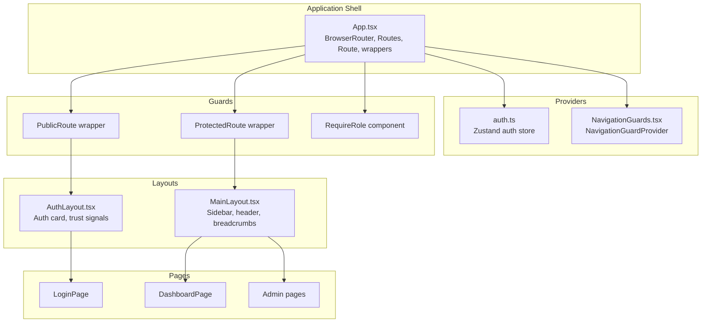
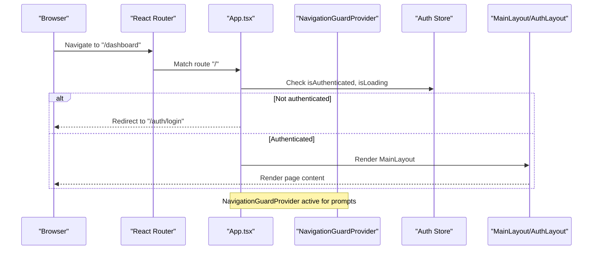
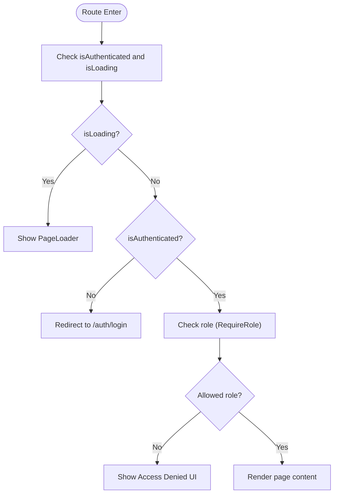
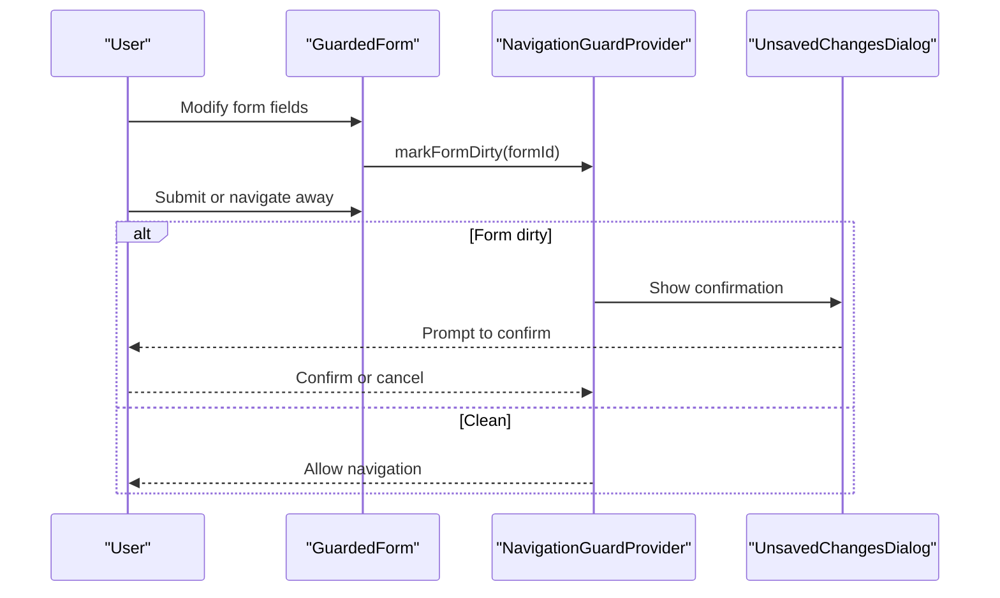
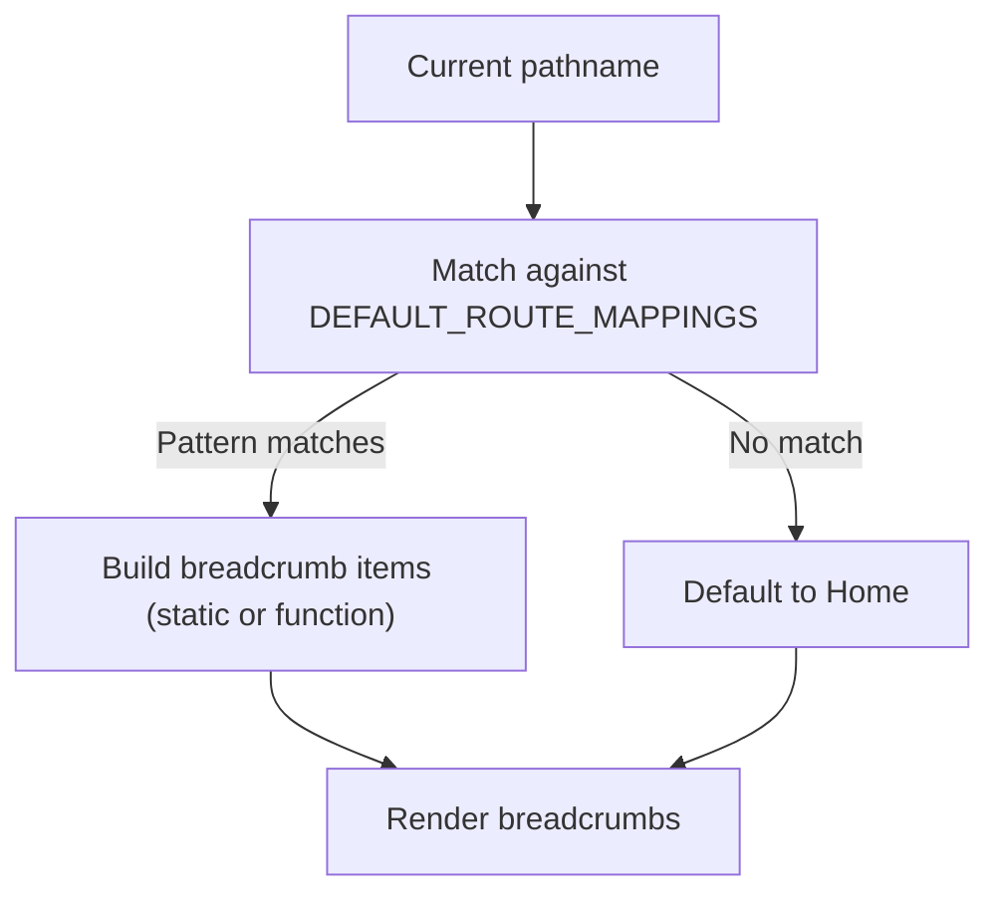
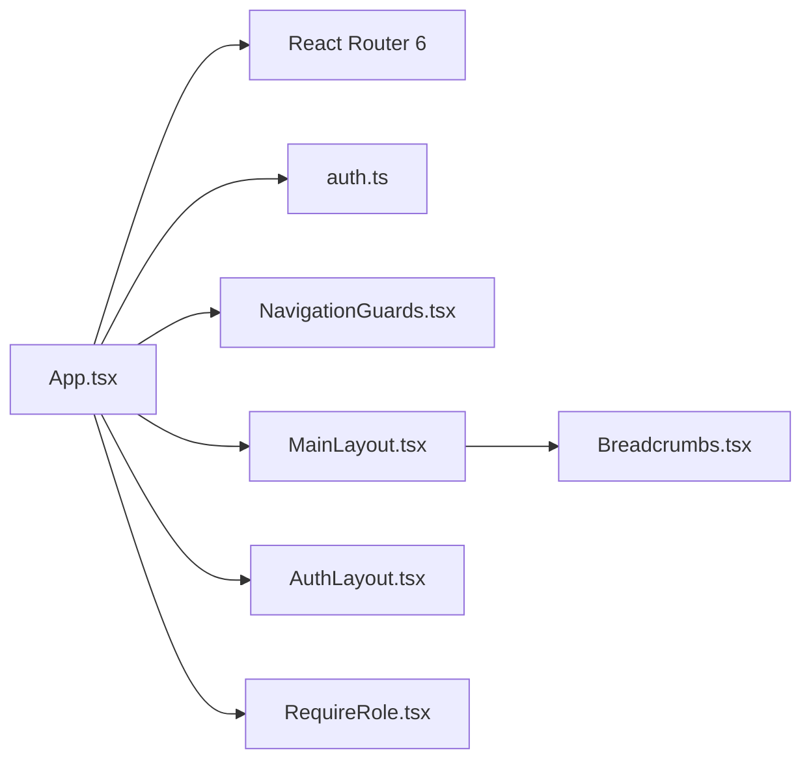

# Routing & Navigation

<cite>
**Referenced Files in This Document**
- [App.tsx](file://apps/web/src/App.tsx)
- [MainLayout.tsx](file://apps/web/src/components/layout/MainLayout.tsx)
- [AuthLayout.tsx](file://apps/web/src/components/layout/AuthLayout.tsx)
- [NavigationGuards.tsx](file://apps/web/src/components/ux/NavigationGuards.tsx)
- [RequireRole.tsx](file://apps/web/src/components/auth/RequireRole.tsx)
- [auth.ts](file://apps/web/src/stores/auth.ts)
- [Breadcrumbs.tsx](file://apps/web/src/components/ux/Breadcrumbs.tsx)
</cite>

## Table of Contents
1. [Introduction](#introduction)
2. [Project Structure](#project-structure)
3. [Core Components](#core-components)
4. [Architecture Overview](#architecture-overview)
5. [Detailed Component Analysis](#detailed-component-analysis)
6. [Dependency Analysis](#dependency-analysis)
7. [Performance Considerations](#performance-considerations)
8. [Troubleshooting Guide](#troubleshooting-guide)
9. [Conclusion](#conclusion)

## Introduction
This document explains the React Router 6-based routing and navigation system used in the web application. It covers the route structure (public auth routes, protected application routes, and administrative sections), the navigation guard system for authentication, authorization, and unsaved-changes prevention, the layout system with MainLayout and AuthLayout, and patterns for protected/public wrappers, role-based access control, breadcrumbs, active link highlighting, programmatic navigation, route parameters, and query management. It also details the provider-based navigation guard implementation and its integration with authentication state, along with nested routing, lazy loading, and route-based code splitting.

## Project Structure
The routing and navigation logic is centralized in the main application shell and layered with providers and layout components:
- Application shell defines routes, lazy-loading, and wrappers.
- Providers manage authentication state and navigation guards.
- Layouts define page rendering and navigation UI.
- Guards enforce role-based access and unauthorized redirects.

**Diagram sources**
- [App.tsx:189-282](file://apps/web/src/App.tsx#L189-L282)
- [auth.ts:54-172](file://apps/web/src/stores/auth.ts#L54-L172)
- [NavigationGuards.tsx:76-213](file://apps/web/src/components/ux/NavigationGuards.tsx#L76-L213)
- [MainLayout.tsx:72-365](file://apps/web/src/components/layout/MainLayout.tsx#L72-L365)
- [AuthLayout.tsx:9-89](file://apps/web/src/components/layout/AuthLayout.tsx#L9-L89)
- [RequireRole.tsx:34-59](file://apps/web/src/components/auth/RequireRole.tsx#L34-L59)

**Section sources**
- [App.tsx:189-282](file://apps/web/src/App.tsx#L189-L282)

## Core Components
- ProtectedRoute and PublicRoute wrappers: Gate access to protected/private areas based on authentication state.
- AuthLayout and MainLayout: Provide consistent page scaffolding for auth and application routes.
- NavigationGuardProvider: Centralized unsaved-changes prevention and navigation prompts.
- RequireRole: Enforces role-based access control for admin routes.
- Breadcrumbs: Computes and renders hierarchical navigation paths for application routes.
- Auth store: Provides authentication state and actions for login/logout and token lifecycle.

**Section sources**
- [App.tsx:149-187](file://apps/web/src/App.tsx#L149-L187)
- [AuthLayout.tsx:9-89](file://apps/web/src/components/layout/AuthLayout.tsx#L9-L89)
- [MainLayout.tsx:72-365](file://apps/web/src/components/layout/MainLayout.tsx#L72-L365)
- [NavigationGuards.tsx:76-213](file://apps/web/src/components/ux/NavigationGuards.tsx#L76-L213)
- [RequireRole.tsx:34-59](file://apps/web/src/components/auth/RequireRole.tsx#L34-L59)
- [Breadcrumbs.tsx:55-160](file://apps/web/src/components/ux/Breadcrumbs.tsx#L55-L160)
- [auth.ts:54-172](file://apps/web/src/stores/auth.ts#L54-L172)

## Architecture Overview
The routing architecture combines React Router 6 with custom wrappers and providers:
- BrowserRouter hosts all routes.
- Public routes are wrapped with PublicRoute and rendered inside AuthLayout.
- Protected routes are wrapped with ProtectedRoute and rendered inside MainLayout.
- NavigationGuardProvider wraps the router to enable unsaved-changes prevention.
- RequireRole enforces role-based access for admin sections.
- Breadcrumbs integrate with MainLayout to render contextual navigation.

**Diagram sources**
- [App.tsx:202-270](file://apps/web/src/App.tsx#L202-L270)
- [auth.ts:54-172](file://apps/web/src/stores/auth.ts#L54-L172)
- [NavigationGuards.tsx:76-213](file://apps/web/src/components/ux/NavigationGuards.tsx#L76-L213)

## Detailed Component Analysis

### Route Structure and Wrappers
- Public auth routes under "/auth" use PublicRoute and AuthLayout. They include login, registration, forgot-password, reset-password, email verification, and OAuth callback.
- Protected application routes under "/" use ProtectedRoute and MainLayout. They include dashboard, workspace, assessments, documents, analytics, billing, admin review, settings, help, and more.
- Public legal/help routes are exposed without wrappers.
- A fallback route redirects to the login page for unmatched paths.

Key patterns:
- Nested routes are defined under a single parent route with a layout wrapper.
- OAuth callback routes are declared before "/auth" to ensure correct matching.
- Feature flags conditionally render legacy modules.

**Section sources**
- [App.tsx:206-270](file://apps/web/src/App.tsx#L206-L270)

### Authentication and Authorization Guards
- ProtectedRoute: Blocks unauthenticated users and shows a loader while checking state. Redirects to login when not authenticated.
- PublicRoute: Redirects authenticated users to the dashboard to prevent access to login/register pages.
- RequireRole: Restricts admin pages to allowed roles and renders an access denied UI with a navigation fallback.

**Diagram sources**
- [App.tsx:149-187](file://apps/web/src/App.tsx#L149-L187)
- [RequireRole.tsx:34-59](file://apps/web/src/components/auth/RequireRole.tsx#L34-L59)

**Section sources**
- [App.tsx:149-187](file://apps/web/src/App.tsx#L149-L187)
- [RequireRole.tsx:34-59](file://apps/web/src/components/auth/RequireRole.tsx#L34-L59)

### Layout System: MainLayout and AuthLayout
- AuthLayout: Provides a centered card layout for auth pages with skip link, branding, trust signals, and footer.
- MainLayout: Provides a responsive sidebar, top header, breadcrumbs, user menu, and main content area. It computes active links and supports mobile sidebar toggling.

Active link highlighting:
- isActive computes whether a navigation item is active based on the current location, including special handling for the dashboard root.

Breadcrumbs integration:
- HeaderBreadcrumbs resolves route-specific breadcrumb items using DEFAULT_ROUTE_MAPPINGS and renders them in the header.

**Section sources**
- [AuthLayout.tsx:9-89](file://apps/web/src/components/layout/AuthLayout.tsx#L9-L89)
- [MainLayout.tsx:72-365](file://apps/web/src/components/layout/MainLayout.tsx#L72-L365)

### Navigation Guard Provider and Unsaved Changes Prevention
- NavigationGuardProvider registers/unregisters dirty forms, marks forms dirty/clean, and coordinates navigation prompts.
- UnsavedChangesDialog displays a confirmation dialog when leaving a page with unsaved changes.
- GuardedLink and GuardedForm integrate with the provider to intercept navigation and form submissions.
- useDirtyForm provides automatic dirty detection for forms with optional watch fields.

**Diagram sources**
- [NavigationGuards.tsx:467-513](file://apps/web/src/components/ux/NavigationGuards.tsx#L467-L513)
- [NavigationGuards.tsx:204-320](file://apps/web/src/components/ux/NavigationGuards.tsx#L204-L320)

**Section sources**
- [NavigationGuards.tsx:76-213](file://apps/web/src/components/ux/NavigationGuards.tsx#L76-L213)
- [NavigationGuards.tsx:326-393](file://apps/web/src/components/ux/NavigationGuards.tsx#L326-L393)

### Breadcrumb Implementation
- DEFAULT_ROUTE_MAPPINGS define regex patterns and breadcrumb arrays/functions for common routes.
- useRouteBreadcrumbs computes breadcrumbs from the current pathname and parameters.
- HeaderBreadcrumbs integrates with MainLayout to render breadcrumbs in the header.
- StandaloneBreadcrumbs enables breadcrumb rendering outside the provider context.

**Diagram sources**
- [Breadcrumbs.tsx:55-160](file://apps/web/src/components/ux/Breadcrumbs.tsx#L55-L160)
- [Breadcrumbs.tsx:502-520](file://apps/web/src/components/ux/Breadcrumbs.tsx#L502-L520)
- [MainLayout.tsx:48-70](file://apps/web/src/components/layout/MainLayout.tsx#L48-L70)

**Section sources**
- [Breadcrumbs.tsx:55-160](file://apps/web/src/components/ux/Breadcrumbs.tsx#L55-L160)
- [Breadcrumbs.tsx:502-520](file://apps/web/src/components/ux/Breadcrumbs.tsx#L502-L520)
- [MainLayout.tsx:48-70](file://apps/web/src/components/layout/MainLayout.tsx#L48-L70)

### Programmatic Navigation, Parameters, and Query Management
- Programmatic navigation is performed using useNavigate for logout and redirects.
- Route parameters are supported in nested routes (for example, questionnaire and document previews).
- Query string management is not explicitly implemented in the routing layer; applications can leverage useSearchParams from react-router-dom for query handling.

**Section sources**
- [MainLayout.tsx:79-82](file://apps/web/src/components/layout/MainLayout.tsx#L79-L82)
- [App.tsx:236-249](file://apps/web/src/App.tsx#L236-L249)

### Nested Routing, Lazy Loading, and Route-Based Code Splitting
- Routes are grouped under a single parent with a layout wrapper to achieve nested routing.
- Pages are lazy-loaded using React.lazy and Suspense fallbacks to improve initial load performance.
- Route-based code splitting is achieved by importing page components lazily and wrapping them in Suspense.

**Section sources**
- [App.tsx:23-136](file://apps/web/src/App.tsx#L23-L136)
- [App.tsx:202-270](file://apps/web/src/App.tsx#L202-L270)

## Dependency Analysis
The routing system depends on:
- React Router 6 for routing primitives.
- Zustand for authentication state management.
- Providers for navigation guards and conditional feature flags.
- Layout components for rendering UI shells.

**Diagram sources**
- [App.tsx:189-282](file://apps/web/src/App.tsx#L189-L282)
- [auth.ts:54-172](file://apps/web/src/stores/auth.ts#L54-L172)
- [NavigationGuards.tsx:76-213](file://apps/web/src/components/ux/NavigationGuards.tsx#L76-L213)
- [MainLayout.tsx:72-365](file://apps/web/src/components/layout/MainLayout.tsx#L72-L365)
- [AuthLayout.tsx:9-89](file://apps/web/src/components/layout/AuthLayout.tsx#L9-L89)
- [RequireRole.tsx:34-59](file://apps/web/src/components/auth/RequireRole.tsx#L34-L59)
- [Breadcrumbs.tsx:55-160](file://apps/web/src/components/ux/Breadcrumbs.tsx#L55-L160)

**Section sources**
- [App.tsx:189-282](file://apps/web/src/App.tsx#L189-L282)

## Performance Considerations
- Lazy loading pages reduces initial bundle size and improves perceived performance.
- Suspense fallback provides a smooth loading experience during code-split chunks.
- Conditional rendering of legacy modules via feature flags prevents unnecessary code from loading.

[No sources needed since this section provides general guidance]

## Troubleshooting Guide
Common issues and resolutions:
- Stuck loading state: ProtectedRoute includes a fallback that forces completion after a timeout to avoid indefinite loading.
- Unsaved changes prompt appears unexpectedly: Ensure forms register/unregister properly with useDirtyForm and GuardedForm.
- Role-based access denied: Verify user role and the allowed roles array in RequireRole.
- Breadcrumbs not updating: Confirm pathname and params are passed to useRouteBreadcrumbs and DEFAULT_ROUTE_MAPPINGS include the route pattern.

**Section sources**
- [App.tsx:153-161](file://apps/web/src/App.tsx#L153-L161)
- [NavigationGuards.tsx:340-393](file://apps/web/src/components/ux/NavigationGuards.tsx#L340-L393)
- [RequireRole.tsx:34-59](file://apps/web/src/components/auth/RequireRole.tsx#L34-L59)
- [Breadcrumbs.tsx:502-520](file://apps/web/src/components/ux/Breadcrumbs.tsx#L502-L520)

## Conclusion
The routing and navigation system leverages React Router 6 with custom wrappers and providers to deliver a secure, accessible, and user-friendly experience. Authentication and authorization guards protect sensitive areas, while navigation guards prevent accidental data loss. The layout system provides consistent UI scaffolding, and breadcrumbs enhance discoverability. Lazy loading and route-based code splitting optimize performance. Together, these patterns support scalable navigation across public, protected, and administrative sections.