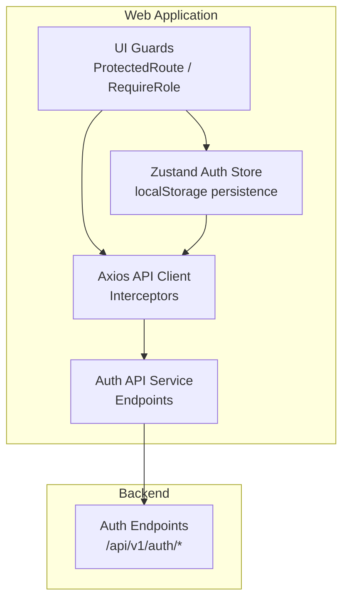
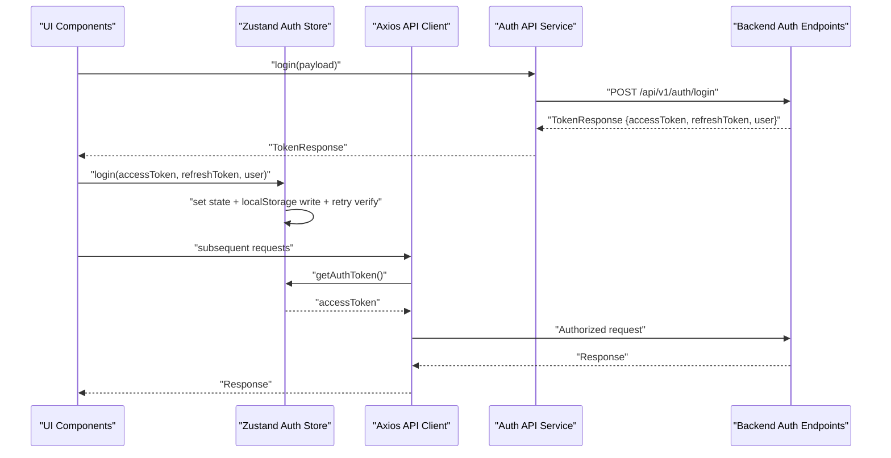
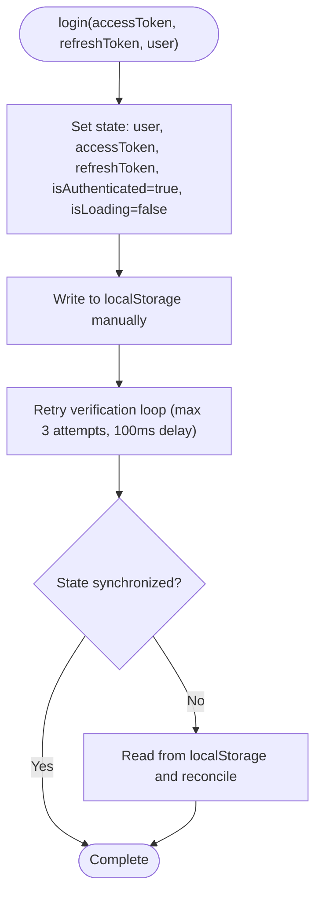
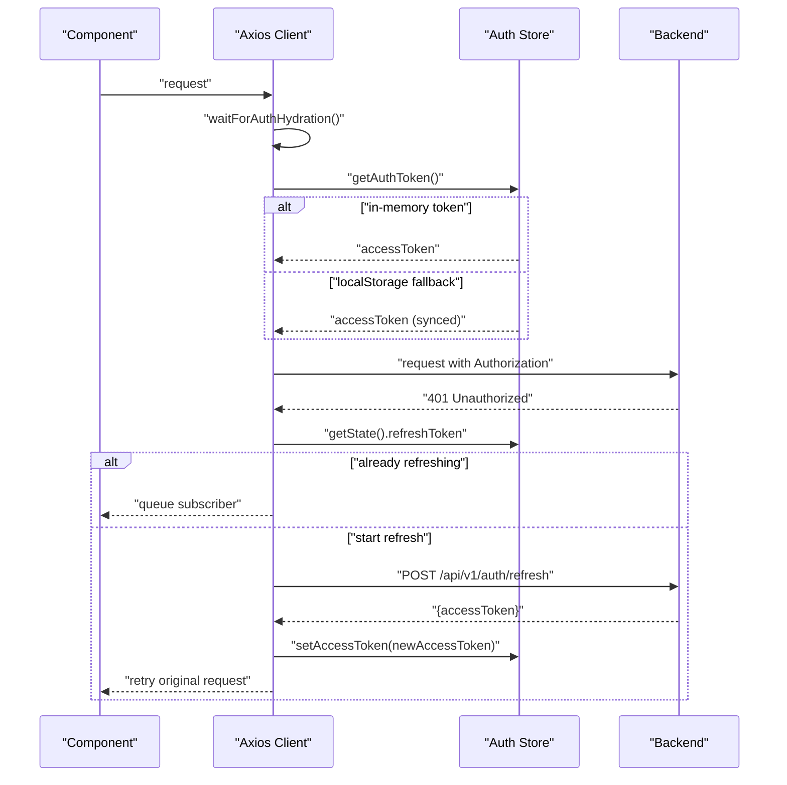
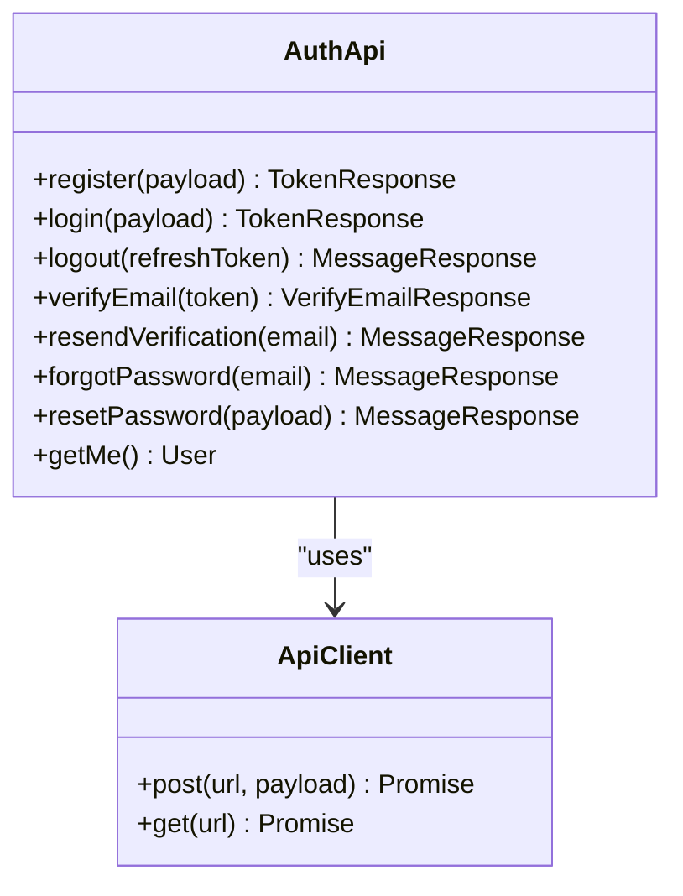
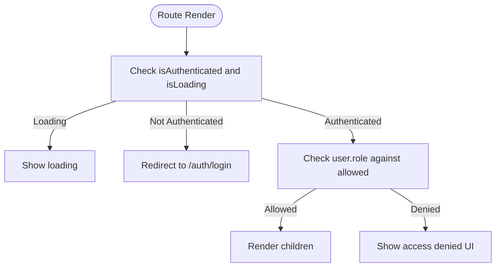
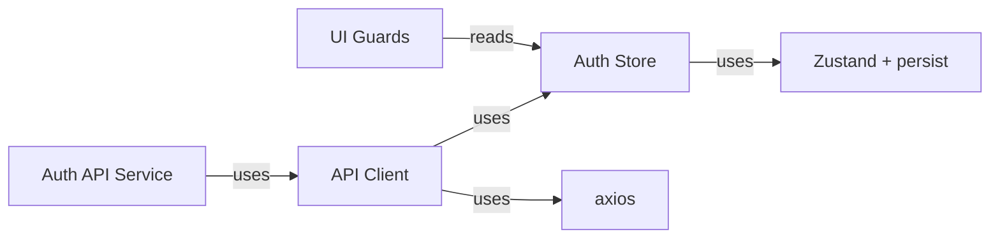

# Authentication Store

<cite>
**Referenced Files in This Document**
- [auth.ts](file://apps/web/src/stores/auth.ts)
- [auth.ts](file://apps/web/src/api/auth.ts)
- [client.ts](file://apps/web/src/api/client.ts)
- [auth.ts](file://apps/web/src/types/auth.ts)
- [App.tsx](file://apps/web/src/App.tsx)
- [RequireRole.tsx](file://apps/web/src/components/auth/RequireRole.tsx)
- [logger.ts](file://apps/web/src/lib/logger.ts)
</cite>

## Table of Contents
1. [Introduction](#introduction)
2. [Project Structure](#project-structure)
3. [Core Components](#core-components)
4. [Architecture Overview](#architecture-overview)
5. [Detailed Component Analysis](#detailed-component-analysis)
6. [Dependency Analysis](#dependency-analysis)
7. [Performance Considerations](#performance-considerations)
8. [Troubleshooting Guide](#troubleshooting-guide)
9. [Conclusion](#conclusion)

## Introduction
This document explains the authentication store implementation using Zustand with localStorage persistence in the web application. It covers JWT token management (access and refresh tokens), user session lifecycle, role-based access control, token synchronization strategies, retry mechanisms, state verification patterns, security considerations for storing short-lived access tokens in localStorage versus httpOnly refresh cookies, automatic token refresh on hydration, error handling during authentication flows, and integration with backend authentication endpoints. It also includes examples of login/logout flows, token validation, and state persistence patterns, along with trade-offs and security implications of SPA authentication approaches.

## Project Structure
The authentication system spans three primary areas:
- Store: Zustand store with localStorage persistence and hydration logic
- API Layer: Axios client with interceptors for auth token injection and refresh
- UI Guards: Route guards and role-based access control components

**Diagram sources**
- [auth.ts:54-172](file://apps/web/src/stores/auth.ts#L54-L172)
- [client.ts:95-326](file://apps/web/src/api/client.ts#L95-L326)
- [auth.ts:17-98](file://apps/web/src/api/auth.ts#L17-L98)
- [App.tsx:149-187](file://apps/web/src/App.tsx#L149-L187)
- [RequireRole.tsx:34-59](file://apps/web/src/components/auth/RequireRole.tsx#L34-L59)

**Section sources**
- [auth.ts:1-173](file://apps/web/src/stores/auth.ts#L1-L173)
- [client.ts:1-326](file://apps/web/src/api/client.ts#L1-L326)
- [auth.ts:1-101](file://apps/web/src/api/auth.ts#L1-L101)
- [App.tsx:1-284](file://apps/web/src/App.tsx#L1-L284)
- [RequireRole.tsx:1-60](file://apps/web/src/components/auth/RequireRole.tsx#L1-L60)

## Core Components
- Zustand Auth Store: Manages user, tokens, authentication state, and provides actions for login, logout, and token updates. Implements localStorage synchronization and retry verification.
- Axios API Client: Centralized HTTP client with request/response interceptors for injecting Authorization headers, CSRF protection, and automatic token refresh on 401 errors.
- Auth API Service: Typed wrappers around backend authentication endpoints (login, register, logout, refresh, verify-email, etc.).
- UI Guards: Route-level guards to protect pages and enforce role-based access control.

Key responsibilities:
- Persist tokens to localStorage and verify synchronization
- Automatically refresh access tokens on hydration when a refresh token is present
- Handle 401 Unauthorized by refreshing tokens or logging out
- Enforce role-based access control for protected routes

**Section sources**
- [auth.ts:37-52](file://apps/web/src/stores/auth.ts#L37-L52)
- [client.ts:108-133](file://apps/web/src/api/client.ts#L108-L133)
- [auth.ts:17-98](file://apps/web/src/api/auth.ts#L17-L98)
- [RequireRole.tsx:34-59](file://apps/web/src/components/auth/RequireRole.tsx#L34-L59)

## Architecture Overview
The authentication flow integrates the store, API client, and backend endpoints. The store hydrates from localStorage, the API client injects tokens and refreshes them on demand, and UI guards protect routes.

**Diagram sources**
- [auth.ts:32-38](file://apps/web/src/api/auth.ts#L32-L38)
- [auth.ts:71-123](file://apps/web/src/stores/auth.ts#L71-L123)
- [client.ts:161-198](file://apps/web/src/api/client.ts#L161-L198)
- [client.ts:277-304](file://apps/web/src/api/client.ts#L277-L304)

## Detailed Component Analysis

### Zustand Auth Store
The store encapsulates:
- State: user, accessToken, refreshToken, isAuthenticated, isLoading
- Actions: setUser, setAccessToken, setTokens, login, logout, setLoading
- Persistence: localStorage-backed with Zustand persist middleware
- Hydration: onRehydrateStorage triggers automatic refresh when a refresh token is present but no access token

Token synchronization strategy:
- Immediate in-memory update on set()
- Manual localStorage write to ensure availability across module boundaries
- Retry verification loop to confirm state synchronization
- Fallback to localStorage read if synchronization fails

Automatic refresh on hydration:
- If refresh token exists and access token does not, POST to refresh endpoint with credentials
- On success, update access token; on failure, clear auth state and redirect to login

Security note:
- Access tokens are short-lived; refresh tokens are httpOnly (not accessible via JS)
- Pattern accepted for SPAs with short-lived JWTs and httpOnly refresh tokens

**Diagram sources**
- [auth.ts:71-123](file://apps/web/src/stores/auth.ts#L71-L123)

**Section sources**
- [auth.ts:37-52](file://apps/web/src/stores/auth.ts#L37-L52)
- [auth.ts:54-172](file://apps/web/src/stores/auth.ts#L54-L172)

### Axios API Client and Interceptors
The client centralizes:
- Base URL resolution per environment
- Request interceptor: waits for auth hydration, injects Authorization header, adds CSRF token for state-changing requests
- Response interceptor: unwraps API response wrapper, handles CSRF token errors, handles 401 Unauthorized by refreshing tokens or logging out

Token retrieval fallback:
- First tries in-memory state
- Falls back to localStorage read and syncs back to in-memory state

Token refresh flow:
- Prevents concurrent refreshes with a refresh flag and subscriber queue
- On success, notifies queued subscribers and retries original request
- On failure, clears auth state and redirects to login

**Diagram sources**
- [client.ts:139-158](file://apps/web/src/api/client.ts#L139-L158)
- [client.ts:108-133](file://apps/web/src/api/client.ts#L108-L133)
- [client.ts:244-313](file://apps/web/src/api/client.ts#L244-L313)

**Section sources**
- [client.ts:14-31](file://apps/web/src/api/client.ts#L14-L31)
- [client.ts:108-133](file://apps/web/src/api/client.ts#L108-L133)
- [client.ts:139-158](file://apps/web/src/api/client.ts#L139-L158)
- [client.ts:244-313](file://apps/web/src/api/client.ts#L244-L313)

### Auth API Service
Provides typed wrappers for backend authentication endpoints:
- register, login, logout, verifyEmail, resendVerification, forgotPassword, resetPassword, getMe
- Uses the centralized apiClient with credentials enabled

**Diagram sources**
- [auth.ts:17-98](file://apps/web/src/api/auth.ts#L17-L98)
- [client.ts:95-102](file://apps/web/src/api/client.ts#L95-L102)

**Section sources**
- [auth.ts:17-98](file://apps/web/src/api/auth.ts#L17-L98)

### UI Guards and Role-Based Access Control
- ProtectedRoute: Blocks unauthenticated users and enforces a maximum loading timeout
- RequireRole: Restricts access to routes based on user role, rendering an access denied UI when unauthorized

**Diagram sources**
- [App.tsx:149-187](file://apps/web/src/App.tsx#L149-L187)
- [RequireRole.tsx:34-59](file://apps/web/src/components/auth/RequireRole.tsx#L34-L59)

**Section sources**
- [App.tsx:149-187](file://apps/web/src/App.tsx#L149-L187)
- [RequireRole.tsx:34-59](file://apps/web/src/components/auth/RequireRole.tsx#L34-L59)

### Types and Contracts
- User: id, email, role, optional name
- TokenResponse: accessToken, refreshToken, expiresIn, tokenType, user
- Payloads and responses for auth operations

**Section sources**
- [auth.ts:5-48](file://apps/web/src/types/auth.ts#L5-L48)

## Dependency Analysis
- The store depends on Zustand and the persist middleware for localStorage
- The API client depends on the store for token retrieval and on axios for HTTP
- The Auth API service depends on the API client
- UI guards depend on the store for authentication state and on routing libraries

**Diagram sources**
- [auth.ts:17-18](file://apps/web/src/stores/auth.ts#L17-L18)
- [client.ts:10-12](file://apps/web/src/api/client.ts#L10-L12)
- [auth.ts:5-6](file://apps/web/src/api/auth.ts#L5-L6)

**Section sources**
- [auth.ts:17-18](file://apps/web/src/stores/auth.ts#L17-L18)
- [client.ts:10-12](file://apps/web/src/api/client.ts#L10-L12)
- [auth.ts:5-6](file://apps/web/src/api/auth.ts#L5-L6)

## Performance Considerations
- Minimize localStorage reads/writes by relying on in-memory state; manual writes are used as a safety net
- Retry verification reduces race conditions during rapid state transitions
- Request interceptor waits for hydration to avoid unnecessary 401 errors on initial load
- Token refresh uses a subscriber queue to avoid redundant refresh calls
- Loading timeouts in route guards prevent indefinite blocking

## Troubleshooting Guide
Common issues and resolutions:
- State synchronization failures: The store performs up to three retry attempts to synchronize state with localStorage; if unsuccessful, it forces a reload from localStorage and reconciles state
- 401 Unauthorized errors: The client attempts to refresh tokens using the refresh token; if refresh fails or no refresh token exists, it logs out and redirects to the login page
- CSRF token errors: On 403 errors with CSRF-related codes, the client fetches a fresh CSRF token and retries the request
- Missing tokens on initial load: The request interceptor waits for hydration to ensure tokens are available before sending requests
- Logging out: The logout action clears tokens and user data; backend logout invalidates the refresh token

**Section sources**
- [auth.ts:98-123](file://apps/web/src/stores/auth.ts#L98-L123)
- [client.ts:244-313](file://apps/web/src/api/client.ts#L244-L313)
- [client.ts:222-242](file://apps/web/src/api/client.ts#L222-L242)
- [client.ts:139-158](file://apps/web/src/api/client.ts#L139-L158)
- [auth.ts:43-47](file://apps/web/src/api/auth.ts#L43-L47)

## Conclusion
The authentication store leverages Zustand with localStorage persistence to provide a robust, resilient SPA authentication model. It synchronizes state reliably, refreshes tokens automatically on hydration and on-demand, and integrates seamlessly with the Axios client’s interceptors. Role-based access control is enforced at the UI level, while security best practices such as short-lived access tokens and httpOnly refresh tokens mitigate common SPA risks. The design balances simplicity, reliability, and security, with clear retry and fallback mechanisms to handle edge cases.