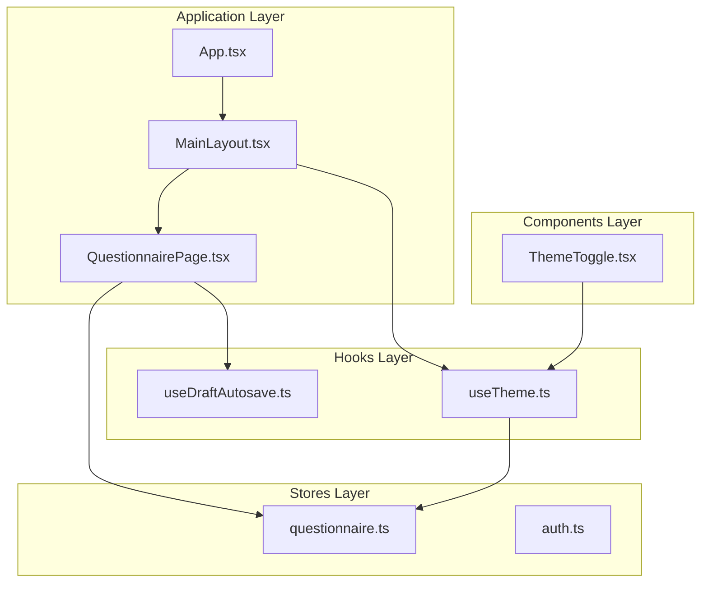
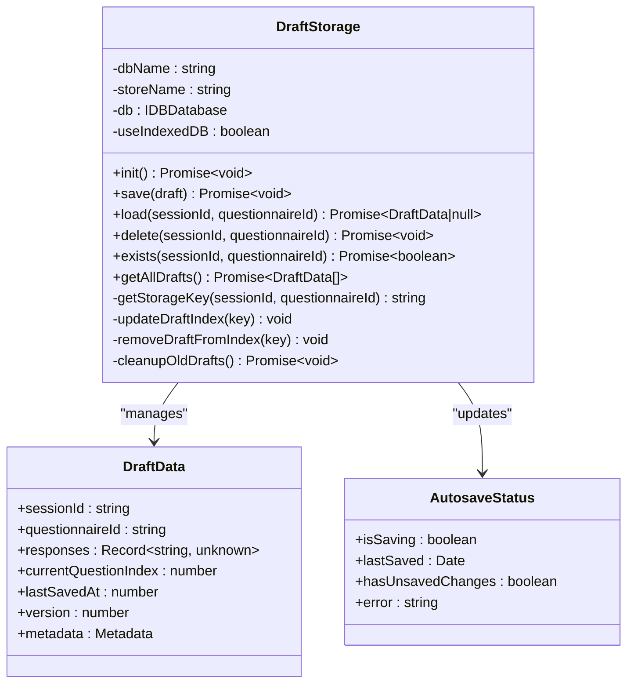
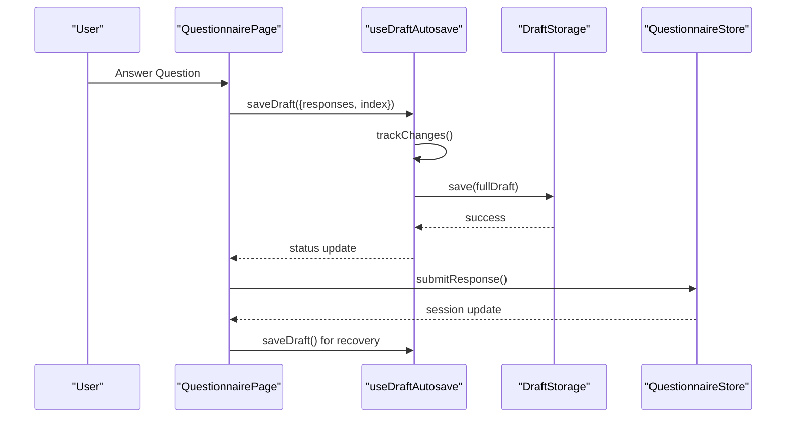
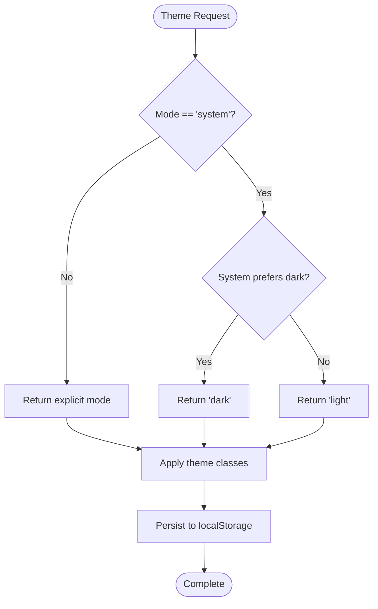
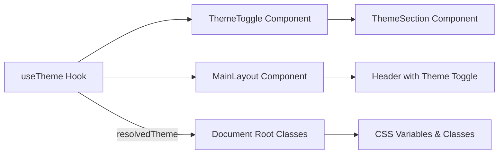
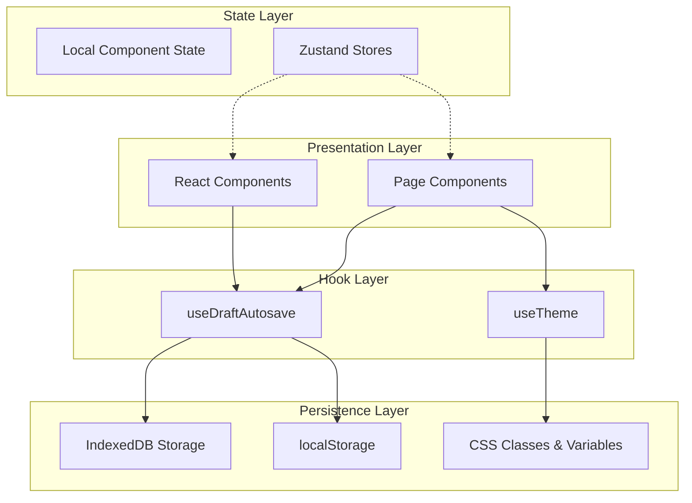
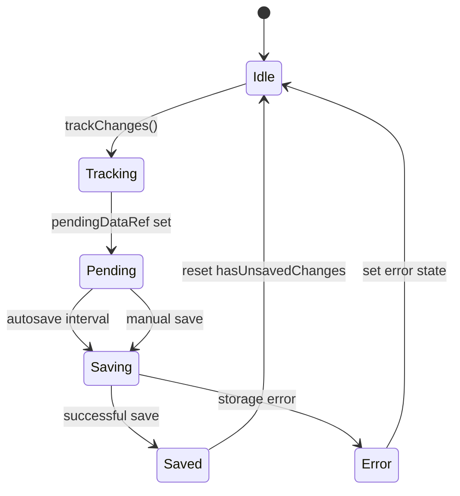
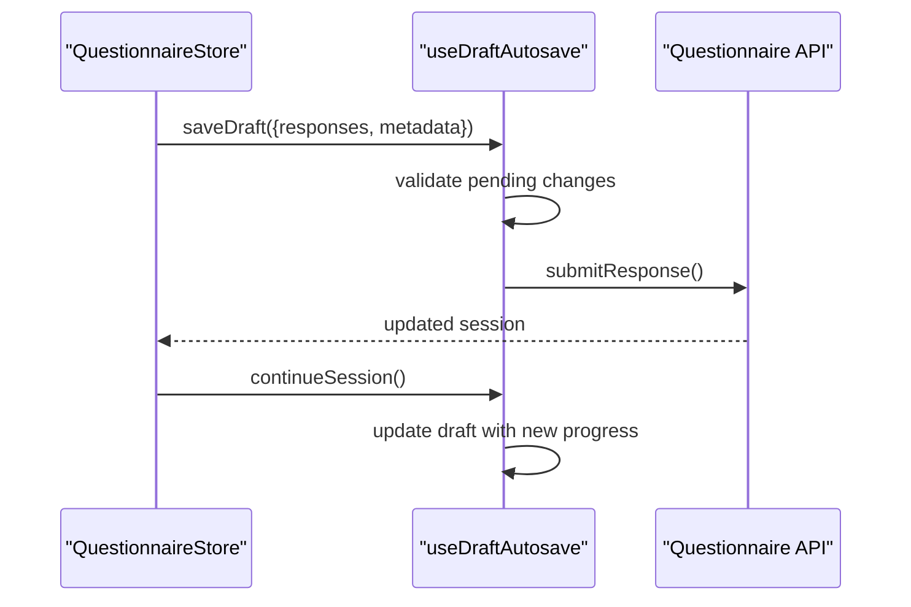
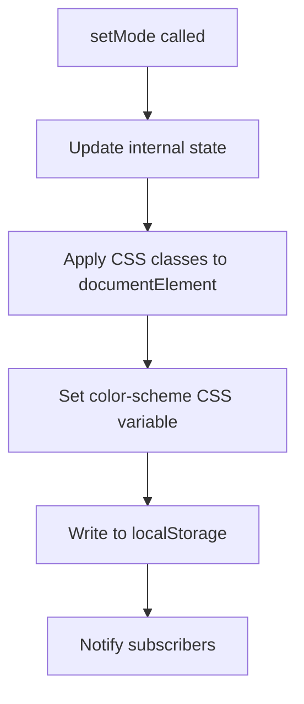
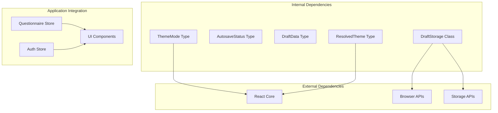

# Custom Hooks

<cite>
**Referenced Files in This Document**
- [useDraftAutosave.ts](file://apps/web/src/hooks/useDraftAutosave.ts)
- [useDraftAutosave.test.ts](file://apps/web/src/hooks/useDraftAutosave.test.ts)
- [useTheme.ts](file://apps/web/src/hooks/useTheme.ts)
- [useTheme.test.ts](file://apps/web/src/hooks/useTheme.test.ts)
- [questionnaire.ts](file://apps/web/src/stores/questionnaire.ts)
- [auth.ts](file://apps/web/src/stores/auth.ts)
- [QuestionnairePage.tsx](file://apps/web/src/pages/questionnaire/QuestionnairePage.tsx)
- [ThemeToggle.tsx](file://apps/web/src/components/settings/ThemeToggle.tsx)
- [MainLayout.tsx](file://apps/web/src/components/layout/MainLayout.tsx)
- [App.tsx](file://apps/web/src/App.tsx)
</cite>

## Table of Contents
1. [Introduction](#introduction)
2. [Project Structure](#project-structure)
3. [Core Components](#core-components)
4. [Architecture Overview](#architecture-overview)
5. [Detailed Component Analysis](#detailed-component-analysis)
6. [Dependency Analysis](#dependency-analysis)
7. [Performance Considerations](#performance-considerations)
8. [Troubleshooting Guide](#troubleshooting-guide)
9. [Conclusion](#conclusion)

## Introduction
This document provides comprehensive documentation for two custom React hooks that implement advanced state management patterns beyond traditional centralized stores:
- useDraftAutosave: Implements autosave with debouncing, conflict avoidance, and recovery for questionnaire responses using IndexedDB with localStorage fallback
- useTheme: Manages theme preferences with localStorage persistence and dynamic styling application

The hooks demonstrate modern React patterns including composition, memoization, cleanup, and integration with external state stores. They address common challenges like prop drilling prevention, state synchronization, and user experience concerns such as draft recovery and theme consistency.

## Project Structure
The hooks are organized under the web application's hooks directory and integrate with the broader application architecture:

**Diagram sources**
- [App.tsx:189-284](file://apps/web/src/App.tsx#L189-L284)
- [MainLayout.tsx:72-366](file://apps/web/src/components/layout/MainLayout.tsx#L72-L366)
- [QuestionnairePage.tsx:48-750](file://apps/web/src/pages/questionnaire/QuestionnairePage.tsx#L48-L750)
- [useDraftAutosave.ts:261-460](file://apps/web/src/hooks/useDraftAutosave.ts#L261-L460)
- [useTheme.ts:31-103](file://apps/web/src/hooks/useTheme.ts#L31-L103)

**Section sources**
- [App.tsx:189-284](file://apps/web/src/App.tsx#L189-L284)
- [MainLayout.tsx:72-366](file://apps/web/src/components/layout/MainLayout.tsx#L72-L366)
- [QuestionnairePage.tsx:48-750](file://apps/web/src/pages/questionnaire/QuestionnairePage.tsx#L48-L750)

## Core Components
This section covers the two primary hooks and their integration patterns.

### useDraftAutosave Hook
The autosave hook provides comprehensive draft management for questionnaire responses with the following capabilities:

**Key Features:**
- **Dual Storage Backend**: IndexedDB with automatic localStorage fallback for compatibility
- **Debounced Autosave**: 30-second intervals with pending change tracking
- **Conflict Resolution**: Versioned drafts with recovery validation
- **Recovery Mechanisms**: Draft existence checking and recovery banners
- **Lifecycle Management**: Cleanup handlers for page unload and component unmount

**Storage Architecture:**

**Diagram sources**
- [useDraftAutosave.ts:71-241](file://apps/web/src/hooks/useDraftAutosave.ts#L71-L241)
- [useDraftAutosave.ts:19-38](file://apps/web/src/hooks/useDraftAutosave.ts#L19-L38)

**Integration Pattern:**
The hook integrates seamlessly with the questionnaire flow through composition:

**Diagram sources**
- [QuestionnairePage.tsx:87-97](file://apps/web/src/pages/questionnaire/QuestionnairePage.tsx#L87-L97)
- [useDraftAutosave.ts:304-353](file://apps/web/src/hooks/useDraftAutosave.ts#L304-L353)

**Section sources**
- [useDraftAutosave.ts:19-460](file://apps/web/src/hooks/useDraftAutosave.ts#L19-L460)
- [QuestionnairePage.tsx:87-97](file://apps/web/src/pages/questionnaire/QuestionnairePage.tsx#L87-L97)

### useTheme Hook
The theme management hook provides comprehensive theme state with system preference awareness:

**Core Functionality:**
- **Multi-mode Support**: Light, dark, and system modes
- **System Preference Detection**: Automatic detection via MediaQuery
- **Persistent Storage**: localStorage-backed preference persistence
- **Dynamic Application**: Real-time DOM class and CSS variable updates
- **Cleanup Management**: Proper event listener cleanup

**Theme Resolution Flow:**

**Diagram sources**
- [useTheme.ts:61-81](file://apps/web/src/hooks/useTheme.ts#L61-L81)
- [useTheme.ts:84-93](file://apps/web/src/hooks/useTheme.ts#L84-L93)

**Component Integration:**
The theme hook integrates through dedicated UI components:

**Diagram sources**
- [ThemeToggle.tsx:30-85](file://apps/web/src/components/settings/ThemeToggle.tsx#L30-L85)
- [MainLayout.tsx:330-337](file://apps/web/src/components/layout/MainLayout.tsx#L330-L337)
- [useTheme.ts:70-81](file://apps/web/src/hooks/useTheme.ts#L70-L81)

**Section sources**
- [useTheme.ts:31-103](file://apps/web/src/hooks/useTheme.ts#L31-L103)
- [ThemeToggle.tsx:30-116](file://apps/web/src/components/settings/ThemeToggle.tsx#L30-L116)
- [MainLayout.tsx:330-337](file://apps/web/src/components/layout/MainLayout.tsx#L330-L337)

## Architecture Overview
The hooks operate within a layered architecture that separates concerns while enabling seamless integration:

**Diagram sources**
- [useDraftAutosave.ts:287-301](file://apps/web/src/hooks/useDraftAutosave.ts#L287-L301)
- [useTheme.ts:49-58](file://apps/web/src/hooks/useTheme.ts#L49-L58)

**Section sources**
- [useDraftAutosave.ts:287-301](file://apps/web/src/hooks/useDraftAutosave.ts#L287-L301)
- [useTheme.ts:49-58](file://apps/web/src/hooks/useTheme.ts#L49-L58)

## Detailed Component Analysis

### useDraftAutosave Implementation Details

#### Storage Abstraction
The hook implements a sophisticated storage abstraction that automatically falls back from IndexedDB to localStorage:

**Storage Strategy:**
- **Primary**: IndexedDB for robust offline persistence
- **Fallback**: localStorage for environments without IndexedDB support
- **Cleanup**: Automatic cleanup of old drafts to prevent quota exhaustion
- **Index Management**: Maintains draft index for efficient enumeration

**Debouncing and Change Tracking:**

**Diagram sources**
- [useDraftAutosave.ts:416-419](file://apps/web/src/hooks/useDraftAutosave.ts#L416-L419)
- [useDraftAutosave.ts:393-413](file://apps/web/src/hooks/useDraftAutosave.ts#L393-L413)

#### Conflict Resolution Patterns
The hook implements several strategies to handle concurrent modifications:

**Version Management:**
- **Draft Versioning**: Ensures compatibility across storage backends
- **Timestamp Validation**: Prevents recovery of stale drafts (7-day limit)
- **Metadata Tracking**: Maintains questionnaire context and progress

**Integration with Questionnaire Flow:**
The autosave hook coordinates with the questionnaire store to maintain consistency:

**Diagram sources**
- [QuestionnairePage.tsx:163-201](file://apps/web/src/pages/questionnaire/QuestionnairePage.tsx#L163-L201)
- [useDraftAutosave.ts:304-353](file://apps/web/src/hooks/useDraftAutosave.ts#L304-L353)

**Section sources**
- [useDraftAutosave.ts:71-241](file://apps/web/src/hooks/useDraftAutosave.ts#L71-L241)
- [useDraftAutosave.ts:393-446](file://apps/web/src/hooks/useDraftAutosave.ts#L393-L446)
- [QuestionnairePage.tsx:163-201](file://apps/web/src/pages/questionnaire/QuestionnairePage.tsx#L163-L201)

### useTheme Implementation Details

#### System Preference Integration
The theme hook provides intelligent system preference detection:

**Media Query Management:**
- **Automatic Detection**: Uses `window.matchMedia('(prefers-color-scheme: dark)')`
- **Real-time Updates**: Listens for system preference changes
- **Cleanup Protocol**: Properly removes event listeners on component unmount

**Persistence Strategy:**
- **LocalStorage Integration**: Persists user preferences across sessions
- **Validation Logic**: Ignores invalid stored values and falls back to defaults
- **Graceful Degradation**: Handles server-side rendering scenarios

**DOM Manipulation:**
The hook applies theme changes through direct DOM manipulation for optimal performance:

**Diagram sources**
- [useTheme.ts:70-81](file://apps/web/src/hooks/useTheme.ts#L70-L81)
- [useTheme.ts:84-93](file://apps/web/src/hooks/useTheme.ts#L84-L93)

**Section sources**
- [useTheme.ts:31-103](file://apps/web/src/hooks/useTheme.ts#L31-L103)
- [useTheme.ts:108-126](file://apps/web/src/hooks/useTheme.ts#L108-L126)

### Hook Composition Patterns

#### Dependency Injection Approach
Both hooks demonstrate effective dependency injection patterns:

**useDraftAutosave Dependencies:**
- **External Dependencies**: Storage backend, timer management, lifecycle events
- **Internal Dependencies**: Pending change tracking, status management
- **Configuration**: Options object for customization

**useTheme Dependencies:**
- **Browser APIs**: localStorage, matchMedia, documentElement
- **React Internals**: useState, useEffect, useCallback, useMemo
- **External State**: System preference changes

**Composition Benefits:**
- **Testability**: Easy to mock dependencies in unit tests
- **Reusability**: Hooks can be composed within larger components
- **Separation of Concerns**: Business logic isolated from presentation

**Section sources**
- [useDraftAutosave.ts:261-270](file://apps/web/src/hooks/useDraftAutosave.ts#L261-L270)
- [useTheme.ts:31-40](file://apps/web/src/hooks/useTheme.ts#L31-L40)

## Dependency Analysis
The hooks have minimal external dependencies and integrate cleanly with the application ecosystem:

**Diagram sources**
- [useDraftAutosave.ts:13](file://apps/web/src/hooks/useDraftAutosave.ts#L13)
- [useTheme.ts:6](file://apps/web/src/hooks/useTheme.ts#L6)

**Section sources**
- [useDraftAutosave.ts:13-13](file://apps/web/src/hooks/useDraftAutosave.ts#L13-L13)
- [useTheme.ts:6-6](file://apps/web/src/hooks/useTheme.ts#L6-L6)

## Performance Considerations

### Memory Management
Both hooks implement comprehensive cleanup strategies:

**useDraftAutosave Cleanup:**
- **Timer Cleanup**: Proper interval clearing on component unmount
- **Event Listener Cleanup**: Removal of beforeunload handlers
- **Storage Cleanup**: Singleton pattern prevents multiple storage instances

**useTheme Cleanup:**
- **Media Query Cleanup**: Event listeners removed on unmount
- **State Cleanup**: No lingering closures or references

### Optimization Strategies
**Memoization Patterns:**
- **useMemo**: Used for resolved theme computation
- **useCallback**: Memoized event handlers and setter functions
- **useRef**: Efficient change tracking without triggering re-renders

**Storage Optimization:**
- **Lazy Initialization**: Storage instances created only when needed
- **Batch Operations**: Combined state updates to minimize re-renders
- **Efficient Indexing**: Draft index for quick enumeration

### Scalability Considerations
- **Storage Limits**: Automatic cleanup prevents quota exhaustion
- **Network Independence**: Works without network connectivity
- **Memory Footprint**: Minimal state overhead per component instance

## Troubleshooting Guide

### Common Issues and Solutions

#### Draft Autosave Problems
**Issue**: Drafts not saving or loading
- **Cause**: Storage quota exceeded or browser storage disabled
- **Solution**: Check browser storage settings and clear old drafts
- **Prevention**: Monitor storage usage and implement cleanup strategies

**Issue**: Conflicting drafts during concurrent editing
- **Cause**: Multiple tabs or windows modifying the same draft
- **Solution**: Implement version-based conflict resolution
- **Prevention**: Use session-based isolation for collaborative scenarios

#### Theme Management Problems
**Issue**: Theme not applying correctly
- **Cause**: CSS specificity conflicts or timing issues
- **Solution**: Ensure proper CSS class precedence and timing
- **Prevention**: Use documentElement for guaranteed application

**Issue**: Theme preference not persisting
- **Cause**: Browser privacy settings blocking localStorage
- **Solution**: Implement fallback mechanisms and user feedback
- **Prevention**: Graceful degradation to system preference detection

### Debugging Strategies
**Development Tools:**
- **React DevTools**: Inspect hook state and dependencies
- **Browser DevTools**: Monitor storage operations and network requests
- **Console Logging**: Strategic logging for async operations

**Testing Approaches:**
- **Unit Tests**: Isolated hook testing with mocked dependencies
- **Integration Tests**: End-to-end flow testing with real stores
- **Visual Regression**: Theme consistency across different browsers

**Section sources**
- [useDraftAutosave.test.ts:67-307](file://apps/web/src/hooks/useDraftAutosave.test.ts#L67-L307)
- [useTheme.test.ts:37-245](file://apps/web/src/hooks/useTheme.test.ts#L37-L245)

## Conclusion
The custom hooks demonstrate sophisticated state management patterns that extend beyond traditional store architectures. The useDraftAutosave hook provides robust autosave functionality with IndexedDB support and comprehensive recovery mechanisms, while the useTheme hook offers intelligent theme management with system preference awareness and persistent storage.

These implementations showcase modern React patterns including composition, memoization, cleanup, and integration with external state stores. They effectively address common challenges like prop drilling prevention, state synchronization, and user experience concerns, providing a solid foundation for scalable application development.

The hooks are designed for maintainability, testability, and performance, with comprehensive error handling and graceful degradation strategies. Their modular architecture enables easy integration with existing applications while maintaining clean separation of concerns.