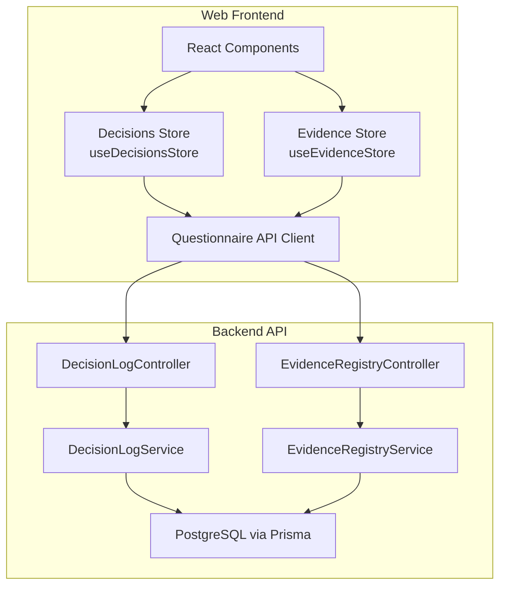
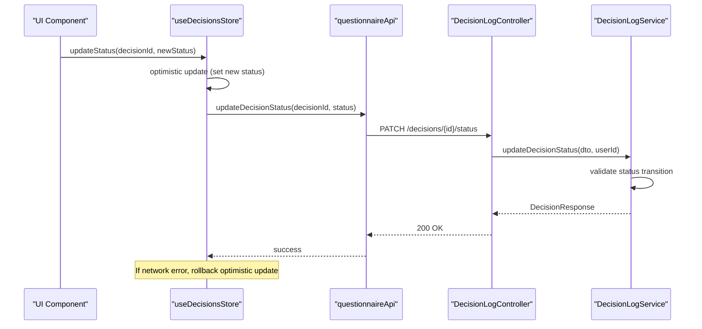
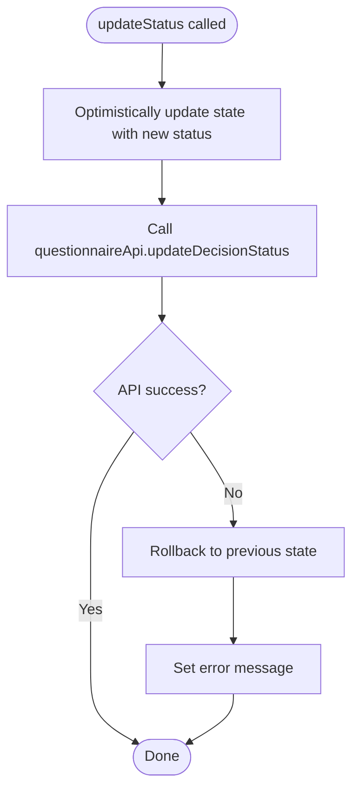
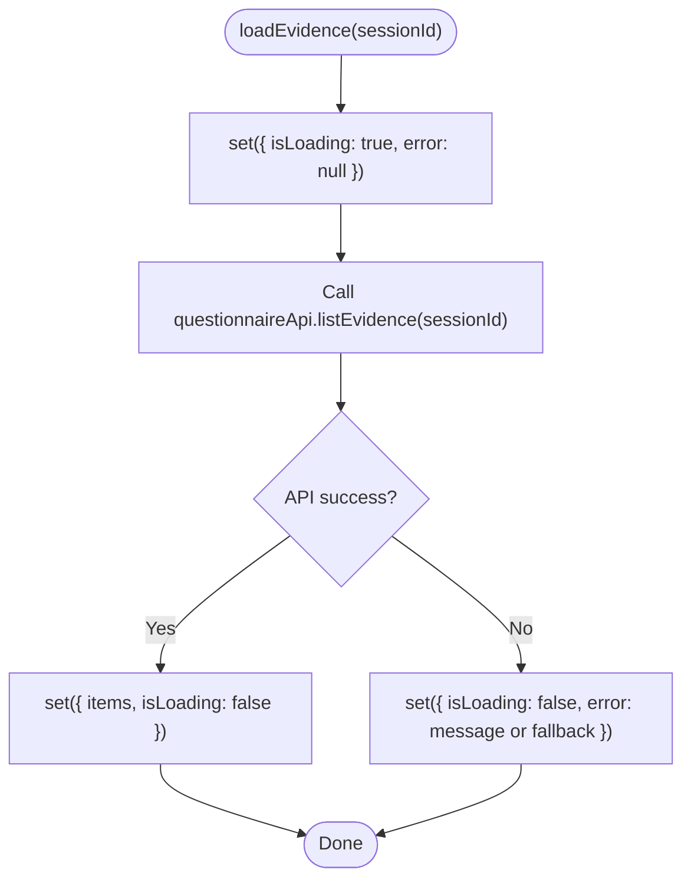
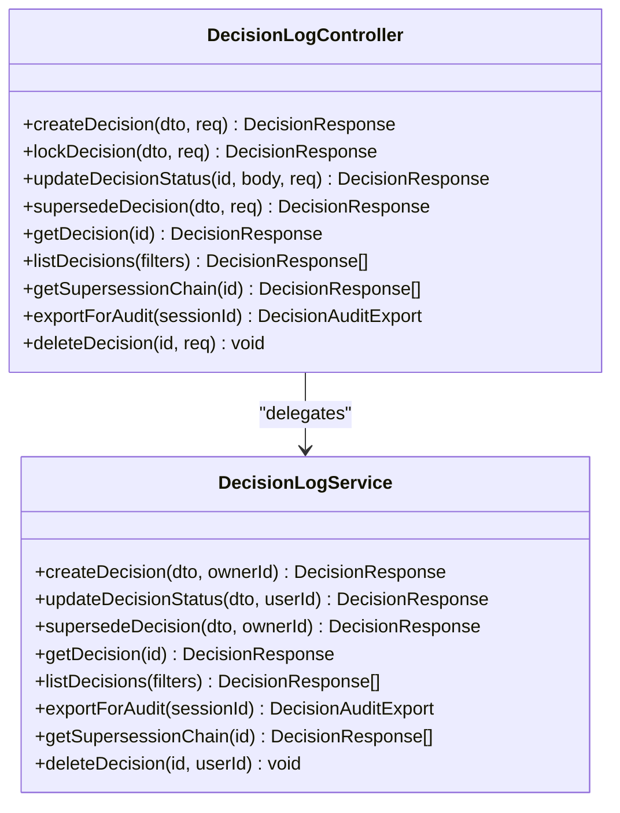
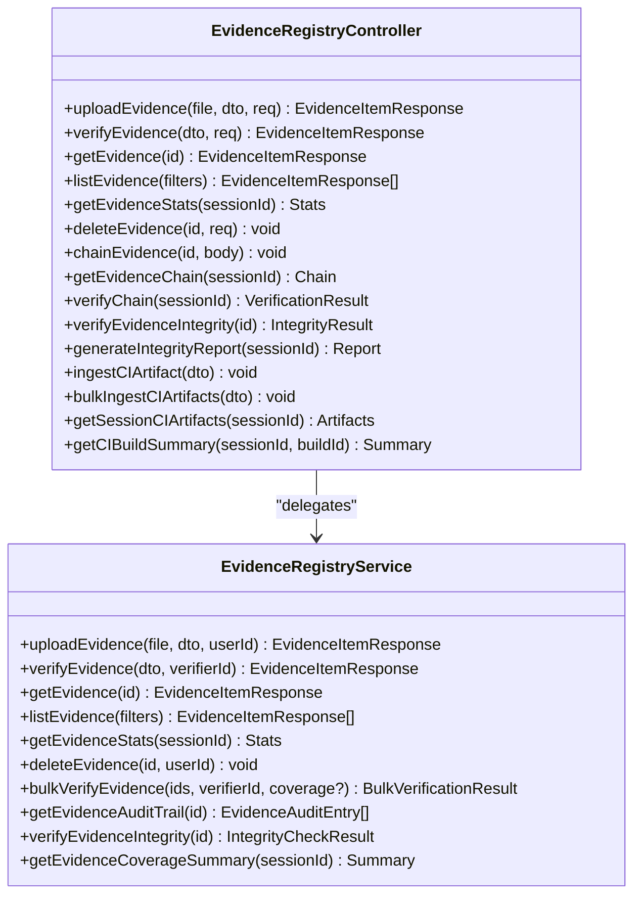
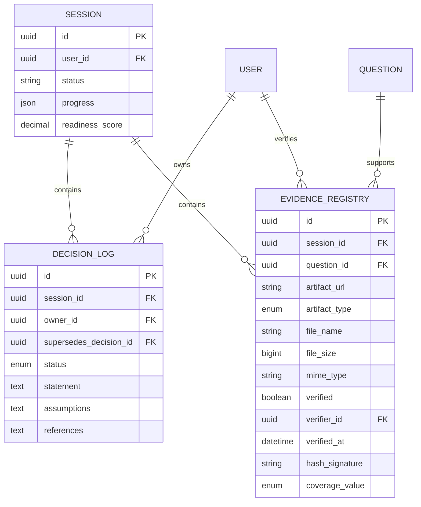
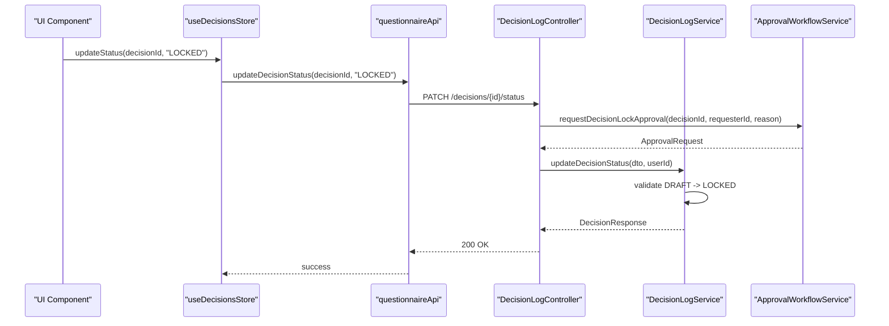
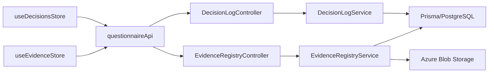

# Data Stores

<cite>
**Referenced Files in This Document**
- [decisions.ts](file://apps/web/src/stores/decisions.ts)
- [evidence.ts](file://apps/web/src/stores/evidence.ts)
- [questionnaire.ts](file://apps/web/src/api/questionnaire.ts)
- [decision-log.service.ts](file://apps/api/src/modules/decision-log/decision-log.service.ts)
- [decision-log.controller.ts](file://apps/api/src/modules/decision-log/decision-log.controller.ts)
- [evidence-registry.service.ts](file://apps/api/src/modules/evidence-registry/evidence-registry.service.ts)
- [evidence-registry.controller.ts](file://apps/api/src/modules/evidence-registry/evidence-registry.controller.ts)
- [decision.dto.ts](file://apps/api/src/modules/decision-log/dto/decision.dto.ts)
- [evidence.dto.ts](file://apps/api/src/modules/evidence-registry/dto/evidence.dto.ts)
- [schema.prisma](file://prisma/schema.prisma)
- [decisions.test.ts](file://apps/web/src/stores/decisions.test.ts)
- [evidence.test.ts](file://apps/web/src/stores/evidence.test.ts)
- [approval-workflow.service.ts](file://apps/api/src/modules/decision-log/approval-workflow.service.ts)
</cite>

## Table of Contents
1. [Introduction](#introduction)
2. [Project Structure](#project-structure)
3. [Core Components](#core-components)
4. [Architecture Overview](#architecture-overview)
5. [Detailed Component Analysis](#detailed-component-analysis)
6. [Dependency Analysis](#dependency-analysis)
7. [Performance Considerations](#performance-considerations)
8. [Troubleshooting Guide](#troubleshooting-guide)
9. [Conclusion](#conclusion)

## Introduction
This document describes the specialized data stores that manage decisions and evidence workflows for document review processes, approval workflows, and administrative controls. It explains the state structure for document reviews, evidence collection, and governance workflows, and covers integration patterns with backend APIs for CRUD operations, optimistic updates, and batch processing. It also addresses store composition, data normalization, relationship management between decisions and evidence entities, and caching and pagination strategies for large datasets.

## Project Structure
The data stores are implemented in the frontend using Zustand and integrated with backend services via a typed API client. The backend exposes REST endpoints for decisions and evidence, enforcing append-only decision semantics and comprehensive evidence lifecycle management including integrity verification and CI artifact ingestion.

**Diagram sources**
- [decisions.ts:26-90](file://apps/web/src/stores/decisions.ts#L26-L90)
- [evidence.ts:34-67](file://apps/web/src/stores/evidence.ts#L34-L67)
- [questionnaire.ts:177-476](file://apps/web/src/api/questionnaire.ts#L177-L476)
- [decision-log.controller.ts:40-279](file://apps/api/src/modules/decision-log/decision-log.controller.ts#L40-L279)
- [decision-log.service.ts:38-396](file://apps/api/src/modules/decision-log/decision-log.service.ts#L38-L396)
- [evidence-registry.controller.ts:61-463](file://apps/api/src/modules/evidence-registry/evidence-registry.controller.ts#L61-L463)
- [evidence-registry.service.ts:96-953](file://apps/api/src/modules/evidence-registry/evidence-registry.service.ts#L96-L953)

**Section sources**
- [decisions.ts:1-91](file://apps/web/src/stores/decisions.ts#L1-L91)
- [evidence.ts:1-68](file://apps/web/src/stores/evidence.ts#L1-L68)
- [questionnaire.ts:177-476](file://apps/web/src/api/questionnaire.ts#L177-L476)

## Core Components
- Decisions Store: Manages document review decisions with optimistic status updates, error handling, and loading states. Integrates with backend endpoints for creation, listing, and status transitions.
- Evidence Store: Manages evidence artifacts with listing, statistics aggregation, and error handling. Supports evidence verification and coverage updates.
- Backend Services: Provide append-only decision management and comprehensive evidence lifecycle, including integrity checks and CI artifact ingestion.

Key capabilities:
- Optimistic UI updates with rollback on failure for decision status changes.
- Evidence statistics and coverage summaries for governance reporting.
- Append-only decision workflow with supersession for audits.
- Batch verification for evidence items with transactional safety.

**Section sources**
- [decisions.ts:14-24](file://apps/web/src/stores/decisions.ts#L14-L24)
- [evidence.ts:23-32](file://apps/web/src/stores/evidence.ts#L23-L32)
- [decision-log.service.ts:19-36](file://apps/api/src/modules/decision-log/decision-log.service.ts#L19-L36)
- [evidence-registry.service.ts:86-95](file://apps/api/src/modules/evidence-registry/evidence-registry.service.ts#L86-L95)

## Architecture Overview
The frontend stores encapsulate state and orchestrate API calls. The backend controllers expose REST endpoints mapped to domain services that enforce business rules and maintain audit trails. Data models define relationships between sessions, decisions, and evidence.

**Diagram sources**
- [decisions.ts:65-87](file://apps/web/src/stores/decisions.ts#L65-L87)
- [questionnaire.ts:431-446](file://apps/web/src/api/questionnaire.ts#L431-L446)
- [decision-log.controller.ts:102-122](file://apps/api/src/modules/decision-log/decision-log.controller.ts#L102-L122)
- [decision-log.service.ts:87-123](file://apps/api/src/modules/decision-log/decision-log.service.ts#L87-L123)

## Detailed Component Analysis

### Decisions Store
The decisions store manages a list of decisions per session, with loading, error, and CRUD operations. It implements optimistic updates for status changes with automatic rollback on failure.

**Diagram sources**
- [decisions.ts:65-87](file://apps/web/src/stores/decisions.ts#L65-L87)

Key behaviors:
- Optimistic status update with immediate UI feedback.
- Network error handling with fallback to previous state.
- Loading state management during fetches.
- Reset to clean state.

Integration points:
- listDecisions(sessionId) for initial load.
- createDecision(sessionId, statement, assumptions?) for new decisions.
- updateDecisionStatus(decisionId, status) for status transitions.

**Section sources**
- [decisions.ts:14-24](file://apps/web/src/stores/decisions.ts#L14-L24)
- [decisions.ts:31-46](file://apps/web/src/stores/decisions.ts#L31-L46)
- [decisions.ts:48-63](file://apps/web/src/stores/decisions.ts#L48-L63)
- [decisions.ts:65-87](file://apps/web/src/stores/decisions.ts#L65-L87)
- [decisions.ts:89-90](file://apps/web/src/stores/decisions.ts#L89-L90)
- [questionnaire.ts:395-446](file://apps/web/src/api/questionnaire.ts#L395-L446)

### Evidence Store
The evidence store manages evidence items per session, with statistics aggregation and error handling. It supports listing, statistics retrieval, and reset operations.

**Diagram sources**
- [evidence.ts:40-55](file://apps/web/src/stores/evidence.ts#L40-L55)

Key behaviors:
- Loading state during fetches.
- Error handling with structured message extraction.
- Statistics loading with warning fallback.
- Reset to clean state.

Integration points:
- listEvidence(sessionId) for items.
- getEvidenceStats(sessionId) for aggregated stats.

**Section sources**
- [evidence.ts:23-32](file://apps/web/src/stores/evidence.ts#L23-L32)
- [evidence.ts:40-55](file://apps/web/src/stores/evidence.ts#L40-L55)
- [evidence.ts:57-64](file://apps/web/src/stores/evidence.ts#L57-L64)
- [evidence.ts:66-67](file://apps/web/src/stores/evidence.ts#L66-L67)
- [questionnaire.ts:367-393](file://apps/web/src/api/questionnaire.ts#L367-L393)

### Backend Decision Management
The backend enforces an append-only decision workflow with strict status transitions and audit logging. It supports supersession for amending locked decisions and provides export functionality for compliance.

**Diagram sources**
- [decision-log.service.ts:49-396](file://apps/api/src/modules/decision-log/decision-log.service.ts#L49-L396)
- [decision-log.controller.ts:61-277](file://apps/api/src/modules/decision-log/decision-log.controller.ts#L61-L277)

Business rules:
- DRAFT -> LOCKED transitions only.
- Locked decisions cannot be modified; supersede to amend.
- Audit logs created for all state changes.
- Export includes supersession chain for compliance.

**Section sources**
- [decision-log.service.ts:19-36](file://apps/api/src/modules/decision-log/decision-log.service.ts#L19-L36)
- [decision-log.service.ts:87-123](file://apps/api/src/modules/decision-log/decision-log.service.ts#L87-L123)
- [decision-log.service.ts:135-188](file://apps/api/src/modules/decision-log/decision-log.service.ts#L135-L188)
- [decision-log.controller.ts:68-156](file://apps/api/src/modules/decision-log/decision-log.controller.ts#L68-L156)

### Backend Evidence Management
The backend manages evidence artifacts with integrity verification, coverage updates, and CI artifact ingestion. It supports bulk verification and comprehensive audit trails.

**Diagram sources**
- [evidence-registry.service.ts:165-953](file://apps/api/src/modules/evidence-registry/evidence-registry.service.ts#L165-L953)
- [evidence-registry.controller.ts:135-462](file://apps/api/src/modules/evidence-registry/evidence-registry.controller.ts#L135-L462)

Key features:
- SHA-256 hashing and Azure Blob Storage integration.
- Coverage level transitions enforced (non-decreasing).
- Bulk verification with transactional updates.
- Audit trail combining upload, verification, and decision events.
- CI artifact ingestion and integrity reporting.

**Section sources**
- [evidence-registry.service.ts:165-245](file://apps/api/src/modules/evidence-registry/evidence-registry.service.ts#L165-L245)
- [evidence-registry.service.ts:292-324](file://apps/api/src/modules/evidence-registry/evidence-registry.service.ts#L292-L324)
- [evidence-registry.service.ts:551-620](file://apps/api/src/modules/evidence-registry/evidence-registry.service.ts#L551-L620)
- [evidence-registry.controller.ts:146-171](file://apps/api/src/modules/evidence-registry/evidence-registry.controller.ts#L146-L171)

### Data Models and Relationships
The Prisma schema defines the core entities and their relationships, ensuring referential integrity and efficient querying.

**Diagram sources**
- [schema.prisma:512-706](file://prisma/schema.prisma#L512-L706)

Relationship management:
- Decisions belong to sessions and owners; supersession links create a chain.
- Evidence belongs to sessions and questions; verification links to verifiers.
- Coverage updates cascade to response entities via service logic.

**Section sources**
- [schema.prisma:676-706](file://prisma/schema.prisma#L676-L706)
- [schema.prisma:635-674](file://prisma/schema.prisma#L635-L674)
- [schema.prisma:512-560](file://prisma/schema.prisma#L512-L560)

### Approval Workflow Integration
The approval workflow service implements a two-person rule for high-risk decisions and integrates with decision locking.

**Diagram sources**
- [approval-workflow.service.ts:336-364](file://apps/api/src/modules/decision-log/approval-workflow.service.ts#L336-L364)
- [decision-log.controller.ts:102-122](file://apps/api/src/modules/decision-log/decision-log.controller.ts#L102-L122)
- [decision-log.service.ts:87-123](file://apps/api/src/modules/decision-log/decision-log.service.ts#L87-L123)

**Section sources**
- [approval-workflow.service.ts:108-160](file://apps/api/src/modules/decision-log/approval-workflow.service.ts#L108-L160)
- [approval-workflow.service.ts:172-243](file://apps/api/src/modules/decision-log/approval-workflow.service.ts#L172-L243)

## Dependency Analysis
The frontend depends on the questionnaire API client, which maps to backend controllers and services. The backend services depend on Prisma for persistence and external systems for storage and integrity verification.

**Diagram sources**
- [decisions.ts:1-3](file://apps/web/src/stores/decisions.ts#L1-L3)
- [evidence.ts:1-3](file://apps/web/src/stores/evidence.ts#L1-L3)
- [questionnaire.ts:1-6](file://apps/web/src/api/questionnaire.ts#L1-L6)
- [decision-log.controller.ts:40-41](file://apps/api/src/modules/decision-log/decision-log.controller.ts#L40-L41)
- [evidence-registry.controller.ts:61-66](file://apps/api/src/modules/evidence-registry/evidence-registry.controller.ts#L61-L66)
- [decision-log.service.ts](file://apps/api/src/modules/decision-log/decision-log.service.ts#L41)
- [evidence-registry.service.ts:98-133](file://apps/api/src/modules/evidence-registry/evidence-registry.service.ts#L98-L133)

**Section sources**
- [questionnaire.ts:177-476](file://apps/web/src/api/questionnaire.ts#L177-L476)
- [decision-log.controller.ts:40-279](file://apps/api/src/modules/decision-log/decision-log.controller.ts#L40-L279)
- [evidence-registry.controller.ts:61-463](file://apps/api/src/modules/evidence-registry/evidence-registry.controller.ts#L61-L463)

## Performance Considerations
- Pagination and limits:
  - Decision listing uses take: 1000.
  - Evidence listing uses take: 500.
  - Evidence statistics uses take: 500.
- Bulk operations:
  - Evidence bulk verification uses batch updates and transactions to minimize round trips.
- Caching strategies:
  - Frontend stores cache lists and stats locally; consider adding selective caching layers (e.g., React Query) for repeated queries.
  - Backend caches could leverage connection pooling and Prisma query optimization.
- Memory optimization:
  - Large evidence lists should be paginated and virtualized in the UI.
  - Consider lazy-loading evidence details and audit trails on demand.

[No sources needed since this section provides general guidance]

## Troubleshooting Guide
Common issues and resolutions:
- Decision status update failures:
  - Optimistic update rollback occurs automatically on network errors.
  - Ensure the decision is in DRAFT status before attempting to lock.
- Evidence verification failures:
  - Verify file type and size constraints.
  - Check Azure Blob Storage configuration and connectivity.
- Audit and compliance:
  - Use decision export and evidence audit trail endpoints for compliance reporting.
  - Validate supersession chains for locked decisions.

**Section sources**
- [decisions.ts:65-87](file://apps/web/src/stores/decisions.ts#L65-L87)
- [decision-log.service.ts:99-110](file://apps/api/src/modules/decision-log/decision-log.service.ts#L99-L110)
- [evidence-registry.service.ts:420-434](file://apps/api/src/modules/evidence-registry/evidence-registry.service.ts#L420-L434)
- [evidence-registry.controller.ts:280-365](file://apps/api/src/modules/evidence-registry/evidence-registry.controller.ts#L280-L365)

## Conclusion
The data stores provide a robust foundation for managing decisions and evidence workflows with strong backend enforcement of append-only semantics, integrity verification, and comprehensive audit trails. The frontend stores offer optimistic updates and resilient error handling, while the backend services ensure governance compliance and scalability through bulk operations and transactional safety.