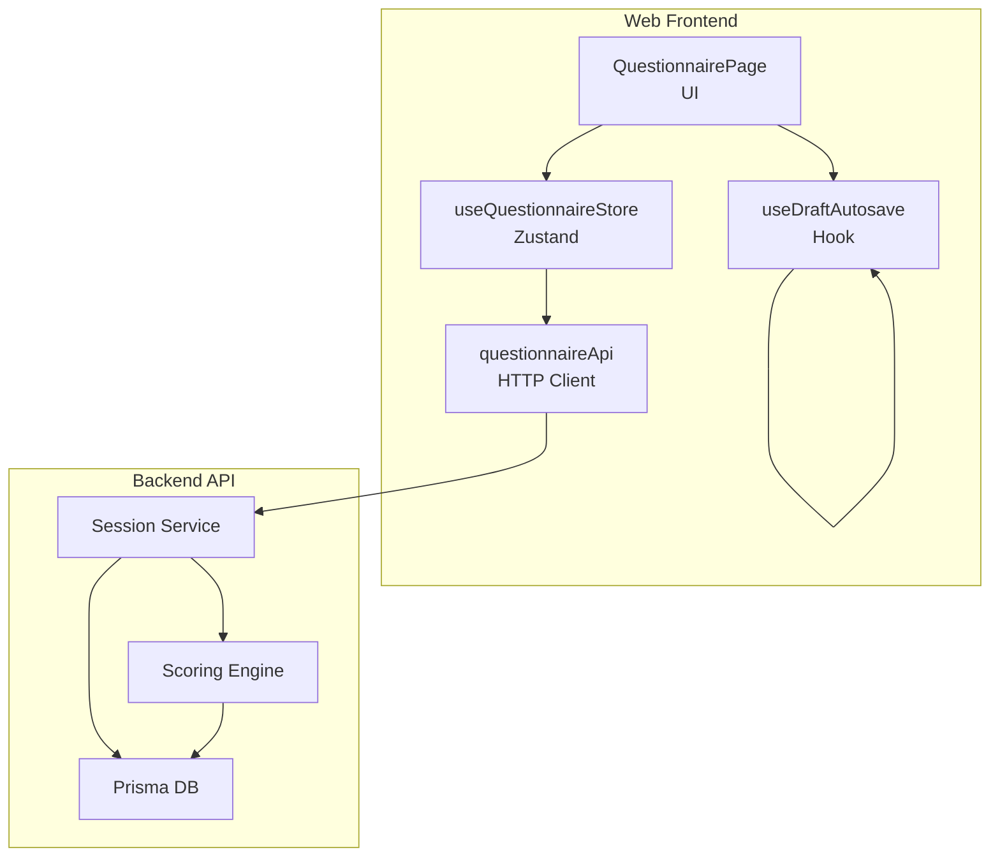
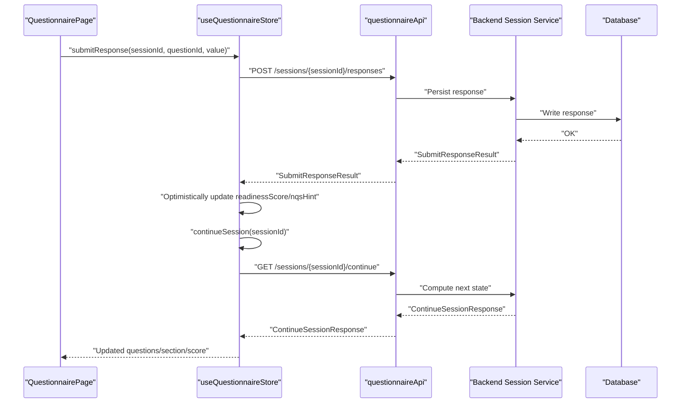
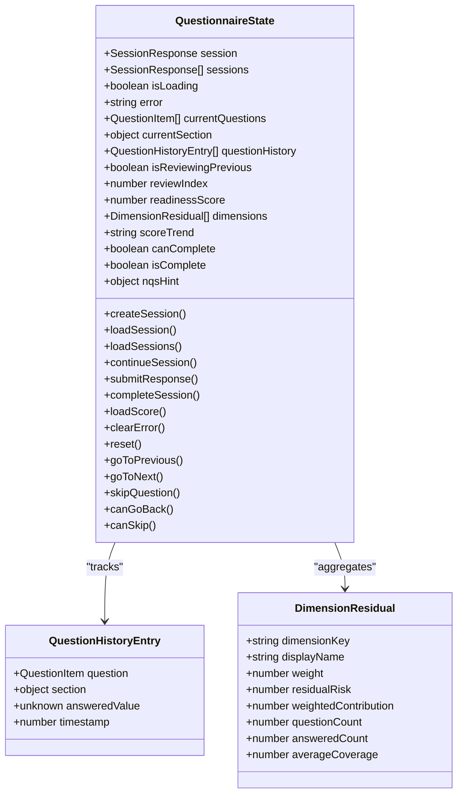
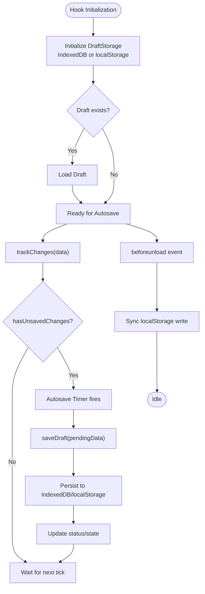
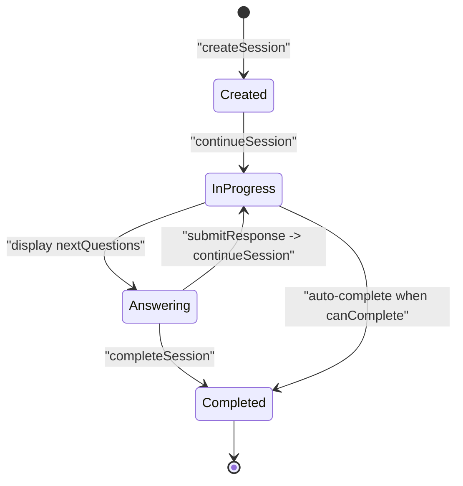
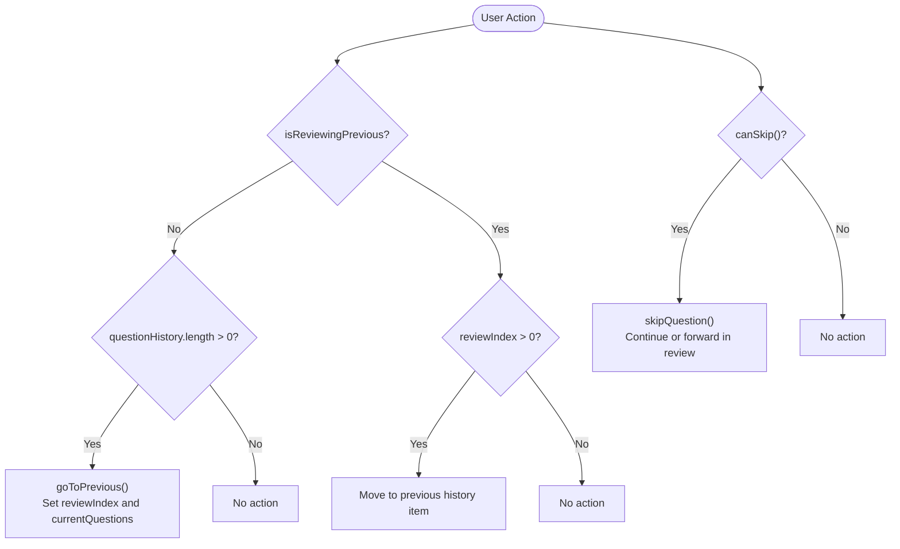
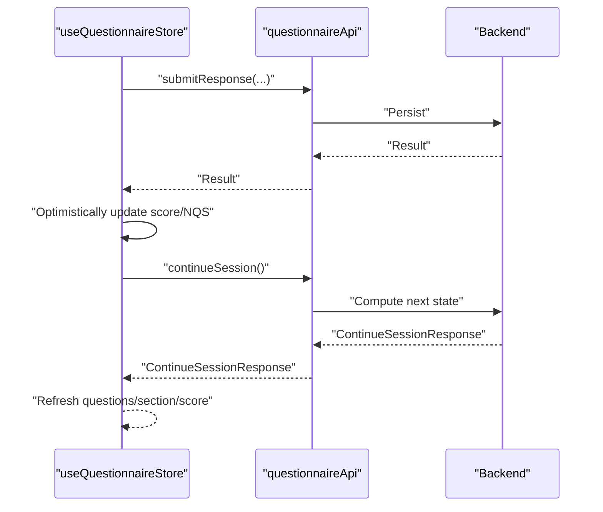
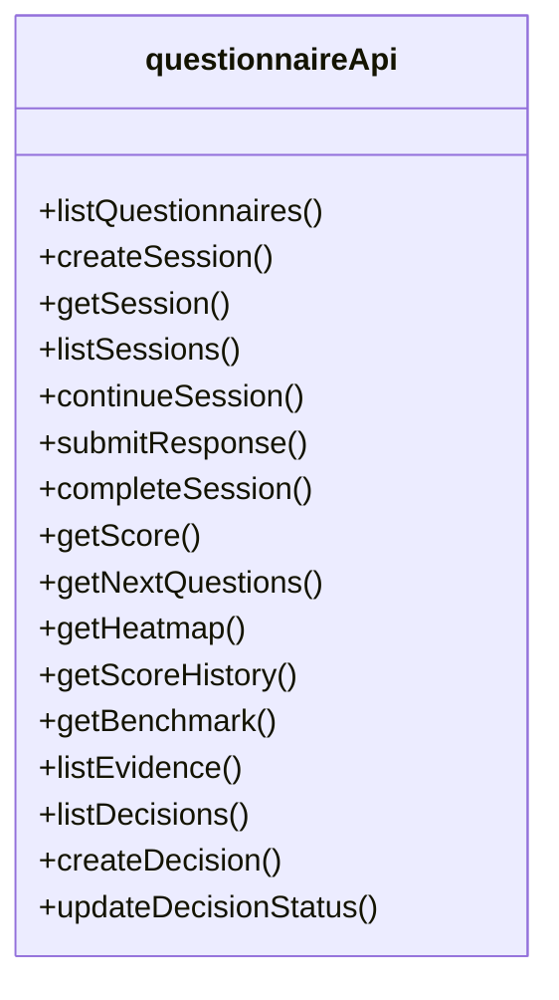
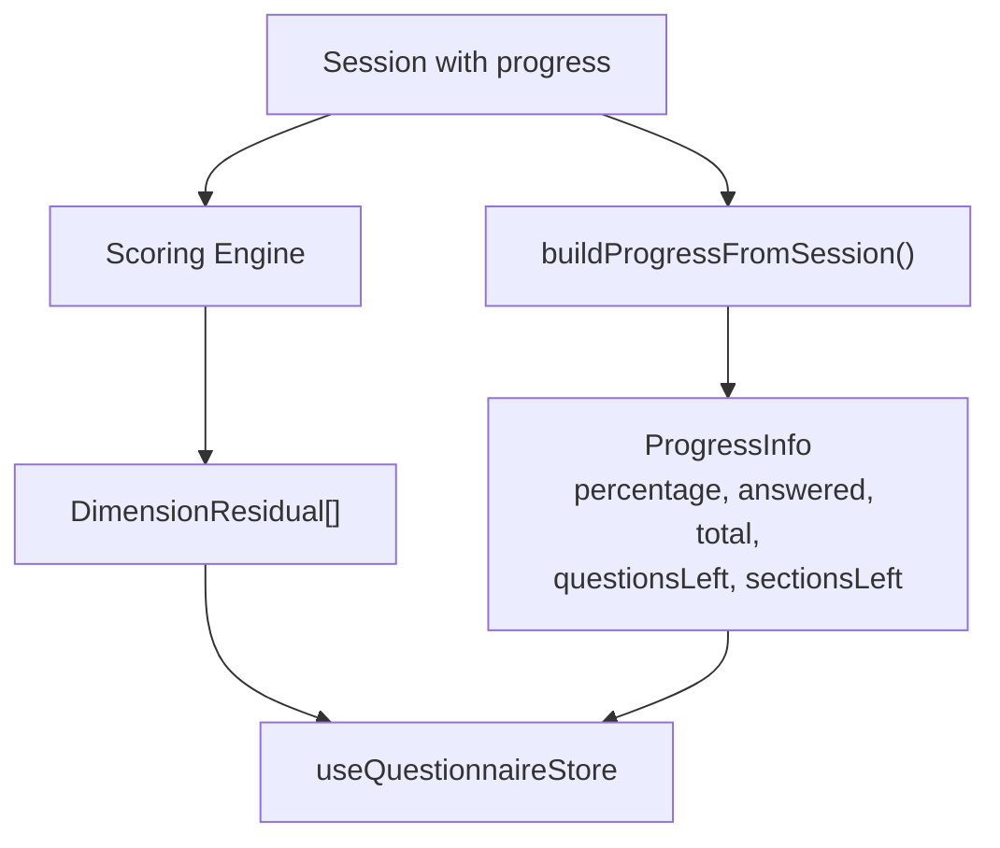
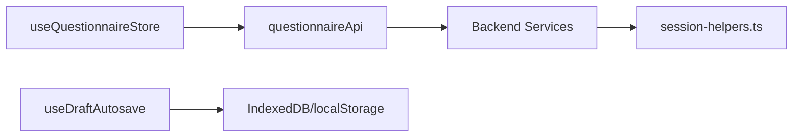

# Questionnaire Store

<cite>
**Referenced Files in This Document**
- [questionnaire.ts](file://apps/web/src/stores/questionnaire.ts)
- [useDraftAutosave.ts](file://apps/web/src/hooks/useDraftAutosave.ts)
- [questionnaire.ts](file://apps/web/src/api/questionnaire.ts)
- [QuestionnairePage.tsx](file://apps/web/src/pages/questionnaire/QuestionnairePage.tsx)
- [session-helpers.ts](file://apps/api/src/modules/session/session-helpers.ts)
- [questionnaire-scoring-session.flow.test.ts](file://apps/api/test/integration/questionnaire-scoring-session.flow.test.ts)
</cite>

## Table of Contents
1. [Introduction](#introduction)
2. [Project Structure](#project-structure)
3. [Core Components](#core-components)
4. [Architecture Overview](#architecture-overview)
5. [Detailed Component Analysis](#detailed-component-analysis)
6. [Dependency Analysis](#dependency-analysis)
7. [Performance Considerations](#performance-considerations)
8. [Troubleshooting Guide](#troubleshooting-guide)
9. [Conclusion](#conclusion)
10. [Appendices](#appendices)

## Introduction
This document describes the questionnaire response store that manages assessment sessions and draft autosave functionality. It explains the state structure for questionnaire responses, progress tracking, and real-time synchronization patterns. It also covers the draft autosave mechanism with debouncing, conflict resolution, and optimistic updates, along with the session lifecycle management including resume capability, completion tracking, and validation rules. Finally, it details the integration with the backend API for saving responses, loading saved drafts, and submitting completed questionnaires, and documents the relationship between questionnaire responses and scoring engine calculations.

## Project Structure
The questionnaire store is implemented as a Zustand store in the web application, with a dedicated hook for draft autosave persistence. The frontend integrates with the backend API for session lifecycle and scoring, while the backend provides helpers to compute progress and readiness metrics.

**Diagram sources**
- [questionnaire.ts:94-356](file://apps/web/src/stores/questionnaire.ts#L94-L356)
- [useDraftAutosave.ts:261-460](file://apps/web/src/hooks/useDraftAutosave.ts#L261-L460)
- [questionnaire.ts:177-473](file://apps/web/src/api/questionnaire.ts#L177-L473)
- [session-helpers.ts:60-102](file://apps/api/src/modules/session/session-helpers.ts#L60-L102)

**Section sources**
- [questionnaire.ts:1-357](file://apps/web/src/stores/questionnaire.ts#L1-L357)
- [useDraftAutosave.ts:1-500](file://apps/web/src/hooks/useDraftAutosave.ts#L1-L500)
- [questionnaire.ts:1-476](file://apps/web/src/api/questionnaire.ts#L1-L476)

## Core Components
- Questionnaire store (Zustand): Manages session state, current questions, navigation history, scoring, and adaptive flow. Exposes actions to create/load sessions, continue, submit responses, complete, and navigate.
- Draft autosave hook: Provides periodic autosave to IndexedDB/localStorage, draft recovery, and cleanup of stale drafts.
- Questionnaire API client: Encapsulates backend endpoints for sessions, responses, scoring, and related analytics.

Key responsibilities:
- Session lifecycle: create, load, list, continue, complete.
- Response submission with validation feedback and next-question hints.
- Scoring retrieval and dimension residuals.
- Navigation history for review mode and skip logic.
- Draft persistence with conflict detection and recovery.

**Section sources**
- [questionnaire.ts:26-74](file://apps/web/src/stores/questionnaire.ts#L26-L74)
- [useDraftAutosave.ts:19-57](file://apps/web/src/hooks/useDraftAutosave.ts#L19-L57)
- [questionnaire.ts:177-473](file://apps/web/src/api/questionnaire.ts#L177-L473)

## Architecture Overview
The questionnaire store orchestrates the UI and backend interactions. On response submission, the store optimistically updates local state and refreshes session data. The draft autosave hook periodically persists user answers to IndexedDB/localStorage, enabling recovery after interruptions.

**Diagram sources**
- [questionnaire.ts:175-233](file://apps/web/src/stores/questionnaire.ts#L175-L233)
- [questionnaire.ts:150-173](file://apps/web/src/stores/questionnaire.ts#L150-L173)
- [questionnaire.ts:218-231](file://apps/web/src/api/questionnaire.ts#L218-L231)

## Detailed Component Analysis

### Questionnaire Store State and Actions
The store defines a comprehensive state shape for session, questions, navigation history, scoring, and adaptive flags. Actions encapsulate lifecycle operations and navigation.

State highlights:
- Session: current session object, list of sessions, loading/error flags.
- Questions: currentQuestions and currentSection.
- Navigation: questionHistory with timestamps, review mode flags.
- Scoring: readinessScore, dimensions, scoreTrend.
- Adaptive: canComplete, isComplete, nqsHint.

Actions:
- Lifecycle: createSession, loadSession, loadSessions, continueSession, completeSession.
- Response: submitResponse with validation and next-question hints.
- Navigation: goToPrevious, goToNext, skipQuestion, canGoBack, canSkip.
- Utilities: loadScore, clearError, reset.

**Diagram sources**
- [questionnaire.ts:26-92](file://apps/web/src/stores/questionnaire.ts#L26-L92)
- [questionnaire.ts:18-24](file://apps/web/src/stores/questionnaire.ts#L18-L24)
- [questionnaire.ts:139-148](file://apps/web/src/stores/questionnaire.ts#L139-L148)

**Section sources**
- [questionnaire.ts:26-92](file://apps/web/src/stores/questionnaire.ts#L26-L92)
- [questionnaire.ts:94-356](file://apps/web/src/stores/questionnaire.ts#L94-L356)

### Draft Autosave Mechanism
The hook provides robust draft persistence with IndexedDB as primary storage and localStorage fallback. It supports:
- Periodic autosave via a timer.
- Change tracking with a pending buffer.
- Recovery of recent drafts with a 7-day window.
- Cleanup of stale drafts to manage storage quotas.
- Unload-safe synchronous save to localStorage.

**Diagram sources**
- [useDraftAutosave.ts:286-446](file://apps/web/src/hooks/useDraftAutosave.ts#L286-L446)
- [useDraftAutosave.ts:116-143](file://apps/web/src/hooks/useDraftAutosave.ts#L116-L143)
- [useDraftAutosave.ts:422-446](file://apps/web/src/hooks/useDraftAutosave.ts#L422-L446)

**Section sources**
- [useDraftAutosave.ts:1-500](file://apps/web/src/hooks/useDraftAutosave.ts#L1-L500)

### Session Lifecycle Management
The store coordinates session creation, continuation, and completion:
- createSession: posts to create a session and auto-continues to fetch initial questions.
- continueSession: retrieves next questions, current section, readiness score, completion flags, and updates state.
- submitResponse: posts the answer, tracks history, updates readiness score and NQS hint, then continues the session.
- completeSession: marks the session as complete after validating readiness thresholds.

**Diagram sources**
- [questionnaire.ts:97-114](file://apps/web/src/stores/questionnaire.ts#L97-L114)
- [questionnaire.ts:150-173](file://apps/web/src/stores/questionnaire.ts#L150-L173)
- [questionnaire.ts:175-233](file://apps/web/src/stores/questionnaire.ts#L175-L233)
- [questionnaire.ts:235-250](file://apps/web/src/stores/questionnaire.ts#L235-L250)

**Section sources**
- [questionnaire.ts:97-250](file://apps/web/src/stores/questionnaire.ts#L97-L250)

### Validation Rules and Navigation
- Required vs optional questions: skipQuestion checks required flag and either continues or navigates forward in review mode.
- Review mode: goToPrevious/goToNext traverse questionHistory, temporarily replacing currentQuestions with reviewed items.
- canGoBack/canSkip: computed helpers based on history length and current question required flag.

**Diagram sources**
- [questionnaire.ts:270-318](file://apps/web/src/stores/questionnaire.ts#L270-L318)
- [questionnaire.ts:320-355](file://apps/web/src/stores/questionnaire.ts#L320-L355)

**Section sources**
- [questionnaire.ts:270-355](file://apps/web/src/stores/questionnaire.ts#L270-L355)

### Real-Time Synchronization Patterns
- Optimistic updates: After submitResponse, the store immediately updates readinessScore and clears review mode, then refreshes state via continueSession.
- Conflict resolution: Local history entries are appended or updated when re-answering during review; the backend finalizes state on continueSession.
- Real-time hints: nextQuestionByNQS provides adaptive guidance for next best questions.

**Diagram sources**
- [questionnaire.ts:175-233](file://apps/web/src/stores/questionnaire.ts#L175-L233)
- [questionnaire.ts:150-173](file://apps/web/src/stores/questionnaire.ts#L150-L173)

**Section sources**
- [questionnaire.ts:175-233](file://apps/web/src/stores/questionnaire.ts#L175-L233)

### Integration with Backend API
- Sessions: create, get, list, continue, complete.
- Responses: submitResponse with validation and scoring result.
- Scoring: getScore, getScoreHistory, getNextQuestions, getBenchmark, getHeatmap.
- Evidence and decisions: list and manage related artifacts.

**Diagram sources**
- [questionnaire.ts:177-473](file://apps/web/src/api/questionnaire.ts#L177-L473)

**Section sources**
- [questionnaire.ts:177-473](file://apps/web/src/api/questionnaire.ts#L177-L473)

### Progress Tracking and Scoring Engine Relationship
- Progress computation: The backend helper builds progress info from session progress, computing remaining questions/sections and estimated time.
- Scoring: The store loads readiness score and dimension residuals; tests demonstrate scoring session creation and progression.

**Diagram sources**
- [session-helpers.ts:79-102](file://apps/api/src/modules/session/session-helpers.ts#L79-L102)
- [questionnaire.ts:252-264](file://apps/web/src/stores/questionnaire.ts#L252-L264)
- [questionnaire-scoring-session.flow.test.ts:100-143](file://apps/api/test/integration/questionnaire-scoring-session.flow.test.ts#L100-L143)

**Section sources**
- [session-helpers.ts:79-102](file://apps/api/src/modules/session/session-helpers.ts#L79-L102)
- [questionnaire.ts:252-264](file://apps/web/src/stores/questionnaire.ts#L252-L264)
- [questionnaire-scoring-session.flow.test.ts:100-143](file://apps/api/test/integration/questionnaire-scoring-session.flow.test.ts#L100-L143)

## Dependency Analysis
- Frontend store depends on the questionnaire API client for all backend operations.
- Draft autosave hook depends on IndexedDB/localStorage APIs and maintains its own internal state machine.
- Backend helpers compute progress and readiness metrics used by the frontend store.

**Diagram sources**
- [questionnaire.ts:6-16](file://apps/web/src/stores/questionnaire.ts#L6-L16)
- [useDraftAutosave.ts:71-110](file://apps/web/src/hooks/useDraftAutosave.ts#L71-L110)
- [session-helpers.ts:60-102](file://apps/api/src/modules/session/session-helpers.ts#L60-L102)

**Section sources**
- [questionnaire.ts:6-16](file://apps/web/src/stores/questionnaire.ts#L6-L16)
- [useDraftAutosave.ts:71-110](file://apps/web/src/hooks/useDraftAutosave.ts#L71-L110)
- [session-helpers.ts:60-102](file://apps/api/src/modules/session/session-helpers.ts#L60-L102)

## Performance Considerations
- Debounced autosave: The hook batches changes and saves periodically to reduce IO overhead.
- IndexedDB fallback: Ensures persistence even when IndexedDB is unavailable.
- Optimistic UI updates: Improve perceived responsiveness by updating immediately after submitResponse.
- Cleanup strategy: Removes older drafts to prevent quota exhaustion.

[No sources needed since this section provides general guidance]

## Troubleshooting Guide
Common issues and remedies:
- Autosave failures: The hook surfaces errors and disables autosave; check browser storage quotas and permissions.
- Draft recovery: Only recover drafts saved within the last 7 days; older drafts are intentionally removed.
- Submission errors: The store sets error state and preserves current UI; retry after resolving validation issues.
- Completion gating: The backend enforces readiness thresholds; ensure sufficient coverage before completing.

**Section sources**
- [useDraftAutosave.ts:342-351](file://apps/web/src/hooks/useDraftAutosave.ts#L342-L351)
- [useDraftAutosave.ts:494-497](file://apps/web/src/hooks/useDraftAutosave.ts#L494-L497)
- [questionnaire.ts:104-113](file://apps/web/src/stores/questionnaire.ts#L104-L113)
- [questionnaire.ts:240-249](file://apps/web/src/stores/questionnaire.ts#L240-L249)

## Conclusion
The questionnaire store provides a cohesive model for managing assessment sessions, integrating response submission, scoring, and adaptive guidance. The draft autosave hook ensures resilience against interruptions, while the backend API and helpers deliver accurate progress and readiness metrics. Together, these components support a robust, user-friendly assessment experience.

[No sources needed since this section summarizes without analyzing specific files]

## Appendices

### Example Workflows

- Resume a session from a saved draft:
  - Load draft via the hook; restore responses and current question index.
  - Use continueSession to fetch next questions and synchronize state.
  - Clear draft upon successful submission or completion.

- Submit a response and continue:
  - Call submitResponse with sessionId, questionId, and value.
  - Observe optimistic score update and NQS hint.
  - continueSession to receive next questions and updated section.

- Complete a session:
  - Ensure canComplete is true and readiness threshold met.
  - Call completeSession; the store marks isComplete and updates session.

**Section sources**
- [useDraftAutosave.ts:355-383](file://apps/web/src/hooks/useDraftAutosave.ts#L355-L383)
- [questionnaire.ts:150-173](file://apps/web/src/stores/questionnaire.ts#L150-L173)
- [questionnaire.ts:235-250](file://apps/web/src/stores/questionnaire.ts#L235-L250)