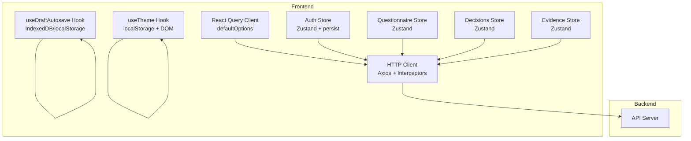
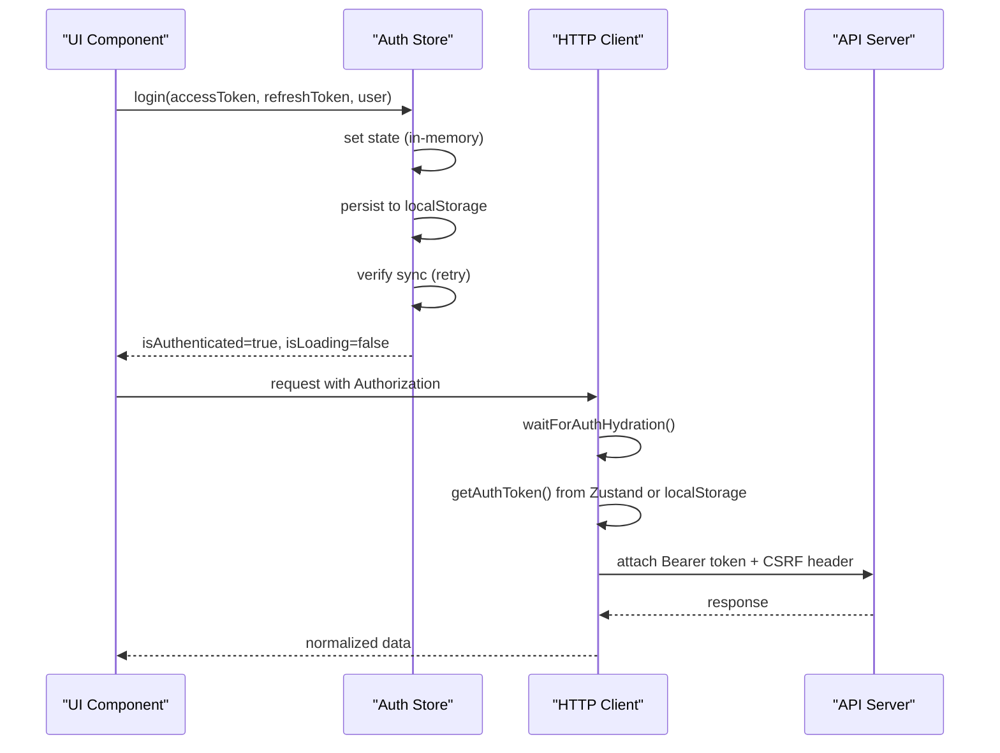
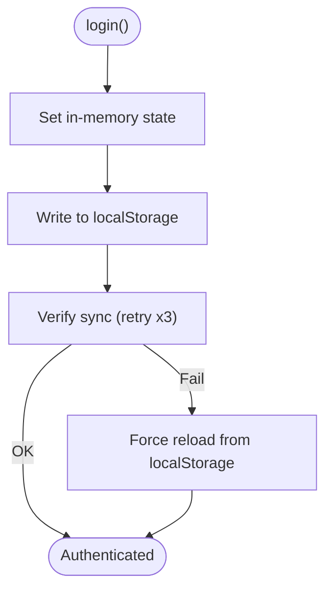
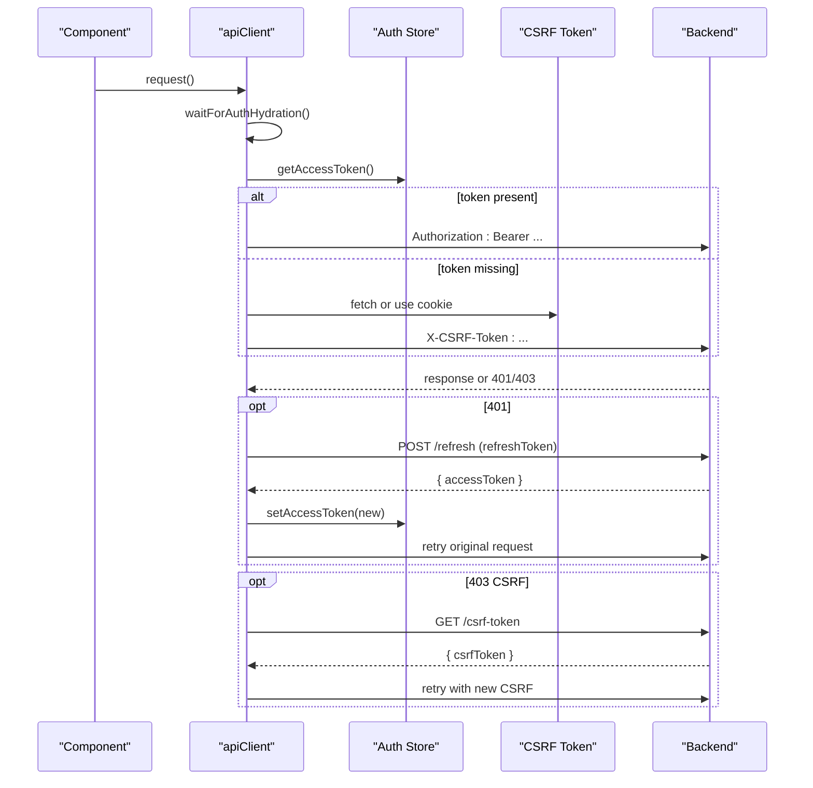
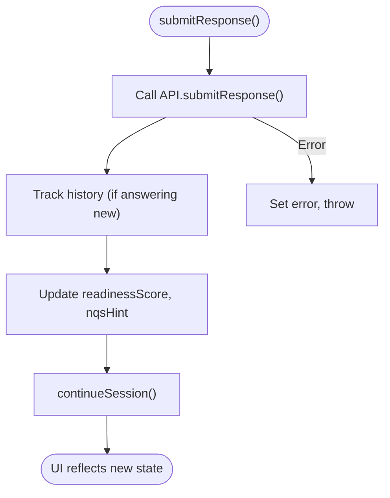
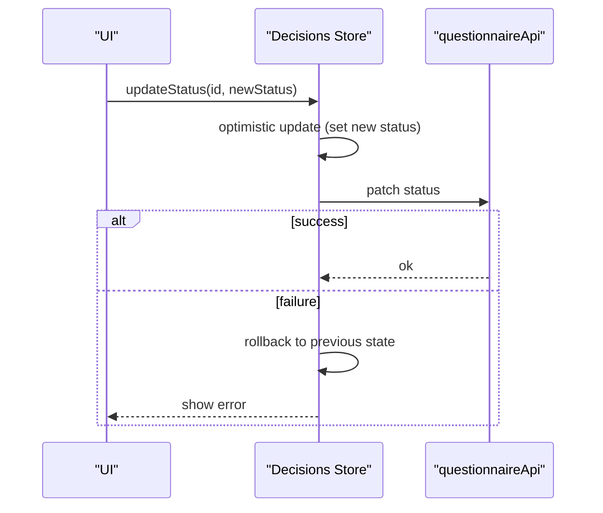
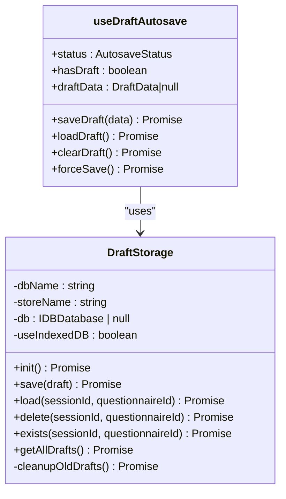
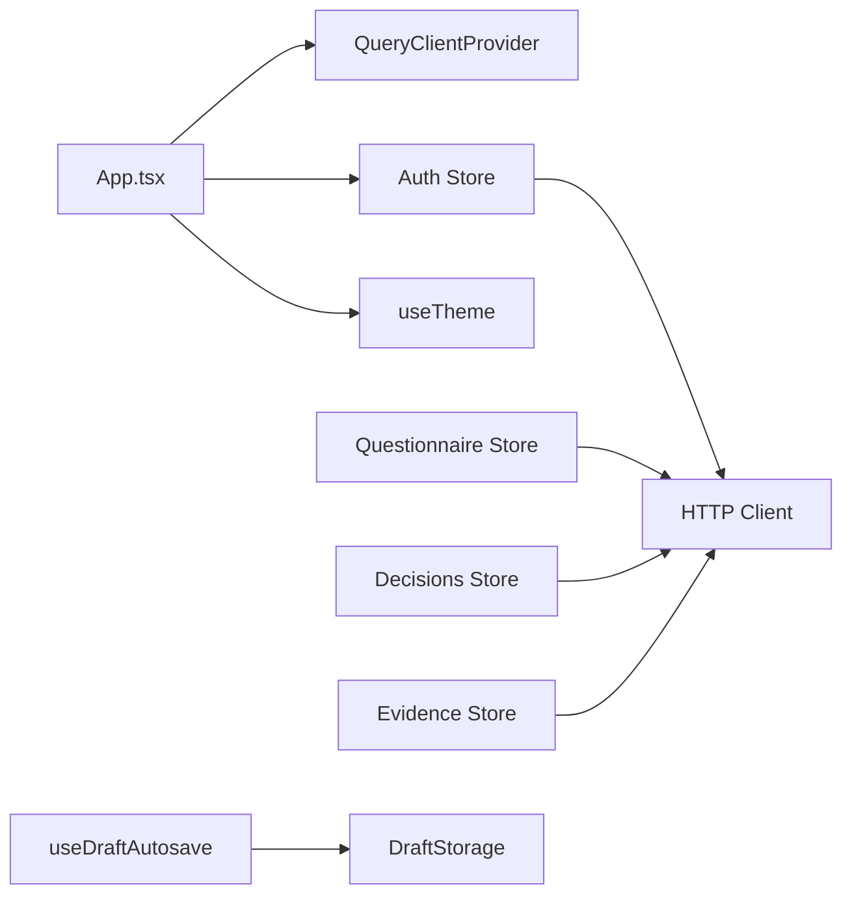

# State Management

<cite>
**Referenced Files in This Document**
- [auth.ts](file://apps/web/src/stores/auth.ts)
- [questionnaire.ts](file://apps/web/src/stores/questionnaire.ts)
- [decisions.ts](file://apps/web/src/stores/decisions.ts)
- [evidence.ts](file://apps/web/src/stores/evidence.ts)
- [useDraftAutosave.ts](file://apps/web/src/hooks/useDraftAutosave.ts)
- [useTheme.ts](file://apps/web/src/hooks/useTheme.ts)
- [client.ts](file://apps/web/src/api/client.ts)
- [questionnaire.ts](file://apps/web/src/api/questionnaire.ts)
- [auth.ts](file://apps/web/src/types/auth.ts)
- [questionnaire.ts](file://apps/web/src/types/questionnaire.ts)
- [App.tsx](file://apps/web/src/App.tsx)
- [logger.ts](file://apps/web/src/lib/logger.ts)
- [auth.test.ts](file://apps/web/src/stores/auth.test.ts)
- [questionnaire.test.ts](file://apps/web/src/stores/questionnaire.test.ts)
- [useDraftAutosave.test.ts](file://apps/web/src/hooks/useDraftAutosave.test.ts)
- [vite.config.ts](file://apps/web/vite.config.ts)
</cite>

## Table of Contents
1. [Introduction](#introduction)
2. [Project Structure](#project-structure)
3. [Core Components](#core-components)
4. [Architecture Overview](#architecture-overview)
5. [Detailed Component Analysis](#detailed-component-analysis)
6. [Dependency Analysis](#dependency-analysis)
7. [Performance Considerations](#performance-considerations)
8. [Troubleshooting Guide](#troubleshooting-guide)
9. [Conclusion](#conclusion)
10. [Appendices](#appendices)

## Introduction
This document explains the hybrid state management approach used in the application, combining React Query for server data caching and synchronization with custom Zustand stores for client-side concerns such as authentication, questionnaire sessions, decisions, and evidence. It covers JWT token management, user session handling, role-based access control, draft autosave with IndexedDB/localStorage fallback, progress tracking, optimistic updates, error handling, loading states, and data persistence patterns. It also documents integration patterns, synchronization strategies, and debugging techniques.

## Project Structure
The state management stack is organized around:
- React Query for server-side caching and synchronization
- Custom Zustand stores for client-side state and UI concerns
- Custom React hooks for domain-specific behaviors (theme, autosave)
- Axios client with interceptors for auth and CSRF handling

**Diagram sources**
- [App.tsx:139-147](file://apps/web/src/App.tsx#L139-L147)
- [client.ts:95-102](file://apps/web/src/api/client.ts#L95-L102)
- [auth.ts:54-172](file://apps/web/src/stores/auth.ts#L54-L172)
- [questionnaire.ts:94-356](file://apps/web/src/stores/questionnaire.ts#L94-L356)
- [decisions.ts:26-90](file://apps/web/src/stores/decisions.ts#L26-L90)
- [evidence.ts:34-67](file://apps/web/src/stores/evidence.ts#L34-L67)
- [useDraftAutosave.ts:261-460](file://apps/web/src/hooks/useDraftAutosave.ts#L261-L460)
- [useTheme.ts:31-103](file://apps/web/src/hooks/useTheme.ts#L31-L103)

**Section sources**
- [App.tsx:139-147](file://apps/web/src/App.tsx#L139-L147)
- [vite.config.ts:1-18](file://apps/web/vite.config.ts#L1-L18)

## Core Components
- Authentication store (Zustand with localStorage persistence) manages JWT tokens, refresh flow, hydration, and loading states.
- Questionnaire store coordinates session lifecycle, question flow, scoring, and navigation history.
- Decisions store supports optimistic updates with automatic rollback on failures.
- Evidence store loads artifacts and statistics for compliance tracking.
- HTTP client integrates auth tokens and CSRF protection via interceptors.
- Draft autosave hook persists questionnaire progress to IndexedDB or localStorage with recovery and cleanup.
- Theme hook manages dark/light/system preferences with DOM application and localStorage persistence.

**Section sources**
- [auth.ts:37-52](file://apps/web/src/stores/auth.ts#L37-L52)
- [questionnaire.ts:26-74](file://apps/web/src/stores/questionnaire.ts#L26-L74)
- [decisions.ts:14-24](file://apps/web/src/stores/decisions.ts#L14-L24)
- [evidence.ts:23-32](file://apps/web/src/stores/evidence.ts#L23-L32)
- [client.ts:108-133](file://apps/web/src/api/client.ts#L108-L133)
- [useDraftAutosave.ts:19-57](file://apps/web/src/hooks/useDraftAutosave.ts#L19-L57)
- [useTheme.ts:8-24](file://apps/web/src/hooks/useTheme.ts#L8-L24)

## Architecture Overview
The hybrid architecture leverages React Query for server synchronization and Zustand for client-side state. The HTTP client injects auth and CSRF tokens, while the auth store ensures token availability and refreshes on hydration. Stores encapsulate domain logic and expose typed actions for UI components.

**Diagram sources**
- [auth.ts:71-123](file://apps/web/src/stores/auth.ts#L71-L123)
- [client.ts:139-158](file://apps/web/src/api/client.ts#L139-L158)
- [client.ts:108-133](file://apps/web/src/api/client.ts#L108-L133)

## Detailed Component Analysis

### Authentication Store
- Responsibilities:
  - Manage user, access token, refresh token, authentication status, and loading state.
  - Persist to localStorage with Zustand’s persist middleware.
  - Rehydrate and refresh tokens on startup.
  - Enforce retry-based synchronization for immediate token availability.
- Token synchronization strategy:
  - Immediate in-memory update via Zustand set().
  - Manual localStorage write to ensure availability across module boundaries.
  - Retry loop to confirm synchronization; fallback to forced reload from localStorage.
- Hydration and refresh:
  - onRehydrateStorage triggers token refresh when refresh token exists without access token.
  - Loading state is cleared after hydration completes.

**Diagram sources**
- [auth.ts:71-123](file://apps/web/src/stores/auth.ts#L71-L123)

**Section sources**
- [auth.ts:37-52](file://apps/web/src/stores/auth.ts#L37-L52)
- [auth.ts:136-171](file://apps/web/src/stores/auth.ts#L136-L171)
- [auth.ts:150-169](file://apps/web/src/stores/auth.ts#L150-L169)

### HTTP Client and Interceptors
- URL resolution:
  - Uses explicit VITE_API_URL if set, otherwise relative URLs in production, localhost in development.
- Auth integration:
  - getAuthToken() reads from Zustand store or localStorage fallback.
  - waitForAuthHydration() prevents race conditions on initial load.
  - Adds Authorization header and CSRF token for state-changing requests.
- Token refresh:
  - 401 handling triggers refresh endpoint with httpOnly cookie support.
  - Subscriber queue prevents concurrent refreshes and retries original request with new token.
- Response normalization:
  - Unwraps API wrapper responses to simplify frontend consumption.

**Diagram sources**
- [client.ts:139-158](file://apps/web/src/api/client.ts#L139-L158)
- [client.ts:108-133](file://apps/web/src/api/client.ts#L108-L133)
- [client.ts:200-323](file://apps/web/src/api/client.ts#L200-L323)

**Section sources**
- [client.ts:20-31](file://apps/web/src/api/client.ts#L20-L31)
- [client.ts:108-133](file://apps/web/src/api/client.ts#L108-L133)
- [client.ts:200-323](file://apps/web/src/api/client.ts#L200-L323)

### Questionnaire Store
- Responsibilities:
  - Session lifecycle: create, load, list, continue, complete.
  - Question flow: current questions, section tracking, navigation history.
  - Scoring: readiness score, dimensions, trend.
  - Adaptive logic: NQS hints, completion gating.
  - Error handling: centralized error messages, non-critical warnings.
- Optimistic UI:
  - Updates readiness score and NQS hints immediately after submitResponse.
  - Continues session to fetch next questions and refresh state.
- Navigation:
  - Review mode tracks history index and toggles review state.
  - Skip logic for optional questions.

**Diagram sources**
- [questionnaire.ts:175-233](file://apps/web/src/stores/questionnaire.ts#L175-L233)

**Section sources**
- [questionnaire.ts:26-74](file://apps/web/src/stores/questionnaire.ts#L26-L74)
- [questionnaire.ts:175-233](file://apps/web/src/stores/questionnaire.ts#L175-L233)
- [questionnaire.ts:270-318](file://apps/web/src/stores/questionnaire.ts#L270-L318)

### Decisions Store (Optimistic Updates)
- Optimistic update pattern:
  - Immediately reflect status change in UI.
  - On failure, rollback to previous state and surface error.
- Persistence:
  - Uses questionnaire API endpoints for list/create/update.

**Diagram sources**
- [decisions.ts:65-87](file://apps/web/src/stores/decisions.ts#L65-L87)

**Section sources**
- [decisions.ts:14-24](file://apps/web/src/stores/decisions.ts#L14-L24)
- [decisions.ts:65-87](file://apps/web/src/stores/decisions.ts#L65-L87)

### Evidence Store
- Loads evidence items and statistics for a session.
- Non-critical failures are logged and do not block UI.

**Section sources**
- [evidence.ts:23-32](file://apps/web/src/stores/evidence.ts#L23-L32)
- [evidence.ts:40-64](file://apps/web/src/stores/evidence.ts#L40-L64)

### Draft Autosave Hook
- Features:
  - IndexedDB-backed storage with localStorage fallback.
  - Auto-save every 30 seconds with retry and quota handling.
  - Recovery of recent drafts with 7-day cutoff.
  - beforeunload fallback to localStorage.
- Storage model:
  - DraftData includes session identifiers, responses, current index, timestamps, and metadata.
  - Index maintained for localStorage to enumerate drafts.

**Diagram sources**
- [useDraftAutosave.ts:71-241](file://apps/web/src/hooks/useDraftAutosave.ts#L71-L241)
- [useDraftAutosave.ts:261-460](file://apps/web/src/hooks/useDraftAutosave.ts#L261-L460)

**Section sources**
- [useDraftAutosave.ts:19-57](file://apps/web/src/hooks/useDraftAutosave.ts#L19-L57)
- [useDraftAutosave.ts:116-143](file://apps/web/src/hooks/useDraftAutosave.ts#L116-L143)
- [useDraftAutosave.ts:422-446](file://apps/web/src/hooks/useDraftAutosave.ts#L422-L446)

### Theme Hook
- Manages theme mode (light/dark/system) with localStorage persistence.
- Applies resolved theme to documentElement and color-scheme.
- Tracks system preference and exposes toggle/set functions.

**Section sources**
- [useTheme.ts:31-103](file://apps/web/src/hooks/useTheme.ts#L31-L103)

## Dependency Analysis
- React Query client configured globally with retry and staleTime.
- Stores depend on the HTTP client for server interactions.
- Auth store depends on the HTTP client for token refresh.
- Hooks encapsulate storage and UI behaviors independently.

**Diagram sources**
- [App.tsx:139-147](file://apps/web/src/App.tsx#L139-L147)
- [auth.ts:54-172](file://apps/web/src/stores/auth.ts#L54-L172)
- [questionnaire.ts:94-356](file://apps/web/src/stores/questionnaire.ts#L94-L356)
- [decisions.ts:26-90](file://apps/web/src/stores/decisions.ts#L26-L90)
- [evidence.ts:34-67](file://apps/web/src/stores/evidence.ts#L34-L67)
- [useDraftAutosave.ts:261-460](file://apps/web/src/hooks/useDraftAutosave.ts#L261-L460)

**Section sources**
- [App.tsx:139-147](file://apps/web/src/App.tsx#L139-L147)
- [client.ts:95-102](file://apps/web/src/api/client.ts#L95-L102)

## Performance Considerations
- React Query defaultOptions:
  - retry: 1, staleTime: 5 minutes, refetchOnWindowFocus: false.
- Auth hydration guard:
  - Prevents long-loading states by forcing completion after 2 seconds.
- IndexedDB/localStorage fallback:
  - Draft autosave prioritizes IndexedDB with localStorage fallback and quota cleanup.
- Token refresh concurrency:
  - Subscriber queue prevents multiple refreshes and reduces latency.

[No sources needed since this section provides general guidance]

## Troubleshooting Guide
- Authentication
  - Symptom: 401 Unauthorized immediately after login.
  - Cause: Race condition between state sync and request.
  - Fix: waitForAuthHydration() and getAuthToken() fallback to localStorage.
  - Evidence: [client.ts:139-158](file://apps/web/src/api/client.ts#L139-L158), [client.ts:108-133](file://apps/web/src/api/client.ts#L108-L133)
- Token refresh failures
  - Symptom: Infinite 401 loops.
  - Cause: Missing refresh token or invalid response.
  - Fix: Logout and redirect to login; ensure refresh endpoint uses httpOnly cookies.
  - Evidence: [client.ts:262-318](file://apps/web/src/api/client.ts#L262-L318)
- CSRF token errors
  - Symptom: 403 CSRF errors.
  - Fix: Fetch new CSRF token and retry; fallback to cookie.
  - Evidence: [client.ts:222-242](file://apps/web/src/api/client.ts#L222-L242)
- Draft autosave quota exceeded
  - Symptom: Save failures due to storage limits.
  - Fix: Automatic cleanup of oldest drafts; retry save.
  - Evidence: [useDraftAutosave.ts:231-240](file://apps/web/src/hooks/useDraftAutosave.ts#L231-L240)
- Logger behavior
  - Dev-only debug/log/warn; errors always active.
  - Evidence: [logger.ts:12-24](file://apps/web/src/lib/logger.ts#L12-L24)

**Section sources**
- [client.ts:139-158](file://apps/web/src/api/client.ts#L139-L158)
- [client.ts:222-242](file://apps/web/src/api/client.ts#L222-L242)
- [client.ts:262-318](file://apps/web/src/api/client.ts#L262-L318)
- [useDraftAutosave.ts:231-240](file://apps/web/src/hooks/useDraftAutosave.ts#L231-L240)
- [logger.ts:12-24](file://apps/web/src/lib/logger.ts#L12-L24)

## Conclusion
The hybrid state management combines React Query’s robust server synchronization with custom Zustand stores for client-side concerns. The authentication store ensures secure token handling with resilient hydration and refresh flows. The questionnaire, decisions, and evidence stores encapsulate domain logic with optimistic updates and error handling. The draft autosave hook provides durable progress persistence with IndexedDB/localStorage fallback. Together, these patterns deliver a responsive, reliable, and maintainable frontend state architecture.

[No sources needed since this section summarizes without analyzing specific files]

## Appendices

### API Definitions and Types
- Auth types align with backend DTOs for user roles and token payloads.
- Questionnaire types define question models, progress, and session structures.

**Section sources**
- [auth.ts:5-18](file://apps/web/src/types/auth.ts#L5-L18)
- [questionnaire.ts:107-128](file://apps/web/src/types/questionnaire.ts#L107-L128)
- [questionnaire.ts:187-197](file://apps/web/src/types/questionnaire.ts#L187-L197)

### Testing Patterns
- Auth store tests validate login persistence, hydration refresh, and partialize behavior.
- Questionnaire store tests cover session lifecycle, navigation, and error handling.
- Draft autosave tests cover IndexedDB/localStorage fallback, autosave intervals, and recovery.

**Section sources**
- [auth.test.ts:112-137](file://apps/web/src/stores/auth.test.ts#L112-L137)
- [auth.test.ts:174-193](file://apps/web/src/stores/auth.test.ts#L174-L193)
- [questionnaire.test.ts:118-152](file://apps/web/src/stores/questionnaire.test.ts#L118-L152)
- [questionnaire.test.ts:237-285](file://apps/web/src/stores/questionnaire.test.ts#L237-L285)
- [useDraftAutosave.test.ts:134-184](file://apps/web/src/hooks/useDraftAutosave.test.ts#L134-L184)
- [useDraftAutosave.test.ts:186-253](file://apps/web/src/hooks/useDraftAutosave.test.ts#L186-L253)