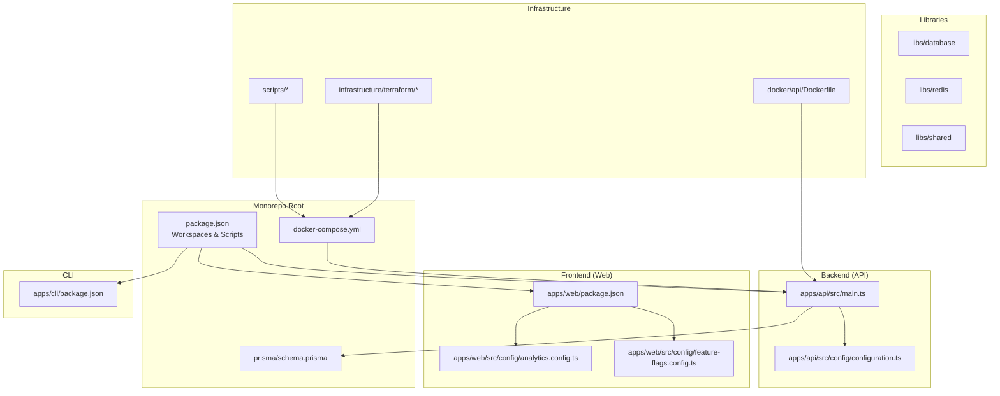
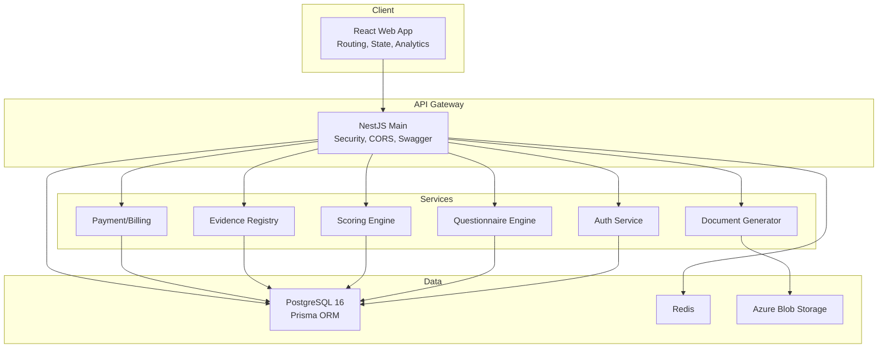
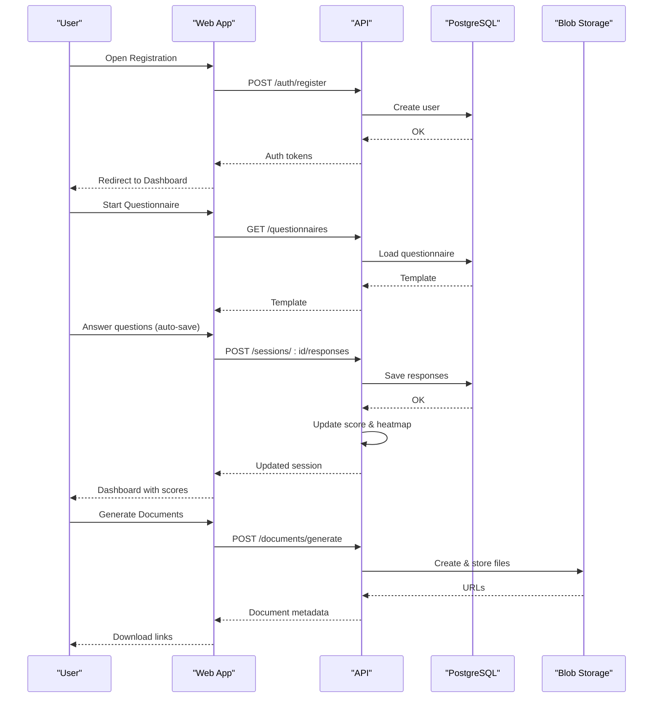
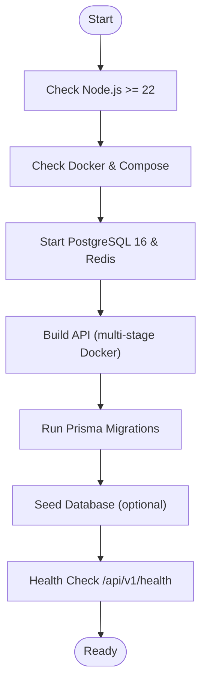
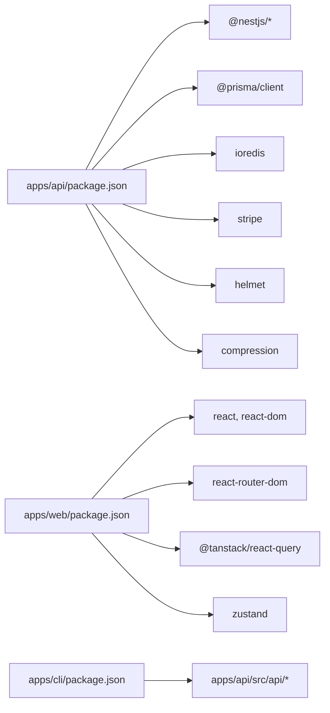
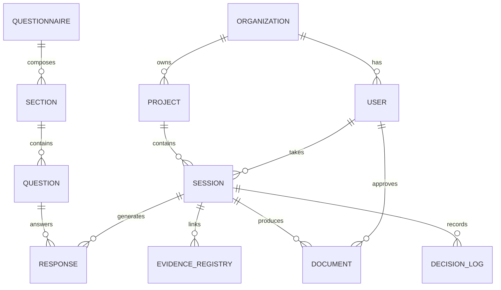

# Getting Started

<cite>
**Referenced Files in This Document**
- [README.md](file://README.md)
- [PRODUCT-OVERVIEW.md](file://PRODUCT-OVERVIEW.md)
- [QUICK-START.md](file://QUICK-START.md)
- [DEPLOYMENT.md](file://DEPLOYMENT.md)
- [apps/api/src/main.ts](file://apps/api/src/main.ts)
- [apps/api/src/config/configuration.ts](file://apps/api/src/config/configuration.ts)
- [apps/web/src/config/analytics.config.ts](file://apps/web/src/config/analytics.config.ts)
- [apps/web/src/config/feature-flags.config.ts](file://apps/web/src/config/feature-flags.config.ts)
- [package.json](file://package.json)
- [docker-compose.yml](file://docker-compose.yml)
- [docker/api/Dockerfile](file://docker/api/Dockerfile)
- [scripts/setup-local.sh](file://scripts/setup-local.sh)
- [scripts/dev-start.sh](file://scripts/dev-start.sh)
- [prisma/schema.prisma](file://prisma/schema.prisma)
</cite>

## Table of Contents
1. [Introduction](#introduction)
2. [Project Structure](#project-structure)
3. [Core Components](#core-components)
4. [Architecture Overview](#architecture-overview)
5. [Detailed Component Analysis](#detailed-component-analysis)
6. [Dependency Analysis](#dependency-analysis)
7. [Performance Considerations](#performance-considerations)
8. [Troubleshooting Guide](#troubleshooting-guide)
9. [Conclusion](#conclusion)
10. [Appendices](#appendices)

## Introduction
Quiz-to-build (Quiz2Biz) is an adaptive questionnaire system that transforms business assessments into professional documentation packages. It helps organizations evaluate their technology readiness across seven dimensions, receive instant scoring and visual insights, and automatically generate comprehensive technical documents. The platform targets diverse stakeholders—CTOs, CFOs, CEOs, business analysts, and compliance teams—providing tailored deliverables and actionable recommendations.

Key benefits:
- Accelerated assessments with adaptive logic and auto-save
- Instant scoring with heatmap visualizations and gap analysis
- Professional documentation generation (8+ types, 45+ pages each)
- Evidence registry and decision log for compliance and audit trails
- Real-time collaboration and progress tracking
- Strong security, accessibility, and performance characteristics

**Section sources**
- [README.md:18-28](file://README.md#L18-L28)
- [README.md:157-171](file://README.md#L157-L171)
- [PRODUCT-OVERVIEW.md:16-24](file://PRODUCT-OVERVIEW.md#L16-L24)

## Project Structure
The repository follows a monorepo layout with three primary applications:
- apps/api: NestJS backend with REST API, authentication, document generation, and integrations
- apps/web: React 19 frontend with TypeScript, Vite, and Tailwind CSS
- apps/cli: Command-line tool for offline operations and utilities

Shared libraries and database schema:
- libs: Shared modules (database, redis, shared)
- prisma: Database schema and migrations

Infrastructure and deployment:
- docker: Multi-stage Dockerfiles and compose configuration
- infrastructure/terraform: Azure infrastructure provisioning
- scripts: Local setup, deployment, and maintenance utilities

**Diagram sources**
- [package.json:11-14](file://package.json#L11-L14)
- [apps/api/src/main.ts:1-329](file://apps/api/src/main.ts#L1-329)
- [apps/web/package.json:1-75](file://apps/web/package.json#L1-L75)
- [docker-compose.yml:18-150](file://docker-compose.yml#L18-L150)
- [docker/api/Dockerfile:1-120](file://docker/api/Dockerfile#L1-L120)

**Section sources**
- [README.md:295-318](file://README.md#L295-L318)
- [package.json:11-14](file://package.json#L11-L14)

## Core Components
- Backend API (NestJS): Handles authentication, questionnaire orchestration, scoring, document generation, evidence registry, and integrations. It exposes Swagger/OpenAPI documentation and integrates with PostgreSQL, Redis, and Azure services.
- Frontend (React 19): Provides user-facing pages for authentication, dashboard, questionnaire, documents, and billing, with analytics and feature flags.
- CLI: Supports offline operations and utilities for development and testing.
- Database (PostgreSQL 16): Managed via Prisma ORM with migrations and seed data.
- Infrastructure: Dockerized deployment with multi-stage builds, Azure Container Apps, and Terraform-managed resources.

**Section sources**
- [apps/api/src/main.ts:214-298](file://apps/api/src/main.ts#L214-L298)
- [apps/web/package.json:18-36](file://apps/web/package.json#L18-L36)
- [prisma/schema.prisma:1-120](file://prisma/schema.prisma#L1-L120)
- [docker/api/Dockerfile:68-120](file://docker/api/Dockerfile#L68-L120)

## Architecture Overview
The system uses a layered architecture:
- Presentation Layer: React web app with routing, state management, and analytics
- API Layer: NestJS REST API with security middleware, validation, and interceptors
- Domain Services: Questionnaire engine, scoring, document generation, and AI gateway
- Data Layer: PostgreSQL with Prisma ORM and Redis caching
- Integrations: Stripe for payments, Azure Blob Storage for files, Application Insights and Sentry for observability

**Diagram sources**
- [apps/api/src/main.ts:68-123](file://apps/api/src/main.ts#L68-L123)
- [apps/api/src/main.ts:214-298](file://apps/api/src/main.ts#L214-L298)
- [prisma/schema.prisma:154-286](file://prisma/schema.prisma#L154-L286)

**Section sources**
- [apps/api/src/main.ts:68-123](file://apps/api/src/main.ts#L68-L123)
- [apps/api/src/main.ts:196-212](file://apps/api/src/main.ts#L196-L212)
- [apps/api/src/main.ts:214-298](file://apps/api/src/main.ts#L214-L298)

## Detailed Component Analysis

### 5-Minute Quick Start Guide
Follow these steps to get started quickly:
1. Create an account at the registration page
2. Start a new questionnaire and answer adaptive questions across 5 sections
3. Review your real-time scores and heatmap on the dashboard
4. Generate and download professional documents (DOCX/PDF)
5. Share results with your team or investors

**Diagram sources**
- [QUICK-START.md:171-197](file://QUICK-START.md#L171-L197)
- [apps/api/src/main.ts:214-298](file://apps/api/src/main.ts#L214-L298)

**Section sources**
- [QUICK-START.md:171-197](file://QUICK-START.md#L171-L197)
- [README.md:174-184](file://README.md#L174-L184)

### System Requirements and Environment Setup
- Node.js: Version 22+ (engine requirement)
- Docker: For local development and containerized deployment
- PostgreSQL 16: Database service (managed or local)
- Redis: Caching and session state
- Azure CLI: For cloud deployment (optional)
- Environment variables: JWT secrets, database URL, CORS origin, and feature flags

**Diagram sources**
- [package.json:7-10](file://package.json#L7-L10)
- [docker-compose.yml:27-107](file://docker-compose.yml#L27-L107)
- [docker/api/Dockerfile:68-120](file://docker/api/Dockerfile#L68-L120)

**Section sources**
- [package.json:7-10](file://package.json#L7-L10)
- [docker-compose.yml:27-107](file://docker-compose.yml#L27-L107)
- [scripts/setup-local.sh:31-104](file://scripts/setup-local.sh#L31-L104)

### Initial Configuration
Critical environment variables (production):
- JWT_SECRET and JWT_REFRESH_SECRET: Strong random values (≥32 characters)
- DATABASE_URL: PostgreSQL connection string
- CORS_ORIGIN: Explicit allowlist (not wildcard)

Feature flags (frontend):
- VITE_ENABLE_ONBOARDING, VITE_ENABLE_ACCESSIBILITY, VITE_ENABLE_I18N, etc.

Analytics:
- VITE_GA_MEASUREMENT_ID for Google Analytics GA4 integration

**Section sources**
- [apps/api/src/config/configuration.ts:5-43](file://apps/api/src/config/configuration.ts#L5-L43)
- [apps/api/src/config/configuration.ts:87-114](file://apps/api/src/config/configuration.ts#L87-L114)
- [apps/web/src/config/feature-flags.config.ts:13-36](file://apps/web/src/config/feature-flags.config.ts#L13-L36)
- [apps/web/src/config/analytics.config.ts:21-31](file://apps/web/src/config/analytics.config.ts#L21-L31)

### First-Time User Scenarios
- CTO: Generate Architecture Dossier and DevSecOps Guide; review heatmap and recommendations
- CFO: Produce Finance Package and Business Plan; track resource allocation
- CEO: Obtain Executive Summary and Strategy Playbook; share with stakeholders
- Business Analyst: Capture requirements via Idea Capture and generate SDLC Playbook
- Compliance: Build Policy Pack and Evidence Registry for audit readiness

**Section sources**
- [README.md:159-164](file://README.md#L159-L164)
- [PRODUCT-OVERVIEW.md:48-56](file://PRODUCT-OVERVIEW.md#L48-L56)

### Basic Usage Patterns
- Adaptive Questionnaire: 11 question types with conditional logic and auto-save
- Real-time Scoring: Updates as you answer; heatmap highlights strengths/weaknesses
- Document Generation: Select format (DOCX/PDF), customize, and download
- Evidence Registry: Attach files, links, and integrate with GitHub/GitLab/Jira
- Decision Log: Record and approve decisions with audit trail

**Section sources**
- [PRODUCT-OVERVIEW.md:27-78](file://PRODUCT-OVERVIEW.md#L27-L78)
- [README.md:88-120](file://README.md#L88-L120)

## Dependency Analysis
Internal dependencies:
- API depends on libs/database, libs/redis, and libs/shared
- Web app depends on React Query, Zustand, and TanStack Router
- CLI integrates with API client and configuration modules

External dependencies:
- NestJS ecosystem (Swagger, Throttler, Passport, JWT)
- Prisma ORM and PostgreSQL
- Redis for caching
- Stripe for payments
- Sentry and Application Insights for observability

**Diagram sources**
- [apps/api/package.json:21-64](file://apps/api/package.json#L21-L64)
- [apps/web/package.json:18-36](file://apps/web/package.json#L18-L36)
- [apps/api/package.json:66-86](file://apps/api/package.json#L66-L86)

**Section sources**
- [apps/api/package.json:21-64](file://apps/api/package.json#L21-L64)
- [apps/web/package.json:18-36](file://apps/web/package.json#L18-L36)

## Performance Considerations
- Page load: <2.1s LCP, <3.2s TTI
- API response: <150ms average
- Auto-save: Every 30 seconds
- Compression: Gzip/Brotli for responses (except streaming endpoints)
- Caching: Redis for session and transient data
- Scalability: Azure Container Apps with managed PostgreSQL and Redis

**Section sources**
- [README.md:197-203](file://README.md#L197-L203)
- [apps/api/src/main.ts:43-67](file://apps/api/src/main.ts#L43-L67)
- [README.md:152-160](file://README.md#L152-L160)

## Troubleshooting Guide
Common setup and deployment issues:
- Authentication Error (GitHub Actions): Recreate Azure service principal and update secrets
- Database Connection Failure: Verify firewall rules, SSL mode, and connection string
- Docker Build Failure: Build locally to debug, ensure Prisma client generation, and check dependencies
- Health Check Fails: Inspect application logs and verify environment variables
- Database Migration Failure: Manually run migrations and check migration status

Local development tips:
- Use the setup script to provision services and run migrations
- Health check URL: http://localhost:3000/api/v1/health
- View logs: docker compose logs -f api

**Section sources**
- [DEPLOYMENT.md:329-421](file://DEPLOYMENT.md#L329-L421)
- [scripts/setup-local.sh:108-167](file://scripts/setup-local.sh#L108-L167)

## Conclusion
Quiz-to-build streamlines technical assessments and documentation generation for organizations of all sizes. With adaptive questionnaires, instant scoring, and professional document outputs, it empowers CTOs, CFOs, CEOs, analysts, and compliance teams to make informed decisions quickly. The platform’s robust architecture, security posture, and performance characteristics make it suitable for production use, while the included deployment and troubleshooting guides simplify onboarding.

[No sources needed since this section summarizes without analyzing specific files]

## Appendices

### A. Deployment Options
- GitHub Actions CI/CD with Azure Container Apps
- Manual Docker deployment with multi-stage builds
- Terraform-managed Azure infrastructure

**Section sources**
- [DEPLOYMENT.md:24-53](file://DEPLOYMENT.md#L24-L53)
- [DEPLOYMENT.md:140-179](file://DEPLOYMENT.md#L140-L179)
- [docker/api/Dockerfile:68-120](file://docker/api/Dockerfile#L68-L120)

### B. Environment Variables Reference
- API: DATABASE_URL, JWT_SECRET, JWT_REFRESH_SECRET, CORS_ORIGIN, REDIS_HOST, REDIS_PORT, REDIS_PASSWORD
- Web: VITE_GA_MEASUREMENT_ID, VITE_ENABLE_* feature flags
- CLI: Depends on API configuration and environment

**Section sources**
- [apps/api/src/config/configuration.ts:87-114](file://apps/api/src/config/configuration.ts#L87-L114)
- [apps/web/src/config/feature-flags.config.ts:6-11](file://apps/web/src/config/feature-flags.config.ts#L6-L11)
- [apps/web/src/config/analytics.config.ts:21-31](file://apps/web/src/config/analytics.config.ts#L21-L31)

### C. Data Model Overview
Key entities include Organizations, Users, Questionnaires, Sessions, Responses, Dimensions, Documents, Evidence, Decisions, and Projects. Relationships define multi-project workspaces, persona-driven question targeting, and readiness scoring.

**Diagram sources**
- [prisma/schema.prisma:154-286](file://prisma/schema.prisma#L154-L286)
- [prisma/schema.prisma:351-489](file://prisma/schema.prisma#L351-L489)
- [prisma/schema.prisma:512-560](file://prisma/schema.prisma#L512-L560)
- [prisma/schema.prisma:636-706](file://prisma/schema.prisma#L636-L706)
- [prisma/schema.prisma:744-774](file://prisma/schema.prisma#L744-L774)