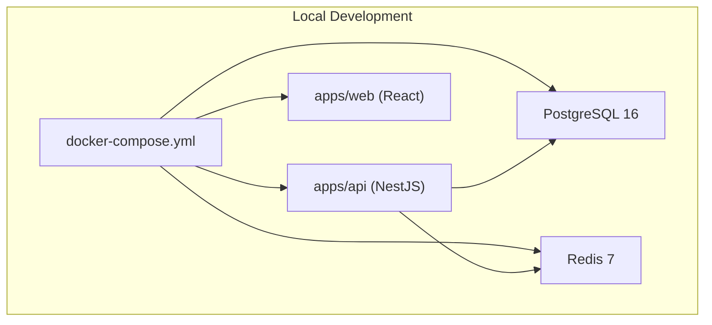
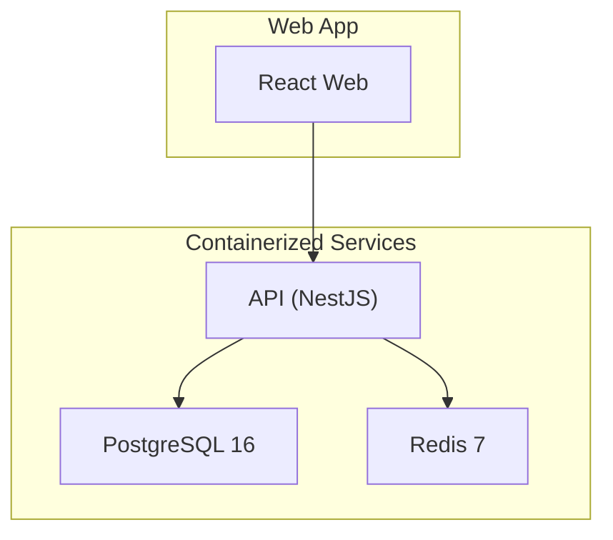
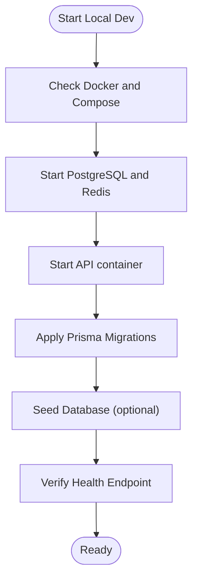
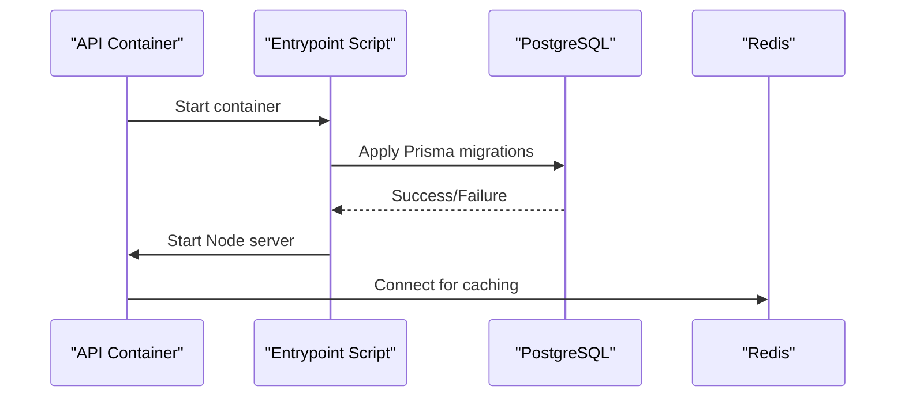
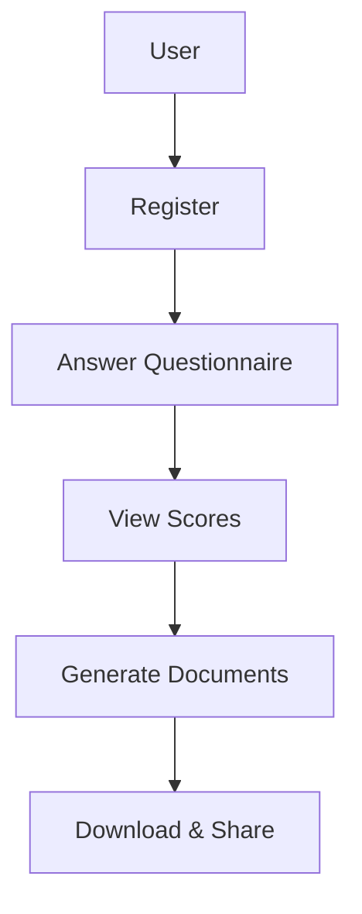
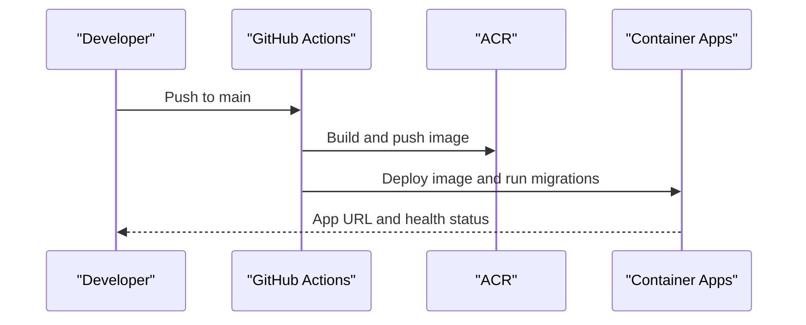
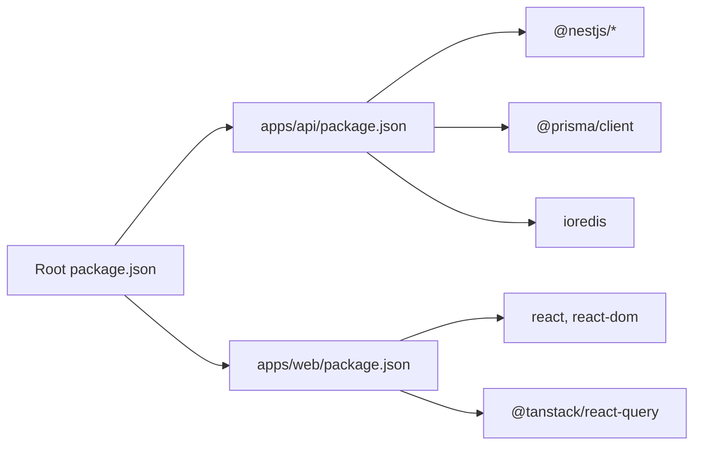

# Getting Started

<cite>
**Referenced Files in This Document**
- [README.md](file://README.md)
- [QUICK-START.md](file://QUICK-START.md)
- [DEPLOYMENT.md](file://DEPLOYMENT.md)
- [DEPLOY-NOW.md](file://DEPLOY-NOW.md)
- [package.json](file://package.json)
- [docker-compose.yml](file://docker-compose.yml)
- [docker/api/Dockerfile](file://docker/api/Dockerfile)
- [docker/api/entrypoint.sh](file://docker/api/entrypoint.sh)
- [docker/postgres/init.sql](file://docker/postgres/init.sql)
- [apps/api/package.json](file://apps/api/package.json)
- [apps/web/package.json](file://apps/web/package.json)
- [scripts/setup-local.sh](file://scripts/setup-local.sh)
- [scripts/dev-start.sh](file://scripts/dev-start.sh)
- [scripts/deploy-to-azure.ps1](file://scripts/deploy-to-azure.ps1)
- [scripts/setup-azure.sh](file://scripts/setup-azure.sh)
</cite>

## Table of Contents
1. [Introduction](#introduction)
2. [Project Structure](#project-structure)
3. [Core Components](#core-components)
4. [Architecture Overview](#architecture-overview)
5. [Detailed Component Analysis](#detailed-component-analysis)
6. [Dependency Analysis](#dependency-analysis)
7. [Performance Considerations](#performance-considerations)
8. [Troubleshooting Guide](#troubleshooting-guide)
9. [Conclusion](#conclusion)
10. [Appendices](#appendices)

## Introduction
This guide helps you get Quiz-to-build (Quiz2Biz) running locally and understand how to deploy it to Azure quickly. You will:
- Install prerequisites and set up a local Docker-based development environment
- Understand the 5-step user journey for completing questionnaires and generating professional documentation
- Configure environment variables and initialize the database
- Explore quick deployment options to Azure and first-time onboarding tips
- Troubleshoot common setup and runtime issues

## Project Structure
Quiz2Biz is a monorepo with three main applications:
- apps/api: NestJS backend API
- apps/web: React 19 frontend
- apps/cli: Command-line tools

It also includes:
- docker/: Container configurations for API, web, and PostgreSQL init
- prisma/: Database schema and seed data
- scripts/: Local and Azure deployment automation
- infrastructure/terraform/: Optional Terraform-based infrastructure setup

**Diagram sources**
- [docker-compose.yml:18-150](file://docker-compose.yml#L18-L150)
- [apps/api/package.json:1-144](file://apps/api/package.json#L1-L144)
- [apps/web/package.json:1-75](file://apps/web/package.json#L1-L75)

**Section sources**
- [README.md:295-318](file://README.md#L295-L318)
- [package.json:11-14](file://package.json#L11-L14)

## Core Components
- Backend API (NestJS): Provides authentication, questionnaire orchestration, scoring, document generation, and integrations. It connects to PostgreSQL via Prisma and uses Redis for caching/session data.
- Frontend (React 19): Single-page application for user onboarding, questionnaire taking, dashboard, document management, and billing.
- Database (PostgreSQL 16): Schema managed by Prisma with migrations and seed data.
- Caching (Redis 7): Used for session and transient data.
- CLI: Supporting tools for heatmaps, scoring, and offline operations.

**Section sources**
- [apps/api/package.json:21-64](file://apps/api/package.json#L21-L64)
- [apps/web/package.json:18-36](file://apps/web/package.json#L18-L36)
- [docker-compose.yml:27-51](file://docker-compose.yml#L27-L51)
- [docker-compose.yml:55-70](file://docker-compose.yml#L55-L70)

## Architecture Overview
The system uses a containerized architecture with a clear separation of concerns:
- API container runs the NestJS server, applies Prisma migrations on startup, and exposes REST endpoints.
- PostgreSQL 16 stores user data, questionnaire responses, scoring results, and metadata.
- Redis 7 caches session and transient data.
- The React web app communicates with the API over HTTP(S).

**Diagram sources**
- [docker/api/Dockerfile:68-120](file://docker/api/Dockerfile#L68-L120)
- [docker/api/entrypoint.sh:4-30](file://docker/api/entrypoint.sh#L4-L30)
- [docker-compose.yml:109-135](file://docker-compose.yml#L109-L135)

## Detailed Component Analysis

### Local Development Environment (Docker Compose)
Follow these steps to run the platform locally using Docker Compose:
1. Prerequisites
   - Docker with Compose plugin
   - Node.js 22.x (as defined by the root engines and API package)
2. Start infrastructure and API
   - Use the provided setup script to start PostgreSQL, Redis, and the API, then run migrations and seed the database.
   - Alternatively, use the quick start script to bring up services and apply migrations.
3. Access the API
   - Health endpoint: http://localhost:3000/api/v1/health
   - Swagger docs: http://localhost:3000/docs

**Diagram sources**
- [scripts/setup-local.sh:74-125](file://scripts/setup-local.sh#L74-L125)
- [scripts/dev-start.sh:6-12](file://scripts/dev-start.sh#L6-L12)
- [docker/api/entrypoint.sh:20-29](file://docker/api/entrypoint.sh#L20-L29)

**Section sources**
- [package.json:7-10](file://package.json#L7-L10)
- [apps/api/package.json:8-12](file://apps/api/package.json#L8-L12)
- [scripts/setup-local.sh:46-68](file://scripts/setup-local.sh#L46-L68)
- [scripts/dev-start.sh:1-15](file://scripts/dev-start.sh#L1-L15)
- [docker-compose.yml:18-150](file://docker-compose.yml#L18-L150)

### Environment Variables and Database Initialization
- Environment variables are defined in the Compose file for local development. These include database URL, Redis host/port, and JWT secrets.
- The API entrypoint runs Prisma migrations on startup and starts the server.
- PostgreSQL extensions are initialized via init.sql to enable UUID and pgcrypto.

**Diagram sources**
- [docker/api/entrypoint.sh:4-30](file://docker/api/entrypoint.sh#L4-L30)
- [docker/api/Dockerfile:114-116](file://docker/api/Dockerfile#L114-L116)
- [docker-compose.yml:118-125](file://docker-compose.yml#L118-L125)
- [docker/postgres/init.sql:4-20](file://docker/postgres/init.sql#L4-L20)

**Section sources**
- [docker-compose.yml:118-125](file://docker-compose.yml#L118-L125)
- [docker/api/entrypoint.sh:20-29](file://docker/api/entrypoint.sh#L20-L29)
- [docker/postgres/init.sql:4-20](file://docker/postgres/init.sql#L4-L20)

### 5-Step User Journey
The platform’s user journey is designed for speed and clarity:
1. Sign Up: Create an account at the registration page.
2. Start Questionnaire: Answer adaptive questions across 5 sections (30–50 minutes).
3. View Scores: See your dashboard heatmap and dimension scores.
4. Generate Documents: Create professional documentation packages.
5. Download & Share: Export DOCX/PDF and share results.

**Diagram sources**
- [QUICK-START.md:171-196](file://QUICK-START.md#L171-L196)

**Section sources**
- [QUICK-START.md:171-196](file://QUICK-START.md#L171-L196)

### Quick Deployment to Azure
There are several ways to deploy quickly to Azure:
- Automatic deployment via GitHub Actions (recommended): Configure secrets and push to main to auto-deploy.
- First-time setup with scripts: Use the PowerShell script to provision infrastructure and deploy the app.
- Manual deployment: Build the image locally, push to ACR, and update the Container App.

**Diagram sources**
- [DEPLOY-NOW.md:78-92](file://DEPLOY-NOW.md#L78-L92)
- [scripts/deploy-to-azure.ps1:115-132](file://scripts/deploy-to-azure.ps1#L115-L132)

**Section sources**
- [DEPLOY-NOW.md:20-54](file://DEPLOY-NOW.md#L20-L54)
- [DEPLOYMENT.md:24-53](file://DEPLOYMENT.md#L24-L53)
- [scripts/deploy-to-azure.ps1:115-132](file://scripts/deploy-to-azure.ps1#L115-L132)

### First-Time Onboarding Tips
- Use the setup script to provision infrastructure and start services locally.
- Seed the database to populate initial data for testing.
- Verify the health endpoint and explore the Swagger docs.
- For Azure, generate secrets and configure GitHub Actions secrets before triggering a deployment.

**Section sources**
- [scripts/setup-local.sh:128-135](file://scripts/setup-local.sh#L128-L135)
- [DEPLOYMENT.md:54-118](file://DEPLOYMENT.md#L54-L118)

## Dependency Analysis
- Root package defines Node.js 22.x requirement and workspace configuration for apps and libs.
- API package depends on NestJS, Prisma client, Redis, and other backend libraries.
- Web package depends on React 19, TanStack Query, and related UI libraries.
- Dockerfile targets a production stage with non-root user and health checks.

**Diagram sources**
- [package.json:7-10](file://package.json#L7-L10)
- [apps/api/package.json:21-64](file://apps/api/package.json#L21-L64)
- [apps/web/package.json:18-36](file://apps/web/package.json#L18-L36)

**Section sources**
- [package.json:7-10](file://package.json#L7-L10)
- [apps/api/package.json:21-64](file://apps/api/package.json#L21-L64)
- [apps/web/package.json:18-36](file://apps/web/package.json#L18-L36)

## Performance Considerations
- Local development uses lightweight containers (PostgreSQL 16-alpine, Redis 7-alpine).
- The API Dockerfile sets a memory limit for the Node process and includes health checks.
- For production, consider scaling Container Apps replicas and enabling Application Insights for monitoring.

[No sources needed since this section provides general guidance]

## Troubleshooting Guide
Common issues and resolutions:
- Docker daemon not running or missing Compose: Install Docker Desktop and ensure Compose is available.
- Health check fails after deployment: Inspect application logs and verify environment variables and secrets.
- Database migrations fail: Run migrations manually via the Container App exec command and check migration status.
- Azure deployment fails due to credentials: Recreate the service principal and update GitHub secrets.

**Section sources**
- [scripts/setup-local.sh:62-68](file://scripts/setup-local.sh#L62-L68)
- [DEPLOYMENT.md:329-420](file://DEPLOYMENT.md#L329-L420)

## Conclusion
You now have the essentials to run Quiz2Biz locally with Docker Compose and to deploy it to Azure quickly. Use the 5-step user journey to onboard users and generate professional documentation. For deeper customization, explore the API and web app packages, and leverage the provided scripts and documentation.

[No sources needed since this section summarizes without analyzing specific files]

## Appendices

### System Requirements
- Node.js 22.x
- Docker with Compose
- PostgreSQL 16
- Redis 7

**Section sources**
- [package.json:7-10](file://package.json#L7-L10)
- [docker-compose.yml:35](file://docker-compose.yml#L35)
- [docker-compose.yml:56](file://docker-compose.yml#L56)

### Environment Variable Reference (Local)
- DATABASE_URL: Postgres connection string
- REDIS_HOST: Redis hostname
- REDIS_PORT: Redis port
- JWT_SECRET: Secret for signing tokens
- JWT_REFRESH_SECRET: Secret for refresh tokens

**Section sources**
- [docker-compose.yml:118-125](file://docker-compose.yml#L118-L125)

### First-Time Setup Checklist
- Install prerequisites
- Start infrastructure and API
- Run migrations and seed database
- Verify health endpoint
- Explore API docs

**Section sources**
- [scripts/setup-local.sh:108-135](file://scripts/setup-local.sh#L108-L135)
- [docker/api/entrypoint.sh:20-29](file://docker/api/entrypoint.sh#L20-L29)