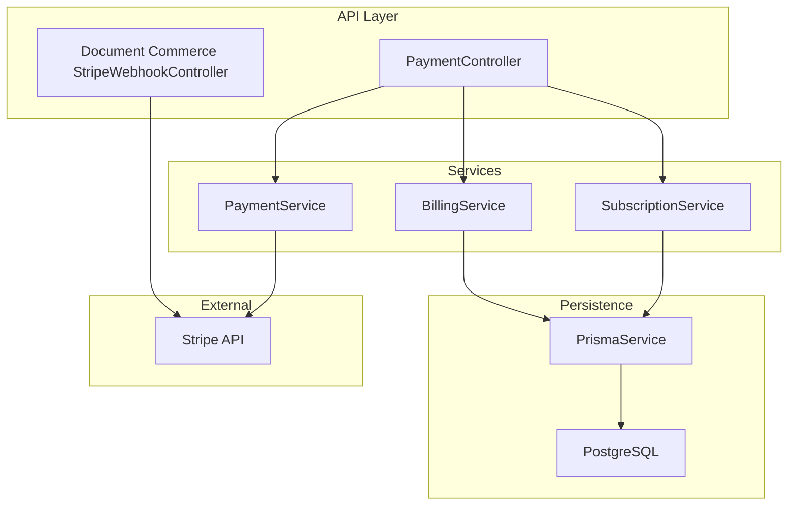
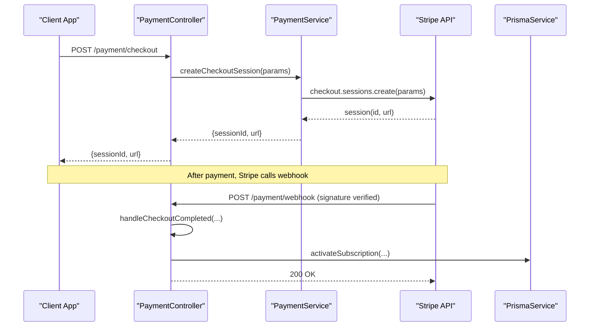
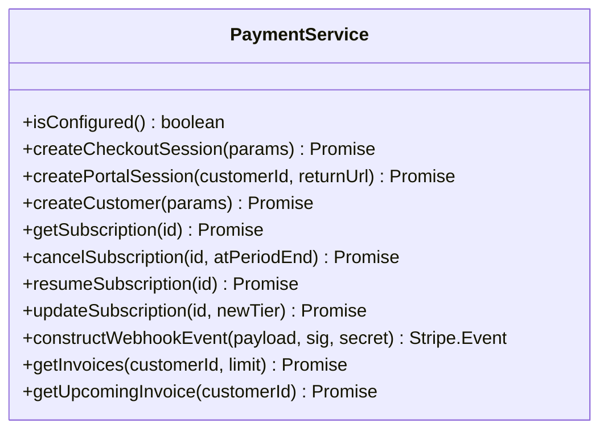
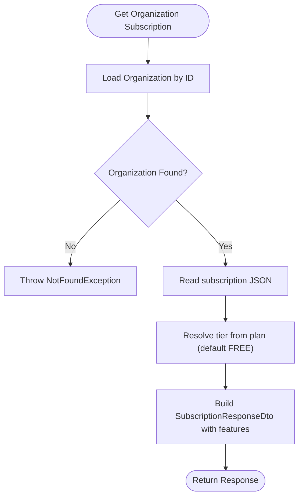
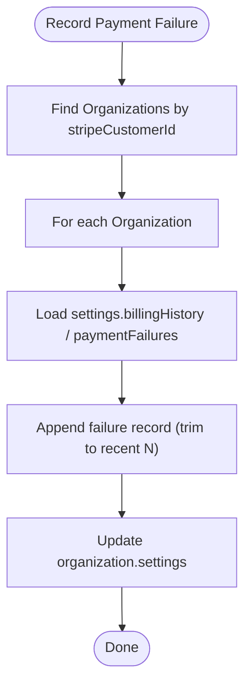
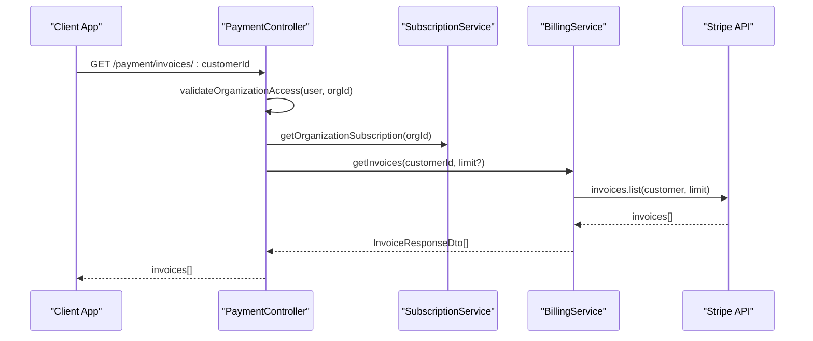
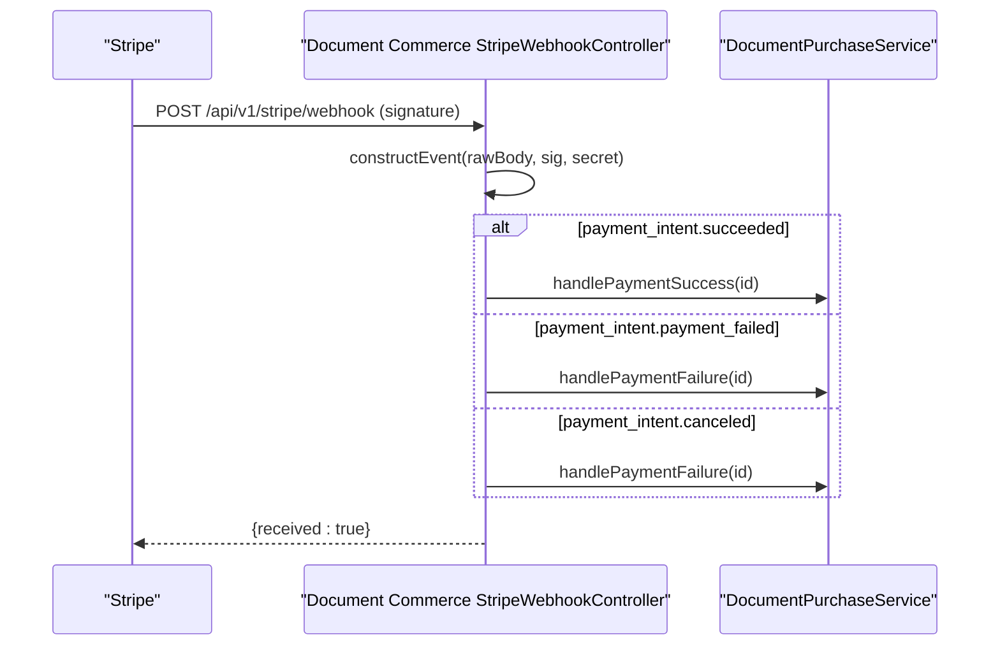
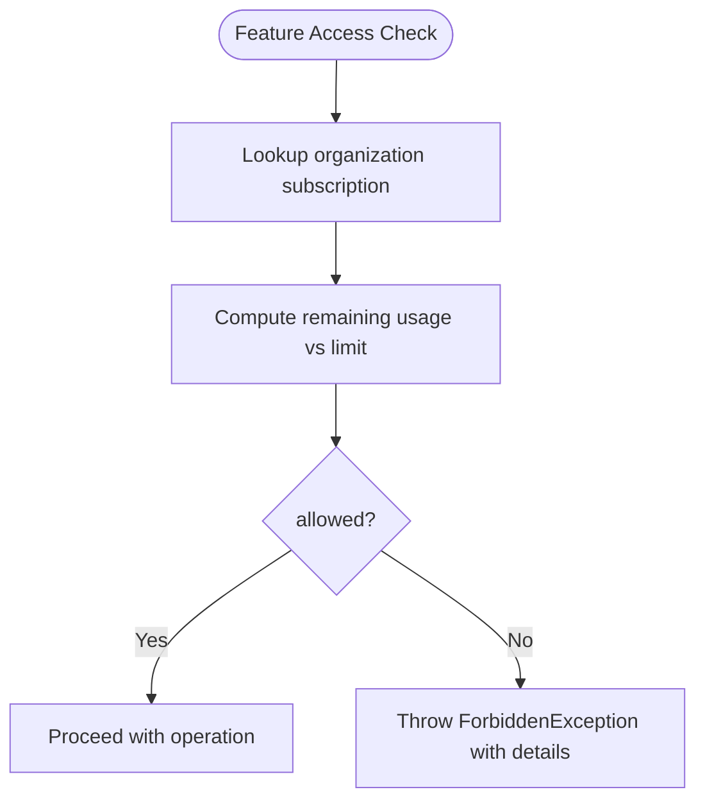
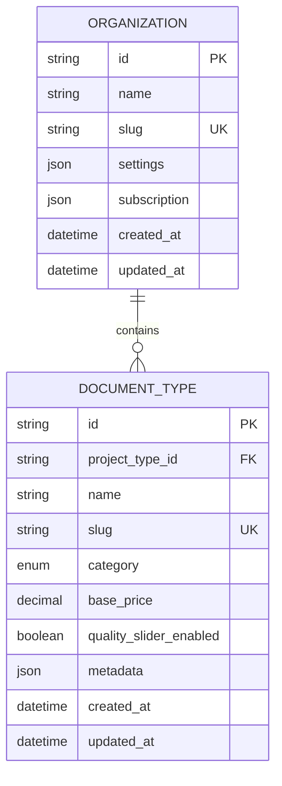
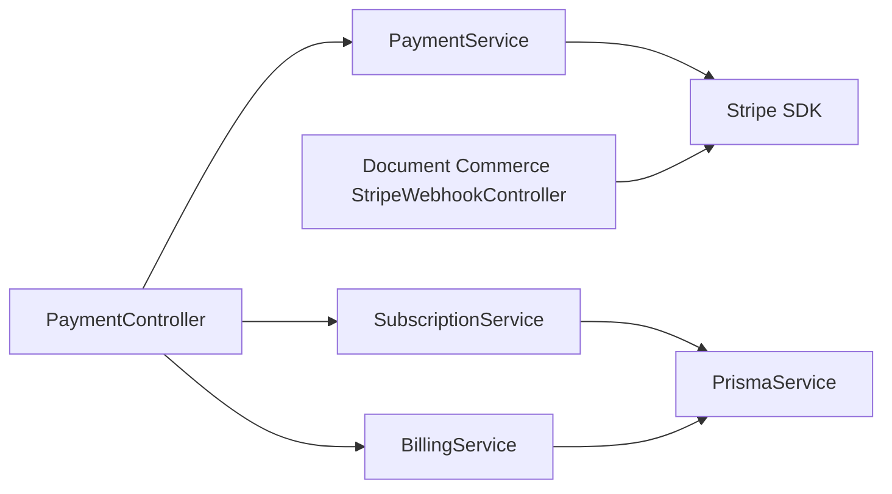

# Payment & Billing

<cite>
**Referenced Files in This Document**
- [payment.module.ts](file://apps/api/src/modules/payment/payment.module.ts)
- [payment.service.ts](file://apps/api/src/modules/payment/payment.service.ts)
- [subscription.service.ts](file://apps/api/src/modules/payment/subscription.service.ts)
- [billing.service.ts](file://apps/api/src/modules/payment/billing.service.ts)
- [payment.controller.ts](file://apps/api/src/modules/payment/payment.controller.ts)
- [payment.dto.ts](file://apps/api/src/modules/payment/dto/payment.dto.ts)
- [stripe-webhook.controller.ts](file://apps/api/src/modules/document-commerce/stripe-webhook.controller.ts)
- [subscription.guard.ts](file://apps/api/src/common/guards/subscription.guard.ts)
- [schema.prisma](file://prisma/schema.prisma)
- [configuration.ts](file://apps/api/src/config/configuration.ts)
</cite>

## Table of Contents
1. [Introduction](#introduction)
2. [Project Structure](#project-structure)
3. [Core Components](#core-components)
4. [Architecture Overview](#architecture-overview)
5. [Detailed Component Analysis](#detailed-component-analysis)
6. [Dependency Analysis](#dependency-analysis)
7. [Performance Considerations](#performance-considerations)
8. [Troubleshooting Guide](#troubleshooting-guide)
9. [Conclusion](#conclusion)
10. [Appendices](#appendices)

## Introduction
This document describes the payment processing and subscription management system built on Stripe. It covers recurring billing, one-time payments, tier-based pricing (Free, Professional, Enterprise), feature gating, invoice generation, payment reconciliation, revenue tracking, subscription lifecycle management (trial, renewal, cancellation), usage-based billing, metered billing, promotional pricing, admin interfaces, integration with the questionnaire system, document generation limits, and security measures for PCI compliance.

## Project Structure
The payment system is organized into three primary API modules:
- Payment module: Stripe integration for subscriptions and billing
- Document Commerce module: Stripe webhooks for per-document purchases
- Common guards: Feature gating and rate limiting by subscription tier

**Diagram sources**
- [payment.controller.ts:41-396](file://apps/api/src/modules/payment/payment.controller.ts#L41-L396)
- [payment.service.ts:57-316](file://apps/api/src/modules/payment/payment.service.ts#L57-L316)
- [subscription.service.ts:29-237](file://apps/api/src/modules/payment/subscription.service.ts#L29-L237)
- [billing.service.ts:34-270](file://apps/api/src/modules/payment/billing.service.ts#L34-L270)
- [stripe-webhook.controller.ts:22-144](file://apps/api/src/modules/document-commerce/stripe-webhook.controller.ts#L22-L144)

**Section sources**
- [payment.module.ts:18-24](file://apps/api/src/modules/payment/payment.module.ts#L18-L24)
- [payment.controller.ts:41-396](file://apps/api/src/modules/payment/payment.controller.ts#L41-L396)
- [payment.service.ts:57-316](file://apps/api/src/modules/payment/payment.service.ts#L57-L316)
- [subscription.service.ts:29-237](file://apps/api/src/modules/payment/subscription.service.ts#L29-L237)
- [billing.service.ts:34-270](file://apps/api/src/modules/payment/billing.service.ts#L34-L270)
- [stripe-webhook.controller.ts:22-144](file://apps/api/src/modules/document-commerce/stripe-webhook.controller.ts#L22-L144)

## Core Components
- PaymentService: Creates Stripe checkout sessions, manages Stripe customers, handles subscription updates, portal sessions, and webhook signature verification. Implements tier-based pricing with environment-driven price IDs.
- SubscriptionService: Reads and activates subscriptions, synchronizes status from Stripe webhooks, cancels subscriptions, checks feature access, and compares tiers.
- BillingService: Retrieves invoices/upcoming invoices, records successful and failed payments, maintains billing history and failure logs, computes billing summaries, and aggregates usage statistics.
- PaymentController: Exposes endpoints for tiers, checkout, portal sessions, subscription status, invoices, usage, cancellation/resume, and Stripe webhook handling.
- StripeWebhookController (Document Commerce): Handles per-document payment webhooks for payment intent events.
- Subscription Guard: Enforces feature access and rate limits based on subscription tiers.

**Section sources**
- [payment.service.ts:10-49](file://apps/api/src/modules/payment/payment.service.ts#L10-L49)
- [subscription.service.ts:28-237](file://apps/api/src/modules/payment/subscription.service.ts#L28-L237)
- [billing.service.ts:32-270](file://apps/api/src/modules/payment/billing.service.ts#L32-L270)
- [payment.controller.ts:41-396](file://apps/api/src/modules/payment/payment.controller.ts#L41-L396)
- [stripe-webhook.controller.ts:22-144](file://apps/api/src/modules/document-commerce/stripe-webhook.controller.ts#L22-L144)
- [subscription.guard.ts:156-288](file://apps/api/src/common/guards/subscription.guard.ts#L156-L288)

## Architecture Overview
The system integrates Stripe for payment orchestration and persists subscription and billing state in PostgreSQL via Prisma. Controllers expose REST endpoints; services encapsulate business logic; guards enforce feature access and rate limits; and webhooks keep state synchronized.

**Diagram sources**
- [payment.controller.ts:84-97](file://apps/api/src/modules/payment/payment.controller.ts#L84-L97)
- [payment.service.ts:105-152](file://apps/api/src/modules/payment/payment.service.ts#L105-L152)
- [payment.controller.ts:297-347](file://apps/api/src/modules/payment/payment.controller.ts#L297-L347)

## Detailed Component Analysis

### PaymentService
- Tier configuration defines Free, Professional, Enterprise with feature caps and pricing.
- Environment-driven price IDs for Professional and Enterprise tiers.
- Checkout session creation with metadata for organization and tier.
- Customer portal session creation.
- Subscription operations: cancel at period end or immediately, resume, update to new tier.
- Webhook signature verification.
- Invoice retrieval and upcoming invoice preview.

**Diagram sources**
- [payment.service.ts:57-316](file://apps/api/src/modules/payment/payment.service.ts#L57-L316)

**Section sources**
- [payment.service.ts:10-49](file://apps/api/src/modules/payment/payment.service.ts#L10-L49)
- [payment.service.ts:85-100](file://apps/api/src/modules/payment/payment.service.ts#L85-L100)
- [payment.service.ts:105-152](file://apps/api/src/modules/payment/payment.service.ts#L105-L152)
- [payment.service.ts:157-168](file://apps/api/src/modules/payment/payment.service.ts#L157-L168)
- [payment.service.ts:173-193](file://apps/api/src/modules/payment/payment.service.ts#L173-L193)
- [payment.service.ts:198-204](file://apps/api/src/modules/payment/payment.service.ts#L198-L204)
- [payment.service.ts:209-237](file://apps/api/src/modules/payment/payment.service.ts#L209-L237)
- [payment.service.ts:242-269](file://apps/api/src/modules/payment/payment.service.ts#L242-L269)
- [payment.service.ts:274-280](file://apps/api/src/modules/payment/payment.service.ts#L274-L280)
- [payment.service.ts:285-296](file://apps/api/src/modules/payment/payment.service.ts#L285-L296)
- [payment.service.ts:301-314](file://apps/api/src/modules/payment/payment.service.ts#L301-L314)

### SubscriptionService
- Retrieves organization subscription, activates post-checkout, syncs status from webhooks, cancels by Stripe subscription ID, and checks feature access.
- Compares tiers to determine upgrade/downgrade.
- Provides tier features and organization lists by tier.

**Diagram sources**
- [subscription.service.ts:37-70](file://apps/api/src/modules/payment/subscription.service.ts#L37-L70)

**Section sources**
- [subscription.service.ts:37-70](file://apps/api/src/modules/payment/subscription.service.ts#L37-L70)
- [subscription.service.ts:75-92](file://apps/api/src/modules/payment/subscription.service.ts#L75-L92)
- [subscription.service.ts:97-132](file://apps/api/src/modules/payment/subscription.service.ts#L97-L132)
- [subscription.service.ts:137-165](file://apps/api/src/modules/payment/subscription.service.ts#L137-L165)
- [subscription.service.ts:170-189](file://apps/api/src/modules/payment/subscription.service.ts#L170-L189)
- [subscription.service.ts:194-207](file://apps/api/src/modules/payment/subscription.service.ts#L194-L207)
- [subscription.service.ts:212-215](file://apps/api/src/modules/payment/subscription.service.ts#L212-L215)
- [subscription.service.ts:220-235](file://apps/api/src/modules/payment/subscription.service.ts#L220-L235)

### BillingService
- Retrieves invoices and upcoming invoice previews.
- Records successful payments and failures into organization settings (billingHistory, lastPayment, paymentFailures, lastPaymentFailure).
- Computes billing summary totals and failure indicators.
- Aggregates usage statistics (responses tracked; placeholders for questionnaires/documents/apiCalls).

**Diagram sources**
- [billing.service.ts:145-190](file://apps/api/src/modules/payment/billing.service.ts#L145-L190)

**Section sources**
- [billing.service.ts:44-60](file://apps/api/src/modules/payment/billing.service.ts#L44-L60)
- [billing.service.ts:65-86](file://apps/api/src/modules/payment/billing.service.ts#L65-L86)
- [billing.service.ts:91-140](file://apps/api/src/modules/payment/billing.service.ts#L91-L140)
- [billing.service.ts:145-190](file://apps/api/src/modules/payment/billing.service.ts#L145-L190)
- [billing.service.ts:195-234](file://apps/api/src/modules/payment/billing.service.ts#L195-L234)
- [billing.service.ts:239-268](file://apps/api/src/modules/payment/billing.service.ts#L239-L268)

### PaymentController
- Exposes endpoints for tiers, checkout, portal, subscription status, invoices, usage, cancel/resume, and Stripe webhook.
- Validates JWT-authenticated user access to organization/customer.
- Delegates to services and returns DTOs.

**Diagram sources**
- [payment.controller.ts:148-177](file://apps/api/src/modules/payment/payment.controller.ts#L148-L177)
- [billing.service.ts:44-60](file://apps/api/src/modules/payment/billing.service.ts#L44-L60)

**Section sources**
- [payment.controller.ts:73-76](file://apps/api/src/modules/payment/payment.controller.ts#L73-L76)
- [payment.controller.ts:84-97](file://apps/api/src/modules/payment/payment.controller.ts#L84-L97)
- [payment.controller.ts:102-129](file://apps/api/src/modules/payment/payment.controller.ts#L102-L129)
- [payment.controller.ts:134-143](file://apps/api/src/modules/payment/payment.controller.ts#L134-L143)
- [payment.controller.ts:148-177](file://apps/api/src/modules/payment/payment.controller.ts#L148-L177)
- [payment.controller.ts:182-221](file://apps/api/src/modules/payment/payment.controller.ts#L182-L221)
- [payment.controller.ts:226-244](file://apps/api/src/modules/payment/payment.controller.ts#L226-L244)
- [payment.controller.ts:249-267](file://apps/api/src/modules/payment/payment.controller.ts#L249-L267)
- [payment.controller.ts:272-324](file://apps/api/src/modules/payment/payment.controller.ts#L272-L324)
- [payment.controller.ts:297-347](file://apps/api/src/modules/payment/payment.controller.ts#L297-L347)
- [payment.controller.ts:349-363](file://apps/api/src/modules/payment/payment.controller.ts#L349-L363)
- [payment.controller.ts:365-369](file://apps/api/src/modules/payment/payment.controller.ts#L365-L369)
- [payment.controller.ts:371-382](file://apps/api/src/modules/payment/payment.controller.ts#L371-L382)
- [payment.controller.ts:384-394](file://apps/api/src/modules/payment/payment.controller.ts#L384-L394)

### StripeWebhookController (Document Commerce)
- Handles per-document payment webhooks for payment intents (success, failure, canceled).
- Verifies webhook signatures and delegates to purchase service.

**Diagram sources**
- [stripe-webhook.controller.ts:55-103](file://apps/api/src/modules/document-commerce/stripe-webhook.controller.ts#L55-L103)
- [stripe-webhook.controller.ts:108-142](file://apps/api/src/modules/document-commerce/stripe-webhook.controller.ts#L108-L142)

**Section sources**
- [stripe-webhook.controller.ts:22-144](file://apps/api/src/modules/document-commerce/stripe-webhook.controller.ts#L22-L144)

### Subscription Guard and Feature Matrix
- Middleware attaches subscription tier and API limits to responses.
- Guards enforce feature access and raise structured errors when limits are exceeded.
- Feature matrix defines tiered limits for questionnaires, responses, documents, API calls, team members, dimensions, export formats, and premium features.

**Diagram sources**
- [subscription.guard.ts:156-174](file://apps/api/src/common/guards/subscription.guard.ts#L156-L174)

**Section sources**
- [subscription.guard.ts:156-174](file://apps/api/src/common/guards/subscription.guard.ts#L156-L174)
- [subscription.guard.ts:180-215](file://apps/api/src/common/guards/subscription.guard.ts#L180-L215)
- [subscription.guard.ts:220-234](file://apps/api/src/common/guards/subscription.guard.ts#L220-L234)
- [subscription.guard.ts:238-255](file://apps/api/src/common/guards/subscription.guard.ts#L238-L255)
- [subscription.guard.ts:260-288](file://apps/api/src/common/guards/subscription.guard.ts#L260-L288)

### Data Model and Persistence
- Organization model includes subscription JSON and settings JSON for storing Stripe identifiers, plan status, billing history, and failure logs.
- Document types include pricing fields for per-document generation.

**Diagram sources**
- [schema.prisma:154-170](file://prisma/schema.prisma#L154-L170)
- [schema.prisma:712-742](file://prisma/schema.prisma#L712-L742)

**Section sources**
- [schema.prisma:154-170](file://prisma/schema.prisma#L154-L170)
- [schema.prisma:712-742](file://prisma/schema.prisma#L712-L742)

## Dependency Analysis
- PaymentController depends on PaymentService, SubscriptionService, BillingService, PrismaService, and ConfigService.
- PaymentService depends on Stripe SDK and ConfigService for keys and price IDs.
- SubscriptionService and BillingService depend on PrismaService for persistence.
- StripeWebhookController depends on ConfigService and DocumentPurchaseService.
- Subscription guard depends on SubscriptionService for feature checks.

**Diagram sources**
- [payment.controller.ts:45-51](file://apps/api/src/modules/payment/payment.controller.ts#L45-L51)
- [payment.service.ts:61-72](file://apps/api/src/modules/payment/payment.service.ts#L61-L72)
- [subscription.service.ts](file://apps/api/src/modules/payment/subscription.service.ts#L32)
- [billing.service.ts:36-39](file://apps/api/src/modules/payment/billing.service.ts#L36-L39)
- [stripe-webhook.controller.ts:29-49](file://apps/api/src/modules/document-commerce/stripe-webhook.controller.ts#L29-L49)

**Section sources**
- [payment.controller.ts:45-51](file://apps/api/src/modules/payment/payment.controller.ts#L45-L51)
- [payment.service.ts:61-72](file://apps/api/src/modules/payment/payment.service.ts#L61-L72)
- [subscription.service.ts](file://apps/api/src/modules/payment/subscription.service.ts#L32)
- [billing.service.ts:36-39](file://apps/api/src/modules/payment/billing.service.ts#L36-L39)
- [stripe-webhook.controller.ts:29-49](file://apps/api/src/modules/document-commerce/stripe-webhook.controller.ts#L29-L49)

## Performance Considerations
- Webhook verification and event routing are synchronous; ensure idempotent handlers and minimal retries.
- Invoice retrieval and upcoming invoice preview are delegated to Stripe; cache results at the application layer if needed.
- Feature access checks are O(1) lookups against subscription features; avoid repeated database reads by leveraging middleware-provided request context.
- Rate limiting varies by tier; configure upstream API gateways accordingly.

## Troubleshooting Guide
Common issues and resolutions:
- Missing Stripe configuration: PaymentService throws when keys are absent; verify environment variables and restart the service.
- Invalid webhook signature: PaymentController rejects unsigned or malformed webhook events; confirm webhook secret and raw body delivery.
- Access denied to billing account: PaymentController validates customer ownership; ensure the requesting user belongs to the organization owning the subscription.
- Feature limit exceeded: Subscription guard raises a structured error with feature, limit, and remaining counts; guide users to upgrade.
- Payment reconciliation discrepancies: BillingService writes billingHistory and lastPayment; reconcile by comparing Stripe invoice status transitions with local records.

**Section sources**
- [payment.service.ts:61-72](file://apps/api/src/modules/payment/payment.service.ts#L61-L72)
- [payment.controller.ts:278-294](file://apps/api/src/modules/payment/payment.controller.ts#L278-L294)
- [payment.controller.ts:119-125](file://apps/api/src/modules/payment/payment.controller.ts#L119-L125)
- [subscription.guard.ts:162-172](file://apps/api/src/common/guards/subscription.guard.ts#L162-L172)
- [billing.service.ts:91-140](file://apps/api/src/modules/payment/billing.service.ts#L91-L140)

## Conclusion
The system provides a robust, Stripe-backed billing platform with tier-based access control, subscription lifecycle management, invoice handling, and usage tracking. It integrates seamlessly with the questionnaire and document generation workflows while enforcing strict feature and rate limits per tier. Security is ensured through webhook signature verification and environment-based configuration.

## Appendices

### Tier-Based Pricing and Feature Matrix
- Free: Limited usage (e.g., questionnaires, responses, documents, API calls).
- Professional: Higher limits and email support.
- Enterprise: Unlimited usage and priority support.

**Section sources**
- [payment.service.ts:10-49](file://apps/api/src/modules/payment/payment.service.ts#L10-L49)
- [subscription.guard.ts:238-255](file://apps/api/src/common/guards/subscription.guard.ts#L238-L255)

### Subscription Lifecycle Management
- Activation: Triggered by checkout.session.completed webhook; sets plan, status, and Stripe identifiers.
- Status sync: customer.subscription.* webhooks update plan status and period end.
- Cancellation: Scheduled at period end or immediate; resets plan to Free.
- Resume: Clears cancel_at_period_end to continue billing.

**Section sources**
- [payment.controller.ts:297-347](file://apps/api/src/modules/payment/payment.controller.ts#L297-L347)
- [payment.controller.ts:349-363](file://apps/api/src/modules/payment/payment.controller.ts#L349-L363)
- [payment.controller.ts:365-369](file://apps/api/src/modules/payment/payment.controller.ts#L365-L369)
- [subscription.service.ts:75-92](file://apps/api/src/modules/payment/subscription.service.ts#L75-L92)
- [subscription.service.ts:97-132](file://apps/api/src/modules/payment/subscription.service.ts#L97-L132)
- [subscription.service.ts:137-165](file://apps/api/src/modules/payment/subscription.service.ts#L137-L165)
- [subscription.service.ts:229-237](file://apps/api/src/modules/payment/subscription.service.ts#L229-L237)

### Usage-Based Billing and Metering
- Current usage aggregation focuses on responses; additional metrics (questionnaires, documents, API calls) are placeholders awaiting implementation.
- Feature gating enforces limits per tier; middleware exposes tier and API limits to clients.

**Section sources**
- [billing.service.ts:239-268](file://apps/api/src/modules/payment/billing.service.ts#L239-L268)
- [subscription.guard.ts:180-215](file://apps/api/src/common/guards/subscription.guard.ts#L180-L215)

### Promotional Pricing and One-Time Payments
- Recurring billing uses Stripe subscription price IDs configured per tier.
- One-time payments for document generation are handled by the document commerce webhook controller for payment intents.

**Section sources**
- [payment.service.ts:85-100](file://apps/api/src/modules/payment/payment.service.ts#L85-L100)
- [stripe-webhook.controller.ts:86-100](file://apps/api/src/modules/document-commerce/stripe-webhook.controller.ts#L86-L100)

### Admin Interfaces and Revenue Analytics
- Admin-facing endpoints include subscription status, invoices, and usage dashboards.
- BillingService provides billing summaries and failure tracking for revenue analytics.

**Section sources**
- [payment.controller.ts:134-143](file://apps/api/src/modules/payment/payment.controller.ts#L134-L143)
- [payment.controller.ts:148-177](file://apps/api/src/modules/payment/payment.controller.ts#L148-L177)
- [payment.controller.ts:182-221](file://apps/api/src/modules/payment/payment.controller.ts#L182-L221)
- [billing.service.ts:195-234](file://apps/api/src/modules/payment/billing.service.ts#L195-L234)

### Security and PCI Compliance
- Webhook signature verification is mandatory; raw bodies must be present.
- Environment validation ensures strong secrets and secure configuration.
- Sensitive payment data is processed by Stripe; local systems store only non-sensitive identifiers and metadata.

**Section sources**
- [payment.controller.ts:278-294](file://apps/api/src/modules/payment/payment.controller.ts#L278-L294)
- [configuration.ts:5-43](file://apps/api/src/config/configuration.ts#L5-L43)
- [stripe-webhook.controller.ts:71-82](file://apps/api/src/modules/document-commerce/stripe-webhook.controller.ts#L71-L82)