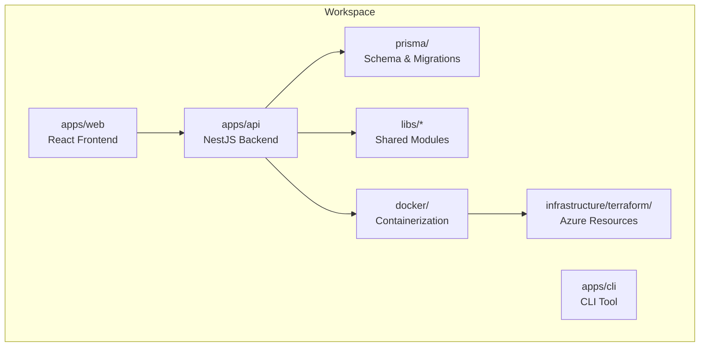
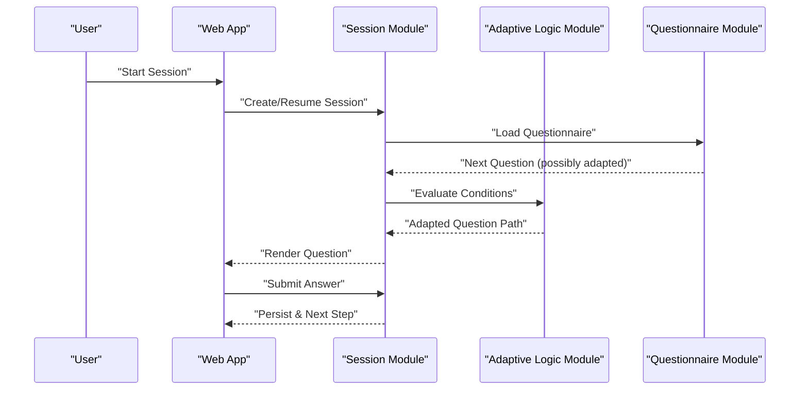
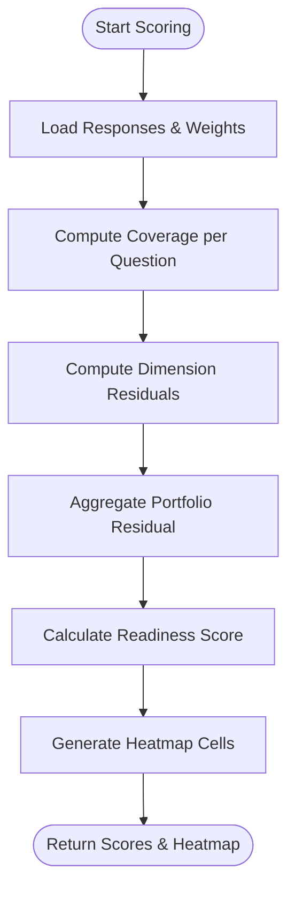
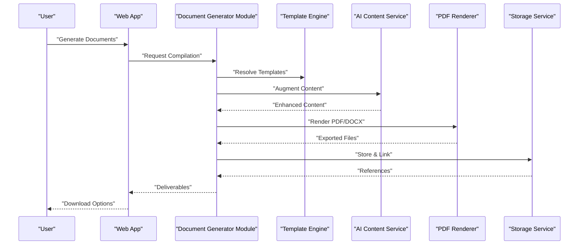
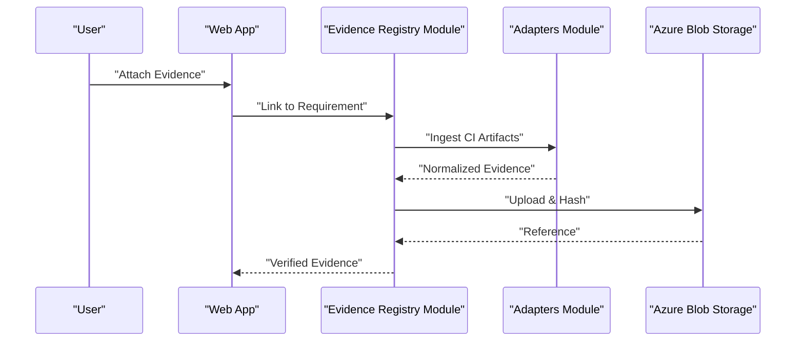
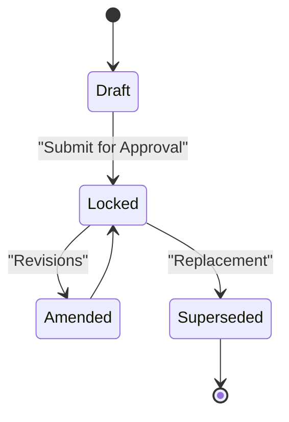
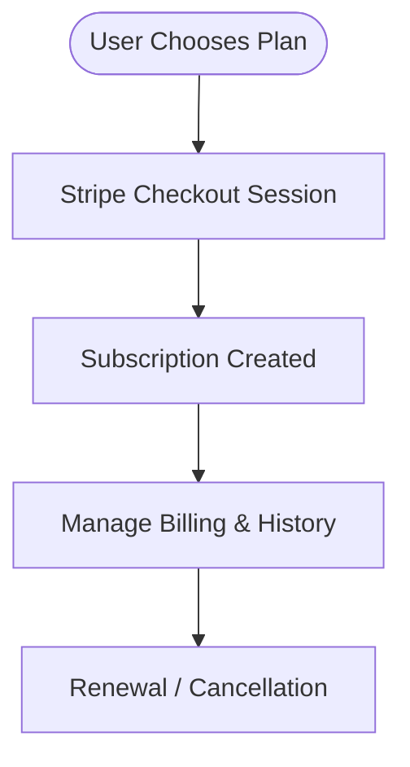
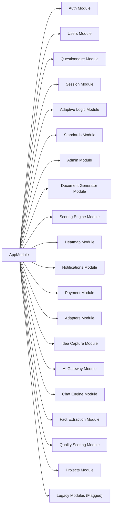

# Product Overview

<cite>
**Referenced Files in This Document**
- [PRODUCT-OVERVIEW.md](file://PRODUCT-OVERVIEW.md)
- [README.md](file://README.md)
- [apps/api/src/app.module.ts](file://apps/api/src/app.module.ts)
- [apps/api/src/modules/adaptive-logic/adaptive-logic.module.ts](file://apps/api/src/modules/adaptive-logic/adaptive-logic.module.ts)
- [apps/api/src/modules/scoring-engine/scoring-engine.module.ts](file://apps/api/src/modules/scoring-engine/scoring-engine.module.ts)
- [apps/api/src/modules/document-generator/document-generator.module.ts](file://apps/api/src/modules/document-generator/document-generator.module.ts)
- [apps/api/src/modules/evidence-registry/evidence-registry.module.ts](file://apps/api/src/modules/evidence-registry/evidence-registry.module.ts)
- [apps/api/src/modules/decision-log/decision-log.module.ts](file://apps/api/src/modules/decision-log/decision-log.module.ts)
- [apps/api/src/modules/heatmap/heatmap.module.ts](file://apps/api/src/modules/heatmap/heatmap.module.ts)
- [apps/api/src/modules/payment/payment.module.ts](file://apps/api/src/modules/payment/payment.module.ts)
- [apps/api/src/modules/adapters/adapters.module.ts](file://apps/api/src/modules/adapters/adapters.module.ts)
- [package.json](file://package.json)
</cite>

## Table of Contents
1. [Introduction](#introduction)
2. [Project Structure](#project-structure)
3. [Core Components](#core-components)
4. [Architecture Overview](#architecture-overview)
5. [Detailed Component Analysis](#detailed-component-analysis)
6. [Dependency Analysis](#dependency-analysis)
7. [Performance Considerations](#performance-considerations)
8. [Troubleshooting Guide](#troubleshooting-guide)
9. [Conclusion](#conclusion)
10. [Appendices](#appendices)

## Introduction
Quiz-to-build (Quiz2Biz) is an Adaptive Client Questionnaire System that transforms interactive assessments into comprehensive technical documentation packages. It enables organizations to evaluate technology readiness, receive real-time scoring across seven dimensions, and automatically generate professional deliverables such as architecture dossiers, SDLC playbooks, policy packs, and compliance guides. The platform integrates adaptive logic, intelligent scoring, automated document generation, and an evidence registry to support decision-making, governance, and continuous improvement.

Key capabilities include:
- Adaptive questionnaires with 11 question types and dynamic branching
- Multi-dimensional scoring with real-time heatmaps and gap analysis
- Automated generation of 8+ document types (DOCX/PDF)
- Evidence registry with integrations to development platforms
- Decision log with approval workflows and audit trails
- Modern cloud-native stack with strong security and performance characteristics

Target personas and use cases:
- CTOs: Technical architecture and standards assessment
- CFOs: Resource planning and financial documentation
- CEOs: Executive summaries and strategic alignment
- Business Analysts: Requirements and process documentation
- Compliance Teams: Policy packages and compliance tracking

**Section sources**
- [PRODUCT-OVERVIEW.md:1-240](file://PRODUCT-OVERVIEW.md#L1-L240)
- [README.md:18-29](file://README.md#L18-L29)

## Project Structure
The repository follows a monorepo workspace with three primary applications:
- apps/api: NestJS backend with modular feature domains
- apps/web: React 19 frontend (TypeScript, Vite, Tailwind)
- apps/cli: Command-line interface for offline and batch operations

Shared libraries and infrastructure:
- libs: Shared modules (database, orchestrator, redis)
- prisma: Database schema and migrations
- docker: Containerized services and entrypoints
- infrastructure/terraform: Azure deployment resources
- docs: Architectural decision records, BA docs, and technical guides
- e2e and test: Extensive test suites (unit, integration, E2E, performance)

**Diagram sources**
- [package.json:11-14](file://package.json#L11-L14)
- [README.md:295-318](file://README.md#L295-L318)

**Section sources**
- [README.md:295-318](file://README.md#L295-L318)
- [package.json:11-14](file://package.json#L11-L14)

## Core Components
This section outlines the principal modules that define Quiz2Biz’s capabilities.

- Adaptive Logic Module
  - Provides condition evaluation and dynamic question branching based on prior answers.
  - Integrates with sessions and questionnaire logic to tailor the assessment flow.

- Scoring Engine Module
  - Implements risk-weighted readiness scoring with explicit formulas:
    - Coverage per question (0–1)
    - Dimension residual combining weighted severity and missing coverage
    - Portfolio residual aggregating dimension residuals
    - Readiness Score = 100 × (1 − Portfolio Residual)
  - Exposes controllers and services for scoring computation and persistence.

- Heatmap Module
  - Generates dimension × severity visualizations (Green/Amber/Red).
  - Supports CSV/Markdown exports and drill-down into contributing questions.

- Document Generator Module
  - Orchestrates document assembly from templates, markdown rendering, AI content augmentation, and PDF/DOCX export.
  - Includes bulk download and quality calibration services.

- Evidence Registry Module
  - Manages evidence linkage to requirements, supports integrations with GitHub, GitLab, Jira, Confluence, and CI artifacts.
  - Ensures integrity and compliance-ready tracking.

- Decision Log Module
  - Maintains append-only decision records with status workflows (DRAFT → LOCKED → AMENDED/SUPERSEDED).
  - Enforces two-person rule and audit export for compliance.

- Payment Module
  - Stripe integration for subscription tiers (Free/Professional/Enterprise), checkout sessions, and billing history.

- Adapters Module
  - Integrates external systems (GitHub, GitLab, Jira-Confluence) via adapter services and configuration.

- Session Module
  - Coordinates questionnaire sessions, auto-save, expiration, and conversation services.

**Section sources**
- [apps/api/src/modules/adaptive-logic/adaptive-logic.module.ts:1-12](file://apps/api/src/modules/adaptive-logic/adaptive-logic.module.ts#L1-L12)
- [apps/api/src/modules/scoring-engine/scoring-engine.module.ts:1-23](file://apps/api/src/modules/scoring-engine/scoring-engine.module.ts#L1-L23)
- [apps/api/src/modules/heatmap/heatmap.module.ts:1-27](file://apps/api/src/modules/heatmap/heatmap.module.ts#L1-L27)
- [apps/api/src/modules/document-generator/document-generator.module.ts:1-47](file://apps/api/src/modules/document-generator/document-generator.module.ts#L1-L47)
- [apps/api/src/modules/evidence-registry/evidence-registry.module.ts:1-27](file://apps/api/src/modules/evidence-registry/evidence-registry.module.ts#L1-L27)
- [apps/api/src/modules/decision-log/decision-log.module.ts:1-25](file://apps/api/src/modules/decision-log/decision-log.module.ts#L1-L25)
- [apps/api/src/modules/payment/payment.module.ts:1-25](file://apps/api/src/modules/payment/payment.module.ts#L1-L25)
- [apps/api/src/modules/adapters/adapters.module.ts:1-17](file://apps/api/src/modules/adapters/adapters.module.ts#L1-L17)
- [apps/api/src/modules/session/session.module.ts:1-24](file://apps/api/src/modules/session/session.module.ts#L1-L24)

## Architecture Overview
Quiz2Biz employs a modular NestJS backend with a clear separation of concerns across feature domains. The frontend is a React SPA communicating with the backend via REST APIs. Data persistence uses PostgreSQL with Prisma, caching with Redis, and cloud storage via Azure Blob. Stripe handles billing, and optional legacy modules (evidence registry, decision log, QPG, policy pack) are conditionally loaded via environment flags.

```mermaid
graph TB
subgraph "Client Layer"
WEB["React Web App"]
end
subgraph "API Layer (NestJS)"
AUTH["Auth Module"]
USERS["Users Module"]
QUEST["Questionnaire Module"]
SESSION["Session Module"]
ADALOGIC["Adaptive Logic Module"]
STANDARDS["Standards Module"]
ADM["Admin Module"]
DOCGEN["Document Generator Module"]
SCORE["Scoring Engine Module"]
HEAT["Heatmap Module"]
NOTIF["Notifications Module"]
PAY["Payment Module"]
ADAPTERS["Adapters Module"]
IDEA["Idea Capture Module"]
AIGATE["AI Gateway Module"]
CHAT["Chat Engine Module"]
FACT["Fact Extraction Module"]
QUAL["Quality Scoring Module"]
PROJ["Projects Module"]
LEGACY["Legacy Modules (Feature Flagged)"]
end
subgraph "Infrastructure"
DB["PostgreSQL (Prisma)"]
CACHE["Redis"]
STORAGE["Azure Blob Storage"]
MONITOR["Application Insights"]
CI["CI/CD (Azure Pipelines / GH Actions)"]
end
WEB --> API["REST API"]
API --> AUTH
API --> USERS
API --> QUEST
API --> SESSION
API --> ADALOGIC
API --> STANDARDS
API --> ADM
API --> DOCGEN
API --> SCORE
API --> HEAT
API --> NOTIF
API --> PAY
API --> ADAPTERS
API --> IDEA
API --> AIGATE
API --> CHAT
API --> FACT
API --> QUAL
API --> PROJ
API --> LEGACY
API --> DB
API --> CACHE
API --> STORAGE
API --> MONITOR
API --> CI
```

**Diagram sources**
- [apps/api/src/app.module.ts:1-130](file://apps/api/src/app.module.ts#L1-L130)
- [apps/api/src/modules/adaptive-logic/adaptive-logic.module.ts:1-12](file://apps/api/src/modules/adaptive-logic/adaptive-logic.module.ts#L1-L12)
- [apps/api/src/modules/scoring-engine/scoring-engine.module.ts:1-23](file://apps/api/src/modules/scoring-engine/scoring-engine.module.ts#L1-L23)
- [apps/api/src/modules/document-generator/document-generator.module.ts:1-47](file://apps/api/src/modules/document-generator/document-generator.module.ts#L1-L47)
- [apps/api/src/modules/evidence-registry/evidence-registry.module.ts:1-27](file://apps/api/src/modules/evidence-registry/evidence-registry.module.ts#L1-L27)
- [apps/api/src/modules/decision-log/decision-log.module.ts:1-25](file://apps/api/src/modules/decision-log/decision-log.module.ts#L1-L25)
- [apps/api/src/modules/heatmap/heatmap.module.ts:1-27](file://apps/api/src/modules/heatmap/heatmap.module.ts#L1-L27)
- [apps/api/src/modules/payment/payment.module.ts:1-25](file://apps/api/src/modules/payment/payment.module.ts#L1-L25)
- [apps/api/src/modules/adapters/adapters.module.ts:1-17](file://apps/api/src/modules/adapters/adapters.module.ts#L1-L17)

## Detailed Component Analysis

### Adaptive Questionnaire System
The adaptive questionnaire system dynamically adjusts subsequent questions based on earlier responses. It supports 11 question types, auto-save every 30 seconds, session resume, and progress tracking. The system is built around the Questionnaire and Session modules, with Adaptive Logic providing the evaluation engine.

**Diagram sources**
- [apps/api/src/modules/session/session.module.ts:1-24](file://apps/api/src/modules/session/session.module.ts#L1-L24)
- [apps/api/src/modules/adaptive-logic/adaptive-logic.module.ts:1-12](file://apps/api/src/modules/adaptive-logic/adaptive-logic.module.ts#L1-L12)
- [apps/api/src/modules/questionnaire/questionnaire.module.ts:1-11](file://apps/api/src/modules/questionnaire/questionnaire.module.ts#L1-L11)

**Section sources**
- [PRODUCT-OVERVIEW.md:27-33](file://PRODUCT-OVERVIEW.md#L27-L33)
- [README.md:122-131](file://README.md#L122-L131)

### Intelligent Scoring Engine
The scoring engine computes readiness scores using explicit formulas:
- Coverage per question (C_i ∈ [0,1])
- Dimension residual: R_d = Σ(S_i × (1−C_i)) / (Σ S_i + ε)
- Portfolio residual: R = Σ(W_d × R_d)
- Readiness Score = 100 × (1 − R)

It also powers the heatmap visualization and gap analysis.

**Diagram sources**
- [apps/api/src/modules/scoring-engine/scoring-engine.module.ts:7-15](file://apps/api/src/modules/scoring-engine/scoring-engine.module.ts#L7-L15)
- [apps/api/src/modules/heatmap/heatmap.module.ts:7-19](file://apps/api/src/modules/heatmap/heatmap.module.ts#L7-L19)

**Section sources**
- [apps/api/src/modules/scoring-engine/scoring-engine.module.ts:1-23](file://apps/api/src/modules/scoring-engine/scoring-engine.module.ts#L1-L23)
- [apps/api/src/modules/heatmap/heatmap.module.ts:1-27](file://apps/api/src/modules/heatmap/heatmap.module.ts#L1-L27)
- [PRODUCT-OVERVIEW.md:34-46](file://PRODUCT-OVERVIEW.md#L34-L46)

### Automated Documentation Generation
The Document Generator compiles deliverables from templates, markdown rendering, AI content augmentation, and exports to DOCX/PDF. It includes quality calibration, provider comparison, and bulk download capabilities.

**Diagram sources**
- [apps/api/src/modules/document-generator/document-generator.module.ts:19-47](file://apps/api/src/modules/document-generator/document-generator.module.ts#L19-L47)

**Section sources**
- [PRODUCT-OVERVIEW.md:47-57](file://PRODUCT-OVERVIEW.md#L47-L57)
- [README.md:105-111](file://README.md#L105-L111)

### Evidence Registry and Integrations
Evidence Registry tracks deliverables and links them to requirements. It integrates with GitHub, GitLab, Jira, Confluence, and CI artifacts. Integrity checks and compliance-ready tracking are supported.

**Diagram sources**
- [apps/api/src/modules/evidence-registry/evidence-registry.module.ts:8-19](file://apps/api/src/modules/evidence-registry/evidence-registry.module.ts#L8-L19)
- [apps/api/src/modules/adapters/adapters.module.ts:1-17](file://apps/api/src/modules/adapters/adapters.module.ts#L1-L17)

**Section sources**
- [PRODUCT-OVERVIEW.md:58-63](file://PRODUCT-OVERVIEW.md#L58-L63)
- [README.md:114-119](file://README.md#L114-L119)

### Decision Log and Approval Workflow
Decision Log maintains append-only records with status workflows and enforces two-person rule approvals. It supports audit exports for compliance.

**Diagram sources**
- [apps/api/src/modules/decision-log/decision-log.module.ts:8-17](file://apps/api/src/modules/decision-log/decision-log.module.ts#L8-L17)

**Section sources**
- [PRODUCT-OVERVIEW.md:64-69](file://PRODUCT-OVERVIEW.md#L64-L69)
- [README.md:114-119](file://README.md#L114-L119)

### Payment and Subscription Management
Stripe integration manages checkout sessions, subscription tiers, and billing history. Tiers include Free, Professional, and Enterprise with escalating limits.

**Diagram sources**
- [apps/api/src/modules/payment/payment.module.ts:9-17](file://apps/api/src/modules/payment/payment.module.ts#L9-L17)

**Section sources**
- [PRODUCT-OVERVIEW.md:107-129](file://PRODUCT-OVERVIEW.md#L107-L129)
- [README.md:145-152](file://README.md#L145-L152)

## Dependency Analysis
The backend module graph highlights coupling and cohesion across feature domains. The AppModule aggregates modules and applies cross-cutting concerns like throttling and CSRF protection.

**Diagram sources**
- [apps/api/src/app.module.ts:53-116](file://apps/api/src/app.module.ts#L53-L116)

**Section sources**
- [apps/api/src/app.module.ts:1-130](file://apps/api/src/app.module.ts#L1-L130)

## Performance Considerations
- Frontend performance targets: <2.1s LCP, <3.2s TTI, responsive and accessible design.
- API performance: <150ms average response time under load testing.
- Error rate: <0.5% in production validation.
- Uptime target: 99.9%.
- Load testing: k6 and Autocannon validated concurrency up to 50 VUs.
- Offline support: IndexedDB-based autosave every 30 seconds.

**Section sources**
- [PRODUCT-OVERVIEW.md:152-161](file://PRODUCT-OVERVIEW.md#L152-L161)
- [README.md:197-203](file://README.md#L197-L203)

## Troubleshooting Guide
- Authentication and Authorization: JWT with refresh tokens, RBAC, and CSRF protection via guards.
- Rate Limiting: Throttler configured with short/medium/long windows.
- Input Validation: Comprehensive validation across endpoints.
- Security Headers: Helmet.js integration.
- Encryption: HTTPS with managed SSL certificates.
- Audit Logging: Complete action history for compliance.
- GDPR Readiness: Privacy controls and data export capabilities.
- Error Tracking: Sentry integration for error monitoring.
- Accessibility: WCAG 2.2 Level AA compliance.

**Section sources**
- [PRODUCT-OVERVIEW.md:140-151](file://PRODUCT-OVERVIEW.md#L140-L151)
- [README.md:197-203](file://README.md#L197-L203)

## Conclusion
Quiz-to-build delivers a production-ready platform that accelerates technology readiness assessments and automates high-quality documentation generation. Its adaptive questionnaire system, explicit scoring formulas, and robust integrations position it to drive measurable business outcomes: improved decision quality, reduced compliance risk, standardized deliverables, and faster onboarding. With strong security, performance, and scalability characteristics, it is suitable for startups, enterprises, consultants, and investors seeking reliable technical due diligence and governance tools.

[No sources needed since this section summarizes without analyzing specific files]

## Appendices

### 7 Scoring Dimensions
- Modern Architecture
- AI-Assisted Development
- Coding Standards
- Testing & QA
- Security & DevSecOps
- Workflow & Operations
- Documentation & Knowledge Management

**Section sources**
- [PRODUCT-OVERVIEW.md:35-42](file://PRODUCT-OVERVIEW.md#L35-L42)
- [README.md:122-130](file://README.md#L122-L130)

### Supported Document Types
- Architecture Dossier
- SDLC Playbook
- Test Strategy
- DevSecOps Guide
- Privacy & Data Policy
- Observability Guide
- Finance Documents
- Policy Pack

**Section sources**
- [PRODUCT-OVERVIEW.md:48-56](file://PRODUCT-OVERVIEW.md#L48-L56)
- [README.md:105-111](file://README.md#L105-L111)

### Integration Capabilities
- Development Platforms: GitHub, GitLab, Jira, Confluence
- CI Artifact Ingestion
- Azure Blob Storage
- Stripe Payments
- AI Providers (OpenAI, Anthropic)

**Section sources**
- [PRODUCT-OVERVIEW.md:60-61](file://PRODUCT-OVERVIEW.md#L60-L61)
- [apps/api/src/modules/adapters/adapters.module.ts:1-17](file://apps/api/src/modules/adapters/adapters.module.ts#L1-L17)
- [package.json:127-151](file://package.json#L127-L151)

### Technology Stack
- Frontend: React 19, TypeScript, Vite 7, Tailwind CSS 4, React Router 7, React Query, Zustand
- Backend: NestJS, PostgreSQL, Prisma ORM, Redis
- Cloud: Microsoft Azure (Database, Cache, Storage, Monitoring)
- Auth: JWT with refresh tokens, OAuth (Google, GitHub, Microsoft)
- Payments: Stripe
- Testing: Jest, Vitest, Playwright, k6, Lighthouse, axe-core

**Section sources**
- [PRODUCT-OVERVIEW.md:79-106](file://PRODUCT-OVERVIEW.md#L79-L106)
- [README.md:190-196](file://README.md#L190-L196)
- [package.json:127-151](file://package.json#L127-L151)

### Pricing Tiers and Feature Comparisons
- Free: 1 questionnaire, 100 responses, 3 documents, 1,000 API calls, community support
- Professional: 10 questionnaires, 5,000 responses, 50 documents, 50,000 API calls, email support
- Enterprise: Unlimited, priority support

**Section sources**
- [PRODUCT-OVERVIEW.md:107-129](file://PRODUCT-OVERVIEW.md#L107-L129)
- [README.md:145-152](file://README.md#L145-L152)

### Deployment Options
- Cloud Platform: Microsoft Azure
- Database: Azure Database for PostgreSQL
- Cache: Azure Cache for Redis
- Storage: Azure Blob Storage
- Monitoring: Application Insights
- CI/CD: Azure Pipelines / GitHub Actions
- Domain: quiz2biz.com (planned)

**Section sources**
- [PRODUCT-OVERVIEW.md:130-139](file://PRODUCT-OVERVIEW.md#L130-L139)
- [README.md:335-341](file://README.md#L335-L341)