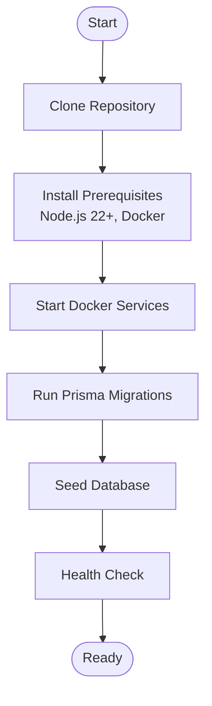
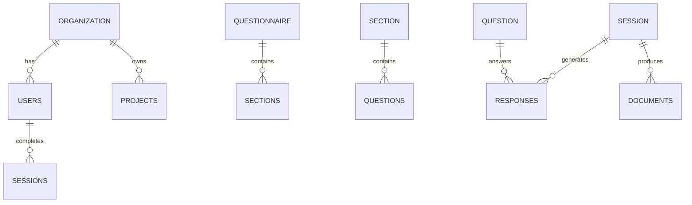

# Getting Started

<cite>
**Referenced Files in This Document**
- [README.md](file://README.md)
- [QUICK-START.md](file://QUICK-START.md)
- [package.json](file://package.json)
- [apps/api/package.json](file://apps/api/package.json)
- [apps/web/package.json](file://apps/web/package.json)
- [docker-compose.yml](file://docker-compose.yml)
- [docker/api/Dockerfile](file://docker/api/Dockerfile)
- [docker/postgres/init.sql](file://docker/postgres/init.sql)
- [scripts/setup-local.sh](file://scripts/setup-local.sh)
- [scripts/dev-start.sh](file://scripts/dev-start.sh)
- [prisma/schema.prisma](file://prisma/schema.prisma)
- [prisma/seed.ts](file://prisma/seed.ts)
- [prisma/seeds/questions.seed.ts](file://prisma/seeds/questions.seed.ts)
- [apps/api/src/main.ts](file://apps/api/src/main.ts)
- [docs/NODE-22-COMPATIBILITY.md](file://docs/NODE-22-COMPATIBILITY.md)
- [docs/postgresql-16-migration.md](file://docs/postgresql-16-migration.md)
</cite>

## Table of Contents
1. [Introduction](#introduction)
2. [System Requirements](#system-requirements)
3. [Installation Overview](#installation-overview)
4. [Step-by-Step Installation](#step-by-step-installation)
5. [Environment Configuration](#environment-configuration)
6. [Database Setup and Seeding](#database-setup-and-seeding)
7. [Local Server Startup](#local-server-startup)
8. [Quick Start Examples](#quick-start-examples)
9. [Verification Steps](#verification-steps)
10. [Troubleshooting Guide](#troubleshooting-guide)
11. [Advanced Resources](#advanced-resources)
12. [Conclusion](#conclusion)

## Introduction
This guide walks you through setting up Quiz-to-Build (Quiz2Biz) for local development. You will clone the repository, install prerequisites, configure the environment, start the infrastructure with Docker, run database migrations and seeds, and verify the system is ready. The platform provides adaptive questionnaires, intelligent scoring, and automated document generation powered by a NestJS backend, React frontend, PostgreSQL, and Prisma.

## System Requirements
- Node.js 22 or higher
- Docker and Docker Compose
- PostgreSQL 16 (automatically provided via Docker Compose)
- Git for cloning the repository

These requirements are enforced by the project configuration and scripts. The repository specifies Node.js 22+ and uses PostgreSQL 16 in development.

**Section sources**
- [package.json:11-17](file://package.json#L11-L17)
- [docs/NODE-22-COMPATIBILITY.md:11-18](file://docs/NODE-22-COMPATIBILITY.md#L11-L18)
- [docker-compose.yml:27-35](file://docker-compose.yml#L27-L35)
- [docs/postgresql-16-migration.md:9-11](file://docs/postgresql-16-migration.md#L9-L11)

## Installation Overview
The recommended approach is to use the provided setup script, which orchestrates Docker Compose, database migrations, and seeding. Alternatively, you can start services manually and run migrations and seeds separately.

**Diagram sources**
- [scripts/setup-local.sh:108-135](file://scripts/setup-local.sh#L108-L135)
- [docker-compose.yml:18-135](file://docker-compose.yml#L18-L135)

## Step-by-Step Installation
Follow these steps to prepare your environment and start the system:

1. **Clone the repository**
   - Use Git to clone the repository to your local machine.

2. **Install prerequisites**
   - Ensure Node.js 22+ is installed (the project enforces this).
   - Install Docker and Docker Compose.

3. **Navigate to the project root**
   - Open a terminal in the repository root directory.

4. **Start Docker services**
   - Use the provided setup script to start PostgreSQL, Redis, and the API service:
     - `./scripts/setup-local.sh`
   - Alternatively, start services manually:
     - `docker compose up -d postgres redis`
     - Wait for services to become healthy, then:
     - `docker compose up -d api`

5. **Run database migrations**
   - The setup script runs migrations automatically. If you started services manually:
     - `docker compose exec -T api ./node_modules/.bin/prisma migrate deploy`

6. **Seed the database**
   - The setup script seeds the database automatically. If you started services manually:
     - `docker compose exec -T api ./node_modules/.bin/prisma db seed`

7. **Verify the API health**
   - The setup script checks the health endpoint. If you want to check manually:
     - `curl http://localhost:3000/api/v1/health`

8. **Access the application**
   - API: http://localhost:3000/api/v1
   - Swagger docs: http://localhost:3000/docs
   - Health endpoint: http://localhost:3000/api/v1/health

**Section sources**
- [scripts/setup-local.sh:108-167](file://scripts/setup-local.sh#L108-L167)
- [scripts/dev-start.sh:6-14](file://scripts/dev-start.sh#L6-L14)
- [docker-compose.yml:109-135](file://docker-compose.yml#L109-L135)

## Environment Configuration
The project uses environment variables managed by Docker Compose. The API service defines defaults for development, including database connection, Redis host/port, and JWT secrets. These are suitable for local development.

Key environment variables configured in the Compose file:
- `NODE_ENV`: development
- `PORT`: 3000
- `DATABASE_URL`: points to the PostgreSQL service
- `REDIS_HOST`: points to the Redis service
- `REDIS_PORT`: 6379
- `JWT_SECRET` and `JWT_REFRESH_SECRET`: development values

For production, these values should be overridden via environment variables or secrets management.

**Section sources**
- [docker-compose.yml:118-125](file://docker-compose.yml#L118-L125)
- [apps/api/src/main.ts:38-41](file://apps/api/src/main.ts#L38-L41)

## Database Setup and Seeding
The database schema is defined with Prisma and includes enums, models, and relations for organizations, users, questionnaires, sessions, scoring, evidence, and documents. The setup script applies migrations and seeds the database with:
- Default organization and admin user
- AI providers
- Questionnaire structure (sections and questions)
- Visibility rules
- Standards, dimensions, and readiness questions
- Project types and quality dimensions

The seed script creates a default admin user and a comprehensive questionnaire with multiple sections and questions. It also sets up visibility rules to dynamically show/hide questions based on answers.

**Diagram sources**
- [prisma/schema.prisma:154-286](file://prisma/schema.prisma#L154-L286)
- [prisma/schema.prisma:351-489](file://prisma/schema.prisma#L351-L489)
- [prisma/schema.prisma:512-560](file://prisma/schema.prisma#L512-L560)
- [prisma/schema.prisma:744-774](file://prisma/schema.prisma#L744-L774)

**Section sources**
- [prisma/schema.prisma:1-120](file://prisma/schema.prisma#L1-L120)
- [prisma/seed.ts:12-518](file://prisma/seed.ts#L12-L518)
- [prisma/seeds/questions.seed.ts:10-36](file://prisma/seeds/questions.seed.ts#L10-L36)

## Local Server Startup
There are two primary ways to start the local servers:

- **Using the setup script**
  - The script starts PostgreSQL, Redis, and the API service, runs migrations and seeds, and performs a health check.
  - Command: `./scripts/setup-local.sh`

- **Manual startup**
  - Start infrastructure: `docker compose up -d postgres redis`
  - Start API: `docker compose up -d api`
  - Apply migrations: `docker compose exec -T api ./node_modules/.bin/prisma migrate deploy`
  - Seed database: `docker compose exec -T api ./node_modules/.bin/prisma db seed`
  - Health check: `curl http://localhost:3000/api/v1/health`

The API server listens on port 3000 and exposes Swagger documentation at `/docs`. The Compose file also defines test instances of PostgreSQL and Redis for CI/CD scenarios.

**Section sources**
- [scripts/setup-local.sh:108-167](file://scripts/setup-local.sh#L108-L167)
- [scripts/dev-start.sh:6-14](file://scripts/dev-start.sh#L6-L14)
- [docker-compose.yml:72-107](file://docker-compose.yml#L72-L107)
- [apps/api/src/main.ts:214-298](file://apps/api/src/main.ts#L214-L298)

## Quick Start Examples
Complete a simple assessment and generate a document:

1. **Create a simple questionnaire**
   - The seed script creates a default questionnaire with multiple sections (Business Foundation, Product/Service Definition, Target Market, Technology Requirements, Security & Compliance, Business Model, Team & Operations, Timeline & Milestones, Support & Maintenance).
   - Sections include various question types (text, textarea, single/multiple choice, date, file upload, matrix).

2. **Complete an assessment**
   - Start a new session and answer questions across sections.
   - The system auto-saves your progress and adapts subsequent questions based on your answers.

3. **Generate a basic document**
   - After completing a session, navigate to the Documents page.
   - Select a document type (e.g., Architecture Dossier, SDLC Playbook, Test Strategy, DevSecOps Guide, Privacy Policy, Finance Package).
   - Download the generated DOCX or PDF file.

These flows are described in the Quick Start guide and supported by the seeded data and document generation modules.

**Section sources**
- [prisma/seed.ts:46-155](file://prisma/seed.ts#L46-L155)
- [QUICK-START.md:171-196](file://QUICK-START.md#L171-L196)
- [prisma/schema.prisma:712-742](file://prisma/schema.prisma#L712-L742)

## Verification Steps
To ensure your installation is working correctly:

- **Docker services**
  - Confirm PostgreSQL and Redis are healthy and running.
  - Confirm the API service is reachable.

- **Database**
  - Verify migrations applied successfully.
  - Confirm seeding completed (check for default organization, admin user, and questionnaire).

- **API health**
  - Access the health endpoint: http://localhost:3000/api/v1/health
  - Expect a 200 OK response.

- **Swagger documentation**
  - Visit http://localhost:3000/docs to browse API endpoints.

- **Application UI**
  - The frontend runs on a separate port; the API serves the React app in development mode.

If you encounter issues, consult the Troubleshooting section below.

**Section sources**
- [scripts/setup-local.sh:144-167](file://scripts/setup-local.sh#L144-L167)
- [docker-compose.yml:18-135](file://docker-compose.yml#L18-L135)
- [apps/api/src/main.ts:214-298](file://apps/api/src/main.ts#L214-L298)

## Troubleshooting Guide
Common setup issues and resolutions:

- **Node.js version mismatch**
  - Ensure Node.js 22+ is installed. The project enforces this requirement.
  - Verify with: `node --version`

- **Docker daemon not running**
  - Start Docker Desktop or your system’s Docker service.
  - The setup script checks for Docker availability and health.

- **Port conflicts**
  - PostgreSQL (5432) and Redis (6379) are exposed. Ensure these ports are free or adjust Compose file mappings.
  - The API service exposes port 3000.

- **Database migrations failing**
  - Ensure PostgreSQL is healthy before running migrations.
  - Retry migrations after confirming the database is ready.

- **Swagger documentation not visible**
  - Swagger is enabled by default in non-production environments.
  - To enable in production, set the appropriate environment variable.

- **Health check returns non-200**
  - Check API logs: `docker compose logs api`
  - Verify migrations and seeding completed successfully.

- **PostgreSQL 16 compatibility**
  - The project uses PostgreSQL 16 in development. If upgrading from an older version, follow the migration guide.

- **Node.js 22 compatibility**
  - The project has been verified to work with Node.js 22+. If issues arise, re-install dependencies and verify versions.

**Section sources**
- [docs/NODE-22-COMPATIBILITY.md:11-18](file://docs/NODE-22-COMPATIBILITY.md#L11-L18)
- [scripts/setup-local.sh:62-69](file://scripts/setup-local.sh#L62-L69)
- [docker-compose.yml:47-51](file://docker-compose.yml#L47-L51)
- [docker-compose.yml:118-125](file://docker-compose.yml#L118-L125)
- [apps/api/src/main.ts:214-298](file://apps/api/src/main.ts#L214-L298)
- [docs/postgresql-16-migration.md:38-52](file://docs/postgresql-16-migration.md#L38-L52)

## Advanced Resources
For deeper exploration and advanced features, refer to the following documentation:

- **Product Overview**: Comprehensive feature documentation, architecture, personas, security, and compliance.
- **Wireframes**: Page wireframes and user journey maps.
- **Deployment Guides**: Complete CI/CD and Azure deployment instructions.
- **Security Review**: Code quality and security audit summaries.
- **Development Roadmap**: Feature status and future plans.
- **API Documentation**: Swagger endpoints and contracts.

These resources provide additional context for extending the system, integrating with external services, and understanding advanced capabilities.

**Section sources**
- [README.md:322-341](file://README.md#L322-L341)
- [README.md:261-291](file://README.md#L261-L291)

## Conclusion
You now have Quiz-to-Build running locally with Docker, PostgreSQL 16, and Prisma migrations and seeds applied. You can create questionnaires, complete assessments, and generate professional documents. Use the verification steps to confirm everything is working, and consult the Troubleshooting section for common issues. Explore the Advanced Resources to learn more about the platform’s capabilities and architecture.