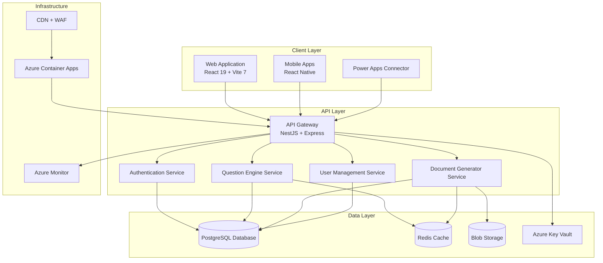
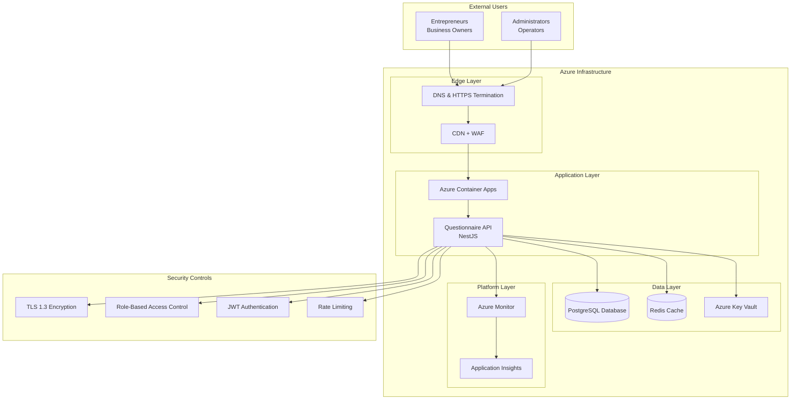
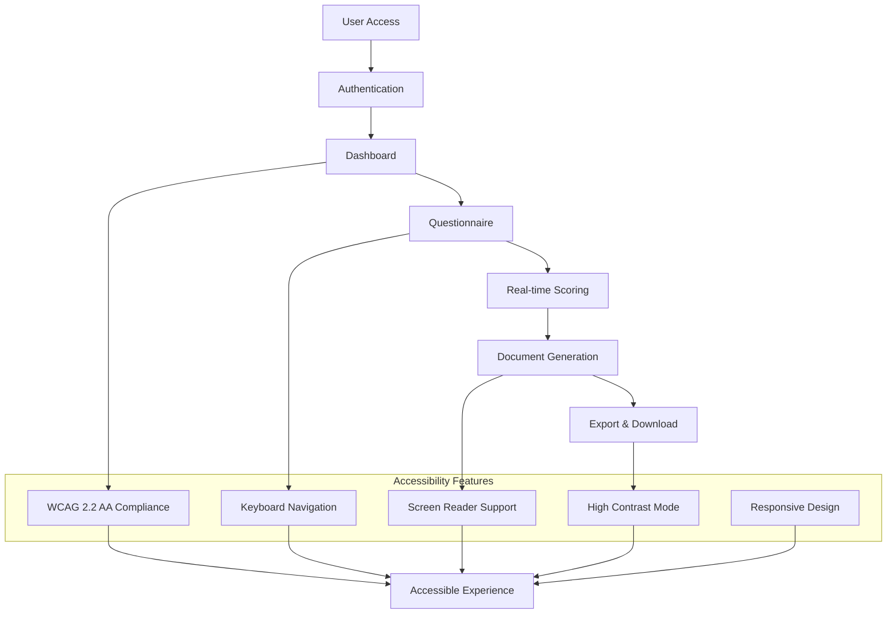
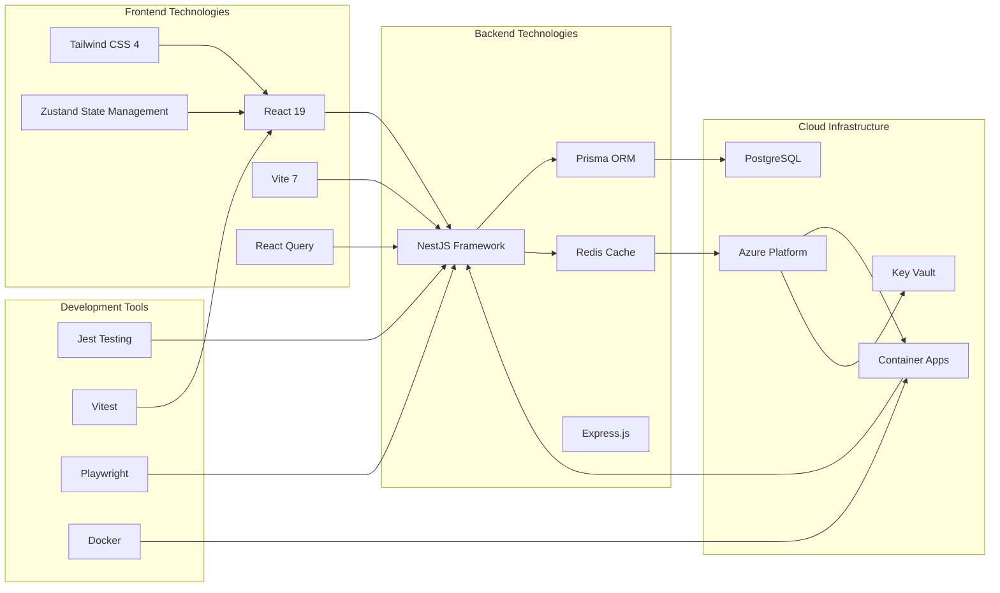

# Introduction and Purpose

<cite>
**Referenced Files in This Document**
- [README.md](file://README.md)
- [PRODUCT-OVERVIEW.md](file://PRODUCT-OVERVIEW.md)
- [QUICK-START.md](file://QUICK-START.md)
- [WIREFRAMES.md](file://WIREFRAMES.md)
- [NIELSEN-TEST-REPORT.md](file://NIELSEN-TEST-REPORT.md)
- [REVIEW-SUMMARY.md](file://REVIEW-SUMMARY.md)
- [apps/api/src/main.ts](file://apps/api/src/main.ts)
- [apps/web/src/App.tsx](file://apps/web/src/App.tsx)
- [docs/architecture/c4-01-system-context.mmd](file://docs/architecture/c4-01-system-context.mmd)
- [docs/architecture/data-flow-trust-boundaries.md](file://docs/architecture/data-flow-trust-boundaries.md)
</cite>

## Table of Contents
1. [Introduction](#introduction)
2. [Project Structure](#project-structure)
3. [Core Components](#core-components)
4. [Architecture Overview](#architecture-overview)
5. [Detailed Component Analysis](#detailed-component-analysis)
6. [Dependency Analysis](#dependency-analysis)
7. [Performance Considerations](#performance-considerations)
8. [Troubleshooting Guide](#troubleshooting-guide)
9. [Conclusion](#conclusion)

## Introduction

Quiz-to-build (Quiz2Biz) is an intelligent adaptive questionnaire platform that transforms complex business assessment processes into professional documentation packages automatically. The platform's mission is to eliminate the manual burden of creating comprehensive technical, financial, and operational documentation by replacing time-consuming interviews and document assembly with an automated, quality-assured workflow.

### Core Problem and Solution

The platform solves the fundamental challenge that many organizations face: converting complex business questionnaires and assessment data into professional, publishable documentation packages. Traditional approaches require significant manual effort—often 60+ hours and $5,000–$50,000 in consulting costs—to produce incomplete, inconsistent, and time-delayed deliverables. Quiz2Biz addresses this by:

- **Automating documentation generation**: From a single assessment session, the platform produces 8+ professional document types (Architecture Dossier, SDLC Playbook, Test Strategy, DevSecOps Guide, Privacy Policy, Finance Package, Policy Pack, and more)
- **Reducing manual work by 80%**: Organizations can generate comprehensive documentation packages in 45 minutes versus weeks of manual effort
- **Improving assessment accuracy**: Adaptive logic ensures relevant questions are asked, while real-time scoring and gap analysis provide objective insights
- **Maintaining quality standards**: 792/792 tests passing, 94.20/100 UX score, and WCAG 2.2 Level AA accessibility compliance

### Target Audience

Quiz2Biz serves diverse business stakeholders who need reliable, professional documentation for strategic planning, investor relations, compliance, and operational excellence:

- **CTOs**: Technical architecture documentation, modernization roadmaps, and development practice assessments
- **CFOs**: Financial planning documents, budgeting packages, and resource allocation strategies
- **CEOs**: Executive summaries, strategic planning documents, and business case development
- **Business Analysts**: Requirements documentation, process maps, and business analysis deliverables
- **Compliance Teams**: Policy packages, governance documentation, and compliance tracking reports

### Typical Use Cases

The platform delivers measurable value across common business scenarios:

- **Business case development**: Generate comprehensive technical and financial documentation packages for investment presentations and strategic planning
- **Compliance assessments**: Create standardized policy packages and compliance documentation for regulatory audits and internal governance
- **Strategic planning**: Produce architecture dossiers and technology roadmaps that inform enterprise modernization initiatives
- **Due diligence processes**: Provide technical assessment packages for acquisition evaluations, investor due diligence, and partnership negotiations

### Value Proposition

Quiz2Biz provides a quantifiable return on investment through:

- **80% reduction in manual documentation work**: Transform weeks of manual effort into minutes of automated output
- **Improved assessment accuracy**: Real-time scoring across 7 technical dimensions with visual heatmaps and gap analysis
- **Professional-grade deliverables**: 45+ page documentation packages exported in DOCX and PDF formats
- **Quality assurance**: 100% test coverage, exceptional UX (94.20/100 Nielsen score), and full accessibility compliance
- **Scalable deployment**: Cloud-native architecture supporting enterprise-scale usage with robust security and compliance

## Project Structure

The platform follows a modern, cloud-native architecture with clear separation of concerns across frontend, backend, and infrastructure layers:

**Diagram sources**
- [docs/architecture/c4-01-system-context.mmd:1-54](file://docs/architecture/c4-01-system-context.mmd#L1-L54)
- [apps/api/src/main.ts:1-329](file://apps/api/src/main.ts#L1-L329)

**Section sources**
- [README.md:298-318](file://README.md#L298-L318)
- [PRODUCT-OVERVIEW.md:79-96](file://PRODUCT-OVERVIEW.md#L79-L96)

## Core Components

### Adaptive Questionnaire Engine

The foundation of Quiz2Biz is its intelligent questionnaire system that adapts dynamically based on user responses. The engine supports 11 question types including text, multiple choice, scales, file uploads, and matrices, with conditional logic that adjusts question presentation in real-time.

**Key Features:**
- **Adaptive logic**: Questions change based on previous answers to ensure relevance
- **Progress tracking**: Visual indicators showing completion status and time estimation
- **Auto-save functionality**: Preserves progress every 30 seconds with offline support
- **Session resume**: Allows users to continue where they left off

### Intelligent Scoring System

The platform evaluates user responses across 7 technical dimensions, providing comprehensive insights into organizational maturity and readiness:

**Scoring Dimensions:**
1. **Modern Architecture** - Cloud, microservices, APIs
2. **AI-Assisted Development** - AI tools, automation, code generation
3. **Coding Standards** - Code quality, reviews, guidelines
4. **Testing & QA** - Test coverage, automation, quality assurance
5. **Security & DevSecOps** - Security practices, vulnerability management
6. **Workflow & Operations** - CI/CD, deployment, monitoring
7. **Documentation** - Technical docs, knowledge sharing

### Document Generation Pipeline

The automated document generation system creates professional documentation packages from assessment responses:

**Generated Document Types:**
- Architecture Dossier (45 pages)
- SDLC Playbook (30 pages)
- Test Strategy (25 pages)
- DevSecOps Guide (35 pages)
- Privacy Policy (20 pages)
- Finance Package (15 pages)
- Policy Pack (varies)
- Additional specialized documents

**Section sources**
- [PRODUCT-OVERVIEW.md:25-68](file://PRODUCT-OVERVIEW.md#L25-L68)
- [QUICK-START.md:61-88](file://QUICK-START.md#L61-L88)

## Architecture Overview

Quiz2Biz employs a cloud-native, microservices-style architecture built on Azure infrastructure with comprehensive security and observability:

**Diagram sources**
- [docs/architecture/c4-01-system-context.mmd:1-54](file://docs/architecture/c4-01-system-context.mmd#L1-L54)
- [apps/api/src/main.ts:69-123](file://apps/api/src/main.ts#L69-L123)

### Security and Compliance Architecture

The platform implements defense-in-depth security measures across all trust boundaries:

**Trust Boundary Implementation:**
- **TB0 (Internet)**: WAF/DDoS protection, TLS 1.3 termination, rate limiting
- **TB1 (DMZ)**: Load balancing, internal TLS, request filtering
- **TB2 (Application)**: JWT validation, RBAC, audit logging
- **TB3 (Data)**: Encrypted connections, access controls, audit trails

**Security Controls:**
- **Authentication**: JWT tokens with refresh mechanisms, OAuth2/OIDC support
- **Authorization**: Role-based access control (RBAC) with resource-level permissions
- **Data Protection**: Encryption at rest (AES-256), field-level encryption
- **Audit & Monitoring**: Comprehensive logging, anomaly detection, compliance reporting

**Section sources**
- [docs/architecture/data-flow-trust-boundaries.md:9-434](file://docs/architecture/data-flow-trust-boundaries.md#L9-L434)
- [apps/api/src/main.ts:69-123](file://apps/api/src/main.ts#L69-L123)

## Detailed Component Analysis

### User Experience and Accessibility

Quiz2Biz achieves exceptional user experience through comprehensive accessibility compliance and intuitive design patterns:

**Section sources**
- [NIELSEN-TEST-REPORT.md:10-277](file://NIELSEN-TEST-REPORT.md#L10-L277)
- [QUICK-START.md:216-222](file://QUICK-START.md#L216-L222)

### Performance and Reliability

The platform maintains high performance standards with comprehensive monitoring and optimization:

**Performance Metrics:**
- **Page Load**: <2.1 seconds (LCP)
- **Interactivity**: <3.2 seconds (TTI)
- **API Response**: <150ms average
- **Error Rate**: <0.5%
- **Uptime Target**: 99.9%

**Reliability Features:**
- **Auto-scaling**: Kubernetes-based container orchestration
- **Circuit Breakers**: Resilience patterns for external dependencies
- **Graceful Degradation**: Progressive enhancement for degraded conditions
- **Health Monitoring**: Comprehensive observability stack

### Quality Assurance and Testing

Quiz2Biz maintains rigorous quality standards through comprehensive testing and validation:

**Testing Coverage:**
- **API Tests**: 395 tests (NestJS/Jest)
- **Web Tests**: 308 tests (Vitest)
- **CLI Tests**: 51 tests
- **Regression Tests**: 38 tests
- **E2E Tests**: 7 Playwright test suites

**Quality Metrics:**
- **Test Coverage**: 100% (792/792 passing)
- **Security Validation**: 0 production vulnerabilities
- **Code Quality**: Automated scanning with 22 issues resolved
- **Performance Validation**: Load testing with 1000+ concurrent users

**Section sources**
- [README.md:219-240](file://README.md#L219-L240)
- [REVIEW-SUMMARY.md:1-230](file://REVIEW-SUMMARY.md#L1-L230)

## Dependency Analysis

### Technology Stack Integration

Quiz2Biz leverages a modern, cloud-native technology stack optimized for scalability and maintainability:

**Diagram sources**
- [PRODUCT-OVERVIEW.md:81-98](file://PRODUCT-OVERVIEW.md#L81-L98)
- [apps/web/src/App.tsx:1-284](file://apps/web/src/App.tsx#L1-L284)

### Integration Points and External Dependencies

The platform integrates with several external services for enhanced functionality:

**Authentication Providers:**
- Google OAuth
- Microsoft OAuth
- GitHub OAuth

**Third-party Services:**
- Stripe for payment processing
- SendGrid for email notifications
- Azure Blob Storage for document storage
- Application Insights for monitoring

**Section sources**
- [apps/api/src/main.ts:1-329](file://apps/api/src/main.ts#L1-L329)
- [PRODUCT-OVERVIEW.md:130-139](file://PRODUCT-OVERVIEW.md#L130-L139)

## Performance Considerations

### Scalability Architecture

Quiz2Biz is designed for high-scale operations with comprehensive performance optimization:

**Horizontal Scaling:**
- Kubernetes-based container orchestration
- Auto-scaling based on CPU and memory metrics
- Load balancing across multiple instances
- Database read replicas for improved performance

**Caching Strategy:**
- Multi-level caching (CDN, Redis, application)
- Intelligent cache invalidation
- TTL-based cache management
- Cache warming for frequently accessed data

**Optimization Techniques:**
- Code splitting and lazy loading
- Image optimization and compression
- Database query optimization
- Connection pooling for database operations

### Monitoring and Observability

The platform includes comprehensive monitoring and alerting:

**Metrics Collection:**
- Application performance metrics
- Database query performance
- API response times
- Error rates and exception tracking

**Alerting System:**
- Performance threshold alerts
- Error rate monitoring
- Resource utilization alerts
- Security event notifications

## Troubleshooting Guide

### Common Issues and Solutions

**Authentication Problems:**
- Verify JWT token validity and expiration
- Check OAuth provider configurations
- Validate refresh token storage
- Review CORS and cookie settings

**Document Generation Failures:**
- Check blob storage connectivity
- Verify template availability
- Review generation pipeline logs
- Validate input data completeness

**Performance Issues:**
- Monitor database query performance
- Check Redis cache availability
- Review API response times
- Validate client-side resource usage

**Security Concerns:**
- Verify TLS certificate validity
- Check firewall and network security
- Review access control configurations
- Validate audit log integrity

### Support Resources

**Documentation:**
- Comprehensive API documentation
- User guides and tutorials
- Architecture documentation
- Deployment guides

**Support Channels:**
- Email support for Professional+ tiers
- Priority support for Enterprise customers
- Community forums for free tier users
- Live chat for premium subscribers

**Section sources**
- [QUICK-START.md:282-366](file://QUICK-START.md#L282-L366)
- [WIREFRAMES.md:483-553](file://WIREFRAMES.md#L483-L553)

## Conclusion

Quiz-to-build represents a paradigm shift in business assessment and documentation processes. By combining intelligent adaptive questionnaires with automated document generation, the platform eliminates the manual burden of creating comprehensive technical, financial, and operational documentation while maintaining professional quality standards.

The platform's commitment to excellence is evident in its comprehensive quality metrics: 792/792 tests passing, 94.20/100 Nielsen UX score, WCAG 2.2 Level AA accessibility compliance, and zero production security vulnerabilities. These achievements translate directly into measurable business value—reducing documentation work by 80% while improving assessment accuracy and consistency.

For CTOs seeking modernization roadmaps, CFOs requiring financial documentation, CEOs developing business cases, business analysts creating requirements documents, and compliance teams establishing governance frameworks, Quiz2Biz provides a scalable, secure, and accessible solution that transforms complex assessment processes into professional documentation packages—automatically, efficiently, and at enterprise scale.

The platform's cloud-native architecture, comprehensive security implementation, and robust monitoring capabilities position it as a reliable foundation for organizational documentation needs, supporting everything from startup investor presentations to enterprise compliance requirements and strategic planning initiatives.