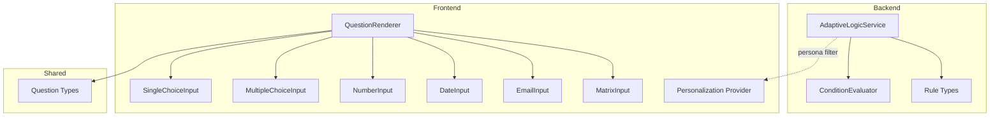
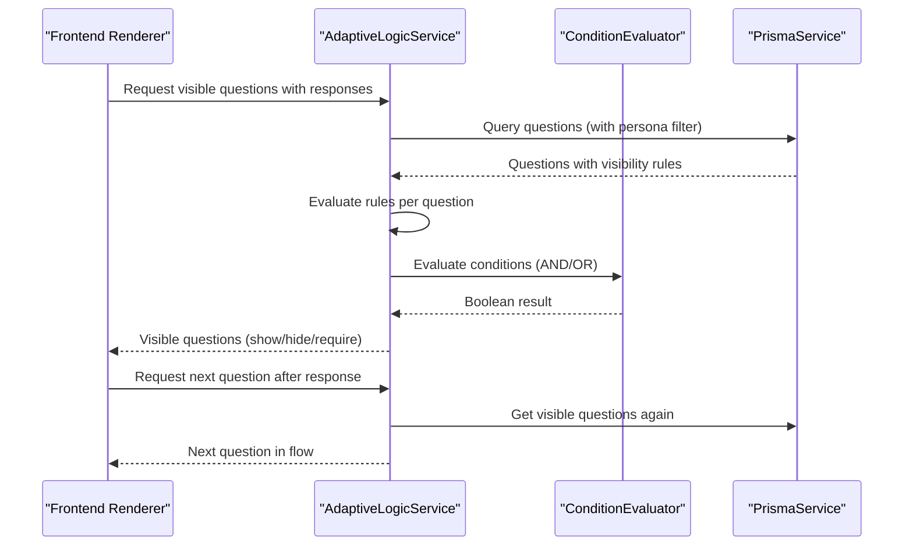
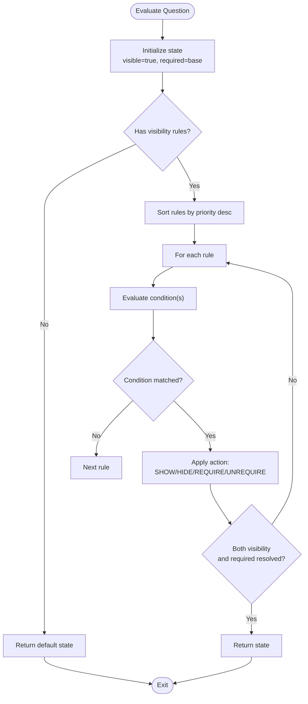
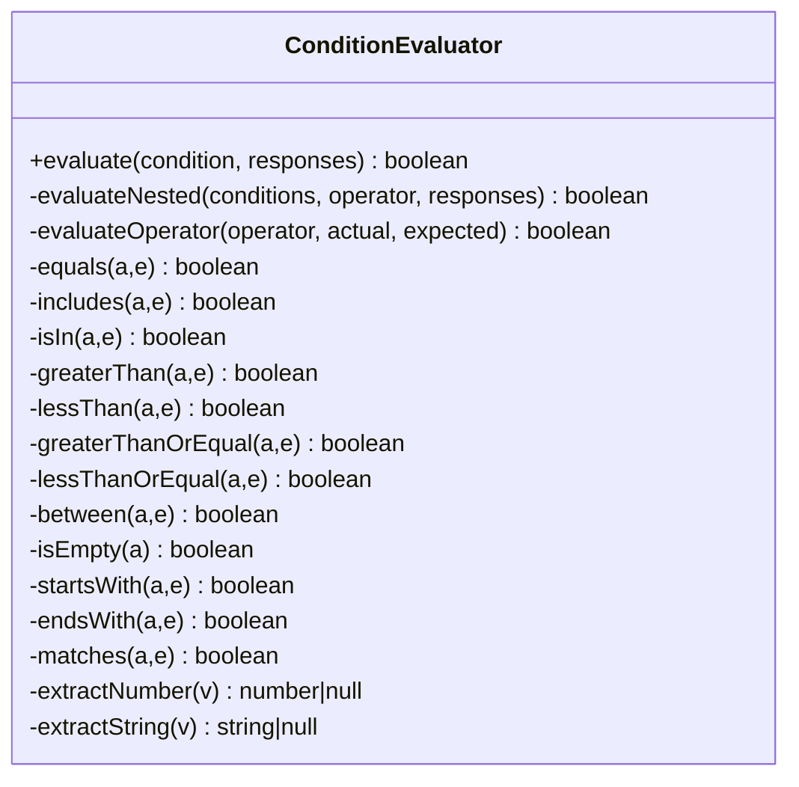
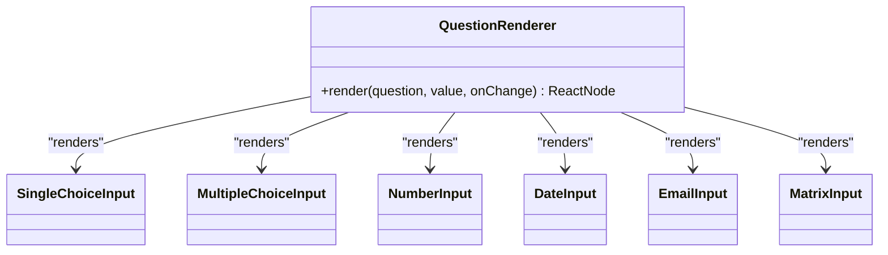
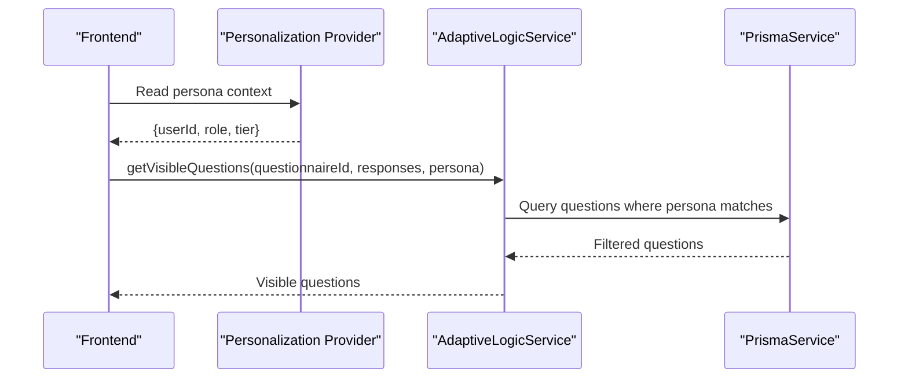
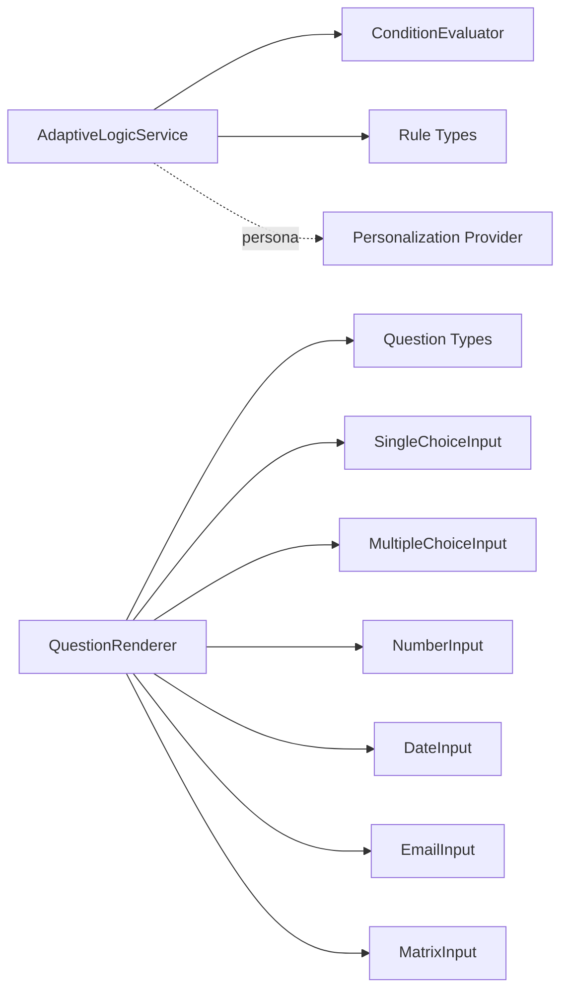

# Adaptive Questionnaire System

<cite>
**Referenced Files in This Document**
- [adaptive-logic.md](file://docs/questionnaire/adaptive-logic.md)
- [adaptive-logic.service.ts](file://apps/api/src/modules/adaptive-logic/adaptive-logic.service.ts)
- [condition.evaluator.ts](file://apps/api/src/modules/adaptive-logic/evaluators/condition.evaluator.ts)
- [rule.types.ts](file://apps/api/src/modules/adaptive-logic/types/rule.types.ts)
- [questionnaire.ts](file://apps/web/src/types/questionnaire.ts)
- [QuestionRenderer.tsx](file://apps/web/src/components/questionnaire/QuestionRenderer.tsx)
- [SingleChoiceInput.tsx](file://apps/web/src/components/questionnaire/SingleChoiceInput.tsx)
- [MultipleChoiceInput.tsx](file://apps/web/src/components/questionnaire/MultipleChoiceInput.tsx)
- [NumberInput.tsx](file://apps/web/src/components/questionnaire/NumberInput.tsx)
- [DateInput.tsx](file://apps/web/src/components/questionnaire/DateInput.tsx)
- [EmailInput.tsx](file://apps/web/src/components/questionnaire/EmailInput.tsx)
- [MatrixInput.tsx](file://apps/web/src/components/questionnaire/MatrixInput.tsx)
- [Personalization.tsx](file://apps/web/src/components/personalization/Personalization.tsx)
- [template-engine.service.ts](file://apps/api/src/modules/document-generator/services/template-engine.service.ts)
- [complete-flow.e2e.test.ts](file://e2e/questionnaire/complete-flow.e2e.test.ts)
- [fixtures.ts](file://e2e/fixtures.ts)
- [06-user-flow-journey-maps.md](file://docs/cto/06-user-flow-journey-maps.md)
</cite>

## Table of Contents
1. [Introduction](#introduction)
2. [Project Structure](#project-structure)
3. [Core Components](#core-components)
4. [Architecture Overview](#architecture-overview)
5. [Detailed Component Analysis](#detailed-component-analysis)
6. [Dependency Analysis](#dependency-analysis)
7. [Performance Considerations](#performance-considerations)
8. [Troubleshooting Guide](#troubleshooting-guide)
9. [Conclusion](#conclusion)
10. [Appendices](#appendices)

## Introduction
The Adaptive Questionnaire System personalizes assessment experiences by dynamically showing, hiding, requiring, and routing questions based on user responses. It supports 11 question types (multiple choice, matrix, file upload, date, email, number, scale, single choice, text, textarea, url), real-time adaptive logic evaluation, persona-based filtering, and branching flows. The system ensures relevance, efficiency, completeness, and flexibility while maintaining assessment flow continuity.

## Project Structure
The system spans backend and frontend modules:
- Backend (NestJS): Adaptive logic service, condition evaluator, rule types, and persona-aware question retrieval.
- Frontend (React): Question input components for all 11 question types, renderer, and questionnaire flow.
- Shared types: Question types, personas, and session state.
- Documentation: Adaptive logic specification and user flow maps.

**Diagram sources**
- [adaptive-logic.service.ts:1-285](file://apps/api/src/modules/adaptive-logic/adaptive-logic.service.ts#L1-L285)
- [condition.evaluator.ts:1-382](file://apps/api/src/modules/adaptive-logic/evaluators/condition.evaluator.ts#L1-L382)
- [rule.types.ts:1-120](file://apps/api/src/modules/adaptive-logic/types/rule.types.ts#L1-L120)
- [QuestionRenderer.tsx:106-158](file://apps/web/src/components/questionnaire/QuestionRenderer.tsx#L106-L158)
- [questionnaire.ts:8-225](file://apps/web/src/types/questionnaire.ts#L8-L225)
- [Personalization.tsx:658-1022](file://apps/web/src/components/personalization/Personalization.tsx#L658-L1022)

**Section sources**
- [adaptive-logic.service.ts:1-285](file://apps/api/src/modules/adaptive-logic/adaptive-logic.service.ts#L1-L285)
- [rule.types.ts:1-120](file://apps/api/src/modules/adaptive-logic/types/rule.types.ts#L1-L120)
- [questionnaire.ts:8-225](file://apps/web/src/types/questionnaire.ts#L8-L225)
- [QuestionRenderer.tsx:106-158](file://apps/web/src/components/questionnaire/QuestionRenderer.tsx#L106-L158)

## Core Components
- Adaptive Logic Service: Retrieves questions, applies visibility and requirement rules, computes next question, and tracks adaptive changes.
- Condition Evaluator: Implements operator dispatch for equality, inclusion, range, string operations, and emptiness checks.
- Rule Types: Defines conditions, visibility actions, branching rules, and question state.
- Frontend Renderer: Maps question types to input components and renders the adaptive questionnaire flow.
- Persona Filtering: Filters questions by persona during retrieval and evaluation.

Key capabilities:
- Real-time visibility and requirement evaluation
- Priority-based rule resolution
- Branching to alternate paths
- Persona-aware question targeting
- Assessment flow continuity

**Section sources**
- [adaptive-logic.service.ts:26-132](file://apps/api/src/modules/adaptive-logic/adaptive-logic.service.ts#L26-L132)
- [condition.evaluator.ts:41-82](file://apps/api/src/modules/adaptive-logic/evaluators/condition.evaluator.ts#L41-L82)
- [rule.types.ts:55-120](file://apps/api/src/modules/adaptive-logic/types/rule.types.ts#L55-L120)
- [questionnaire.ts:8-225](file://apps/web/src/types/questionnaire.ts#L8-L225)

## Architecture Overview
The backend Adaptive Logic Service orchestrates rule evaluation and question retrieval. The frontend renders the appropriate input component for each question type and manages navigation and progress. Persona information can be supplied to tailor question visibility.

**Diagram sources**
- [adaptive-logic.service.ts:29-64](file://apps/api/src/modules/adaptive-logic/adaptive-logic.service.ts#L29-L64)
- [adaptive-logic.service.ts:69-132](file://apps/api/src/modules/adaptive-logic/adaptive-logic.service.ts#L69-L132)
- [condition.evaluator.ts:9-22](file://apps/api/src/modules/adaptive-logic/evaluators/condition.evaluator.ts#L9-L22)

## Detailed Component Analysis

### Adaptive Logic Service
Responsibilities:
- Retrieve questions filtered by persona and visibility rules
- Evaluate question state (visible, required, disabled)
- Compute next question in the flow
- Track adaptive changes across response updates
- Build dependency graphs for rules

Evaluation algorithm highlights:
- Sort rules by priority (highest first)
- Resolve visibility and requirement actions independently
- Combine nested conditions with AND/OR
- Use operator handlers for robust comparisons

**Diagram sources**
- [adaptive-logic.service.ts:69-132](file://apps/api/src/modules/adaptive-logic/adaptive-logic.service.ts#L69-L132)

**Section sources**
- [adaptive-logic.service.ts:26-132](file://apps/api/src/modules/adaptive-logic/adaptive-logic.service.ts#L26-L132)
- [adaptive-logic.service.ts:134-176](file://apps/api/src/modules/adaptive-logic/adaptive-logic.service.ts#L134-L176)
- [adaptive-logic.service.ts:206-224](file://apps/api/src/modules/adaptive-logic/adaptive-logic.service.ts#L206-L224)

### Condition Evaluator
Features:
- Nested condition support with logical operators
- Dispatch-based operator handlers for extensibility
- Robust value extraction for response objects
- Type-aware comparisons (numbers, strings, arrays)

Supported operators include equals, not_equals, includes, contains, in, not_in, greater_than, less_than, greater_than_or_equal, less_than_or_equal, between, is_empty, is_not_empty, starts_with, ends_with, matches.

**Diagram sources**
- [condition.evaluator.ts:41-382](file://apps/api/src/modules/adaptive-logic/evaluators/condition.evaluator.ts#L41-L382)

**Section sources**
- [condition.evaluator.ts:9-82](file://apps/api/src/modules/adaptive-logic/evaluators/condition.evaluator.ts#L9-L82)
- [condition.evaluator.ts:117-170](file://apps/api/src/modules/adaptive-logic/evaluators/condition.evaluator.ts#L117-L170)
- [condition.evaluator.ts:228-244](file://apps/api/src/modules/adaptive-logic/evaluators/condition.evaluator.ts#L228-L244)

### Question Types and Rendering
The system supports 11 question types with dedicated input components:
- Text, Textarea, Email, Url, Number, Date, Scale
- Single Choice, Multiple Choice
- Matrix
- File Upload (rendered via a separate component)

Frontend renderer maps question types to components and passes values and change handlers.

**Diagram sources**
- [QuestionRenderer.tsx:106-158](file://apps/web/src/components/questionnaire/QuestionRenderer.tsx#L106-L158)
- [SingleChoiceInput.tsx:7-52](file://apps/web/src/components/questionnaire/SingleChoiceInput.tsx#L7-L52)
- [MultipleChoiceInput.tsx:7-56](file://apps/web/src/components/questionnaire/MultipleChoiceInput.tsx#L7-L56)
- [NumberInput.tsx:7-41](file://apps/web/src/components/questionnaire/NumberInput.tsx#L7-L41)
- [DateInput.tsx:7-39](file://apps/web/src/components/questionnaire/DateInput.tsx#L7-L39)
- [EmailInput.tsx:7-50](file://apps/web/src/components/questionnaire/EmailInput.tsx#L7-L50)
- [MatrixInput.tsx:9-69](file://apps/web/src/components/questionnaire/MatrixInput.tsx#L9-L69)

**Section sources**
- [questionnaire.ts:8-225](file://apps/web/src/types/questionnaire.ts#L8-L225)
- [QuestionRenderer.tsx:106-158](file://apps/web/src/components/questionnaire/QuestionRenderer.tsx#L106-L158)

### Persona-Based Filtering
The backend filters questions by persona when retrieving visible questions. The frontend’s Personalization Provider supplies persona context for adaptive evaluation.

**Diagram sources**
- [adaptive-logic.service.ts:34-51](file://apps/api/src/modules/adaptive-logic/adaptive-logic.service.ts#L34-L51)
- [Personalization.tsx:658-1022](file://apps/web/src/components/personalization/Personalization.tsx#L658-L1022)

**Section sources**
- [adaptive-logic.service.ts:34-51](file://apps/api/src/modules/adaptive-logic/adaptive-logic.service.ts#L34-L51)
- [Personalization.tsx:658-1022](file://apps/web/src/components/personalization/Personalization.tsx#L658-L1022)

### Adaptive Logic Specification
The documentation defines rule types, operators, and evaluation mechanics. It includes examples for visibility, requirement, skip, and branching rules, along with operator semantics and priority handling.

Highlights:
- Visibility rules: show/hide questions
- Requirement rules: require/unrequire based on context
- Skip rules: entire sections can be skipped
- Branching rules: route to alternate paths based on conditions
- Operators: equality, inclusion, range, string operations, emptiness

**Section sources**
- [adaptive-logic.md:23-1865](file://docs/questionnaire/adaptive-logic.md#L23-L1865)

### Implementation Details for Adding New Question Types
To add a new question type:
1. Define the type in shared types and update the renderer mapping.
2. Create a dedicated input component with proper validation and accessibility attributes.
3. Ensure the template engine can extract values for the new type if used in document generation.

Reference paths:
- Add type constant and update renderer mapping
- Create component under questionnaire folder
- Extend template extractor if needed

**Section sources**
- [questionnaire.ts:8-225](file://apps/web/src/types/questionnaire.ts#L8-L225)
- [QuestionRenderer.tsx:106-158](file://apps/web/src/components/questionnaire/QuestionRenderer.tsx#L106-L158)
- [template-engine.service.ts:157-175](file://apps/api/src/modules/document-generator/services/template-engine.service.ts#L157-L175)

### Customizing Adaptive Behaviors
Customization points:
- Define conditions with nested logical operators
- Adjust rule priorities to resolve conflicts
- Use branching rules to create alternate paths
- Apply persona filters to tailor question visibility

**Section sources**
- [rule.types.ts:38-53](file://apps/api/src/modules/adaptive-logic/types/rule.types.ts#L38-L53)
- [rule.types.ts:87-100](file://apps/api/src/modules/adaptive-logic/types/rule.types.ts#L87-L100)
- [adaptive-logic.service.ts:85-129](file://apps/api/src/modules/adaptive-logic/adaptive-logic.service.ts#L85-L129)

## Dependency Analysis
Backend dependencies:
- AdaptiveLogicService depends on PrismaService for persistence and ConditionEvaluator for expression evaluation.
- Rule types define the contract for conditions and branching.

Frontend dependencies:
- QuestionRenderer depends on QuestionType constants and individual input components.
- Personalization Provider supplies persona context.

**Diagram sources**
- [adaptive-logic.service.ts:1-285](file://apps/api/src/modules/adaptive-logic/adaptive-logic.service.ts#L1-L285)
- [rule.types.ts:1-120](file://apps/api/src/modules/adaptive-logic/types/rule.types.ts#L1-L120)
- [QuestionRenderer.tsx:106-158](file://apps/web/src/components/questionnaire/QuestionRenderer.tsx#L106-L158)
- [questionnaire.ts:8-225](file://apps/web/src/types/questionnaire.ts#L8-L225)
- [Personalization.tsx:658-1022](file://apps/web/src/components/personalization/Personalization.tsx#L658-L1022)

**Section sources**
- [adaptive-logic.service.ts:1-285](file://apps/api/src/modules/adaptive-logic/adaptive-logic.service.ts#L1-L285)
- [rule.types.ts:1-120](file://apps/api/src/modules/adaptive-logic/types/rule.types.ts#L1-L120)
- [QuestionRenderer.tsx:106-158](file://apps/web/src/components/questionnaire/QuestionRenderer.tsx#L106-L158)
- [questionnaire.ts:8-225](file://apps/web/src/types/questionnaire.ts#L8-L225)

## Performance Considerations
- Rule evaluation complexity scales with the number of rules per question; keep rule counts reasonable and leverage priority ordering.
- Use persona filtering to reduce candidate question sets early.
- Cache visible questions when responses are unchanged to avoid repeated database queries.
- For large questionnaires, precompute dependency graphs to accelerate next-question computation.

## Troubleshooting Guide
Common issues and resolutions:
- Unexpected visibility: Verify rule priorities and logical operators; ensure nested conditions are properly structured.
- Requirement not applying: Confirm the question is visible before requirement rules are evaluated.
- Branching not triggered: Check condition syntax and operator compatibility with question types.
- Persona filtering not working: Ensure persona context is passed to the service and stored consistently.

Validation references:
- E2E tests demonstrate correct behavior for each question type and validation rules.

**Section sources**
- [complete-flow.e2e.test.ts:142-177](file://e2e/questionnaire/complete-flow.e2e.test.ts#L142-L177)
- [fixtures.ts:103-159](file://e2e/fixtures.ts#L103-L159)

## Conclusion
The Adaptive Questionnaire System delivers a flexible, persona-aware, and real-time adaptive experience across 11 question types. Its modular backend and frontend components enable easy extension, robust rule evaluation, and seamless assessment flow continuity. By leveraging nested conditions, branching, and persona targeting, the system maximizes relevance and efficiency while ensuring completeness of collected data.

## Appendices

### Example Scenarios
- Visibility rule: Show a custom product type field when “Other” is selected.
- Requirement rule: Require mission/vision statements for funded companies.
- Branching rule: Route to industry-specific compliance questions based on selections.
- Persona filter: CTO-specific questions appear only for CTO persona.

**Section sources**
- [adaptive-logic.md:176-220](file://docs/questionnaire/adaptive-logic.md#L176-L220)
- [adaptive-logic.md:871-928](file://docs/questionnaire/adaptive-logic.md#L871-L928)

### User Flow Continuity
The system maintains continuity by recomputing visible questions and the next question after each response, ensuring users always see the most relevant path.

**Section sources**
- [06-user-flow-journey-maps.md:607-692](file://docs/cto/06-user-flow-journey-maps.md#L607-L692)