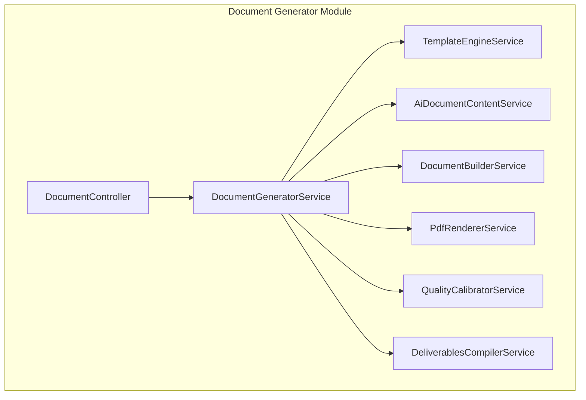
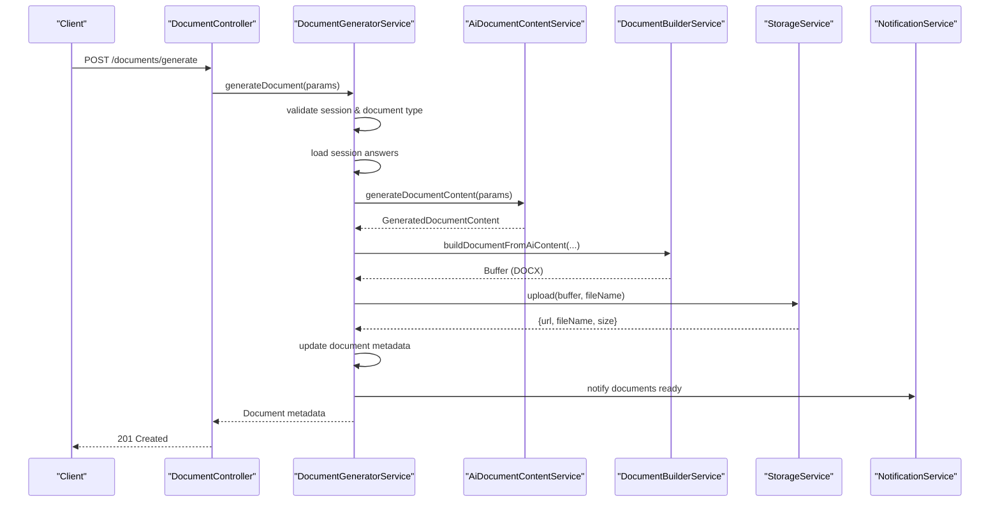
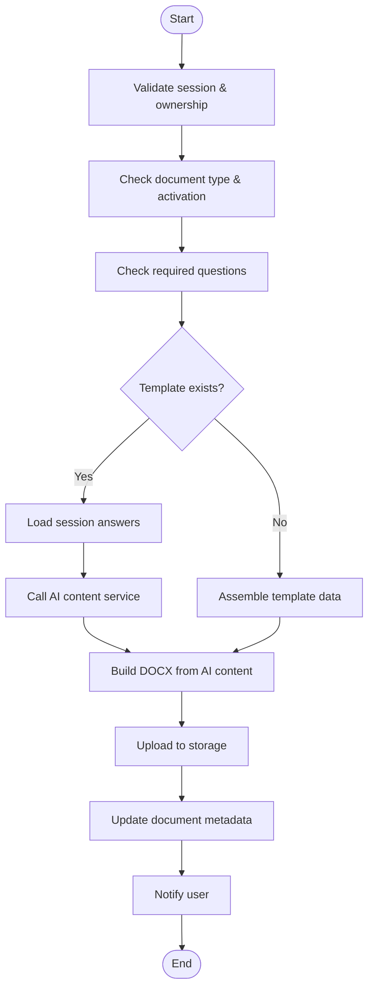
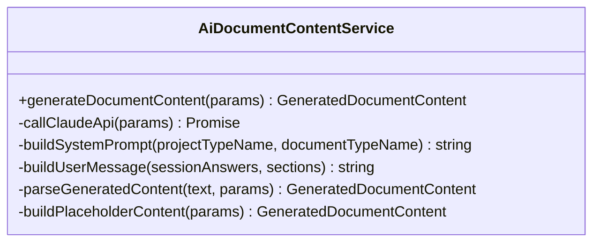
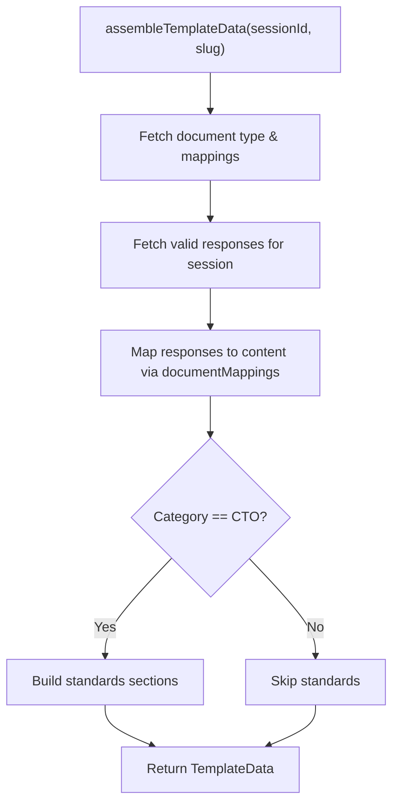
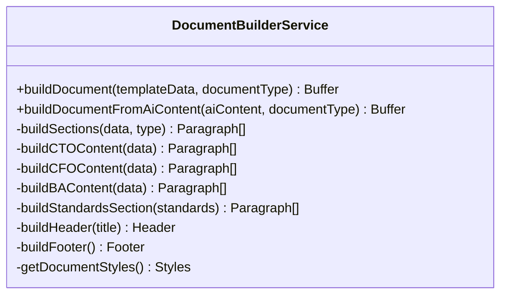
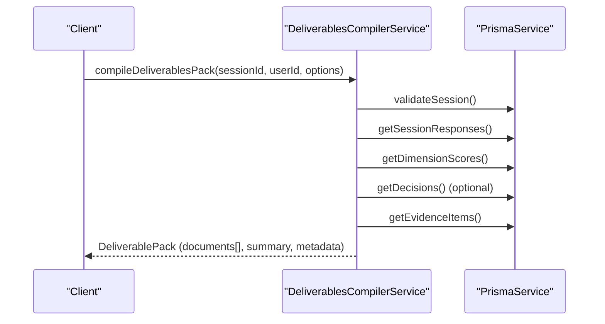
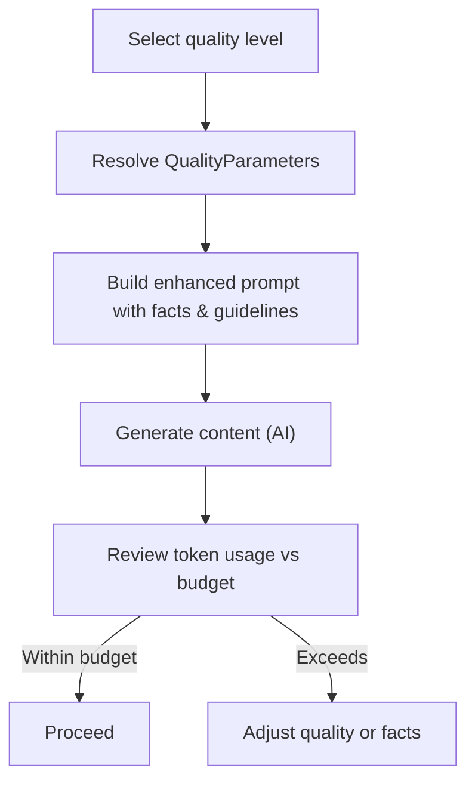
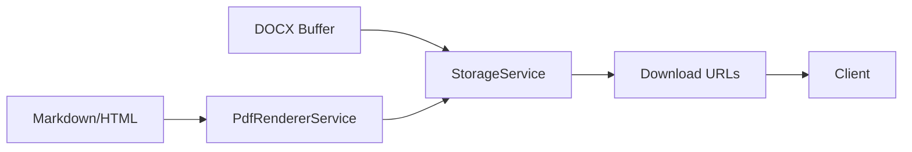
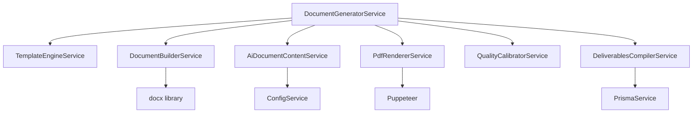

# Automated Document Generation

<cite>
**Referenced Files in This Document**
- [document-generator.module.ts](file://apps/api/src/modules/document-generator/document-generator.module.ts)
- [document-generator.service.ts](file://apps/api/src/modules/document-generator/services/document-generator.service.ts)
- [document.controller.ts](file://apps/api/src/modules/document-generator/controllers/document.controller.ts)
- [ai-document-content.service.ts](file://apps/api/src/modules/document-generator/services/ai-document-content.service.ts)
- [template-engine.service.ts](file://apps/api/src/modules/document-generator/services/template-engine.service.ts)
- [document-builder.service.ts](file://apps/api/src/modules/document-generator/services/document-builder.service.ts)
- [deliverables-compiler.service.ts](file://apps/api/src/modules/document-generator/services/deliverables-compiler.service.ts)
- [quality-calibrator.service.ts](file://apps/api/src/modules/document-generator/services/quality-calibrator.service.ts)
- [pdf-renderer.service.ts](file://apps/api/src/modules/document-generator/services/pdf-renderer.service.ts)
</cite>

## Table of Contents
1. [Introduction](#introduction)
2. [Project Structure](#project-structure)
3. [Core Components](#core-components)
4. [Architecture Overview](#architecture-overview)
5. [Detailed Component Analysis](#detailed-component-analysis)
6. [Dependency Analysis](#dependency-analysis)
7. [Performance Considerations](#performance-considerations)
8. [Troubleshooting Guide](#troubleshooting-guide)
9. [Conclusion](#conclusion)
10. [Appendices](#appendices)

## Introduction
This document describes the Automated Document Generation system that powers the creation of 15+ professional document types (business cases, technical architectures, compliance reports, strategy documents, and more). It explains how the system integrates questionnaire responses with an AI-assisted content engine powered by external providers (Claude), compiles content into DOCX, and optionally renders PDFs. It also covers the document compilation pipeline, quality calibration, multi-format export, template customization, content personalization, bulk processing, and webhook-based delivery.

## Project Structure
The document generation capability is implemented as a NestJS module with dedicated services for orchestration, AI content generation, templating, building, quality calibration, and rendering. Controllers expose REST endpoints for initiating generation, listing document types, retrieving downloads, and bulk packaging.

**Diagram sources**
- [document-generator.module.ts:19-46](file://apps/api/src/modules/document-generator/document-generator.module.ts#L19-L46)
- [document-generator.service.ts:25-32](file://apps/api/src/modules/document-generator/services/document-generator.service.ts#L25-L32)
- [document.controller.ts:40-43](file://apps/api/src/modules/document-generator/controllers/document.controller.ts#L40-L43)

**Section sources**
- [document-generator.module.ts:1-47](file://apps/api/src/modules/document-generator/document-generator.module.ts#L1-L47)

## Core Components
- DocumentGeneratorService: Orchestrates document generation from questionnaire sessions, validates prerequisites, selects AI or template-based generation, builds artifacts, persists metadata, and triggers notifications.
- AiDocumentContentService: Generates structured content using Claude, with fallback to placeholder content when the provider is unavailable.
- TemplateEngineService: Translates session responses into structured content for template-based generation, with safe path mapping and validation.
- DocumentBuilderService: Produces DOCX documents from either template data or AI-generated content, applying consistent styles and headers/footers.
- DeliverablesCompilerService: Compiles a comprehensive “pack” of related documents (architecture dossier, SDLC playbook, test strategy, DevSecOps, privacy, observability, finance, policy, decision log, readiness report) from a single session.
- QualityCalibratorService: Adjusts generation parameters (tokens, sections, features) by quality level to produce outputs ranging from basic to enterprise-grade.
- PdfRendererService: Converts Markdown or HTML content into PDFs using Puppeteer.
- DocumentController: Exposes REST endpoints for generation requests, document listings, downloads, and bulk packaging.

**Section sources**
- [document-generator.service.ts:22-32](file://apps/api/src/modules/document-generator/services/document-generator.service.ts#L22-L32)
- [ai-document-content.service.ts:60-81](file://apps/api/src/modules/document-generator/services/ai-document-content.service.ts#L60-L81)
- [template-engine.service.ts:27-30](file://apps/api/src/modules/document-generator/services/template-engine.service.ts#L27-L30)
- [document-builder.service.ts:29-31](file://apps/api/src/modules/document-generator/services/document-builder.service.ts#L29-L31)
- [deliverables-compiler.service.ts:48-51](file://apps/api/src/modules/document-generator/services/deliverables-compiler.service.ts#L48-L51)
- [quality-calibrator.service.ts:200-201](file://apps/api/src/modules/document-generator/services/quality-calibrator.service.ts#L200-L201)
- [pdf-renderer.service.ts:23-24](file://apps/api/src/modules/document-generator/services/pdf-renderer.service.ts#L23-L24)
- [document.controller.ts:39-43](file://apps/api/src/modules/document-generator/controllers/document.controller.ts#L39-L43)

## Architecture Overview
The system follows a layered architecture:
- API Layer: Controllers accept requests and delegate to services.
- Orchestration Layer: DocumentGeneratorService coordinates validation, selection of generation method, building, storage, and notifications.
- Content Layer: AiDocumentContentService and TemplateEngineService supply content (AI-driven or template-based).
- Rendering Layer: DocumentBuilderService creates DOCX; PdfRendererService converts to PDF.
- Packaging Layer: DeliverablesCompilerService composes multi-document deliverables packs.
- Quality Layer: QualityCalibratorService adapts prompts and parameters by quality level.

**Diagram sources**
- [document.controller.ts:54-65](file://apps/api/src/modules/document-generator/controllers/document.controller.ts#L54-L65)
- [document-generator.service.ts:37-136](file://apps/api/src/modules/document-generator/services/document-generator.service.ts#L37-L136)
- [ai-document-content.service.ts:94-110](file://apps/api/src/modules/document-generator/services/ai-document-content.service.ts#L94-L110)
- [document-builder.service.ts:75-124](file://apps/api/src/modules/document-generator/services/document-builder.service.ts#L75-L124)

## Detailed Component Analysis

### Document Generation Orchestration
- Validates session existence and completion, user ownership, and document type availability.
- Enforces required questions per document type.
- Chooses AI-driven generation when a template definition exists; otherwise falls back to template-based assembly.
- Builds DOCX, uploads to storage, updates metadata, and notifies the user.

**Diagram sources**
- [document-generator.service.ts:37-219](file://apps/api/src/modules/document-generator/services/document-generator.service.ts#L37-L219)

**Section sources**
- [document-generator.service.ts:37-219](file://apps/api/src/modules/document-generator/services/document-generator.service.ts#L37-L219)

### AI-Assisted Content Generation (Claude)
- Initializes with configuration for model and token limits.
- Streams Claude responses to support long-form generation and avoid timeouts.
- Parses structured JSON output into sections and summary; falls back to placeholder content if parsing fails or API key is missing.
- Provides dimension-aware grouping of answers and section mapping for context.

**Diagram sources**
- [ai-document-content.service.ts:60-110](file://apps/api/src/modules/document-generator/services/ai-document-content.service.ts#L60-L110)

**Section sources**
- [ai-document-content.service.ts:94-153](file://apps/api/src/modules/document-generator/services/ai-document-content.service.ts#L94-L153)
- [ai-document-content.service.ts:251-291](file://apps/api/src/modules/document-generator/services/ai-document-content.service.ts#L251-L291)

### Template Engine and Personalization
- Loads document type and standard mappings, aggregates validated responses, and maps them into a nested content object using safe dot-path resolution.
- Supports category-specific content assembly (CTO, CFO, BA) and optional standards sections for engineering standards.
- Validates presence of required fields prior to building.

**Diagram sources**
- [template-engine.service.ts:44-103](file://apps/api/src/modules/document-generator/services/template-engine.service.ts#L44-L103)

**Section sources**
- [template-engine.service.ts:108-137](file://apps/api/src/modules/document-generator/services/template-engine.service.ts#L108-L137)
- [template-engine.service.ts:204-250](file://apps/api/src/modules/document-generator/services/template-engine.service.ts#L204-L250)
- [template-engine.service.ts:299-316](file://apps/api/src/modules/document-generator/services/template-engine.service.ts#L299-L316)

### Document Building (DOCX)
- Creates DOCX documents with consistent styles, headers, footers, and page margins.
- Supports building from AI-generated content (title, summary, sections split into paragraphs) and from template data (CTO/CFO/BA categories, standards).
- Provides helper methods for headings, labeled paragraphs, bullet points, and empty spacing.

**Diagram sources**
- [document-builder.service.ts:29-124](file://apps/api/src/modules/document-generator/services/document-builder.service.ts#L29-L124)

**Section sources**
- [document-builder.service.ts:35-124](file://apps/api/src/modules/document-generator/services/document-builder.service.ts#L35-L124)

### Deliverables Compilation Pipeline
- Compiles a comprehensive set of related documents from a single session, including architecture dossier, SDLC playbook, test strategy, DevSecOps, privacy, observability, finance, and optional policy, decision log, and readiness report.
- Aggregates responses, dimension scores, decisions, and evidence items; computes pack summary and metadata.

**Diagram sources**
- [deliverables-compiler.service.ts:56-137](file://apps/api/src/modules/document-generator/services/deliverables-compiler.service.ts#L56-L137)

**Section sources**
- [deliverables-compiler.service.ts:56-137](file://apps/api/src/modules/document-generator/services/deliverables-compiler.service.ts#L56-L137)

### Quality Calibration and Parameter Tuning
- Defines five quality levels (Basic through Enterprise) with distinct token budgets, section sets, feature flags, and prompt modifiers.
- Adapts system prompts and user prompts to steer content depth and formatting.
- Estimates token usage for extracted facts to ensure feasibility within quality constraints.

**Diagram sources**
- [quality-calibrator.service.ts:206-267](file://apps/api/src/modules/document-generator/services/quality-calibrator.service.ts#L206-L267)

**Section sources**
- [quality-calibrator.service.ts:206-267](file://apps/api/src/modules/document-generator/services/quality-calibrator.service.ts#L206-L267)
- [quality-calibrator.service.ts:339-354](file://apps/api/src/modules/document-generator/services/quality-calibrator.service.ts#L339-L354)

### Multi-Format Export and Rendering
- DOCX export: Built by DocumentBuilderService and uploaded via StorageService.
- PDF export: Optional rendering from Markdown or HTML using PdfRendererService with configurable paper size, margins, and headers/footers.
- Bulk downloads: Controllers support downloading a session’s documents as a ZIP archive or selected documents as a ZIP.

**Diagram sources**
- [document-builder.service.ts:35-69](file://apps/api/src/modules/document-generator/services/document-builder.service.ts#L35-L69)
- [pdf-renderer.service.ts:131-205](file://apps/api/src/modules/document-generator/services/pdf-renderer.service.ts#L131-L205)
- [document.controller.ts:143-197](file://apps/api/src/modules/document-generator/controllers/document.controller.ts#L143-L197)

**Section sources**
- [pdf-renderer.service.ts:131-205](file://apps/api/src/modules/document-generator/services/pdf-renderer.service.ts#L131-L205)
- [document.controller.ts:143-197](file://apps/api/src/modules/document-generator/controllers/document.controller.ts#L143-L197)

### Template Customization and Content Personalization
- Template customization occurs via documentMappings on questions, enabling precise placement of answers into nested content structures.
- Personalization leverages dimension keys to group answers contextually for AI generation and to tailor standards sections for CTO documents.
- Placeholder content ensures generation proceeds even without AI provider availability.

**Section sources**
- [template-engine.service.ts:108-137](file://apps/api/src/modules/document-generator/services/template-engine.service.ts#L108-L137)
- [template-engine.service.ts:212-231](file://apps/api/src/modules/document-generator/services/template-engine.service.ts#L212-L231)
- [ai-document-content.service.ts:298-311](file://apps/api/src/modules/document-generator/services/ai-document-content.service.ts#L298-L311)

### Bulk Document Processing
- Bulk ZIP generation supports downloading all session documents or a selected subset.
- Controllers enforce access checks and return a streamed ZIP with metadata headers.

**Section sources**
- [document.controller.ts:143-197](file://apps/api/src/modules/document-generator/controllers/document.controller.ts#L143-L197)

### Webhook-Based Delivery Mechanisms
- Notifications are triggered upon document readiness and approval; these can integrate with webhook endpoints in the broader notification subsystem.
- The system logs and warns on failures to send notifications but does not block document generation.

**Section sources**
- [document-generator.service.ts:576-607](file://apps/api/src/modules/document-generator/services/document-generator.service.ts#L576-L607)

## Dependency Analysis
- DocumentGeneratorService depends on TemplateEngineService, DocumentBuilderService, StorageService, NotificationService, and AiDocumentContentService.
- AiDocumentContentService depends on configuration for the Claude client and streams responses.
- DocumentBuilderService depends on docx for DOCX construction.
- PdfRendererService depends on Puppeteer for HTML-to-PDF conversion.
- DeliverablesCompilerService depends on PrismaService to fetch responses, decisions, and evidence items.
- QualityCalibratorService influences prompt construction and token budgets used by AI generation.

**Diagram sources**
- [document-generator.module.ts:22-34](file://apps/api/src/modules/document-generator/document-generator.module.ts#L22-L34)
- [ai-document-content.service.ts:66-74](file://apps/api/src/modules/document-generator/services/ai-document-content.service.ts#L66-L74)
- [document-builder.service.ts:17-18](file://apps/api/src/modules/document-generator/services/document-builder.service.ts#L17-L18)
- [pdf-renderer.service.ts:2-2](file://apps/api/src/modules/document-generator/services/pdf-renderer.service.ts#L2-L2)
- [deliverables-compiler.service.ts:51-51](file://apps/api/src/modules/document-generator/services/deliverables-compiler.service.ts#L51-L51)

**Section sources**
- [document-generator.module.ts:22-34](file://apps/api/src/modules/document-generator/document-generator.module.ts#L22-L34)

## Performance Considerations
- Streaming AI responses prevents timeouts and improves reliability for long documents.
- Token budgets and quality levels cap generation cost and length; use QualityCalibratorService to balance quality and performance.
- Safe path mapping in TemplateEngineService avoids unsafe property writes and reduces risk of runtime errors.
- PDF rendering uses a headless browser; ensure adequate resources for concurrent conversions.

## Troubleshooting Guide
- Missing required questions: Generation fails early if required questions for a document type are not answered.
- Session not completed: Generation requires a completed session.
- Access denied: Users can only generate documents for their own sessions.
- AI provider unconfigured: Without a configured API key, the system falls back to placeholder content; verify configuration to enable AI generation.
- Empty or malformed AI responses: The system parses structured JSON and falls back to placeholders if parsing fails.
- Download URL errors: Ensure the document is in a downloadable state (generated or approved) and has a stored URL.

**Section sources**
- [document-generator.service.ts:49-100](file://apps/api/src/modules/document-generator/services/document-generator.service.ts#L49-L100)
- [document-generator.service.ts:371-388](file://apps/api/src/modules/document-generator/services/document-generator.service.ts#L371-L388)
- [ai-document-content.service.ts:97-110](file://apps/api/src/modules/document-generator/services/ai-document-content.service.ts#L97-L110)
- [ai-document-content.service.ts:255-291](file://apps/api/src/modules/document-generator/services/ai-document-content.service.ts#L255-L291)

## Conclusion
The Automated Document Generation system combines robust orchestration, AI-assisted content generation, and flexible rendering to produce a wide range of professional documents. Its modular design enables customization via templates and quality calibration, while controllers provide straightforward APIs for generation, retrieval, and bulk operations. Optional PDF rendering and webhook-based notifications round out a production-ready solution.

## Appendices

### Supported Document Types and Categories
- Categories include CTO, CFO, and BA, each mapped to category-specific content builders.
- DeliverablesCompilerService composes a suite of related documents from a single session.

**Section sources**
- [document-builder.service.ts:139-157](file://apps/api/src/modules/document-generator/services/document-builder.service.ts#L139-L157)
- [deliverables-compiler.service.ts:80-116](file://apps/api/src/modules/document-generator/services/deliverables-compiler.service.ts#L80-L116)

### Example Workflows
- Generate a single document from a completed session: POST /documents/generate with sessionId and documentTypeId.
- List available document types scoped to a session: GET /documents/session/{sessionId}/types.
- Download a document: GET /documents/{id}/download with optional expiresIn parameter.
- Bulk download: GET /documents/session/{sessionId}/bulk-download or POST /documents/bulk-download with selected document IDs.

**Section sources**
- [document.controller.ts:54-92](file://apps/api/src/modules/document-generator/controllers/document.controller.ts#L54-L92)
- [document.controller.ts:129-141](file://apps/api/src/modules/document-generator/controllers/document.controller.ts#L129-L141)
- [document.controller.ts:143-197](file://apps/api/src/modules/document-generator/controllers/document.controller.ts#L143-L197)