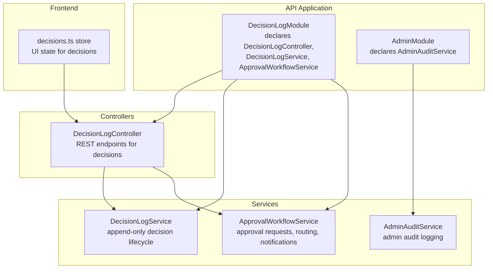
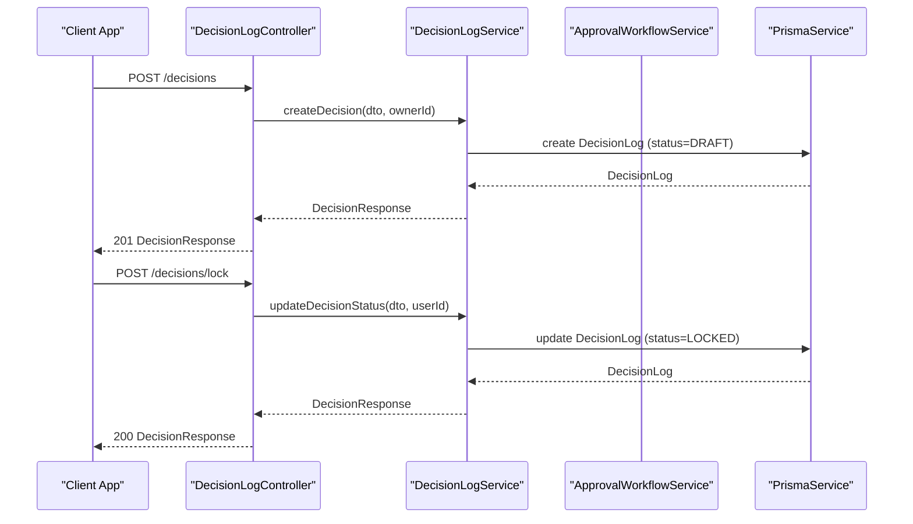
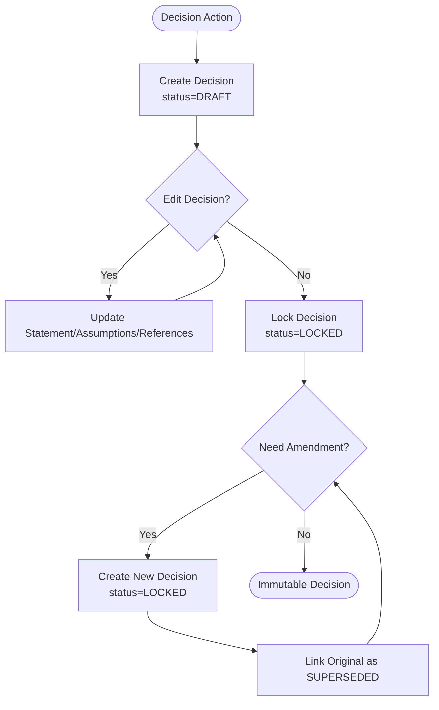
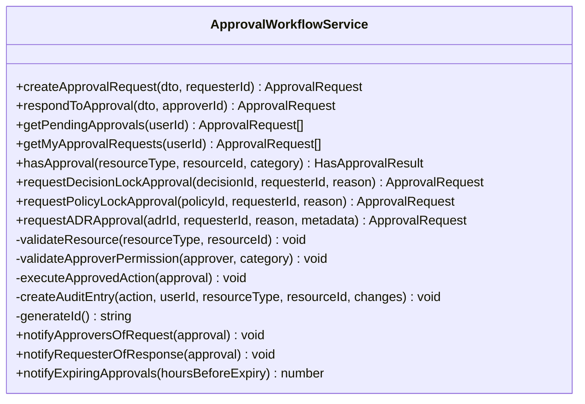
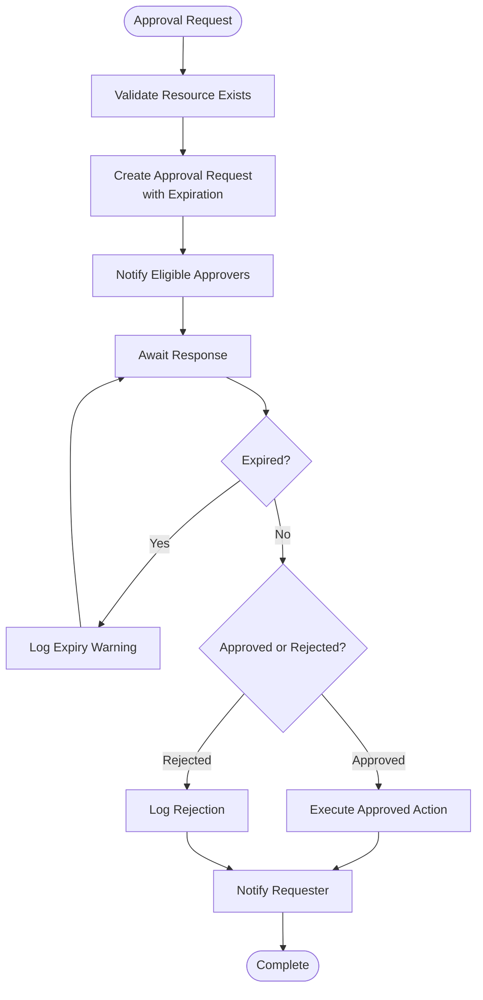
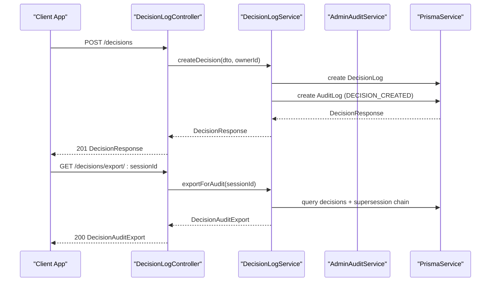
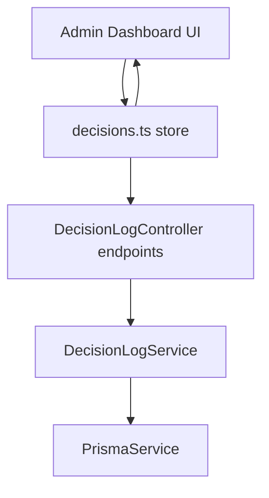
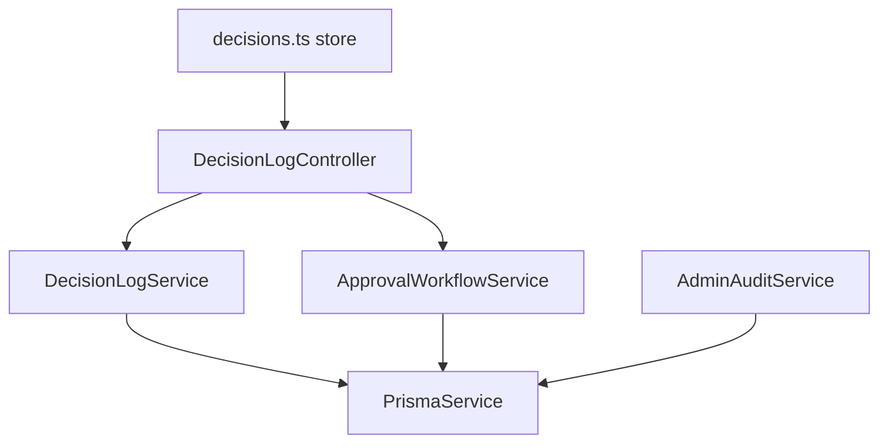

# Decision Workflow System

<cite>
**Referenced Files in This Document**
- [decision-log.module.ts](file://apps/api/src/modules/decision-log/decision-log.module.ts)
- [approval-workflow.service.ts](file://apps/api/src/modules/decision-log/approval-workflow.service.ts)
- [decision-log.service.ts](file://apps/api/src/modules/decision-log/decision-log.service.ts)
- [decision-log.controller.ts](file://apps/api/src/modules/decision-log/decision-log.controller.ts)
- [require-approval.decorator.ts](file://apps/api/src/modules/decision-log/decorators/require-approval.decorator.ts)
- [decision.dto.ts](file://apps/api/src/modules/decision-log/dto/decision.dto.ts)
- [admin.module.ts](file://apps/api/src/modules/admin/admin.module.ts)
- [admin-audit.service.ts](file://apps/api/src/modules/admin/services/admin-audit.service.ts)
- [admin-approval-workflow.flow.test.ts](file://apps/api/test/integration/admin-approval-workflow.flow.test.ts)
- [decisions.ts](file://apps/web/src/stores/decisions.ts)
- [dashboard.e2e.test.ts](file://e2e/admin/dashboard.e2e.test.ts)
</cite>

## Table of Contents
1. [Introduction](#introduction)
2. [Project Structure](#project-structure)
3. [Core Components](#core-components)
4. [Architecture Overview](#architecture-overview)
5. [Detailed Component Analysis](#detailed-component-analysis)
6. [Dependency Analysis](#dependency-analysis)
7. [Performance Considerations](#performance-considerations)
8. [Troubleshooting Guide](#troubleshooting-guide)
9. [Conclusion](#conclusion)
10. [Appendices](#appendices)

## Introduction
The Decision Workflow System provides a robust framework for governance decisions, approvals, and administrative controls. It enforces mandatory approvals for critical actions, maintains append-only decision logs, and ensures complete audit trails for compliance. The system integrates role-based approval routing, escalation policies, and notification triggers to support two-person rule enforcement and administrative oversight.

## Project Structure
The Decision Workflow System is implemented as a NestJS module within the API application and integrates with the Admin module and frontend stores for decision management.

**Diagram sources**
- [decision-log.module.ts:1-24](file://apps/api/src/modules/decision-log/decision-log.module.ts#L1-L24)
- [admin.module.ts:1-14](file://apps/api/src/modules/admin/admin.module.ts#L1-L14)
- [decision-log.controller.ts:36-40](file://apps/api/src/modules/decision-log/decision-log.controller.ts#L36-L40)
- [decision-log.service.ts:37-41](file://apps/api/src/modules/decision-log/decision-log.service.ts#L37-L41)
- [approval-workflow.service.ts:89-99](file://apps/api/src/modules/decision-log/approval-workflow.service.ts#L89-L99)
- [admin-audit.service.ts:15-19](file://apps/api/src/modules/admin/services/admin-audit.service.ts#L15-L19)
- [decisions.ts:26-91](file://apps/web/src/stores/decisions.ts#L26-L91)

**Section sources**
- [decision-log.module.ts:1-24](file://apps/api/src/modules/decision-log/decision-log.module.ts#L1-L24)
- [admin.module.ts:1-14](file://apps/api/src/modules/admin/admin.module.ts#L1-L14)

## Core Components
- DecisionLogModule: Declares the DecisionLogController, DecisionLogService, and ApprovalWorkflowService, enabling the decision lifecycle and approval workflows.
- DecisionLogService: Implements append-only decision management with strict status transitions (DRAFT → LOCKED → SUPERSEDED) and supersession chaining for amendments.
- ApprovalWorkflowService: Enforces two-person rule approvals for high-risk categories, manages approval requests, routing, expiration, and notifications.
- DecisionLogController: Exposes REST endpoints for creating, locking, superseding, listing, exporting, and deleting decisions.
- RequireApproval Decorator and ApprovalGuard: Enforce approval requirements at runtime for protected operations.
- AdminAuditService: Provides administrative audit logging with request metadata capture.

**Section sources**
- [decision-log.module.ts:8-23](file://apps/api/src/modules/decision-log/decision-log.module.ts#L8-L23)
- [decision-log.service.ts:19-36](file://apps/api/src/modules/decision-log/decision-log.service.ts#L19-L36)
- [approval-workflow.service.ts:75-88](file://apps/api/src/modules/decision-log/approval-workflow.service.ts#L75-L88)
- [decision-log.controller.ts:27-39](file://apps/api/src/modules/decision-log/decision-log.controller.ts#L27-L39)
- [require-approval.decorator.ts:39-61](file://apps/api/src/modules/decision-log/decorators/require-approval.decorator.ts#L39-L61)
- [admin-audit.service.ts:15-57](file://apps/api/src/modules/admin/services/admin-audit.service.ts#L15-L57)

## Architecture Overview
The system enforces governance through a layered architecture:
- Presentation Layer: DecisionLogController handles HTTP requests and delegates to services.
- Domain Services: DecisionLogService and ApprovalWorkflowService encapsulate business logic.
- Persistence: PrismaService interacts with the database for decisions, approvals, and audit logs.
- Administration: AdminAuditService captures administrative actions with request metadata.

**Diagram sources**
- [decision-log.controller.ts:61-98](file://apps/api/src/modules/decision-log/decision-log.controller.ts#L61-L98)
- [decision-log.service.ts:49-123](file://apps/api/src/modules/decision-log/decision-log.service.ts#L49-L123)

**Section sources**
- [decision-log.controller.ts:43-98](file://apps/api/src/modules/decision-log/decision-log.controller.ts#L43-L98)
- [decision-log.service.ts:49-123](file://apps/api/src/modules/decision-log/decision-log.service.ts#L49-L123)

## Detailed Component Analysis

### Decision Lifecycle and Append-Only Enforcement
The DecisionLogService implements an append-only decision record with strict status transitions:
- Creation: Decisions start as DRAFT and can be edited until locked.
- Locking: Only DRAFT decisions can be locked to become permanent.
- Supersession: Locked decisions can only be amended by creating a new decision that supersedes the original.
- Deletion: Only DRAFT decisions can be deleted; locked and superseded decisions are immutable.

**Diagram sources**
- [decision-log.service.ts:49-188](file://apps/api/src/modules/decision-log/decision-log.service.ts#L49-L188)

**Section sources**
- [decision-log.service.ts:49-188](file://apps/api/src/modules/decision-log/decision-log.service.ts#L49-L188)

### Approval Workflow Engine
The ApprovalWorkflowService enforces two-person rule approvals for high-risk categories:
- Categories: POLICY_LOCK, ADR_APPROVAL, HIGH_RISK_DECISION, SECURITY_EXCEPTION, DATA_ACCESS.
- Request Creation: Validates resources, creates approval requests with expiration, and logs audit events.
- Response Handling: Enforces requester cannot approve their own request, validates approver permissions, executes approved actions, and notifies parties.
- Notifications: Sends notifications for new requests, responses, and expiring approvals.

**Diagram sources**
- [approval-workflow.service.ts:89-653](file://apps/api/src/modules/decision-log/approval-workflow.service.ts#L89-L653)

**Section sources**
- [approval-workflow.service.ts:108-243](file://apps/api/src/modules/decision-log/approval-workflow.service.ts#L108-L243)
- [approval-workflow.service.ts:336-404](file://apps/api/src/modules/decision-log/approval-workflow.service.ts#L336-L404)
- [approval-workflow.service.ts:468-495](file://apps/api/src/modules/decision-log/approval-workflow.service.ts#L468-L495)
- [approval-workflow.service.ts:533-585](file://apps/api/src/modules/decision-log/approval-workflow.service.ts#L533-L585)
- [approval-workflow.service.ts:618-651](file://apps/api/src/modules/decision-log/approval-workflow.service.ts#L618-L651)

### Role-Based Approval Routing and Escalation Policies
Approval routing is role-based:
- POLICY_LOCK: Requires ADMIN or SUPER_ADMIN roles.
- ADR_APPROVAL: Requires DEVELOPER, ADMIN, or SUPER_ADMIN roles.
- HIGH_RISK_DECISION: Requires DEVELOPER, ADMIN, or SUPER_ADMIN roles.
- SECURITY_EXCEPTION: Requires ADMIN or SUPER_ADMIN roles.
- DATA_ACCESS: Requires ADMIN or SUPER_ADMIN roles.

Escalation policies:
- Expiration: Approvals expire after a configurable timeout (default 72 hours).
- Expiry Warnings: Scheduled notifications for expiring approvals.
- Eligible Approvers: Automatically identifies users with required roles excluding the requester.

**Diagram sources**
- [approval-workflow.service.ts:108-160](file://apps/api/src/modules/decision-log/approval-workflow.service.ts#L108-L160)
- [approval-workflow.service.ts:172-243](file://apps/api/src/modules/decision-log/approval-workflow.service.ts#L172-L243)
- [approval-workflow.service.ts:444-463](file://apps/api/src/modules/decision-log/approval-workflow.service.ts#L444-L463)
- [approval-workflow.service.ts:618-651](file://apps/api/src/modules/decision-log/approval-workflow.service.ts#L618-L651)

**Section sources**
- [approval-workflow.service.ts:444-463](file://apps/api/src/modules/decision-log/approval-workflow.service.ts#L444-L463)
- [approval-workflow.service.ts:590-613](file://apps/api/src/modules/decision-log/approval-workflow.service.ts#L590-L613)
- [approval-workflow.service.ts:618-651](file://apps/api/src/modules/decision-log/approval-workflow.service.ts#L618-L651)

### Decision Logging Mechanism and Audit Trails
Decision actions are logged comprehensively:
- Decision Actions: CREATE, LOCKED, SUPERSEDED, CREATED_AS_SUPERSESSION.
- Audit Events: APPROVAL_REQUESTED, APPROVAL_GRANTED, APPROVAL_REJECTED, APPROVAL_NOTIFICATION_SENT, APPROVAL_RESPONSE_NOTIFICATION_SENT, APPROVAL_EXPIRY_WARNING_SENT.
- Admin Audit: AdminAuditService captures administrative actions with IP address, user agent, and request ID.

**Diagram sources**
- [decision-log.controller.ts:61-98](file://apps/api/src/modules/decision-log/decision-log.controller.ts#L61-L98)
- [decision-log.service.ts:352-367](file://apps/api/src/modules/decision-log/decision-log.service.ts#L352-L367)
- [admin-audit.service.ts:21-44](file://apps/api/src/modules/admin/services/admin-audit.service.ts#L21-L44)

**Section sources**
- [decision-log.service.ts:352-367](file://apps/api/src/modules/decision-log/decision-log.service.ts#L352-L367)
- [admin-audit.service.ts:21-44](file://apps/api/src/modules/admin/services/admin-audit.service.ts#L21-L44)

### Integration with Admin System
The Admin module provides audit logging capabilities integrated with the decision workflow:
- AdminAuditService: Logs administrative actions with request metadata extraction.
- Integration Points: Decision actions trigger audit logs; approval actions trigger separate audit entries.

**Section sources**
- [admin.module.ts:7-12](file://apps/api/src/modules/admin/admin.module.ts#L7-L12)
- [admin-audit.service.ts:15-57](file://apps/api/src/modules/admin/services/admin-audit.service.ts#L15-L57)

### Examples of Approval Scenarios and Workflow Configurations
- Policy Lock Approval: Request approval for policy changes requiring ADMIN or SUPER_ADMIN.
- ADR Approval: Peer review for Architectural Decision Records requiring DEVELOPER, ADMIN, or SUPER_ADMIN.
- High-Risk Decision Lock: Two-person rule for critical decisions requiring DEVELOPER, ADMIN, or SUPER_ADMIN.
- Security Exception: Explicit approval for security exceptions requiring ADMIN or SUPER_ADMIN.
- Data Access: Administrative approval for sensitive data access requiring ADMIN or SUPER_ADMIN.

**Section sources**
- [approval-workflow.service.ts:369-404](file://apps/api/src/modules/decision-log/approval-workflow.service.ts#L369-L404)
- [require-approval.decorator.ts:158-202](file://apps/api/src/modules/decision-log/decorators/require-approval.decorator.ts#L158-L202)

### Decision Tracking Dashboards
The frontend integrates with the decision workflow through a Zustand store:
- Load Decisions: Fetches decisions for a session.
- Create Decision: Adds a new decision to the store optimistically.
- Update Status: Optimistically updates decision status and rolls back on failure.
- Reset: Clears the store state.

**Diagram sources**
- [decisions.ts:26-91](file://apps/web/src/stores/decisions.ts#L26-L91)
- [decision-log.controller.ts:43-243](file://apps/api/src/modules/decision-log/decision-log.controller.ts#L43-L243)

**Section sources**
- [decisions.ts:26-91](file://apps/web/src/stores/decisions.ts#L26-L91)

## Dependency Analysis
The Decision Workflow System exhibits strong cohesion within the DecisionLogModule and clear separation of concerns:
- DecisionLogModule depends on PrismaModule for persistence.
- DecisionLogController depends on DecisionLogService and ApprovalWorkflowService.
- ApprovalWorkflowService depends on PrismaService for user and decision queries.
- AdminAuditService depends on PrismaService for audit log creation.
- Frontend decisions store depends on questionnaire API endpoints.

**Diagram sources**
- [decision-log.controller.ts:15-41](file://apps/api/src/modules/decision-log/decision-log.controller.ts#L15-L41)
- [decision-log.service.ts:39-41](file://apps/api/src/modules/decision-log/decision-log.service.ts#L39-L41)
- [approval-workflow.service.ts:99](file://apps/api/src/modules/decision-log/approval-workflow.service.ts#L99)
- [admin-audit.service.ts:19](file://apps/api/src/modules/admin/services/admin-audit.service.ts#L19)
- [decisions.ts:1-2](file://apps/web/src/stores/decisions.ts#L1-L2)

**Section sources**
- [decision-log.controller.ts:15-41](file://apps/api/src/modules/decision-log/decision-log.controller.ts#L15-L41)
- [decision-log.service.ts:39-41](file://apps/api/src/modules/decision-log/decision-log.service.ts#L39-L41)
- [approval-workflow.service.ts:99](file://apps/api/src/modules/decision-log/approval-workflow.service.ts#L99)
- [admin-audit.service.ts:19](file://apps/api/src/modules/admin/services/admin-audit.service.ts#L19)
- [decisions.ts:1-2](file://apps/web/src/stores/decisions.ts#L1-L2)

## Performance Considerations
- In-memory approvals storage: The ApprovalWorkflowService uses an in-memory map for approvals, suitable for development but requires persistence in production.
- Transactional operations: Supersession uses Prisma transactions to ensure atomicity.
- Audit logging overhead: Each decision and approval action creates audit log entries; consider batching for high-volume scenarios.
- Pagination: Decision listing supports filtering and pagination via Prisma take/where clauses.

## Troubleshooting Guide
Common issues and resolutions:
- Decision Not Found: Ensure the decision ID exists and is accessible to the user.
- Invalid Status Transition: Only DRAFT can be locked; use supersession for amendments.
- Two-Person Rule Violation: Requester cannot approve their own request; ensure a different approver.
- Insufficient Permissions: Approver must have the required role for the approval category.
- Approval Already Responded: Pending approvals cannot be reprocessed; check approval status.
- Approval Expired: Approvals expire after the configured timeout; request a new approval.

**Section sources**
- [decision-log.service.ts:95-110](file://apps/api/src/modules/decision-log/decision-log.service.ts#L95-L110)
- [approval-workflow.service.ts:172-243](file://apps/api/src/modules/decision-log/approval-workflow.service.ts#L172-L243)
- [approval-workflow.service.ts:444-463](file://apps/api/src/modules/decision-log/approval-workflow.service.ts#L444-L463)

## Conclusion
The Decision Workflow System establishes a secure, auditable, and compliant framework for governance decisions. Its append-only decision records, two-person rule approvals, and comprehensive audit trails ensure accountability and traceability. The modular design enables seamless integration with administrative controls and front-end dashboards, supporting scalable governance across critical actions and administrative workflows.

## Appendices

### API Endpoints Summary
- POST /decisions: Create a new decision (DRAFT).
- POST /decisions/lock: Lock a DRAFT decision (LOCKED).
- POST /decisions/supersede: Create a superseding decision (SUPERSEDED original).
- GET /decisions/:decisionId: Retrieve a decision.
- GET /decisions: List decisions with filters.
- GET /decisions/:decisionId/chain: Get supersession chain.
- GET /decisions/export/:sessionId: Export decisions for audit.
- DELETE /decisions/:decisionId: Delete a DRAFT decision.

**Section sources**
- [decision-log.controller.ts:43-243](file://apps/api/src/modules/decision-log/decision-log.controller.ts#L43-L243)

### Integration Tests and E2E Coverage
- Integration tests document expected behavior for decision append-only workflow and audit trails.
- E2E tests outline planned admin approval dashboard features (pending implementation).

**Section sources**
- [admin-approval-workflow.flow.test.ts:101-207](file://apps/api/test/integration/admin-approval-workflow.flow.test.ts#L101-L207)
- [dashboard.e2e.test.ts:131-199](file://e2e/admin/dashboard.e2e.test.ts#L131-L199)