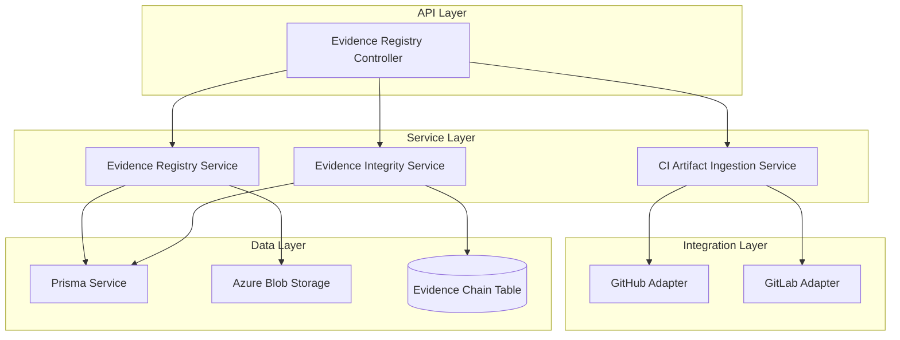
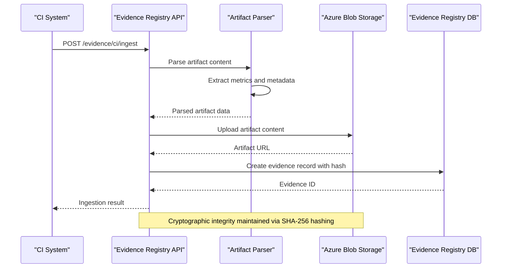
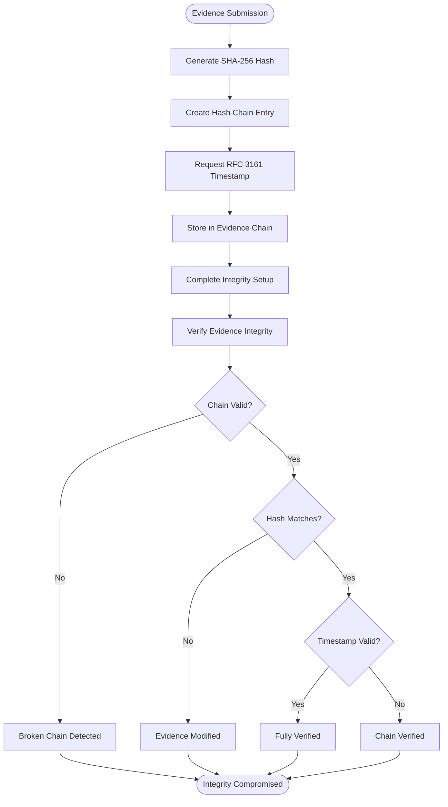
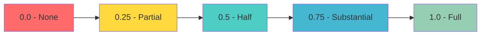
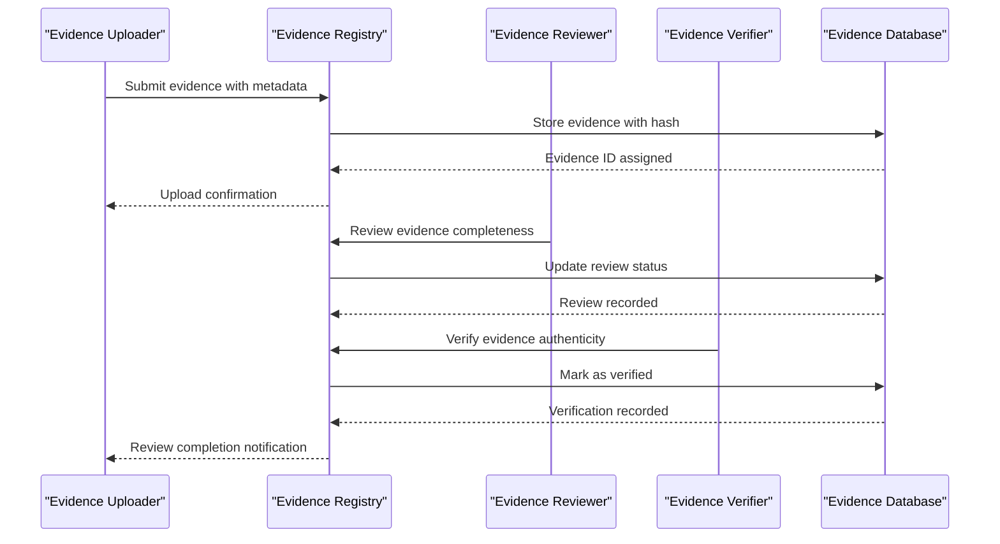

# Evidence Registry System

<cite>
**Referenced Files in This Document**
- [evidence-registry.module.ts](file://apps/api/src/modules/evidence-registry/evidence-registry.module.ts)
- [evidence-registry.service.ts](file://apps/api/src/modules/evidence-registry/evidence-registry.service.ts)
- [evidence-integrity.service.ts](file://apps/api/src/modules/evidence-registry/evidence-integrity.service.ts)
- [ci-artifact-ingestion.service.ts](file://apps/api/src/modules/evidence-registry/ci-artifact-ingestion.service.ts)
- [evidence-registry.controller.ts](file://apps/api/src/modules/evidence-registry/evidence-registry.controller.ts)
- [github.adapter.ts](file://apps/api/src/modules/adapters/github.adapter.ts)
- [gitlab.adapter.ts](file://apps/api/src/modules/adapters/gitlab.adapter.ts)
</cite>

## Table of Contents
1. [Introduction](#introduction)
2. [System Architecture](#system-architecture)
3. [Core Components](#core-components)
4. [CI/CD Artifact Ingestion Pipeline](#cicd-artifact-ingestion-pipeline)
5. [Evidence Integrity and Validation](#evidence-integrity-and-validation)
6. [External System Integration](#external-system-integration)
7. [Evidence Types and Metadata](#evidence-types-and-metadata)
8. [Validation Rules and Compliance Tracking](#validation-rules-and-compliance-tracking)
9. [Audit Trail Generation](#audit-trail-generation)
10. [Evidence Review Process](#evidence-review-process)
11. [Performance Considerations](#performance-considerations)
12. [Troubleshooting Guide](#troubleshooting-guide)
13. [Conclusion](#conclusion)

## Introduction

The Evidence Registry System is a comprehensive compliance artifact management platform designed to collect, validate, and maintain integrity of evidence from various sources. Built as part of the Quiz2Biz readiness assessment framework, this system provides automated evidence collection from CI/CD pipelines, external repositories, and manual uploads while ensuring cryptographic integrity and compliance tracking.

The system operates on three core pillars: automated CI/CD evidence ingestion, cryptographic evidence integrity verification, and comprehensive compliance tracking across multiple evidence types and validation rules.

## System Architecture

The Evidence Registry System follows a modular NestJS architecture with clear separation of concerns:

**Diagram sources**
- [evidence-registry.controller.ts:61-66](file://apps/api/src/modules/evidence-registry/evidence-registry.controller.ts#L61-L66)
- [evidence-registry.module.ts:20-25](file://apps/api/src/modules/evidence-registry/evidence-registry.module.ts#L20-L25)

**Section sources**
- [evidence-registry.module.ts:1-27](file://apps/api/src/modules/evidence-registry/evidence-registry.module.ts#L1-L27)
- [evidence-registry.controller.ts:47-61](file://apps/api/src/modules/evidence-registry/evidence-registry.controller.ts#L47-L61)

## Core Components

### Evidence Registry Service

The Evidence Registry Service serves as the primary manager for all evidence artifacts, handling file uploads, validation, and lifecycle management.

**Key Features:**
- SHA-256 cryptographic hashing for evidence integrity
- Azure Blob Storage integration for secure file storage
- Comprehensive evidence validation and filtering
- Coverage level management for compliance tracking
- Audit trail generation and integrity verification

**Section sources**
- [evidence-registry.service.ts:86-96](file://apps/api/src/modules/evidence-registry/evidence-registry.service.ts#L86-L96)
- [evidence-registry.service.ts:165-208](file://apps/api/src/modules/evidence-registry/evidence-registry.service.ts#L165-L208)

### Evidence Integrity Service

The Evidence Integrity Service implements blockchain-style hash chaining and RFC 3161 timestamp authority integration for tamper-evident evidence storage.

**Security Features:**
- Hash chain linking evidence items chronologically
- RFC 3161 compliant timestamp token integration
- Comprehensive chain validation and verification
- Tamper detection through cryptographic proofs

**Section sources**
- [evidence-integrity.service.ts:22-35](file://apps/api/src/modules/evidence-registry/evidence-integrity.service.ts#L22-L35)
- [evidence-integrity.service.ts:59-133](file://apps/api/src/modules/evidence-registry/evidence-integrity.service.ts#L59-L133)

### CI Artifact Ingestion Service

Automates evidence collection from CI/CD pipelines, parsing and validating artifacts from multiple providers.

**Supported Artifacts:**
- Test reports (JUnit XML, Jest JSON)
- Code coverage reports (lcov, Cobertura)
- SBOM files (CycloneDX, SPDX)
- Security scan results (Trivy, OWASP)
- Build artifacts and logs

**Section sources**
- [ci-artifact-ingestion.service.ts:21-36](file://apps/api/src/modules/evidence-registry/ci-artifact-ingestion.service.ts#L21-L36)
- [ci-artifact-ingestion.service.ts:98-163](file://apps/api/src/modules/evidence-registry/ci-artifact-ingestion.service.ts#L98-L163)

## CI/CD Artifact Ingestion Pipeline

The CI/CD artifact ingestion pipeline automates evidence collection from continuous integration systems, providing seamless integration with modern development workflows.

**Diagram sources**
- [ci-artifact-ingestion.service.ts:98-163](file://apps/api/src/modules/evidence-registry/ci-artifact-ingestion.service.ts#L98-L163)
- [evidence-registry.controller.ts:374-414](file://apps/api/src/modules/evidence-registry/evidence-registry.controller.ts#L374-L414)

**Section sources**
- [ci-artifact-ingestion.service.ts:93-200](file://apps/api/src/modules/evidence-registry/ci-artifact-ingestion.service.ts#L93-L200)
- [evidence-registry.controller.ts:371-428](file://apps/api/src/modules/evidence-registry/evidence-registry.controller.ts#L371-L428)

### Artifact Processing Workflow

The system processes CI artifacts through a structured workflow:

1. **Artifact Detection**: Identifies supported artifact types from CI/CD systems
2. **Content Parsing**: Extracts meaningful metrics and metadata from artifact content
3. **Hash Generation**: Creates SHA-256 hash for integrity verification
4. **Storage Integration**: Uploads artifacts to Azure Blob Storage
5. **Database Recording**: Creates evidence records with parsed metadata
6. **Coverage Updates**: Automatically updates compliance coverage levels

**Section sources**
- [ci-artifact-ingestion.service.ts:204-228](file://apps/api/src/modules/evidence-registry/ci-artifact-ingestion.service.ts#L204-L228)
- [ci-artifact-ingestion.service.ts:114-148](file://apps/api/src/modules/evidence-registry/ci-artifact-ingestion.service.ts#L114-L148)

## Evidence Integrity and Validation

The Evidence Integrity Service implements robust cryptographic measures to ensure evidence tamper-proofing and validation.

**Diagram sources**
- [evidence-integrity.service.ts:59-133](file://apps/api/src/modules/evidence-registry/evidence-integrity.service.ts#L59-L133)
- [evidence-integrity.service.ts:198-274](file://apps/api/src/modules/evidence-registry/evidence-integrity.service.ts#L198-L274)

### Cryptographic Hash Chain Implementation

The system implements a blockchain-style hash chain where each evidence entry references the previous entry's hash:

**Chain Structure:**
- Each evidence links to previous chain entry via SHA-256 hash
- Genesis hash serves as initial reference point
- Sequence numbers track chronological order
- RFC 3161 timestamps provide verifiable time stamps

**Section sources**
- [evidence-integrity.service.ts:76-92](file://apps/api/src/modules/evidence-registry/evidence-integrity.service.ts#L76-L92)
- [evidence-integrity.service.ts:279-282](file://apps/api/src/modules/evidence-registry/evidence-integrity.service.ts#L279-L282)

### Integrity Verification Process

Comprehensive integrity verification ensures evidence authenticity and tamper detection:

**Verification Steps:**
1. Chain hash validation against computed values
2. Previous hash link verification
3. Evidence hash comparison with stored values
4. Timestamp token validation
5. Chain continuity assessment

**Section sources**
- [evidence-integrity.service.ts:200-274](file://apps/api/src/modules/evidence-registry/evidence-integrity.service.ts#L200-L274)
- [evidence-integrity.service.ts:396-444](file://apps/api/src/modules/evidence-registry/evidence-integrity.service.ts#L396-L444)

## External System Integration

The system integrates with multiple external platforms to automate evidence collection from diverse sources.

### GitHub Integration

The GitHub Adapter provides comprehensive integration with GitHub repositories:

**Supported Resources:**
- Pull Requests and Merge Requests
- Workflow runs and check runs
- Release management
- Dependency Graph SBOM
- Security advisories and Dependabot alerts

**Section sources**
- [github.adapter.ts:170-211](file://apps/api/src/modules/adapters/github.adapter.ts#L170-L211)
- [github.adapter.ts:292-330](file://apps/api/src/modules/adapters/github.adapter.ts#L292-L330)
- [github.adapter.ts:404-456](file://apps/api/src/modules/adapters/github.adapter.ts#L404-L456)

### GitLab Integration

The GitLab Adapter offers extensive integration with GitLab CI/CD systems:

**Supported Resources:**
- Pipeline execution tracking
- Job-level artifact collection
- Test report aggregation
- Vulnerability scanning results
- Merge request management
- Release and coverage tracking

**Section sources**
- [gitlab.adapter.ts:356-403](file://apps/api/src/modules/adapters/gitlab.adapter.ts#L356-L403)
- [gitlab.adapter.ts:452-501](file://apps/api/src/modules/adapters/gitlab.adapter.ts#L452-L501)
- [gitlab.adapter.ts:596-707](file://apps/api/src/modules/adapters/gitlab.adapter.ts#L596-L707)

### Webhook and Authentication

Both adapters support secure webhook processing and authentication:

**Security Features:**
- HMAC signature verification for GitHub webhooks
- Token-based authentication for GitLab API
- Cryptographic hashing for data integrity
- Secure endpoint validation and sanitization

**Section sources**
- [github.adapter.ts:582-590](file://apps/api/src/modules/adapters/github.adapter.ts#L582-L590)
- [gitlab.adapter.ts:192-220](file://apps/api/src/modules/adapters/gitlab.adapter.ts#L192-L220)

## Evidence Types and Metadata

The system supports a comprehensive range of evidence types essential for compliance assessment:

### Evidence Categories

**File-Based Evidence:**
- Documents (PDF, Word, Excel)
- Images (PNG, JPEG, GIF)
- Logs and data files (CSV, XML, JSON)
- SBOM formats (CycloneDX, SPDX)

**Digital Evidence:**
- Test reports and results
- Code coverage metrics
- Security scan findings
- CI/CD pipeline artifacts

**Repository Evidence:**
- Pull/Merge request activities
- Workflow execution logs
- Release and deployment records
- Security vulnerability reports

**Section sources**
- [evidence-registry.service.ts:100-123](file://apps/api/src/modules/evidence-registry/evidence-registry.service.ts#L100-L123)
- [ci-artifact-ingestion.service.ts:40-86](file://apps/api/src/modules/evidence-registry/ci-artifact-ingestion.service.ts#L40-L86)

### Metadata Extraction

The system automatically extracts and structures metadata from various sources:

**Common Metadata Fields:**
- Source identification and URLs
- Creation and modification timestamps
- File characteristics (size, type, hash)
- Provider-specific attributes
- Compliance classification tags

**Section sources**
- [github.adapter.ts:107-115](file://apps/api/src/modules/adapters/github.adapter.ts#L107-L115)
- [gitlab.adapter.ts:165-180](file://apps/api/src/modules/adapters/gitlab.adapter.ts#L165-L180)

## Validation Rules and Compliance Tracking

The Evidence Registry System implements comprehensive validation rules and compliance tracking mechanisms.

### Coverage Level Management

The system maintains five-level discrete coverage scales for evidence assessment:

**Diagram sources**
- [evidence-registry.service.ts:26-44](file://apps/api/src/modules/evidence-registry/evidence-registry.service.ts#L26-L44)

**Validation Rules:**
- Coverage levels can only increase, never decrease
- Decimal values mapped to discrete coverage levels
- Automatic coverage updates during verification
- Transition validation prevents regression

**Section sources**
- [evidence-registry.service.ts:38-82](file://apps/api/src/modules/evidence-registry/evidence-registry.service.ts#L38-L82)
- [evidence-registry.service.ts:475-510](file://apps/api/src/modules/evidence-registry/evidence-registry.service.ts#L475-L510)

### Evidence Verification Workflow

The verification process ensures evidence authenticity and compliance:

**Verification Steps:**
1. Initial upload with SHA-256 hash generation
2. Manual or automated verification by authorized users
3. Coverage level updates based on evidence completeness
4. Audit trail creation for all verification actions
5. Integrity chain establishment for tamper-proofing

**Section sources**
- [evidence-registry.service.ts:216-245](file://apps/api/src/modules/evidence-registry/evidence-registry.service.ts#L216-L245)
- [evidence-registry.controller.ts:143-171](file://apps/api/src/modules/evidence-registry/evidence-registry.controller.ts#L143-L171)

## Audit Trail Generation

The system maintains comprehensive audit trails for all evidence-related activities, ensuring complete traceability and compliance.

### Audit Trail Components

**Evidence Lifecycle Events:**
- Upload with file metadata and hash
- Verification actions with timestamps
- Coverage updates and changes
- Deletion attempts and approvals
- Integrity verification results

**Decision Log Integration:**
- Link to related decision logs
- Compliance assessment statements
- Reviewer comments and approvals
- Timeline of compliance decisions

**Section sources**
- [evidence-registry.service.ts:626-694](file://apps/api/src/modules/evidence-registry/evidence-registry.service.ts#L626-L694)
- [evidence-registry.service.ts:640-653](file://apps/api/src/modules/evidence-registry/evidence-registry.service.ts#L640-L653)

### Audit Report Generation

The system generates detailed audit reports for compliance and governance:

**Report Components:**
- Evidence submission timelines
- Verification history and approvers
- Coverage progress tracking
- Compliance assessment summaries
- Integrity verification results

**Section sources**
- [evidence-integrity.service.ts:449-486](file://apps/api/src/modules/evidence-registry/evidence-integrity.service.ts#L449-L486)

## Evidence Review Process

The Evidence Review Process ensures systematic evaluation and approval of compliance artifacts through multiple validation stages.

**Diagram sources**
- [evidence-registry.controller.ts:143-171](file://apps/api/src/modules/evidence-registry/evidence-registry.controller.ts#L143-L171)
- [evidence-registry.service.ts:216-245](file://apps/api/src/modules/evidence-registry/evidence-registry.service.ts#L216-L245)

### Review Workflow Stages

**Initial Review:**
- File type validation against allowed MIME types
- Size and format compliance checking
- Metadata completeness verification
- Duplicate detection and prevention

**Technical Review:**
- SHA-256 hash verification
- File accessibility and integrity checks
- Content relevance assessment
- Technical quality evaluation

**Compliance Review:**
- Coverage level determination
- Requirement fulfillment assessment
- Stakeholder approval processes
- Final verification and certification

**Section sources**
- [evidence-registry.service.ts:419-434](file://apps/api/src/modules/evidence-registry/evidence-registry.service.ts#L419-L434)
- [evidence-registry.service.ts:475-510](file://apps/api/src/modules/evidence-registry/evidence-registry.service.ts#L475-L510)

## Performance Considerations

The Evidence Registry System is designed with performance optimization in mind for handling large volumes of evidence artifacts.

### Scalability Features

**Database Optimization:**
- Efficient indexing on frequently queried fields
- Batch operations for bulk evidence processing
- Connection pooling for database operations
- Pagination support for large result sets

**Storage Efficiency:**
- Compressed file storage where appropriate
- Efficient blob naming and organization
- CDN integration for artifact delivery
- Automatic cleanup of temporary files

**API Performance:**
- Request validation and filtering
- Response caching for static data
- Asynchronous processing for heavy operations
- Rate limiting and throttling controls

### Memory Management

**Large File Handling:**
- Streaming upload/download for large artifacts
- Memory-efficient hash computation
- Temporary file management
- Garbage collection optimization

**Processing Pipelines:**
- Async/await patterns for non-blocking operations
- Error handling to prevent memory leaks
- Resource cleanup in finally blocks
- Monitoring for memory usage patterns

## Troubleshooting Guide

Common issues and their resolution strategies for the Evidence Registry System.

### File Upload Issues

**Problem: File upload fails with validation errors**
- **Cause**: File type not in allowed MIME types
- **Solution**: Verify file extension and MIME type compatibility
- **Prevention**: Implement client-side validation before upload

**Problem: Azure Blob storage connection errors**
- **Cause**: Missing or invalid connection string configuration
- **Solution**: Check environment variables and connection string format
- **Prevention**: Implement connection health checks

### Integrity Verification Problems

**Problem: Evidence integrity verification fails**
- **Cause**: Hash mismatch between stored and computed values
- **Solution**: Recompute hash and compare with stored value
- **Prevention**: Implement checksum validation before storage

**Problem: Chain verification indicates broken chain**
- **Cause**: Previous hash link corruption or missing entries
- **Solution**: Rebuild chain from genesis hash
- **Prevention**: Regular chain integrity monitoring

### CI/CD Integration Issues

**Problem: CI artifact parsing fails**
- **Cause**: Unsupported artifact format or corrupted content
- **Solution**: Validate artifact format and content integrity
- **Prevention**: Implement artifact format validation

**Problem: External system API rate limiting**
- **Cause**: Excessive API requests exceeding limits
- **Solution**: Implement exponential backoff and retry logic
- **Prevention**: Add request throttling and queue management

**Section sources**
- [evidence-registry.service.ts:420-434](file://apps/api/src/modules/evidence-registry/evidence-registry.service.ts#L420-L434)
- [evidence-integrity.service.ts:200-274](file://apps/api/src/modules/evidence-registry/evidence-integrity.service.ts#L200-L274)
- [ci-artifact-ingestion.service.ts:204-228](file://apps/api/src/modules/evidence-registry/ci-artifact-ingestion.service.ts#L204-L228)

## Conclusion

The Evidence Registry System provides a comprehensive solution for managing compliance artifacts across multiple sources and formats. Through its automated CI/CD integration, cryptographic integrity verification, and comprehensive compliance tracking, the system ensures reliable evidence management for organizational readiness assessments.

Key strengths include:

- **Automated Evidence Collection**: Seamless integration with CI/CD systems and external repositories
- **Cryptographic Integrity**: Blockchain-style hash chaining and RFC 3161 timestamping
- **Comprehensive Validation**: Multi-level validation and coverage tracking
- **Scalable Architecture**: Optimized for handling large volumes of evidence artifacts
- **Full Auditability**: Complete audit trails and compliance reporting capabilities

The system's modular design allows for easy extension and customization while maintaining security and compliance standards essential for enterprise-grade evidence management.