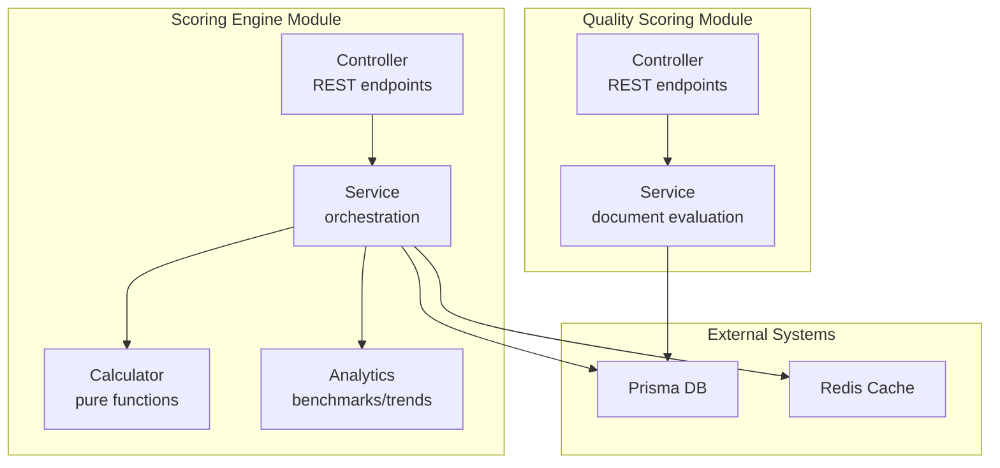
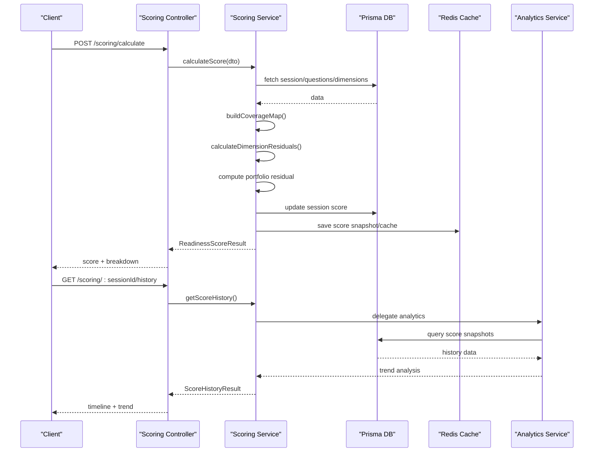
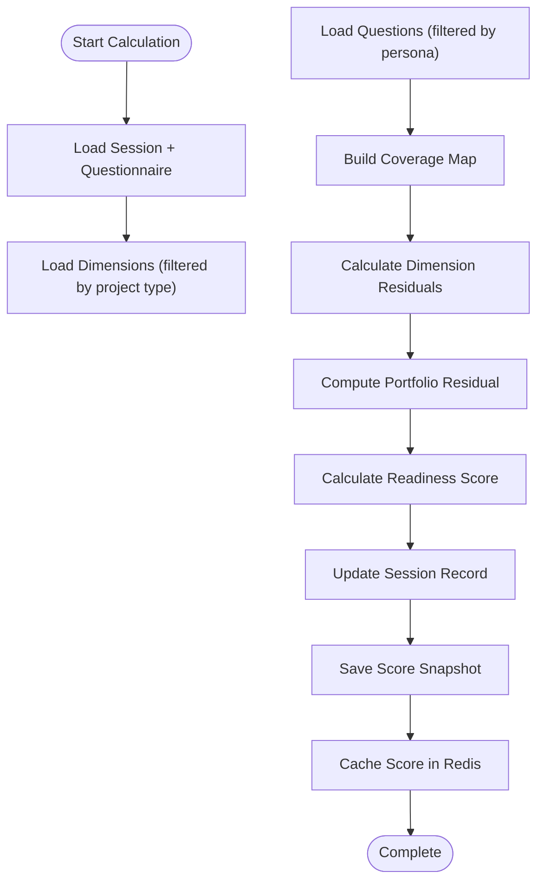
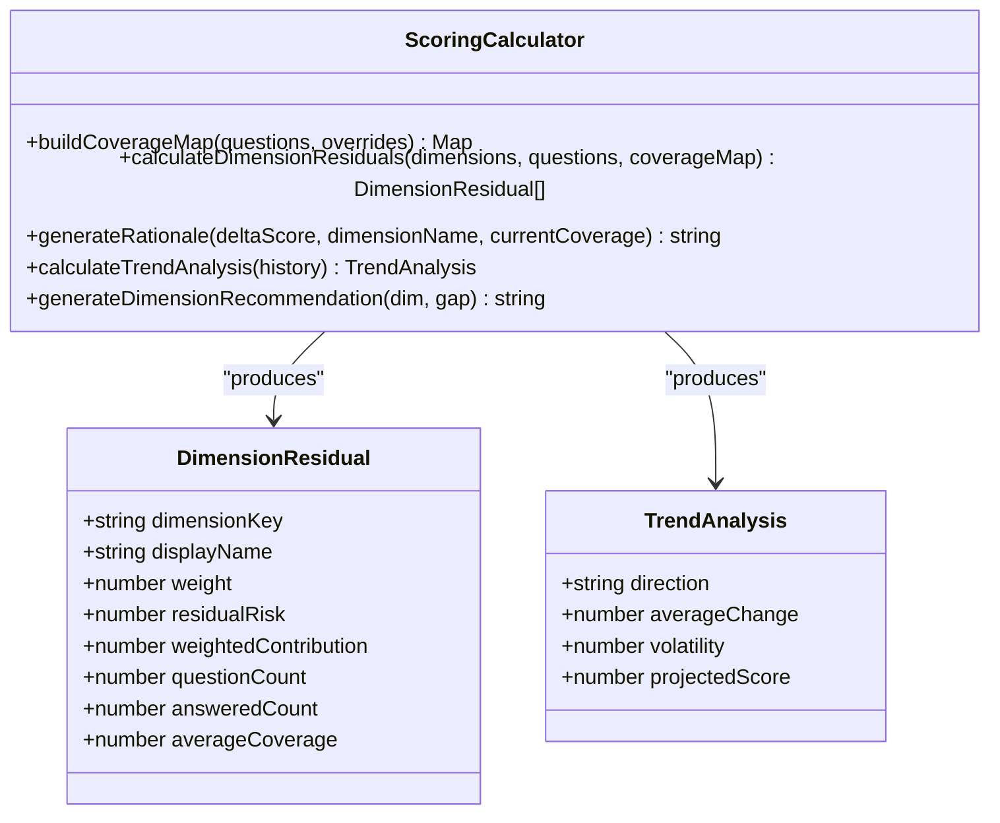
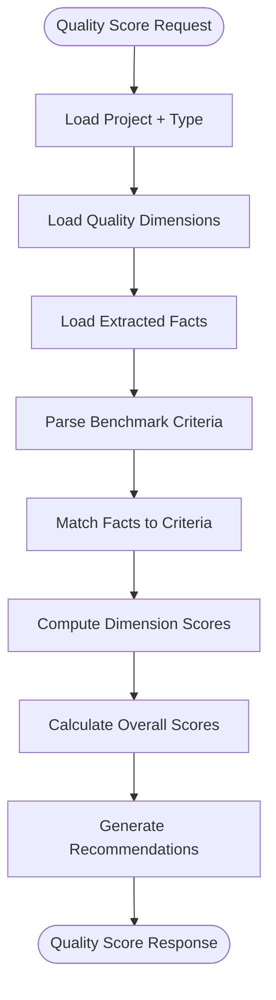
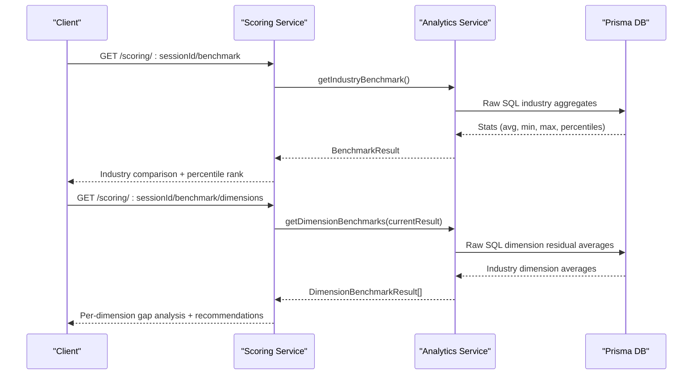
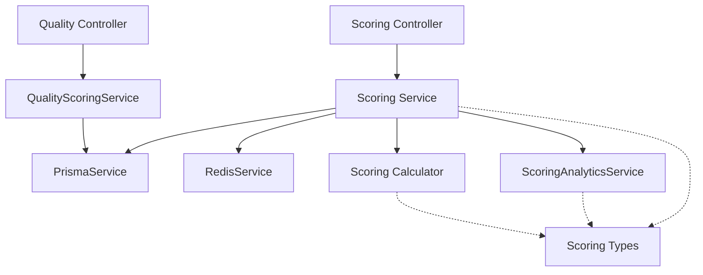

# Intelligent Scoring Engine

<cite>
**Referenced Files in This Document**
- [scoring-engine.controller.ts](file://apps/api/src/modules/scoring-engine/scoring-engine.controller.ts)
- [scoring-engine.service.ts](file://apps/api/src/modules/scoring-engine/scoring-engine.service.ts)
- [scoring-calculator.ts](file://apps/api/src/modules/scoring-engine/scoring-calculator.ts)
- [calculate-score.dto.ts](file://apps/api/src/modules/scoring-engine/dto/calculate-score.dto.ts)
- [scoring-types.ts](file://apps/api/src/modules/scoring-engine/scoring-types.ts)
- [scoring-analytics.ts](file://apps/api/src/modules/scoring-engine/strategies/scoring-analytics.ts)
- [quality-scoring.controller.ts](file://apps/api/src/modules/quality-scoring/quality-scoring.controller.ts)
- [quality-scoring.service.ts](file://apps/api/src/modules/quality-scoring/services/quality-scoring.service.ts)
- [quality-scoring.dto.ts](file://apps/api/src/modules/quality-scoring/dto/quality-scoring.dto.ts)
- [dimensions.seed.ts](file://prisma/seeds/dimensions.seed.ts)
- [quality-dimensions.seed.ts](file://prisma/seeds/quality-dimensions.seed.ts)
</cite>

## Table of Contents
1. [Introduction](#introduction)
2. [Project Structure](#project-structure)
3. [Core Components](#core-components)
4. [Architecture Overview](#architecture-overview)
5. [Detailed Component Analysis](#detailed-component-analysis)
6. [Dependency Analysis](#dependency-analysis)
7. [Performance Considerations](#performance-considerations)
8. [Troubleshooting Guide](#troubleshooting-guide)
9. [Conclusion](#conclusion)
10. [Appendices](#appendices)

## Introduction
The Intelligent Scoring Engine calculates organizational readiness across seven technical dimensions: governance, security, operations, technical debt, quality, compliance, and business. It transforms questionnaire responses into actionable insights using mathematically grounded formulas for coverage, residual risk, and portfolio scoring. The engine also powers quality scoring for document review and validation, and provides analytics and reporting for continuous improvement tracking.

## Project Structure
The scoring engine is implemented as a NestJS module with clear separation of concerns:
- Controller layer exposes REST endpoints for scoring, next questions, caching, and analytics
- Service layer orchestrates data retrieval, calculation delegation, persistence, and caching
- Calculator utilities encapsulate pure mathematical functions
- Analytics strategies compute benchmarks and trends
- Quality scoring module evaluates document completeness and confidence

**Diagram sources**
- [scoring-engine.controller.ts:46-267](file://apps/api/src/modules/scoring-engine/scoring-engine.controller.ts#L46-L267)
- [scoring-engine.service.ts:54-386](file://apps/api/src/modules/scoring-engine/scoring-engine.service.ts#L54-L386)
- [quality-scoring.controller.ts:19-182](file://apps/api/src/modules/quality-scoring/quality-scoring.controller.ts#L19-L182)

**Section sources**
- [scoring-engine.controller.ts:1-268](file://apps/api/src/modules/scoring-engine/scoring-engine.controller.ts#L1-L268)
- [quality-scoring.controller.ts:1-183](file://apps/api/src/modules/quality-scoring/quality-scoring.controller.ts#L1-L183)

## Core Components
The engine consists of three primary calculation subsystems:

### 1) Risk-Weighted Readiness Scoring
- Coverage calculations per question using a 5-level discrete scale (NONE, PARTIAL, HALF, SUBSTANTIAL, FULL)
- Dimension residual risk: R_d = Σ(S_i × (1-C_i)) / (Σ S_i + ε)
- Portfolio residual risk: R = Σ(W_d × R_d)
- Readiness Score: Score = 100 × (1 - R)

### 2) Next Questions Selection (NQS)
- Expected score lift: ΔScore_i = 100 × W_d(i) × S_i × (1 - C_i) / (Σ S_j + ε)
- Rationale generation for prioritization

### 3) Quality Scoring for Documents
- Completeness: ratio of matched criteria across dimensions
- Confidence: weighted average of extracted fact confidences
- Dimension scores: weighted confidence of met criteria

**Section sources**
- [scoring-engine.controller.ts:49-101](file://apps/api/src/modules/scoring-engine/scoring-engine.controller.ts#L49-L101)
- [scoring-engine.service.ts:66-164](file://apps/api/src/modules/scoring-engine/scoring-engine.service.ts#L66-L164)
- [scoring-calculator.ts:63-130](file://apps/api/src/modules/scoring-engine/scoring-calculator.ts#L63-L130)
- [quality-scoring.service.ts:33-94](file://apps/api/src/modules/quality-scoring/services/quality-scoring.service.ts#L33-L94)

## Architecture Overview
The engine follows a layered architecture with clear separation between orchestration, calculation, and persistence:

**Diagram sources**
- [scoring-engine.controller.ts:80-190](file://apps/api/src/modules/scoring-engine/scoring-engine.controller.ts#L80-L190)
- [scoring-engine.service.ts:70-164](file://apps/api/src/modules/scoring-engine/scoring-engine.service.ts#L70-L164)
- [scoring-analytics.ts:24-67](file://apps/api/src/modules/scoring-engine/strategies/scoring-analytics.ts#L24-L67)

## Detailed Component Analysis

### Scoring Engine Controller
The controller exposes REST endpoints for:
- Calculating readiness scores with detailed breakdowns
- Getting next priority questions with expected score lifts
- Managing score cache invalidation
- Retrieving score history for trend analysis
- Industry benchmark comparisons and dimension benchmarks

Key formulas documented in endpoint descriptions:
- Coverage per question: C_i ∈ [0,1]
- Dimension residual: R_d = Σ(S_i × (1-C_i)) / (Σ S_i + ε)
- Portfolio residual: R = Σ(W_d × R_d)
- Readiness Score: Score = 100 × (1 - R)

**Section sources**
- [scoring-engine.controller.ts:49-267](file://apps/api/src/modules/scoring-engine/scoring-engine.controller.ts#L49-L267)

### Scoring Engine Service
The service orchestrates the scoring workflow:
- Validates session existence and loads associated questionnaire and dimensions
- Builds coverage maps from discrete coverage levels or decimal values
- Computes dimension residuals and portfolio residual
- Updates session records and persists score snapshots
- Manages Redis caching with TTL configuration
- Calculates trends (UP/DOWN/STABLE/FIRST) based on score deltas
- Provides batch calculation support with controlled concurrency

**Diagram sources**
- [scoring-engine.service.ts:70-164](file://apps/api/src/modules/scoring-engine/scoring-engine.service.ts#L70-L164)

**Section sources**
- [scoring-engine.service.ts:54-386](file://apps/api/src/modules/scoring-engine/scoring-engine.service.ts#L54-L386)

### Scoring Calculator Utilities
Pure calculation functions ensure deterministic results:
- Coverage map construction with override support
- Dimension residual computation with severity normalization
- Trend analysis from historical snapshots
- Human-readable rationale generation for prioritization
- Recommendation generation for dimension improvement

**Diagram sources**
- [scoring-calculator.ts:24-187](file://apps/api/src/modules/scoring-engine/scoring-calculator.ts#L24-L187)
- [calculate-score.dto.ts:120-155](file://apps/api/src/modules/scoring-engine/dto/calculate-score.dto.ts#L120-L155)

**Section sources**
- [scoring-calculator.ts:1-208](file://apps/api/src/modules/scoring-engine/scoring-calculator.ts#L1-L208)

### Quality Scoring System
The quality scoring module evaluates document completeness and confidence:
- Parses benchmark criteria from JSON configuration
- Matches extracted facts to criteria using exact, partial, and keyword-based strategies
- Computes dimension scores as weighted confidence of met criteria
- Generates improvement recommendations and potential score enhancements

**Diagram sources**
- [quality-scoring.service.ts:36-94](file://apps/api/src/modules/quality-scoring/services/quality-scoring.service.ts#L36-L94)

**Section sources**
- [quality-scoring.controller.ts:27-117](file://apps/api/src/modules/quality-scoring/quality-scoring.controller.ts#L27-L117)
- [quality-scoring.service.ts:27-339](file://apps/api/src/modules/quality-scoring/services/quality-scoring.service.ts#L27-L339)

### Analytics and Reporting
The analytics service provides:
- Score history with trend analysis (direction, average change, volatility, projection)
- Industry benchmark comparisons (averages, percentiles, percentile ranks)
- Dimension-level benchmarking with gap analysis
- Performance categorization (Leading, Above Average, Average, Below Average, Lagging)

**Diagram sources**
- [scoring-analytics.ts:73-165](file://apps/api/src/modules/scoring-engine/strategies/scoring-analytics.ts#L73-L165)
- [scoring-analytics.ts:171-240](file://apps/api/src/modules/scoring-engine/strategies/scoring-analytics.ts#L171-L240)

**Section sources**
- [scoring-analytics.ts:1-268](file://apps/api/src/modules/scoring-engine/strategies/scoring-analytics.ts#L1-L268)

## Dependency Analysis
The engine maintains loose coupling through clear interfaces and dependency injection:

**Diagram sources**
- [scoring-engine.service.ts:59-64](file://apps/api/src/modules/scoring-engine/scoring-engine.service.ts#L59-L64)
- [quality-scoring.controller.ts:22-25](file://apps/api/src/modules/quality-scoring/quality-scoring.controller.ts#L22-L25)

**Section sources**
- [scoring-engine.service.ts:13-64](file://apps/api/src/modules/scoring-engine/scoring-engine.service.ts#L13-L64)
- [quality-scoring.service.ts:28-31](file://apps/api/src/modules/quality-scoring/services/quality-scoring.service.ts#L28-L31)

## Performance Considerations
- **Caching**: Scores are cached in Redis with 5-minute TTL to reduce database load
- **Batch Processing**: Batch calculations use controlled concurrency (batch size 5) to prevent overload
- **Database Queries**: Parameterized queries and appropriate indexing on frequently accessed fields
- **Memory Management**: Stateless calculator functions minimize memory footprint
- **Network Efficiency**: Combined queries for analytics reduce round trips

## Troubleshooting Guide
Common issues and resolutions:

### Score Calculation Failures
- Verify session exists and questionnaire is properly linked
- Check dimension weights and question severities are configured
- Ensure coverage overrides use valid question IDs

### Cache Issues
- Clear cache using the invalidate endpoint
- Monitor Redis connectivity and TTL settings
- Check for serialization errors in cached data

### Analytics Discrepancies
- Confirm industry metadata is set on questionnaires
- Verify completed sessions are properly marked
- Check dimension keys match between sessions and benchmarks

**Section sources**
- [scoring-engine.controller.ts:137-157](file://apps/api/src/modules/scoring-engine/scoring-engine.controller.ts#L137-L157)
- [scoring-engine.service.ts:290-298](file://apps/api/src/modules/scoring-engine/scoring-engine.service.ts#L290-L298)

## Conclusion
The Intelligent Scoring Engine provides a robust, mathematically sound framework for measuring organizational readiness across seven critical dimensions. Its modular architecture enables scalability, maintainability, and extensibility while delivering actionable insights through comprehensive analytics and reporting capabilities.

## Appendices

### Mathematical Formulas Reference
- **Coverage**: C_i ∈ [0,1] with 5-level discrete scale (NONE=0.0, PARTIAL=0.25, HALF=0.5, SUBSTANTIAL=0.75, FULL=1.0)
- **Dimension Residual**: R_d = Σ(S_i × (1-C_i)) / (Σ S_i + ε)
- **Portfolio Residual**: R = Σ(W_d × R_d)
- **Readiness Score**: Score = 100 × (1 - R)
- **NQS Expected Lift**: ΔScore_i = 100 × W_d(i) × S_i × (1 - C_i) / (Σ S_j + ε)

### Threshold Configurations
- **Trend Classification**: ±0.5 point thresholds for UP/DOWN vs STABLE
- **Performance Categories**: Based on percentile thresholds (75th, 50th, 25th percentiles)
- **Coverage Levels**: Nearest-neighbor rounding to 0.25 increments

### Example Calculation Workflow
1. Build coverage map from responses (prefer discrete levels)
2. Calculate dimension residuals using severity-weighted residual formula
3. Compute portfolio residual as weighted sum
4. Derive readiness score from portfolio residual
5. Generate trend analysis from score history
6. Compare against industry benchmarks for context

**Section sources**
- [scoring-types.ts:8-52](file://apps/api/src/modules/scoring-engine/scoring-types.ts#L8-L52)
- [scoring-engine.controller.ts:52-68](file://apps/api/src/modules/scoring-engine/scoring-engine.controller.ts#L52-L68)