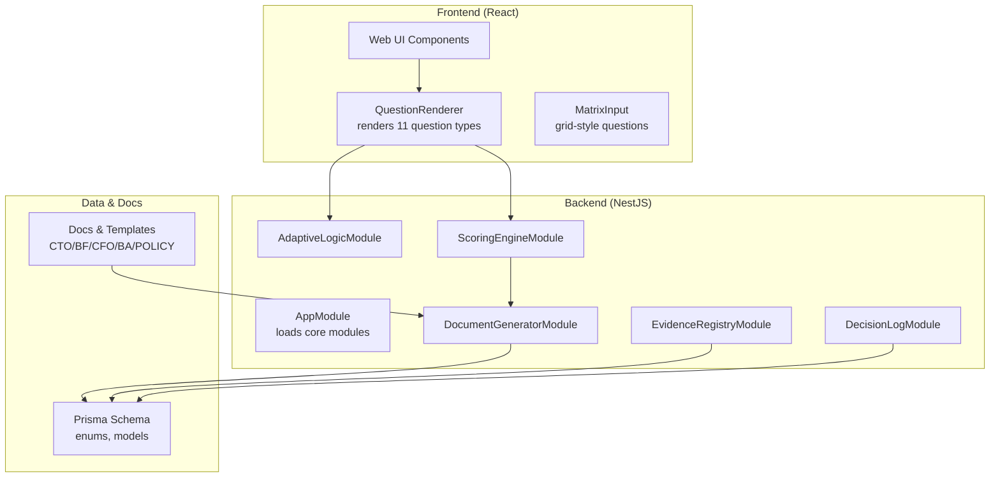
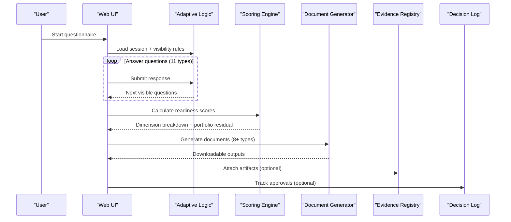
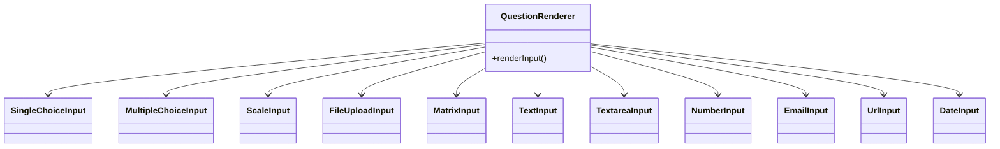
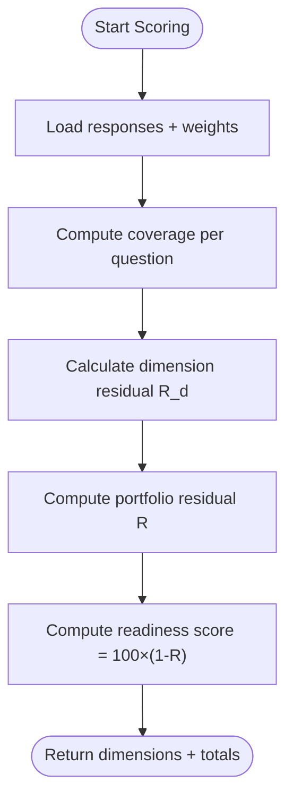
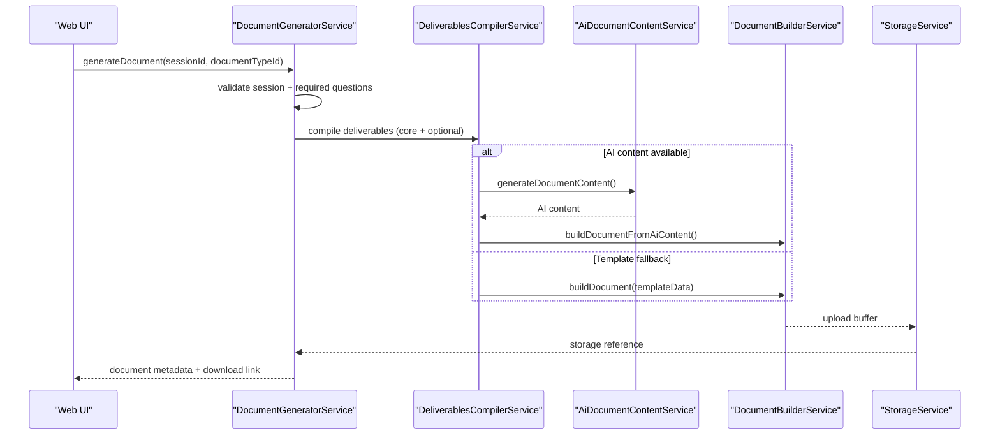
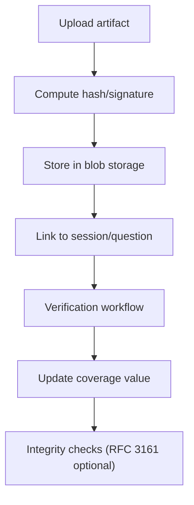
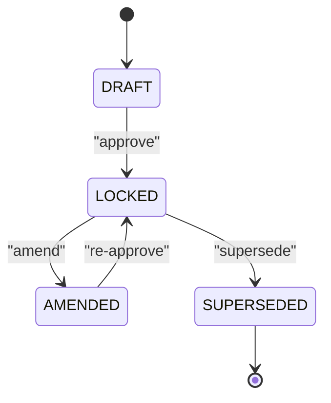
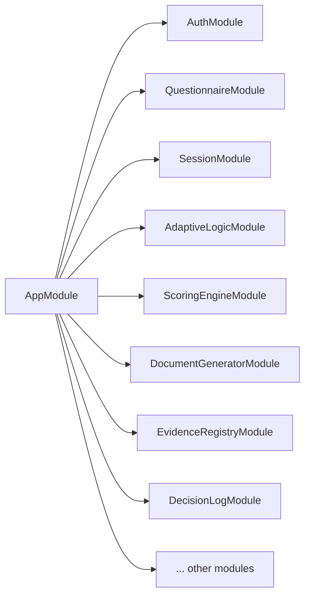

# Key Features Showcase

<cite>
**Referenced Files in This Document**
- [app.module.ts](file://apps/api/src/app.module.ts)
- [main.ts](file://apps/api/src/main.ts)
- [adaptive-logic.module.ts](file://apps/api/src/modules/adaptive-logic/adaptive-logic.module.ts)
- [scoring-engine.module.ts](file://apps/api/src/modules/scoring-engine/scoring-engine.module.ts)
- [document-generator.module.ts](file://apps/api/src/modules/document-generator/document-generator.module.ts)
- [evidence-registry.module.ts](file://apps/api/src/modules/evidence-registry/evidence-registry.module.ts)
- [decision-log.module.ts](file://apps/api/src/modules/decision-log/decision-log.module.ts)
- [QuestionRenderer.tsx](file://apps/web/src/components/questionnaire/QuestionRenderer.tsx)
- [MatrixInput.tsx](file://apps/web/src/components/questionnaire/MatrixInput.tsx)
- [index.ts](file://apps/web/src/components/questionnaire/index.ts)
- [Tooltips.tsx](file://apps/web/src/components/ux/Tooltips.tsx)
- [calculate-score.dto.ts](file://apps/api/src/modules/scoring-engine/dto/calculate-score.dto.ts)
- [document-generator.service.ts](file://apps/api/src/modules/document-generator/services/document-generator.service.ts)
- [deliverables-compiler.service.ts](file://apps/api/src/modules/document-generator/services/deliverables-compiler.service.ts)
- [technical.builder.ts](file://apps/api/src/modules/document-generator/services/section-builders/technical.builder.ts)
- [technical-debt-register.template.ts](file://apps/api/src/modules/document-generator/templates/technical-debt-register.template.ts)
- [schema.prisma](file://prisma/schema.prisma)
- [question-bank.md](file://docs/questionnaire/question-bank.md)
- [fixtures.ts](file://e2e/fixtures.ts)
- [complete-flow.e2e.test.ts](file://e2e/questionnaire/complete-flow.e2e.test.ts)
- [ENHANCED-E2E-TESTING-PROTOCOL.md](file://docs/ENHANCED-E2E-TESTING-PROTOCOL.md)
- [07-business-case.md](file://docs/ba/07-business-case.md)
</cite>

## Table of Contents
1. [Introduction](#introduction)
2. [Project Structure](#project-structure)
3. [Core Components](#core-components)
4. [Architecture Overview](#architecture-overview)
5. [Detailed Component Analysis](#detailed-component-analysis)
6. [Dependency Analysis](#dependency-analysis)
7. [Performance Considerations](#performance-considerations)
8. [Troubleshooting Guide](#troubleshooting-guide)
9. [Conclusion](#conclusion)
10. [Appendices](#appendices)

## Introduction
This document showcases Quiz-to-Build’s key features designed to deliver comprehensive assessment and documentation solutions. It focuses on:
- An adaptive questionnaire system with 11 question types including multiple choice, matrix, file upload, and specialized inputs
- An intelligent scoring engine calculating readiness scores across 7 technical dimensions
- An automated document generation system producing 8+ professional document types
- An evidence registry for collecting and managing compliance artifacts
- A decision log for tracking approvals and governance workflows
- Interactive examples and end-to-end flows demonstrating each feature in action
- Use case scenarios showing how these features integrate to produce complete assessment solutions

## Project Structure
Quiz-to-Build is organized as a modular NestJS backend with a React/TypeScript frontend and a comprehensive documentation and testing ecosystem. The backend exposes REST endpoints and integrates with AI providers, while the frontend provides guided experiences for questionnaires, scoring, and document generation.

**Diagram sources**
- [app.module.ts:53-116](file://apps/api/src/app.module.ts#L53-L116)
- [adaptive-logic.module.ts:6-11](file://apps/api/src/modules/adaptive-logic/adaptive-logic.module.ts#L6-L11)
- [scoring-engine.module.ts:16-22](file://apps/api/src/modules/scoring-engine/scoring-engine.module.ts#L16-L22)
- [document-generator.module.ts:19-46](file://apps/api/src/modules/document-generator/document-generator.module.ts#L19-L46)
- [evidence-registry.module.ts:20-26](file://apps/api/src/modules/evidence-registry/evidence-registry.module.ts#L20-L26)
- [decision-log.module.ts:18-24](file://apps/api/src/modules/decision-log/decision-log.module.ts#L18-L24)
- [QuestionRenderer.tsx:30-158](file://apps/web/src/components/questionnaire/QuestionRenderer.tsx#L30-L158)
- [MatrixInput.tsx:9-69](file://apps/web/src/components/questionnaire/MatrixInput.tsx#L9-L69)
- [schema.prisma:25-148](file://prisma/schema.prisma#L25-L148)

**Section sources**
- [app.module.ts:53-116](file://apps/api/src/app.module.ts#L53-L116)
- [main.ts:214-298](file://apps/api/src/main.ts#L214-L298)

## Core Components
- Adaptive Questionnaire System: Renders 11 question types dynamically, supports visibility rules, weights, and output mappings.
- Intelligent Scoring Engine: Computes readiness scores across 7 technical dimensions using risk-weighted formulas.
- Automated Document Generation: Produces 8+ professional documents (e.g., Architecture Dossier, Business Plan, Policy Pack).
- Evidence Registry: Manages compliance artifacts with integrity checks and verification workflows.
- Decision Log: Maintains an append-only forensic record of approvals and governance actions.

**Section sources**
- [QuestionRenderer.tsx:30-158](file://apps/web/src/components/questionnaire/QuestionRenderer.tsx#L30-L158)
- [calculate-score.dto.ts:160-188](file://apps/api/src/modules/scoring-engine/dto/calculate-score.dto.ts#L160-L188)
- [document-generator.service.ts:37-136](file://apps/api/src/modules/document-generator/services/document-generator.service.ts#L37-L136)
- [evidence-registry.module.ts:8-19](file://apps/api/src/modules/evidence-registry/evidence-registry.module.ts#L8-L19)
- [decision-log.module.ts:8-17](file://apps/api/src/modules/decision-log/decision-log.module.ts#L8-L17)

## Architecture Overview
The system integrates frontend UI components with backend modules through strongly typed DTOs and Prisma models. The adaptive logic determines visible questions, responses feed the scoring engine, and the scoring results trigger document generation and evidence/decision workflows.

**Diagram sources**
- [adaptive-logic.module.ts:6-11](file://apps/api/src/modules/adaptive-logic/adaptive-logic.module.ts#L6-L11)
- [scoring-engine.module.ts:16-22](file://apps/api/src/modules/scoring-engine/scoring-engine.module.ts#L16-L22)
- [document-generator.module.ts:19-46](file://apps/api/src/modules/document-generator/document-generator.module.ts#L19-L46)
- [evidence-registry.module.ts:20-26](file://apps/api/src/modules/evidence-registry/evidence-registry.module.ts#L20-L26)
- [decision-log.module.ts:18-24](file://apps/api/src/modules/decision-log/decision-log.module.ts#L18-L24)

## Detailed Component Analysis

### Adaptive Questionnaire System
- Question types supported: TEXT, TEXTAREA, NUMBER, EMAIL, URL, DATE, SINGLE_CHOICE, MULTIPLE_CHOICE, SCALE, FILE_UPLOAD, MATRIX.
- Frontend renderer maps question types to dedicated input components.
- Backend enforces validation and visibility rules; responses are persisted and used for scoring and document generation.

**Diagram sources**
- [QuestionRenderer.tsx:30-158](file://apps/web/src/components/questionnaire/QuestionRenderer.tsx#L30-L158)
- [MatrixInput.tsx:9-69](file://apps/web/src/components/questionnaire/MatrixInput.tsx#L9-L69)
- [index.ts:6-22](file://apps/web/src/components/questionnaire/index.ts#L6-L22)

Interactive examples and screenshots:
- Matrix grid input with radio cells for pairwise comparisons
- File upload with preview and validation
- Date pickers and number inputs with min/max constraints
- Single/multiple choice with required validation

**Section sources**
- [question-bank.md:1391-1402](file://docs/questionnaire/question-bank.md#L1391-L1402)
- [question-bank.md:2641-2691](file://docs/questionnaire/question-bank.md#L2641-L2691)
- [fixtures.ts:106-159](file://e2e/fixtures.ts#L106-L159)
- [complete-flow.e2e.test.ts:142-177](file://e2e/questionnaire/complete-flow.e2e.test.ts#L142-L177)
- [ENHANCED-E2E-TESTING-PROTOCOL.md:417-479](file://docs/ENHANCED-E2E-TESTING-PROTOCOL.md#L417-L479)

### Intelligent Scoring Engine
- Calculates dimension residuals, portfolio residual risk, and overall readiness score.
- Uses weights and coverage per dimension to compute risk-adjusted scores.
- Exposes DTOs for dimension breakdown and totals.

**Diagram sources**
- [calculate-score.dto.ts:160-188](file://apps/api/src/modules/scoring-engine/dto/calculate-score.dto.ts#L160-L188)
- [scoring-engine.module.ts:10-15](file://apps/api/src/modules/scoring-engine/scoring-engine.module.ts#L10-L15)

Dimensions overview:
- Technical Architecture, Security Posture, Compliance, Operations, Documentation, Data Management, Team Capability, Process Maturity, and others as defined in tooltips.

**Section sources**
- [calculate-score.dto.ts:134-188](file://apps/api/src/modules/scoring-engine/dto/calculate-score.dto.ts#L134-L188)
- [Tooltips.tsx:428-466](file://apps/web/src/components/ux/Tooltips.tsx#L428-L466)

### Automated Document Generation System
- Generates 8+ professional documents including Architecture Dossier, SDLC Playbook, Test Strategy, DevSecOps, Privacy, Observability, Finance, and optional Policy Pack, Decision Log, and Readiness Report.
- Supports AI-powered content generation with fallback to template-based assembly.
- Stores outputs and tracks status with required question validation.

**Diagram sources**
- [document-generator.service.ts:37-200](file://apps/api/src/modules/document-generator/services/document-generator.service.ts#L37-L200)
- [deliverables-compiler.service.ts:78-116](file://apps/api/src/modules/document-generator/services/deliverables-compiler.service.ts#L78-L116)
- [technical.builder.ts:14-54](file://apps/api/src/modules/document-generator/services/section-builders/technical.builder.ts#L14-L54)

Document types and categories:
- CTO: Architecture Dossier, SDLC Playbook, Test Strategy, DevSecOps, Technical Debt Register
- CFO: Business Plan, Finance Documents
- BA: Business Case, Functional Requirements
- POLICY: Policy Pack, Decision Log, Readiness Report

**Section sources**
- [document-generator.module.ts:19-46](file://apps/api/src/modules/document-generator/document-generator.module.ts#L19-L46)
- [technical-debt-register.template.ts:1-62](file://apps/api/src/modules/document-generator/templates/technical-debt-register.template.ts#L1-L62)
- [07-business-case.md:521-552](file://docs/ba/07-business-case.md#L521-L552)

### Evidence Registry
- Collects and manages compliance artifacts with integrity checks.
- Supports verification workflow, coverage updates, and linking to sessions/questions.
- Integrates with CI artifact ingestion and storage.

**Diagram sources**
- [evidence-registry.module.ts:8-19](file://apps/api/src/modules/evidence-registry/evidence-registry.module.ts#L8-L19)
- [schema.prisma:91-121](file://prisma/schema.prisma#L91-L121)

**Section sources**
- [evidence-registry.module.ts:20-26](file://apps/api/src/modules/evidence-registry/evidence-registry.module.ts#L20-L26)
- [schema.prisma:651-674](file://prisma/schema.prisma#L651-L674)

### Decision Log
- Append-only forensic record of decisions with status workflow (DRAFT → LOCKED → AMENDED/SUPERSEDED).
- Enforces two-person rule via approval workflow and supports audit exports.

**Diagram sources**
- [decision-log.module.ts:8-17](file://apps/api/src/modules/decision-log/decision-log.module.ts#L8-L17)
- [schema.prisma:104-111](file://prisma/schema.prisma#L104-L111)

**Section sources**
- [decision-log.module.ts:18-24](file://apps/api/src/modules/decision-log/decision-log.module.ts#L18-L24)
- [schema.prisma:676-681](file://prisma/schema.prisma#L676-L681)

## Dependency Analysis
The backend module graph shows how features are composed and exported. The main application conditionally loads legacy modules behind a feature flag.

**Diagram sources**
- [app.module.ts:53-116](file://apps/api/src/app.module.ts#L53-L116)

**Section sources**
- [app.module.ts:36-51](file://apps/api/src/app.module.ts#L36-L51)

## Performance Considerations
- HTTP compression is selectively applied to avoid impacting streaming endpoints.
- Helmet and CSP harden the API surface; permissions policy restricts browser features.
- Validation pipe and global interceptors ensure robust request handling.
- Redis and caching modules are integrated for performance-sensitive operations.

**Section sources**
- [main.ts:43-67](file://apps/api/src/main.ts#L43-L67)
- [main.ts:68-123](file://apps/api/src/main.ts#L68-L123)
- [main.ts:125-168](file://apps/api/src/main.ts#L125-L168)
- [scoring-engine.module.ts:17-21](file://apps/api/src/modules/scoring-engine/scoring-engine.module.ts#L17-L21)

## Troubleshooting Guide
- API documentation: Swagger UI is gated by an environment variable and lists tags for auth, users, questionnaires, sessions, responses, scoring, evidence, documents, admin, payment, and health.
- Bootstrap errors are captured and logged with structured logging and Sentry.
- E2E testing validates input validation per question type and end-to-end flows.

**Section sources**
- [main.ts:214-298](file://apps/api/src/main.ts#L214-L298)
- [main.ts:319-328](file://apps/api/src/main.ts#L319-L328)
- [ENHANCED-E2E-TESTING-PROTOCOL.md:417-479](file://docs/ENHANCED-E2E-TESTING-PROTOCOL.md#L417-L479)

## Conclusion
Quiz-to-Build delivers a cohesive assessment solution by combining an adaptive questionnaire, intelligent scoring, automated document generation, evidence registry, and decision log. Together, these features enable organizations to assess readiness, generate professional outputs, manage compliance artifacts, and maintain governance workflows—all from a unified platform.

## Appendices

### Use Case Scenarios
- Business Case Generation: After completing the adaptive questionnaire, the system generates a Business Plan and supporting documents tailored to the user’s inputs.
- Technical Debt Register: Responses related to architecture and security feed a Technical Debt Register with prioritization and remediation plans.
- Compliance Readiness: Evidence Registry collects artifacts and Decision Log tracks approvals to produce a Compliance Readiness Report.

**Section sources**
- [07-business-case.md:521-552](file://docs/ba/07-business-case.md#L521-L552)
- [technical-debt-register.template.ts:11-45](file://apps/api/src/modules/document-generator/templates/technical-debt-register.template.ts#L11-L45)
- [schema.prisma:91-121](file://prisma/schema.prisma#L91-L121)