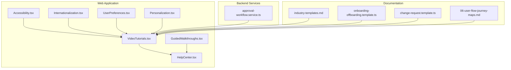
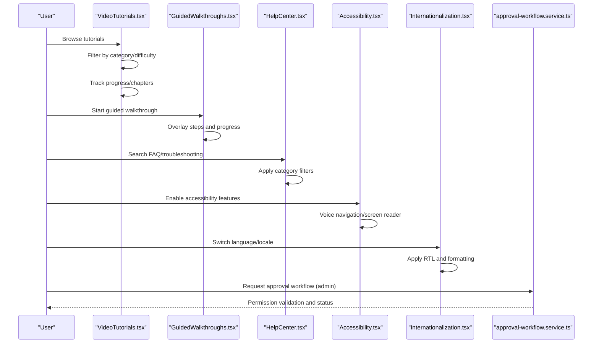
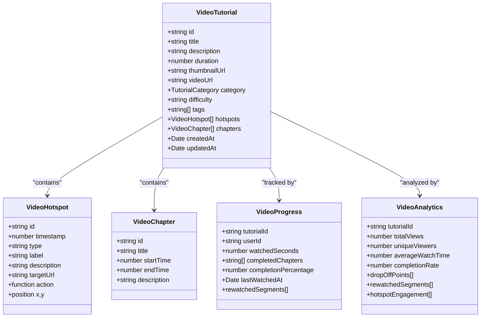
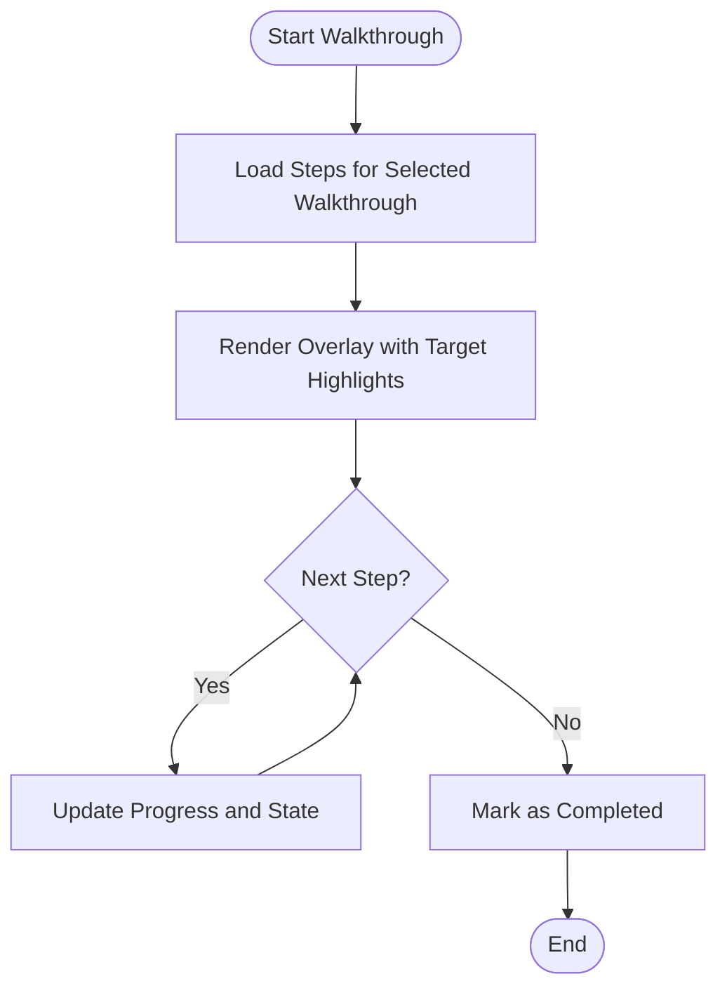
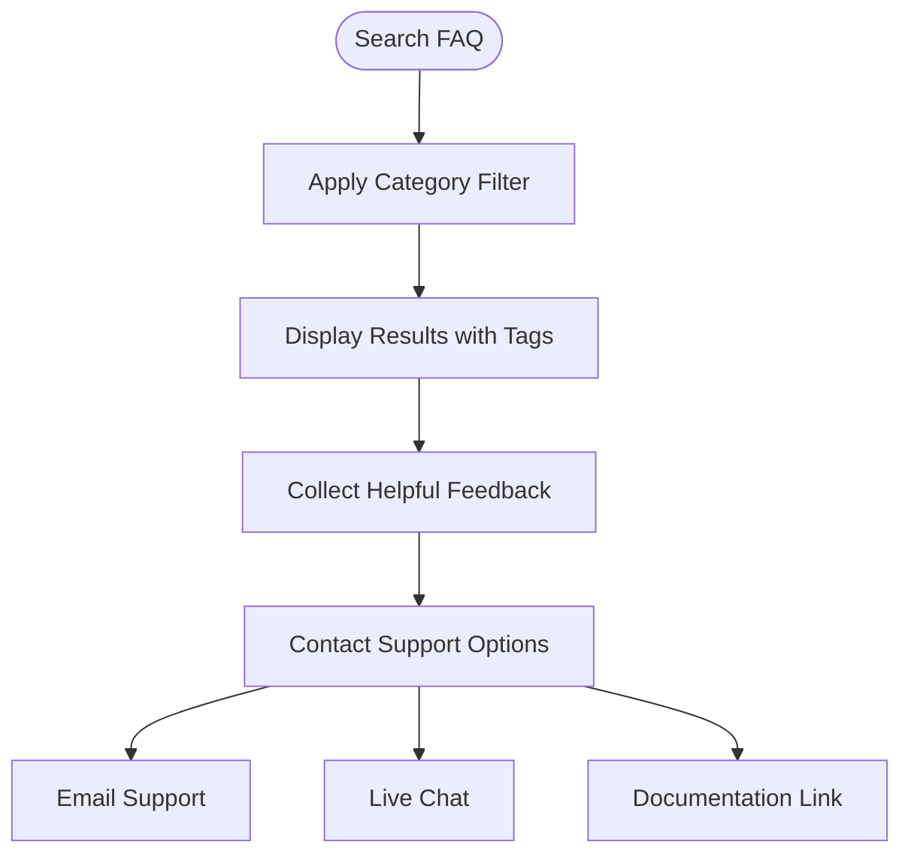
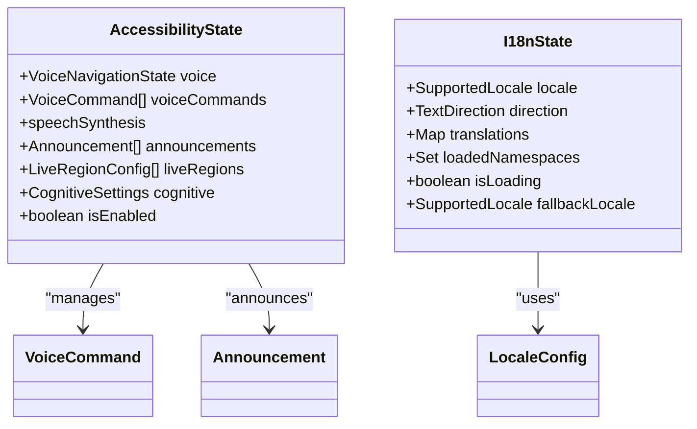
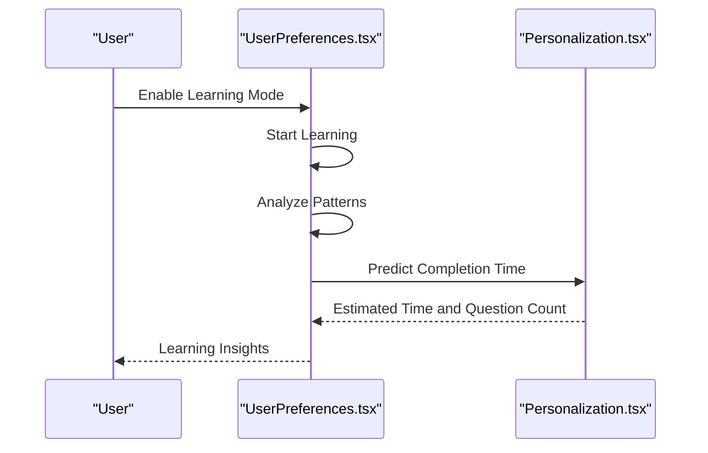
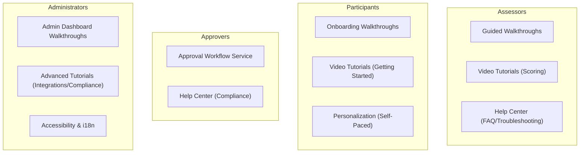
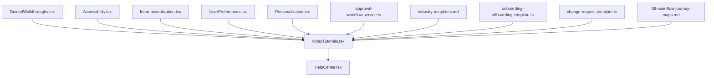

# Learning Resources

<cite>
**Referenced Files in This Document**
- [VideoTutorials.tsx](file://apps/web/src/components/tutorials/VideoTutorials.tsx)
- [GuidedWalkthroughs.tsx](file://apps/web/src/components/tutorials/GuidedWalkthroughs.tsx)
- [HelpCenter.tsx](file://apps/web/src/components/help/HelpCenter.tsx)
- [Accessibility.tsx](file://apps/web/src/components/accessibility/Accessibility.tsx)
- [Internationalization.tsx](file://apps/web/src/components/i18n/Internationalization.tsx)
- [Onboarding.tsx](file://apps/web/src/components/ux/Onboarding.tsx)
- [NielsenVerification.tsx](file://apps/web/src/components/verification/NielsenVerification.tsx)
- [UserPreferences.tsx](file://apps/web/src/components/personalization/UserPreferences.tsx)
- [Personalization.tsx](file://apps/web/src/components/personalization/Personalization.tsx)
- [approval-workflow.service.ts](file://apps/api/src/modules/decision-log/approval-workflow.service.ts)
- [approval-workflow.service.spec.ts](file://apps/api/src/modules/decision-log/approval-workflow.service.spec.ts)
- [admin-approval-workflow.flow.test.ts](file://apps/api/test/integration/admin-approval-workflow.flow.test.ts)
- [industry-templates.md](file://docs/questionnaire/industry-templates.md)
- [onboarding-offboarding.template.ts](file://apps/api/src/modules/document-generator/templates/onboarding-offboarding.template.ts)
- [change-request.template.ts](file://apps/api/src/modules/document-generator/templates/change-request.template.ts)
- [COMPLETE-BUG-TAXONOMY.md](file://docs/testing/COMPLETE-BUG-TAXONOMY.md)
- [06-user-flow-journey-maps.md](file://docs/cto/06-user-flow-journey-maps.md)
</cite>

## Table of Contents
1. [Introduction](#introduction)
2. [Project Structure](#project-structure)
3. [Core Components](#core-components)
4. [Architecture Overview](#architecture-overview)
5. [Detailed Component Analysis](#detailed-component-analysis)
6. [Dependency Analysis](#dependency-analysis)
7. [Performance Considerations](#performance-considerations)
8. [Troubleshooting Guide](#troubleshooting-guide)
9. [Conclusion](#conclusion)
10. [Appendices](#appendices)

## Introduction
This document provides comprehensive learning resources for Quiz-to-Build, covering video tutorials, guided walkthroughs, interactive demos, knowledge bases, community resources, certification pathways, feedback mechanisms, self-paced learning with completion tracking, integration resources for administrators and developers, and multilingual accessibility features. It is designed to help assessors, participants, approvers, and administrators discover and utilize learning materials effectively.

## Project Structure
Learning resources are implemented as React components within the web application and complemented by backend services and documentation:

- Frontend learning modules:
  - Video tutorials with interactive playback, chapters, and progress tracking
  - Guided walkthroughs with overlays and step-by-step guidance
  - Help center with searchable FAQs and troubleshooting
  - Accessibility and internationalization systems for inclusive learning
- Backend services:
  - Approval workflow for administrative learning paths
  - Document generation templates for onboarding/offboarding and training
- Documentation:
  - Industry templates and journey maps for structured learning
  - Testing taxonomy for i18n and accessibility validation

**Diagram sources**
- [VideoTutorials.tsx:1-1025](file://apps/web/src/components/tutorials/VideoTutorials.tsx#L1-L1025)
- [GuidedWalkthroughs.tsx:1-1157](file://apps/web/src/components/tutorials/GuidedWalkthroughs.tsx#L1-L1157)
- [HelpCenter.tsx:1-888](file://apps/web/src/components/help/HelpCenter.tsx#L1-L888)
- [Accessibility.tsx:1-1067](file://apps/web/src/components/accessibility/Accessibility.tsx#L1-L1067)
- [Internationalization.tsx:1-970](file://apps/web/src/components/i18n/Internationalization.tsx#L1-L970)
- [UserPreferences.tsx:749-793](file://apps/web/src/components/personalization/UserPreferences.tsx#L749-L793)
- [Personalization.tsx:1334-1368](file://apps/web/src/components/personalization/Personalization.tsx#L1334-L1368)
- [approval-workflow.service.ts:159-463](file://apps/api/src/modules/decision-log/approval-workflow.service.ts#L159-L463)
- [industry-templates.md:1564-2024](file://docs/questionnaire/industry-templates.md#L1564-L2024)
- [onboarding-offboarding.template.ts:63-137](file://apps/api/src/modules/document-generator/templates/onboarding-offboarding.template.ts#L63-L137)
- [change-request.template.ts:326-357](file://apps/api/src/modules/document-generator/templates/change-request.template.ts#L326-L357)
- [06-user-flow-journey-maps.md:946-957](file://docs/cto/06-user-flow-journey-maps.md#L946-L957)

**Section sources**
- [VideoTutorials.tsx:1-1025](file://apps/web/src/components/tutorials/VideoTutorials.tsx#L1-L1025)
- [GuidedWalkthroughs.tsx:1-1157](file://apps/web/src/components/tutorials/GuidedWalkthroughs.tsx#L1-L1157)
- [HelpCenter.tsx:1-888](file://apps/web/src/components/help/HelpCenter.tsx#L1-L888)
- [Accessibility.tsx:1-1067](file://apps/web/src/components/accessibility/Accessibility.tsx#L1-L1067)
- [Internationalization.tsx:1-970](file://apps/web/src/components/i18n/Internationalization.tsx#L1-L970)
- [approval-workflow.service.ts:159-463](file://apps/api/src/modules/decision-log/approval-workflow.service.ts#L159-L463)
- [industry-templates.md:1564-2024](file://docs/questionnaire/industry-templates.md#L1564-L2024)
- [onboarding-offboarding.template.ts:63-137](file://apps/api/src/modules/document-generator/templates/onboarding-offboarding.template.ts#L63-L137)
- [change-request.template.ts:326-357](file://apps/api/src/modules/document-generator/templates/change-request.template.ts#L326-L357)
- [06-user-flow-journey-maps.md:946-957](file://docs/cto/06-user-flow-journey-maps.md#L946-L957)

## Core Components
This section outlines the primary learning resource components and their capabilities:

- Video tutorials
  - Interactive playback with chapters, hotspots, and progress tracking
  - Categorized content for getting started, questionnaires, scoring, documents, admin, billing, integrations, and advanced topics
  - Difficulty filtering and search functionality
- Guided walkthroughs
  - Step-by-step overlays highlighting UI elements
  - Navigation aids and progress indicators
  - Completion tracking and skip functionality
- Help center
  - Searchable FAQ categorized by getting started, questionnaires, billing, troubleshooting, security, and integrations
  - Feedback mechanism for article helpfulness
  - Contact support options (email, live chat, documentation)
- Accessibility and internationalization
  - Voice navigation, speech synthesis, and screen reader announcements
  - Cognitive accessibility modes (dyslexia-friendly, focus mode, reading mode)
  - Multi-language support with RTL layout and locale-specific formatting
- Personalization and user preferences
  - Learning mode activation and pattern analysis
  - Completion time prediction for questionnaires

**Section sources**
- [VideoTutorials.tsx:27-320](file://apps/web/src/components/tutorials/VideoTutorials.tsx#L27-L320)
- [GuidedWalkthroughs.tsx:19-370](file://apps/web/src/components/tutorials/GuidedWalkthroughs.tsx#L19-L370)
- [HelpCenter.tsx:19-491](file://apps/web/src/components/help/HelpCenter.tsx#L19-L491)
- [Accessibility.tsx:33-117](file://apps/web/src/components/accessibility/Accessibility.tsx#L33-L117)
- [Internationalization.tsx:25-91](file://apps/web/src/components/i18n/Internationalization.tsx#L25-L91)
- [UserPreferences.tsx:749-793](file://apps/web/src/components/personalization/UserPreferences.tsx#L749-L793)
- [Personalization.tsx:1334-1368](file://apps/web/src/components/personalization/Personalization.tsx#L1334-L1368)

## Architecture Overview
The learning resources architecture integrates frontend components with backend services and documentation to provide a cohesive learning experience:

**Diagram sources**
- [VideoTutorials.tsx:326-531](file://apps/web/src/components/tutorials/VideoTutorials.tsx#L326-L531)
- [GuidedWalkthroughs.tsx:376-588](file://apps/web/src/components/tutorials/GuidedWalkthroughs.tsx#L376-L588)
- [HelpCenter.tsx:747-887](file://apps/web/src/components/help/HelpCenter.tsx#L747-L887)
- [Accessibility.tsx:326-710](file://apps/web/src/components/accessibility/Accessibility.tsx#L326-L710)
- [Internationalization.tsx:531-781](file://apps/web/src/components/i18n/Internationalization.tsx#L531-L781)
- [approval-workflow.service.ts:172-463](file://apps/api/src/modules/decision-log/approval-workflow.service.ts#L172-L463)

## Detailed Component Analysis

### Video Tutorials
Interactive video tutorials provide structured learning with chapters, hotspots, and progress tracking. Users can filter by category and difficulty, search content, and receive recommendations based on incomplete tutorials.

**Diagram sources**
- [VideoTutorials.tsx:27-91](file://apps/web/src/components/tutorials/VideoTutorials.tsx#L27-L91)

**Section sources**
- [VideoTutorials.tsx:97-320](file://apps/web/src/components/tutorials/VideoTutorials.tsx#L97-L320)
- [VideoTutorials.tsx:326-531](file://apps/web/src/components/tutorials/VideoTutorials.tsx#L326-L531)
- [VideoTutorials.tsx:533-783](file://apps/web/src/components/tutorials/VideoTutorials.tsx#L533-L783)

### Guided Walkthroughs
Guided walkthroughs offer contextual, step-by-step guidance overlaid on the application UI. They support navigation, validation, and completion tracking with skip functionality.

**Diagram sources**
- [GuidedWalkthroughs.tsx:376-588](file://apps/web/src/components/tutorials/GuidedWalkthroughs.tsx#L376-L588)

**Section sources**
- [GuidedWalkthroughs.tsx:206-370](file://apps/web/src/components/tutorials/GuidedWalkthroughs.tsx#L206-L370)
- [GuidedWalkthroughs.tsx:376-588](file://apps/web/src/components/tutorials/GuidedWalkthroughs.tsx#L376-L588)

### Help Center
The help center provides a searchable FAQ organized by categories, with feedback collection and contact support options.

**Diagram sources**
- [HelpCenter.tsx:747-887](file://apps/web/src/components/help/HelpCenter.tsx#L747-L887)

**Section sources**
- [HelpCenter.tsx:48-491](file://apps/web/src/components/help/HelpCenter.tsx#L48-L491)
- [HelpCenter.tsx:747-887](file://apps/web/src/components/help/HelpCenter.tsx#L747-L887)

### Accessibility and Internationalization
Accessibility includes voice navigation, speech synthesis, screen reader announcements, and cognitive accessibility modes. Internationalization supports multiple locales, RTL layouts, and locale-specific formatting.

**Diagram sources**
- [Accessibility.tsx:97-117](file://apps/web/src/components/accessibility/Accessibility.tsx#L97-L117)
- [Internationalization.tsx:53-91](file://apps/web/src/components/i18n/Internationalization.tsx#L53-L91)

**Section sources**
- [Accessibility.tsx:19-117](file://apps/web/src/components/accessibility/Accessibility.tsx#L19-L117)
- [Internationalization.tsx:25-91](file://apps/web/src/components/i18n/Internationalization.tsx#L25-L91)

### Personalization and Self-Paced Learning
Personalization enables learning mode activation, pattern analysis, and completion time prediction to support self-paced learning.

**Diagram sources**
- [UserPreferences.tsx:771-793](file://apps/web/src/components/personalization/UserPreferences.tsx#L771-L793)
- [Personalization.tsx:1334-1368](file://apps/web/src/components/personalization/Personalization.tsx#L1334-L1368)

**Section sources**
- [UserPreferences.tsx:749-793](file://apps/web/src/components/personalization/UserPreferences.tsx#L749-L793)
- [Personalization.tsx:1334-1368](file://apps/web/src/components/personalization/Personalization.tsx#L1334-L1368)

### Role-Based Learning Paths
Structured learning paths align with user roles and responsibilities:

- Assessors
  - Use guided walkthroughs to navigate questionnaires efficiently
  - Utilize video tutorials for understanding scoring and interpretation
  - Access help center for troubleshooting and FAQs
- Participants
  - Follow onboarding walkthroughs and video tutorials for getting started
  - Use personalization features for self-paced completion
- Approvers
  - Review approval workflows and permissions via backend services
  - Use help center for policy and compliance guidance
- Administrators
  - Access admin dashboard walkthroughs and advanced tutorials
  - Leverage integrations and compliance best practices videos
  - Utilize accessibility and internationalization features for inclusive administration

**Diagram sources**
- [GuidedWalkthroughs.tsx:206-370](file://apps/web/src/components/tutorials/GuidedWalkthroughs.tsx#L206-L370)
- [VideoTutorials.tsx:97-320](file://apps/web/src/components/tutorials/VideoTutorials.tsx#L97-L320)
- [approval-workflow.service.ts:172-463](file://apps/api/src/modules/decision-log/approval-workflow.service.ts#L172-L463)
- [Accessibility.tsx:19-117](file://apps/web/src/components/accessibility/Accessibility.tsx#L19-L117)
- [Internationalization.tsx:25-91](file://apps/web/src/components/i18n/Internationalization.tsx#L25-L91)

**Section sources**
- [approval-workflow.service.ts:172-463](file://apps/api/src/modules/decision-log/approval-workflow.service.ts#L172-L463)
- [approval-workflow.service.spec.ts:949-990](file://apps/api/src/modules/decision-log/approval-workflow.service.spec.ts#L949-L990)
- [admin-approval-workflow.flow.test.ts:1-37](file://apps/api/test/integration/admin-approval-workflow.flow.test.ts#L1-L37)

### Knowledge Base and Best Practices
The knowledge base consolidates frequently asked questions, best practices, and troubleshooting guides:

- FAQ categories: Getting Started, Questionnaires, Billing, Troubleshooting, Security, Integrations
- Best practices: Compliance, evidence collection, audit preparation, continuous monitoring
- Troubleshooting: Error codes, performance issues, and step-by-step resolutions

**Section sources**
- [HelpCenter.tsx:48-491](file://apps/web/src/components/help/HelpCenter.tsx#L48-L491)
- [VideoTutorials.tsx:280-320](file://apps/web/src/components/tutorials/VideoTutorials.tsx#L280-L320)

### Community Resources
Community resources include support channels and collaborative spaces:

- Email support with subject tagging
- Live chat integration via Intercom
- Documentation portal access
- Feedback collection for FAQ helpfulness

**Section sources**
- [HelpCenter.tsx:689-735](file://apps/web/src/components/help/HelpCenter.tsx#L689-L735)

### Certification Programs and Training Materials
Training materials and certification pathways leverage structured templates and documentation:

- Onboarding/offboarding procedures with role-based access matrices
- Change request templates with training requirements
- Industry templates for sector-specific questionnaires
- Journey maps for key moments of truth in user experience

**Section sources**
- [onboarding-offboarding.template.ts:63-137](file://apps/api/src/modules/document-generator/templates/onboarding-offboarding.template.ts#L63-L137)
- [change-request.template.ts:326-357](file://apps/api/src/modules/document-generator/templates/change-request.template.ts#L326-L357)
- [industry-templates.md:1564-2024](file://docs/questionnaire/industry-templates.md#L1564-L2024)
- [06-user-flow-journey-maps.md:946-957](file://docs/cto/06-user-flow-journey-maps.md#L946-L957)

### Feedback Mechanisms
Continuous improvement is supported through:

- FAQ helpfulness feedback (yes/no buttons)
- Accessibility and internationalization testing taxonomy
- Nielsen Heuristic verification for help and documentation

**Section sources**
- [HelpCenter.tsx:655-682](file://apps/web/src/components/help/HelpCenter.tsx#L655-L682)
- [COMPLETE-BUG-TAXONOMY.md:1149-1196](file://docs/testing/COMPLETE-BUG-TAXONOMY.md#L1149-L1196)
- [NielsenVerification.tsx:356-386](file://apps/web/src/components/verification/NielsenVerification.tsx#L356-L386)

### Integration Resources for Administrators and Developers
Integration resources include:

- API and CLI integration tutorials
- GitHub integration setup
- Advanced reporting and analytics
- Compliance best practices

**Section sources**
- [VideoTutorials.tsx:280-320](file://apps/web/src/components/tutorials/VideoTutorials.tsx#L280-L320)

### Multilingual Support and Accessibility
Multilingual support encompasses:

- Supported locales: English, Spanish, French, German, Japanese, Chinese, Arabic, Hebrew
- Locale-specific formatting for dates, numbers, currencies
- RTL layout support for Arabic and Hebrew
- Accessibility features: voice navigation, screen reader announcements, cognitive accessibility modes

**Section sources**
- [Internationalization.tsx:97-194](file://apps/web/src/components/i18n/Internationalization.tsx#L97-L194)
- [Accessibility.tsx:178-194](file://apps/web/src/components/accessibility/Accessibility.tsx#L178-L194)

## Dependency Analysis
Learning resources components interact with backend services and documentation to provide a comprehensive learning ecosystem:

**Diagram sources**
- [VideoTutorials.tsx:1-1025](file://apps/web/src/components/tutorials/VideoTutorials.tsx#L1-L1025)
- [GuidedWalkthroughs.tsx:1-1157](file://apps/web/src/components/tutorials/GuidedWalkthroughs.tsx#L1-L1157)
- [HelpCenter.tsx:1-888](file://apps/web/src/components/help/HelpCenter.tsx#L1-L888)
- [Accessibility.tsx:1-1067](file://apps/web/src/components/accessibility/Accessibility.tsx#L1-L1067)
- [Internationalization.tsx:1-970](file://apps/web/src/components/i18n/Internationalization.tsx#L1-L970)
- [UserPreferences.tsx:749-793](file://apps/web/src/components/personalization/UserPreferences.tsx#L749-L793)
- [Personalization.tsx:1334-1368](file://apps/web/src/components/personalization/Personalization.tsx#L1334-L1368)
- [approval-workflow.service.ts:159-463](file://apps/api/src/modules/decision-log/approval-workflow.service.ts#L159-L463)
- [industry-templates.md:1564-2024](file://docs/questionnaire/industry-templates.md#L1564-L2024)
- [onboarding-offboarding.template.ts:63-137](file://apps/api/src/modules/document-generator/templates/onboarding-offboarding.template.ts#L63-L137)
- [change-request.template.ts:326-357](file://apps/api/src/modules/document-generator/templates/change-request.template.ts#L326-L357)
- [06-user-flow-journey-maps.md:946-957](file://docs/cto/06-user-flow-journey-maps.md#L946-L957)

**Section sources**
- [VideoTutorials.tsx:1-1025](file://apps/web/src/components/tutorials/VideoTutorials.tsx#L1-L1025)
- [GuidedWalkthroughs.tsx:1-1157](file://apps/web/src/components/tutorials/GuidedWalkthroughs.tsx#L1-L1157)
- [HelpCenter.tsx:1-888](file://apps/web/src/components/help/HelpCenter.tsx#L1-L888)
- [Accessibility.tsx:1-1067](file://apps/web/src/components/accessibility/Accessibility.tsx#L1-L1067)
- [Internationalization.tsx:1-970](file://apps/web/src/components/i18n/Internationalization.tsx#L1-L970)
- [UserPreferences.tsx:749-793](file://apps/web/src/components/personalization/UserPreferences.tsx#L749-L793)
- [Personalization.tsx:1334-1368](file://apps/web/src/components/personalization/Personalization.tsx#L1334-L1368)
- [approval-workflow.service.ts:159-463](file://apps/api/src/modules/decision-log/approval-workflow.service.ts#L159-L463)
- [industry-templates.md:1564-2024](file://docs/questionnaire/industry-templates.md#L1564-L2024)
- [onboarding-offboarding.template.ts:63-137](file://apps/api/src/modules/document-generator/templates/onboarding-offboarding.template.ts#L63-L137)
- [change-request.template.ts:326-357](file://apps/api/src/modules/document-generator/templates/change-request.template.ts#L326-L357)
- [06-user-flow-journey-maps.md:946-957](file://docs/cto/06-user-flow-journey-maps.md#L946-L957)

## Performance Considerations
- Video tutorials leverage local storage for progress persistence to minimize server requests
- Guided walkthroughs dynamically compute overlay positions to reduce layout thrashing
- Help center search uses memoized computations for efficient filtering and ranking
- Accessibility and internationalization systems apply CSS classes and DOM attributes conditionally to avoid unnecessary reflows

[No sources needed since this section provides general guidance]

## Troubleshooting Guide
Common issues and resolutions:

- Video tutorial progress not saving
  - Verify browser compatibility and localStorage availability
  - Clear browser cache and retry
- Help center search yields no results
  - Check keyword relevance and category filters
  - Reset filters to broaden search scope
- Accessibility features not functioning
  - Confirm browser support for Web Speech APIs
  - Review console errors for permission denials
- Internationalization not applying
  - Ensure locale is saved in localStorage
  - Verify document direction and language attributes are set

**Section sources**
- [HelpCenter.tsx:832-862](file://apps/web/src/components/help/HelpCenter.tsx#L832-L862)
- [Accessibility.tsx:392-441](file://apps/web/src/components/accessibility/Accessibility.tsx#L392-L441)
- [Internationalization.tsx:550-580](file://apps/web/src/components/i18n/Internationalization.tsx#L550-L580)

## Conclusion
Quiz-to-Build provides a robust, inclusive, and scalable learning ecosystem through integrated video tutorials, guided walkthroughs, a searchable help center, accessibility and internationalization features, and role-aligned learning paths. Administrators and developers can leverage backend services and documentation templates to enhance training and compliance workflows.

[No sources needed since this section summarizes without analyzing specific files]

## Appendices

### Appendix A: Learning Path Examples
- Assessors: Use guided walkthroughs for questionnaire navigation and video tutorials for scoring interpretation
- Participants: Start with onboarding walkthroughs and video tutorials, then personalize self-paced completion
- Approvers: Review approval workflows and use help center for compliance guidance
- Administrators: Access admin dashboard walkthroughs, advanced tutorials, and integration resources

**Section sources**
- [GuidedWalkthroughs.tsx:206-370](file://apps/web/src/components/tutorials/GuidedWalkthroughs.tsx#L206-L370)
- [VideoTutorials.tsx:97-320](file://apps/web/src/components/tutorials/VideoTutorials.tsx#L97-L320)
- [approval-workflow.service.ts:172-463](file://apps/api/src/modules/decision-log/approval-workflow.service.ts#L172-L463)

### Appendix B: Accessibility and i18n Testing Checklist
- Voice navigation: Command recognition accuracy, speech synthesis quality
- Screen reader: Announcements, live regions, navigation cues
- Cognitive accessibility: Dyslexia-friendly fonts, focus mode, reading ruler
- Internationalization: Locale formatting, RTL layout, language switching

**Section sources**
- [COMPLETE-BUG-TAXONOMY.md:1149-1196](file://docs/testing/COMPLETE-BUG-TAXONOMY.md#L1149-L1196)
- [NielsenVerification.tsx:356-386](file://apps/web/src/components/verification/NielsenVerification.tsx#L356-L386)