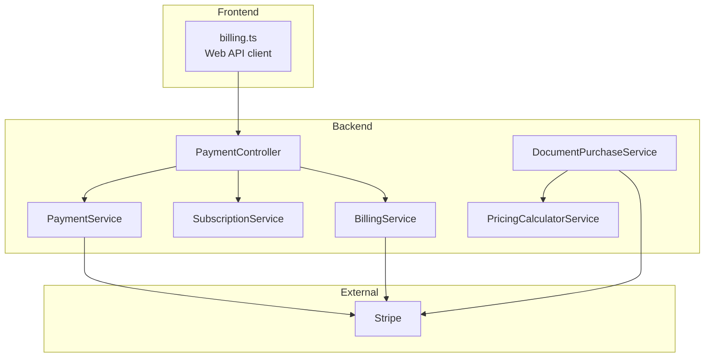
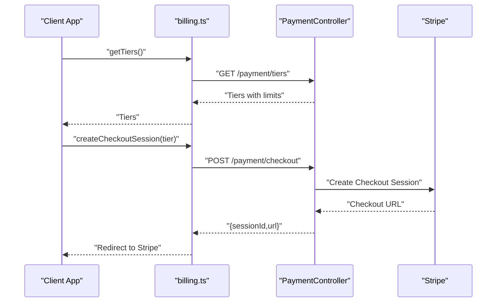
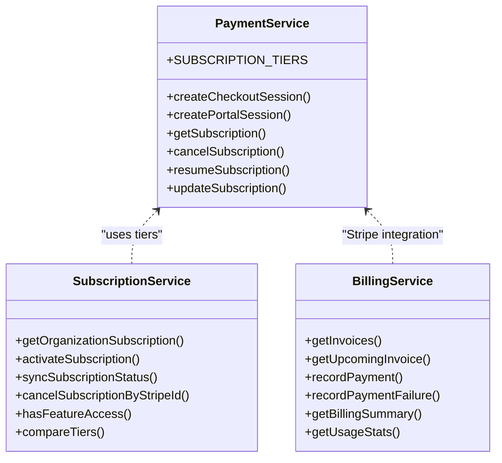
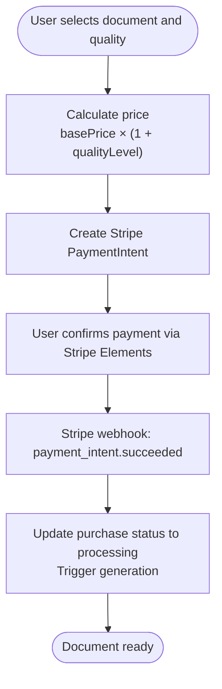
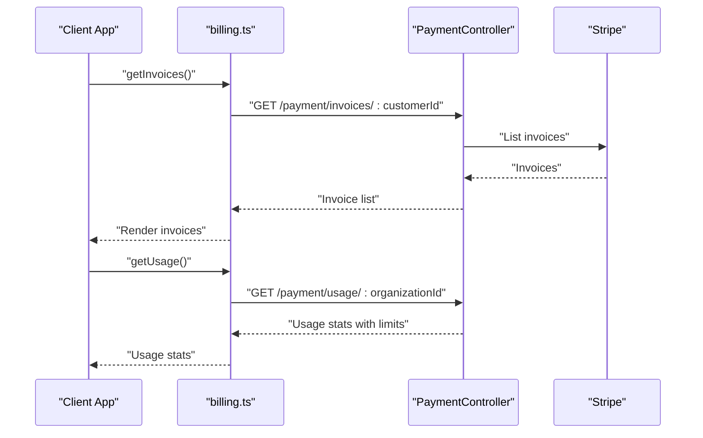
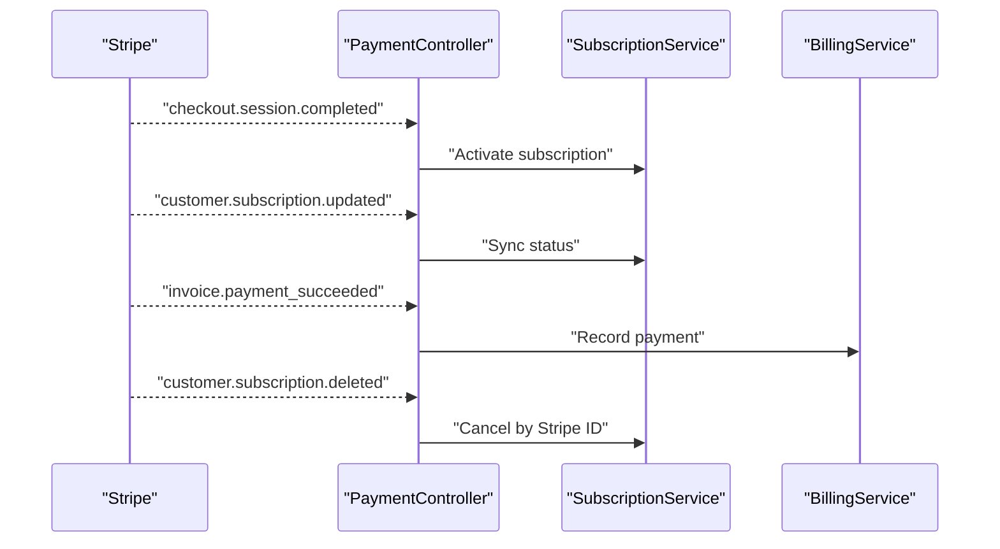
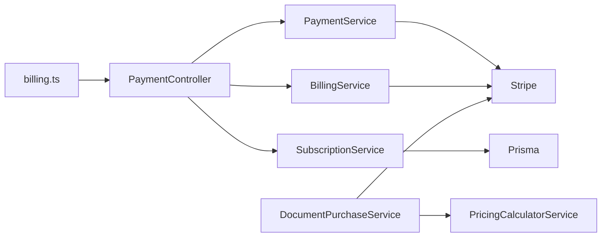

# Pricing Plans

<cite>
**Referenced Files in This Document**
- [payment.service.ts](file://apps/api/src/modules/payment/payment.service.ts)
- [subscription.service.ts](file://apps/api/src/modules/payment/subscription.service.ts)
- [billing.service.ts](file://apps/api/src/modules/payment/billing.service.ts)
- [payment.controller.ts](file://apps/api/src/modules/payment/payment.controller.ts)
- [billing.ts](file://apps/web/src/api/billing.ts)
- [pricing-calculator.service.ts](file://apps/api/src/modules/document-commerce/services/pricing-calculator.service.ts)
- [document-purchase.service.ts](file://apps/api/src/modules/document-commerce/services/document-purchase.service.ts)
- [stripe-webhook.controller.ts](file://apps/api/src/modules/document-commerce/stripe-webhook.controller.ts)
- [PHASE-07-document-commerce.md](file://docs/phase-kits/PHASE-07-document-commerce.md)
- [HelpCenter.tsx](file://apps/web/src/components/help/HelpCenter.tsx)
- [TermsPage.tsx](file://apps/web/src/pages/legal/TermsPage.tsx)
- [fixtures.ts](file://e2e/fixtures.ts)
</cite>

## Table of Contents
1. [Introduction](#introduction)
2. [Project Structure](#project-structure)
3. [Core Components](#core-components)
4. [Architecture Overview](#architecture-overview)
5. [Detailed Component Analysis](#detailed-component-analysis)
6. [Dependency Analysis](#dependency-analysis)
7. [Performance Considerations](#performance-considerations)
8. [Troubleshooting Guide](#troubleshooting-guide)
9. [Conclusion](#conclusion)
10. [Appendices](#appendices)

## Introduction
This document defines Quiz-to-Build’s pricing plans and billing model. It covers subscription tiers, per-document pay-as-you-go pricing, billing cycles, invoicing, cancellation, and enterprise customization. The system supports monthly and annual billing for subscriptions and a pay-per-use model for document generation beyond included limits.

## Project Structure
The pricing and billing system spans backend services and frontend APIs:
- Backend subscription and billing services manage tiers, invoices, usage, and Stripe integration.
- Frontend billing API client exposes subscription, tiers, invoices, usage, and checkout flows.
- Document commerce services implement per-document pay-per-use pricing with Stripe PaymentIntents and webhooks.

**Diagram sources**
- [payment.controller.ts:40-396](file://apps/api/src/modules/payment/payment.controller.ts#L40-L396)
- [payment.service.ts:56-316](file://apps/api/src/modules/payment/payment.service.ts#L56-L316)
- [subscription.service.ts:28-237](file://apps/api/src/modules/payment/subscription.service.ts#L28-L237)
- [billing.service.ts:32-270](file://apps/api/src/modules/payment/billing.service.ts#L32-L270)
- [billing.ts:104-234](file://apps/web/src/api/billing.ts#L104-L234)
- [document-purchase.service.ts:17-274](file://apps/api/src/modules/document-commerce/services/document-purchase.service.ts#L17-L274)
- [pricing-calculator.service.ts:57-227](file://apps/api/src/modules/document-commerce/services/pricing-calculator.service.ts#L57-L227)

**Section sources**
- [payment.controller.ts:40-396](file://apps/api/src/modules/payment/payment.controller.ts#L40-L396)
- [billing.ts:104-234](file://apps/web/src/api/billing.ts#L104-L234)

## Core Components
- Subscription tiers and limits are defined in the backend payment service and exposed via the payment controller.
- Subscription lifecycle (create, update, cancel, resume) is managed by the payment and subscription services.
- Billing history and upcoming invoices are handled by the billing service backed by Stripe.
- Per-document pay-per-use pricing is calculated by the pricing calculator and processed via Stripe PaymentIntents by the document purchase service.

**Section sources**
- [payment.service.ts:10-49](file://apps/api/src/modules/payment/payment.service.ts#L10-L49)
- [subscription.service.ts:34-237](file://apps/api/src/modules/payment/subscription.service.ts#L34-L237)
- [billing.service.ts:32-270](file://apps/api/src/modules/payment/billing.service.ts#L32-L270)
- [pricing-calculator.service.ts:57-227](file://apps/api/src/modules/document-commerce/services/pricing-calculator.service.ts#L57-L227)
- [document-purchase.service.ts:36-274](file://apps/api/src/modules/document-commerce/services/document-purchase.service.ts#L36-L274)

## Architecture Overview
The billing architecture integrates subscription and per-document purchase flows with Stripe.

**Diagram sources**
- [billing.ts:118-198](file://apps/web/src/api/billing.ts#L118-L198)
- [payment.controller.ts:72-97](file://apps/api/src/modules/payment/payment.controller.ts#L72-L97)
- [payment.service.ts:102-152](file://apps/api/src/modules/payment/payment.service.ts#L102-L152)

## Detailed Component Analysis

### Subscription Tiers and Limits
- Free tier: Limited usage across questionnaires, responses, documents, and API calls; community support.
- Professional tier: Higher limits; email support; monthly and annual pricing supported.
- Enterprise tier: Unlimited usage; priority support; suitable for organizations with advanced needs.

**Diagram sources**
- [payment.service.ts:10-49](file://apps/api/src/modules/payment/payment.service.ts#L10-L49)
- [subscription.service.ts:34-237](file://apps/api/src/modules/payment/subscription.service.ts#L34-L237)
- [billing.service.ts:32-270](file://apps/api/src/modules/payment/billing.service.ts#L32-L270)

**Section sources**
- [payment.service.ts:10-49](file://apps/api/src/modules/payment/payment.service.ts#L10-L49)
- [subscription.service.ts:34-237](file://apps/api/src/modules/payment/subscription.service.ts#L34-L237)
- [fixtures.ts:208-239](file://e2e/fixtures.ts#L208-L239)

### Pay-Per-Use for Documents
- Per-document pricing is quality-based with multipliers from 1x to 5x.
- Users select a quality level; the system calculates the final price and creates a PaymentIntent.
- Successful payment triggers document generation via downstream services.

**Diagram sources**
- [pricing-calculator.service.ts:65-107](file://apps/api/src/modules/document-commerce/services/pricing-calculator.service.ts#L65-L107)
- [document-purchase.service.ts:110-161](file://apps/api/src/modules/document-commerce/services/document-purchase.service.ts#L110-L161)
- [stripe-webhook.controller.ts:84-103](file://apps/api/src/modules/document-commerce/stripe-webhook.controller.ts#L84-L103)

**Section sources**
- [pricing-calculator.service.ts:57-227](file://apps/api/src/modules/document-commerce/services/pricing-calculator.service.ts#L57-L227)
- [document-purchase.service.ts:36-274](file://apps/api/src/modules/document-commerce/services/document-purchase.service.ts#L36-L274)
- [PHASE-07-document-commerce.md:272-338](file://docs/phase-kits/PHASE-07-document-commerce.md#L272-L338)

### Billing Cycles, Invoicing, and Usage
- Monthly and annual billing supported for subscriptions.
- Upcoming invoice previews and historical invoices are retrievable.
- Usage stats (questionnaires, responses, documents, API calls) are available per organization.

**Diagram sources**
- [billing.ts:128-183](file://apps/web/src/api/billing.ts#L128-L183)
- [payment.controller.ts:146-221](file://apps/api/src/modules/payment/payment.controller.ts#L146-L221)
- [billing.service.ts:44-86](file://apps/api/src/modules/payment/billing.service.ts#L44-L86)

**Section sources**
- [billing.ts:128-183](file://apps/web/src/api/billing.ts#L128-L183)
- [payment.controller.ts:146-221](file://apps/api/src/modules/payment/payment.controller.ts#L146-L221)
- [billing.service.ts:44-86](file://apps/api/src/modules/payment/billing.service.ts#L44-L86)

### Cancellation, Resumption, and Webhooks
- Subscriptions can be canceled at the end of the billing period or resumed later.
- Stripe webhooks handle checkout completion, subscription updates, deletions, and invoice payment events.

**Diagram sources**
- [payment.controller.ts:272-394](file://apps/api/src/modules/payment/payment.controller.ts#L272-L394)
- [subscription.service.ts:96-165](file://apps/api/src/modules/payment/subscription.service.ts#L96-L165)
- [billing.service.ts:91-190](file://apps/api/src/modules/payment/billing.service.ts#L91-L190)

**Section sources**
- [payment.controller.ts:223-267](file://apps/api/src/modules/payment/payment.controller.ts#L223-L267)
- [subscription.service.ts:96-165](file://apps/api/src/modules/payment/subscription.service.ts#L96-L165)
- [billing.service.ts:91-190](file://apps/api/src/modules/payment/billing.service.ts#L91-L190)

## Dependency Analysis
- Subscription tiers are centrally defined and consumed by both frontend and backend services.
- PaymentService depends on Stripe configuration and environment variables for price IDs.
- SubscriptionService and BillingService rely on Prisma for organization and subscription persistence.
- Document commerce services depend on PricingCalculatorService and Stripe for per-document transactions.

**Diagram sources**
- [payment.service.ts:56-316](file://apps/api/src/modules/payment/payment.service.ts#L56-L316)
- [subscription.service.ts:28-237](file://apps/api/src/modules/payment/subscription.service.ts#L28-L237)
- [billing.service.ts:32-270](file://apps/api/src/modules/payment/billing.service.ts#L32-L270)
- [document-purchase.service.ts:17-274](file://apps/api/src/modules/document-commerce/services/document-purchase.service.ts#L17-L274)
- [billing.ts:104-234](file://apps/web/src/api/billing.ts#L104-L234)

**Section sources**
- [payment.service.ts:56-316](file://apps/api/src/modules/payment/payment.service.ts#L56-L316)
- [subscription.service.ts:28-237](file://apps/api/src/modules/payment/subscription.service.ts#L28-L237)
- [billing.service.ts:32-270](file://apps/api/src/modules/payment/billing.service.ts#L32-L270)
- [document-purchase.service.ts:17-274](file://apps/api/src/modules/document-commerce/services/document-purchase.service.ts#L17-L274)
- [billing.ts:104-234](file://apps/web/src/api/billing.ts#L104-L234)

## Performance Considerations
- Use Stripe’s webhook signatures to prevent replay attacks and ensure reliable event processing.
- Cache tier definitions server-side to avoid repeated reads and improve response times.
- Batch usage queries and limit invoice lists to reduce load on the billing service.
- Monitor per-document purchase creation latency and retry PaymentIntent creation on transient errors.

## Troubleshooting Guide
Common billing issues and resolutions:
- Missing Stripe configuration: Payment features are disabled if the secret key is not configured. Verify environment variables and restart the service.
- Invalid webhook signature: Ensure the webhook secret is configured and the raw body is passed to the verification routine.
- Payment failures: Inspect the last payment failure record and prompt users to update payment details via the billing portal.
- Usage reporting gaps: If the usage endpoint is unavailable, the frontend falls back to displaying tier limits.

**Section sources**
- [payment.service.ts:61-72](file://apps/api/src/modules/payment/payment.service.ts#L61-L72)
- [stripe-webhook.controller.ts:63-82](file://apps/api/src/modules/document-commerce/stripe-webhook.controller.ts#L63-L82)
- [billing.service.ts:145-190](file://apps/api/src/modules/payment/billing.service.ts#L145-L190)
- [billing.ts:179-183](file://apps/web/src/api/billing.ts#L179-L183)

## Conclusion
Quiz-to-Build offers flexible pricing combining subscription tiers with a pay-per-use model for documents. Subscriptions support monthly and annual billing, while per-document purchases use Stripe PaymentIntents with webhook-driven processing. Organizations can manage billing via the customer portal, and enterprise needs can be addressed through custom enterprise licensing.

## Appendices

### Pricing Model Summary
- Subscription tiers: Free, Professional, Enterprise. Limits include questionnaires, responses, documents, API calls, and support level.
- Annual vs monthly: Subscriptions bill in advance on a monthly or annual basis; annual plans typically offer savings compared to month-to-month.
- Pay-per-use: Per-document pricing scales with quality level (multiplier 1x to 5x). PaymentIntents are created and processed asynchronously via webhooks.

**Section sources**
- [payment.service.ts:10-49](file://apps/api/src/modules/payment/payment.service.ts#L10-L49)
- [pricing-calculator.service.ts:65-107](file://apps/api/src/modules/document-commerce/services/pricing-calculator.service.ts#L65-L107)
- [PHASE-07-document-commerce.md:272-338](file://docs/phase-kits/PHASE-07-document-commerce.md#L272-L338)

### Feature Comparison Across Tiers
- Free: Limited questionnaires, responses, documents, API calls, community support.
- Professional: Higher limits, email support, unlimited questionnaires, documents, and API calls in some contexts.
- Enterprise: All Professional features plus team collaboration, API access, SSO, dedicated support.

**Section sources**
- [fixtures.ts:208-239](file://e2e/fixtures.ts#L208-L239)
- [HelpCenter.tsx:260-266](file://apps/web/src/components/help/HelpCenter.tsx#L260-L266)

### Free Trial and Cancellation Policy
- Free trial: All paid plans include a 14-day free trial.
- Cancellation: Subscriptions can be canceled anytime; they remain active until the end of the current billing period. No refunds are provided for partial periods.

**Section sources**
- [HelpCenter.tsx:267-312](file://apps/web/src/components/help/HelpCenter.tsx#L267-L312)
- [TermsPage.tsx:107-123](file://apps/web/src/pages/legal/TermsPage.tsx#L107-L123)

### Invoicing and Payment Methods
- Invoices: Available as hosted URLs and PDF links; upcoming invoice previews supported.
- Payment methods: Cards via Stripe Checkout for subscriptions; Stripe Elements for per-document payments.

**Section sources**
- [billing.service.ts:44-86](file://apps/api/src/modules/payment/billing.service.ts#L44-L86)
- [payment.controller.ts:100-129](file://apps/api/src/modules/payment/payment.controller.ts#L100-L129)
- [document-purchase.service.ts:114-131](file://apps/api/src/modules/document-commerce/services/document-purchase.service.ts#L114-L131)

### Cost Optimization Strategies and Volume Discounts
- Consolidate to annual billing for savings.
- Monitor usage to avoid unnecessary upgrades.
- Use the pay-per-use model for bursty document generation to avoid overpaying for unused subscription capacity.

[No sources needed since this section provides general guidance]

### Enterprise Licensing
- Enterprise licensing includes advanced capabilities such as SSO/SAML, custom integrations, dedicated account management, and SLAs. Contact support for custom pricing.

**Section sources**
- [HelpCenter.tsx:260-266](file://apps/web/src/components/help/HelpCenter.tsx#L260-L266)

### FAQ
- How do I upgrade my plan? Use the billing portal to upgrade; changes take effect immediately with prorated billing.
- Can I get a refund? Within the trial period, full refunds are available. Monthly plans receive prorated refunds for unused days; annual plans within 30 days of purchase.

**Section sources**
- [HelpCenter.tsx:275-312](file://apps/web/src/components/help/HelpCenter.tsx#L275-L312)