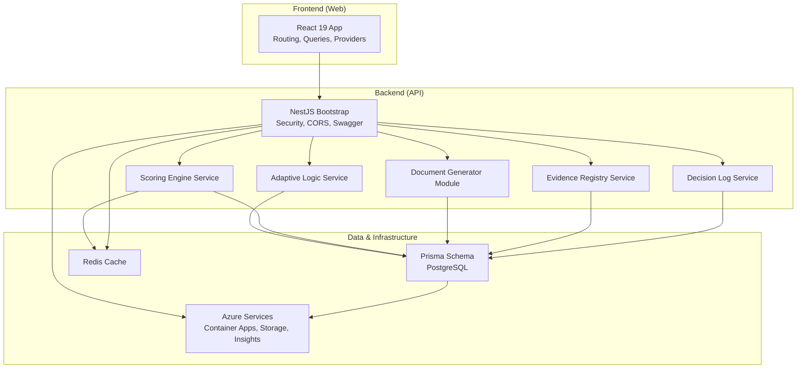
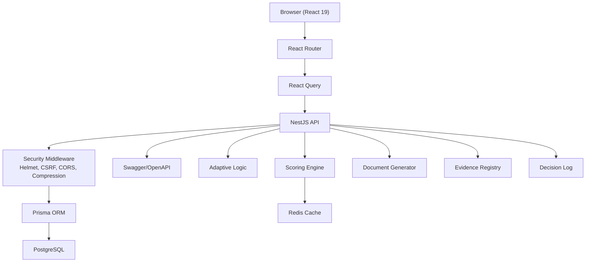
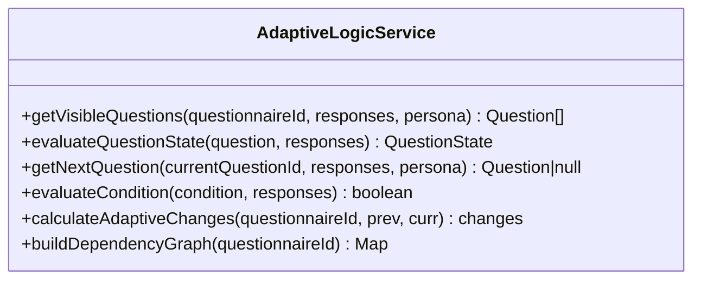
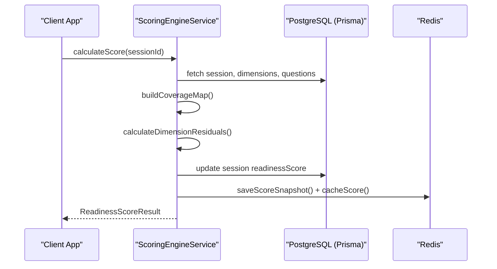
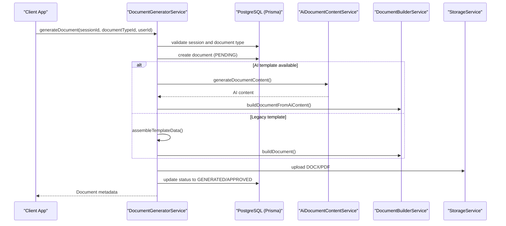
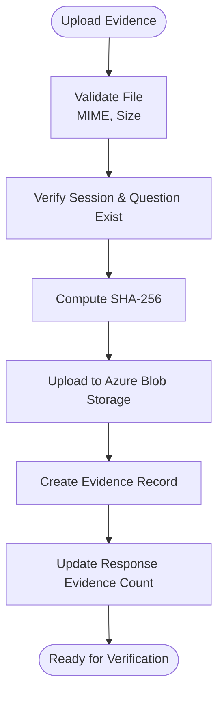
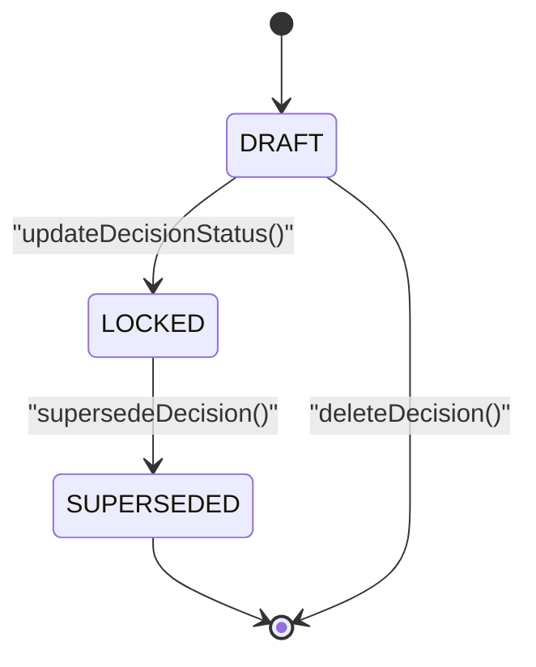
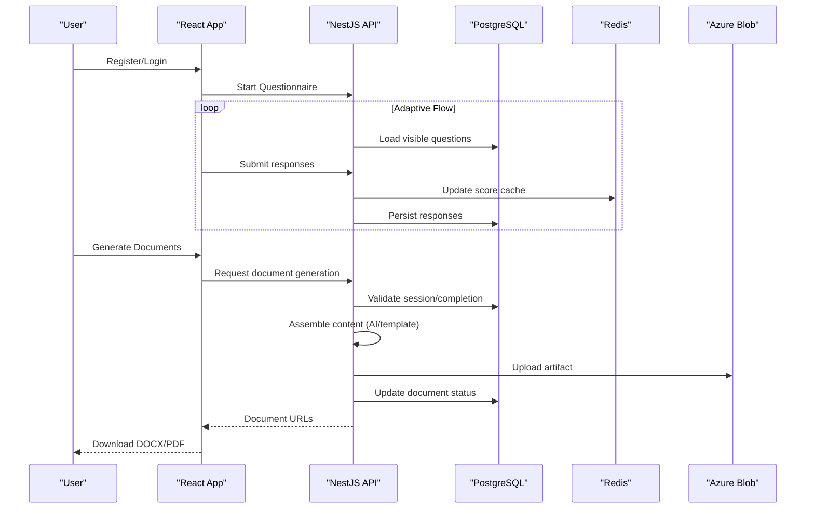
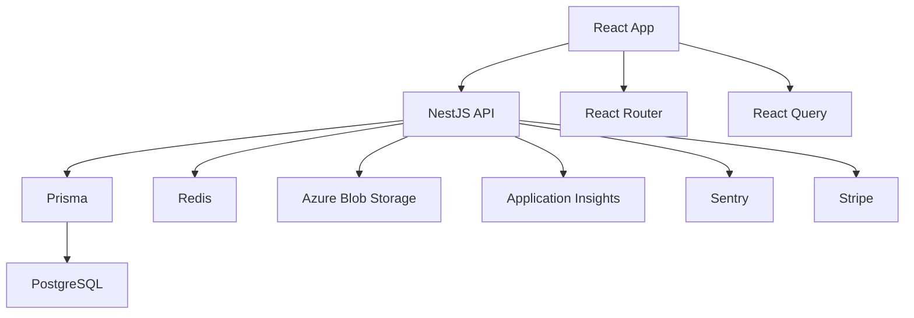

# Project Overview

<cite>
**Referenced Files in This Document**
- [README.md](file://README.md)
- [PRODUCT-OVERVIEW.md](file://PRODUCT-OVERVIEW.md)
- [DEPLOYMENT-READY.md](file://DEPLOYMENT-READY.md)
- [apps/api/src/main.ts](file://apps/api/src/main.ts)
- [apps/api/src/modules/adaptive-logic/adaptive-logic.service.ts](file://apps/api/src/modules/adaptive-logic/adaptive-logic.service.ts)
- [apps/api/src/modules/scoring-engine/scoring-engine.service.ts](file://apps/api/src/modules/scoring-engine/scoring-engine.service.ts)
- [apps/api/src/modules/document-generator/document-generator.module.ts](file://apps/api/src/modules/document-generator/document-generator.module.ts)
- [apps/api/src/modules/document-generator/services/document-generator.service.ts](file://apps/api/src/modules/document-generator/services/document-generator.service.ts)
- [apps/api/src/modules/evidence-registry/evidence-registry.service.ts](file://apps/api/src/modules/evidence-registry/evidence-registry.service.ts)
- [apps/api/src/modules/decision-log/decision-log.service.ts](file://apps/api/src/modules/decision-log/decision-log.service.ts)
- [apps/api/src/modules/document-generator/templates/document-templates.ts](file://apps/api/src/modules/document-generator/templates/document-templates.ts)
- [apps/web/src/App.tsx](file://apps/web/src/App.tsx)
- [prisma/schema.prisma](file://prisma/schema.prisma)
</cite>

## Table of Contents
1. [Introduction](#introduction)
2. [Project Structure](#project-structure)
3. [Core Components](#core-components)
4. [Architecture Overview](#architecture-overview)
5. [Detailed Component Analysis](#detailed-component-analysis)
6. [Dependency Analysis](#dependency-analysis)
7. [Performance Considerations](#performance-considerations)
8. [Troubleshooting Guide](#troubleshooting-guide)
9. [Conclusion](#conclusion)

## Introduction
Quiz-to-build (Quiz2Biz) is an adaptive client questionnaire system that transforms business questionnaires into professional documentation packages. The platform interviews organizations through tailored assessments and automatically produces comprehensive technical and business documentation. It is production-ready with robust quality metrics, WCAG 2.2 AA accessibility, and a complete deployment pipeline to Azure.

Key value proposition:
- Reduce time-to-documentation from weeks to minutes by automating the transformation of questionnaire responses into structured deliverables.
- Empower stakeholders with real-time insights, heatmaps, and gap analysis across seven technical dimensions.
- Standardize assessment and documentation across teams, consultants, and compliance domains.

Target audiences:
- CTOs (architecture and standards)
- CFOs (financial planning and resource documentation)
- CEOs (executive summaries and strategy)
- Business Analysts (requirements and process documentation)
- Compliance Teams (policy packages and compliance tracking)

Primary use cases:
- Startup tech assessment and investor readiness
- Enterprise modernization and compliance documentation
- Consultant standardization and deliverable packaging
- Investment due diligence and technical risk assessment

**Section sources**
- [README.md:18-28](file://README.md#L18-L28)
- [README.md:157-171](file://README.md#L157-L171)
- [PRODUCT-OVERVIEW.md:16-24](file://PRODUCT-OVERVIEW.md#L16-L24)

## Project Structure
The repository follows a monorepo layout with three primary applications:
- apps/api: NestJS backend with OpenAPI documentation, security middleware, and modular domain services (adaptive logic, scoring, document generation, evidence registry, decision log).
- apps/web: React 19 frontend with React Router, React Query, and comprehensive page routing.
- apps/cli: Command-line tools for offline operations and utilities.

Shared infrastructure:
- prisma: PostgreSQL schema and migrations.
- libs: Shared libraries for database and Redis.
- docker: Production containers for API, web, and database initialization.
- infrastructure/terraform: Azure Infrastructure-as-Code.

**Diagram sources**
- [apps/api/src/main.ts:28-329](file://apps/api/src/main.ts#L28-L329)
- [apps/api/src/modules/adaptive-logic/adaptive-logic.service.ts:19-285](file://apps/api/src/modules/adaptive-logic/adaptive-logic.service.ts#L19-L285)
- [apps/api/src/modules/scoring-engine/scoring-engine.service.ts:54-387](file://apps/api/src/modules/scoring-engine/scoring-engine.service.ts#L54-L387)
- [apps/api/src/modules/document-generator/document-generator.module.ts:19-47](file://apps/api/src/modules/document-generator/document-generator.module.ts#L19-L47)
- [apps/api/src/modules/evidence-registry/evidence-registry.service.ts:95-953](file://apps/api/src/modules/evidence-registry/evidence-registry.service.ts#L95-L953)
- [apps/api/src/modules/decision-log/decision-log.service.ts:37-396](file://apps/api/src/modules/decision-log/decision-log.service.ts#L37-L396)
- [prisma/schema.prisma:1-200](file://prisma/schema.prisma#L1-L200)

**Section sources**
- [README.md:295-341](file://README.md#L295-L341)

## Core Components
- Adaptive Questionnaire Engine: Supports 11 question types, dynamic visibility and requirement rules, auto-save, and resume capability.
- Intelligent Scoring System: Computes readiness across seven technical dimensions with real-time updates, heatmaps, and gap analysis.
- Document Generation: Produces 8+ professional document types (e.g., Architecture Dossier, SDLC Playbook, Test Strategy, DevSecOps Guide, Privacy & Data Policy, Observability Guide, Finance Documents, Policy Pack) with AI-assisted content and export formats.
- Evidence Registry: Integrates with GitHub/GitLab/Jira/Confluence/Azure DevOps, tracks evidence integrity, and enforces coverage transitions.
- Decision Log: Append-only decision record with status workflow (DRAFT → LOCKED → SUPERSEDED), audit trail, and supersession support.
- Advanced Features: Offline support, keyboard shortcuts, accessibility (WCAG 2.2 AA), responsive design, and real-time collaboration.

**Section sources**
- [README.md:84-120](file://README.md#L84-L120)
- [README.md:122-131](file://README.md#L122-L131)
- [PRODUCT-OVERVIEW.md:25-78](file://PRODUCT-OVERVIEW.md#L25-L78)

## Architecture Overview
The system is built on a layered architecture:
- Presentation Layer: React 19 SPA with React Router and React Query.
- API Layer: NestJS with security middleware (Helmet, CSRF, rate limiting), CORS, compression, and Swagger/OpenAPI documentation.
- Domain Services: Modular services for adaptive logic, scoring, document generation, evidence registry, and decision log.
- Data Layer: PostgreSQL via Prisma ORM with Redis caching for scoring snapshots.
- Infrastructure: Azure Container Apps, Azure Database for PostgreSQL, Azure Cache for Redis, Azure Blob Storage, Application Insights, and GitHub Actions CI/CD.

**Diagram sources**
- [apps/web/src/App.tsx:189-284](file://apps/web/src/App.tsx#L189-L284)
- [apps/api/src/main.ts:28-329](file://apps/api/src/main.ts#L28-L329)
- [apps/api/src/modules/adaptive-logic/adaptive-logic.service.ts:19-285](file://apps/api/src/modules/adaptive-logic/adaptive-logic.service.ts#L19-L285)
- [apps/api/src/modules/scoring-engine/scoring-engine.service.ts:54-387](file://apps/api/src/modules/scoring-engine/scoring-engine.service.ts#L54-L387)
- [apps/api/src/modules/document-generator/document-generator.module.ts:19-47](file://apps/api/src/modules/document-generator/document-generator.module.ts#L19-L47)
- [apps/api/src/modules/evidence-registry/evidence-registry.service.ts:95-953](file://apps/api/src/modules/evidence-registry/evidence-registry.service.ts#L95-L953)
- [apps/api/src/modules/decision-log/decision-log.service.ts:37-396](file://apps/api/src/modules/decision-log/decision-log.service.ts#L37-L396)
- [prisma/schema.prisma:1-200](file://prisma/schema.prisma#L1-L200)

## Detailed Component Analysis

### Adaptive Questionnaire Engine
The adaptive engine evaluates visibility and requirement rules in real time, ensuring relevance and efficiency. It supports 11 question types and persona targeting, with priority-based rule evaluation and dependency graph building.

**Diagram sources**
- [apps/api/src/modules/adaptive-logic/adaptive-logic.service.ts:19-285](file://apps/api/src/modules/adaptive-logic/adaptive-logic.service.ts#L19-L285)

**Section sources**
- [apps/api/src/modules/adaptive-logic/adaptive-logic.service.ts:29-132](file://apps/api/src/modules/adaptive-logic/adaptive-logic.service.ts#L29-L132)
- [prisma/schema.prisma:25-37](file://prisma/schema.prisma#L25-L37)

### Intelligent Scoring System
The scoring engine computes portfolio residual risk and readiness score across seven dimensions, with caching, analytics, and prioritized next questions (NQS) recommendations.

**Diagram sources**
- [apps/api/src/modules/scoring-engine/scoring-engine.service.ts:70-164](file://apps/api/src/modules/scoring-engine/scoring-engine.service.ts#L70-L164)
- [apps/api/src/modules/scoring-engine/scoring-engine.service.ts:343-386](file://apps/api/src/modules/scoring-engine/scoring-engine.service.ts#L343-L386)

**Section sources**
- [apps/api/src/modules/scoring-engine/scoring-engine.service.ts:66-164](file://apps/api/src/modules/scoring-engine/scoring-engine.service.ts#L66-L164)
- [README.md:122-131](file://README.md#L122-L131)

### Document Generation
The document generator validates session completion, checks required questions, and creates documents either via AI content service or template-based assembly, storing artifacts and updating status.

**Diagram sources**
- [apps/api/src/modules/document-generator/services/document-generator.service.ts:37-136](file://apps/api/src/modules/document-generator/services/document-generator.service.ts#L37-L136)
- [apps/api/src/modules/document-generator/services/document-generator.service.ts:142-200](file://apps/api/src/modules/document-generator/services/document-generator.service.ts#L142-L200)
- [apps/api/src/modules/document-generator/templates/document-templates.ts:18-200](file://apps/api/src/modules/document-generator/templates/document-templates.ts#L18-L200)

**Section sources**
- [apps/api/src/modules/document-generator/document-generator.module.ts:19-47](file://apps/api/src/modules/document-generator/document-generator.module.ts#L19-L47)
- [apps/api/src/modules/document-generator/services/document-generator.service.ts:37-136](file://apps/api/src/modules/document-generator/services/document-generator.service.ts#L37-L136)
- [README.md:105-111](file://README.md#L105-L111)

### Evidence Registry
The evidence registry manages file uploads, integrity verification, coverage updates, and audit trails. It integrates with Azure Blob Storage and maintains append-only records.

**Diagram sources**
- [apps/api/src/modules/evidence-registry/evidence-registry.service.ts:165-208](file://apps/api/src/modules/evidence-registry/evidence-registry.service.ts#L165-L208)
- [apps/api/src/modules/evidence-registry/evidence-registry.service.ts:376-395](file://apps/api/src/modules/evidence-registry/evidence-registry.service.ts#L376-L395)

**Section sources**
- [apps/api/src/modules/evidence-registry/evidence-registry.service.ts:165-245](file://apps/api/src/modules/evidence-registry/evidence-registry.service.ts#L165-L245)
- [README.md:113-119](file://README.md#L113-L119)

### Decision Log
The decision log enforces an append-only workflow with status transitions and supersession for amending locked decisions.

**Diagram sources**
- [apps/api/src/modules/decision-log/decision-log.service.ts:87-123](file://apps/api/src/modules/decision-log/decision-log.service.ts#L87-L123)
- [apps/api/src/modules/decision-log/decision-log.service.ts:135-188](file://apps/api/src/modules/decision-log/decision-log.service.ts#L135-L188)

**Section sources**
- [apps/api/src/modules/decision-log/decision-log.service.ts:49-74](file://apps/api/src/modules/decision-log/decision-log.service.ts#L49-L74)
- [README.md:113-119](file://README.md#L113-L119)

### Practical Workflow Example: From Questionnaire to Documents
End-to-end flow from user registration to professional documentation delivery:

**Diagram sources**
- [apps/web/src/App.tsx:202-284](file://apps/web/src/App.tsx#L202-L284)
- [apps/api/src/main.ts:214-299](file://apps/api/src/main.ts#L214-L299)
- [apps/api/src/modules/document-generator/services/document-generator.service.ts:37-136](file://apps/api/src/modules/document-generator/services/document-generator.service.ts#L37-L136)

**Section sources**
- [README.md:174-184](file://README.md#L174-L184)
- [PRODUCT-OVERVIEW.md:190-219](file://PRODUCT-OVERVIEW.md#L190-L219)

## Dependency Analysis
- Frontend-to-Backend: React SPA communicates with NestJS API over HTTPS with JWT authentication and optional OAuth providers.
- API-to-Data: All services depend on Prisma ORM for PostgreSQL access; Redis is used for scoring cache and snapshots.
- External Integrations: Azure Blob Storage for evidence artifacts, Application Insights for telemetry, Sentry for error tracking, Stripe for payments, and OAuth providers for authentication.
- Routing and Providers: React Router handles navigation; React Query manages server state; providers encapsulate feature flags, accessibility, internationalization, and AI assistance.

**Diagram sources**
- [apps/web/src/App.tsx:189-284](file://apps/web/src/App.tsx#L189-L284)
- [apps/api/src/main.ts:28-329](file://apps/api/src/main.ts#L28-L329)
- [prisma/schema.prisma:1-200](file://prisma/schema.prisma#L1-L200)

**Section sources**
- [README.md:190-204](file://README.md#L190-L204)
- [PRODUCT-OVERVIEW.md:79-106](file://PRODUCT-OVERVIEW.md#L79-L106)

## Performance Considerations
- Page load and interactivity targets are under 2.1s LCP and 3.2s TTI.
- API response latency targets under 150ms average.
- Error rate target below 0.5%.
- Uptime target of 99.9%.
- Auto-save occurs every 30 seconds to minimize data loss and improve reliability.
- Redis caching reduces repeated scoring computations and accelerates dashboard updates.

**Section sources**
- [PRODUCT-OVERVIEW.md:152-161](file://PRODUCT-OVERVIEW.md#L152-L161)
- [README.md:197-203](file://README.md#L197-L203)

## Troubleshooting Guide
Common deployment and runtime issues:
- Health check failures: Verify database connectivity, Redis availability, and container app configuration.
- Authentication errors: Confirm JWT secrets, OAuth provider credentials, and CORS origins.
- Document generation failures: Check AI content service availability, storage permissions, and required question validation.
- Evidence upload errors: Validate Azure Blob Storage connection string and allowed MIME types.
- Scoring inconsistencies: Clear Redis cache for the session and re-run scoring.

Operational verification:
- Use the post-deployment verification commands to confirm health, API docs, and basic registration.
- Monitor Azure Container Apps logs and Application Insights telemetry.
- Review rollback procedures to activate previous revisions if needed.

**Section sources**
- [DEPLOYMENT-READY.md:182-216](file://DEPLOYMENT-READY.md#L182-L216)
- [DEPLOYMENT-READY.md:242-257](file://DEPLOYMENT-READY.md#L242-L257)

## Conclusion
Quiz-to-build delivers a production-ready adaptive questionnaire platform that seamlessly transforms business assessments into professional documentation packages. Its modular architecture, comprehensive quality metrics, and robust deployment pipeline make it suitable for startups, enterprises, consultants, and investors. With WCAG 2.2 AA accessibility, real-time scoring, and automated document generation, it accelerates decision-making and compliance while maintaining strong security and performance standards.

**Section sources**
- [README.md:380-388](file://README.md#L380-L388)
- [PRODUCT-OVERVIEW.md:173-182](file://PRODUCT-OVERVIEW.md#L173-L182)
- [DEPLOYMENT-READY.md:1-48](file://DEPLOYMENT-READY.md#L1-L48)