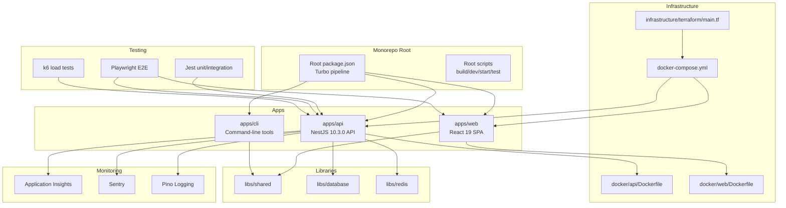
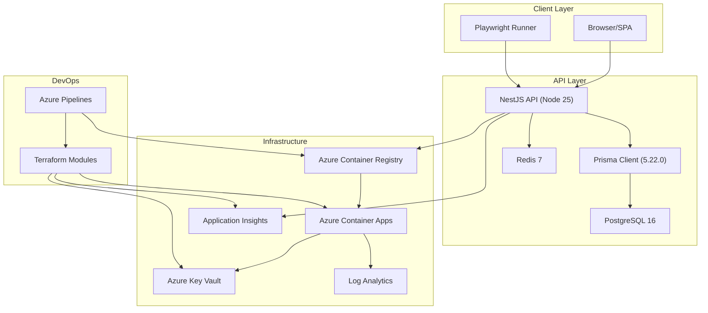
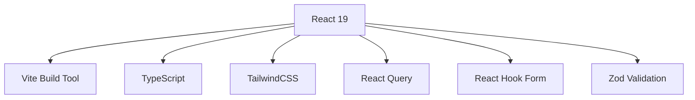
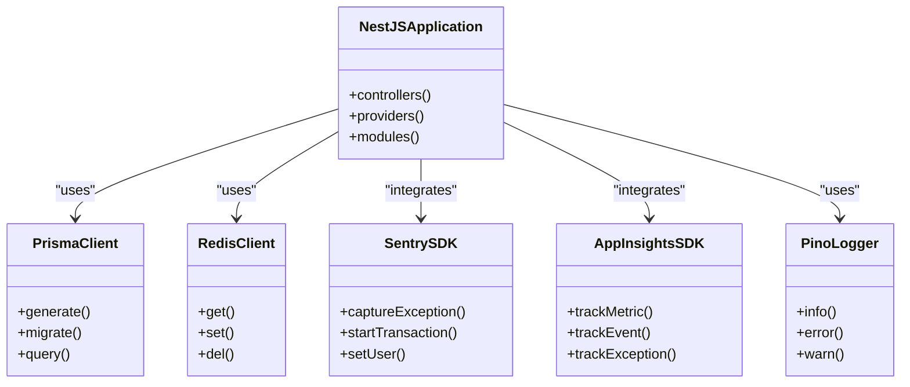
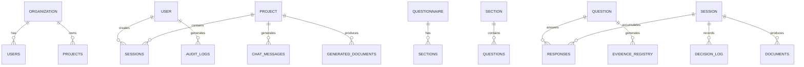
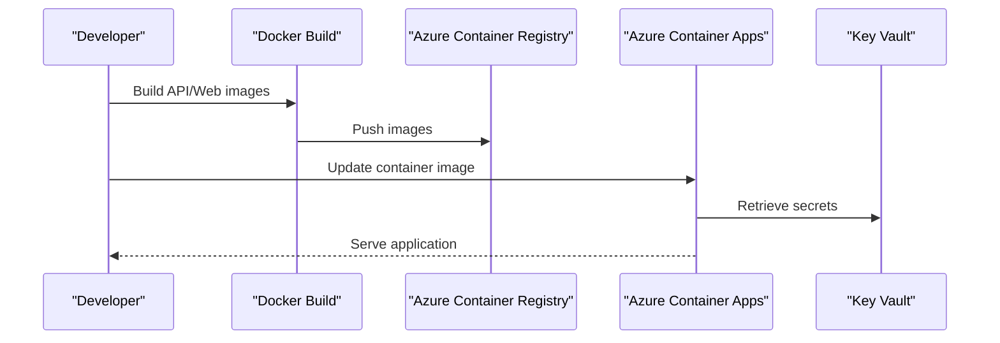
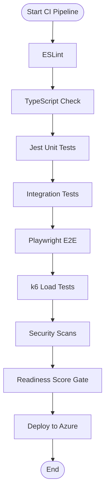
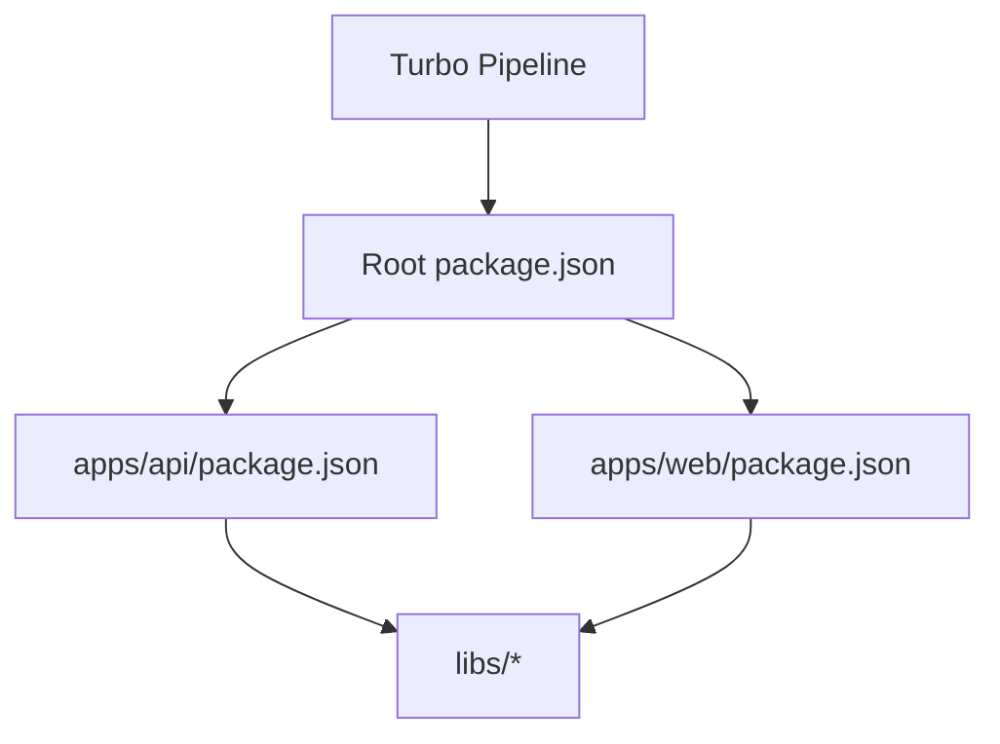

# Technology Stack

<cite>
**Referenced Files in This Document**
- [package.json](file://package.json)
- [turbo.json](file://turbo.json)
- [apps/api/package.json](file://apps/api/package.json)
- [apps/web/package.json](file://apps/web/package.json)
- [prisma/schema.prisma](file://prisma/schema.prisma)
- [docker/api/Dockerfile](file://docker/api/Dockerfile)
- [docker/web/Dockerfile](file://docker/web/Dockerfile)
- [docker-compose.yml](file://docker-compose.yml)
- [apps/api/src/config/appinsights.config.ts](file://apps/api/src/config/appinsights.config.ts)
- [apps/api/src/config/sentry.config.ts](file://apps/api/src/config/sentry.config.ts)
- [apps/api/src/config/logger.config.ts](file://apps/api/src/config/logger.config.ts)
- [playwright.config.ts](file://playwright.config.ts)
- [azure-pipelines.yml](file://azure-pipelines.yml)
- [infrastructure/terraform/main.tf](file://infrastructure/terraform/main.tf)
- [test/performance/api-load.k6.js](file://test/performance/api-load.k6.js)
</cite>

## Table of Contents
1. [Introduction](#introduction)
2. [Project Structure](#project-structure)
3. [Core Components](#core-components)
4. [Architecture Overview](#architecture-overview)
5. [Detailed Component Analysis](#detailed-component-analysis)
6. [Dependency Analysis](#dependency-analysis)
7. [Performance Considerations](#performance-considerations)
8. [Troubleshooting Guide](#troubleshooting-guide)
9. [Conclusion](#conclusion)
10. [Appendices](#appendices)

## Introduction
This document provides comprehensive technology stack documentation for Quiz-to-Build, detailing the full-stack architecture, monorepo orchestration, cloud infrastructure, testing framework, DevOps automation, and monitoring systems. The platform emphasizes scalability, reliability, and observability through modern technologies and robust operational practices.

## Project Structure
Quiz-to-Build employs a monorepo architecture managed by Turbo, organizing frontend (React 19), backend (NestJS 10.3.0), CLI, and shared libraries. The repository also includes Docker configurations for containerized deployment, Terraform modules for Azure infrastructure, and extensive testing and CI/CD tooling.

**Diagram sources**
- [package.json:11-14](file://package.json#L11-L14)
- [turbo.json:6-64](file://turbo.json#L6-L64)
- [apps/api/package.json:1-144](file://apps/api/package.json#L1-L144)
- [apps/web/package.json:1-75](file://apps/web/package.json#L1-L75)
- [docker/api/Dockerfile:1-120](file://docker/api/Dockerfile#L1-L120)
- [docker/web/Dockerfile:1-85](file://docker/web/Dockerfile#L1-L85)
- [docker-compose.yml:18-150](file://docker-compose.yml#L18-L150)
- [infrastructure/terraform/main.tf:12-153](file://infrastructure/terraform/main.tf#L12-L153)

**Section sources**
- [package.json:11-14](file://package.json#L11-L14)
- [turbo.json:6-64](file://turbo.json#L6-L64)

## Core Components
This section outlines the primary technologies and their roles in the platform.

- Frontend: React 19 with Vite, TypeScript, TailwindCSS, and testing via Vitest/Playwright
- Backend: NestJS 10.3.0 with TypeScript, Prisma 5.22.0 ORM, Redis 7 caching, and Docker containerization
- Database: PostgreSQL 16 with Prisma schema and migrations
- Monorepo Orchestration: Turbo for build, test, and dev workflows
- Cloud Infrastructure: Azure Container Apps with Terraform-managed resources
- Testing Stack: Jest, Playwright, and k6 load testing
- DevOps: Azure Pipelines and GitHub Actions workflows
- Monitoring: Application Insights, Sentry, and Pino structured logging

**Section sources**
- [apps/web/package.json:18-36](file://apps/web/package.json#L18-L36)
- [apps/api/package.json:21-64](file://apps/api/package.json#L21-L64)
- [prisma/schema.prisma:4-12](file://prisma/schema.prisma#L4-L12)
- [docker/api/Dockerfile:2-26](file://docker/api/Dockerfile#L2-L26)
- [docker/web/Dockerfile:2-39](file://docker/web/Dockerfile#L2-L39)
- [turbo.json:6-64](file://turbo.json#L6-L64)

## Architecture Overview
The system follows a containerized microservice-like architecture within a monorepo. The React SPA serves as the frontend, communicating with the NestJS API over HTTP. The API integrates with PostgreSQL via Prisma and Redis for caching. Infrastructure provisioning is automated via Terraform, while CI/CD pipelines orchestrate builds, tests, security scans, and deployments to Azure Container Apps.

**Diagram sources**
- [apps/api/src/config/appinsights.config.ts:35-51](file://apps/api/src/config/appinsights.config.ts#L35-L51)
- [apps/api/src/config/sentry.config.ts:50-74](file://apps/api/src/config/sentry.config.ts#L50-L74)
- [apps/api/src/config/logger.config.ts:9-61](file://apps/api/src/config/logger.config.ts#L9-L61)
- [docker/api/Dockerfile:69-120](file://docker/api/Dockerfile#L69-L120)
- [docker/web/Dockerfile:40-85](file://docker/web/Dockerfile#L40-L85)
- [infrastructure/terraform/main.tf:108-152](file://infrastructure/terraform/main.tf#L108-L152)
- [azure-pipelines.yml:720-757](file://azure-pipelines.yml#L720-L757)

## Detailed Component Analysis

### Frontend: React 19 SPA
The frontend is a modern React 19 application built with Vite, TypeScript, and TailwindCSS. It leverages React Query for data fetching, React Hook Form for form handling, and Zod for validation. Testing is performed with Vitest and Playwright for E2E scenarios.

**Diagram sources**
- [apps/web/package.json:18-36](file://apps/web/package.json#L18-L36)

**Section sources**
- [apps/web/package.json:18-36](file://apps/web/package.json#L18-L36)
- [playwright.config.ts:1-133](file://playwright.config.ts#L1-L133)

### Backend: NestJS 10.3.0 API
The backend is a NestJS application using TypeScript, Prisma for ORM, Redis for caching, Sentry for error tracking, Application Insights for APM, and Pino for structured logging. The API is containerized and deployed to Azure Container Apps.

**Diagram sources**
- [apps/api/src/config/sentry.config.ts:50-74](file://apps/api/src/config/sentry.config.ts#L50-L74)
- [apps/api/src/config/appinsights.config.ts:65-117](file://apps/api/src/config/appinsights.config.ts#L65-L117)
- [apps/api/src/config/logger.config.ts:9-61](file://apps/api/src/config/logger.config.ts#L9-L61)

**Section sources**
- [apps/api/package.json:21-64](file://apps/api/package.json#L21-L64)
- [apps/api/src/config/sentry.config.ts:50-74](file://apps/api/src/config/sentry.config.ts#L50-L74)
- [apps/api/src/config/appinsights.config.ts:65-117](file://apps/api/src/config/appinsights.config.ts#L65-L117)
- [apps/api/src/config/logger.config.ts:9-61](file://apps/api/src/config/logger.config.ts#L9-L61)

### Database: PostgreSQL 16 with Prisma 5.22.0
The data layer uses PostgreSQL 16 with Prisma as the ORM. The Prisma schema defines comprehensive domain models for organizations, users, questionnaires, sessions, scoring, documents, and more. Migrations manage schema evolution, and seeding initializes reference data.

**Diagram sources**
- [prisma/schema.prisma:154-286](file://prisma/schema.prisma#L154-L286)
- [prisma/schema.prisma:351-489](file://prisma/schema.prisma#L351-L489)
- [prisma/schema.prisma:512-560](file://prisma/schema.prisma#L512-L560)

**Section sources**
- [prisma/schema.prisma:4-12](file://prisma/schema.prisma#L4-L12)
- [prisma/schema.prisma:154-286](file://prisma/schema.prisma#L154-L286)

### Caching: Redis 7
Redis 7 is used for caching and session state. The backend integrates Redis via ioredis, enabling scalable caching strategies for frequently accessed data and session management.

**Section sources**
- [apps/api/package.json:50-61](file://apps/api/package.json#L50-L61)
- [docker-compose.yml:55-107](file://docker-compose.yml#L55-L107)

### Containerization and Cloud Infrastructure
The application is containerized using multi-stage Dockerfiles for both API and Web. The API Dockerfile builds with Turbo, prunes dev dependencies, and runs with a non-root user. The Web Dockerfile builds static assets and serves them via nginx. Docker Compose orchestrates local development with PostgreSQL 16 and Redis 7. Azure Container Apps host the production workload, with Terraform managing networking, registry, database, cache, key vault, and monitoring resources.

**Diagram sources**
- [docker/api/Dockerfile:69-120](file://docker/api/Dockerfile#L69-L120)
- [docker/web/Dockerfile:40-85](file://docker/web/Dockerfile#L40-L85)
- [docker-compose.yml:18-150](file://docker-compose.yml#L18-L150)
- [infrastructure/terraform/main.tf:108-152](file://infrastructure/terraform/main.tf#L108-L152)

**Section sources**
- [docker/api/Dockerfile:2-26](file://docker/api/Dockerfile#L2-L26)
- [docker/web/Dockerfile:2-39](file://docker/web/Dockerfile#L2-L39)
- [docker-compose.yml:18-150](file://docker-compose.yml#L18-L150)
- [infrastructure/terraform/main.tf:12-153](file://infrastructure/terraform/main.tf#L12-L153)

### Testing Stack: Jest, Playwright, k6
The testing strategy includes unit and integration tests with Jest, E2E tests with Playwright across multiple browsers, and load testing with k6. CI pipelines enforce comprehensive test suites and performance gates.

**Diagram sources**
- [azure-pipelines.yml:43-348](file://azure-pipelines.yml#L43-L348)
- [playwright.config.ts:1-133](file://playwright.config.ts#L1-L133)
- [test/performance/api-load.k6.js:29-97](file://test/performance/api-load.k6.js#L29-L97)

**Section sources**
- [azure-pipelines.yml:43-348](file://azure-pipelines.yml#L43-L348)
- [playwright.config.ts:1-133](file://playwright.config.ts#L1-L133)
- [test/performance/api-load.k6.js:1-303](file://test/performance/api-load.k6.js#L1-L303)

### DevOps: Azure Pipelines and Terraform
Azure Pipelines orchestrates build, test, security, readiness gate, infrastructure, and deployment stages. Terraform provisions Azure resources including networking, monitoring, registry, database, cache, key vault, and container apps. GitHub Actions workflows complement CI/CD automation.

**Section sources**
- [azure-pipelines.yml:1-908](file://azure-pipelines.yml#L1-L908)
- [infrastructure/terraform/main.tf:12-153](file://infrastructure/terraform/main.tf#L12-L153)

### Monitoring: Application Insights, Sentry, Pino
The backend integrates Application Insights for APM, Sentry for error tracking and performance monitoring, and Pino for structured logging. These components provide comprehensive observability across requests, dependencies, exceptions, and custom metrics.

**Section sources**
- [apps/api/src/config/appinsights.config.ts:35-51](file://apps/api/src/config/appinsights.config.ts#L35-L51)
- [apps/api/src/config/sentry.config.ts:50-74](file://apps/api/src/config/sentry.config.ts#L50-L74)
- [apps/api/src/config/logger.config.ts:9-61](file://apps/api/src/config/logger.config.ts#L9-L61)

## Dependency Analysis
The monorepo uses Turbo for cross-package builds and tests, ensuring efficient incremental builds. Dependencies are declared at the root and app levels, with shared libraries providing reusable components and services.

**Diagram sources**
- [turbo.json:6-64](file://turbo.json#L6-L64)
- [package.json:11-14](file://package.json#L11-L14)
- [apps/api/package.json:134-142](file://apps/api/package.json#L134-L142)
- [apps/web/package.json:17-17](file://apps/web/package.json#L17-L17)

**Section sources**
- [turbo.json:6-64](file://turbo.json#L6-L64)
- [package.json:11-14](file://package.json#L11-L14)

## Performance Considerations
- Container Images: Multi-stage builds reduce image size and attack surface; non-root users enhance security.
- Caching: Redis 7 provides low-latency caching for high-traffic endpoints.
- Database: PostgreSQL 16 offers improved performance and SQL/JSON capabilities; Prisma migrations ensure schema consistency.
- Observability: Application Insights and Sentry provide performance insights and error tracking; Pino ensures structured logging.
- Load Testing: k6 scenarios simulate realistic traffic patterns with thresholds for response times and error rates.

[No sources needed since this section provides general guidance]

## Troubleshooting Guide
- Application Insights Initialization: Verify connection string or instrumentation key and environment variables for proper telemetry collection.
- Sentry Configuration: Ensure DSN is set and environment-specific sampling rates are configured.
- Pino Logging: Confirm log levels and redaction rules; use correlation IDs via X-Request-Id for traceability.
- Docker Health Checks: Review health check endpoints and container startup logs for API and Web services.
- CI/CD Issues: Validate Azure Pipelines stages, security scan results, and readiness score thresholds.

**Section sources**
- [apps/api/src/config/appinsights.config.ts:65-117](file://apps/api/src/config/appinsights.config.ts#L65-L117)
- [apps/api/src/config/sentry.config.ts:50-74](file://apps/api/src/config/sentry.config.ts#L50-L74)
- [apps/api/src/config/logger.config.ts:9-61](file://apps/api/src/config/logger.config.ts#L9-L61)
- [docker/api/Dockerfile:115-119](file://docker/api/Dockerfile#L115-L119)
- [docker/web/Dockerfile:79-84](file://docker/web/Dockerfile#L79-L84)

## Conclusion
Quiz-to-Build leverages a modern, scalable, and observable technology stack. The combination of React 19, NestJS 10.3.0, PostgreSQL 16, Prisma 5.22.0, Redis 7, Turbo, Azure Container Apps, and comprehensive monitoring delivers a robust foundation for growth and reliability. The integrated testing and DevOps practices ensure consistent quality and secure deployments.

[No sources needed since this section summarizes without analyzing specific files]

## Appendices

### Version Compatibility Matrix
- Node.js: >=22.0.0 (root engines)
- React: 19.2.0
- NestJS: 10.3.0
- Prisma: 5.22.0
- PostgreSQL: 16
- Redis: 7
- Turbo: 1.11.0
- Azure Container Apps: Managed environment
- Application Insights: Node SDK
- Sentry: NestJS SDK
- Pino: NestJS integration

**Section sources**
- [package.json:7-10](file://package.json#L7-L10)
- [apps/web/package.json:28-29](file://apps/web/package.json#L28-L29)
- [apps/api/package.json:24-27](file://apps/api/package.json#L24-L27)
- [prisma/schema.prisma:4-6](file://prisma/schema.prisma#L4-L6)
- [docker-compose.yml:35-56](file://docker-compose.yml#L35-L56)
- [turbo.json:2](file://turbo.json#L2-L2)

### Upgrade Paths
- Node.js: Align root engines with LTS releases; update Docker base images accordingly.
- React: Follow React 19 release notes and update Vite/Tailwind configurations.
- NestJS: Review breaking changes in major releases; update dependencies and decorators.
- Prisma: Pin client version; run migrations after schema updates.
- PostgreSQL: Use official upgrade procedures; validate Prisma compatibility.
- Redis: Adopt new commands and configuration options; test performance impact.
- Azure: Update container app configurations; re-evaluate Terraform modules.

[No sources needed since this section provides general guidance]