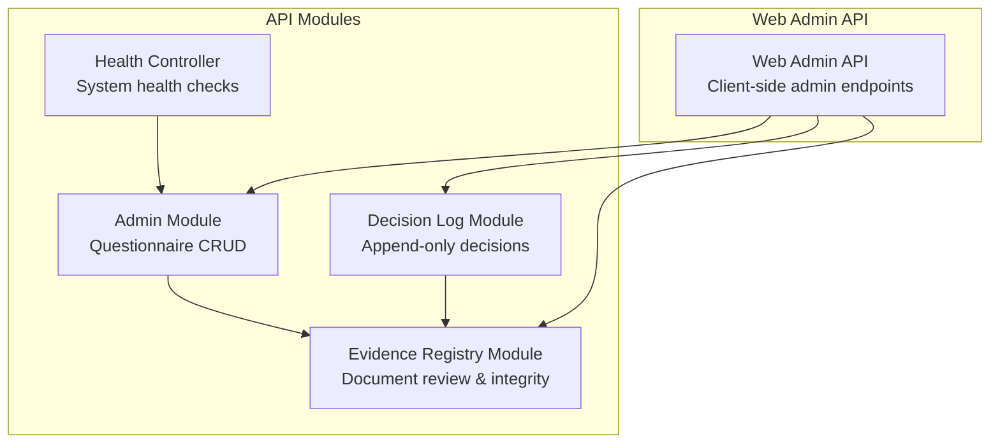
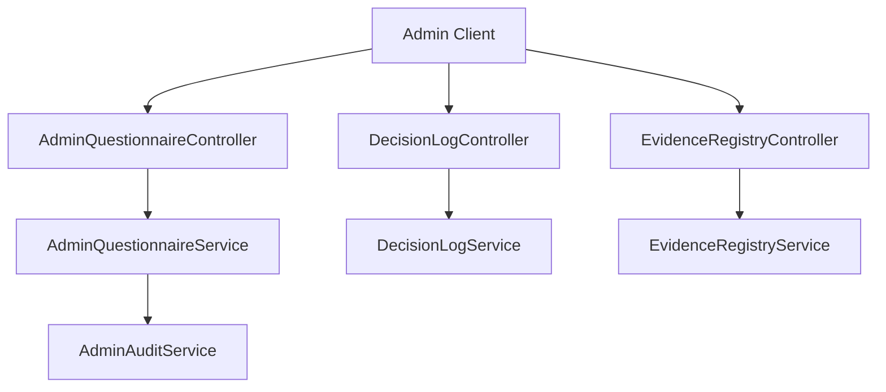
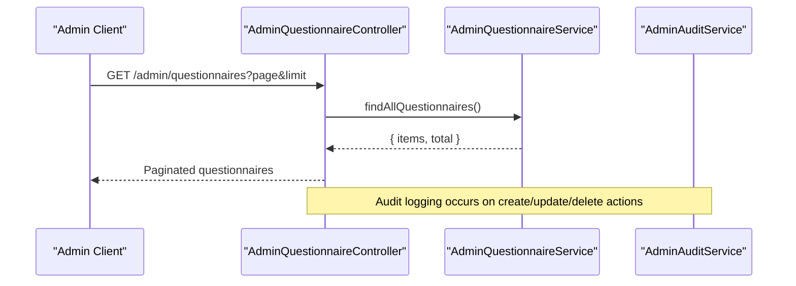
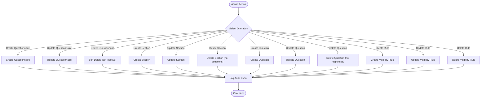
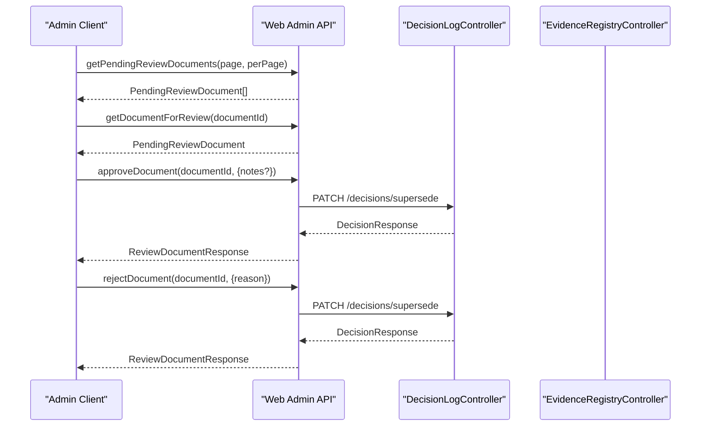
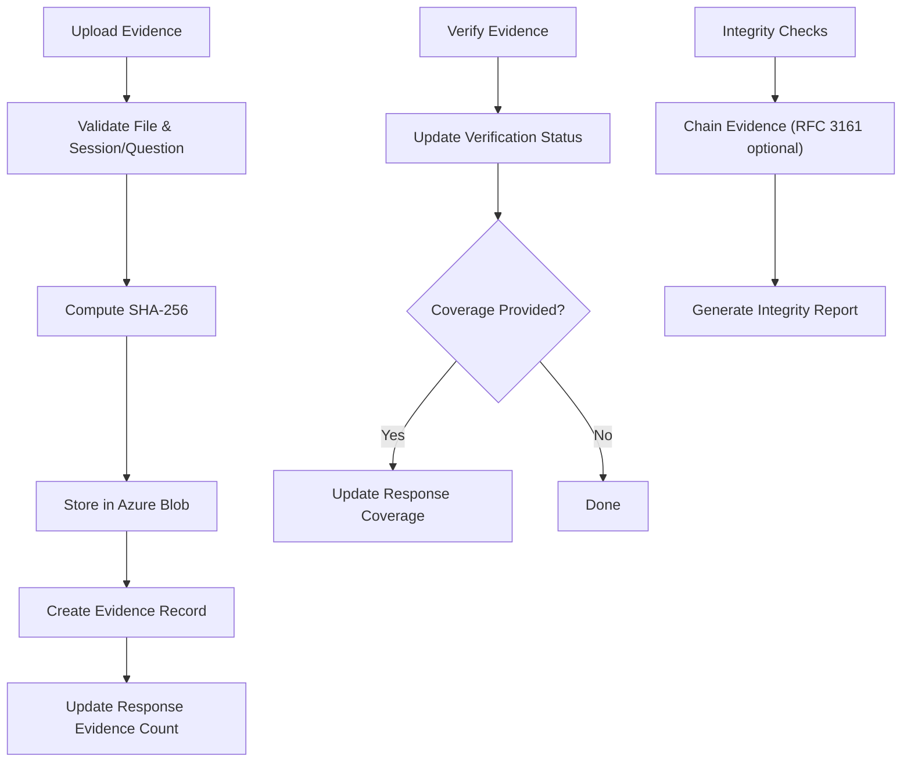
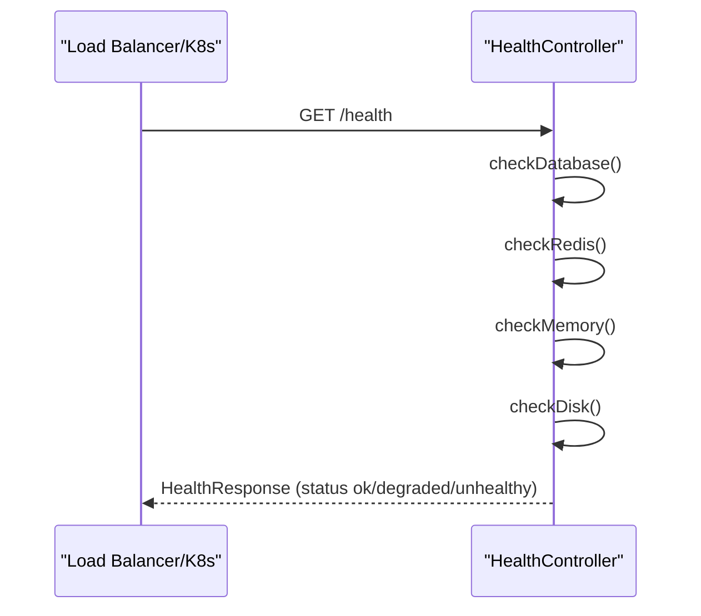
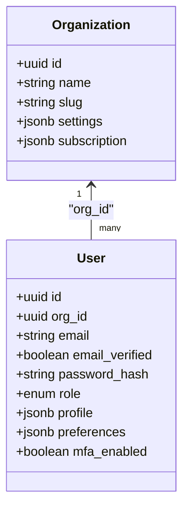
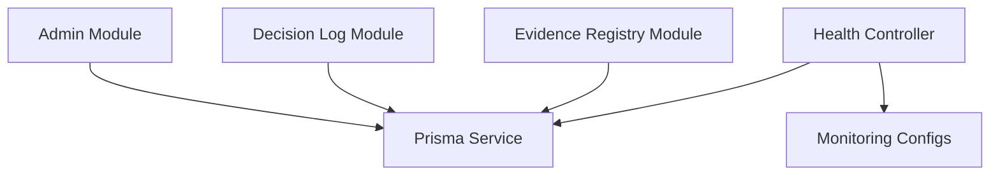

# Administrative Workflows

<cite>
**Referenced Files in This Document**
- [admin.module.ts](file://apps/api/src/modules/admin/admin.module.ts)
- [admin-questionnaire.controller.ts](file://apps/api/src/modules/admin/controllers/admin-questionnaire.controller.ts)
- [admin-questionnaire.service.ts](file://apps/api/src/modules/admin/services/admin-questionnaire.service.ts)
- [admin-audit.service.ts](file://apps/api/src/modules/admin/services/admin-audit.service.ts)
- [decision-log.module.ts](file://apps/api/src/modules/decision-log/decision-log.module.ts)
- [decision-log.service.ts](file://apps/api/src/modules/decision-log/decision-log.service.ts)
- [decision-log.controller.ts](file://apps/api/src/modules/decision-log/decision-log.controller.ts)
- [evidence-registry.module.ts](file://apps/api/src/modules/evidence-registry/evidence-registry.module.ts)
- [evidence-registry.service.ts](file://apps/api/src/modules/evidence-registry/evidence-registry.service.ts)
- [evidence-registry.controller.ts](file://apps/api/src/modules/evidence-registry/evidence-registry.controller.ts)
- [health.controller.ts](file://apps/api/src/health.controller.ts)
- [uptime-monitoring.config.ts](file://apps/api/src/config/uptime-monitoring.config.ts)
- [graceful-degradation.config.spec.ts](file://apps/api/src/config/graceful-degradation.config.spec.ts)
- [appinsights.config.ts](file://apps/api/src/config/appinsights.config.ts)
- [disaster-recovery.config.ts](file://apps/api/src/config/disaster-recovery.config.ts)
- [006-multi-tenancy-strategy.md](file://docs/adr/006-multi-tenancy-strategy.md)
- [05-data-models-db-architecture.md](file://docs/cto/05-data-models-db-architecture.md)
- [03-product-architecture.md](file://docs/cto/03-product-architecture.md)
- [admin.ts](file://apps/web/src/api/admin.ts)
- [dashboard.e2e.test.ts](file://e2e/admin/dashboard.e2e.test.ts)
- [admin-approval-workflow.flow.test.ts](file://apps/api/test/integration/admin-approval-workflow.flow.test.ts)
</cite>

## Table of Contents
1. [Introduction](#introduction)
2. [Project Structure](#project-structure)
3. [Core Components](#core-components)
4. [Architecture Overview](#architecture-overview)
5. [Detailed Component Analysis](#detailed-component-analysis)
6. [Dependency Analysis](#dependency-analysis)
7. [Performance Considerations](#performance-considerations)
8. [Troubleshooting Guide](#troubleshooting-guide)
9. [Conclusion](#conclusion)
10. [Appendices](#appendices)

## Introduction
This document provides comprehensive administrative workflow documentation for Quiz-to-Build platform administrators. It covers the administrative dashboard, user management, questionnaire configuration, evidence registry and decision logging for document reviews, system monitoring, multi-tenant administration, and operational procedures including backup and disaster recovery. Step-by-step guides are included for common administrative tasks such as user onboarding, questionnaire publishing, and system troubleshooting.

## Project Structure
The administrative functionality spans the API server modules and web application components:
- Admin module for questionnaire configuration and audit logging
- Decision log module for append-only decision records and approvals
- Evidence registry module for document review and integrity
- Health and monitoring configurations for system observability
- Multi-tenancy strategy and data models for tenant isolation

**Diagram sources**
- [admin.module.ts:1-13](file://apps/api/src/modules/admin/admin.module.ts#L1-L13)
- [decision-log.module.ts:1-25](file://apps/api/src/modules/decision-log/decision-log.module.ts#L1-L25)
- [evidence-registry.module.ts:1-27](file://apps/api/src/modules/evidence-registry/evidence-registry.module.ts#L1-L27)
- [health.controller.ts:1-410](file://apps/api/src/health.controller.ts#L1-L410)
- [admin.ts:62-120](file://apps/web/src/api/admin.ts#L62-L120)

**Section sources**
- [admin.module.ts:1-13](file://apps/api/src/modules/admin/admin.module.ts#L1-L13)
- [decision-log.module.ts:1-25](file://apps/api/src/modules/decision-log/decision-log.module.ts#L1-L25)
- [evidence-registry.module.ts:1-27](file://apps/api/src/modules/evidence-registry/evidence-registry.module.ts#L1-L27)
- [health.controller.ts:1-410](file://apps/api/src/health.controller.ts#L1-L410)
- [admin.ts:62-120](file://apps/web/src/api/admin.ts#L62-L120)

## Core Components
- Admin Questionnaire Management: Create, update, reorder, and soft-delete questionnaires, sections, questions, and visibility rules with audit logging.
- Decision Logging: Append-only decision records with status workflow (DRAFT → LOCKED → SUPERSEDED/AMENDED).
- Evidence Registry: Upload, verify, and manage evidence artifacts with integrity checks and CI artifact ingestion.
- System Monitoring: Health endpoints, uptime metrics, performance counters, and graceful degradation evaluation.
- Multi-tenancy: Shared schema with tenant isolation via row-level security and application guards.

**Section sources**
- [admin-questionnaire.controller.ts:1-275](file://apps/api/src/modules/admin/controllers/admin-questionnaire.controller.ts#L1-L275)
- [admin-questionnaire.service.ts:1-575](file://apps/api/src/modules/admin/services/admin-questionnaire.service.ts#L1-L575)
- [decision-log.service.ts:1-396](file://apps/api/src/modules/decision-log/decision-log.service.ts#L1-L396)
- [evidence-registry.service.ts:1-953](file://apps/api/src/modules/evidence-registry/evidence-registry.service.ts#L1-L953)
- [health.controller.ts:1-410](file://apps/api/src/health.controller.ts#L1-L410)
- [006-multi-tenancy-strategy.md:47-96](file://docs/adr/006-multi-tenancy-strategy.md#L47-L96)

## Architecture Overview
Administrative workflows integrate through API controllers and services with database persistence and audit trails. Decision logging enforces append-only compliance, while evidence registry ensures verifiable document submissions. Monitoring exposes health and performance metrics for system oversight.

**Diagram sources**
- [admin-questionnaire.controller.ts:1-275](file://apps/api/src/modules/admin/controllers/admin-questionnaire.controller.ts#L1-L275)
- [admin-questionnaire.service.ts:1-575](file://apps/api/src/modules/admin/services/admin-questionnaire.service.ts#L1-L575)
- [admin-audit.service.ts:1-58](file://apps/api/src/modules/admin/services/admin-audit.service.ts#L1-L58)
- [decision-log.controller.ts:1-279](file://apps/api/src/modules/decision-log/decision-log.controller.ts#L1-L279)
- [decision-log.service.ts:1-396](file://apps/api/src/modules/decision-log/decision-log.service.ts#L1-L396)
- [evidence-registry.controller.ts:1-463](file://apps/api/src/modules/evidence-registry/evidence-registry.controller.ts#L1-L463)
- [evidence-registry.service.ts:1-953](file://apps/api/src/modules/evidence-registry/evidence-registry.service.ts#L1-L953)

## Detailed Component Analysis

### Administrative Dashboard and User Management
- Dashboard access is role-guarded for ADMIN and SUPER_ADMIN.
- User roles and organization relationships are defined in the data model.
- Multi-tenancy is enforced via tenant ID columns and row-level security.

**Diagram sources**
- [admin-questionnaire.controller.ts:46-61](file://apps/api/src/modules/admin/controllers/admin-questionnaire.controller.ts#L46-L61)
- [admin-questionnaire.service.ts:46-62](file://apps/api/src/modules/admin/services/admin-questionnaire.service.ts#L46-L62)
- [admin-audit.service.ts:21-44](file://apps/api/src/modules/admin/services/admin-audit.service.ts#L21-L44)

**Section sources**
- [admin-questionnaire.controller.ts:46-107](file://apps/api/src/modules/admin/controllers/admin-questionnaire.controller.ts#L46-L107)
- [05-data-models-db-architecture.md:858-906](file://docs/cto/05-data-models-db-architecture.md#L858-L906)
- [03-product-architecture.md:987-1007](file://docs/cto/03-product-architecture.md#L987-L1007)
- [006-multi-tenancy-strategy.md:47-96](file://docs/adr/006-multi-tenancy-strategy.md#L47-L96)

### Questionnaire Configuration Workflows
- CRUD operations for questionnaires, sections, questions, and visibility rules.
- Reordering within questionnaires and sections.
- Audit trail for all administrative actions.

**Diagram sources**
- [admin-questionnaire.controller.ts:72-273](file://apps/api/src/modules/admin/controllers/admin-questionnaire.controller.ts#L72-L273)
- [admin-questionnaire.service.ts:94-573](file://apps/api/src/modules/admin/services/admin-questionnaire.service.ts#L94-L573)
- [admin-audit.service.ts:21-44](file://apps/api/src/modules/admin/services/admin-audit.service.ts#L21-L44)

**Section sources**
- [admin-questionnaire.controller.ts:72-273](file://apps/api/src/modules/admin/controllers/admin-questionnaire.controller.ts#L72-L273)
- [admin-questionnaire.service.ts:94-573](file://apps/api/src/modules/admin/services/admin-questionnaire.service.ts#L94-L573)

### Approval Workflow System for Document Reviews
- Decision log maintains append-only records with status transitions.
- Evidence registry supports verification and coverage updates.
- Admin API provides endpoints to fetch pending documents and approve/reject.

**Diagram sources**
- [admin.ts:78-119](file://apps/web/src/api/admin.ts#L78-L119)
- [decision-log.controller.ts:127-156](file://apps/api/src/modules/decision-log/decision-log.controller.ts#L127-L156)
- [evidence-registry.controller.ts:146-171](file://apps/api/src/modules/evidence-registry/evidence-registry.controller.ts#L146-L171)

**Section sources**
- [admin.ts:78-119](file://apps/web/src/api/admin.ts#L78-L119)
- [decision-log.service.ts:135-188](file://apps/api/src/modules/decision-log/decision-log.service.ts#L135-L188)
- [evidence-registry.service.ts:215-245](file://apps/api/src/modules/evidence-registry/evidence-registry.service.ts#L215-L245)

### Evidence Registry Management and Compliance Tracking
- Upload evidence with SHA-256 hashing and Azure Blob Storage integration.
- Verify evidence and update coverage levels with transition validation.
- Integrity checks, hash chain linking, and CI artifact ingestion.

**Diagram sources**
- [evidence-registry.controller.ts:135-141](file://apps/api/src/modules/evidence-registry/evidence-registry.controller.ts#L135-L141)
- [evidence-registry.service.ts:165-208](file://apps/api/src/modules/evidence-registry/evidence-registry.service.ts#L165-L208)
- [evidence-registry.controller.ts:166-171](file://apps/api/src/modules/evidence-registry/evidence-registry.controller.ts#L166-L171)
- [evidence-registry.service.ts:215-245](file://apps/api/src/modules/evidence-registry/evidence-registry.service.ts#L215-L245)

**Section sources**
- [evidence-registry.controller.ts:1-463](file://apps/api/src/modules/evidence-registry/evidence-registry.controller.ts#L1-L463)
- [evidence-registry.service.ts:1-953](file://apps/api/src/modules/evidence-registry/evidence-registry.service.ts#L1-L953)

### System Monitoring and Health
- Health controller provides comprehensive health, liveness, readiness, and startup probes.
- Uptime monitoring configuration defines status messages and metrics.
- Performance counters and graceful degradation thresholds guide operational decisions.

**Diagram sources**
- [health.controller.ts:68-141](file://apps/api/src/health.controller.ts#L68-L141)
- [uptime-monitoring.config.ts:270-315](file://apps/api/src/config/uptime-monitoring.config.ts#L270-L315)

**Section sources**
- [health.controller.ts:1-410](file://apps/api/src/health.controller.ts#L1-L410)
- [uptime-monitoring.config.ts:270-315](file://apps/api/src/config/uptime-monitoring.config.ts#L270-L315)
- [appinsights.config.ts:434-483](file://apps/api/src/config/appinsights.config.ts#L434-L483)
- [graceful-degradation.config.spec.ts:582-686](file://apps/api/src/config/graceful-degradation.config.spec.ts#L582-L686)

### Multi-tenant Administration and Organization Hierarchies
- Shared schema with organizationId foreign keys and PostgreSQL row-level security.
- Application-level guards set tenant context per request.
- Data models define organizations and users with role-based access.

**Diagram sources**
- [05-data-models-db-architecture.md:858-906](file://docs/cto/05-data-models-db-architecture.md#L858-L906)
- [006-multi-tenancy-strategy.md:47-96](file://docs/adr/006-multi-tenancy-strategy.md#L47-L96)

**Section sources**
- [006-multi-tenancy-strategy.md:47-96](file://docs/adr/006-multi-tenancy-strategy.md#L47-L96)
- [05-data-models-db-architecture.md:858-906](file://docs/cto/05-data-models-db-architecture.md#L858-L906)
- [03-product-architecture.md:987-1007](file://docs/cto/03-product-architecture.md#L987-L1007)

## Dependency Analysis
Administrative modules depend on shared database and configuration layers. Decision logging and evidence registry share audit and integrity concerns. Health monitoring integrates with telemetry and configuration.

**Diagram sources**
- [admin.module.ts:1-13](file://apps/api/src/modules/admin/admin.module.ts#L1-L13)
- [decision-log.module.ts:1-25](file://apps/api/src/modules/decision-log/decision-log.module.ts#L1-L25)
- [evidence-registry.module.ts:1-27](file://apps/api/src/modules/evidence-registry/evidence-registry.module.ts#L1-L27)
- [health.controller.ts:1-410](file://apps/api/src/health.controller.ts#L1-L410)
- [uptime-monitoring.config.ts:270-315](file://apps/api/src/config/uptime-monitoring.config.ts#L270-L315)

**Section sources**
- [admin.module.ts:1-13](file://apps/api/src/modules/admin/admin.module.ts#L1-L13)
- [decision-log.module.ts:1-25](file://apps/api/src/modules/decision-log/decision-log.module.ts#L1-L25)
- [evidence-registry.module.ts:1-27](file://apps/api/src/modules/evidence-registry/evidence-registry.module.ts#L1-L27)
- [health.controller.ts:1-410](file://apps/api/src/health.controller.ts#L1-L410)

## Performance Considerations
- Use paginated queries for large datasets (questionnaires, evidence).
- Batch operations for bulk verification to reduce N+1 patterns.
- Monitor memory usage thresholds to prevent degraded performance.
- Track key performance metrics including API response time, throughput, and scoring performance.

[No sources needed since this section provides general guidance]

## Troubleshooting Guide
- Use health endpoints to diagnose service status and dependency issues.
- Review audit logs for administrative actions and decision changes.
- Validate evidence integrity and chain status for compliance verification.
- Evaluate system health thresholds to identify degradation or outages.

**Section sources**
- [health.controller.ts:68-205](file://apps/api/src/health.controller.ts#L68-L205)
- [admin-audit.service.ts:21-44](file://apps/api/src/modules/admin/services/admin-audit.service.ts#L21-L44)
- [evidence-registry.service.ts:700-744](file://apps/api/src/modules/evidence-registry/evidence-registry.service.ts#L700-L744)

## Conclusion
The Quiz-to-Build administrative framework provides robust tools for questionnaire management, document review workflows, evidence governance, and system observability. Multi-tenancy is enforced through database and application-layer safeguards. Administrators can rely on audit trails, health monitoring, and compliance-focused features to maintain a secure and transparent platform.

[No sources needed since this section summarizes without analyzing specific files]

## Appendices

### Step-by-Step Administrative Tasks

- User Onboarding
  - Create organization and invite users with appropriate roles.
  - Assign roles (CLIENT, DEVELOPER, ADMIN, SUPER_ADMIN) and configure MFA if required.
  - Verify organization subscription and feature access.

  **Section sources**
  - [05-data-models-db-architecture.md:858-906](file://docs/cto/05-data-models-db-architecture.md#L858-L906)
  - [03-product-architecture.md:987-1007](file://docs/cto/03-product-architecture.md#L987-L1007)

- Questionnaire Publishing
  - Create questionnaire with metadata and sections.
  - Add questions and configure visibility rules.
  - Reorder sections and questions as needed.
  - Publish by ensuring proper status and activation flags.

  **Section sources**
  - [admin-questionnaire.controller.ts:72-221](file://apps/api/src/modules/admin/controllers/admin-questionnaire.controller.ts#L72-L221)
  - [admin-questionnaire.service.ts:94-464](file://apps/api/src/modules/admin/services/admin-questionnaire.service.ts#L94-L464)

- Document Review and Approval
  - Fetch pending documents via admin API.
  - Review document packages and approve or reject with notes.
  - Use decision log to lock or supersede decisions as needed.

  **Section sources**
  - [admin.ts:78-119](file://apps/web/src/api/admin.ts#L78-L119)
  - [decision-log.controller.ts:127-156](file://apps/api/src/modules/decision-log/decision-log.controller.ts#L127-L156)

- Evidence Management
  - Upload evidence files with supported MIME types and size limits.
  - Verify evidence and update coverage levels with transition validation.
  - Perform integrity checks and generate reports.

  **Section sources**
  - [evidence-registry.controller.ts:135-171](file://apps/api/src/modules/evidence-registry/evidence-registry.controller.ts#L135-L171)
  - [evidence-registry.service.ts:165-245](file://apps/api/src/modules/evidence-registry/evidence-registry.service.ts#L165-L245)

- System Maintenance and Emergency Response
  - Monitor health status and alerts.
  - Execute disaster recovery procedures based on incident severity.
  - Validate backup restoration and failover readiness.

  **Section sources**
  - [health.controller.ts:68-205](file://apps/api/src/health.controller.ts#L68-L205)
  - [disaster-recovery.config.ts:610-790](file://apps/api/src/config/disaster-recovery.config.ts#L610-L790)

### Reporting and Analytics
- Usage metrics: Track questionnaire completion rates, sessions active, and scoring performance.
- System health: Monitor uptime, response times, availability, and error rates.
- Compliance reporting: Export decision logs and evidence integrity reports for audits.

**Section sources**
- [appinsights.config.ts:434-483](file://apps/api/src/config/appinsights.config.ts#L434-L483)
- [uptime-monitoring.config.ts:270-315](file://apps/api/src/config/uptime-monitoring.config.ts#L270-L315)
- [decision-log.service.ts:235-269](file://apps/api/src/modules/decision-log/decision-log.service.ts#L235-L269)
- [evidence-registry.service.ts:750-800](file://apps/api/src/modules/evidence-registry/evidence-registry.service.ts#L750-L800)