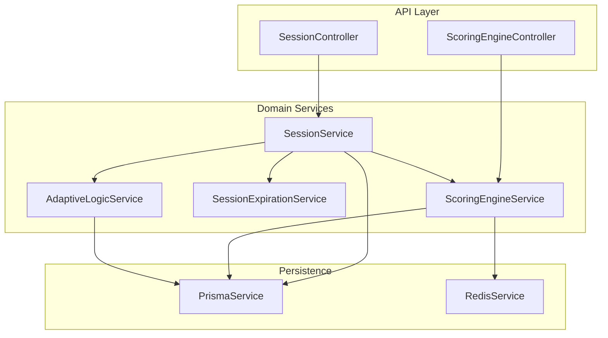
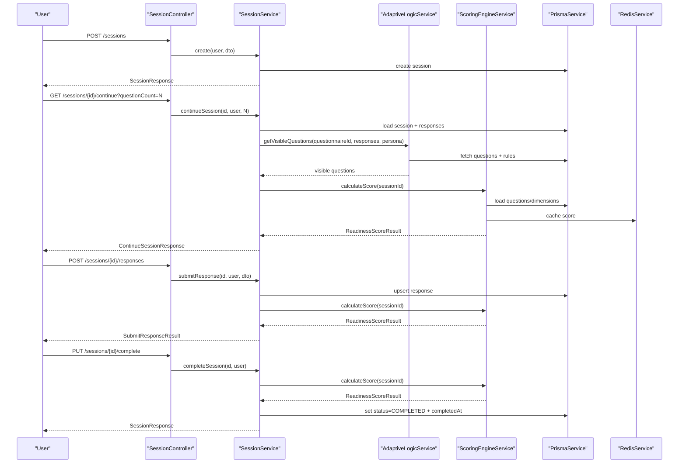
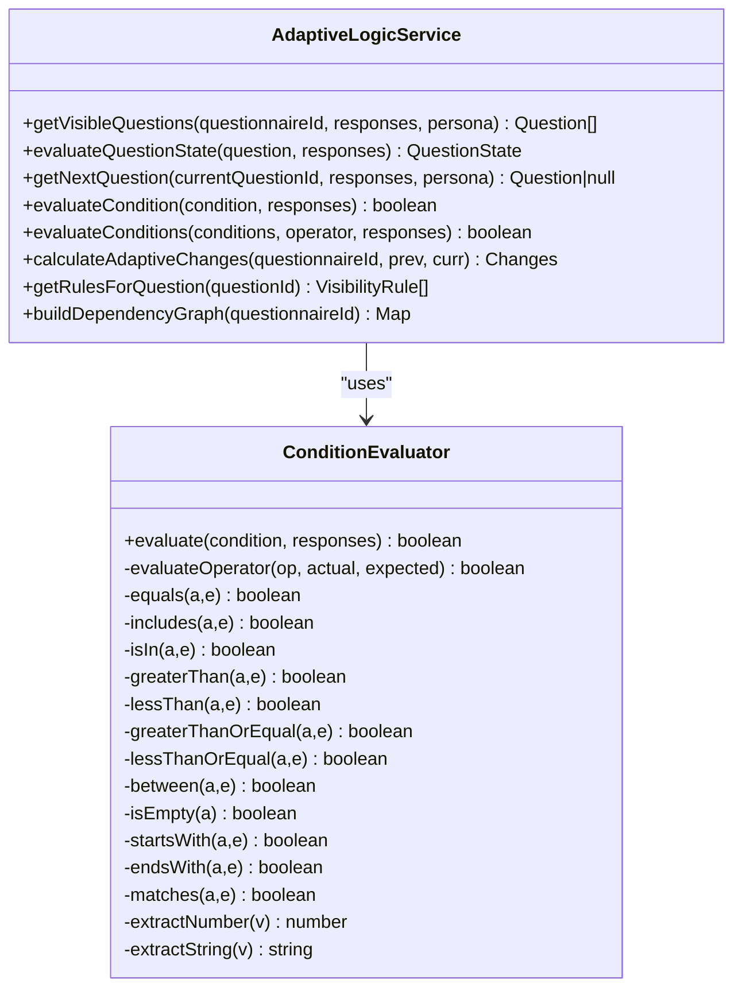
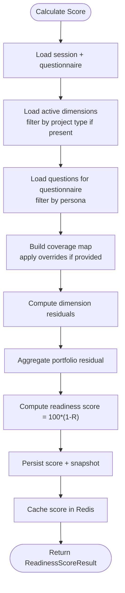
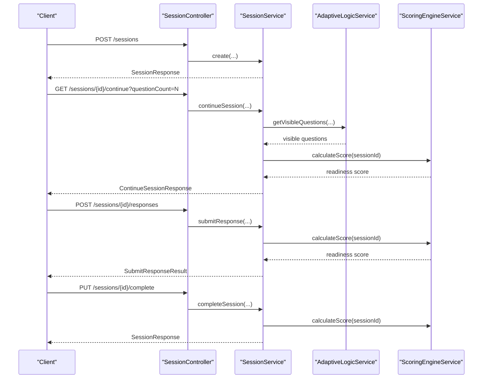
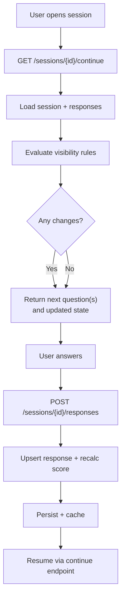
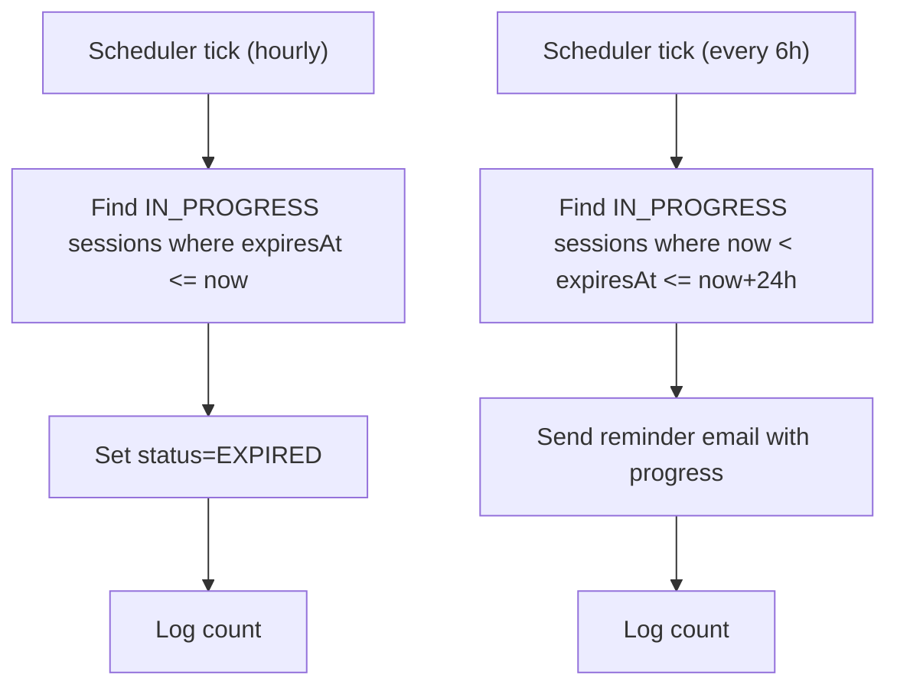
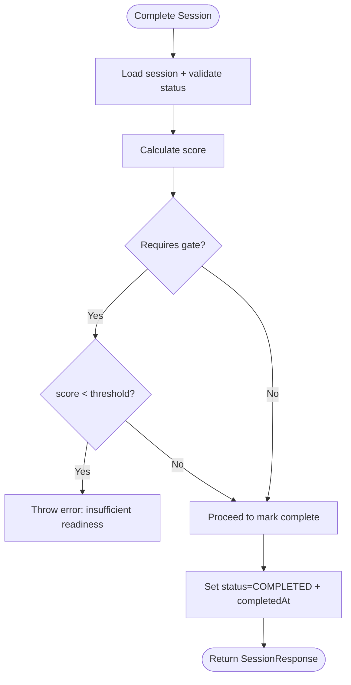
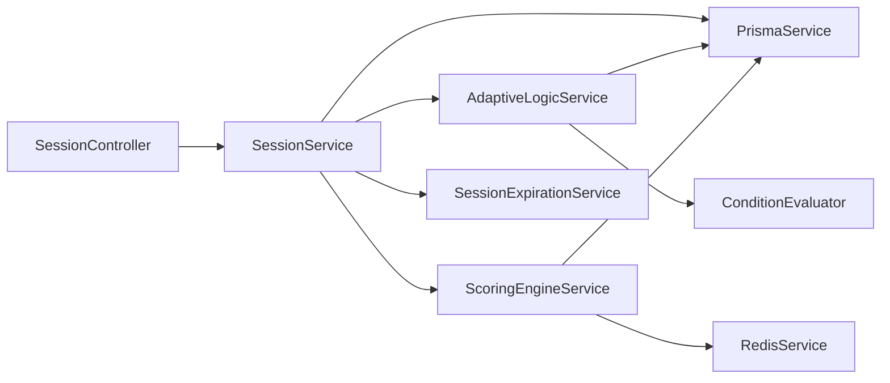

# Assessment Workflow

<cite>
**Referenced Files in This Document**
- [adaptive-logic.service.ts](file://apps/api/src/modules/adaptive-logic/adaptive-logic.service.ts)
- [condition.evaluator.ts](file://apps/api/src/modules/adaptive-logic/evaluators/condition.evaluator.ts)
- [adaptive-logic.module.ts](file://apps/api/src/modules/adaptive-logic/adaptive-logic.module.ts)
- [scoring-engine.service.ts](file://apps/api/src/modules/scoring-engine/scoring-engine.service.ts)
- [scoring-engine.controller.ts](file://apps/api/src/modules/scoring-engine/scoring-engine.controller.ts)
- [scoring-engine.module.ts](file://apps/api/src/modules/scoring-engine/scoring-engine.module.ts)
- [session.controller.ts](file://apps/api/src/modules/session/session.controller.ts)
- [session-expiration.service.ts](file://apps/api/src/modules/session/session-expiration.service.ts)
- [session.module.ts](file://apps/api/src/modules/session/session.module.ts)
- [questionnaire.module.ts](file://apps/api/src/modules/questionnaire/questionnaire.module.ts)
- [create-session.dto.ts](file://apps/api/src/modules/session/dto/create-session.dto.ts)
- [submit-response.dto.ts](file://apps/api/src/modules/session/dto/submit-response.dto.ts)
- [continue-session.dto.ts](file://apps/api/src/modules/session/dto/continue-session.dto.ts)
- [questionnaire-scoring-session.flow.test.ts](file://apps/api/test/integration/questionnaire-scoring-session.flow.test.ts)
- [adaptive-logic.md](file://docs/questionnaire/adaptive-logic.md)
</cite>

## Table of Contents
1. [Introduction](#introduction)
2. [Project Structure](#project-structure)
3. [Core Components](#core-components)
4. [Architecture Overview](#architecture-overview)
5. [Detailed Component Analysis](#detailed-component-analysis)
6. [Dependency Analysis](#dependency-analysis)
7. [Performance Considerations](#performance-considerations)
8. [Troubleshooting Guide](#troubleshooting-guide)
9. [Conclusion](#conclusion)
10. [Appendices](#appendices)

## Introduction
This document describes the end-to-end assessment workflow for Quiz-to-Build, covering the lifecycle from invitation through completion. It explains how adaptive logic controls question visibility and flow progression, how the scoring engine provides real-time feedback, and how sessions are managed, saved, resumed, and expired. It also outlines completion criteria, readiness gating, and practical examples for common assessment types such as business case development, compliance readiness, strategic planning, and due diligence processes. Collaborative and multi-user considerations, conflict resolution, and troubleshooting guidance are included to support reliable operation across diverse use cases.

## Project Structure
The assessment workflow spans three primary modules:
- Session module: orchestrates session creation, continuation, response submission, and completion.
- Adaptive Logic module: evaluates visibility, requirement, and branching rules based on responses.
- Scoring Engine module: computes readiness scores, trends, and prioritizes next questions.

**Diagram sources**
- [session.controller.ts:1-166](file://apps/api/src/modules/session/session.controller.ts#L1-L166)
- [scoring-engine.controller.ts:1-166](file://apps/api/src/modules/scoring-engine/scoring-engine.controller.ts#L1-L166)
- [session.module.ts:1-24](file://apps/api/src/modules/session/session.module.ts#L1-L24)
- [adaptive-logic.module.ts:1-12](file://apps/api/src/modules/adaptive-logic/adaptive-logic.module.ts#L1-L12)
- [scoring-engine.module.ts:1-23](file://apps/api/src/modules/scoring-engine/scoring-engine.module.ts#L1-L23)

**Section sources**
- [session.controller.ts:1-166](file://apps/api/src/modules/session/session.controller.ts#L1-L166)
- [session.module.ts:1-24](file://apps/api/src/modules/session/session.module.ts#L1-L24)
- [adaptive-logic.module.ts:1-12](file://apps/api/src/modules/adaptive-logic/adaptive-logic.module.ts#L1-L12)
- [scoring-engine.module.ts:1-23](file://apps/api/src/modules/scoring-engine/scoring-engine.module.ts#L1-L23)

## Core Components
- SessionController: Exposes endpoints to create, continue, submit responses, and complete sessions. It enforces JWT-based authentication and paginated listing of sessions.
- AdaptiveLogicService: Computes which questions are visible and required based on current responses and rule sets, and supports next-question derivation.
- ScoringEngineService: Calculates readiness scores, completion metrics, and ranks next questions by expected score improvement (NQS).
- SessionExpirationService: Automatically expires stale sessions and sends reminder notifications.

**Section sources**
- [session.controller.ts:1-166](file://apps/api/src/modules/session/session.controller.ts#L1-L166)
- [adaptive-logic.service.ts:1-285](file://apps/api/src/modules/adaptive-logic/adaptive-logic.service.ts#L1-L285)
- [scoring-engine.service.ts:1-387](file://apps/api/src/modules/scoring-engine/scoring-engine.service.ts#L1-L387)
- [session-expiration.service.ts:1-85](file://apps/api/src/modules/session/session-expiration.service.ts#L1-L85)

## Architecture Overview
The assessment workflow integrates session orchestration, adaptive logic, and scoring in a cohesive pipeline. Participants start a session, receive adaptive questions, submit responses, and receive immediate scoring updates. Sessions can be paused/resumed and are automatically expired according to configured policies.

**Diagram sources**
- [session.controller.ts:1-166](file://apps/api/src/modules/session/session.controller.ts#L1-L166)
- [adaptive-logic.service.ts:1-285](file://apps/api/src/modules/adaptive-logic/adaptive-logic.service.ts#L1-L285)
- [scoring-engine.service.ts:1-387](file://apps/api/src/modules/scoring-engine/scoring-engine.service.ts#L1-L387)
- [session-expiration.service.ts:1-85](file://apps/api/src/modules/session/session-expiration.service.ts#L1-L85)

## Detailed Component Analysis

### Adaptive Logic Engine
The Adaptive Logic Engine evaluates visibility, requirement, and branching rules to tailor the questionnaire dynamically. It supports nested conditions, logical operators, and priority-driven rule application.

**Diagram sources**
- [adaptive-logic.service.ts:1-285](file://apps/api/src/modules/adaptive-logic/adaptive-logic.service.ts#L1-L285)
- [condition.evaluator.ts:1-382](file://apps/api/src/modules/adaptive-logic/evaluators/condition.evaluator.ts#L1-L382)

Key behaviors:
- Visibility rules determine whether a question is shown or hidden based on evaluated conditions.
- Requirement rules toggle whether a question is mandatory.
- Branching rules derive the next question in the flow among visible questions.
- Conditions support equality, inclusion, numeric comparisons, range checks, emptiness, and pattern matching.

**Section sources**
- [adaptive-logic.service.ts:1-285](file://apps/api/src/modules/adaptive-logic/adaptive-logic.service.ts#L1-L285)
- [condition.evaluator.ts:1-382](file://apps/api/src/modules/adaptive-logic/evaluators/condition.evaluator.ts#L1-L382)
- [adaptive-logic.md:1-1031](file://docs/questionnaire/adaptive-logic.md#L1-L1031)

### Scoring Engine Integration
The Scoring Engine computes readiness scores and provides prioritized next questions. It caches results and persists snapshots for analytics.

**Diagram sources**
- [scoring-engine.service.ts:1-387](file://apps/api/src/modules/scoring-engine/scoring-engine.service.ts#L1-L387)

Additional capabilities:
- Next Questions Service (NQS): Ranks questions by expected score lift ΔScore_i = 100 × W_d(i) × S_i × (1 - C_i) / Σ S_j.
- Analytics: Historical trends, benchmarks, and dimension-level insights.

**Section sources**
- [scoring-engine.service.ts:1-387](file://apps/api/src/modules/scoring-engine/scoring-engine.service.ts#L1-L387)
- [scoring-engine.controller.ts:1-166](file://apps/api/src/modules/scoring-engine/scoring-engine.controller.ts#L1-L166)

### Session Lifecycle Management
Endpoints and flows:
- Create session: POST /sessions with questionnaireId, optional projectTypeId, ideaCaptureId, persona, and industry.
- Continue session: GET /sessions/{id}/continue with optional questionCount (1–5).
- Get next questions: GET /sessions/{id}/questions/next with optional count.
- Submit response: POST /sessions/{id}/responses with questionId and value; optional timeSpentSeconds.
- Update response: PUT /sessions/{id}/responses/{questionId}.
- Complete session: PUT /sessions/{id}/complete.

**Diagram sources**
- [session.controller.ts:1-166](file://apps/api/src/modules/session/session.controller.ts#L1-L166)
- [adaptive-logic.service.ts:1-285](file://apps/api/src/modules/adaptive-logic/adaptive-logic.service.ts#L1-L285)
- [scoring-engine.service.ts:1-387](file://apps/api/src/modules/scoring-engine/scoring-engine.service.ts#L1-L387)

**Section sources**
- [session.controller.ts:1-166](file://apps/api/src/modules/session/session.controller.ts#L1-L166)
- [create-session.dto.ts:1-40](file://apps/api/src/modules/session/dto/create-session.dto.ts#L1-L40)
- [submit-response.dto.ts:1-22](file://apps/api/src/modules/session/dto/submit-response.dto.ts#L1-L22)
- [continue-session.dto.ts:1-14](file://apps/api/src/modules/session/dto/continue-session.dto.ts#L1-L14)

### Auto-save and Session Resumption
Auto-save occurs after each response submission via the scoring engine update. Sessions can be resumed using the continue endpoint, which:
- Loads current session and responses.
- Recomputes visibility using adaptive logic.
- Returns the next question(s) and progress metadata.
- Enforces a capped questionCount (default 1, max 5).

**Diagram sources**
- [session.controller.ts:1-166](file://apps/api/src/modules/session/session.controller.ts#L1-L166)
- [adaptive-logic.service.ts:1-285](file://apps/api/src/modules/adaptive-logic/adaptive-logic.service.ts#L1-L285)
- [scoring-engine.service.ts:1-387](file://apps/api/src/modules/scoring-engine/scoring-engine.service.ts#L1-L387)

**Section sources**
- [session.controller.ts:88-113](file://apps/api/src/modules/session/session.controller.ts#L88-L113)
- [continue-session.dto.ts:1-14](file://apps/api/src/modules/session/dto/continue-session.dto.ts#L1-L14)

### Session Expiration Handling
Automated expiration and reminders:
- Hourly cron job transitions expired IN_PROGRESS sessions to EXPIRED.
- Every six hours, reminders are sent for sessions expiring within the next 24 hours, including progress percentage.

**Diagram sources**
- [session-expiration.service.ts:1-85](file://apps/api/src/modules/session/session-expiration.service.ts#L1-L85)

**Section sources**
- [session-expiration.service.ts:1-85](file://apps/api/src/modules/session/session-expiration.service.ts#L1-L85)

### Completion Criteria and Readiness Gating
Completion requires:
- Submitting responses and recalculating the score.
- Meeting readiness threshold if gating is enabled for the session.
- Marking the session as COMPLETED with completion timestamp.

**Diagram sources**
- [session.controller.ts:156-164](file://apps/api/src/modules/session/session.controller.ts#L156-L164)
- [scoring-engine.service.ts:1-387](file://apps/api/src/modules/scoring-engine/scoring-engine.service.ts#L1-L387)

**Section sources**
- [session.controller.ts:156-164](file://apps/api/src/modules/session/session.controller.ts#L156-L164)
- [scoring-engine.service.ts:1-387](file://apps/api/src/modules/scoring-engine/scoring-engine.service.ts#L1-L387)

### Validation Rules and DTOs
- CreateSessionDto: Validates questionnaireId, optional projectTypeId, ideaCaptureId, persona, and industry.
- SubmitResponseDto: Validates questionId, non-empty value payload, and optional timeSpentSeconds.
- ContinueSessionDto: Validates questionCount bounds (1–5).

These DTOs ensure robust input validation at the API boundary.

**Section sources**
- [create-session.dto.ts:1-40](file://apps/api/src/modules/session/dto/create-session.dto.ts#L1-L40)
- [submit-response.dto.ts:1-22](file://apps/api/src/modules/session/dto/submit-response.dto.ts#L1-L22)
- [continue-session.dto.ts:1-14](file://apps/api/src/modules/session/dto/continue-session.dto.ts#L1-L14)

### Workflow Examples by Assessment Type
- Business Case Development: Use persona filtering (e.g., CEO/BA) and industry context to tailor questions. Adaptive rules can branch based on business model or market segment. Real-time scoring helps prioritize missing evidence.
- Compliance Readiness: Apply projectTypeId to activate domain-specific dimensions and thresholds. Visibility rules can hide irrelevant compliance domains. NQS suggests remediation questions to close gaps.
- Strategic Planning: Persona-driven questions (e.g., CTO/CFO) shape visibility. Branching rules route to capability vs. governance tracks. Readiness trends inform iterative refinement.
- Due Diligence Processes: Industry-aware adaptive logic narrows focus to sector-specific risks. Session expiration reminders ensure timely completion.

[No sources needed since this section provides conceptual examples]

### Collaborative Assessment Scenarios and Conflict Resolution
- Multi-user sessions: The current session APIs are user-scoped via JWT guard and per-user session ownership. There is no built-in concurrent editing conflict resolution in the referenced code.
- Recommendations:
  - Serialize edits per question to avoid race conditions.
  - Use optimistic concurrency with versioned responses and merge strategies.
  - Consider a collaborative mode with real-time sync and conflict resolution at the UI layer.

[No sources needed since this section provides general guidance]

## Dependency Analysis
Module-level dependencies and coupling:
- SessionController depends on SessionService.
- SessionService depends on AdaptiveLogicService, ScoringEngineService, SessionExpirationService, and PrismaService.
- AdaptiveLogicService depends on PrismaService and ConditionEvaluator.
- ScoringEngineService depends on PrismaService and RedisService, and delegates analytics to strategies.
- Modules import each other via forwardRef to avoid circular dependencies.

**Diagram sources**
- [session.controller.ts:1-166](file://apps/api/src/modules/session/session.controller.ts#L1-L166)
- [session.module.ts:1-24](file://apps/api/src/modules/session/session.module.ts#L1-L24)
- [adaptive-logic.module.ts:1-12](file://apps/api/src/modules/adaptive-logic/adaptive-logic.module.ts#L1-L12)
- [scoring-engine.module.ts:1-23](file://apps/api/src/modules/scoring-engine/scoring-engine.module.ts#L1-L23)

**Section sources**
- [session.module.ts:1-24](file://apps/api/src/modules/session/session.module.ts#L1-L24)
- [adaptive-logic.module.ts:1-12](file://apps/api/src/modules/adaptive-logic/adaptive-logic.module.ts#L1-L12)
- [scoring-engine.module.ts:1-23](file://apps/api/src/modules/scoring-engine/scoring-engine.module.ts#L1-L23)

## Performance Considerations
- Caching: Scoring results are cached in Redis with TTL to reduce repeated computation.
- Batch scoring: The scoring engine supports batch calculation with controlled concurrency.
- Pagination and limits: Continue endpoint caps questionCount to minimize payload size.
- Indexing: Ensure database indexes on frequently queried fields (e.g., session.userId, question.section.questionnaireId, visibilityRule conditions) to optimize visibility and scoring queries.

[No sources needed since this section provides general guidance]

## Troubleshooting Guide
Common issues and resolutions:
- Session not found: Verify sessionId and user ownership; ensure JWT authentication is intact.
- Exceeded questionCount: The continue endpoint validates 1–5; adjust client requests accordingly.
- Incomplete session completion: Ensure sufficient responses are provided; readiness gating may block completion below threshold.
- Stale scores: Trigger a new score calculation after significant changes; cached results are invalidated when appropriate.
- Expiration reminders: Confirm scheduler is running and notification service is configured.

**Section sources**
- [session.controller.ts:88-113](file://apps/api/src/modules/session/session.controller.ts#L88-L113)
- [scoring-engine.service.ts:290-324](file://apps/api/src/modules/scoring-engine/scoring-engine.service.ts#L290-L324)
- [session-expiration.service.ts:1-85](file://apps/api/src/modules/session/session-expiration.service.ts#L1-L85)

## Conclusion
Quiz-to-Build’s assessment workflow combines adaptive logic and a scoring engine to deliver a dynamic, efficient, and informative experience. Sessions are resilient with auto-save, resumable state, and automated expiration handling. By leveraging persona and project-type contexts, organizations can tailor assessments to specific roles and domains while maintaining real-time feedback and actionable prioritization.

[No sources needed since this section summarizes without analyzing specific files]

## Appendices

### End-to-End Flow Test Reference
Integration tests demonstrate the end-to-end lifecycle, including readiness score calculation and session completion.

**Section sources**
- [questionnaire-scoring-session.flow.test.ts:183-219](file://apps/api/test/integration/questionnaire-scoring-session.flow.test.ts#L183-L219)