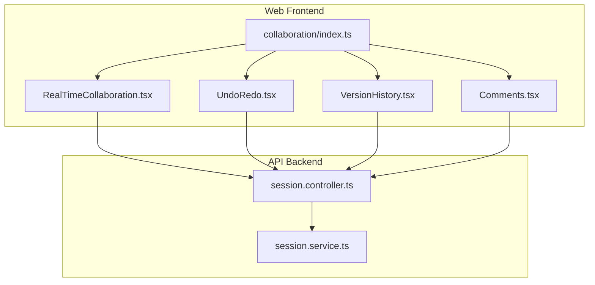
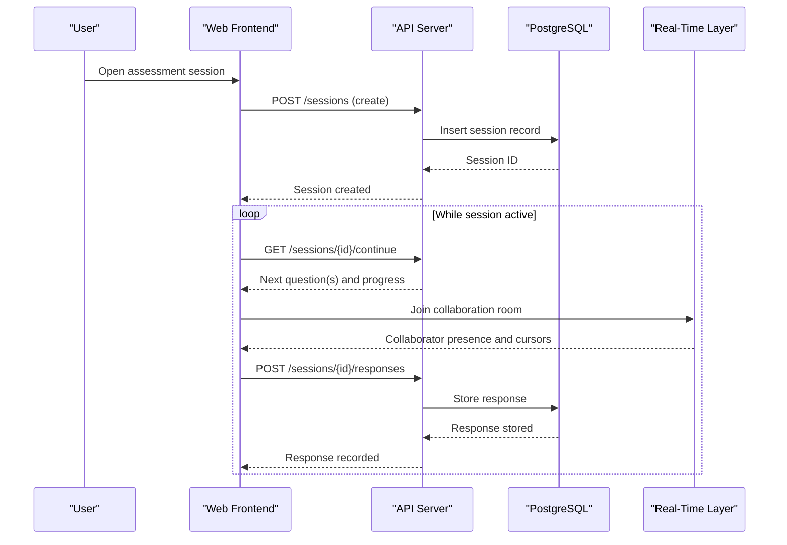
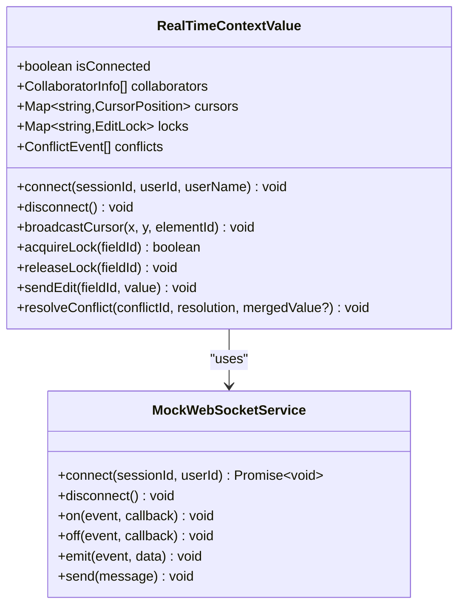
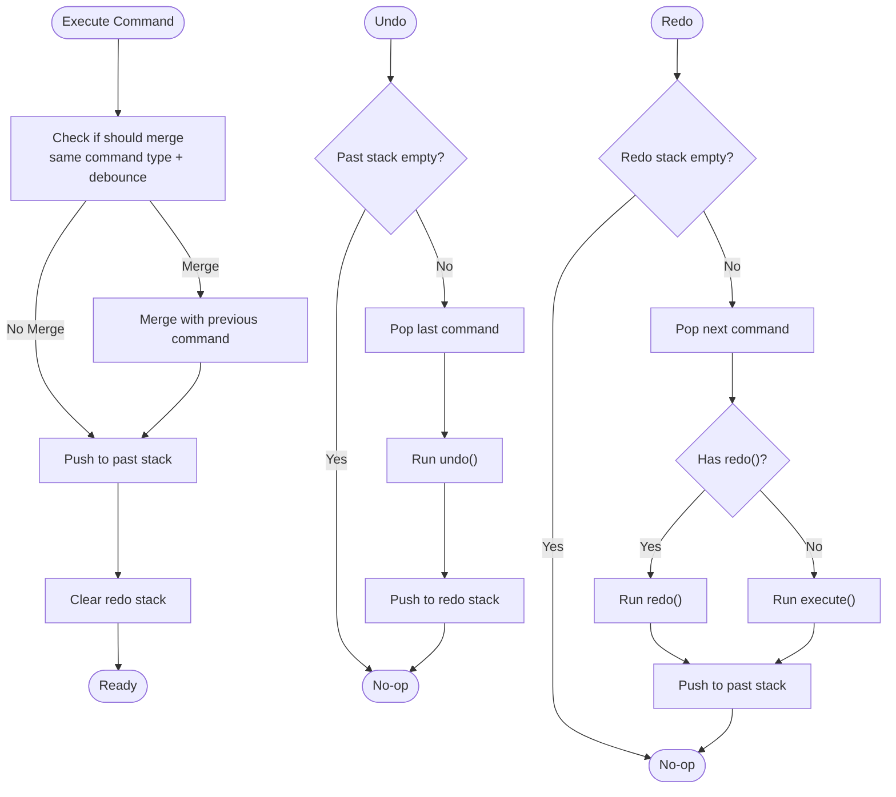
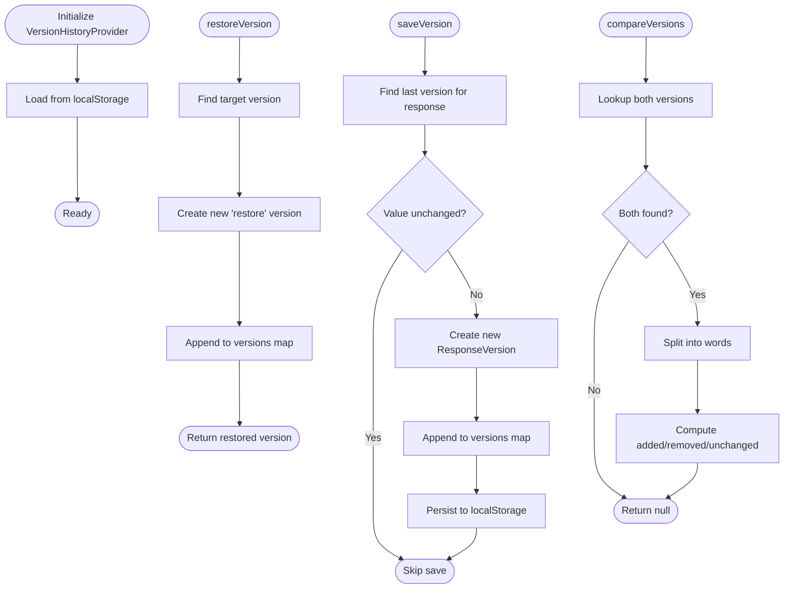
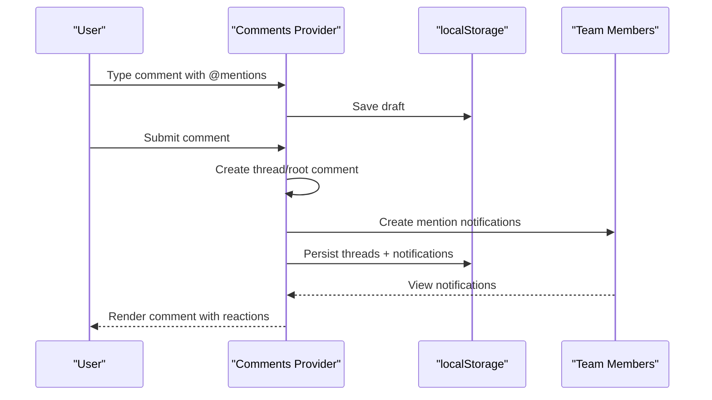
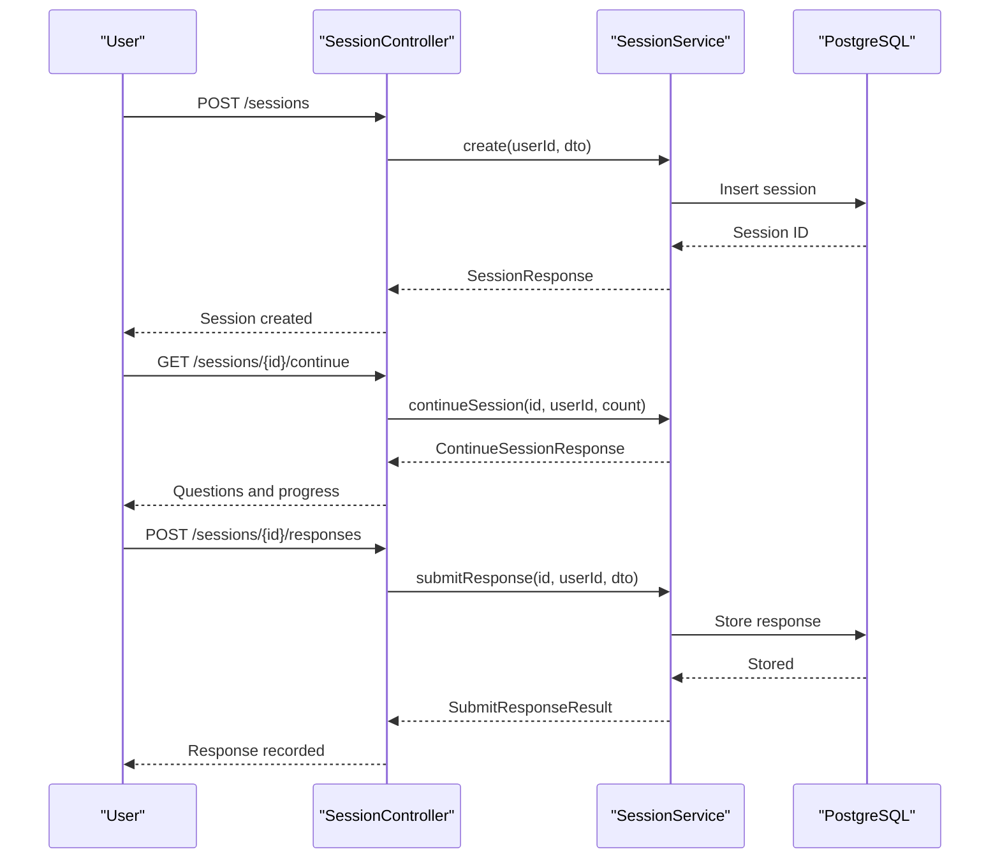
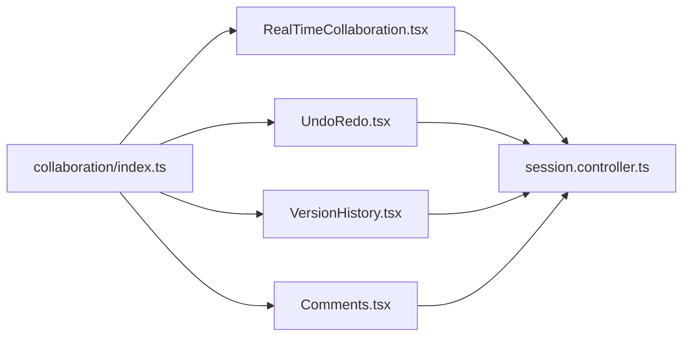

# Collaboration Features

<cite>
**Referenced Files in This Document**
- [RealTimeCollaboration.tsx](file://apps/web/src/components/collaboration/RealTimeCollaboration.tsx)
- [VersionHistory.tsx](file://apps/web/src/components/collaboration/VersionHistory.tsx)
- [UndoRedo.tsx](file://apps/web/src/components/collaboration/UndoRedo.tsx)
- [Comments.tsx](file://apps/web/src/components/collaboration/Comments.tsx)
- [index.ts](file://apps/web/src/components/collaboration/index.ts)
- [session.controller.ts](file://apps/api/src/modules/session/session.controller.ts)
- [session.service.ts](file://apps/api/src/modules/session/session.service.ts)
- [data-flow-trust-bondaries.md](file://docs/architecture/data-flow-trust-boundaries.md)
- [HelpCenter.tsx](file://apps/web/src/components/help/HelpCenter.tsx)
- [adapter-config.service.spec.ts](file://apps/api/src/modules/adapters/adapter-config.service.spec.ts)
</cite>

## Table of Contents
1. [Introduction](#introduction)
2. [Project Structure](#project-structure)
3. [Core Components](#core-components)
4. [Architecture Overview](#architecture-overview)
5. [Detailed Component Analysis](#detailed-component-analysis)
6. [Dependency Analysis](#dependency-analysis)
7. [Performance Considerations](#performance-considerations)
8. [Troubleshooting Guide](#troubleshooting-guide)
9. [Conclusion](#conclusion)

## Introduction
This document describes the collaboration features implemented in Quiz-to-Build, focusing on real-time collaboration, live commenting, version history tracking, and undo/redo functionality. It explains how multiple users can participate in assessments simultaneously, how comments integrate with assessment responses, and how changes are tracked and restored throughout the assessment lifecycle. It also covers conflict resolution strategies, collaborative review workflows, and integration with external collaboration tools.

## Project Structure
The collaboration features are implemented as React components in the web application and coordinated with the API session endpoints. The frontend provides:
- Real-time presence, cursors, locks, and conflict resolution
- Undo/redo stacks with command pattern
- Version history with comparison and restore
- Comment threads with mentions, reactions, and notifications

The backend exposes session endpoints for creating, continuing, and completing assessment sessions, which underpin collaborative participation.

**Diagram sources**
- [RealTimeCollaboration.tsx:1-759](file://apps/web/src/components/collaboration/RealTimeCollaboration.tsx#L1-L759)
- [UndoRedo.tsx:1-759](file://apps/web/src/components/collaboration/UndoRedo.tsx#L1-L759)
- [VersionHistory.tsx:1-637](file://apps/web/src/components/collaboration/VersionHistory.tsx#L1-L637)
- [Comments.tsx:1-1419](file://apps/web/src/components/collaboration/Comments.tsx#L1-L1419)
- [index.ts:1-8](file://apps/web/src/components/collaboration/index.ts#L1-L8)
- [session.controller.ts:1-166](file://apps/api/src/modules/session/session.controller.ts#L1-L166)
- [session.service.ts:1-116](file://apps/api/src/modules/session/session.service.ts#L1-L116)

**Section sources**
- [index.ts:1-8](file://apps/web/src/components/collaboration/index.ts#L1-L8)
- [session.controller.ts:1-166](file://apps/api/src/modules/session/session.controller.ts#L1-L166)
- [session.service.ts:1-116](file://apps/api/src/modules/session/session.service.ts#L1-L116)

## Core Components
- Real-time collaboration: Presence, cursor broadcasting, edit locks, conflict detection, and resolution UI.
- Undo/redo: Command pattern with mergeable text edits, keyboard shortcuts, and history navigation.
- Version history: Local storage-backed versioning with restore and word-level diffing.
- Comments: Threaded comments with mentions, reactions, notifications, and draft persistence.

**Section sources**
- [RealTimeCollaboration.tsx:1-759](file://apps/web/src/components/collaboration/RealTimeCollaboration.tsx#L1-L759)
- [UndoRedo.tsx:1-759](file://apps/web/src/components/collaboration/UndoRedo.tsx#L1-L759)
- [VersionHistory.tsx:1-637](file://apps/web/src/components/collaboration/VersionHistory.tsx#L1-L637)
- [Comments.tsx:1-1419](file://apps/web/src/components/collaboration/Comments.tsx#L1-L1419)

## Architecture Overview
The collaboration features integrate with the assessment session lifecycle. Users create or continue sessions via API endpoints, and the frontend components coordinate real-time updates, versioning, and comments.

**Diagram sources**
- [data-flow-trust-bondaries.md:107-168](file://docs/architecture/data-flow-trust-boundaries.md#L107-L168)
- [session.controller.ts:39-164](file://apps/api/src/modules/session/session.controller.ts#L39-L164)
- [session.service.ts:30-115](file://apps/api/src/modules/session/session.service.ts#L30-L115)

## Detailed Component Analysis

### Real-Time Collaboration
Real-time collaboration provides:
- Presence: Tracks online collaborators with join/leave events.
- Cursor tracking: Broadcasts cursor positions with throttling.
- Edit locks: Prevents simultaneous edits to the same field.
- Conflict detection: Detects concurrent edits and surfaces resolution UI.
- Typing indicators: Shows who is currently editing a field.

**Diagram sources**
- [RealTimeCollaboration.tsx:59-147](file://apps/web/src/components/collaboration/RealTimeCollaboration.tsx#L59-L147)

Key behaviors:
- Cursor broadcast is throttled to reduce network overhead.
- Edit locks are acquired on focus and released on blur.
- Conflicts are surfaced with resolution options: keep mine, use theirs, or merge.

Best practices:
- Use locks to prevent simultaneous edits to the same field.
- Provide clear conflict resolution UI with preview of both versions.
- Throttle cursor updates to balance responsiveness and bandwidth.

**Section sources**
- [RealTimeCollaboration.tsx:186-320](file://apps/web/src/components/collaboration/RealTimeCollaboration.tsx#L186-L320)
- [RealTimeCollaboration.tsx:321-759](file://apps/web/src/components/collaboration/RealTimeCollaboration.tsx#L321-L759)

### Undo/Redo
The undo/redo system implements a command pattern with:
- Command creation with execute/undo semantics.
- Automatic merging of rapid text edits within a debounce window.
- Keyboard shortcuts (Ctrl/Cmd + Z, Shift/Ctrl + Z, Ctrl/Cmd + Y).
- History navigation with descriptions and timestamps.

**Diagram sources**
- [UndoRedo.tsx:120-204](file://apps/web/src/components/collaboration/UndoRedo.tsx#L120-L204)

**Section sources**
- [UndoRedo.tsx:1-759](file://apps/web/src/components/collaboration/UndoRedo.tsx#L1-L759)

### Version History
Version history tracks changes to assessment responses:
- Saves versions on value change with debounced persistence.
- Stores up to a configured maximum per response.
- Provides restore capability and word-level diffs between versions.
- Persists to local storage for offline availability.

**Diagram sources**
- [VersionHistory.tsx:139-246](file://apps/web/src/components/collaboration/VersionHistory.tsx#L139-L246)

**Section sources**
- [VersionHistory.tsx:1-637](file://apps/web/src/components/collaboration/VersionHistory.tsx#L1-L637)

### Comments
The comment system enables threaded discussions on assessment questions:
- Mentions with autocomplete and notifications.
- Reactions with emoji picker.
- Draft persistence with auto-save.
- Pinning and resolving threads.
- Notifications for mentions, replies, reactions, and resolutions.

**Diagram sources**
- [Comments.tsx:268-343](file://apps/web/src/components/collaboration/Comments.tsx#L268-L343)
- [Comments.tsx:168-221](file://apps/web/src/components/collaboration/Comments.tsx#L168-L221)

**Section sources**
- [Comments.tsx:1-1419](file://apps/web/src/components/collaboration/Comments.tsx#L1-L1419)

### Session Sharing and Assessment Lifecycle
Session endpoints support collaborative participation:
- Create session
- List sessions
- Get session details
- Continue session (returns next questions and progress)
- Submit/update responses
- Complete session

**Diagram sources**
- [session.controller.ts:39-164](file://apps/api/src/modules/session/session.controller.ts#L39-L164)
- [session.service.ts:80-94](file://apps/api/src/modules/session/session.service.ts#L80-L94)

**Section sources**
- [session.controller.ts:1-166](file://apps/api/src/modules/session/session.controller.ts#L1-L166)
- [session.service.ts:1-116](file://apps/api/src/modules/session/session.service.ts#L1-L116)

## Dependency Analysis
- Frontend collaboration components are exported via a barrel index for easy consumption.
- Real-time collaboration uses a mock WebSocket service for development; production would replace this with a real WebSocket connection.
- Version history and comments rely on local storage for persistence.
- Undo/redo is purely client-side with no backend dependency.
- Session endpoints provide the backend foundation for collaborative assessment participation.

**Diagram sources**
- [index.ts:1-8](file://apps/web/src/components/collaboration/index.ts#L1-L8)
- [RealTimeCollaboration.tsx:1-759](file://apps/web/src/components/collaboration/RealTimeCollaboration.tsx#L1-L759)
- [UndoRedo.tsx:1-759](file://apps/web/src/components/collaboration/UndoRedo.tsx#L1-L759)
- [VersionHistory.tsx:1-637](file://apps/web/src/components/collaboration/VersionHistory.tsx#L1-L637)
- [Comments.tsx:1-1419](file://apps/web/src/components/collaboration/Comments.tsx#L1-L1419)
- [session.controller.ts:1-166](file://apps/api/src/modules/session/session.controller.ts#L1-L166)

**Section sources**
- [index.ts:1-8](file://apps/web/src/components/collaboration/index.ts#L1-L8)

## Performance Considerations
- Real-time collaboration:
  - Throttle cursor broadcasts to reduce traffic.
  - Use lightweight presence updates and avoid frequent full-state syncs.
  - Implement lock timeouts to prevent stale locks.
- Undo/redo:
  - Limit history size to manage memory usage.
  - Debounce merges for text edits to avoid excessive command creation.
- Version history:
  - Cap versions per response to control storage growth.
  - Debounce saves to minimize disk writes.
- Comments:
  - Persist drafts with short intervals to balance reliability and performance.
  - Filter mention suggestions client-side for large teams.

## Troubleshooting Guide
Common issues and remedies:
- Real-time collaboration
  - No cursor updates: Verify throttle interval and that the mock service is replaced with a real WebSocket in production.
  - Conflicts not detected: Ensure edit events are being sent and handled consistently.
  - Locks not released: Confirm blur handlers are firing and unlock messages are sent.
- Undo/redo
  - Undo/redo not working: Check keyboard shortcut handling and that commands are pushed to the past stack.
  - Merging not applied: Verify debounce timing and merge logic.
- Version history
  - Versions not saved: Confirm value changes and debounce thresholds.
  - Restore does not apply: Ensure the restored version is appended and the UI reflects the change.
- Comments
  - Mentions not saved: Check draft persistence and localStorage availability.
  - Notifications not appearing: Verify notification creation and unread counters.

**Section sources**
- [RealTimeCollaboration.tsx:186-320](file://apps/web/src/components/collaboration/RealTimeCollaboration.tsx#L186-L320)
- [UndoRedo.tsx:120-204](file://apps/web/src/components/collaboration/UndoRedo.tsx#L120-L204)
- [VersionHistory.tsx:139-206](file://apps/web/src/components/collaboration/VersionHistory.tsx#L139-L206)
- [Comments.tsx:168-221](file://apps/web/src/components/collaboration/Comments.tsx#L168-L221)

## Conclusion
Quiz-to-Build’s collaboration features provide a robust foundation for real-time, coordinated assessment sessions. The combination of presence and cursors, edit locks, conflict resolution, undo/redo, version history, and threaded comments supports effective stakeholder engagement and review workflows. By following the best practices outlined here and integrating with the session endpoints, teams can collaborate efficiently while maintaining traceability and control over assessment outcomes.