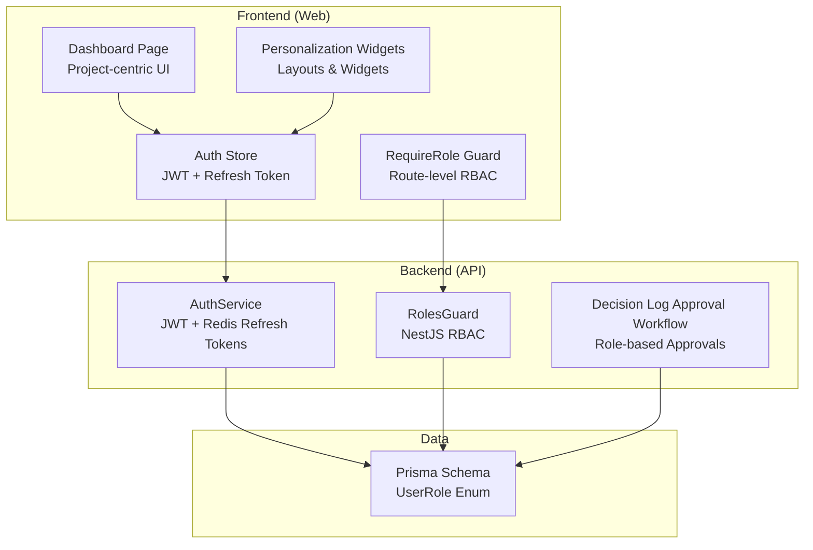
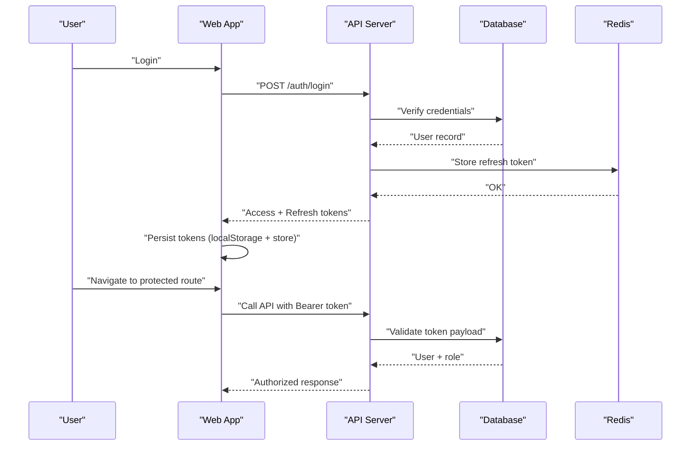
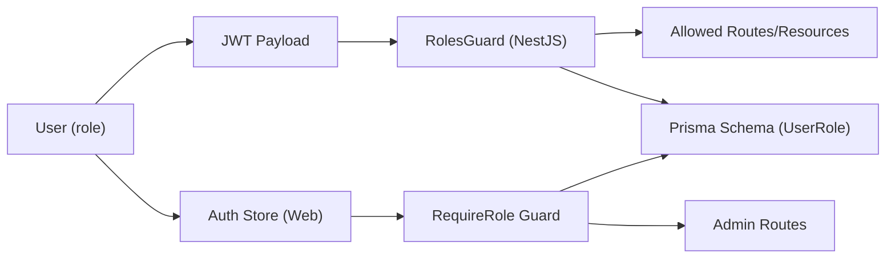

# User Personas

<cite>
**Referenced Files in This Document**
- [schema.prisma](file://prisma/schema.prisma)
- [auth.service.ts](file://apps/api/src/modules/auth/auth.service.ts)
- [roles.guard.ts](file://apps/api/src/modules/auth/guards/roles.guard.ts)
- [roles.decorator.ts](file://apps/api/src/modules/auth/decorators/roles.decorator.ts)
- [auth.ts](file://apps/web/src/types/auth.ts)
- [auth.ts (web store)](file://apps/web/src/stores/auth.ts)
- [DashboardPage.tsx](file://apps/web/src/pages/dashboard/DashboardPage.tsx)
- [Personalization.tsx](file://apps/web/src/components/personalization/Personalization.tsx)
- [RequireRole.tsx](file://apps/web/src/components/auth/RequireRole.tsx)
- [approval-workflow.service.ts](file://apps/api/src/modules/decision-log/approval-workflow.service.ts)
- [001-authentication-authorization.md](file://docs/adr/001-authentication-authorization.md)
- [03-product-architecture.md](file://docs/cto/03-product-architecture.md)
- [WIREFRAMES.md](file://WIREFRAMES.md)
- [ceo-questions.seed.ts](file://prisma/seeds/ceo-questions.seed.ts)
- [ba-questions.seed.ts](file://prisma/seeds/ba-questions.seed.ts)
- [policy-questions.seed.ts](file://prisma/seeds/policy-questions.seed.ts)
- [test-readiness.txt](file://test-readiness.txt)
</cite>

## Table of Contents
1. [Introduction](#introduction)
2. [Project Structure](#project-structure)
3. [Core Components](#core-components)
4. [Architecture Overview](#architecture-overview)
5. [Detailed Component Analysis](#detailed-component-analysis)
6. [Dependency Analysis](#dependency-analysis)
7. [Performance Considerations](#performance-considerations)
8. [Troubleshooting Guide](#troubleshooting-guide)
9. [Conclusion](#conclusion)
10. [Appendices](#appendices)

## Introduction
This document defines the four primary user personas for Quiz-to-Build and maps their goals, pain points, technical proficiency, and workflow requirements to platform capabilities. It also documents role-based access permissions, dashboard layouts, navigation patterns, authentication and authorization mechanisms, and best practices for onboarding and optimizing user experience.

## Project Structure
Quiz-to-Build organizes user roles and access control around:
- Backend authentication and authorization services
- Frontend routing and role-gated components
- Database schema defining user roles and resources
- Product architecture and API documentation

**Diagram sources**
- [auth.ts (web store):1-173](file://apps/web/src/stores/auth.ts#L1-L173)
- [RequireRole.tsx:1-46](file://apps/web/src/components/auth/RequireRole.tsx#L1-L46)
- [DashboardPage.tsx:1-503](file://apps/web/src/pages/dashboard/DashboardPage.tsx#L1-L503)
- [Personalization.tsx:384-1282](file://apps/web/src/components/personalization/Personalization.tsx#L384-L1282)
- [auth.service.ts:1-507](file://apps/api/src/modules/auth/auth.service.ts#L1-L507)
- [roles.guard.ts:1-37](file://apps/api/src/modules/auth/guards/roles.guard.ts#L1-L37)
- [approval-workflow.service.ts:159-622](file://apps/api/src/modules/decision-log/approval-workflow.service.ts#L159-L622)
- [schema.prisma:18-23](file://prisma/schema.prisma#L18-L23)

**Section sources**
- [auth.ts (web store):1-173](file://apps/web/src/stores/auth.ts#L1-L173)
- [auth.service.ts:1-507](file://apps/api/src/modules/auth/auth.service.ts#L1-L507)
- [roles.guard.ts:1-37](file://apps/api/src/modules/auth/guards/roles.guard.ts#L1-L37)
- [approval-workflow.service.ts:159-622](file://apps/api/src/modules/decision-log/approval-workflow.service.ts#L159-L622)
- [schema.prisma:18-23](file://prisma/schema.prisma#L18-L23)

## Core Components
- User roles: CLIENT, DEVELOPER, ADMIN, SUPER_ADMIN
- Authentication: JWT access tokens (short-lived), refresh tokens (Redis-backed)
- Authorization: Decorators and guards enforce role-based access
- Approval workflow: Role-based categories and two-person rule enforcement
- Dashboard: Project-centric, with quick actions and personalized widgets

**Section sources**
- [schema.prisma:18-23](file://prisma/schema.prisma#L18-L23)
- [auth.service.ts:1-507](file://apps/api/src/modules/auth/auth.service.ts#L1-L507)
- [roles.guard.ts:1-37](file://apps/api/src/modules/auth/guards/roles.guard.ts#L1-L37)
- [approval-workflow.service.ts:159-622](file://apps/api/src/modules/decision-log/approval-workflow.service.ts#L159-L622)
- [DashboardPage.tsx:1-503](file://apps/web/src/pages/dashboard/DashboardPage.tsx#L1-L503)
- [Personalization.tsx:384-1282](file://apps/web/src/components/personalization/Personalization.tsx#L384-L1282)

## Architecture Overview
The platform enforces authentication and authorization at both frontend and backend layers. JWT tokens carry user identity and role, while refresh tokens are stored securely and validated server-side. Route-level guards and method-level decorators restrict access to administrative and approval features.

**Diagram sources**
- [auth.service.ts:104-145](file://apps/api/src/modules/auth/auth.service.ts#L104-L145)
- [auth.ts (web store):154-172](file://apps/web/src/stores/auth.ts#L154-L172)
- [roles.guard.ts:11-35](file://apps/api/src/modules/auth/guards/roles.guard.ts#L11-L35)

**Section sources**
- [001-authentication-authorization.md:1-44](file://docs/adr/001-authentication-authorization.md#L1-L44)
- [auth.service.ts:104-145](file://apps/api/src/modules/auth/auth.service.ts#L104-L145)
- [auth.ts (web store):154-172](file://apps/web/src/stores/auth.ts#L154-L172)
- [roles.guard.ts:11-35](file://apps/api/src/modules/auth/guards/roles.guard.ts#L11-L35)

## Detailed Component Analysis

### Assessors (business analysts who create and manage questionnaires)
- Goals
  - Curate persona-targeted questionnaires (CEO, CFO, BA, Policy)
  - Define dimensions, visibility rules, and acceptance criteria
  - Publish reusable templates aligned with organizational standards
- Pain points
  - Managing complex visibility logic across questions
  - Ensuring consistent mapping to standards and controls
  - Balancing depth vs. usability for participants
- Technical proficiency
  - Intermediate to advanced: comfortable with structured content authoring and data modeling
- Workflow requirements
  - Create/edit questionnaires, assign persona, configure sections and questions
  - Map to dimensions and standards, define severity and best practices
  - Preview and publish for participant use
- Role-based access
  - CLIENT or higher depending on configuration; typically requires ADMIN or SUPER_ADMIN for publishing
- Dashboard and navigation
  - Access via “New Assessment” and “Questionnaires” sections; navigation includes “Questionnaire” and “Documents”
- Examples
  - Creating a CEO-focused questionnaire covering strategy, value creation, and risk appetite
  - Defining BA requirements engineering and policy-to-control mapping questions
  - Building policy governance and compliance questions
- Preferred workflows
  - Template-driven creation with persona filters
  - Iterative preview and publish cycles
- Challenges
  - Complexity of visibility rules and multi-dimensional scoring
  - Ensuring alignment with organizational standards and controls

**Section sources**
- [schema.prisma:464-471](file://prisma/schema.prisma#L464-L471)
- [ceo-questions.seed.ts:1-361](file://prisma/seeds/ceo-questions.seed.ts#L1-L361)
- [ba-questions.seed.ts:1-27](file://prisma/seeds/ba-questions.seed.ts#L1-L27)
- [policy-questions.seed.ts:1-27](file://prisma/seeds/policy-questions.seed.ts#L1-L27)
- [WIREFRAMES.md:176-215](file://WIREFRAMES.md#L176-L215)

### Participants (department heads and subject matter experts who complete assessments)
- Goals
  - Complete assessments aligned with their persona
  - Provide accurate, contextual responses efficiently
  - Track progress and receive guidance
- Pain points
  - Overwhelmed by long forms or irrelevant questions
  - Unclear expectations or missing context
  - Difficulty navigating complex visibility rules
- Technical proficiency
  - Basic to intermediate: focus on completing tasks, not platform administration
- Workflow requirements
  - Start a session, answer persona-specific questions, save drafts, and submit
  - Receive real-time progress feedback and adaptive guidance
- Role-based access
  - CLIENT by default; can be elevated if needed for multi-tenant scenarios
- Dashboard and navigation
  - Dashboard shows active projects and quick actions; navigation bar includes “Dashboard,” “Questionnaire,” “Documents,” “Billing”
- Examples
  - Completing a CEO readiness assessment with strategy and risk appetite prompts
  - Filling BA requirements and policy mapping questions
  - Answering policy governance and compliance queries
- Preferred workflows
  - Short, iterative sessions with auto-save and progress indicators
  - Clear guidance and practical explanations for each question
- Challenges
  - Understanding severity and acceptance criteria
  - Managing time and maintaining focus across sections

**Section sources**
- [DashboardPage.tsx:1-503](file://apps/web/src/pages/dashboard/DashboardPage.tsx#L1-L503)
- [WIREFRAMES.md:176-215](file://WIREFRAMES.md#L176-L215)
- [test-readiness.txt:2449-2496](file://test-readiness.txt#L2449-L2496)

### Approvers (executives and stakeholders who review and approve results)
- Goals
  - Review and approve documents and decisions
  - Enforce governance and two-person rule compliance
  - Ensure quality and adherence to standards
- Pain points
  - Managing approval queues and deadlines
  - Verifying cross-cutting risks and controls
  - Avoiding conflicts of interest (self-approval prevention)
- Technical proficiency
  - Intermediate: focused on governance and decision-making
- Workflow requirements
  - View pending approvals, validate category requirements, approve or reject with comments
  - Two-person rule: requester cannot approve their own request
- Role-based access
  - ADMIN, SUPER_ADMIN, or DEVELOPER depending on approval category
- Dashboard and navigation
  - Access via admin routes guarded by role checks; navigation includes “Admin” and related sections
- Examples
  - Approving policy locks and high-risk decisions
  - Reviewing ADR approvals and security exceptions
- Preferred workflows
  - Streamlined approval screens with role-aware eligibility lists
- Challenges
  - Ensuring timely responses and auditability
  - Preventing bypassing of governance controls

**Section sources**
- [approval-workflow.service.ts:159-243](file://apps/api/src/modules/decision-log/approval-workflow.service.ts#L159-L243)
- [approval-workflow.service.ts:441-463](file://apps/api/src/modules/decision-log/approval-workflow.service.ts#L441-L463)
- [approval-workflow.service.ts:587-613](file://apps/api/src/modules/decision-log/approval-workflow.service.ts#L587-L613)
- [RequireRole.tsx:1-46](file://apps/web/src/components/auth/RequireRole.tsx#L1-L46)
- [03-product-architecture.md:1000-1007](file://docs/cto/03-product-architecture.md#L1000-L1007)

### Administrators (platform managers who oversee system operations)
- Goals
  - Manage users, monitor system health, and configure platform settings
  - Oversee approval workflows and audit logs
- Pain points
  - Scalability and performance under load
  - Ensuring compliance and security posture
- Technical proficiency
  - Advanced: comfortable with system administration and governance
- Workflow requirements
  - User management, role assignment, system configuration, and audit oversight
- Role-based access
  - ADMIN or SUPER_ADMIN; SUPER_ADMIN for tenant-level operations
- Dashboard and navigation
  - Admin dashboards and routes gated by role checks; navigation includes “Admin” and related sections
- Examples
  - Managing user roles and subscriptions
  - Monitoring audit logs and approval workflows
- Preferred workflows
  - Centralized admin panels with role-aware filtering and bulk actions
- Challenges
  - Maintaining separation of duties and minimizing blast radius of changes

**Section sources**
- [03-product-architecture.md:1000-1007](file://docs/cto/03-product-architecture.md#L1000-L1007)
- [RequireRole.tsx:1-46](file://apps/web/src/components/auth/RequireRole.tsx#L1-L46)

## Dependency Analysis
Role-based access depends on:
- Backend: JWT payload includes role; guards enforce method and route-level permissions
- Frontend: Auth store persists tokens; RequireRole guard protects admin routes
- Data: Prisma schema defines UserRole enum and relationships

**Diagram sources**
- [roles.guard.ts:1-37](file://apps/api/src/modules/auth/guards/roles.guard.ts#L1-L37)
- [roles.decorator.ts:1-7](file://apps/api/src/modules/auth/decorators/roles.decorator.ts#L1-L7)
- [auth.ts (web store):1-173](file://apps/web/src/stores/auth.ts#L1-L173)
- [RequireRole.tsx:1-46](file://apps/web/src/components/auth/RequireRole.tsx#L1-L46)
- [schema.prisma:18-23](file://prisma/schema.prisma#L18-L23)

**Section sources**
- [roles.guard.ts:1-37](file://apps/api/src/modules/auth/guards/roles.guard.ts#L1-L37)
- [roles.decorator.ts:1-7](file://apps/api/src/modules/auth/decorators/roles.decorator.ts#L1-L7)
- [auth.ts (web store):1-173](file://apps/web/src/stores/auth.ts#L1-L173)
- [RequireRole.tsx:1-46](file://apps/web/src/components/auth/RequireRole.tsx#L1-L46)
- [schema.prisma:18-23](file://prisma/schema.prisma#L18-L23)

## Performance Considerations
- Token lifecycle: Short-lived access tokens reduce exposure; refresh tokens are stored server-side for validation
- Guard checks: Minimal overhead; ensure guards are applied at both controller and route levels
- Dashboard rendering: Project-centric UI with skeleton loaders improves perceived performance
- Personalization: Widget-based layouts allow users to optimize their view without heavy computations

[No sources needed since this section provides general guidance]

## Troubleshooting Guide
- Access denied errors
  - Verify user role and route-level guards
  - Confirm tokens are present and not expired
- Approval workflow issues
  - Ensure approver has correct role for category
  - Enforce two-person rule: requester cannot approve their own request
- Authentication problems
  - Check refresh token validity and Redis storage
  - Validate token payload and user existence

**Section sources**
- [roles.guard.ts:24-32](file://apps/api/src/modules/auth/guards/roles.guard.ts#L24-L32)
- [approval-workflow.service.ts:191-196](file://apps/api/src/modules/decision-log/approval-workflow.service.ts#L191-L196)
- [auth.ts (web store):154-172](file://apps/web/src/stores/auth.ts#L154-L172)

## Conclusion
Quiz-to-Build’s user personas are supported by a robust, role-based architecture that separates responsibilities across Assessors, Participants, Approvers, and Administrators. Authentication and authorization are enforced at both frontend and backend, while the dashboard and navigation are tailored to each persona’s needs. By aligning workflows with role permissions and leveraging approval governance, the platform enables efficient, secure, and scalable assessment operations.

[No sources needed since this section summarizes without analyzing specific files]

## Appendices

### Role-Based Access Matrix
- CLIENT: Submit responses, view own documents
- DEVELOPER: Review documents, approve releases, manage clients
- ADMIN: Full system access, user management, configuration
- SUPER_ADMIN: Tenant management, system configuration

**Section sources**
- [03-product-architecture.md:1000-1007](file://docs/cto/03-product-architecture.md#L1000-L1007)

### Authentication and Authorization Mechanisms
- JWT-based authentication with access and refresh tokens
- Refresh tokens stored in Redis and audited in the database
- Frontend auth store persists tokens and synchronizes state
- Backend guards validate roles and enforce access control

**Section sources**
- [001-authentication-authorization.md:1-44](file://docs/adr/001-authentication-authorization.md#L1-L44)
- [auth.service.ts:147-183](file://apps/api/src/modules/auth/auth.service.ts#L147-L183)
- [auth.ts (web store):154-172](file://apps/web/src/stores/auth.ts#L154-L172)

### Dashboard Layouts and Navigation Patterns
- Dashboard: Project-centric with stats, active/completed projects, quick actions
- Personalization: Default layout with widgets for score overview, progress chart, notifications, recent activity, recommendations
- Navigation: Consistent header with main sections; admin routes gated by role

**Section sources**
- [DashboardPage.tsx:1-503](file://apps/web/src/pages/dashboard/DashboardPage.tsx#L1-L503)
- [Personalization.tsx:384-1282](file://apps/web/src/components/personalization/Personalization.tsx#L384-L1282)
- [WIREFRAMES.md:166-215](file://WIREFRAMES.md#L166-L215)