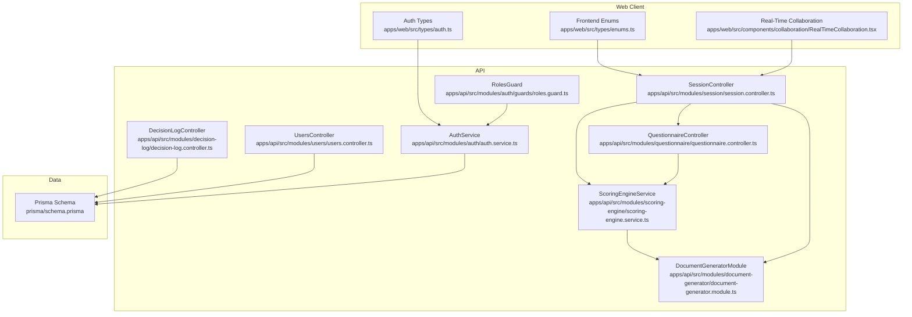
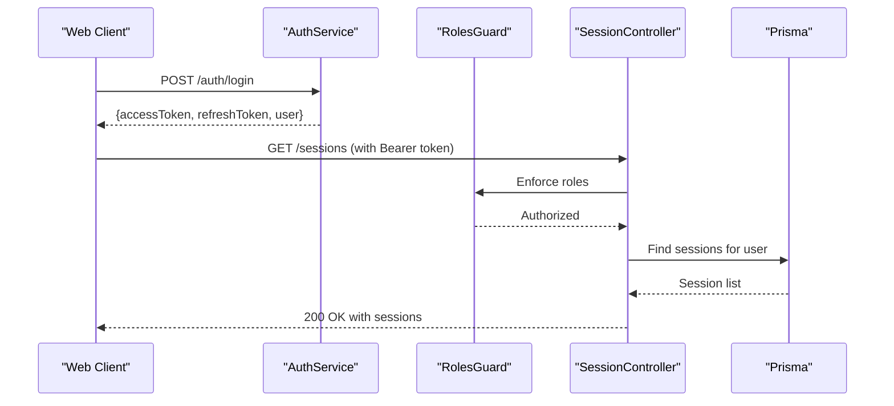
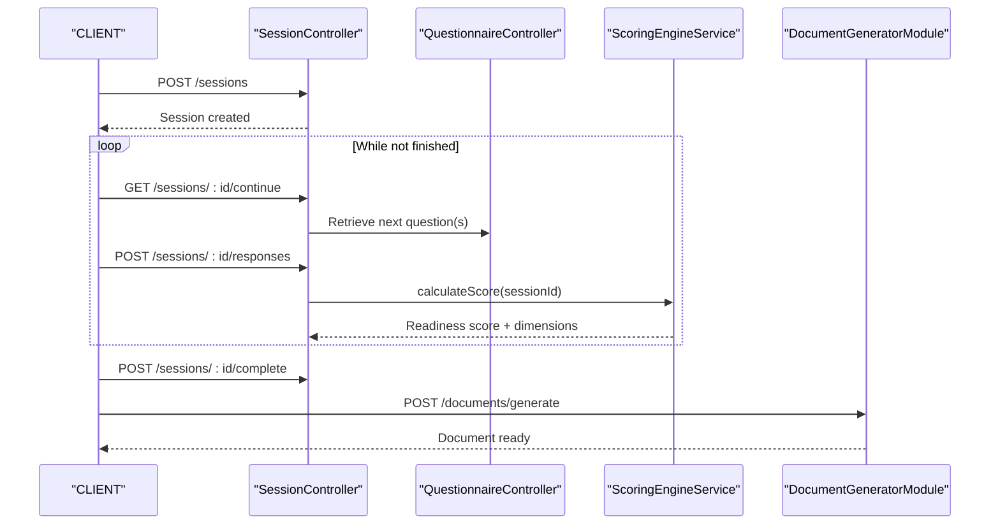
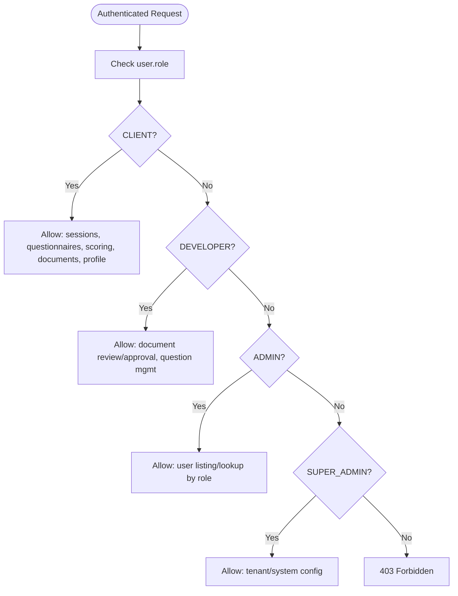
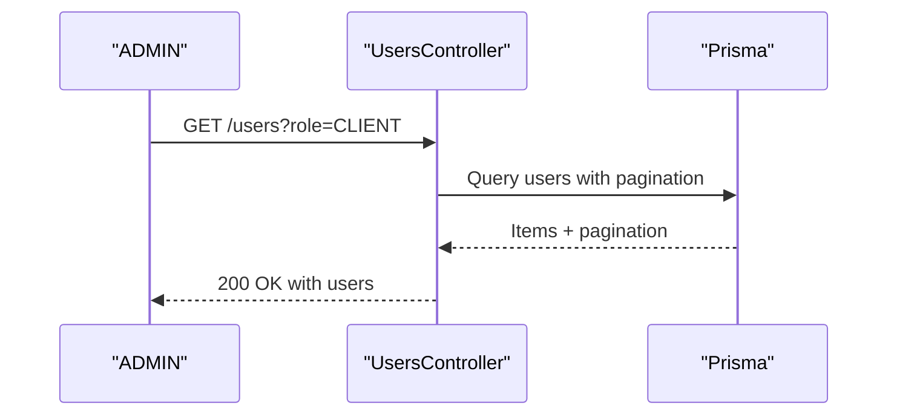
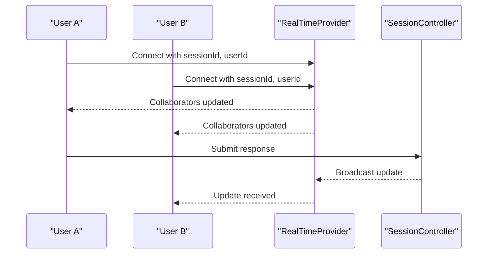
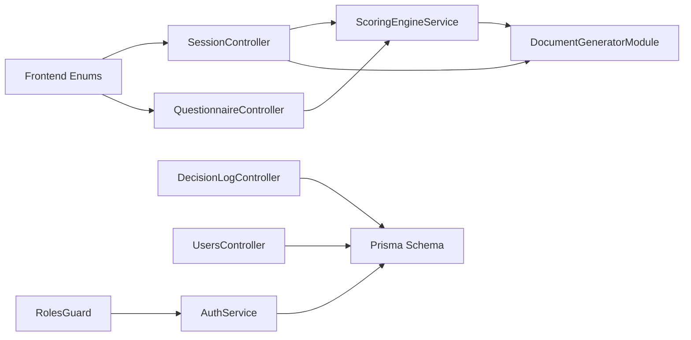

# User Roles and Workflows

<cite>
**Referenced Files in This Document**
- [schema.prisma](file://prisma/schema.prisma)
- [auth.service.ts](file://apps/api/src/modules/auth/auth.service.ts)
- [roles.guard.ts](file://apps/api/src/modules/auth/guards/roles.guard.ts)
- [users.controller.ts](file://apps/api/src/modules/users/users.controller.ts)
- [session.controller.ts](file://apps/api/src/modules/session/session.controller.ts)
- [questionnaire.controller.ts](file://apps/api/src/modules/questionnaire/questionnaire.controller.ts)
- [scoring-engine.service.ts](file://apps/api/src/modules/scoring-engine/scoring-engine.service.ts)
- [document-generator.module.ts](file://apps/api/src/modules/document-generator/document-generator.module.ts)
- [decision-log.controller.ts](file://apps/api/src/modules/decision-log/decision-log.controller.ts)
- [RealTimeCollaboration.tsx](file://apps/web/src/components/collaboration/RealTimeCollaboration.tsx)
- [enums.ts](file://apps/web/src/types/enums.ts)
- [auth.ts](file://apps/web/src/types/auth.ts)
- [c4-03-component.md](file://docs/architecture/c4-03-component.md)
- [04-api-documentation.md](file://docs/cto/04-api-documentation.md)
- [03-product-architecture.md](file://docs/cto/03-product-architecture.md)
- [fixtures.ts](file://e2e/fixtures.ts)
</cite>

## Table of Contents
1. [Introduction](#introduction)
2. [Project Structure](#project-structure)
3. [Core Components](#core-components)
4. [Architecture Overview](#architecture-overview)
5. [Detailed Component Analysis](#detailed-component-analysis)
6. [Dependency Analysis](#dependency-analysis)
7. [Performance Considerations](#performance-considerations)
8. [Troubleshooting Guide](#troubleshooting-guide)
9. [Conclusion](#conclusion)
10. [Appendices](#appendices)

## Introduction
This document defines user roles and end-to-end workflows for Quiz-to-Build. It maps the four primary personas—assessors (business analysts), participants (department heads), approvers (executives), and administrators (platform managers)—to platform capabilities, permissions, and navigation. It documents the complete assessment lifecycle from invitation through scoring and document generation, role-based access controls, and administrative operations. It also provides workflow examples for business case development, compliance assessment, strategic planning, and due diligence, along with best practices, collaboration features, and session management guidance.

## Project Structure
Quiz-to-Build is a NestJS-based API with a React web client. The API exposes controllers for authentication, sessions, questionnaires, scoring, documents, decisions, and users. The frontend types mirror backend enums and DTOs. The database schema defines user roles, session states, document categories, and decision statuses.



**Diagram sources**
- [auth.service.ts:1-507](file://apps/api/src/modules/auth/auth.service.ts#L1-L507)
- [roles.guard.ts:1-37](file://apps/api/src/modules/auth/guards/roles.guard.ts#L1-L37)
- [users.controller.ts:1-75](file://apps/api/src/modules/users/users.controller.ts#L1-L75)
- [session.controller.ts:1-166](file://apps/api/src/modules/session/session.controller.ts#L1-L166)
- [questionnaire.controller.ts:1-49](file://apps/api/src/modules/questionnaire/questionnaire.controller.ts#L1-L49)
- [scoring-engine.service.ts:1-387](file://apps/api/src/modules/scoring-engine/scoring-engine.service.ts#L1-L387)
- [document-generator.module.ts:1-47](file://apps/api/src/modules/document-generator/document-generator.module.ts#L1-L47)
- [decision-log.controller.ts:1-279](file://apps/api/src/modules/decision-log/decision-log.controller.ts#L1-L279)
- [schema.prisma:1-200](file://prisma/schema.prisma#L1-L200)
- [auth.ts:1-48](file://apps/web/src/types/auth.ts#L1-L48)
- [enums.ts:1-88](file://apps/web/src/types/enums.ts#L1-L88)
- [RealTimeCollaboration.tsx:101-501](file://apps/web/src/components/collaboration/RealTimeCollaboration.tsx#L101-L501)

**Section sources**
- [c4-03-component.md:1-99](file://docs/architecture/c4-03-component.md#L1-L99)
- [schema.prisma:18-148](file://prisma/schema.prisma#L18-L148)

## Core Components
- Authentication and authorization: JWT-based login, refresh, logout; role-aware guards; token storage and validation.
- Sessions and questionnaires: start, continue, submit responses, and complete sessions; adaptive logic integration.
- Scoring engine: readiness score calculation, dimension breakdown, next-question prioritization.
- Documents: generation pipeline, templates, rendering, and deliverables compilation.
- Decisions: append-only decision log with DRAFT/LOCKED/SUPERSEDED lifecycle.
- Users: self-service profile, admin listing and lookup by role.

**Section sources**
- [auth.service.ts:104-145](file://apps/api/src/modules/auth/auth.service.ts#L104-L145)
- [roles.guard.ts:11-35](file://apps/api/src/modules/auth/guards/roles.guard.ts#L11-L35)
- [session.controller.ts:39-164](file://apps/api/src/modules/session/session.controller.ts#L39-L164)
- [questionnaire.controller.ts:18-47](file://apps/api/src/modules/questionnaire/questionnaire.controller.ts#L18-L47)
- [scoring-engine.service.ts:70-164](file://apps/api/src/modules/scoring-engine/scoring-engine.service.ts#L70-L164)
- [document-generator.module.ts:19-46](file://apps/api/src/modules/document-generator/document-generator.module.ts#L19-L46)
- [decision-log.controller.ts:46-98](file://apps/api/src/modules/decision-log/decision-log.controller.ts#L46-L98)
- [users.controller.ts:40-73](file://apps/api/src/modules/users/users.controller.ts#L40-L73)

## Architecture Overview
The system enforces role-based access control at the API boundary. Controllers delegate to services that interact with the database and caches. The frontend mirrors enums and types to ensure consistency across boundaries.



**Diagram sources**
- [auth.service.ts:104-145](file://apps/api/src/modules/auth/auth.service.ts#L104-L145)
- [roles.guard.ts:11-35](file://apps/api/src/modules/auth/guards/roles.guard.ts#L11-L35)
- [session.controller.ts:49-75](file://apps/api/src/modules/session/session.controller.ts#L49-L75)

**Section sources**
- [c4-03-component.md:85-99](file://docs/architecture/c4-03-component.md#L85-L99)
- [04-api-documentation.md:934-1008](file://docs/cto/04-api-documentation.md#L934-L1008)

## Detailed Component Analysis

### User Roles and Permission Model
- Roles: CLIENT, DEVELOPER, ADMIN, SUPER_ADMIN.
- CLIENT: can authenticate, start/manage sessions, submit responses, view own documents, and manage profile.
- DEVELOPER: can review documents, approve releases, manage clients.
- ADMIN: full system access, user management, configuration.
- SUPER_ADMIN: tenant management, system configuration (internal only).

```mermaid
classDiagram
class User {
+string id
+string email
+UserRole role
+string name
}
class AuthService {
+login(dto) TokenResponseDto
+refresh(refreshToken) {accessToken, expiresIn}
+logout(refreshToken) void
+validateUser(payload) AuthenticatedUser
}
class RolesGuard {
+canActivate(context) boolean
}
User <.. AuthService : "creates/validates"
RolesGuard ..> AuthService : "checks user.role"
```

**Diagram sources**
- [schema.prisma:18-23](file://prisma/schema.prisma#L18-L23)
- [auth.service.ts:104-145](file://apps/api/src/modules/auth/auth.service.ts#L104-L145)
- [roles.guard.ts:11-35](file://apps/api/src/modules/auth/guards/roles.guard.ts#L11-L35)

**Section sources**
- [schema.prisma:18-23](file://prisma/schema.prisma#L18-L23)
- [03-product-architecture.md:1000-1007](file://docs/cto/03-product-architecture.md#L1000-L1007)
- [auth.ts:5-18](file://apps/web/src/types/auth.ts#L5-L18)

### Assessment Workflow: From Invitation to Document Generation
End-to-end flow:
1. Invitation: CLIENT receives an invitation to complete a questionnaire.
2. Session start: CLIENT starts a session via the session controller.
3. Adaptive question delivery: CLIENT answers questions; adaptive logic determines next questions.
4. Scoring: periodic readiness score calculation and dimension breakdown.
5. Completion: CLIENT marks session complete.
6. Document generation: system compiles deliverables and generates documents.



**Diagram sources**
- [session.controller.ts:39-164](file://apps/api/src/modules/session/session.controller.ts#L39-L164)
- [questionnaire.controller.ts:18-47](file://apps/api/src/modules/questionnaire/questionnaire.controller.ts#L18-L47)
- [scoring-engine.service.ts:70-164](file://apps/api/src/modules/scoring-engine/scoring-engine.service.ts#L70-L164)
- [document-generator.module.ts:19-46](file://apps/api/src/modules/document-generator/document-generator.module.ts#L19-L46)

**Section sources**
- [session.controller.ts:77-164](file://apps/api/src/modules/session/session.controller.ts#L77-L164)
- [questionnaire.controller.ts:18-47](file://apps/api/src/modules/questionnaire/questionnaire.controller.ts#L18-L47)
- [scoring-engine.service.ts:166-227](file://apps/api/src/modules/scoring-engine/scoring-engine.service.ts#L166-L227)
- [document-generator.module.ts:19-46](file://apps/api/src/modules/document-generator/document-generator.module.ts#L19-L46)

### Role-Based Access Controls and Navigation Guidance
- CLIENT: authenticated access to sessions, questionnaires, scoring, and documents; profile management.
- DEVELOPER: can review documents and approve releases; likely uses admin endpoints for question management.
- ADMIN: user listing/lookup by role; manages system configuration.
- SUPER_ADMIN: tenant-level management and system configuration.



**Diagram sources**
- [roles.guard.ts:11-35](file://apps/api/src/modules/auth/guards/roles.guard.ts#L11-L35)
- [users.controller.ts:40-73](file://apps/api/src/modules/users/users.controller.ts#L40-L73)
- [03-product-architecture.md:1000-1007](file://docs/cto/03-product-architecture.md#L1000-L1007)

**Section sources**
- [roles.guard.ts:11-35](file://apps/api/src/modules/auth/guards/roles.guard.ts#L11-L35)
- [users.controller.ts:40-73](file://apps/api/src/modules/users/users.controller.ts#L40-L73)

### Administrative Workflows
- User management: list users, filter by role, get user by ID.
- Questionnaire configuration: list and retrieve questionnaires; adaptive logic governs visibility and progression.
- System monitoring: health endpoints and logs; caching and analytics for scoring.



**Diagram sources**
- [users.controller.ts:40-73](file://apps/api/src/modules/users/users.controller.ts#L40-L73)

**Section sources**
- [users.controller.ts:40-73](file://apps/api/src/modules/users/users.controller.ts#L40-L73)
- [questionnaire.controller.ts:18-47](file://apps/api/src/modules/questionnaire/questionnaire.controller.ts#L18-L47)

### Role-Specific Dashboards and Navigation
- CLIENT dashboard: recent sessions, progress, next recommended questions, generated documents.
- DEVELOPER dashboard: document review queue, approvals, question visibility rules.
- ADMIN dashboard: user directory, role assignments, system metrics.
- SUPER_ADMIN dashboard: tenant provisioning, system-wide settings.

[No sources needed since this section provides general guidance]

### Workflow Examples

#### Business Case Development
- Persona: BA
- Steps: Invite BA, start session, answer capability questions, compute readiness score, generate business case document, review/approve.

**Section sources**
- [questionnaire.controller.ts:18-47](file://apps/api/src/modules/questionnaire/questionnaire.controller.ts#L18-L47)
- [scoring-engine.service.ts:70-164](file://apps/api/src/modules/scoring-engine/scoring-engine.service.ts#L70-L164)
- [document-generator.module.ts:19-46](file://apps/api/src/modules/document-generator/document-generator.module.ts#L19-L46)

#### Compliance Assessment
- Persona: POLICY
- Steps: Start compliance session, adaptive questions by policy domain, score residual risk, export decision log for audit, generate policy report.

**Section sources**
- [decision-log.controller.ts:224-243](file://apps/api/src/modules/decision-log/decision-log.controller.ts#L224-L243)
- [scoring-engine.service.ts:70-164](file://apps/api/src/modules/scoring-engine/scoring-engine.service.ts#L70-L164)

#### Strategic Planning
- Persona: CEO/CFO/CTO
- Steps: Start strategic session, prioritize next questions by expected score lift, track trends, generate strategic plan document.

**Section sources**
- [scoring-engine.service.ts:166-227](file://apps/api/src/modules/scoring-engine/scoring-engine.service.ts#L166-L227)
- [document-generator.module.ts:19-46](file://apps/api/src/modules/document-generator/document-generator.module.ts#L19-L46)

#### Due Diligence Processes
- Persona: BA/Policy
- Steps: Invite participants, collaborative sessions, real-time presence, lock decisions, export audit trail, generate due diligence report.

**Section sources**
- [RealTimeCollaboration.tsx:101-501](file://apps/web/src/components/collaboration/RealTimeCollaboration.tsx#L101-L501)
- [decision-log.controller.ts:46-98](file://apps/api/src/modules/decision-log/decision-log.controller.ts#L46-L98)
- [document-generator.module.ts:19-46](file://apps/api/src/modules/document-generator/document-generator.module.ts#L19-L46)

### Best Practices and Optimizations
- Use adaptive logic to minimize question load and improve completion rates.
- Cache scores and snapshots to reduce repeated computation.
- Batch score calculations for multiple sessions to optimize throughput.
- Enforce role-based access at every endpoint boundary.
- Use real-time collaboration for multi-user sessions to reduce rework.

**Section sources**
- [scoring-engine.service.ts:300-324](file://apps/api/src/modules/scoring-engine/scoring-engine.service.ts#L300-L324)
- [RealTimeCollaboration.tsx:101-501](file://apps/web/src/components/collaboration/RealTimeCollaboration.tsx#L101-L501)

### Multi-User Collaboration and Session Management
- Real-time presence and cursors for collaborative editing.
- Session ownership and access control enforced by controllers.
- Decision log append-only pattern ensures immutable audit trail.



**Diagram sources**
- [RealTimeCollaboration.tsx:187-210](file://apps/web/src/components/collaboration/RealTimeCollaboration.tsx#L187-L210)
- [session.controller.ts:133-154](file://apps/api/src/modules/session/session.controller.ts#L133-L154)

**Section sources**
- [RealTimeCollaboration.tsx:101-501](file://apps/web/src/components/collaboration/RealTimeCollaboration.tsx#L101-L501)
- [session.controller.ts:77-164](file://apps/api/src/modules/session/session.controller.ts#L77-L164)

## Dependency Analysis
Controllers depend on services and guards; services depend on Prisma and Redis. Frontend types align with backend enums and DTOs.



**Diagram sources**
- [enums.ts:1-88](file://apps/web/src/types/enums.ts#L1-L88)
- [session.controller.ts:1-166](file://apps/api/src/modules/session/session.controller.ts#L1-L166)
- [questionnaire.controller.ts:1-49](file://apps/api/src/modules/questionnaire/questionnaire.controller.ts#L1-L49)
- [scoring-engine.service.ts:1-387](file://apps/api/src/modules/scoring-engine/scoring-engine.service.ts#L1-L387)
- [document-generator.module.ts:1-47](file://apps/api/src/modules/document-generator/document-generator.module.ts#L1-L47)
- [decision-log.controller.ts:1-279](file://apps/api/src/modules/decision-log/decision-log.controller.ts#L1-L279)
- [users.controller.ts:1-75](file://apps/api/src/modules/users/users.controller.ts#L1-L75)
- [auth.service.ts:1-507](file://apps/api/src/modules/auth/auth.service.ts#L1-L507)
- [roles.guard.ts:1-37](file://apps/api/src/modules/auth/guards/roles.guard.ts#L1-L37)
- [schema.prisma:1-200](file://prisma/schema.prisma#L1-L200)

**Section sources**
- [c4-03-component.md:85-99](file://docs/architecture/c4-03-component.md#L85-L99)

## Performance Considerations
- Use Redis caching for scores and snapshots to reduce database load.
- Batch score calculations for multiple sessions.
- Limit concurrent requests and apply rate limiting at the gateway.
- Monitor health endpoints and cache hit ratios.

[No sources needed since this section provides general guidance]

## Troubleshooting Guide
- Authentication failures: verify credentials, check account lockout, resend verification email.
- Access denied: confirm user role and required permissions.
- Session errors: ensure session ownership and correct session state transitions.
- Document generation failures: check template availability and renderers.

**Section sources**
- [auth.service.ts:104-145](file://apps/api/src/modules/auth/auth.service.ts#L104-L145)
- [roles.guard.ts:24-32](file://apps/api/src/modules/auth/guards/roles.guard.ts#L24-L32)
- [session.controller.ts:77-164](file://apps/api/src/modules/session/session.controller.ts#L77-L164)
- [document-generator.module.ts:19-46](file://apps/api/src/modules/document-generator/document-generator.module.ts#L19-L46)

## Conclusion
Quiz-to-Build provides a robust, role-aware assessment platform with adaptive question delivery, resilient scoring, and automated document generation. Administrators can manage users and configurations, while assessors, participants, and approvers collaborate efficiently through sessions, decisions, and real-time presence. Following the workflows and best practices outlined here will ensure smooth operations across business case development, compliance, strategic planning, and due diligence.

## Appendices

### Enum Mappings
- Document categories and statuses, output formats, decision statuses, and project statuses are mirrored in the frontend for type safety.

**Section sources**
- [enums.ts:25-88](file://apps/web/src/types/enums.ts#L25-L88)

### Example Questionnaires
- Security Assessment, Architecture Review, Data Privacy & Compliance, Operational Readiness, Financial Health.

**Section sources**
- [fixtures.ts:65-101](file://e2e/fixtures.ts#L65-L101)