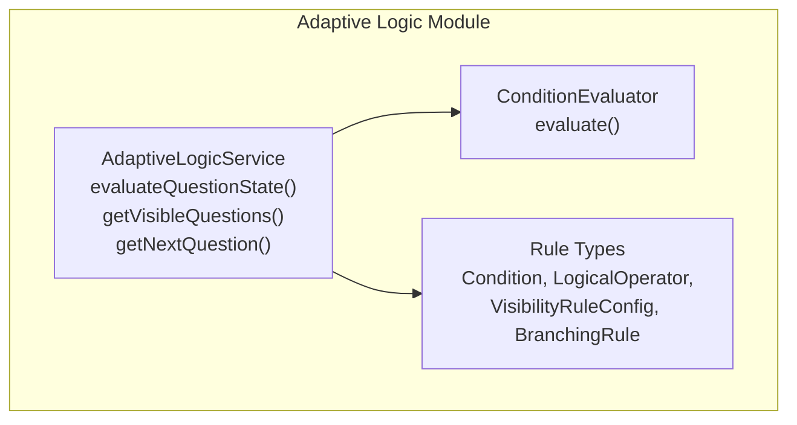
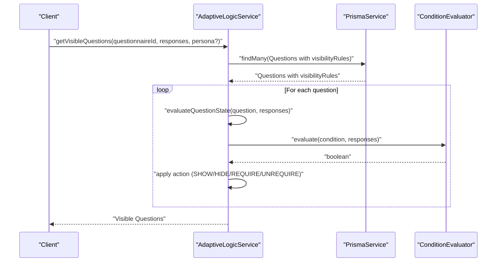
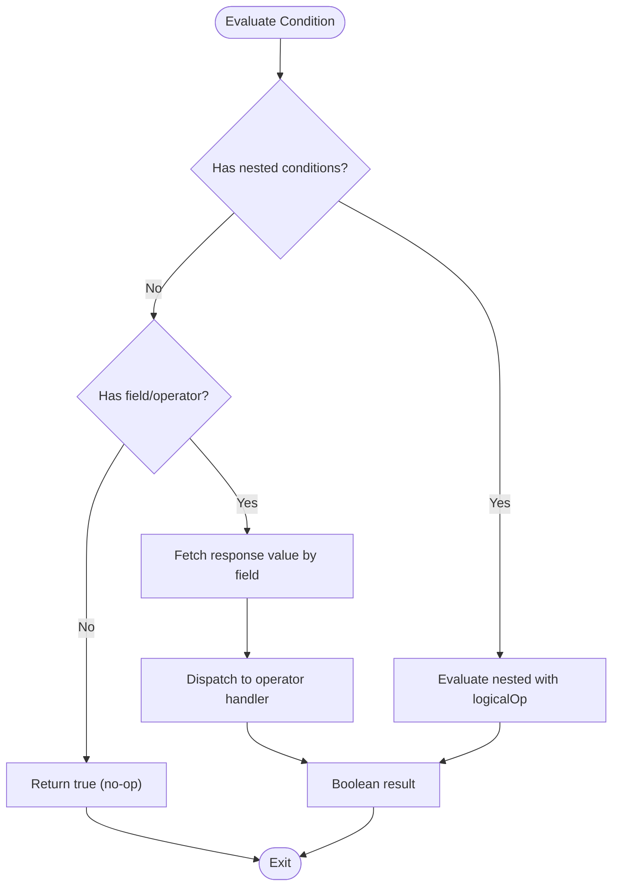
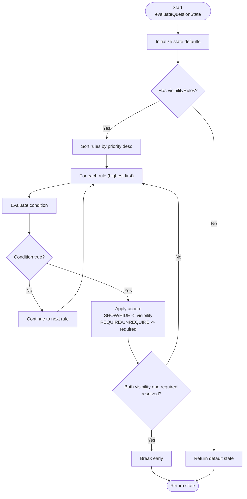
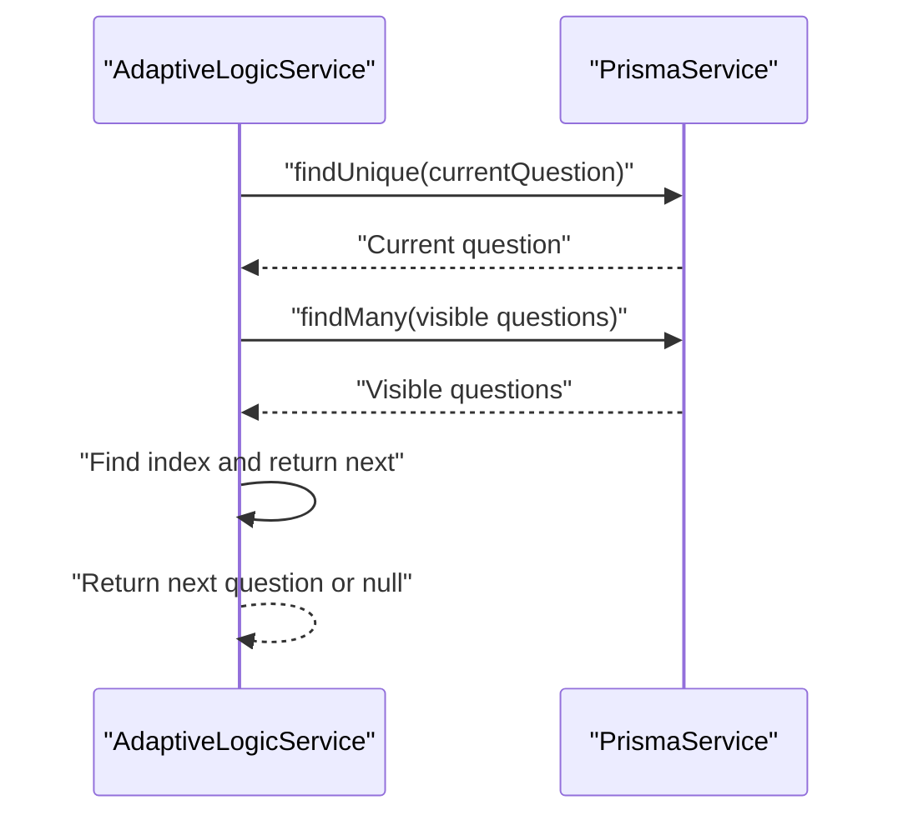
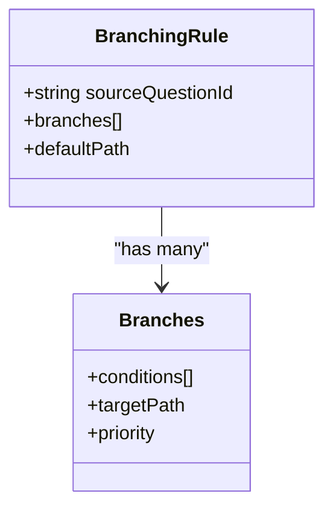
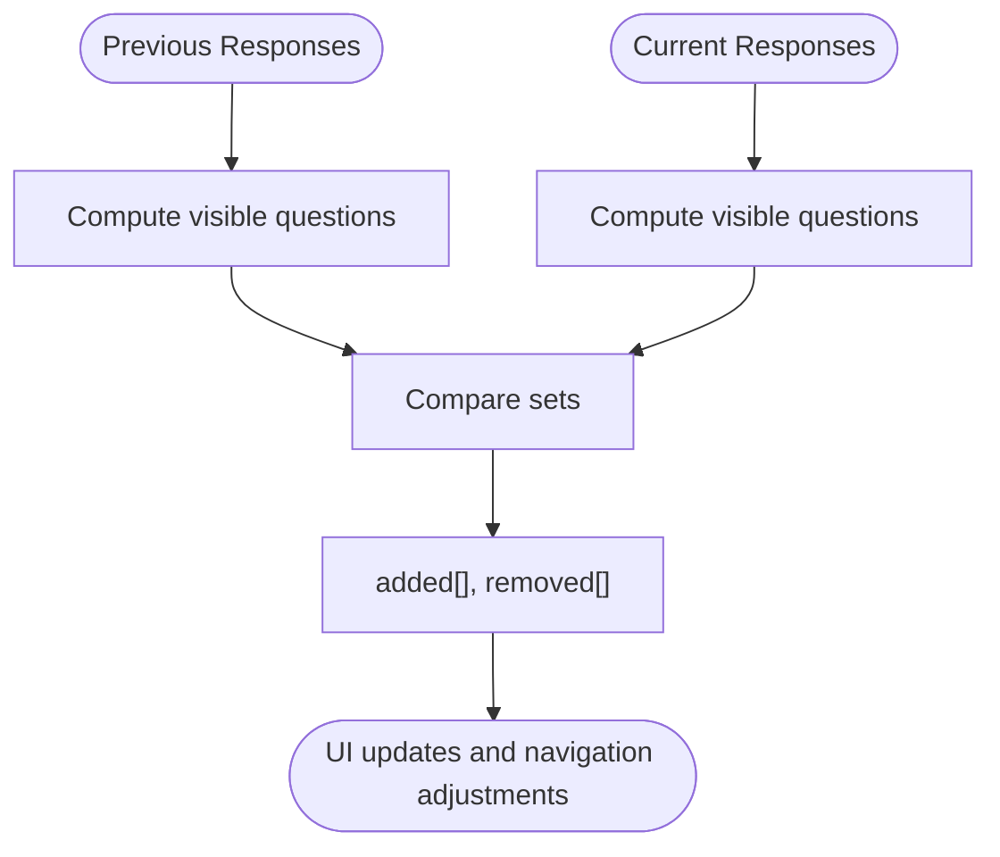
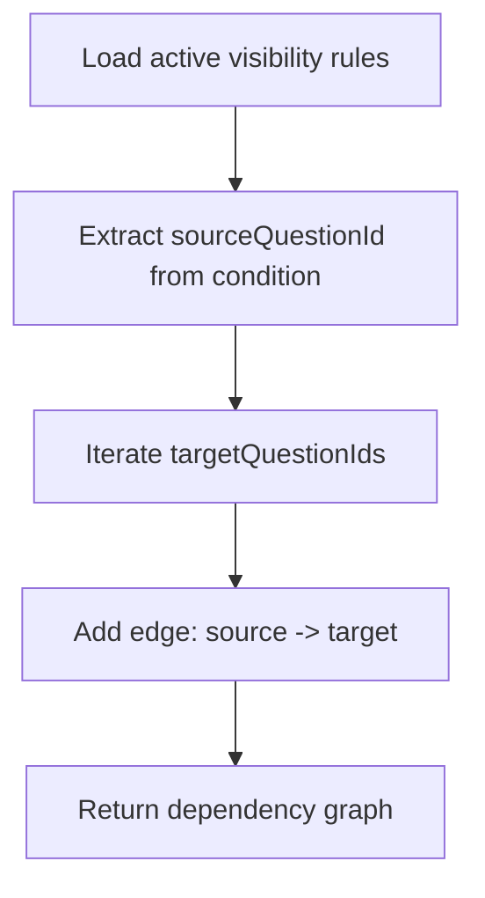
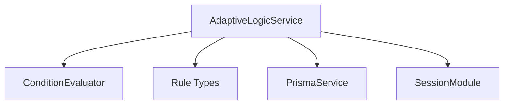

# Adaptive Logic and Branching

<cite>
**Referenced Files in This Document**
- [adaptive-logic.module.ts](file://apps/api/src/modules/adaptive-logic/adaptive-logic.module.ts)
- [adaptive-logic.service.ts](file://apps/api/src/modules/adaptive-logic/adaptive-logic.service.ts)
- [condition.evaluator.ts](file://apps/api/src/modules/adaptive-logic/evaluators/condition.evaluator.ts)
- [rule.types.ts](file://apps/api/src/modules/adaptive-logic/types/rule.types.ts)
- [adaptive-logic.service.spec.ts](file://apps/api/src/modules/adaptive-logic/adaptive-logic.service.spec.ts)
- [adaptive-logic.md](file://docs/questionnaire/adaptive-logic.md)
- [adaptive.e2e.test.ts](file://e2e/questionnaire/adaptive.e2e.test.ts)
</cite>

## Table of Contents
1. [Introduction](#introduction)
2. [Project Structure](#project-structure)
3. [Core Components](#core-components)
4. [Architecture Overview](#architecture-overview)
5. [Detailed Component Analysis](#detailed-component-analysis)
6. [Dependency Analysis](#dependency-analysis)
7. [Performance Considerations](#performance-considerations)
8. [Troubleshooting Guide](#troubleshooting-guide)
9. [Conclusion](#conclusion)
10. [Appendices](#appendices)

## Introduction
This document explains the adaptive logic and branching system that powers dynamic visibility and flow control in questionnaires. It covers the condition evaluation engine, rule syntax and operators, persona-based filtering, audience targeting, and dynamic flow navigation. It also documents state management during navigation, flow validation, complex adaptive scenarios, nested conditions, performance optimization, and the admin interface capabilities for creating, testing, and debugging adaptive rules. Edge cases, infinite loop prevention, and user experience considerations are addressed to ensure robust and intuitive dynamic questionnaires.

## Project Structure
The adaptive logic implementation resides in the API module under apps/api/src/modules/adaptive-logic. It consists of:
- A service that orchestrates visibility evaluation, flow navigation, and dependency analysis
- A condition evaluator that interprets rule conditions and applies operators
- Type definitions that specify rule structures, operators, and logical combinations
- Tests validating behavior across visibility, requirement toggling, priority resolution, persona filtering, and flow navigation
- Documentation and E2E tests that demonstrate real-world adaptive scenarios

**Diagram sources**
- [adaptive-logic.module.ts:1-12](file://apps/api/src/modules/adaptive-logic/adaptive-logic.module.ts#L1-L12)
- [adaptive-logic.service.ts:19-285](file://apps/api/src/modules/adaptive-logic/adaptive-logic.service.ts#L19-L285)
- [condition.evaluator.ts:1-382](file://apps/api/src/modules/adaptive-logic/evaluators/condition.evaluator.ts#L1-L382)
- [rule.types.ts:1-120](file://apps/api/src/modules/adaptive-logic/types/rule.types.ts#L1-L120)

**Section sources**
- [adaptive-logic.module.ts:1-12](file://apps/api/src/modules/adaptive-logic/adaptive-logic.module.ts#L1-L12)
- [adaptive-logic.service.ts:19-285](file://apps/api/src/modules/adaptive-logic/adaptive-logic.service.ts#L19-L285)
- [condition.evaluator.ts:1-382](file://apps/api/src/modules/adaptive-logic/evaluators/condition.evaluator.ts#L1-L382)
- [rule.types.ts:1-120](file://apps/api/src/modules/adaptive-logic/types/rule.types.ts#L1-L120)

## Core Components
- AdaptiveLogicService: Central coordinator for evaluating visibility rules, computing adaptive changes, building dependency graphs, and navigating the dynamic flow.
- ConditionEvaluator: Implements operator dispatch and evaluation logic for single and nested conditions.
- Rule Types: Define supported operators, logical operators, rule structures, and branching constructs.

Key responsibilities:
- Visibility rules: SHOW/HIDE and REQUIRE/UNREQUIRE actions applied in priority order
- Flow navigation: Determining the next visible question based on current position
- Adaptive change detection: Identifying added/removed questions across response sets
- Dependency graph construction: Mapping source-to-target question relationships for validation and optimization

**Section sources**
- [adaptive-logic.service.ts:29-132](file://apps/api/src/modules/adaptive-logic/adaptive-logic.service.ts#L29-L132)
- [adaptive-logic.service.ts:137-176](file://apps/api/src/modules/adaptive-logic/adaptive-logic.service.ts#L137-L176)
- [adaptive-logic.service.ts:209-224](file://apps/api/src/modules/adaptive-logic/adaptive-logic.service.ts#L209-L224)
- [adaptive-logic.service.ts:243-283](file://apps/api/src/modules/adaptive-logic/adaptive-logic.service.ts#L243-L283)
- [condition.evaluator.ts:9-82](file://apps/api/src/modules/adaptive-logic/evaluators/condition.evaluator.ts#L9-L82)
- [rule.types.ts:4-33](file://apps/api/src/modules/adaptive-logic/types/rule.types.ts#L4-L33)

## Architecture Overview
The system evaluates conditions against current responses and applies visibility and requirement actions per rule priority. Flow navigation derives the next visible question from the ordered set of visible items.

**Diagram sources**
- [adaptive-logic.service.ts:29-64](file://apps/api/src/modules/adaptive-logic/adaptive-logic.service.ts#L29-L64)
- [adaptive-logic.service.ts:69-132](file://apps/api/src/modules/adaptive-logic/adaptive-logic.service.ts#L69-L132)
- [condition.evaluator.ts:9-22](file://apps/api/src/modules/adaptive-logic/evaluators/condition.evaluator.ts#L9-L22)

## Detailed Component Analysis

### Condition Evaluation Engine
The evaluator supports nested conditions and a comprehensive set of operators. It dispatches to specialized handlers for each operator and handles response object normalization for multi-select, text, numeric, and rating values.

Supported operators:
- Equality and inequality: equals/equivalent aliases, not_equals/not_includes variants
- Includes/contains and negations
- Membership checks: in/not_in
- Numeric comparisons: greater_than/gt, less_than/lt, greater_than_or_equal/gte, less_than_or_equal/lte
- Range: between (expects two-element array)
- Emptiness: is_empty/is_not_empty
- String operations: starts_with, ends_with
- Pattern matching: matches (regex string)

Nested conditions:
- Combine child conditions with AND/OR via logicalOp
- Short-circuit evaluation aligns with operator semantics

**Diagram sources**
- [condition.evaluator.ts:9-39](file://apps/api/src/modules/adaptive-logic/evaluators/condition.evaluator.ts#L9-L39)
- [condition.evaluator.ts:42-82](file://apps/api/src/modules/adaptive-logic/evaluators/condition.evaluator.ts#L42-L82)

**Section sources**
- [condition.evaluator.ts:42-82](file://apps/api/src/modules/adaptive-logic/evaluators/condition.evaluator.ts#L42-L82)
- [condition.evaluator.ts:117-170](file://apps/api/src/modules/adaptive-logic/evaluators/condition.evaluator.ts#L117-L170)
- [condition.evaluator.ts:175-244](file://apps/api/src/modules/adaptive-logic/evaluators/condition.evaluator.ts#L175-L244)
- [condition.evaluator.ts:249-285](file://apps/api/src/modules/adaptive-logic/evaluators/condition.evaluator.ts#L249-L285)
- [condition.evaluator.ts:289-331](file://apps/api/src/modules/adaptive-logic/evaluators/condition.evaluator.ts#L289-L331)
- [rule.types.ts:4-28](file://apps/api/src/modules/adaptive-logic/types/rule.types.ts#L4-L28)

### Visibility Rules and State Management
Visibility rules define conditions and actions that modify a question’s state:
- Action types: SHOW, HIDE, REQUIRE, UNREQUIRE
- Priority-driven evaluation: highest priority wins; once both visibility and requirement are resolved, evaluation stops early
- Default state: visible=true, required=original flag, disabled=false

**Diagram sources**
- [adaptive-logic.service.ts:69-132](file://apps/api/src/modules/adaptive-logic/adaptive-logic.service.ts#L69-L132)

**Section sources**
- [adaptive-logic.service.ts:69-132](file://apps/api/src/modules/adaptive-logic/adaptive-logic.service.ts#L69-L132)
- [adaptive-logic.service.spec.ts:59-166](file://apps/api/src/modules/adaptive-logic/adaptive-logic.service.spec.ts#L59-L166)

### Dynamic Questionnaire Flow Control
Flow navigation determines the next visible question after the current one:
- Retrieves current question and its questionnaire context
- Computes visible questions for the questionnaire
- Locates current question index and returns the next visible item
- Passes persona filter to visibility computation

**Diagram sources**
- [adaptive-logic.service.ts:137-176](file://apps/api/src/modules/adaptive-logic/adaptive-logic.service.ts#L137-L176)

**Section sources**
- [adaptive-logic.service.ts:137-176](file://apps/api/src/modules/adaptive-logic/adaptive-logic.service.ts#L137-L176)
- [adaptive-logic.service.spec.ts:607-720](file://apps/api/src/modules/adaptive-logic/adaptive-logic.service.spec.ts#L607-L720)

### Branching Logic Implementation
Branching rules direct flow to different paths based on conditions. While the rule model defines branching structures, the current service focuses on visibility and requirement actions. Flow navigation uses the ordered list of visible questions derived from visibility rules.

**Diagram sources**
- [rule.types.ts:87-100](file://apps/api/src/modules/adaptive-logic/types/rule.types.ts#L87-L100)

**Section sources**
- [rule.types.ts:87-100](file://apps/api/src/modules/adaptive-logic/types/rule.types.ts#L87-L100)
- [adaptive-logic.service.ts:137-176](file://apps/api/src/modules/adaptive-logic/adaptive-logic.service.ts#L137-L176)

### State Management During Navigation
State transitions occur when responses change:
- compute adaptive changes to detect added/removed questions
- re-evaluate visibility and requirement for impacted questions
- maintain deterministic ordering via section and question indices

**Diagram sources**
- [adaptive-logic.service.ts:209-224](file://apps/api/src/modules/adaptive-logic/adaptive-logic.service.ts#L209-L224)

**Section sources**
- [adaptive-logic.service.ts:209-224](file://apps/api/src/modules/adaptive-logic/adaptive-logic.service.ts#L209-L224)
- [adaptive-logic.service.spec.ts:305-346](file://apps/api/src/modules/adaptive-logic/adaptive-logic.service.spec.ts#L305-L346)

### Flow Validation and Dependency Graph
The service builds a dependency graph from active visibility rules to map source question IDs to target question IDs. This enables:
- Detecting cycles and unreachable targets
- Optimizing evaluation order
- Validating rule correctness

**Diagram sources**
- [adaptive-logic.service.ts:243-283](file://apps/api/src/modules/adaptive-logic/adaptive-logic.service.ts#L243-L283)

**Section sources**
- [adaptive-logic.service.ts:243-283](file://apps/api/src/modules/adaptive-logic/adaptive-logic.service.ts#L243-L283)

### Admin Interface and Workflow Testing
Admin capabilities include:
- Creating and editing visibility rules with conditions, operators, priorities, and actions
- Targeting specific questions and persona scopes
- Enabling/disabling rules and adjusting priorities
- Testing workflows and debugging logic errors via E2E tests and unit tests

Documentation and E2E tests demonstrate:
- Complex adaptive scenarios with nested conditions
- Persona-based filtering and audience targeting
- Dynamic visibility and requirement toggles
- Flow navigation and state transitions

**Section sources**
- [adaptive-logic.md](file://docs/questionnaire/adaptive-logic.md)
- [adaptive.e2e.test.ts](file://e2e/questionnaire/adaptive.e2e.test.ts)

## Dependency Analysis
The Adaptive Logic Module integrates with the session module and depends on Prisma for persistence. The service composes the evaluator and types to implement evaluation and navigation.

**Diagram sources**
- [adaptive-logic.module.ts:1-12](file://apps/api/src/modules/adaptive-logic/adaptive-logic.module.ts#L1-L12)
- [adaptive-logic.service.ts:21-24](file://apps/api/src/modules/adaptive-logic/adaptive-logic.service.ts#L21-L24)

**Section sources**
- [adaptive-logic.module.ts:1-12](file://apps/api/src/modules/adaptive-logic/adaptive-logic.module.ts#L1-L12)
- [adaptive-logic.service.ts:21-24](file://apps/api/src/modules/adaptive-logic/adaptive-logic.service.ts#L21-L24)

## Performance Considerations
- Limit rule cardinality and nesting depth to reduce evaluation cost
- Use priority to short-circuit evaluations early
- Cache visible questions per session and invalidate on response changes
- Batch queries for rules and questions; avoid excessive round trips
- Normalize response objects to minimize parsing overhead
- Monitor dependency graph size to prevent heavy recomputations

## Troubleshooting Guide
Common issues and resolutions:
- Infinite loops: Ensure branching rules do not reference the current question as a target; validate dependency graphs for cycles
- Unexpected visibility: Verify operator semantics and response value shapes; confirm nested condition logicalOp usage
- Persona mismatches: Confirm persona filter is passed correctly and question rules are scoped appropriately
- Early break confusion: Understand that visibility and requirement are resolved independently and evaluation stops once both are resolved
- Empty conditions: Empty condition arrays evaluate to true for AND and false for OR; adjust rule design accordingly

Validation and testing:
- Use unit tests to assert visibility, requirement, priority, and persona behaviors
- Use E2E tests to simulate end-to-end adaptive flows and navigation

**Section sources**
- [adaptive-logic.service.spec.ts:59-166](file://apps/api/src/modules/adaptive-logic/adaptive-logic.service.spec.ts#L59-L166)
- [adaptive-logic.service.spec.ts:607-720](file://apps/api/src/modules/adaptive-logic/adaptive-logic.service.spec.ts#L607-L720)
- [adaptive.e2e.test.ts](file://e2e/questionnaire/adaptive.e2e.test.ts)

## Conclusion
The adaptive logic and branching system provides a robust, extensible foundation for dynamic questionnaires. Its modular design separates evaluation from orchestration, supports rich operators and nested conditions, and offers strong guarantees around priority-driven state transitions and deterministic flow navigation. With proper admin tooling, validation, and performance tuning, it delivers a high-quality user experience for complex adaptive scenarios.

## Appendices

### Rule Syntax and Operator Reference
- Operators: equals, eq, not_equals, ne, includes, contains, not_includes, not_contains, in, not_in, greater_than, gt, less_than, lt, greater_than_or_equal, gte, less_than_or_equal, lte, between, is_empty, is_not_empty, starts_with, ends_with, matches
- Logical operators: AND, OR
- Conditions support nested arrays with logicalOp for complex expressions
- Actions: SHOW, HIDE, REQUIRE, UNREQUIRE
- Priority: Higher values take precedence; null treated as zero

**Section sources**
- [rule.types.ts:4-33](file://apps/api/src/modules/adaptive-logic/types/rule.types.ts#L4-L33)
- [rule.types.ts:38-53](file://apps/api/src/modules/adaptive-logic/types/rule.types.ts#L38-L53)
- [rule.types.ts:72](file://apps/api/src/modules/adaptive-logic/types/rule.types.ts#L72)
- [condition.evaluator.ts:42-70](file://apps/api/src/modules/adaptive-logic/evaluators/condition.evaluator.ts#L42-L70)

### Examples of Complex Adaptive Scenarios
- Nested conditions with mixed AND/OR logic
- Persona-based visibility for role-specific questions
- Multi-step branching based on cumulative responses
- Temporal conditions using date/time operators (when extended)
- Performance optimization via rule prioritization and caching

**Section sources**
- [adaptive-logic.service.spec.ts:59-166](file://apps/api/src/modules/adaptive-logic/adaptive-logic.service.spec.ts#L59-L166)
- [adaptive-logic.md](file://docs/questionnaire/adaptive-logic.md)
- [adaptive.e2e.test.ts](file://e2e/questionnaire/adaptive.e2e.test.ts)