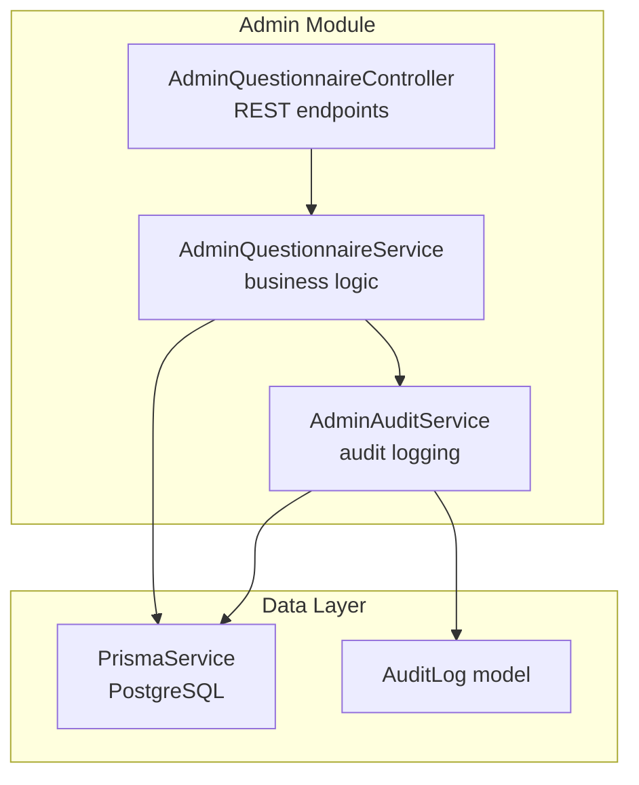
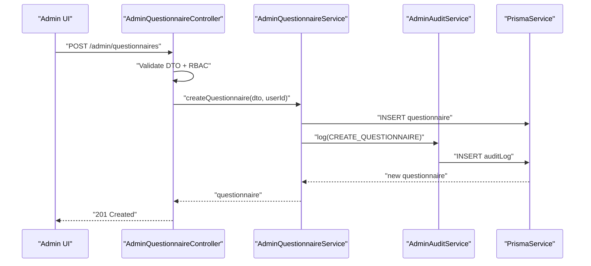
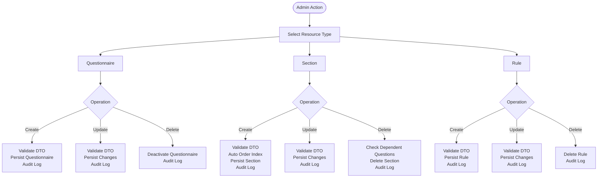
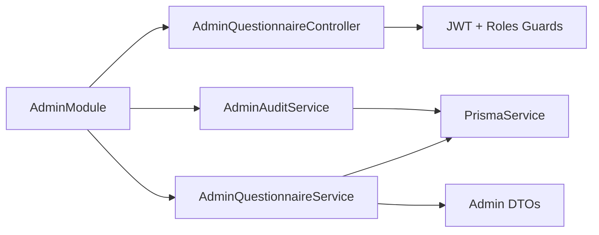
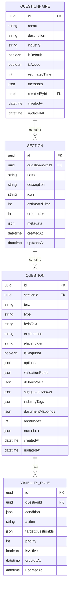

# Admin Management Interface

<cite>
**Referenced Files in This Document**
- [admin.module.ts](file://apps/api/src/modules/admin/admin.module.ts)
- [admin-questionnaire.controller.ts](file://apps/api/src/modules/admin/controllers/admin-questionnaire.controller.ts)
- [admin-questionnaire.service.ts](file://apps/api/src/modules/admin/services/admin-questionnaire.service.ts)
- [admin-audit.service.ts](file://apps/api/src/modules/admin/services/admin-audit.service.ts)
- [create-questionnaire.dto.ts](file://apps/api/src/modules/admin/dto/create-questionnaire.dto.ts)
- [update-questionnaire.dto.ts](file://apps/api/src/modules/admin/dto/update-questionnaire.dto.ts)
- [create-section.dto.ts](file://apps/api/src/modules/admin/dto/create-section.dto.ts)
- [update-section.dto.ts](file://apps/api/src/modules/admin/dto/update-section.dto.ts)
- [create-question.dto.ts](file://apps/api/src/modules/admin/dto/create-question.dto.ts)
- [update-question.dto.ts](file://apps/api/src/modules/admin/dto/update-question.dto.ts)
- [create-visibility-rule.dto.ts](file://apps/api/src/modules/admin/dto/create-visibility-rule.dto.ts)
- [admin-questionnaire.controller.spec.ts](file://apps/api/src/modules/admin/controllers/admin-questionnaire.controller.spec.ts)
- [dashboard.e2e.test.ts](file://e2e/admin/dashboard.e2e.test.ts)
- [data-flow-trust-boundaries.md](file://docs/architecture/data-flow-trust-boundaries.md)
- [questionnaire.service.ts](file://apps/api/src/modules/questionnaire/questionnaire.service.ts)
- [project-types.seed.ts](file://prisma/seeds/project-types.seed.ts)
- [business-incubator.seed.ts](file://prisma/seeds/business-incubator.seed.ts)
- [questions.seed.ts](file://prisma/seeds/questions.seed.ts)
</cite>

## Table of Contents
1. [Introduction](#introduction)
2. [Project Structure](#project-structure)
3. [Core Components](#core-components)
4. [Architecture Overview](#architecture-overview)
5. [Detailed Component Analysis](#detailed-component-analysis)
6. [Dependency Analysis](#dependency-analysis)
7. [Performance Considerations](#performance-considerations)
8. [Troubleshooting Guide](#troubleshooting-guide)
9. [Conclusion](#conclusion)
10. [Appendices](#appendices)

## Introduction
This document describes the administrative management interfaces for questionnaire creation, modification, and governance within the system. It covers the admin controllers, service layer implementation, data validation rules, audit logging, and integration points with decision logs and governance workflows. It also outlines user management interfaces, role-based access controls, and administrative permissions, along with examples of complex administrative scenarios, bulk operations, and system configuration.

## Project Structure
The admin module is organized around a dedicated controller and service layer with strongly typed DTOs for validation. The module integrates with Prisma for persistence and provides audit logging for all administrative actions.

**Diagram sources**
- [admin.module.ts:1-14](file://apps/api/src/modules/admin/admin.module.ts#L1-L14)
- [admin-questionnaire.controller.ts:35-275](file://apps/api/src/modules/admin/controllers/admin-questionnaire.controller.ts#L35-L275)
- [admin-questionnaire.service.ts:35-575](file://apps/api/src/modules/admin/services/admin-questionnaire.service.ts#L35-L575)
- [admin-audit.service.ts:15-58](file://apps/api/src/modules/admin/services/admin-audit.service.ts#L15-L58)

**Section sources**
- [admin.module.ts:1-14](file://apps/api/src/modules/admin/admin.module.ts#L1-L14)
- [admin-questionnaire.controller.ts:35-275](file://apps/api/src/modules/admin/controllers/admin-questionnaire.controller.ts#L35-L275)
- [admin-questionnaire.service.ts:35-575](file://apps/api/src/modules/admin/services/admin-questionnaire.service.ts#L35-L575)
- [admin-audit.service.ts:15-58](file://apps/api/src/modules/admin/services/admin-audit.service.ts#L15-L58)

## Core Components
- AdminQuestionnaireController: Exposes REST endpoints for managing questionnaires, sections, questions, and visibility rules. Enforces role-based access control (ADMIN, SUPER_ADMIN) and uses DTOs for input validation.
- AdminQuestionnaireService: Implements CRUD operations with transactional updates for reordering, soft deletion semantics for questionnaires, and audit logging integration.
- AdminAuditService: Captures administrative actions with request metadata (IP address, user agent, request ID) and persists them to the audit log.

Key validation rules enforced via DTOs:
- String length limits and optional fields for names, descriptions, icons, help/explanation text, placeholders, and metadata.
- Numeric constraints for estimated time and order indices.
- Enum validation for question types and visibility actions.
- Array validation for UUIDs in visibility rules and industry tags in questions.

**Section sources**
- [admin-questionnaire.controller.ts:46-275](file://apps/api/src/modules/admin/controllers/admin-questionnaire.controller.ts#L46-L275)
- [admin-questionnaire.service.ts:94-178](file://apps/api/src/modules/admin/services/admin-questionnaire.service.ts#L94-L178)
- [admin-audit.service.ts:21-56](file://apps/api/src/modules/admin/services/admin-audit.service.ts#L21-L56)
- [create-questionnaire.dto.ts:4-37](file://apps/api/src/modules/admin/dto/create-questionnaire.dto.ts#L4-L37)
- [update-questionnaire.dto.ts:6-11](file://apps/api/src/modules/admin/dto/update-questionnaire.dto.ts#L6-L11)
- [create-section.dto.ts:4-41](file://apps/api/src/modules/admin/dto/create-section.dto.ts#L4-L41)
- [create-question.dto.ts:33-109](file://apps/api/src/modules/admin/dto/create-question.dto.ts#L33-L109)
- [create-visibility-rule.dto.ts:17-51](file://apps/api/src/modules/admin/dto/create-visibility-rule.dto.ts#L17-L51)

## Architecture Overview
The admin module follows a layered architecture with explicit separation of concerns:
- Controllers handle HTTP requests, apply guards, and delegate to services.
- Services encapsulate business logic, orchestrate transactions, and coordinate audit logging.
- DTOs define strict input validation contracts.
- Persistence is handled by Prisma with audit records stored alongside primary resources.

**Diagram sources**
- [admin-questionnaire.controller.ts:72-81](file://apps/api/src/modules/admin/controllers/admin-questionnaire.controller.ts#L72-L81)
- [admin-questionnaire.service.ts:94-116](file://apps/api/src/modules/admin/services/admin-questionnaire.service.ts#L94-L116)
- [admin-audit.service.ts:21-44](file://apps/api/src/modules/admin/services/admin-audit.service.ts#L21-L44)

**Section sources**
- [admin-questionnaire.controller.ts:35-275](file://apps/api/src/modules/admin/controllers/admin-questionnaire.controller.ts#L35-L275)
- [admin-questionnaire.service.ts:35-575](file://apps/api/src/modules/admin/services/admin-questionnaire.service.ts#L35-L575)
- [admin-audit.service.ts:15-58](file://apps/api/src/modules/admin/services/admin-audit.service.ts#L15-L58)

## Detailed Component Analysis

### AdminQuestionnaireController
Responsibilities:
- Exposes endpoints for listing, retrieving, creating, updating, and deleting questionnaires, sections, questions, and visibility rules.
- Applies JWT authentication and role-based guards (ADMIN, SUPER_ADMIN) with specific restrictions for SUPER_ADMIN-only deletions.
- Uses pagination DTOs for listing endpoints and validates UUID parameters.

Access control highlights:
- Creation and updates require ADMIN or SUPER_ADMIN.
- Deletions require SUPER_ADMIN.
- Some endpoints support reordering within sections and questionnaires.

Response formatting:
- List endpoints return items plus pagination metadata with defaults for page and limit.

**Section sources**
- [admin-questionnaire.controller.ts:46-275](file://apps/api/src/modules/admin/controllers/admin-questionnaire.controller.ts#L46-L275)

### AdminQuestionnaireService
CRUD operations:
- Questionnaire: create, update (including activation flag), soft delete by deactivation, and retrieval with nested sections and questions.
- Section: create with automatic order index calculation, update, delete with safety checks against dependent questions, and bulk reordering via transaction.
- Question: create with automatic order index calculation, update, delete with safety checks against existing responses, and bulk reordering via transaction.
- Visibility Rule: create, update, delete, and listing by question.

Transactional integrity:
- Reordering operations wrap multiple updates in a single Prisma transaction to maintain consistency.

Audit integration:
- Each operation logs before/after states or contextual changes to the audit log.

Safety validations:
- Prevents deletion of sections containing questions.
- Prevents deletion of questions with existing responses to avoid data corruption.

**Section sources**
- [admin-questionnaire.service.ts:46-575](file://apps/api/src/modules/admin/services/admin-questionnaire.service.ts#L46-L575)

### AdminAuditService
Features:
- Logs administrative actions with user identity, action type, resource type, and resource identifier.
- Captures request metadata (IP address, user agent, request ID) for traceability.
- Serializes changes safely and handles logging failures gracefully with error logging.

**Section sources**
- [admin-audit.service.ts:21-56](file://apps/api/src/modules/admin/services/admin-audit.service.ts#L21-L56)

### DTO Validation Rules
- Questionnaire: name length limit, optional description/industry/tags, boolean flags, positive integer for estimated time, JSON metadata.
- Section: name length limit, optional description/icon, positive integer for estimated time/order index, JSON metadata.
- Question: text length limit, required type enum, optional help/explanation/placeholder, boolean required flag, optional options array, validation rules object, default/suggested answer values, industry tags array, document mappings object, order index, JSON metadata.
- Visibility Rule: condition object, action enum, target question UUID array, optional priority and active flag.

**Section sources**
- [create-questionnaire.dto.ts:4-37](file://apps/api/src/modules/admin/dto/create-questionnaire.dto.ts#L4-L37)
- [update-questionnaire.dto.ts:6-11](file://apps/api/src/modules/admin/dto/update-questionnaire.dto.ts#L6-L11)
- [create-section.dto.ts:4-41](file://apps/api/src/modules/admin/dto/create-section.dto.ts#L4-L41)
- [update-section.dto.ts:4](file://apps/api/src/modules/admin/dto/update-section.dto.ts#L4)
- [create-question.dto.ts:33-109](file://apps/api/src/modules/admin/dto/create-question.dto.ts#L33-L109)
- [update-question.dto.ts:4](file://apps/api/src/modules/admin/dto/update-question.dto.ts#L4)
- [create-visibility-rule.dto.ts:17-51](file://apps/api/src/modules/admin/dto/create-visibility-rule.dto.ts#L17-L51)

### Workflow Management Interfaces
- Questionnaire lifecycle: create, activate/deactivate, soft delete, and view with counts.
- Section lifecycle: create, reorder, update, and delete with safety checks.
- Question lifecycle: create, reorder, update, and delete with safety checks.
- Visibility rules: create, update, delete, and list per question.

**Diagram sources**
- [admin-questionnaire.controller.ts:46-275](file://apps/api/src/modules/admin/controllers/admin-questionnaire.controller.ts#L46-L275)
- [admin-questionnaire.service.ts:94-575](file://apps/api/src/modules/admin/services/admin-questionnaire.service.ts#L94-L575)

**Section sources**
- [admin-questionnaire.controller.ts:46-275](file://apps/api/src/modules/admin/controllers/admin-questionnaire.controller.ts#L46-L275)
- [admin-questionnaire.service.ts:94-575](file://apps/api/src/modules/admin/services/admin-questionnaire.service.ts#L94-L575)

### Document Review and Governance Integration
- Decision log integration: The system includes a decision log module with approval workflows that can be integrated with administrative actions affecting documents and questionnaires.
- Governance workflows: Administrative actions are auditable and can be traced through the audit log for compliance and governance reviews.

Note: The admin module currently focuses on questionnaire and rule management. Document review and governance workflows are implemented in separate modules and can be coordinated with admin actions.

**Section sources**
- [data-flow-trust-boundaries.md:308-355](file://docs/architecture/data-flow-trust-boundaries.md#L308-L355)

### User Management and Role-Based Access Controls
- Roles: ADMIN and SUPER_ADMIN are supported. SUPER_ADMIN has elevated privileges for deletions.
- Guards: JWT authentication and roles guard are applied across all admin endpoints.
- IP allowlist: Security boundaries specify IP restrictions for admin operations.

**Section sources**
- [admin-questionnaire.controller.ts:47-98](file://apps/api/src/modules/admin/controllers/admin-questionnaire.controller.ts#L47-L98)
- [data-flow-trust-boundaries.md:316-354](file://docs/architecture/data-flow-trust-boundaries.md#L316-L354)

### Examples of Complex Administrative Scenarios
- Bulk reordering of sections within a questionnaire: The service performs a transactional update of multiple sections to ensure atomicity.
- Bulk reordering of questions within a section: Similar transactional approach ensures consistent ordering.
- Creating a questionnaire with nested sections and questions: The service supports hierarchical creation with automatic order index calculation.
- Establishing visibility rules that depend on other questions: Rules can target multiple questions and include complex conditions.

**Section sources**
- [admin-questionnaire.service.ts:282-313](file://apps/api/src/modules/admin/services/admin-questionnaire.service.ts#L282-L313)
- [admin-questionnaire.service.ts:433-464](file://apps/api/src/modules/admin/services/admin-questionnaire.service.ts#L433-L464)
- [business-incubator.seed.ts:580-595](file://prisma/seeds/business-incubator.seed.ts#L580-L595)

### Frontend Admin Components and Form Builders
- The frontend includes admin pages and components under the web application. While the specific component files are not analyzed here, the admin routes and endpoints documented above provide the backend contract for building admin interfaces.
- The E2E tests indicate admin dashboards and audit log features, suggesting UI surfaces for administrative tasks.

**Section sources**
- [dashboard.e2e.test.ts:339-373](file://e2e/admin/dashboard.e2e.test.ts#L339-L373)

## Dependency Analysis
The admin module depends on:
- PrismaModule for database access.
- Auth guards for JWT and role-based access control.
- Shared DTOs for input validation.
- Audit service for logging administrative actions.

**Diagram sources**
- [admin.module.ts:7-12](file://apps/api/src/modules/admin/admin.module.ts#L7-L12)
- [admin-questionnaire.controller.ts:13-21](file://apps/api/src/modules/admin/controllers/admin-questionnaire.controller.ts#L13-L21)
- [admin-questionnaire.service.ts:37-40](file://apps/api/src/modules/admin/services/admin-questionnaire.service.ts#L37-L40)
- [admin-audit.service.ts:19](file://apps/api/src/modules/admin/services/admin-audit.service.ts#L19)

**Section sources**
- [admin.module.ts:1-14](file://apps/api/src/modules/admin/admin.module.ts#L1-L14)
- [admin-questionnaire.controller.ts:13-21](file://apps/api/src/modules/admin/controllers/admin-questionnaire.controller.ts#L13-L21)
- [admin-questionnaire.service.ts:37-40](file://apps/api/src/modules/admin/services/admin-questionnaire.service.ts#L37-L40)
- [admin-audit.service.ts:19](file://apps/api/src/modules/admin/services/admin-audit.service.ts#L19)

## Performance Considerations
- Transactional reordering: Reordering operations use Prisma transactions to minimize partial state and ensure consistency.
- Pagination: Listing endpoints support pagination to manage large datasets efficiently.
- Selective includes: Retrieval of questionnaires includes only necessary relations to reduce payload size.
- Audit logging overhead: Logging is asynchronous from the service perspective but still involves database writes; monitor audit volume in high-traffic scenarios.

## Troubleshooting Guide
Common issues and resolutions:
- Not found errors: Occur when attempting to operate on missing resources (questionnaire, section, question, rule). Ensure the resource exists before invoking operations.
- Bad request errors: Occur when attempting to delete sections with questions or questions with responses. Remove dependencies first.
- Audit log failures: The audit service logs errors if audit entries cannot be persisted. Investigate database connectivity and schema.

Testing and validation:
- Unit tests validate controller behavior and pagination defaults.
- E2E tests cover admin dashboard and audit log features, indicating expected UI flows.

**Section sources**
- [admin-questionnaire.service.ts:265-269](file://apps/api/src/modules/admin/services/admin-questionnaire.service.ts#L265-L269)
- [admin-questionnaire.service.ts:416-420](file://apps/api/src/modules/admin/services/admin-questionnaire.service.ts#L416-L420)
- [admin-questionnaire.controller.spec.ts:93-129](file://apps/api/src/modules/admin/controllers/admin-questionnaire.controller.spec.ts#L93-L129)
- [dashboard.e2e.test.ts:339-373](file://e2e/admin/dashboard.e2e.test.ts#L339-L373)

## Conclusion
The admin management interfaces provide a robust, secure, and auditable foundation for questionnaire lifecycle management. With role-based access control, strong input validation, transactional operations, and comprehensive audit logging, administrators can confidently manage questionnaires, sections, questions, and visibility rules while maintaining compliance and governance standards.

## Appendices

### Data Model Overview for Admin Resources

**Diagram sources**
- [admin-questionnaire.service.ts:24-33](file://apps/api/src/modules/admin/services/admin-questionnaire.service.ts#L24-L33)
- [admin-questionnaire.service.ts:470-483](file://apps/api/src/modules/admin/services/admin-questionnaire.service.ts#L470-L483)

### Example Seed Data References
- Project types seed creates default questionnaires and sections for various project slugs.
- Business incubator seed demonstrates visibility rule linking between questions.
- Questions seed shows upsert patterns for questions with metadata and options.

**Section sources**
- [project-types.seed.ts:599-635](file://prisma/seeds/project-types.seed.ts#L599-L635)
- [business-incubator.seed.ts:580-595](file://prisma/seeds/business-incubator.seed.ts#L580-L595)
- [questions.seed.ts:1048-1094](file://prisma/seeds/questions.seed.ts#L1048-L1094)