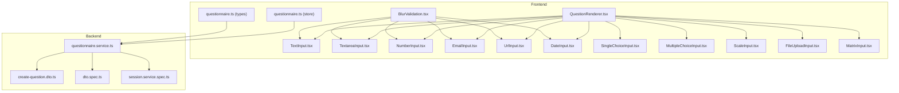
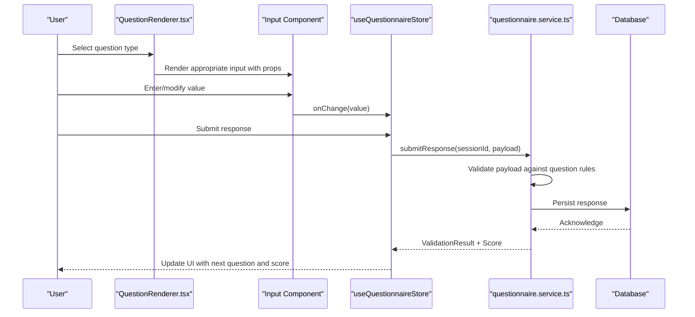
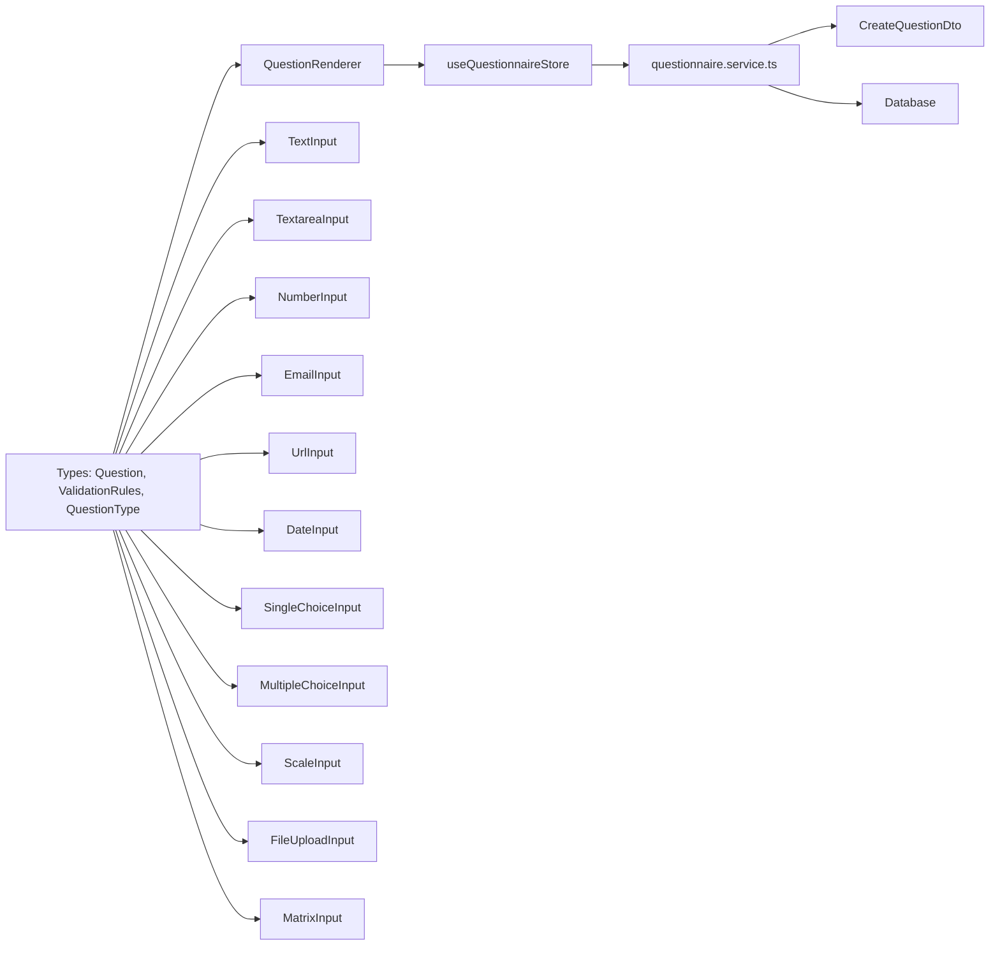

# Question Types and Validation

<cite>
**Referenced Files in This Document**
- [index.ts](file://apps/web/src/components/questionnaire/index.ts)
- [TextInput.tsx](file://apps/web/src/components/questionnaire/TextInput.tsx)
- [TextareaInput.tsx](file://apps/web/src/components/questionnaire/TextareaInput.tsx)
- [NumberInput.tsx](file://apps/web/src/components/questionnaire/NumberInput.tsx)
- [EmailInput.tsx](file://apps/web/src/components/questionnaire/EmailInput.tsx)
- [UrlInput.tsx](file://apps/web/src/components/questionnaire/UrlInput.tsx)
- [DateInput.tsx](file://apps/web/src/components/questionnaire/DateInput.tsx)
- [SingleChoiceInput.tsx](file://apps/web/src/components/questionnaire/SingleChoiceInput.tsx)
- [MultipleChoiceInput.tsx](file://apps/web/src/components/questionnaire/MultipleChoiceInput.tsx)
- [ScaleInput.tsx](file://apps/web/src/components/questionnaire/ScaleInput.tsx)
- [FileUploadInput.tsx](file://apps/web/src/components/questionnaire/FileUploadInput.tsx)
- [MatrixInput.tsx](file://apps/web/src/components/questionnaire/MatrixInput.tsx)
- [QuestionRenderer.tsx](file://apps/web/src/components/questionnaire/QuestionRenderer.tsx)
- [questionnaire.ts](file://apps/web/src/stores/questionnaire.ts)
- [questionnaire.ts](file://apps/web/src/types/questionnaire.ts)
- [BlurValidation.tsx](file://apps/web/src/components/ux/BlurValidation.tsx)
- [questionnaire.service.ts](file://apps/api/src/modules/questionnaire/questionnaire.service.ts)
- [create-question.dto.ts](file://apps/api/src/modules/admin/dto/create-question.dto.ts)
- [dto.spec.ts](file://apps/api/src/modules/admin/dto/dto.spec.ts)
- [session.service.spec.ts](file://apps/api/src/modules/session/session.service.spec.ts)
</cite>

## Table of Contents
1. [Introduction](#introduction)
2. [Project Structure](#project-structure)
3. [Core Components](#core-components)
4. [Architecture Overview](#architecture-overview)
5. [Detailed Component Analysis](#detailed-component-analysis)
6. [Dependency Analysis](#dependency-analysis)
7. [Performance Considerations](#performance-considerations)
8. [Troubleshooting Guide](#troubleshooting-guide)
9. [Conclusion](#conclusion)

## Introduction
This document explains the 11 question types and the validation system used by the Quiz-to-Build questionnaire application. It covers frontend input components, prop interfaces, user interaction patterns, and backend validation schemas and constraints. It also details required field handling, pattern matching, custom validation logic, conditional requirements, accessibility features, and performance considerations for large questionnaires and real-time validation feedback.

## Project Structure
The questionnaire feature spans the frontend (React components and stores) and the backend (DTOs, services, and API). The frontend exposes a consolidated export of all question input components and orchestration utilities. The backend defines validation constraints for question creation and enforces validation during response submission.

**Diagram sources**
- [QuestionRenderer.tsx](file://apps/web/src/components/questionnaire/QuestionRenderer.tsx)
- [TextInput.tsx](file://apps/web/src/components/questionnaire/TextInput.tsx)
- [TextareaInput.tsx](file://apps/web/src/components/questionnaire/TextareaInput.tsx)
- [NumberInput.tsx](file://apps/web/src/components/questionnaire/NumberInput.tsx)
- [EmailInput.tsx](file://apps/web/src/components/questionnaire/EmailInput.tsx)
- [UrlInput.tsx](file://apps/web/src/components/questionnaire/UrlInput.tsx)
- [DateInput.tsx](file://apps/web/src/components/questionnaire/DateInput.tsx)
- [SingleChoiceInput.tsx](file://apps/web/src/components/questionnaire/SingleChoiceInput.tsx)
- [MultipleChoiceInput.tsx](file://apps/web/src/components/questionnaire/MultipleChoiceInput.tsx)
- [ScaleInput.tsx](file://apps/web/src/components/questionnaire/ScaleInput.tsx)
- [FileUploadInput.tsx](file://apps/web/src/components/questionnaire/FileUploadInput.tsx)
- [MatrixInput.tsx](file://apps/web/src/components/questionnaire/MatrixInput.tsx)
- [questionnaire.ts](file://apps/web/src/stores/questionnaire.ts)
- [questionnaire.ts](file://apps/web/src/types/questionnaire.ts)
- [BlurValidation.tsx](file://apps/web/src/components/ux/BlurValidation.tsx)
- [questionnaire.service.ts](file://apps/api/src/modules/questionnaire/questionnaire.service.ts)
- [create-question.dto.ts](file://apps/api/src/modules/admin/dto/create-question.dto.ts)
- [dto.spec.ts](file://apps/api/src/modules/admin/dto/dto.spec.ts)
- [session.service.spec.ts](file://apps/api/src/modules/session/session.service.spec.ts)

**Section sources**
- [index.ts:1-23](file://apps/web/src/components/questionnaire/index.ts#L1-L23)

## Core Components
- Question types enumeration and validation rules are defined in the frontend types module.
- The questionnaire store manages session lifecycle, navigation, scoring, and response submission.
- QuestionRenderer selects and renders the appropriate input component per question type.
- Individual input components encapsulate props, accessibility attributes, and basic HTML validation attributes derived from question metadata.

Key responsibilities:
- Frontend types define QuestionType, ValidationRules, Question, and QuestionInputProps interfaces.
- BlurValidation provides reusable validation rules and a validator function for runtime checks.
- Store actions coordinate API calls for creating sessions, continuing sessions, submitting responses, and loading scores.

**Section sources**
- [questionnaire.ts:8-22](file://apps/web/src/types/questionnaire.ts#L8-L22)
- [questionnaire.ts:94-102](file://apps/web/src/types/questionnaire.ts#L94-L102)
- [questionnaire.ts:200-210](file://apps/web/src/types/questionnaire.ts#L200-L210)
- [BlurValidation.tsx:56-186](file://apps/web/src/components/ux/BlurValidation.tsx#L56-L186)
- [questionnaire.ts:52-74](file://apps/web/src/stores/questionnaire.ts#L52-L74)

## Architecture Overview
The system integrates frontend input components with backend validation and scoring. The store coordinates user actions and updates state. Backend services enforce constraints defined in DTOs and return validation results and scoring updates.

**Diagram sources**
- [QuestionRenderer.tsx](file://apps/web/src/components/questionnaire/QuestionRenderer.tsx)
- [questionnaire.ts:57-62](file://apps/web/src/stores/questionnaire.ts#L57-L62)
- [questionnaire.service.ts:296-319](file://apps/api/src/modules/questionnaire/questionnaire.service.ts#L296-L319)
- [session.service.spec.ts:3260-3296](file://apps/api/src/modules/session/session.service.spec.ts#L3260-L3296)

## Detailed Component Analysis

### Question Type Definitions and Prop Interfaces
- QuestionType enumerates all supported question types.
- ValidationRules supports required, min/max length for strings, min/max for numbers, and pattern/patternMessage.
- QuestionInputProps standardizes how components receive question metadata, current value, change handler, error message, and flags.

Implementation highlights:
- Props typing ensures strong contracts between renderer and components.
- Accessibility attributes (aria-describedby) connect inputs to error messages.

**Section sources**
- [questionnaire.ts:8-22](file://apps/web/src/types/questionnaire.ts#L8-L22)
- [questionnaire.ts:94-102](file://apps/web/src/types/questionnaire.ts#L94-L102)
- [questionnaire.ts:200-210](file://apps/web/src/types/questionnaire.ts#L200-L210)

### Text Inputs (Single-line)
- TextInput maps question.isRequired, placeholder, and validationRules to native attributes (required, minLength, maxLength, pattern).
- It renders an input with error styling and an associated error paragraph for screen readers.

Validation behavior:
- Required field handling via HTML required attribute.
- Real-time feedback via maxLength counter in textarea variant; similar UX patterns can be applied to single-line text inputs.

Accessibility:
- Uses aria-describedby to associate error messages with inputs.

**Section sources**
- [TextInput.tsx:7-41](file://apps/web/src/components/questionnaire/TextInput.tsx#L7-L41)
- [questionnaire.ts:94-102](file://apps/web/src/types/questionnaire.ts#L94-L102)

### Text Inputs (Multi-line)
- TextareaInput mirrors single-line behavior with rows and a character counter when maxLength is present.
- Error messaging and accessibility attributes are handled similarly.

**Section sources**
- [TextareaInput.tsx:7-45](file://apps/web/src/components/questionnaire/TextareaInput.tsx#L7-L45)
- [questionnaire.ts:94-102](file://apps/web/src/types/questionnaire.ts#L94-L102)

### Numeric Inputs
- NumberInput uses type="number" and translates string values to numbers on change.
- Applies required, min, and max from validationRules.

Real-time validation:
- Backend tests demonstrate min/max enforcement and skipping of numeric rules for non-numeric values.

**Section sources**
- [NumberInput.tsx:7-40](file://apps/web/src/components/questionnaire/NumberInput.tsx#L7-L40)
- [questionnaire.ts:94-102](file://apps/web/src/types/questionnaire.ts#L94-L102)
- [session.service.spec.ts:3292-3296](file://apps/api/src/modules/session/session.service.spec.ts#L3292-L3296)

### Date Pickers
- DateInput component is exported but not included in the current snapshot. The types module includes DATE in QuestionType, indicating support for date inputs.

Recommendation:
- Implement a native date input with min/max constraints and localized formatting. Apply the same prop interface and accessibility patterns as other inputs.

**Section sources**
- [index.ts:11-11](file://apps/web/src/components/questionnaire/index.ts#L11-L11)
- [questionnaire.ts:8-22](file://apps/web/src/types/questionnaire.ts#L8-L22)

### Email Validation
- EmailInput uses type="email" and includes an envelope icon for clarity.
- Pattern validation can be applied via validationRules.pattern; otherwise, HTML5 email validation applies.

Real-time validation:
- Backend tests demonstrate that string-based rules (e.g., minLength/maxLength) are ignored for non-string values.

**Section sources**
- [EmailInput.tsx:7-49](file://apps/web/src/components/questionnaire/EmailInput.tsx#L7-L49)
- [questionnaire.ts:94-102](file://apps/web/src/types/questionnaire.ts#L94-L102)
- [session.service.spec.ts:3275-3290](file://apps/api/src/modules/session/session.service.spec.ts#L3275-L3290)

### URL Inputs
- UrlInput component is exported but not included in the current snapshot. The types module includes URL in QuestionType, indicating support for URL inputs.

Recommendation:
- Implement a URL input with pattern validation and protocol-aware checks. Integrate with BlurValidation for consistent behavior.

**Section sources**
- [index.ts:10-10](file://apps/web/src/components/questionnaire/index.ts#L10-L10)
- [questionnaire.ts:8-22](file://apps/web/src/types/questionnaire.ts#L8-L22)

### File Upload Capabilities
- FileUploadInput component is exported but not included in the current snapshot. The types module includes FILE_UPLOAD in QuestionType, indicating support for file uploads.

Recommendation:
- Implement drag-and-drop or browse behavior, validate MIME types and sizes, and integrate with evidence tracking. Ensure secure upload handling and accessibility labeling.

**Section sources**
- [index.ts:15-15](file://apps/web/src/components/questionnaire/index.ts#L15-L15)
- [questionnaire.ts:8-22](file://apps/web/src/types/questionnaire.ts#L8-L22)

### Scale/Rating Systems
- ScaleInput component is exported but not included in the current snapshot. The types module includes SCALE in QuestionType, indicating support for numeric scales.

Recommendation:
- Implement discrete steps with min/max/step and optional labeled ends. Provide keyboard navigation and ARIA attributes for screen readers.

**Section sources**
- [index.ts:14-14](file://apps/web/src/components/questionnaire/index.ts#L14-L14)
- [questionnaire.ts:8-22](file://apps/web/src/types/questionnaire.ts#L8-L22)
- [questionnaire.ts:74-81](file://apps/web/src/types/questionnaire.ts#L74-L81)

### Matrix Grids
- MatrixInput component is exported but not included in the current snapshot. The types module includes MATRIX in QuestionType, indicating support for matrix-style questions.

Recommendation:
- Implement row/column grid with radio buttons or select controls per cell. Ensure responsive layout and keyboard operability.

**Section sources**
- [index.ts:16-16](file://apps/web/src/components/questionnaire/index.ts#L16-L16)
- [questionnaire.ts:8-22](file://apps/web/src/types/questionnaire.ts#L8-L22)
- [questionnaire.ts:84-89](file://apps/web/src/types/questionnaire.ts#L84-L89)

### Multiple Choice (Single Selection)
- SingleChoiceInput component is exported but not included in the current snapshot. The types module includes SINGLE_CHOICE in QuestionType, with QuestionOption supporting value/label/icon/description.

Recommendation:
- Render radio buttons or a select dropdown. Ensure exclusive selection and accessible labeling.

**Section sources**
- [index.ts:12-12](file://apps/web/src/components/questionnaire/index.ts#L12-L12)
- [questionnaire.ts:8-22](file://apps/web/src/types/questionnaire.ts#L8-L22)
- [questionnaire.ts:64-69](file://apps/web/src/types/questionnaire.ts#L64-L69)

### Multiple Choice (Multiple Selection)
- MultipleChoiceInput component is exported but not included in the current snapshot. The types module includes MULTIPLE_CHOICE in QuestionType.

Recommendation:
- Render checkboxes with clear selection semantics. Enforce minimum/maximum selections if required by validationRules.

**Section sources**
- [index.ts:13-13](file://apps/web/src/components/questionnaire/index.ts#L13-L13)
- [questionnaire.ts:8-22](file://apps/web/src/types/questionnaire.ts#L8-L22)

### Specialized Inputs
- CoverageLevel and COVERAGE_LEVEL_VALUES are defined for five-level evidence scales. These can be integrated into specialized rating or evidence inputs.

Recommendation:
- Use discrete scale components aligned with CoverageLevel values. Provide visual indicators and rationale fields.

**Section sources**
- [questionnaire.ts:27-46](file://apps/web/src/types/questionnaire.ts#L27-L46)

### Validation Rules and Real-Time Feedback
- BlurValidation provides reusable rules for required, minLength, maxLength, email, pattern, url, numeric, integer, min, max, password, match, and custom validators.
- validateField evaluates rules based on trigger conditions: blur, change, or submit.

Integration patterns:
- Components can call validateField on blur/change or pass precomputed error messages to inputs.
- For pattern matching, use validationRules.pattern with patternMessage for user-friendly feedback.

**Section sources**
- [BlurValidation.tsx:56-186](file://apps/web/src/components/ux/BlurValidation.tsx#L56-L186)
- [questionnaire.ts:94-102](file://apps/web/src/types/questionnaire.ts#L94-L102)

### Backend Validation Schemas and Constraint Enforcement
- CreateQuestionDto enforces presence of text and type, with optional fields like helpText, explanation, placeholder, isRequired, validationRules, and orderIndex constraints.
- Tests in dto.spec.ts assert validation behavior for missing required fields, acceptable optional fields, and boundary conditions (e.g., max length, negative orderIndex).
- Backend questionnaire mapping preserves question metadata (including validation) for rendering and evaluation.

Submission-time validation:
- Tests in session.service.spec.ts demonstrate min/max enforcement and rule skipping for incompatible value types.

**Section sources**
- [create-question.dto.ts:33-61](file://apps/api/src/modules/admin/dto/create-question.dto.ts#L33-L61)
- [dto.spec.ts:183-256](file://apps/api/src/modules/admin/dto/dto.spec.ts#L183-L256)
- [questionnaire.service.ts:296-319](file://apps/api/src/modules/questionnaire/questionnaire.service.ts#L296-L319)
- [session.service.spec.ts:3260-3296](file://apps/api/src/modules/session/session.service.spec.ts#L3260-L3296)

### User Interaction Patterns and Navigation
- The store manages navigation history, enabling back/forward review and skip for non-required questions.
- Submitting a response triggers refresh of next questions and updates readiness score and NQS hints.

Accessibility:
- Components consistently use aria-describedby for error association.
- Focus management and keyboard navigation should be implemented across all input variants.

**Section sources**
- [questionnaire.ts:175-233](file://apps/web/src/stores/questionnaire.ts#L175-L233)
- [questionnaire.ts:270-356](file://apps/web/src/stores/questionnaire.ts#L270-L356)

### Examples of Complex Validation Scenarios
- Contradictory min/max constraints: Backend validation flags invalid combinations and returns descriptive errors.
- Mixed-type values: String rules (minLength/maxLength) are ignored for non-string values; numeric rules are ignored for non-numeric values.

Conditional requirements:
- While explicit visibility rules are tested in admin DTO specs, runtime conditional requirement logic is not visible in the provided files. Consider integrating adaptive logic with QuestionnaireFlow to hide/show questions based on prior answers.

**Section sources**
- [session.service.spec.ts:3260-3296](file://apps/api/src/modules/session/session.service.spec.ts#L3260-L3296)
- [dto.spec.ts:350-355](file://apps/api/src/modules/admin/dto/dto.spec.ts#L350-L355)

## Dependency Analysis
Frontend-to-backend dependencies:
- QuestionRenderer depends on QuestionInputProps and Question types.
- Input components depend on Question metadata (isRequired, validationRules).
- Store actions depend on questionnaire API service.
- Backend services depend on DTOs and Prisma models.

**Diagram sources**
- [questionnaire.ts:107-128](file://apps/web/src/types/questionnaire.ts#L107-L128)
- [QuestionRenderer.tsx](file://apps/web/src/components/questionnaire/QuestionRenderer.tsx)
- [TextInput.tsx](file://apps/web/src/components/questionnaire/TextInput.tsx)
- [TextareaInput.tsx](file://apps/web/src/components/questionnaire/TextareaInput.tsx)
- [NumberInput.tsx](file://apps/web/src/components/questionnaire/NumberInput.tsx)
- [EmailInput.tsx](file://apps/web/src/components/questionnaire/EmailInput.tsx)
- [UrlInput.tsx](file://apps/web/src/components/questionnaire/UrlInput.tsx)
- [DateInput.tsx](file://apps/web/src/components/questionnaire/DateInput.tsx)
- [SingleChoiceInput.tsx](file://apps/web/src/components/questionnaire/SingleChoiceInput.tsx)
- [MultipleChoiceInput.tsx](file://apps/web/src/components/questionnaire/MultipleChoiceInput.tsx)
- [ScaleInput.tsx](file://apps/web/src/components/questionnaire/ScaleInput.tsx)
- [FileUploadInput.tsx](file://apps/web/src/components/questionnaire/FileUploadInput.tsx)
- [MatrixInput.tsx](file://apps/web/src/components/questionnaire/MatrixInput.tsx)
- [questionnaire.ts:57-62](file://apps/web/src/stores/questionnaire.ts#L57-L62)
- [questionnaire.service.ts:296-319](file://apps/api/src/modules/questionnaire/questionnaire.service.ts#L296-L319)
- [create-question.dto.ts:33-61](file://apps/api/src/modules/admin/dto/create-question.dto.ts#L33-L61)

**Section sources**
- [questionnaire.ts:107-128](file://apps/web/src/types/questionnaire.ts#L107-L128)
- [questionnaire.ts:57-62](file://apps/web/src/stores/questionnaire.ts#L57-L62)
- [questionnaire.service.ts:296-319](file://apps/api/src/modules/questionnaire/questionnaire.service.ts#L296-L319)
- [create-question.dto.ts:33-61](file://apps/api/src/modules/admin/dto/create-question.dto.ts#L33-L61)

## Performance Considerations
- Debounce real-time validation for expensive patterns or remote checks to reduce re-renders.
- Virtualize long questionnaires and lazy-load heavy components (e.g., matrix grids).
- Batch submit responses to minimize network requests; coalesce updates in the store.
- Cache frequently accessed question metadata and options to avoid repeated fetches.
- Optimize rendering by memoizing QuestionRenderer and individual input components.

## Troubleshooting Guide
Common issues and resolutions:
- Validation not triggering: Ensure validationRules are populated and components bind required/min/max/pattern attributes.
- Conflicting min/max: Backend tests show contradictory constraints produce errors; adjust rules to be consistent.
- Non-string values with string rules: Backend ignores minLength/maxLength for non-string values; ensure value types align with intended rules.
- Pattern validation failures: Provide clear patternMessage and test regex behavior with representative inputs.
- Skipping optional questions: Use store’s skipQuestion action for non-required questions; review mode updates history entries accordingly.

**Section sources**
- [session.service.spec.ts:3260-3296](file://apps/api/src/modules/session/session.service.spec.ts#L3260-L3296)
- [questionnaire.ts:320-339](file://apps/web/src/stores/questionnaire.ts#L320-L339)

## Conclusion
The questionnaire system combines a robust frontend component library with backend DTO-driven validation. By leveraging standardized prop interfaces, reusable validation rules, and a centralized store, it supports all 11 question types while maintaining accessibility and performance. Extending specialized inputs and integrating adaptive logic will further enhance usability for complex assessments.