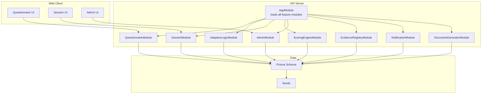
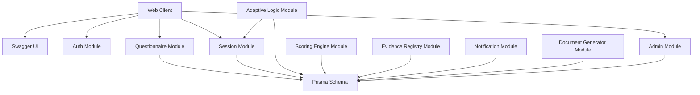
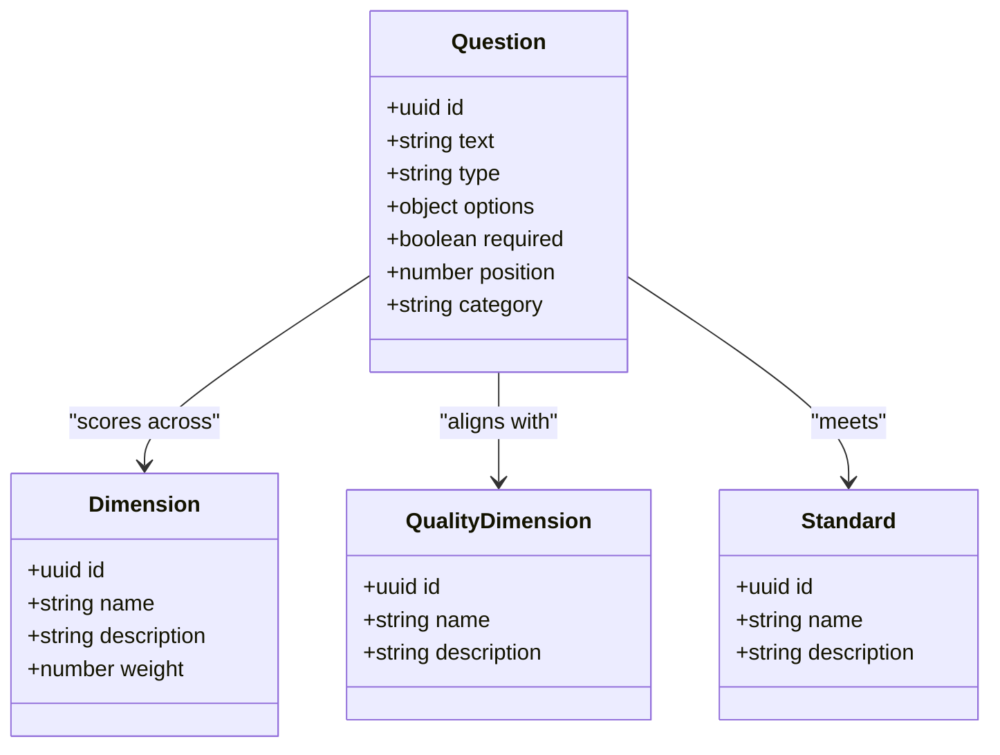
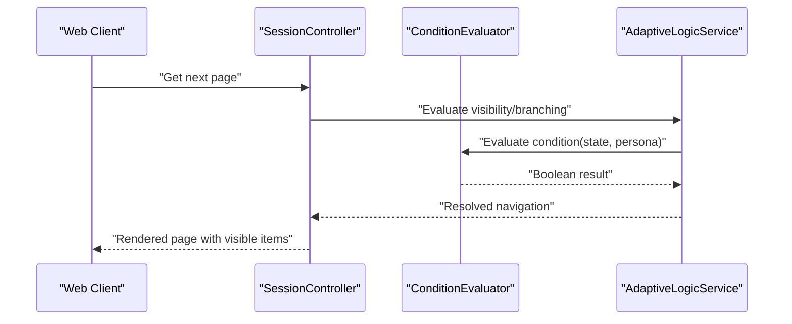
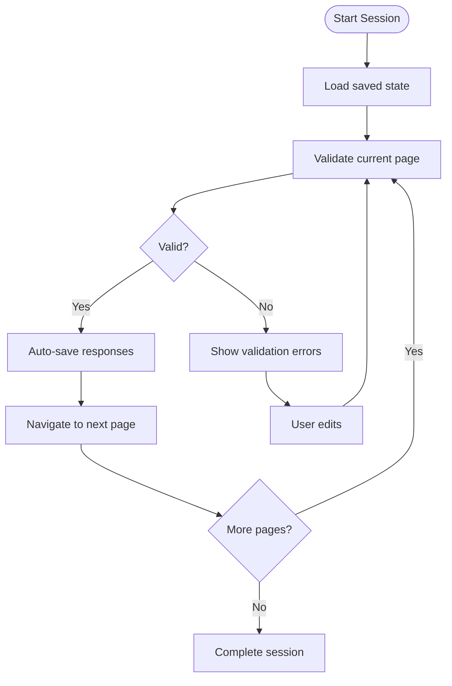
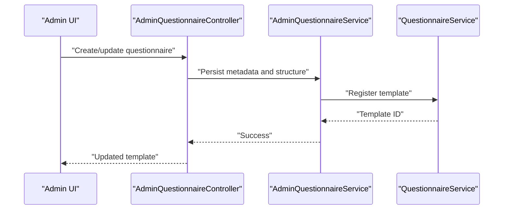
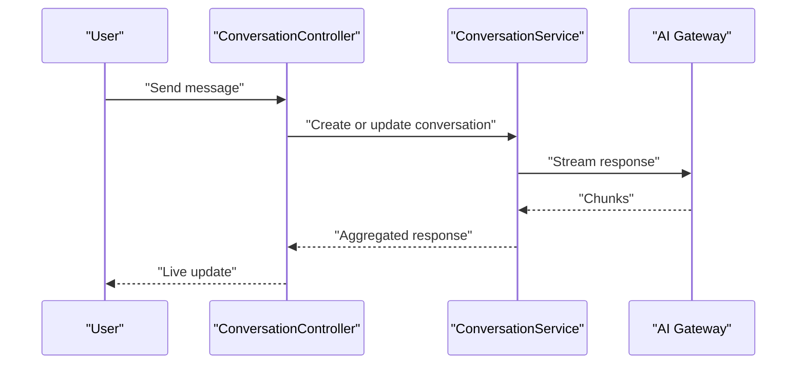
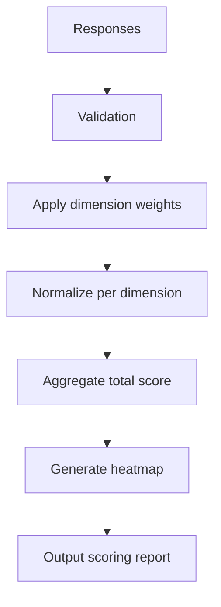
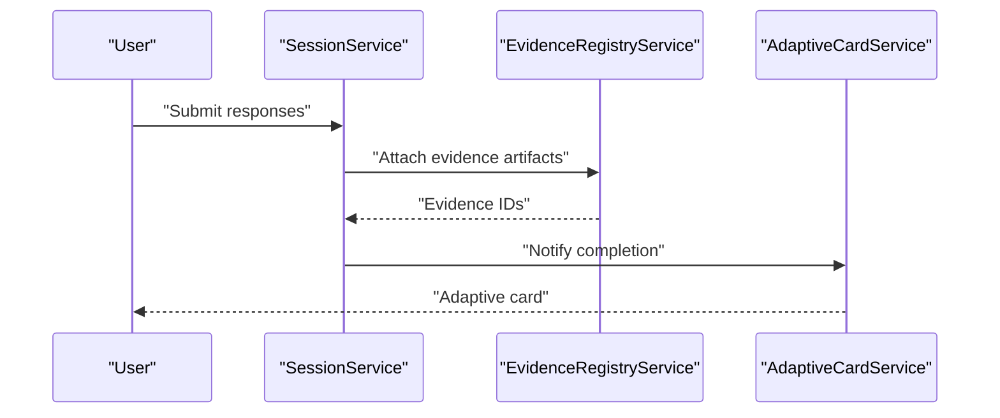
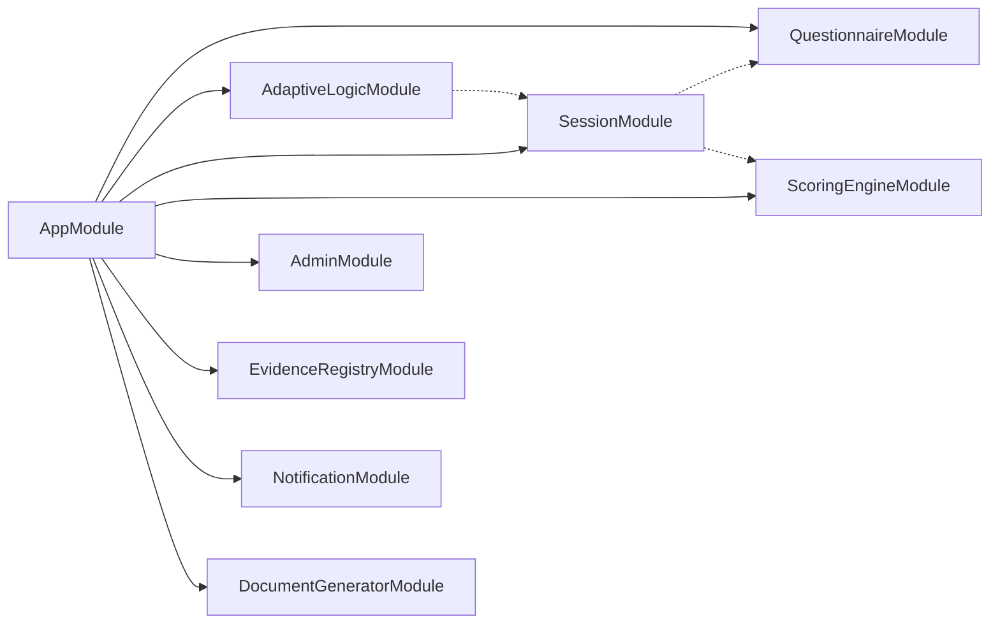

# Questionnaire System

<cite>
**Referenced Files in This Document**
- [app.module.ts](file://apps/api/src/app.module.ts)
- [main.ts](file://apps/api/src/main.ts)
- [questionnaire.module.ts](file://apps/api/src/modules/questionnaire/questionnaire.module.ts)
- [adaptive-logic.module.ts](file://apps/api/src/modules/adaptive-logic/adaptive-logic.module.ts)
- [session.module.ts](file://apps/api/src/modules/session/session.module.ts)
- [questionnaire.controller.ts](file://apps/api/src/modules/questionnaire/questionnaire.controller.ts)
- [questionnaire.service.ts](file://apps/api/src/modules/questionnaire/questionnaire.service.ts)
- [adaptive-logic.service.ts](file://apps/api/src/modules/adaptive-logic/adaptive-logic.service.ts)
- [condition.evaluator.ts](file://apps/api/src/modules/adaptive-logic/evaluators/condition.evaluator.ts)
- [rule.types.ts](file://apps/api/src/modules/adaptive-logic/types/rule.types.ts)
- [session.controller.ts](file://apps/api/src/modules/session/session.controller.ts)
- [session.service.ts](file://apps/api/src/modules/session/session.service.ts)
- [conversation.controller.ts](file://apps/api/src/modules/session/controllers/conversation.controller.ts)
- [conversation.service.ts](file://apps/api/src/modules/session/services/conversation.service.ts)
- [admin-questionnaire.controller.ts](file://apps/api/src/modules/admin/controllers/admin-questionnaire.controller.ts)
- [admin-questionnaire.service.ts](file://apps/api/src/modules/admin/services/admin-questionnaire.service.ts)
- [scoring-engine.module.ts](file://apps/api/src/modules/scoring-engine/scoring-engine.module.ts)
- [scoring-engine.service.ts](file://apps/api/src/modules/scoring-engine/scoring-engine.service.ts)
- [document-generator.module.ts](file://apps/api/src/modules/document-generator/document-generator.module.ts)
- [document-generator.service.ts](file://apps/api/src/modules/document-generator/services/document-generator.service.ts)
- [evidence-registry.module.ts](file://apps/api/src/modules/evidence-registry/evidence-registry.module.ts)
- [evidence-registry.service.ts](file://apps/api/src/modules/evidence-registry/evidence-registry.service.ts)
- [notification.module.ts](file://apps/api/src/modules/notifications/notification.module.ts)
- [adaptive-card.service.ts](file://apps/api/src/modules/notifications/adaptive-card.service.ts)
- [schema.prisma](file://prisma/schema.prisma)
- [questions.seed.ts](file://prisma/seeds/questions.seed.ts)
- [dimensions.seed.ts](file://prisma/seeds/dimensions.seed.ts)
- [quality-dimensions.seed.ts](file://prisma/seeds/quality-dimensions.seed.ts)
- [standards.seed.ts](file://prisma/seeds/standards.seed.ts)
- [project-types.seed.ts](file://prisma/seeds/project-types.seed.ts)
- [adaptive-logic.md](file://docs/questionnaire/adaptive-logic.md)
- [question-bank.md](file://docs/questionnaire/question-bank.md)
- [industry-templates.md](file://docs/questionnaire/industry-templates.md)
- [quest-mode-examples.md](file://docs/questionnaire/quest-mode-examples.md)
- [session-flow.e2e.test.ts](file://e2e/questionnaire/session-flow.e2e.test.ts)
- [adaptive.e2e.test.ts](file://e2e/questionnaire/adaptive.e2e.test.ts)
- [complete-flow.e2e.test.ts](file://e2e/questionnaire/complete-flow.e2e.test.ts)
- [questionnaire.ts](file://apps/web/src/api/questionnaire.ts)
- [questionnaire.store.ts](file://apps/web/src/stores/questionnaire.ts)
- [useDraftAutosave.ts](file://apps/web/src/hooks/useDraftAutosave.ts)
- [questionnaire.routes.tsx](file://apps/web/src/pages/questionnaire/index.tsx)
- [questionnaire-session.routes.tsx](file://apps/web/src/pages/sessions/index.tsx)
- [admin-questionnaire.routes.tsx](file://apps/web/src/pages/admin/questionnaire/index.tsx)
</cite>

## Table of Contents
1. [Introduction](#introduction)
2. [Project Structure](#project-structure)
3. [Core Components](#core-components)
4. [Architecture Overview](#architecture-overview)
5. [Detailed Component Analysis](#detailed-component-analysis)
6. [Dependency Analysis](#dependency-analysis)
7. [Performance Considerations](#performance-considerations)
8. [Troubleshooting Guide](#troubleshooting-guide)
9. [Conclusion](#conclusion)
10. [Appendices](#appendices)

## Introduction
This document describes the adaptive questionnaire system that powers the Quiz2Biz platform. It covers the 11 question types, adaptive logic with branching and visibility rules, persona-based filtering, session management (auto-save, resume, progress tracking, validation), creation and management interfaces, question bank and templates, real-time collaboration and progress indicators, mathematical scoring and dimension weighting, integrations with external systems, evidence collection, and compliance tracking. It also includes examples of complex questionnaire designs, adaptive scenarios, and admin QA workflows.

## Project Structure
The system is organized as a monorepo with three primary areas:
- API server (NestJS): Core business logic, modules for questionnaire, adaptive logic, session, scoring, evidence, notifications, and admin.
- Web client (React/Vite): User-facing interfaces for taking questionnaires, managing sessions, and administrative controls.
- Prisma data model and seeds: Persistent storage for question banks, dimensions, standards, and project types.

**Diagram sources**
- [app.module.ts:53-128](file://apps/api/src/app.module.ts#L53-L128)
- [questionnaire.module.ts:1-11](file://apps/api/src/modules/questionnaire/questionnaire.module.ts#L1-L11)
- [adaptive-logic.module.ts:1-12](file://apps/api/src/modules/adaptive-logic/adaptive-logic.module.ts#L1-L12)
- [session.module.ts:12-23](file://apps/api/src/modules/session/session.module.ts#L12-L23)
- [schema.prisma](file://prisma/schema.prisma)

**Section sources**
- [app.module.ts:53-128](file://apps/api/src/app.module.ts#L53-L128)
- [main.ts:222-232](file://apps/api/src/main.ts#L222-L232)

## Core Components
- QuestionnaireModule: Exposes endpoints for retrieving templates, questions, and managing questionnaire metadata.
- AdaptiveLogicModule: Evaluates branching rules, visibility conditions, and persona filters against current session state.
- SessionModule: Manages assessment sessions, auto-save/resume, progress tracking, validation, and real-time collaboration.
- ScoringEngineModule: Computes readiness scores across 11 dimensions with dimension weights and aggregation logic.
- EvidenceRegistryModule: Collects, verifies, and tracks evidence artifacts linked to responses and sessions.
- NotificationModule: Sends adaptive cards and notifications for progress, reminders, and approvals.
- DocumentGeneratorModule: Produces standardized documents (e.g., Technology Roadmap, Business Plan) from scored sessions.
- AdminModule: Provides management interfaces for questionnaires, templates, and QA workflows.

**Section sources**
- [questionnaire.module.ts:1-11](file://apps/api/src/modules/questionnaire/questionnaire.module.ts#L1-L11)
- [adaptive-logic.module.ts:1-12](file://apps/api/src/modules/adaptive-logic/adaptive-logic.module.ts#L1-L12)
- [session.module.ts:12-23](file://apps/api/src/modules/session/session.module.ts#L12-L23)
- [scoring-engine.module.ts](file://apps/api/src/modules/scoring-engine/scoring-engine.module.ts)
- [evidence-registry.module.ts](file://apps/api/src/modules/evidence-registry/evidence-registry.module.ts)
- [notification.module.ts](file://apps/api/src/modules/notifications/notification.module.ts)
- [document-generator.module.ts](file://apps/api/src/modules/document-generator/document-generator.module.ts)
- [admin.module.ts](file://apps/api/src/modules/admin/admin.module.ts)

## Architecture Overview
The system integrates frontend and backend modules around a central data model. The API exposes OpenAPI documentation and enforces security, rate limiting, and structured logging. The questionnaire lifecycle spans template retrieval, adaptive navigation, session persistence, scoring, and optional document generation.

**Diagram sources**
- [main.ts:214-298](file://apps/api/src/main.ts#L214-L298)
- [app.module.ts:94-112](file://apps/api/src/app.module.ts#L94-L112)
- [schema.prisma](file://prisma/schema.prisma)

## Detailed Component Analysis

### Question Types and Question Bank
The system supports 11 question types designed for adaptive assessments:
- Text inputs: short answer, long answer, numeric, date, datetime-local, email, url, tel, color, range.
- Scales: Likert-style with fixed anchors and optional custom labels.
- Matrices: Single-select matrix and multi-select matrix rows.
- Multiple choice: Single answer and multiple answers.
- File upload: Secure attachment handling with validation.
- Specialized: Yes/No, dropdown, checkbox groups, slider, rating, and persona selection.

These are modeled in the data layer and surfaced through the questionnaire service. Seeded content includes questions, dimensions, quality dimensions, standards, and project types to support industry-specific templates.

**Diagram sources**
- [schema.prisma](file://prisma/schema.prisma)
- [questions.seed.ts](file://prisma/seeds/questions.seed.ts)
- [dimensions.seed.ts](file://prisma/seeds/dimensions.seed.ts)
- [quality-dimensions.seed.ts](file://prisma/seeds/quality-dimensions.seed.ts)
- [standards.seed.ts](file://prisma/seeds/standards.seed.ts)

**Section sources**
- [questionnaire.service.ts](file://apps/api/src/modules/questionnaire/questionnaire.service.ts)
- [question-bank.md](file://docs/questionnaire/question-bank.md)
- [questions.seed.ts](file://prisma/seeds/questions.seed.ts)
- [dimensions.seed.ts](file://prisma/seeds/dimensions.seed.ts)
- [quality-dimensions.seed.ts](file://prisma/seeds/quality-dimensions.seed.ts)
- [standards.seed.ts](file://prisma/seeds/standards.seed.ts)

### Adaptive Logic Implementation
Adaptive logic evaluates branching rules and visibility conditions in real time. The evaluation engine interprets rule expressions against the current session state and persona attributes.

**Diagram sources**
- [session.controller.ts](file://apps/api/src/modules/session/session.controller.ts)
- [adaptive-logic.service.ts](file://apps/api/src/modules/adaptive-logic/adaptive-logic.service.ts)
- [condition.evaluator.ts](file://apps/api/src/modules/adaptive-logic/evaluators/condition.evaluator.ts)

Rules are defined in typed structures and evaluated consistently across the API and UI.

**Section sources**
- [adaptive-logic.service.ts](file://apps/api/src/modules/adaptive-logic/adaptive-logic.service.ts)
- [condition.evaluator.ts](file://apps/api/src/modules/adaptive-logic/evaluators/condition.evaluator.ts)
- [rule.types.ts](file://apps/api/src/modules/adaptive-logic/types/rule.types.ts)
- [adaptive-logic.md](file://docs/questionnaire/adaptive-logic.md)

### Session Management: Auto-save, Resume, Progress Tracking, Validation
Sessions encapsulate a user's assessment journey. The session module provides:
- Auto-save: Periodic persistence of responses with optimistic updates in the UI.
- Resume: Rehydration of session state and cursor position.
- Progress tracking: Page-level and item-level completion metrics.
- Validation: Real-time validation feedback and blocking navigation until valid.

**Diagram sources**
- [session.service.ts](file://apps/api/src/modules/session/session.service.ts)
- [session.controller.ts](file://apps/api/src/modules/session/session.controller.ts)
- [useDraftAutosave.ts](file://apps/web/src/hooks/useDraftAutosave.ts)
- [questionnaire.store.ts](file://apps/web/src/stores/questionnaire.ts)

**Section sources**
- [session.module.ts:12-23](file://apps/api/src/modules/session/session.module.ts#L12-L23)
- [session.service.ts](file://apps/api/src/modules/session/session.service.ts)
- [session.controller.ts](file://apps/api/src/modules/session/session.controller.ts)
- [useDraftAutosave.ts](file://apps/web/src/hooks/useDraftAutosave.ts)
- [questionnaire.store.ts](file://apps/web/src/stores/questionnaire.ts)

### Questionnaire Creation and Management Interfaces
Administrators can manage questionnaires and templates via dedicated routes and services. The admin controller coordinates creation, updates, and publishing workflows.

**Diagram sources**
- [admin-questionnaire.controller.ts](file://apps/api/src/modules/admin/controllers/admin-questionnaire.controller.ts)
- [admin-questionnaire.service.ts](file://apps/api/src/modules/admin/services/admin-questionnaire.service.ts)
- [questionnaire.service.ts](file://apps/api/src/modules/questionnaire/questionnaire.service.ts)

**Section sources**
- [admin-questionnaire.controller.ts](file://apps/api/src/modules/admin/controllers/admin-questionnaire.controller.ts)
- [admin-questionnaire.service.ts](file://apps/api/src/modules/admin/services/admin-questionnaire.service.ts)
- [questionnaire.service.ts](file://apps/api/src/modules/questionnaire/questionnaire.service.ts)

### Real-time Collaboration, Progress Indicators, UX Optimizations
Real-time collaboration is supported through conversation services integrated with AI and chat engines. Progress indicators surface completion percentages and navigation cues in the UI.

**Diagram sources**
- [conversation.controller.ts](file://apps/api/src/modules/session/controllers/conversation.controller.ts)
- [conversation.service.ts](file://apps/api/src/modules/session/services/conversation.service.ts)

**Section sources**
- [session.module.ts:5-10](file://apps/api/src/modules/session/session.module.ts#L5-L10)
- [conversation.controller.ts](file://apps/api/src/modules/session/controllers/conversation.controller.ts)
- [conversation.service.ts](file://apps/api/src/modules/session/services/conversation.service.ts)

### Mathematical Scoring, Dimension Weighting, Calculation Logic
Scoring aggregates validated responses across 11 dimensions with configurable weights. The scoring engine computes normalized scores and optionally produces heatmaps and dimension-level insights.

**Diagram sources**
- [scoring-engine.service.ts](file://apps/api/src/modules/scoring-engine/scoring-engine.service.ts)
- [scoring-engine.module.ts](file://apps/api/src/modules/scoring-engine/scoring-engine.module.ts)

**Section sources**
- [scoring-engine.service.ts](file://apps/api/src/modules/scoring-engine/scoring-engine.service.ts)
- [dimensions.seed.ts](file://prisma/seeds/dimensions.seed.ts)

### Integrations, Evidence Collection, Compliance Tracking
Evidence artifacts are collected alongside responses and tracked for integrity. Notifications are generated to guide users and stakeholders through workflows.

**Diagram sources**
- [evidence-registry.service.ts](file://apps/api/src/modules/evidence-registry/evidence-registry.service.ts)
- [adaptive-card.service.ts](file://apps/api/src/modules/notifications/adaptive-card.service.ts)

**Section sources**
- [evidence-registry.module.ts](file://apps/api/src/modules/evidence-registry/evidence-registry.module.ts)
- [evidence-registry.service.ts](file://apps/api/src/modules/evidence-registry/evidence-registry.service.ts)
- [notification.module.ts](file://apps/api/src/modules/notifications/notification.module.ts)
- [adaptive-card.service.ts](file://apps/api/src/modules/notifications/adaptive-card.service.ts)

### Examples: Complex Questionnaire Designs, Adaptive Scenarios, Interaction Patterns
- Persona-based filtering: Certain questions appear only for users with specific roles or project types.
- Branching on score thresholds: After completing a dimension, subsequent pages adapt based on achieved score band.
- Matrix with dynamic row visibility: Row availability depends on previous single-select answers.
- File upload gating: Additional evidence can unlock higher-weight questions.

See end-to-end tests for representative flows and documentation for templates and examples.

**Section sources**
- [adaptive.e2e.test.ts](file://e2e/questionnaire/adaptive.e2e.test.ts)
- [complete-flow.e2e.test.ts](file://e2e/questionnaire/complete-flow.e2e.test.ts)
- [session-flow.e2e.test.ts](file://e2e/questionnaire/session-flow.e2e.test.ts)
- [adaptive-logic.md](file://docs/questionnaire/adaptive-logic.md)
- [industry-templates.md](file://docs/questionnaire/industry-templates.md)
- [quest-mode-examples.md](file://docs/questionnaire/quest-mode-examples.md)

### Admin Interfaces: Management and QA Workflows
Administrators can create, review, and publish questionnaires, manage templates, and oversee quality assurance. The admin module coordinates these operations with validation and approval workflows.

**Section sources**
- [admin-questionnaire.controller.ts](file://apps/api/src/modules/admin/controllers/admin-questionnaire.controller.ts)
- [admin-questionnaire.service.ts](file://apps/api/src/modules/admin/services/admin-questionnaire.service.ts)
- [admin-questionnaire.routes.tsx](file://apps/web/src/pages/admin/questionnaire/index.tsx)

## Dependency Analysis
The modules are composed through the application module, with explicit imports and forward references to resolve circular dependencies safely.

**Diagram sources**
- [app.module.ts:94-112](file://apps/api/src/app.module.ts#L94-L112)
- [adaptive-logic.module.ts:7](file://apps/api/src/modules/adaptive-logic/adaptive-logic.module.ts#L7)
- [session.module.ts:14-18](file://apps/api/src/modules/session/session.module.ts#L14-L18)

**Section sources**
- [app.module.ts:94-112](file://apps/api/src/app.module.ts#L94-L112)
- [adaptive-logic.module.ts:1-12](file://apps/api/src/modules/adaptive-logic/adaptive-logic.module.ts#L1-L12)
- [session.module.ts:12-23](file://apps/api/src/modules/session/session.module.ts#L12-L23)

## Performance Considerations
- API throughput: Enforced via throttling guards and rate limits configured at startup.
- Compression: Enabled for responses except streaming endpoints to reduce payload sizes.
- Validation pipeline: Global validation pipe transforms and whitelists inputs to minimize downstream errors.
- Caching: Redis module is registered for potential caching strategies in future enhancements.

**Section sources**
- [main.ts:68-67](file://apps/api/src/main.ts#L68-L67)
- [main.ts:196-206](file://apps/api/src/main.ts#L196-L206)
- [app.module.ts:90-91](file://apps/api/src/app.module.ts#L90-L91)

## Troubleshooting Guide
- Authentication failures: Verify JWT configuration and OAuth providers.
- Validation errors: Review global validation pipe settings and DTO definitions.
- Adaptive logic anomalies: Inspect rule types and evaluator logic for malformed expressions.
- Session persistence issues: Confirm Redis connectivity and session service state hydration.
- Evidence integrity problems: Validate artifact ingestion and integrity services.
- Notification delivery failures: Check adaptive card service configuration and webhook endpoints.

**Section sources**
- [main.ts:196-206](file://apps/api/src/main.ts#L196-L206)
- [rule.types.ts](file://apps/api/src/modules/adaptive-logic/types/rule.types.ts)
- [condition.evaluator.ts](file://apps/api/src/modules/adaptive-logic/evaluators/condition.evaluator.ts)
- [session.service.ts](file://apps/api/src/modules/session/session.service.ts)
- [evidence-registry.service.ts](file://apps/api/src/modules/evidence-registry/evidence-registry.service.ts)
- [adaptive-card.service.ts](file://apps/api/src/modules/notifications/adaptive-card.service.ts)

## Conclusion
The adaptive questionnaire system integrates robust data modeling, flexible question types, sophisticated adaptive logic, resilient session management, and comprehensive scoring and documentation capabilities. Its modular architecture, strong validation, and real-time collaboration features provide a scalable foundation for enterprise-grade assessments.

## Appendices
- API documentation is exposed via Swagger and tagged by functional domains.
- Representative end-to-end tests demonstrate session flows, adaptive behavior, and completion scenarios.
- Seed data provides a baseline for question banks, dimensions, standards, and project types.

**Section sources**
- [main.ts:214-298](file://apps/api/src/main.ts#L214-L298)
- [session-flow.e2e.test.ts](file://e2e/questionnaire/session-flow.e2e.test.ts)
- [adaptive.e2e.test.ts](file://e2e/questionnaire/adaptive.e2e.test.ts)
- [complete-flow.e2e.test.ts](file://e2e/questionnaire/complete-flow.e2e.test.ts)
- [schema.prisma](file://prisma/schema.prisma)
- [questions.seed.ts](file://prisma/seeds/questions.seed.ts)
- [dimensions.seed.ts](file://prisma/seeds/dimensions.seed.ts)
- [standards.seed.ts](file://prisma/seeds/standards.seed.ts)
- [project-types.seed.ts](file://prisma/seeds/project-types.seed.ts)