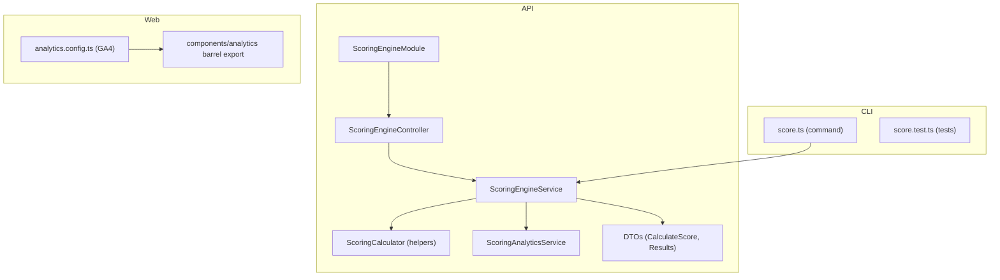
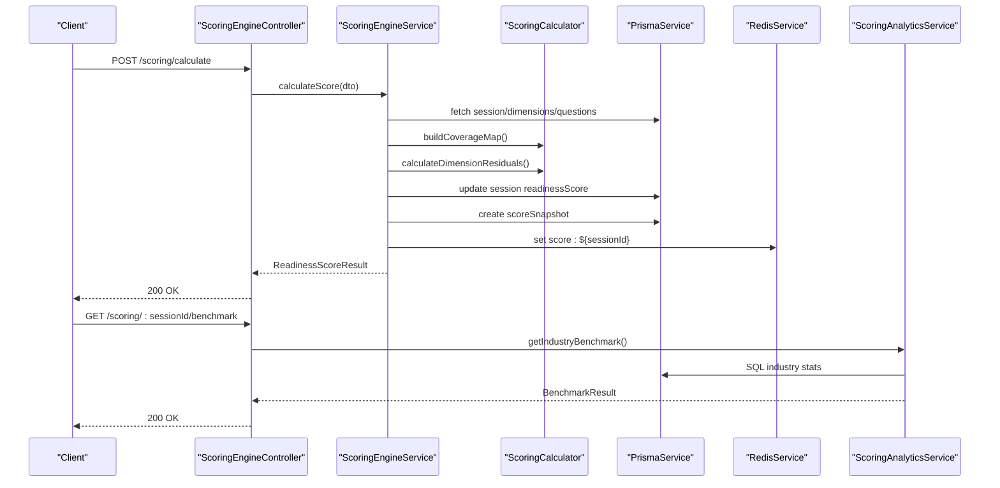
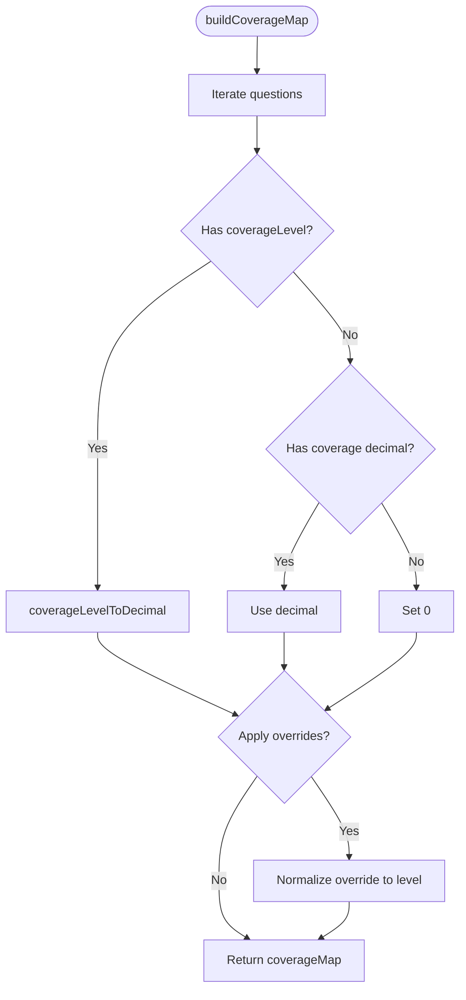
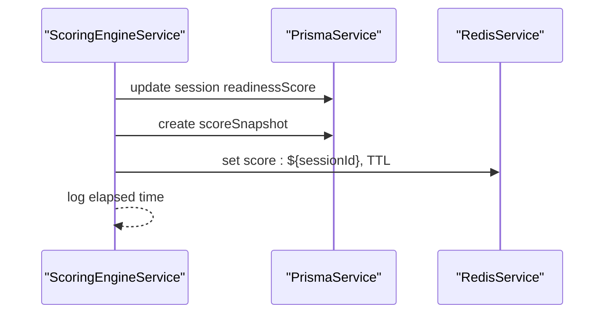
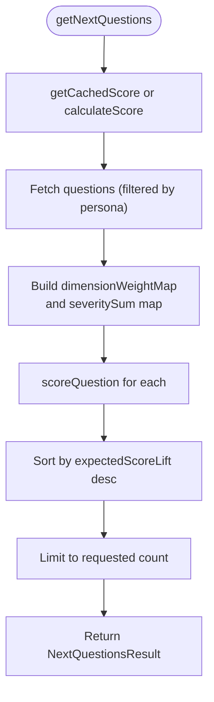
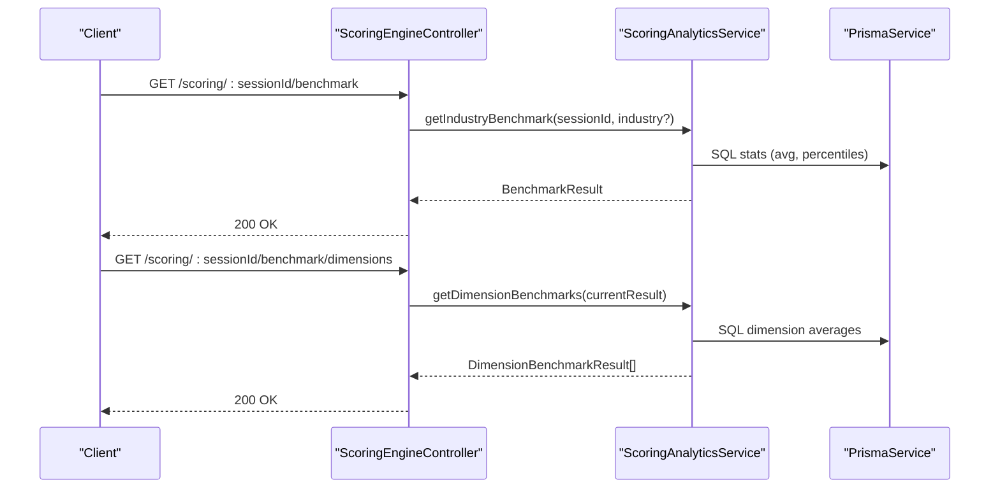
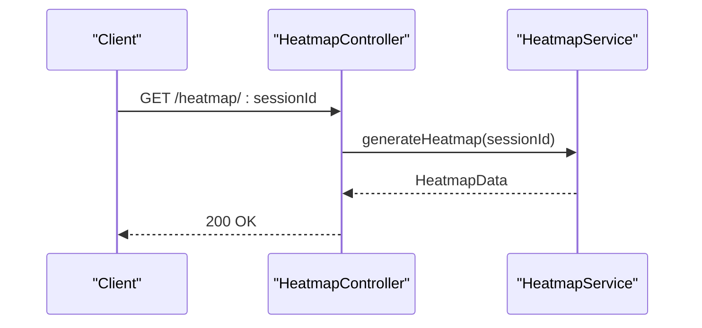
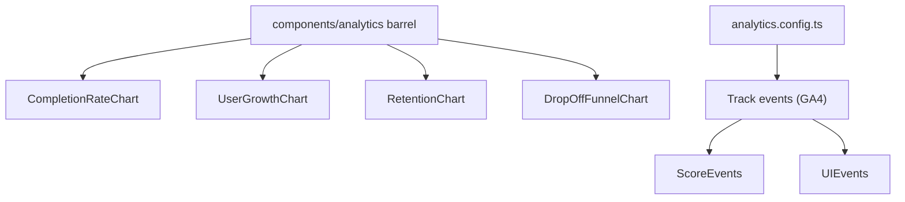
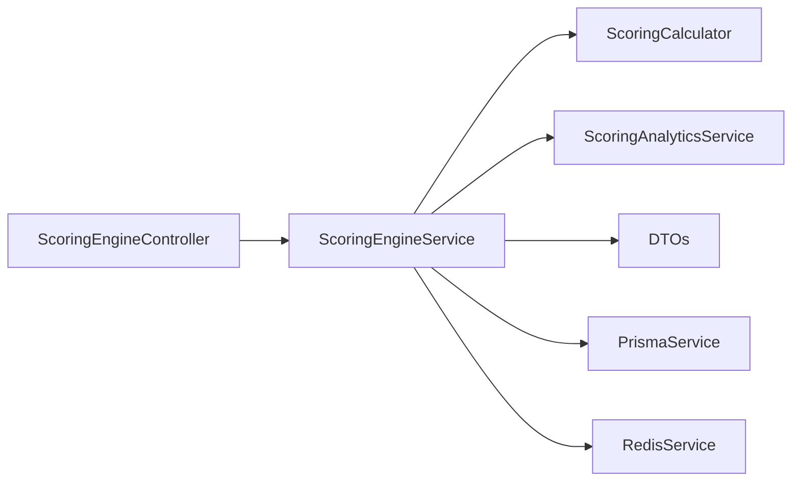

# Scoring and Analytics

<cite>
**Referenced Files in This Document**
- [scoring-engine.module.ts](file://apps/api/src/modules/scoring-engine/scoring-engine.module.ts)
- [scoring-engine.controller.ts](file://apps/api/src/modules/scoring-engine/scoring-engine.controller.ts)
- [scoring-engine.service.ts](file://apps/api/src/modules/scoring-engine/scoring-engine.service.ts)
- [scoring-calculator.ts](file://apps/api/src/modules/scoring-engine/scoring-calculator.ts)
- [calculate-score.dto.ts](file://apps/api/src/modules/scoring-engine/dto/calculate-score.dto.ts)
- [scoring-analytics.ts](file://apps/api/src/modules/scoring-engine/strategies/scoring-analytics.ts)
- [analytics.config.ts](file://apps/web/src/config/analytics.config.ts)
- [index.ts (web analytics barrel)](file://apps/web/src/components/analytics/index.ts)
- [heatmap.controller.ts](file://apps/api/src/modules/heatmap/heatmap.controller.ts)
- [heatmap.service.ts](file://apps/api/src/modules/heatmap/heatmap.service.ts)
- [index.ts (CLI score command)](file://apps/cli/src/commands/score.ts)
- [score.test.ts (CLI score test)](file://apps/cli/src/__tests__/score.test.ts)
- [scoring-engine.service.spec.ts](file://apps/api/src/modules/scoring-engine/scoring-engine.service.spec.ts)
</cite>

## Table of Contents
1. [Introduction](#introduction)
2. [Project Structure](#project-structure)
3. [Core Components](#core-components)
4. [Architecture Overview](#architecture-overview)
5. [Detailed Component Analysis](#detailed-component-analysis)
6. [Dependency Analysis](#dependency-analysis)
7. [Performance Considerations](#performance-considerations)
8. [Troubleshooting Guide](#troubleshooting-guide)
9. [Conclusion](#conclusion)
10. [Appendices](#appendices)

## Introduction
This document describes the scoring engine and analytics system powering readiness scoring across seven dimensions, coverage calculations, residual risk assessment, and portfolio analysis. It explains the scoring calculator implementation, weight distribution, normalization algorithms, and the analytics pipeline including benchmark comparisons, trend analysis, and real-time updates. It also covers frontend visualization integration, performance optimization strategies, and reporting capabilities.

## Project Structure
The scoring and analytics system spans the API server (NestJS), CLI, and Web client:
- API: Scoring engine module with controller, service, DTOs, calculator helpers, and analytics strategies
- CLI: Command-line scoring and heatmap utilities
- Web: Analytics configuration and chart components

**Diagram sources**
- [scoring-engine.module.ts:1-23](file://apps/api/src/modules/scoring-engine/scoring-engine.module.ts#L1-L23)
- [scoring-engine.controller.ts:42-268](file://apps/api/src/modules/scoring-engine/scoring-engine.controller.ts#L42-L268)
- [scoring-engine.service.ts:54-387](file://apps/api/src/modules/scoring-engine/scoring-engine.service.ts#L54-L387)
- [scoring-calculator.ts:1-208](file://apps/api/src/modules/scoring-engine/scoring-calculator.ts#L1-L208)
- [scoring-analytics.ts:17-268](file://apps/api/src/modules/scoring-engine/strategies/scoring-analytics.ts#L17-L268)
- [calculate-score.dto.ts:1-298](file://apps/api/src/modules/scoring-engine/dto/calculate-score.dto.ts#L1-L298)
- [index.ts (CLI score command):1-100](file://apps/cli/src/commands/score.ts#L1-L100)
- [score.test.ts (CLI score test):1-100](file://apps/cli/src/__tests__/score.test.ts#L1-L100)
- [analytics.config.ts:1-567](file://apps/web/src/config/analytics.config.ts#L1-L567)
- [index.ts (web analytics barrel):1-10](file://apps/web/src/components/analytics/index.ts#L1-L10)

**Section sources**
- [scoring-engine.module.ts:1-23](file://apps/api/src/modules/scoring-engine/scoring-engine.module.ts#L1-L23)
- [scoring-engine.controller.ts:42-268](file://apps/api/src/modules/scoring-engine/scoring-engine.controller.ts#L42-L268)
- [scoring-engine.service.ts:54-387](file://apps/api/src/modules/scoring-engine/scoring-engine.service.ts#L54-L387)
- [scoring-calculator.ts:1-208](file://apps/api/src/modules/scoring-engine/scoring-calculator.ts#L1-L208)
- [scoring-analytics.ts:17-268](file://apps/api/src/modules/scoring-engine/strategies/scoring-analytics.ts#L17-L268)
- [calculate-score.dto.ts:1-298](file://apps/api/src/modules/scoring-engine/dto/calculate-score.dto.ts#L1-L298)
- [index.ts (CLI score command):1-100](file://apps/cli/src/commands/score.ts#L1-L100)
- [score.test.ts (CLI score test):1-100](file://apps/cli/src/__tests__/score.test.ts#L1-L100)
- [analytics.config.ts:1-567](file://apps/web/src/config/analytics.config.ts#L1-L567)
- [index.ts (web analytics barrel):1-10](file://apps/web/src/components/analytics/index.ts#L1-L10)

## Core Components
- Scoring Engine Module: Declares dependencies on database and Redis, exposes the scoring service.
- Scoring Engine Controller: Public API endpoints for calculating scores, retrieving next priority questions, cache invalidation, score history, and benchmarks.
- Scoring Engine Service: Orchestrates data fetching, computes readiness score, manages cache and persistence, and delegates analytics.
- Scoring Calculator: Pure calculation helpers for coverage mapping, dimension residual computation, trend analysis, and recommendations.
- DTOs: Strongly typed request/response contracts for scoring, next questions, and analytics results.
- Scoring Analytics Service: Benchmarks, dimension comparisons, and trend analytics backed by SQL queries.
- Web Analytics Config: GA4 integration for page views, events, conversions, and user properties.
- CLI Score Command: Batch scoring and simulation utilities.

**Section sources**
- [scoring-engine.module.ts:1-23](file://apps/api/src/modules/scoring-engine/scoring-engine.module.ts#L1-L23)
- [scoring-engine.controller.ts:42-268](file://apps/api/src/modules/scoring-engine/scoring-engine.controller.ts#L42-L268)
- [scoring-engine.service.ts:54-387](file://apps/api/src/modules/scoring-engine/scoring-engine.service.ts#L54-L387)
- [scoring-calculator.ts:1-208](file://apps/api/src/modules/scoring-engine/scoring-calculator.ts#L1-L208)
- [calculate-score.dto.ts:1-298](file://apps/api/src/modules/scoring-engine/dto/calculate-score.dto.ts#L1-L298)
- [scoring-analytics.ts:17-268](file://apps/api/src/modules/scoring-engine/strategies/scoring-analytics.ts#L17-L268)
- [analytics.config.ts:1-567](file://apps/web/src/config/analytics.config.ts#L1-L567)
- [index.ts (CLI score command):1-100](file://apps/cli/src/commands/score.ts#L1-L100)

## Architecture Overview
The system follows a layered architecture:
- Presentation: NestJS controller exposes REST endpoints
- Application: Service orchestrates data retrieval, computation, caching, persistence, and analytics
- Domain: Pure calculation helpers encapsulate formulas
- Persistence: Prisma ORM for PostgreSQL, Redis for caching
- Analytics: SQL-backed benchmarks and trend computations

**Diagram sources**
- [scoring-engine.controller.ts:55-231](file://apps/api/src/modules/scoring-engine/scoring-engine.controller.ts#L55-L231)
- [scoring-engine.service.ts:70-164](file://apps/api/src/modules/scoring-engine/scoring-engine.service.ts#L70-L164)
- [scoring-calculator.ts:24-130](file://apps/api/src/modules/scoring-engine/scoring-calculator.ts#L24-L130)
- [scoring-analytics.ts:73-165](file://apps/api/src/modules/scoring-engine/strategies/scoring-analytics.ts#L73-L165)

## Detailed Component Analysis

### Mathematical Formulas and Normalization
- Coverage normalization: Discrete coverage levels map to decimals; continuous coverage values are normalized to the nearest discrete level.
- Dimension residual risk: R_d = Σ(S_i × (1 - C_i)) / (Σ S_i + ε)
- Portfolio residual risk: R = Σ(W_d × R_d)
- Readiness score: Score = 100 × (1 - R)
- Next Questions Score (NQS) lift: ΔScore_i = 100 × W_d(i) × S_i × (1 - C_i) / (Σ S_j + ε)

These formulas are implemented in the DTOs and calculator helpers, with epsilon regularization to avoid division by zero.

**Section sources**
- [scoring-engine.module.ts:10-15](file://apps/api/src/modules/scoring-engine/scoring-engine.module.ts#L10-L15)
- [calculate-score.dto.ts:19-55](file://apps/api/src/modules/scoring-engine/dto/calculate-score.dto.ts#L19-L55)
- [calculate-score.dto.ts:118-204](file://apps/api/src/modules/scoring-engine/dto/calculate-score.dto.ts#L118-L204)
- [calculate-score.dto.ts:207-298](file://apps/api/src/modules/scoring-engine/dto/calculate-score.dto.ts#L207-L298)
- [scoring-calculator.ts:67-130](file://apps/api/src/modules/scoring-engine/scoring-calculator.ts#L67-L130)
- [scoring-calculator.ts:24-61](file://apps/api/src/modules/scoring-engine/scoring-calculator.ts#L24-L61)

### Scoring Calculator Implementation
Key responsibilities:
- Build coverage map from responses, preferring discrete coverage levels and applying overrides
- Compute dimension residuals and weighted contributions
- Generate rationale for prioritization
- Trend analysis from score history
- Dimension improvement recommendations

**Diagram sources**
- [scoring-calculator.ts:24-61](file://apps/api/src/modules/scoring-engine/scoring-calculator.ts#L24-L61)
- [calculate-score.dto.ts:39-55](file://apps/api/src/modules/scoring-engine/dto/calculate-score.dto.ts#L39-L55)

**Section sources**
- [scoring-calculator.ts:24-130](file://apps/api/src/modules/scoring-engine/scoring-calculator.ts#L24-L130)
- [calculate-score.dto.ts:19-96](file://apps/api/src/modules/scoring-engine/dto/calculate-score.dto.ts#L19-L96)

### Weight Distribution and Normalization
- Dimensions are fetched with weights and ordered; weights are summed to 1.0 in tests to validate correctness.
- Severity normalization defaults to a constant when missing; coverage normalization ensures 0–1 range.
- Dimension severity sums are precomputed for NQS prioritization.

**Section sources**
- [scoring-engine.service.ts:85-94](file://apps/api/src/modules/scoring-engine/scoring-engine.service.ts#L85-L94)
- [scoring-engine.service.ts:276-288](file://apps/api/src/modules/scoring-engine/scoring-engine.service.ts#L276-L288)
- [scoring-engine.service.spec.ts:324-328](file://apps/api/src/modules/scoring-engine/scoring-engine.service.spec.ts#L324-L328)

### Real-Time Scoring Updates and Caching
- On score calculation, the service persists a snapshot, updates the session score, caches the result in Redis with TTL, and logs performance.
- Cache invalidation endpoint removes cached results.
- Batch calculation supports controlled concurrency.

**Diagram sources**
- [scoring-engine.service.ts:135-156](file://apps/api/src/modules/scoring-engine/scoring-engine.service.ts#L135-L156)
- [scoring-engine.service.ts:290-298](file://apps/api/src/modules/scoring-engine/scoring-engine.service.ts#L290-L298)
- [scoring-engine.service.ts:300-324](file://apps/api/src/modules/scoring-engine/scoring-engine.service.ts#L300-L324)

**Section sources**
- [scoring-engine.service.ts:135-156](file://apps/api/src/modules/scoring-engine/scoring-engine.service.ts#L135-L156)
- [scoring-engine.service.ts:290-298](file://apps/api/src/modules/scoring-engine/scoring-engine.service.ts#L290-L298)
- [scoring-engine.service.ts:300-324](file://apps/api/src/modules/scoring-engine/scoring-engine.service.ts#L300-L324)

### Next Priority Questions (NQS) Algorithm
- Filters unanswered or partially covered questions
- Computes expected score lift per question using dimension weight, severity, and current coverage
- Ranks by lift and returns rationale and max potential score

**Diagram sources**
- [scoring-engine.service.ts:170-227](file://apps/api/src/modules/scoring-engine/scoring-engine.service.ts#L170-L227)
- [scoring-engine.service.ts:229-274](file://apps/api/src/modules/scoring-engine/scoring-engine.service.ts#L229-L274)
- [scoring-calculator.ts:132-147](file://apps/api/src/modules/scoring-engine/scoring-calculator.ts#L132-L147)

**Section sources**
- [scoring-engine.controller.ts:84-110](file://apps/api/src/modules/scoring-engine/scoring-engine.controller.ts#L84-L110)
- [scoring-engine.service.ts:170-227](file://apps/api/src/modules/scoring-engine/scoring-engine.service.ts#L170-L227)
- [scoring-engine.service.ts:229-274](file://apps/api/src/modules/scoring-engine/scoring-engine.service.ts#L229-L274)

### Benchmark Comparisons and Dimension-Level Analytics
- Industry benchmark: Computes average, median, min, max, percentiles, and percentile rank; categorizes performance; calculates gaps to median and leading.
- Dimension benchmarks: Aggregates residual risks across sessions to compute industry averages and gap analysis with recommendations.

**Diagram sources**
- [scoring-engine.controller.ts:192-266](file://apps/api/src/modules/scoring-engine/scoring-engine.controller.ts#L192-L266)
- [scoring-analytics.ts:73-165](file://apps/api/src/modules/scoring-engine/strategies/scoring-analytics.ts#L73-L165)
- [scoring-analytics.ts:171-240](file://apps/api/src/modules/scoring-engine/strategies/scoring-analytics.ts#L171-L240)

**Section sources**
- [scoring-engine.controller.ts:192-266](file://apps/api/src/modules/scoring-engine/scoring-engine.controller.ts#L192-L266)
- [scoring-analytics.ts:73-165](file://apps/api/src/modules/scoring-engine/strategies/scoring-analytics.ts#L73-L165)
- [scoring-analytics.ts:171-240](file://apps/api/src/modules/scoring-engine/strategies/scoring-analytics.ts#L171-L240)

### Heatmap Generation System
The heatmap module provides endpoints and services to generate and manage heatmaps for readiness dimensions. The controller and service expose functionality for heatmap creation and retrieval, while the CLI offers a command-line interface for heatmap operations.

**Diagram sources**
- [heatmap.controller.ts:1-200](file://apps/api/src/modules/heatmap/heatmap.controller.ts#L1-L200)
- [heatmap.service.ts:1-200](file://apps/api/src/modules/heatmap/heatmap.service.ts#L1-L200)

**Section sources**
- [heatmap.controller.ts:1-200](file://apps/api/src/modules/heatmap/heatmap.controller.ts#L1-L200)
- [heatmap.service.ts:1-200](file://apps/api/src/modules/heatmap/heatmap.service.ts#L1-L200)

### Frontend Visualization and User Feedback
- Web analytics configuration integrates GA4 for page views, custom events, user properties, and conversion goals.
- Analytics components include charts for completion rate, user growth, retention, and drop-off funnels.
- Scoring events (viewed, heatmap viewed, dimension drilldown) are tracked to measure engagement.

**Diagram sources**
- [analytics.config.ts:1-567](file://apps/web/src/config/analytics.config.ts#L1-L567)
- [index.ts (web analytics barrel):1-10](file://apps/web/src/components/analytics/index.ts#L1-L10)

**Section sources**
- [analytics.config.ts:195-278](file://apps/web/src/config/analytics.config.ts#L195-L278)
- [index.ts (web analytics barrel):1-10](file://apps/web/src/components/analytics/index.ts#L1-L10)

### Examples and Strategies
- Fully covered dimension yields zero residual risk.
- Zero coverage yields higher residual risk proportional to dimension weight.
- Weighted dimension strategy: increase weight for high-risk areas to maximize score improvements.
- Simulation: coverage overrides enable scenario analysis for “what-if” planning.

**Section sources**
- [scoring-engine.service.spec.ts:231-251](file://apps/api/src/modules/scoring-engine/scoring-engine.service.spec.ts#L231-L251)
- [scoring-engine.service.spec.ts:503-520](file://apps/api/src/modules/scoring-engine/scoring-engine.service.spec.ts#L503-L520)
- [scoring-engine.service.spec.ts:522-549](file://apps/api/src/modules/scoring-engine/scoring-engine.service.spec.ts#L522-L549)

## Dependency Analysis
- Coupling: Service depends on calculator helpers and analytics service; controller depends on service; DTOs decouple request/response contracts.
- Cohesion: Calculation logic is centralized in calculator helpers; analytics logic is encapsulated in analytics service.
- External dependencies: Prisma for ORM, Redis for caching, react-ga4 for analytics.

**Diagram sources**
- [scoring-engine.controller.ts:25-32](file://apps/api/src/modules/scoring-engine/scoring-engine.controller.ts#L25-L32)
- [scoring-engine.service.ts:59-64](file://apps/api/src/modules/scoring-engine/scoring-engine.service.ts#L59-L64)
- [scoring-calculator.ts:1-15](file://apps/api/src/modules/scoring-engine/scoring-calculator.ts#L1-L15)
- [scoring-analytics.ts:17-18](file://apps/api/src/modules/scoring-engine/strategies/scoring-analytics.ts#L17-L18)

**Section sources**
- [scoring-engine.controller.ts:25-32](file://apps/api/src/modules/scoring-engine/scoring-engine.controller.ts#L25-L32)
- [scoring-engine.service.ts:59-64](file://apps/api/src/modules/scoring-engine/scoring-engine.service.ts#L59-L64)
- [scoring-calculator.ts:1-15](file://apps/api/src/modules/scoring-engine/scoring-calculator.ts#L1-L15)
- [scoring-analytics.ts:17-18](file://apps/api/src/modules/scoring-engine/strategies/scoring-analytics.ts#L17-L18)

## Performance Considerations
- Caching: Redis cache with TTL reduces repeated calculations; cache invalidation endpoint supports deterministic recalculation.
- Persistence: Snapshot persistence enables trend analysis and reduces runtime computation.
- Concurrency: Batch calculation uses controlled concurrency to prevent overload.
- Epsilon regularization prevents numerical instability in residual calculations.
- Indexing: Ensure database indices on frequently queried fields (session, questionnaire, dimension keys) for optimal query performance.

**Section sources**
- [scoring-engine.service.ts:343-350](file://apps/api/src/modules/scoring-engine/scoring-engine.service.ts#L343-L350)
- [scoring-engine.service.ts:290-298](file://apps/api/src/modules/scoring-engine/scoring-engine.service.ts#L290-L298)
- [scoring-engine.service.ts:300-324](file://apps/api/src/modules/scoring-engine/scoring-engine.service.ts#L300-L324)
- [scoring-calculator.ts:115](file://apps/api/src/modules/scoring-engine/scoring-calculator.ts#L115)

## Troubleshooting Guide
- Session not found: Throws NotFoundException; verify session UUID and questionnaire linkage.
- Cache errors: Cache operations are wrapped with try/catch and logged; check Redis connectivity.
- Empty questionnaire: Returns zeros for totals and completion percentage; ensure questions are linked to the session’s questionnaire.
- Benchmark queries: Industry statistics rely on completed sessions with readiness scores; confirm data population.

**Section sources**
- [scoring-engine.service.ts:79-81](file://apps/api/src/modules/scoring-engine/scoring-engine.service.ts#L79-L81)
- [scoring-engine.service.ts:292-298](file://apps/api/src/modules/scoring-engine/scoring-engine.service.ts#L292-L298)
- [scoring-engine.service.ts:314-322](file://apps/api/src/modules/scoring-engine/scoring-engine.service.ts#L314-L322)
- [scoring-analytics.ts:74-81](file://apps/api/src/modules/scoring-engine/strategies/scoring-analytics.ts#L74-L81)

## Conclusion
The scoring engine implements a robust, mathematically sound framework for readiness scoring across seven dimensions, with strong normalization, caching, and analytics capabilities. The system supports real-time updates, benchmark comparisons, and NQS-driven prioritization, while the frontend integrates GA4 for insights and engagement tracking.

## Appendices

### API Endpoints Summary
- POST /scoring/calculate: Calculate readiness score
- POST /scoring/next-questions: Get next priority questions
- GET /scoring/{sessionId}: Get session score
- POST /scoring/{sessionId}/invalidate: Invalidate score cache
- GET /scoring/{sessionId}/history: Get score history
- GET /scoring/{sessionId}/benchmark: Industry benchmark
- GET /scoring/{sessionId}/benchmark/dimensions: Dimension benchmarks

**Section sources**
- [scoring-engine.controller.ts:55-231](file://apps/api/src/modules/scoring-engine/scoring-engine.controller.ts#L55-L231)

### CLI Utilities
- Score command: Enables batch scoring and simulation via coverage overrides
- Tests: Validate CLI behavior and scoring outcomes

**Section sources**
- [index.ts (CLI score command):1-100](file://apps/cli/src/commands/score.ts#L1-L100)
- [score.test.ts (CLI score test):1-100](file://apps/cli/src/__tests__/score.test.ts#L1-L100)