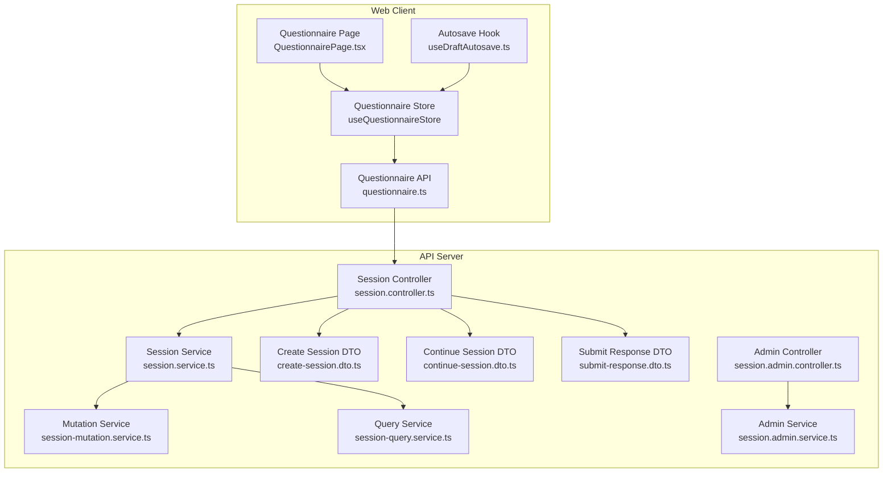
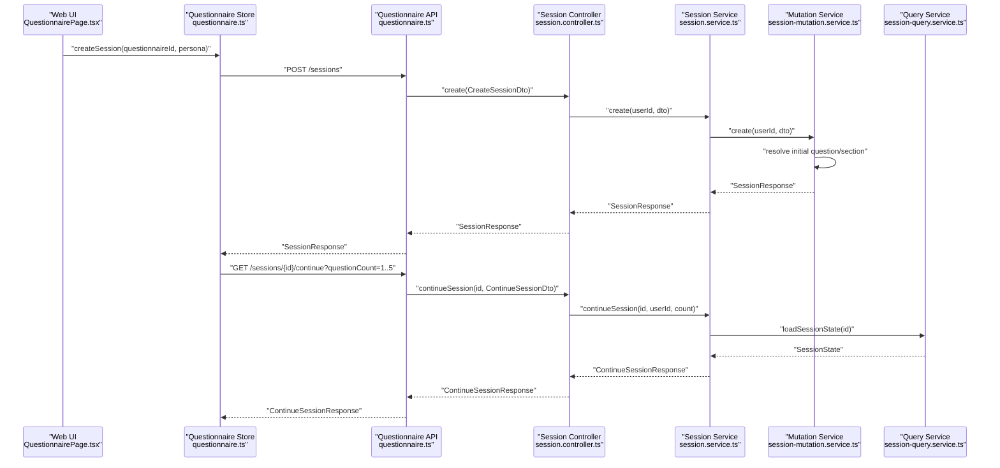
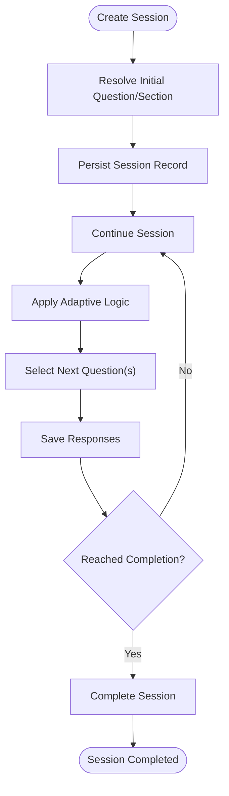
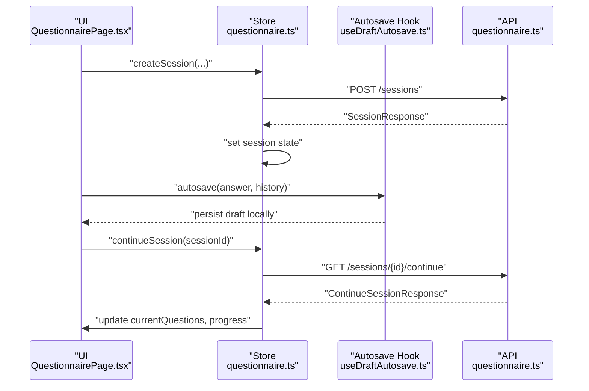
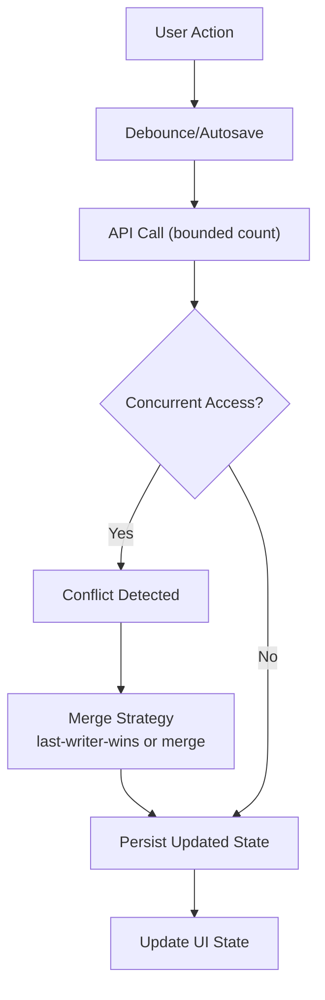
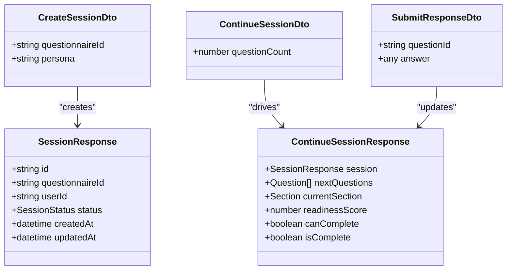
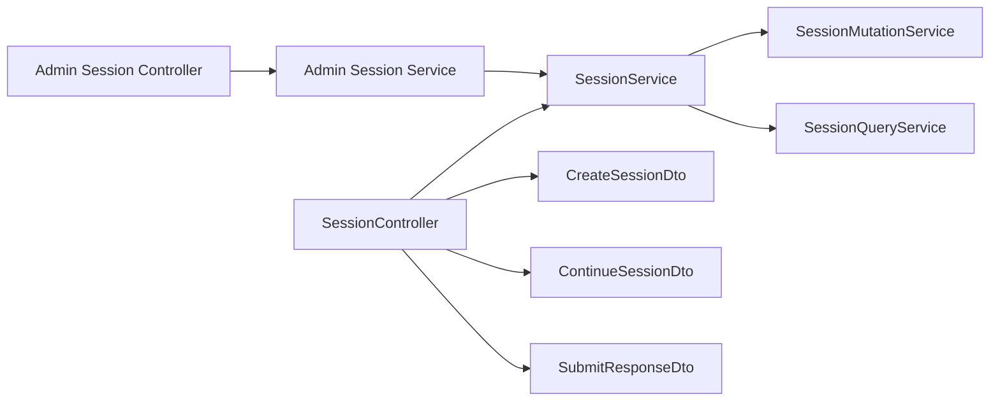

# Session Management

<cite>
**Referenced Files in This Document**
- [session.controller.ts](file://apps/api/src/modules/session/session.controller.ts)
- [questionnaire.ts](file://apps/web/src/stores/questionnaire.ts)
- [QuestionnairePage.tsx](file://apps/web/src/pages/questionnaire/QuestionnairePage.tsx)
- [useDraftAutosave.ts](file://apps/web/src/hooks/useDraftAutosave.ts)
- [session-reminder.job.ts](file://apps/api/src/modules/notifications/jobs/session-reminder.job.ts)
- [session-reminder.job.spec.ts](file://apps/api/src/modules/notifications/jobs/session-reminder.job.spec.ts)
- [session.service.ts](file://apps/api/src/modules/session/services/session.service.ts)
- [session-mutation.service.ts](file://apps/api/src/modules/session/services/session-mutation.service.ts)
- [session-query.service.ts](file://apps/api/src/modules/session/services/session-query.service.ts)
- [create-session.dto.ts](file://apps/api/src/modules/session/dto/create-session.dto.ts)
- [continue-session.dto.ts](file://apps/api/src/modules/session/dto/continue-session.dto.ts)
- [submit-response.dto.ts](file://apps/api/src/modules/session/dto/submit-response.dto.ts)
- [session.module.ts](file://apps/api/src/modules/session/session.module.ts)
- [session.admin.controller.ts](file://apps/api/src/modules/admin/controllers/session.admin.controller.ts)
- [session.admin.service.ts](file://apps/api/src/modules/admin/services/session.admin.service.ts)
- [session.admin.module.ts](file://apps/api/src/modules/admin/session.admin.module.ts)
- [session.admin.dto.ts](file://apps/api/src/modules/admin/dto/session.admin.dto.ts)
- [questionnaire.api.ts](file://apps/web/src/api/questionnaire.ts)
- [questionnaire.api.client.ts](file://apps/web/src/api/client.ts)
- [enums.ts](file://apps/web/src/types/enums.ts)
- [session-flow.e2e.test.ts](file://e2e/questionnaire/session-flow.e2e.test.ts)
- [adaptive.e2e.test.ts](file://e2e/questionnaire/adaptive.e2e.test.ts)
- [transaction-concurrency.test.ts](file://apps/api/test/integration/transaction-concurrency.test.ts)
</cite>

## Table of Contents
1. [Introduction](#introduction)
2. [Project Structure](#project-structure)
3. [Core Components](#core-components)
4. [Architecture Overview](#architecture-overview)
5. [Detailed Component Analysis](#detailed-component-analysis)
6. [Dependency Analysis](#dependency-analysis)
7. [Performance Considerations](#performance-considerations)
8. [Troubleshooting Guide](#troubleshooting-guide)
9. [Security and Audit](#security-and-audit)
10. [Admin Interfaces](#admin-interfaces)
11. [Conclusion](#conclusion)

## Introduction
This document describes the assessment session management system, covering lifecycle management (creation, continuation, completion), auto-save and draft persistence, resume with progress tracking, real-time collaboration and concurrency handling, conflict resolution, DTOs and validation, persistence strategies, frontend state management and offline capabilities, workflows and error recovery, performance optimization for large assessments, security and audit requirements, and admin monitoring interfaces.

## Project Structure
The session management spans the API server and the web client:
- API: NestJS controllers and services under the session module, with supporting DTOs and admin interfaces.
- Web: React stores and pages coordinating session creation, continuation, and UI state; autosave hooks for draft persistence.

**Diagram sources**
- [session.controller.ts:32-166](file://apps/api/src/modules/session/session.controller.ts#L32-L166)
- [session.service.ts](file://apps/api/src/modules/session/services/session.service.ts)
- [session-mutation.service.ts:31-59](file://apps/api/src/modules/session/services/session-mutation.service.ts#L31-L59)
- [session-query.service.ts](file://apps/api/src/modules/session/services/session-query.service.ts)
- [create-session.dto.ts](file://apps/api/src/modules/session/dto/create-session.dto.ts)
- [continue-session.dto.ts](file://apps/api/src/modules/session/dto/continue-session.dto.ts)
- [submit-response.dto.ts](file://apps/api/src/modules/session/dto/submit-response.dto.ts)
- [questionnaire.ts:94-169](file://apps/web/src/stores/questionnaire.ts#L94-L169)
- [QuestionnairePage.tsx:138-156](file://apps/web/src/pages/questionnaire/QuestionnairePage.tsx#L138-L156)
- [useDraftAutosave.ts](file://apps/web/src/hooks/useDraftAutosave.ts)
- [questionnaire.api.ts](file://apps/web/src/api/questionnaire.ts)

**Section sources**
- [session.controller.ts:32-166](file://apps/api/src/modules/session/session.controller.ts#L32-L166)
- [questionnaire.ts:94-169](file://apps/web/src/stores/questionnaire.ts#L94-L169)

## Core Components
- Session Controller: Exposes endpoints for creating, listing, retrieving, continuing, getting next questions, submitting/updating responses, and completing sessions. It enforces JWT authentication and validates parameters.
- Session Services: Orchestrate business logic across mutation and query services for creating sessions, applying adaptive logic, scoring, and returning continuation results.
- DTOs: Strongly typed request/response contracts for create, continue, and submit operations.
- Web Store: Manages session state, loading/error states, and coordinates with the API to create/list/load/continue sessions.
- Autosave Hook: Provides draft persistence and offline-friendly state updates.
- Admin Interfaces: Controllers and services for administrators to monitor and manage sessions.

**Section sources**
- [session.controller.ts:39-164](file://apps/api/src/modules/session/session.controller.ts#L39-L164)
- [session.service.ts](file://apps/api/src/modules/session/services/session.service.ts)
- [session-mutation.service.ts:46-120](file://apps/api/src/modules/session/services/session-mutation.service.ts#L46-L120)
- [session-query.service.ts](file://apps/api/src/modules/session/services/session-query.service.ts)
- [create-session.dto.ts](file://apps/api/src/modules/session/dto/create-session.dto.ts)
- [continue-session.dto.ts](file://apps/api/src/modules/session/dto/continue-session.dto.ts)
- [submit-response.dto.ts](file://apps/api/src/modules/session/dto/submit-response.dto.ts)
- [questionnaire.ts:94-169](file://apps/web/src/stores/questionnaire.ts#L94-L169)
- [useDraftAutosave.ts](file://apps/web/src/hooks/useDraftAutosave.ts)

## Architecture Overview
The system follows a layered architecture:
- Presentation Layer (Web): Pages and stores coordinate user actions and maintain UI state.
- Application Layer (API): Controllers expose REST endpoints; services encapsulate domain logic.
- Domain Services: Adaptive logic, scoring engine, and questionnaire services integrate with session operations.
- Persistence: Prisma-backed repositories accessed via services.
- Notifications: Background job for session reminders.

**Diagram sources**
- [QuestionnairePage.tsx:138-156](file://apps/web/src/pages/questionnaire/QuestionnairePage.tsx#L138-L156)
- [questionnaire.ts:94-169](file://apps/web/src/stores/questionnaire.ts#L94-L169)
- [questionnaire.api.ts](file://apps/web/src/api/questionnaire.ts)
- [session.controller.ts:39-113](file://apps/api/src/modules/session/session.controller.ts#L39-L113)
- [session.service.ts](file://apps/api/src/modules/session/services/session.service.ts)
- [session-mutation.service.ts:46-120](file://apps/api/src/modules/session/services/session-mutation.service.ts#L46-L120)
- [session-query.service.ts](file://apps/api/src/modules/session/services/session-query.service.ts)

## Detailed Component Analysis

### Session Lifecycle Management
- Creation: The controller’s create endpoint delegates to the service, which uses the mutation service to resolve initial state (persona-specific or default), compute totals, and persist the session.
- Continuation: The continue endpoint accepts a questionCount bounded between 1 and 5, loads the session state, applies adaptive logic, and returns next questions and progress.
- Completion: The complete endpoint marks the session as finished via the service.

**Diagram sources**
- [session.controller.ts:39-113](file://apps/api/src/modules/session/session.controller.ts#L39-L113)
- [session-mutation.service.ts:46-120](file://apps/api/src/modules/session/services/session-mutation.service.ts#L46-L120)
- [session.service.ts](file://apps/api/src/modules/session/services/session.service.ts)

**Section sources**
- [session.controller.ts:39-164](file://apps/api/src/modules/session/session.controller.ts#L39-L164)
- [session-mutation.service.ts:46-120](file://apps/api/src/modules/session/services/session-mutation.service.ts#L46-L120)
- [session.service.ts](file://apps/api/src/modules/session/services/session.service.ts)

### Auto-Save, Draft Persistence, and Resume with Progress Tracking
- Web store methods createSession, loadSession, loadSessions, and continueSession orchestrate lifecycle actions and update UI state.
- The autosave hook provides draft persistence and offline-friendly updates for answers and history.
- The QuestionnairePage handles URL-driven resume via sessionId parameter and resets timers on question change.

**Diagram sources**
- [questionnaire.ts:94-169](file://apps/web/src/stores/questionnaire.ts#L94-L169)
- [QuestionnairePage.tsx:138-156](file://apps/web/src/pages/questionnaire/QuestionnairePage.tsx#L138-L156)
- [useDraftAutosave.ts](file://apps/web/src/hooks/useDraftAutosave.ts)
- [questionnaire.api.ts](file://apps/web/src/api/questionnaire.ts)

**Section sources**
- [questionnaire.ts:94-169](file://apps/web/src/stores/questionnaire.ts#L94-L169)
- [QuestionnairePage.tsx:111-156](file://apps/web/src/pages/questionnaire/QuestionnairePage.tsx#L111-L156)
- [useDraftAutosave.ts](file://apps/web/src/hooks/useDraftAutosave.ts)

### Real-Time Collaboration, Concurrent Sessions, and Conflict Resolution
- Concurrency handling is validated in integration tests for transaction concurrency.
- The continue endpoint bounds questionCount to prevent over-fetching and reduce contention.
- The QuestionnairePage coordinates navigation and state transitions to minimize race conditions during rapid user actions.

**Diagram sources**
- [session.controller.ts:106-131](file://apps/api/src/modules/session/session.controller.ts#L106-L131)
- [transaction-concurrency.test.ts](file://apps/api/test/integration/transaction-concurrency.test.ts)

**Section sources**
- [session.controller.ts:106-131](file://apps/api/src/modules/session/session.controller.ts#L106-L131)
- [QuestionnairePage.tsx:138-156](file://apps/web/src/pages/questionnaire/QuestionnairePage.tsx#L138-L156)
- [transaction-concurrency.test.ts](file://apps/api/test/integration/transaction-concurrency.test.ts)

### Session DTOs, Validation Rules, and Data Persistence
- CreateSessionDto: Validates questionnaireId and optional persona for persona-specific question sets.
- ContinueSessionDto: Validates questionCount with min/max bounds.
- SubmitResponseDto: Validates questionId and response payload for submission/update.
- Persistence: Services delegate to Prisma-backed repositories via mutation and query services.

**Diagram sources**
- [create-session.dto.ts](file://apps/api/src/modules/session/dto/create-session.dto.ts)
- [continue-session.dto.ts](file://apps/api/src/modules/session/dto/continue-session.dto.ts)
- [submit-response.dto.ts](file://apps/api/src/modules/session/dto/submit-response.dto.ts)
- [session.controller.ts:17-23](file://apps/api/src/modules/session/session.controller.ts#L17-L23)

**Section sources**
- [create-session.dto.ts](file://apps/api/src/modules/session/dto/create-session.dto.ts)
- [continue-session.dto.ts](file://apps/api/src/modules/session/dto/continue-session.dto.ts)
- [submit-response.dto.ts](file://apps/api/src/modules/session/dto/submit-response.dto.ts)
- [session.controller.ts:17-23](file://apps/api/src/modules/session/session.controller.ts#L17-L23)

### Frontend State Management, Local Storage, and Offline Capability
- The questionnaire store manages loading, errors, and session state.
- The autosave hook persists drafts locally to enable offline editing and recovery.
- The QuestionnairePage supports URL-driven resume and resets timers per question.

**Section sources**
- [questionnaire.ts:94-169](file://apps/web/src/stores/questionnaire.ts#L94-L169)
- [useDraftAutosave.ts](file://apps/web/src/hooks/useDraftAutosave.ts)
- [QuestionnairePage.tsx:111-156](file://apps/web/src/pages/questionnaire/QuestionnairePage.tsx#L111-L156)

### Examples of Workflows, Error Recovery, and Performance Optimization
- Workflow examples are covered by E2E tests for session flow and adaptive logic.
- Error recovery: The store captures API errors and surfaces user-friendly messages; the continue endpoint returns 404/403 for missing or unauthorized sessions.
- Performance: The continue endpoint caps questionCount; the store debounces autosave; the page resets timers to avoid stale state.

**Section sources**
- [session-flow.e2e.test.ts](file://e2e/questionnaire/session-flow.e2e.test.ts)
- [adaptive.e2e.test.ts](file://e2e/questionnaire/adaptive.e2e.test.ts)
- [session.controller.ts:106-131](file://apps/api/src/modules/session/session.controller.ts#L106-L131)
- [questionnaire.ts:104-114](file://apps/web/src/stores/questionnaire.ts#L104-L114)

## Dependency Analysis
The session module composes several services and DTOs, with the admin module extending monitoring and management capabilities.

**Diagram sources**
- [session.controller.ts:32-166](file://apps/api/src/modules/session/session.controller.ts#L32-L166)
- [session.service.ts](file://apps/api/src/modules/session/services/session.service.ts)
- [session-mutation.service.ts:31-59](file://apps/api/src/modules/session/services/session-mutation.service.ts#L31-L59)
- [session-query.service.ts](file://apps/api/src/modules/session/services/session-query.service.ts)
- [session.admin.controller.ts](file://apps/api/src/modules/admin/controllers/session.admin.controller.ts)
- [session.admin.service.ts](file://apps/api/src/modules/admin/services/session.admin.service.ts)

**Section sources**
- [session.controller.ts:32-166](file://apps/api/src/modules/session/session.controller.ts#L32-L166)
- [session.admin.controller.ts](file://apps/api/src/modules/admin/controllers/session.admin.controller.ts)
- [session.admin.service.ts](file://apps/api/src/modules/admin/services/session.admin.service.ts)

## Performance Considerations
- Bound batch sizes: The continue endpoint limits questionCount to a small range to reduce payload size and processing overhead.
- Debounce autosave: Prevents excessive writes and reduces network usage.
- Progressive loading: Fetch only required questions per request.
- Caching: Consider caching persona-specific question sets and frequently accessed metadata.
- Database indexing: Ensure efficient lookups on questionnaireId, userId, and session status.

[No sources needed since this section provides general guidance]

## Troubleshooting Guide
Common issues and remedies:
- Session not found or access denied: Verify JWT authentication and ownership checks; ensure the session belongs to the authenticated user.
- Too many requests: Reduce questionCount or debounce autosave; implement client-side retry with exponential backoff.
- Stale state after offline edits: Use the autosave hook to persist drafts; upon reconnection, reconcile local changes with server state.
- Concurrency conflicts: The system applies last-writer-wins or merges updates; ensure UI reflects server state after conflicts.

**Section sources**
- [session.controller.ts:106-131](file://apps/api/src/modules/session/session.controller.ts#L106-L131)
- [questionnaire.ts:104-114](file://apps/web/src/stores/questionnaire.ts#L104-L114)
- [useDraftAutosave.ts](file://apps/web/src/hooks/useDraftAutosave.ts)

## Security and Audit
- Authentication: All session endpoints require JWT authentication.
- Authorization: Controllers verify session ownership before operations.
- Audit trail: Track session creation, continuation, response submissions, and completion events for compliance and monitoring.

**Section sources**
- [session.controller.ts:34-36](file://apps/api/src/modules/session/session.controller.ts#L34-L36)
- [session.service.ts](file://apps/api/src/modules/session/services/session.service.ts)

## Admin Interfaces
Administrators can monitor and manage sessions:
- Admin controller and service provide endpoints to view and manage session data.
- DTOs define request/response contracts for admin operations.

**Section sources**
- [session.admin.controller.ts](file://apps/api/src/modules/admin/controllers/session.admin.controller.ts)
- [session.admin.service.ts](file://apps/api/src/modules/admin/services/session.admin.service.ts)
- [session.admin.dto.ts](file://apps/api/src/modules/admin/dto/session.admin.dto.ts)

## Conclusion
The session management system integrates robust lifecycle handling, autosave and draft persistence, concurrency-aware operations, and admin oversight. By bounding request sizes, leveraging autosave, and enforcing authentication and authorization, the system balances performance, reliability, and usability for large-scale assessments.