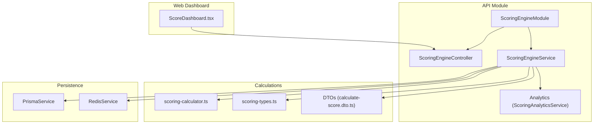
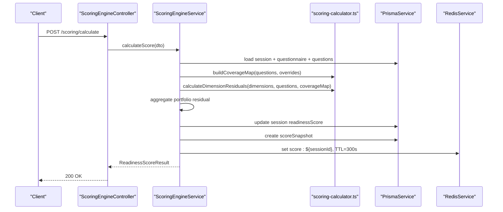
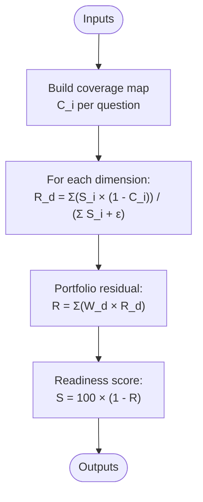
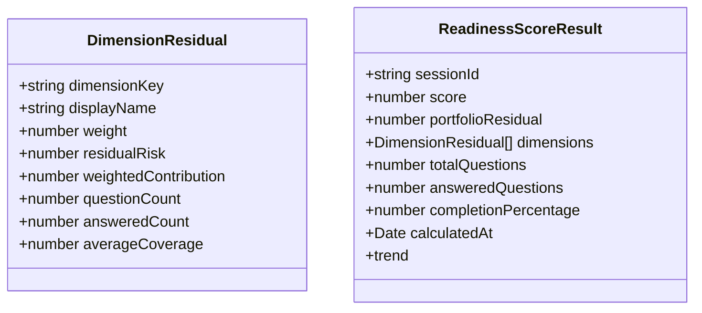
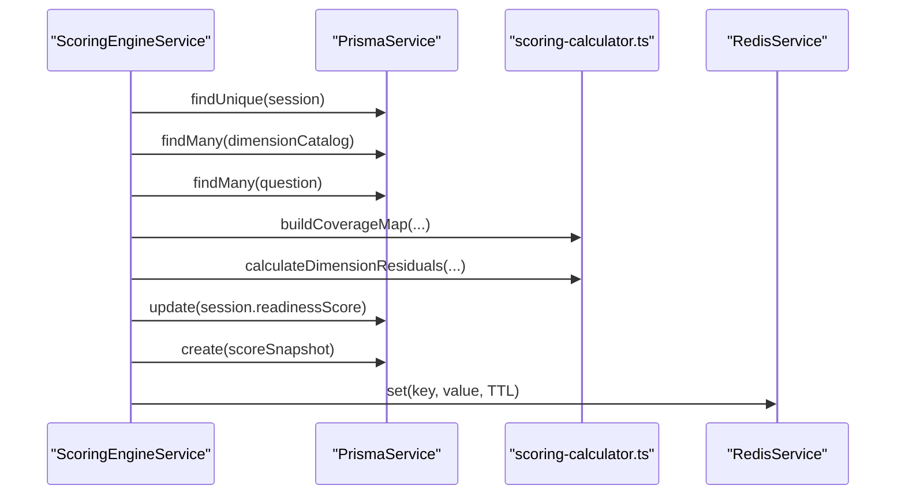
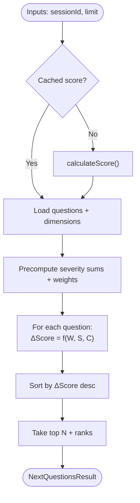
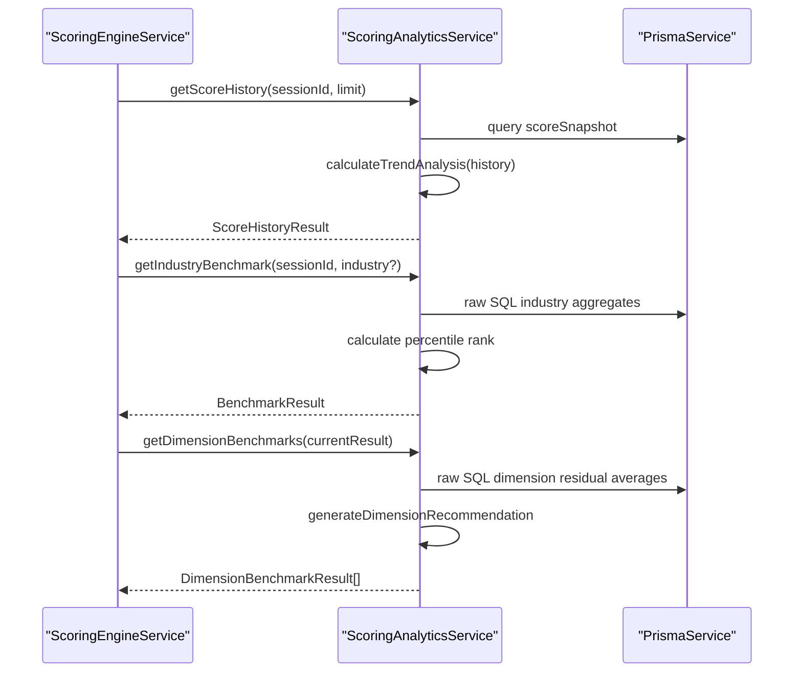
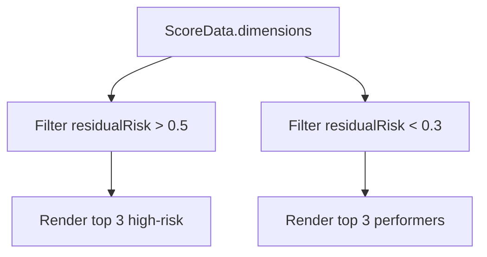
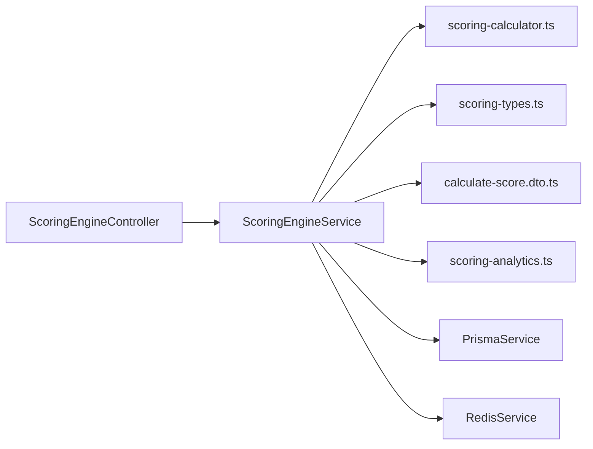

# Scoring Engine

<cite>
**Referenced Files in This Document**
- [scoring-engine.module.ts](file://apps/api/src/modules/scoring-engine/scoring-engine.module.ts)
- [scoring-engine.controller.ts](file://apps/api/src/modules/scoring-engine/scoring-engine.controller.ts)
- [scoring-engine.service.ts](file://apps/api/src/modules/scoring-engine/scoring-engine.service.ts)
- [scoring-calculator.ts](file://apps/api/src/modules/scoring-engine/scoring-calculator.ts)
- [scoring-types.ts](file://apps/api/src/modules/scoring-engine/scoring-types.ts)
- [calculate-score.dto.ts](file://apps/api/src/modules/scoring-engine/dto/calculate-score.dto.ts)
- [scoring-analytics.ts](file://apps/api/src/modules/scoring-engine/strategies/scoring-analytics.ts)
- [ScoreDashboard.tsx](file://apps/web/src/components/questionnaire/ScoreDashboard.tsx)
</cite>

## Table of Contents
1. [Introduction](#introduction)
2. [Project Structure](#project-structure)
3. [Core Components](#core-components)
4. [Architecture Overview](#architecture-overview)
5. [Detailed Component Analysis](#detailed-component-analysis)
6. [Dependency Analysis](#dependency-analysis)
7. [Performance Considerations](#performance-considerations)
8. [Troubleshooting Guide](#troubleshooting-guide)
9. [Conclusion](#conclusion)
10. [Appendices](#appendices)

## Introduction
This document describes the intelligent scoring engine that computes readiness scores across seven technical dimensions using risk-weighted coverage mathematics. It covers the mathematical foundations, real-time calculation algorithms, caching and performance strategies, analytics and benchmarking, and visualization integrations. The engine supports:
- Coverage calculations with a five-level discrete scale
- Dimensional residual risk assessment
- Portfolio-wide residual risk and readiness score computation
- Next Question Selection (NQS) prioritization
- Score history, trend analysis, and industry benchmarking
- Heatmap and dashboard visualizations
- Gap analysis and improvement recommendations

## Project Structure
The scoring engine is implemented as a NestJS module with a controller, service, calculation helpers, analytics strategies, and DTOs. The frontend dashboard consumes the scoring results for visualization.

**Diagram sources**
- [scoring-engine.module.ts:1-23](file://apps/api/src/modules/scoring-engine/scoring-engine.module.ts#L1-L23)
- [scoring-engine.controller.ts:1-268](file://apps/api/src/modules/scoring-engine/scoring-engine.controller.ts#L1-L268)
- [scoring-engine.service.ts:1-387](file://apps/api/src/modules/scoring-engine/scoring-engine.service.ts#L1-L387)
- [scoring-calculator.ts:1-208](file://apps/api/src/modules/scoring-engine/scoring-calculator.ts#L1-L208)
- [scoring-types.ts:1-110](file://apps/api/src/modules/scoring-engine/scoring-types.ts#L1-L110)
- [calculate-score.dto.ts:1-298](file://apps/api/src/modules/scoring-engine/dto/calculate-score.dto.ts#L1-L298)
- [ScoreDashboard.tsx:347-405](file://apps/web/src/components/questionnaire/ScoreDashboard.tsx#L347-L405)

**Section sources**
- [scoring-engine.module.ts:1-23](file://apps/api/src/modules/scoring-engine/scoring-engine.module.ts#L1-L23)
- [scoring-engine.controller.ts:1-268](file://apps/api/src/modules/scoring-engine/scoring-engine.controller.ts#L1-L268)
- [scoring-engine.service.ts:1-387](file://apps/api/src/modules/scoring-engine/scoring-engine.service.ts#L1-L387)
- [scoring-calculator.ts:1-208](file://apps/api/src/modules/scoring-engine/scoring-calculator.ts#L1-L208)
- [scoring-types.ts:1-110](file://apps/api/src/modules/scoring-engine/scoring-types.ts#L1-L110)
- [calculate-score.dto.ts:1-298](file://apps/api/src/modules/scoring-engine/dto/calculate-score.dto.ts#L1-L298)
- [ScoreDashboard.tsx:347-405](file://apps/web/src/components/questionnaire/ScoreDashboard.tsx#L347-L405)

## Core Components
- ScoringEngineModule: Declares dependencies on Prisma and Redis, exposes the service, and registers the controller.
- ScoringEngineController: Exposes REST endpoints for score calculation, next questions, cache invalidation, history, and benchmarks.
- ScoringEngineService: Orchestrates data fetching, coverage mapping, residual risk computation, portfolio aggregation, score rounding, persistence, caching, and analytics delegation.
- scoring-calculator.ts: Pure calculation helpers for coverage mapping, dimension residual risk, trend analysis, and rationale generation.
- scoring-types.ts: Shared constants, coverage level conversions, and analytics result interfaces.
- calculate-score.dto.ts: Request/response DTOs for coverage inputs, dimension residuals, and result envelopes.
- scoring-analytics.ts: Analytics and benchmarking strategies for score history, trend, industry benchmarks, and dimension benchmarks.

**Section sources**
- [scoring-engine.module.ts:1-23](file://apps/api/src/modules/scoring-engine/scoring-engine.module.ts#L1-L23)
- [scoring-engine.controller.ts:1-268](file://apps/api/src/modules/scoring-engine/scoring-engine.controller.ts#L1-L268)
- [scoring-engine.service.ts:1-387](file://apps/api/src/modules/scoring-engine/scoring-engine.service.ts#L1-L387)
- [scoring-calculator.ts:1-208](file://apps/api/src/modules/scoring-engine/scoring-calculator.ts#L1-L208)
- [scoring-types.ts:1-110](file://apps/api/src/modules/scoring-engine/scoring-types.ts#L1-L110)
- [calculate-score.dto.ts:1-298](file://apps/api/src/modules/scoring-engine/dto/calculate-score.dto.ts#L1-L298)
- [scoring-analytics.ts:1-268](file://apps/api/src/modules/scoring-engine/strategies/scoring-analytics.ts#L1-L268)

## Architecture Overview
The scoring engine follows a layered design:
- Presentation: Controller handles HTTP requests and Swagger metadata.
- Orchestration: Service fetches session and questionnaire data, builds coverage maps, computes residuals, aggregates portfolio risk, and persists snapshots.
- Calculation: Stateless helpers compute dimension residuals, trends, and rationales.
- Analytics: Strategies compute benchmarks and dimension comparisons.
- Persistence: Prisma stores sessions, score snapshots, and analytics; Redis caches recent results.

**Diagram sources**
- [scoring-engine.controller.ts:49-82](file://apps/api/src/modules/scoring-engine/scoring-engine.controller.ts#L49-L82)
- [scoring-engine.service.ts:70-164](file://apps/api/src/modules/scoring-engine/scoring-engine.service.ts#L70-L164)
- [scoring-calculator.ts:24-130](file://apps/api/src/modules/scoring-engine/scoring-calculator.ts#L24-L130)

## Detailed Component Analysis

### Mathematical Formulas and Coverage Scale
- Coverage scale: Five-level discrete scale mapped to decimals for evidence assessment.
- Coverage normalization: Preferred coverageLevel over raw coverage; otherwise rounds to nearest level.
- Dimension residual risk: Weighted average of risk exposure per dimension.
- Portfolio residual risk: Weighted sum of dimension residuals.
- Readiness score: S = 100 × (1 − R), capped to [0, 100].

**Diagram sources**
- [scoring-calculator.ts:24-130](file://apps/api/src/modules/scoring-engine/scoring-calculator.ts#L24-L130)
- [scoring-types.ts:8-15](file://apps/api/src/modules/scoring-engine/scoring-types.ts#L8-L15)

**Section sources**
- [scoring-types.ts:18-52](file://apps/api/src/modules/scoring-engine/scoring-types.ts#L18-L52)
- [calculate-score.dto.ts:57-96](file://apps/api/src/modules/scoring-engine/dto/calculate-score.dto.ts#L57-L96)
- [scoring-calculator.ts:24-130](file://apps/api/src/modules/scoring-engine/scoring-calculator.ts#L24-L130)

### Dimensional Scoring System
Seven core dimensions are supported conceptually by the engine’s design:
- Modern Architecture
- AI-Assisted Development
- Coding Standards
- Testing & QA
- Security & DevSecOps
- Workflow & Operations
- Documentation

Each dimension contributes a residual risk R_d computed from severity-weighted uncovered risk. The portfolio residual R aggregates weighted contributions. The final score S = 100 × (1 − R).

**Diagram sources**
- [calculate-score.dto.ts:118-155](file://apps/api/src/modules/scoring-engine/dto/calculate-score.dto.ts#L118-L155)
- [calculate-score.dto.ts:157-204](file://apps/api/src/modules/scoring-engine/dto/calculate-score.dto.ts#L157-L204)

**Section sources**
- [scoring-engine.service.ts:110-116](file://apps/api/src/modules/scoring-engine/scoring-engine.service.ts#L110-L116)
- [scoring-calculator.ts:67-130](file://apps/api/src/modules/scoring-engine/scoring-calculator.ts#L67-L130)

### Real-Time Score Calculation Algorithm
- Fetch session, questionnaire, and questions filtered by persona and project type.
- Build coverage map preferring discrete coverageLevel; apply optional overrides.
- Compute dimension residuals and portfolio residual.
- Round score to two decimals, cap to [0, 100].
- Persist snapshot and update session readiness score.
- Cache result with TTL and log timing.

**Diagram sources**
- [scoring-engine.service.ts:70-164](file://apps/api/src/modules/scoring-engine/scoring-engine.service.ts#L70-L164)
- [scoring-calculator.ts:24-130](file://apps/api/src/modules/scoring-engine/scoring-calculator.ts#L24-L130)

**Section sources**
- [scoring-engine.service.ts:70-164](file://apps/api/src/modules/scoring-engine/scoring-engine.service.ts#L70-L164)

### Next Question Selection (NQS) Algorithm
- If cached score unavailable, calculate fresh score.
- Fetch eligible questions with dimension keys and persona filter.
- Precompute dimension severity sums and weight map.
- For each question: ΔScore_i = 100 × W_d(i) × S_i × (1 − C_i) / (Σ S_j + ε).
- Rank by expected score lift, cap max potential score, and return top-N with rationale.

**Diagram sources**
- [scoring-engine.service.ts:170-227](file://apps/api/src/modules/scoring-engine/scoring-engine.service.ts#L170-L227)
- [scoring-engine.service.ts:229-274](file://apps/api/src/modules/scoring-engine/scoring-engine.service.ts#L229-L274)
- [scoring-calculator.ts:133-147](file://apps/api/src/modules/scoring-engine/scoring-calculator.ts#L133-L147)

**Section sources**
- [scoring-engine.service.ts:170-227](file://apps/api/src/modules/scoring-engine/scoring-engine.service.ts#L170-L227)
- [scoring-engine.service.ts:229-288](file://apps/api/src/modules/scoring-engine/scoring-engine.service.ts#L229-L288)
- [scoring-calculator.ts:133-147](file://apps/api/src/modules/scoring-engine/scoring-calculator.ts#L133-L147)

### Analytics, Benchmarks, and Trend Analysis
- Score history: Loads snapshots and computes trend (direction, average change, volatility, projection).
- Industry benchmark: Computes percentile-based categories and gaps vs median/leading quartile.
- Dimension benchmarks: Compares residual risk per dimension to industry averages and generates recommendations.

**Diagram sources**
- [scoring-engine.service.ts:328-339](file://apps/api/src/modules/scoring-engine/scoring-engine.service.ts#L328-L339)
- [scoring-analytics.ts:24-67](file://apps/api/src/modules/scoring-engine/strategies/scoring-analytics.ts#L24-L67)
- [scoring-analytics.ts:73-165](file://apps/api/src/modules/scoring-engine/strategies/scoring-analytics.ts#L73-L165)
- [scoring-analytics.ts:171-240](file://apps/api/src/modules/scoring-engine/strategies/scoring-analytics.ts#L171-L240)

**Section sources**
- [scoring-analytics.ts:24-67](file://apps/api/src/modules/scoring-engine/strategies/scoring-analytics.ts#L24-L67)
- [scoring-analytics.ts:73-165](file://apps/api/src/modules/scoring-engine/strategies/scoring-analytics.ts#L73-L165)
- [scoring-analytics.ts:171-240](file://apps/api/src/modules/scoring-engine/strategies/scoring-analytics.ts#L171-L240)
- [scoring-calculator.ts:150-187](file://apps/api/src/modules/scoring-engine/scoring-calculator.ts#L150-L187)

### Heatmap Visualization and Dashboard
- The frontend dashboard highlights high-risk and top-performing dimensions and displays actionable insights.
- It filters dimensions by residual risk thresholds to present “High Risk Areas” and “Top Performers.”

**Diagram sources**
- [ScoreDashboard.tsx:347-405](file://apps/web/src/components/questionnaire/ScoreDashboard.tsx#L347-L405)

**Section sources**
- [ScoreDashboard.tsx:347-405](file://apps/web/src/components/questionnaire/ScoreDashboard.tsx#L347-L405)

### Integration Points
- Questionnaire responses: Coverage inputs and severity values drive residual risk.
- Evidence registry data: Discrete coverageLevel preferred; continuous coverage normalized to nearest level.
- External compliance metrics: Industry benchmarks derived from aggregated session responses.

**Section sources**
- [calculate-score.dto.ts:57-96](file://apps/api/src/modules/scoring-engine/dto/calculate-score.dto.ts#L57-L96)
- [scoring-calculator.ts:24-61](file://apps/api/src/modules/scoring-engine/scoring-calculator.ts#L24-L61)
- [scoring-analytics.ts:89-120](file://apps/api/src/modules/scoring-engine/strategies/scoring-analytics.ts#L89-L120)

## Dependency Analysis

**Diagram sources**
- [scoring-engine.controller.ts:20-32](file://apps/api/src/modules/scoring-engine/scoring-engine.controller.ts#L20-L32)
- [scoring-engine.service.ts:13-52](file://apps/api/src/modules/scoring-engine/scoring-engine.service.ts#L13-L52)
- [scoring-calculator.ts:5-15](file://apps/api/src/modules/scoring-engine/scoring-calculator.ts#L5-L15)
- [scoring-types.ts:4-15](file://apps/api/src/modules/scoring-engine/scoring-types.ts#L4-L15)
- [calculate-score.dto.ts:1-14](file://apps/api/src/modules/scoring-engine/dto/calculate-score.dto.ts#L1-L14)
- [scoring-analytics.ts:5-15](file://apps/api/src/modules/scoring-engine/strategies/scoring-analytics.ts#L5-L15)

**Section sources**
- [scoring-engine.controller.ts:20-32](file://apps/api/src/modules/scoring-engine/scoring-engine.controller.ts#L20-L32)
- [scoring-engine.service.ts:13-52](file://apps/api/src/modules/scoring-engine/scoring-engine.service.ts#L13-L52)

## Performance Considerations
- Caching: Scores are cached in Redis with a 300-second TTL keyed by score:${sessionId}. Cache invalidation endpoint is available.
- Batch processing: Service supports batch score calculation with controlled concurrency.
- Epsilon: A small constant prevents division by zero during residual risk computations.
- Database limits: Queries use take(10000) to bound result sizes.
- Logging: Timing logs are emitted after score calculation.

Optimization recommendations:
- Use Redis cluster for high-throughput deployments.
- Add index on sessions.status and sessions.questionnaire_id for faster benchmark queries.
- Consider precomputing dimension severity sums per questionnaire to reduce runtime work.

**Section sources**
- [scoring-types.ts:14-15](file://apps/api/src/modules/scoring-engine/scoring-types.ts#L14-L15)
- [scoring-engine.service.ts:343-363](file://apps/api/src/modules/scoring-engine/scoring-engine.service.ts#L343-L363)
- [scoring-engine.service.ts:300-324](file://apps/api/src/modules/scoring-engine/scoring-engine.service.ts#L300-L324)
- [scoring-engine.service.ts:158-161](file://apps/api/src/modules/scoring-engine/scoring-engine.service.ts#L158-L161)
- [scoring-calculator.ts:10-15](file://apps/api/src/modules/scoring-engine/scoring-calculator.ts#L10-L15)

## Troubleshooting Guide
Common issues and resolutions:
- Session not found: Controller throws 404 when session ID is invalid. Verify session exists and belongs to the questionnaire.
- Empty or missing coverage: Coverage defaults to 0; ensure responses include coverageLevel or coverage values.
- Cache misses: Use invalidate endpoint to clear stale cache entries.
- Benchmark errors: Industry benchmark relies on completed sessions with non-null readiness scores; ensure sufficient data exists.

Operational checks:
- Confirm Redis connectivity for caching.
- Monitor Prisma query performance for large questionnaires.
- Validate DTO inputs for coverageLevel and coverage ranges.

**Section sources**
- [scoring-engine.controller.ts:76-82](file://apps/api/src/modules/scoring-engine/scoring-engine.controller.ts#L76-L82)
- [scoring-engine.controller.ts:140-157](file://apps/api/src/modules/scoring-engine/scoring-engine.controller.ts#L140-L157)
- [scoring-engine.service.ts:79-81](file://apps/api/src/modules/scoring-engine/scoring-engine.service.ts#L79-L81)
- [scoring-calculator.ts:40-46](file://apps/api/src/modules/scoring-engine/scoring-calculator.ts#L40-L46)

## Conclusion
The scoring engine implements a robust, mathematically sound framework for readiness scoring across seven technical dimensions. Its modular design separates concerns between orchestration, pure calculations, analytics, and persistence. Built-in caching, batch processing, and comprehensive analytics enable real-time insights, trend tracking, and benchmark comparisons. The frontend dashboard and rationale-driven NQS algorithm provide practical pathways for continuous improvement.

## Appendices

### Example Workflows

- Calculate readiness score:
  - Endpoint: POST /scoring/calculate
  - Inputs: sessionId, optional coverageOverrides
  - Outputs: ReadinessScoreResult with per-dimension residuals and trend

- Get next priority questions:
  - Endpoint: POST /scoring/next-questions
  - Inputs: sessionId, limit
  - Outputs: NextQuestionsResult with prioritized questions and rationale

- Retrieve score history:
  - Endpoint: GET /scoring/:sessionId/history?limit=N
  - Outputs: ScoreHistoryResult with trend analysis

- Compare with industry benchmarks:
  - Endpoint: GET /scoring/:sessionId/benchmark?industry=...
  - Outputs: BenchmarkResult with percentile rank and performance category

- Compare dimension benchmarks:
  - Endpoint: GET /scoring/:sessionId/benchmark/dimensions
  - Outputs: DimensionBenchmarkResult[] with recommendations

**Section sources**
- [scoring-engine.controller.ts:49-82](file://apps/api/src/modules/scoring-engine/scoring-engine.controller.ts#L49-L82)
- [scoring-engine.controller.ts:90-110](file://apps/api/src/modules/scoring-engine/scoring-engine.controller.ts#L90-L110)
- [scoring-engine.controller.ts:162-190](file://apps/api/src/modules/scoring-engine/scoring-engine.controller.ts#L162-L190)
- [scoring-engine.controller.ts:195-231](file://apps/api/src/modules/scoring-engine/scoring-engine.controller.ts#L195-L231)
- [scoring-engine.controller.ts:236-266](file://apps/api/src/modules/scoring-engine/scoring-engine.controller.ts#L236-L266)