# Access Control & Authentication

<cite>
**Referenced Files in This Document**
- [auth.module.ts](file://apps/api/src/modules/auth/auth.module.ts)
- [auth.controller.ts](file://apps/api/src/modules/auth/auth.controller.ts)
- [auth.service.ts](file://apps/api/src/modules/auth/auth.service.ts)
- [jwt-auth.guard.ts](file://apps/api/src/modules/auth/guards/jwt-auth.guard.ts)
- [roles.guard.ts](file://apps/api/src/modules/auth/guards/roles.guard.ts)
- [jwt.strategy.ts](file://apps/api/src/modules/auth/strategies/jwt.strategy.ts)
- [csrf.guard.ts](file://apps/api/src/common/guards/csrf.guard.ts)
- [user.decorator.ts](file://apps/api/src/modules/auth/decorators/user.decorator.ts)
- [roles.decorator.ts](file://apps/api/src/modules/auth/decorators/roles.decorator.ts)
- [public.decorator.ts](file://apps/api/src/modules/auth/decorators/public.decorator.ts)
- [oauth.service.ts](file://apps/api/src/modules/auth/oauth/oauth.service.ts)
- [mfa.service.ts](file://apps/api/src/modules/auth/mfa/mfa.service.ts)
- [configuration.ts](file://apps/api/src/config/configuration.ts)
- [schema.prisma](file://prisma/schema.prisma)
</cite>

## Table of Contents
1. [Introduction](#introduction)
2. [Project Structure](#project-structure)
3. [Core Components](#core-components)
4. [Architecture Overview](#architecture-overview)
5. [Detailed Component Analysis](#detailed-component-analysis)
6. [Dependency Analysis](#dependency-analysis)
7. [Performance Considerations](#performance-considerations)
8. [Troubleshooting Guide](#troubleshooting-guide)
9. [Conclusion](#conclusion)
10. [Appendices](#appendices)

## Introduction
This document provides comprehensive access control and authentication documentation for Quiz-to-Build. It covers authentication mechanisms (JWT, OAuth2/OIDC integration, and multi-factor authentication), authorization patterns (role-based access control and attribute-based access control), user registration and password policies, session management and token lifecycle, API authentication, CSRF protection, and database-layer access control. It also includes controller/service-level implementation notes, privilege escalation prevention, session fixation protection, secure logout, troubleshooting guidance, and security configuration examples.

## Project Structure
Authentication and access control are implemented primarily in the API application under the auth module and common guards. Supporting configuration and data models are provided by the configuration loader and Prisma schema.

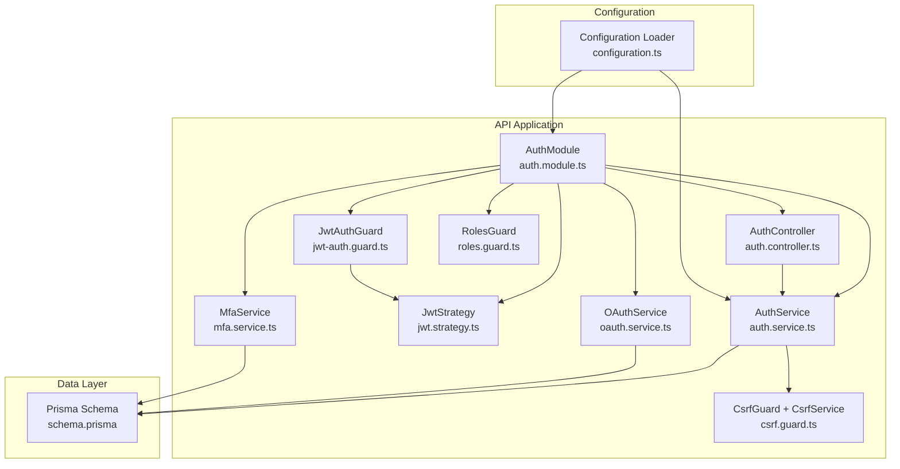

**Diagram sources**
- [auth.module.ts:17-51](file://apps/api/src/modules/auth/auth.module.ts#L17-L51)
- [auth.controller.ts:31-36](file://apps/api/src/modules/auth/auth.controller.ts#L31-L36)
- [auth.service.ts:37-62](file://apps/api/src/modules/auth/auth.service.ts#L37-L62)
- [jwt-auth.guard.ts:14-33](file://apps/api/src/modules/auth/guards/jwt-auth.guard.ts#L14-L33)
- [roles.guard.ts:7-35](file://apps/api/src/modules/auth/guards/roles.guard.ts#L7-L35)
- [jwt.strategy.ts:7-32](file://apps/api/src/modules/auth/strategies/jwt.strategy.ts#L7-L32)
- [csrf.guard.ts:47-148](file://apps/api/src/common/guards/csrf.guard.ts#L47-L148)
- [oauth.service.ts:56-71](file://apps/api/src/modules/auth/oauth/oauth.service.ts#L56-L71)
- [mfa.service.ts:22-24](file://apps/api/src/modules/auth/mfa/mfa.service.ts#L22-L24)
- [configuration.ts:87-114](file://apps/api/src/config/configuration.ts#L87-L114)
- [schema.prisma:18-23](file://prisma/schema.prisma#L18-L23)

**Section sources**
- [auth.module.ts:17-51](file://apps/api/src/modules/auth/auth.module.ts#L17-L51)
- [configuration.ts:87-114](file://apps/api/src/config/configuration.ts#L87-L114)
- [schema.prisma:18-23](file://prisma/schema.prisma#L18-L23)

## Core Components
- Authentication and authorization module wiring, JWT configuration, and guard registration.
- Auth controller endpoints for registration, login, refresh, logout, profile retrieval, email verification, password reset, and CSRF token generation.
- Auth service implementing password hashing, token generation, refresh token storage, rate limiting, email verification, password reset, and secure logout.
- Guards for JWT authentication and RBAC enforcement.
- Strategy for JWT extraction and validation.
- CSRF protection via double-submit cookie pattern.
- OAuth service supporting Google and Microsoft authentication flows.
- MFA service implementing TOTP-based MFA with backup codes.
- Configuration loader enforcing production hardening and validating secrets.
- Prisma schema defining user roles and related entities.

**Section sources**
- [auth.module.ts:17-51](file://apps/api/src/modules/auth/auth.module.ts#L17-L51)
- [auth.controller.ts:31-170](file://apps/api/src/modules/auth/auth.controller.ts#L31-L170)
- [auth.service.ts:37-506](file://apps/api/src/modules/auth/auth.service.ts#L37-L506)
- [jwt-auth.guard.ts:14-63](file://apps/api/src/modules/auth/guards/jwt-auth.guard.ts#L14-L63)
- [roles.guard.ts:7-36](file://apps/api/src/modules/auth/guards/roles.guard.ts#L7-L36)
- [jwt.strategy.ts:7-32](file://apps/api/src/modules/auth/strategies/jwt.strategy.ts#L7-L32)
- [csrf.guard.ts:47-241](file://apps/api/src/common/guards/csrf.guard.ts#L47-L241)
- [oauth.service.ts:56-356](file://apps/api/src/modules/auth/oauth/oauth.service.ts#L56-L356)
- [mfa.service.ts:22-249](file://apps/api/src/modules/auth/mfa/mfa.service.ts#L22-L249)
- [configuration.ts:5-114](file://apps/api/src/config/configuration.ts#L5-L114)
- [schema.prisma:18-23](file://prisma/schema.prisma#L18-L23)

## Architecture Overview
The authentication subsystem integrates NestJS Passport for JWT, custom guards for RBAC and CSRF, and external services for OAuth and MFA. Tokens are signed with asymmetric-friendly keys and stored with TTL controls. Refresh tokens are persisted in Redis and audited in the database. OAuth and MFA flows integrate with the central Auth service and database.

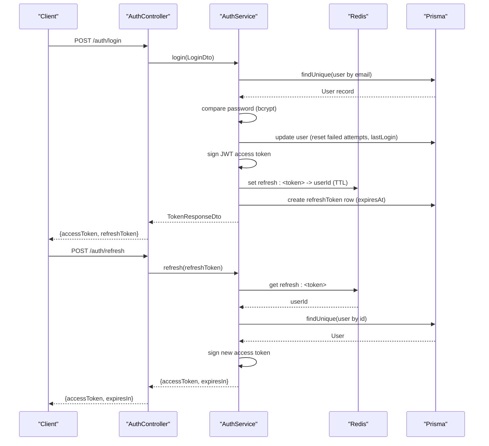

**Diagram sources**
- [auth.controller.ts:47-71](file://apps/api/src/modules/auth/auth.controller.ts#L47-L71)
- [auth.service.ts:104-177](file://apps/api/src/modules/auth/auth.service.ts#L104-L177)
- [schema.prisma:18-23](file://prisma/schema.prisma#L18-L23)

## Detailed Component Analysis

### JWT Authentication and Token Lifecycle
- JWT signing uses a configurable secret and expiration. Access tokens expire quickly; refresh tokens are long-lived and stored server-side.
- Access tokens are validated by a Passport strategy that delegates to the Auth service for user lookup and activity checks.
- Refresh tokens are stored in Redis with TTL and also recorded in the database for audit and revocation.

```mermaid
classDiagram
class JwtStrategy {
+constructor(configService, authService)
+validate(payload) AuthenticatedUser
}
class JwtAuthGuard {
+constructor(reflector)
+canActivate(context) boolean
+handleRequest(err, user, info, context) TUser
}
class AuthService {
+login(dto) TokenResponseDto
+refresh(refreshToken) {accessToken, expiresIn}
+logout(refreshToken) void
+validateUser(payload) AuthenticatedUser
-generateTokens(user) TokenResponseDto
}
JwtAuthGuard --> JwtStrategy : "uses"
JwtStrategy --> AuthService : "validateUser()"
AuthService --> Redis : "store/remove refresh tokens"
AuthService --> Prisma : "user and refreshToken queries"
```

**Diagram sources**
- [jwt.strategy.ts:7-32](file://apps/api/src/modules/auth/strategies/jwt.strategy.ts#L7-L32)
- [jwt-auth.guard.ts:14-63](file://apps/api/src/modules/auth/guards/jwt-auth.guard.ts#L14-L63)
- [auth.service.ts:104-247](file://apps/api/src/modules/auth/auth.service.ts#L104-L247)
- [schema.prisma:18-23](file://prisma/schema.prisma#L18-L23)

**Section sources**
- [jwt.strategy.ts:7-32](file://apps/api/src/modules/auth/strategies/jwt.strategy.ts#L7-L32)
- [jwt-auth.guard.ts:14-63](file://apps/api/src/modules/auth/guards/jwt-auth.guard.ts#L14-L63)
- [auth.service.ts:104-247](file://apps/api/src/modules/auth/auth.service.ts#L104-L247)

### Role-Based Access Control (RBAC)
- Roles are defined in the Prisma schema and enforced by a dedicated RolesGuard.
- Controllers can restrict access by applying the Roles decorator with required roles.
- The guard reads required roles from metadata and compares against the authenticated user’s role.

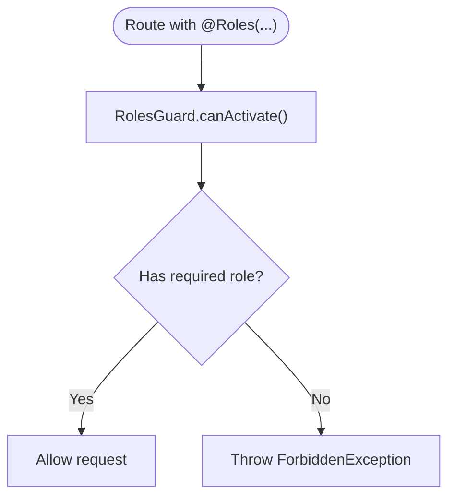

**Diagram sources**
- [roles.guard.ts:7-36](file://apps/api/src/modules/auth/guards/roles.guard.ts#L7-L36)
- [roles.decorator.ts:4-6](file://apps/api/src/modules/auth/decorators/roles.decorator.ts#L4-L6)
- [schema.prisma:18-23](file://prisma/schema.prisma#L18-L23)

**Section sources**
- [roles.guard.ts:7-36](file://apps/api/src/modules/auth/guards/roles.guard.ts#L7-L36)
- [roles.decorator.ts:4-6](file://apps/api/src/modules/auth/decorators/roles.decorator.ts#L4-L6)
- [schema.prisma:18-23](file://prisma/schema.prisma#L18-L23)

### Attribute-Based Access Control (ABAC)
- The current implementation focuses on RBAC via roles. ABAC patterns are not explicitly implemented in the referenced files.
- To implement ABAC, extend authorization checks in services or guards to evaluate user attributes (e.g., ownership, department) alongside roles.

[No sources needed since this section provides general guidance]

### OAuth2/OIDC Integration
- Supports Google and Microsoft OAuth flows. Tokens are verified and mapped to user records, linking OAuth accounts to existing users or creating new ones.
- The service generates JWT access and refresh tokens upon successful OAuth login.

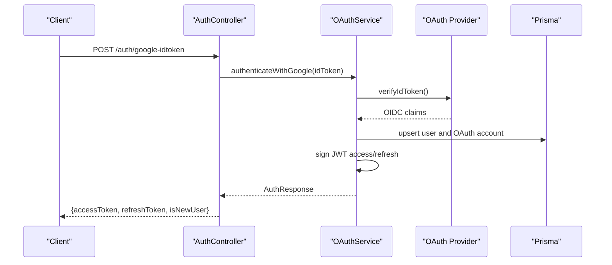

**Diagram sources**
- [oauth.service.ts:75-108](file://apps/api/src/modules/auth/oauth/oauth.service.ts#L75-L108)
- [auth.controller.ts:38-45](file://apps/api/src/modules/auth/auth.controller.ts#L38-L45)

**Section sources**
- [oauth.service.ts:56-356](file://apps/api/src/modules/auth/oauth/oauth.service.ts#L56-L356)
- [auth.controller.ts:38-45](file://apps/api/src/modules/auth/auth.controller.ts#L38-L45)

### Multi-Factor Authentication (MFA)
- Implements TOTP-based MFA with backup codes. Users can enable/disable MFA and regenerate backup codes.
- Verification supports both time-based codes and backup codes.

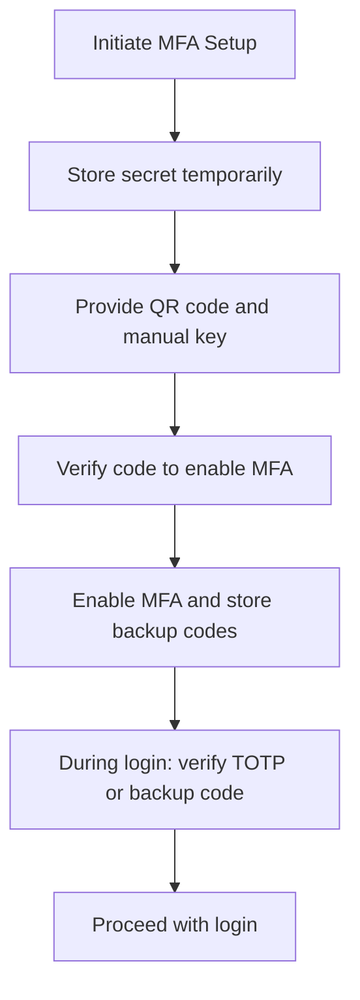

**Diagram sources**
- [mfa.service.ts:29-140](file://apps/api/src/modules/auth/mfa/mfa.service.ts#L29-L140)

**Section sources**
- [mfa.service.ts:22-249](file://apps/api/src/modules/auth/mfa/mfa.service.ts#L22-L249)

### User Registration, Password Policies, and Email Verification
- Registration hashes passwords using bcrypt with configurable rounds, creates a user with default role, and sends a verification email.
- Password reset enforces minimum length and invalidates all refresh tokens for the user upon completion.
- Email verification tokens are stored with TTL and removed after successful verification.

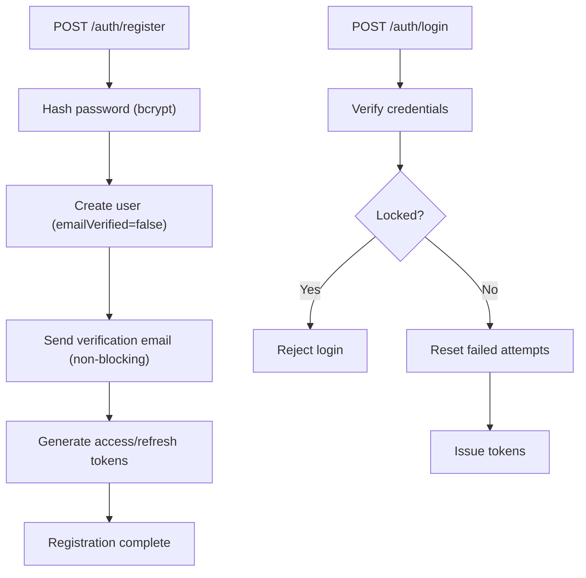

**Diagram sources**
- [auth.service.ts:64-145](file://apps/api/src/modules/auth/auth.service.ts#L64-L145)

**Section sources**
- [auth.service.ts:64-145](file://apps/api/src/modules/auth/auth.service.ts#L64-L145)
- [auth.service.ts:293-383](file://apps/api/src/modules/auth/auth.service.ts#L293-L383)
- [auth.service.ts:385-466](file://apps/api/src/modules/auth/auth.service.ts#L385-L466)

### Session Management and Token Lifecycle
- Access tokens are short-lived; refresh tokens are long-lived and stored in Redis with TTL and in the database.
- Logout removes the refresh token from Redis; password reset invalidates all refresh tokens for the user.
- The system does not maintain server-side session state; token lifecycle is managed via Redis and database.

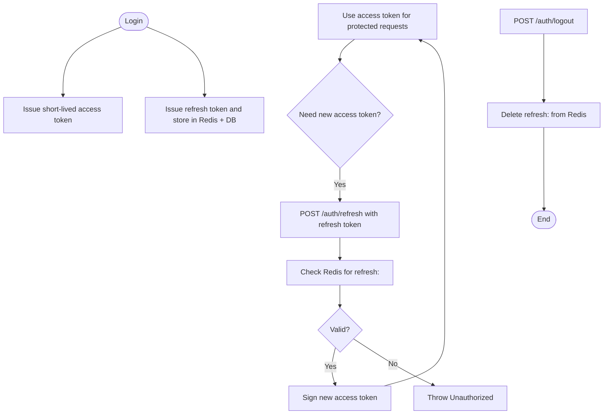

**Diagram sources**
- [auth.controller.ts:59-81](file://apps/api/src/modules/auth/auth.controller.ts#L59-L81)
- [auth.service.ts:147-183](file://apps/api/src/modules/auth/auth.service.ts#L147-L183)
- [auth.service.ts:468-498](file://apps/api/src/modules/auth/auth.service.ts#L468-L498)

**Section sources**
- [auth.controller.ts:59-81](file://apps/api/src/modules/auth/auth.controller.ts#L59-L81)
- [auth.service.ts:147-183](file://apps/api/src/modules/auth/auth.service.ts#L147-L183)
- [auth.service.ts:468-498](file://apps/api/src/modules/auth/auth.service.ts#L468-L498)

### API Authentication and Authorization Patterns
- Protected routes use JwtAuthGuard to enforce JWT authentication.
- RBAC is applied via RolesGuard and the Roles decorator.
- Public endpoints can be marked with the Public decorator to bypass authentication.

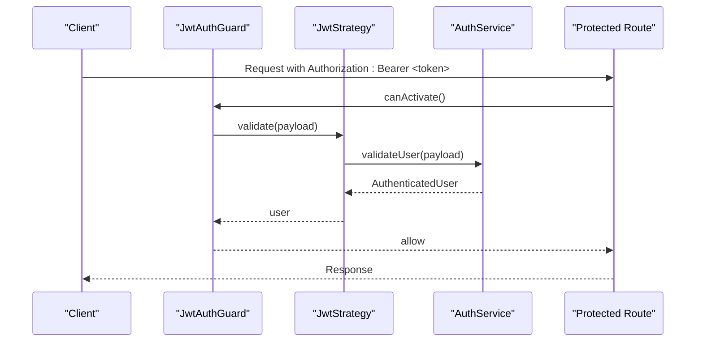

**Diagram sources**
- [jwt-auth.guard.ts:22-62](file://apps/api/src/modules/auth/guards/jwt-auth.guard.ts#L22-L62)
- [jwt.strategy.ts:24-32](file://apps/api/src/modules/auth/strategies/jwt.strategy.ts#L24-L32)
- [auth.service.ts:185-209](file://apps/api/src/modules/auth/auth.service.ts#L185-L209)
- [auth.controller.ts:83-91](file://apps/api/src/modules/auth/auth.controller.ts#L83-L91)

**Section sources**
- [jwt-auth.guard.ts:14-63](file://apps/api/src/modules/auth/guards/jwt-auth.guard.ts#L14-L63)
- [jwt.strategy.ts:7-32](file://apps/api/src/modules/auth/strategies/jwt.strategy.ts#L7-L32)
- [auth.service.ts:185-209](file://apps/api/src/modules/auth/auth.service.ts#L185-L209)
- [auth.controller.ts:83-91](file://apps/api/src/modules/auth/auth.controller.ts#L83-L91)

### CSRF Protection
- Implements double-submit cookie pattern: server sets a CSRF token in a cookie; client must echo it in the X-CSRF-Token header.
- Validation uses constant-time comparison and optional token integrity checks.
- Certain routes can opt out using the SkipCsrf decorator; safe methods are exempt.

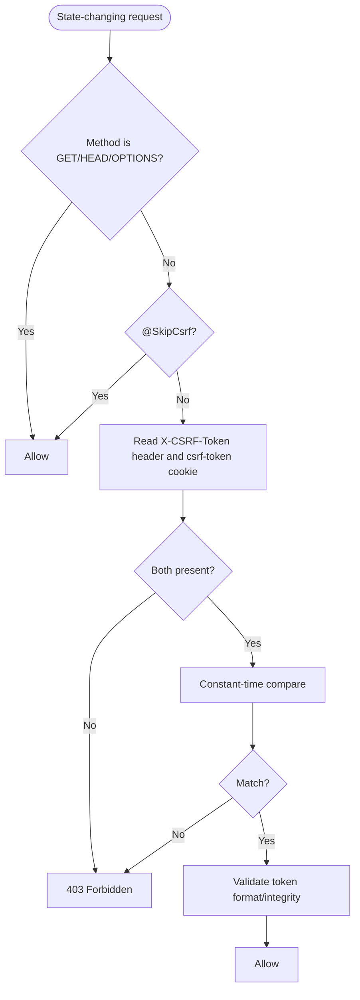

**Diagram sources**
- [csrf.guard.ts:66-148](file://apps/api/src/common/guards/csrf.guard.ts#L66-L148)

**Section sources**
- [csrf.guard.ts:47-241](file://apps/api/src/common/guards/csrf.guard.ts#L47-L241)
- [auth.controller.ts:140-169](file://apps/api/src/modules/auth/auth.controller.ts#L140-L169)

### Access Control Implementation in Controllers, Services, and Database
- Controllers apply guards and decorators to enforce authentication and authorization.
- Services encapsulate business logic for token issuance, validation, rate limiting, and persistence.
- Database models define roles and related entities; Prisma ensures referential integrity.

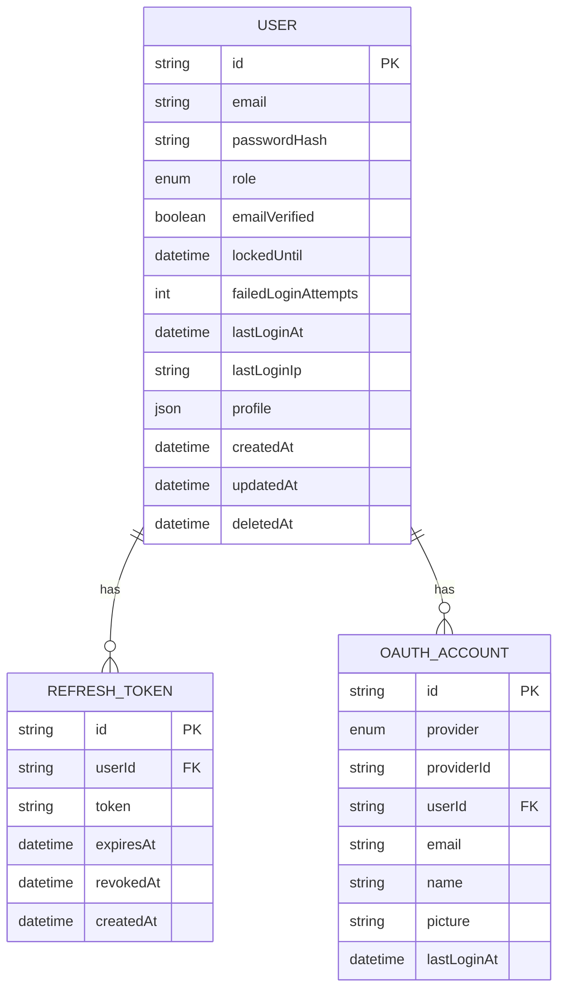

**Diagram sources**
- [schema.prisma:18-23](file://prisma/schema.prisma#L18-L23)

**Section sources**
- [auth.controller.ts:38-91](file://apps/api/src/modules/auth/auth.controller.ts#L38-L91)
- [auth.service.ts:37-62](file://apps/api/src/modules/auth/auth.service.ts#L37-L62)
- [schema.prisma:18-23](file://prisma/schema.prisma#L18-L23)

### Privilege Escalation Prevention, Session Fixation Protection, and Secure Logout
- Privilege escalation prevention: RolesGuard ensures requested roles are satisfied; JwtAuthGuard rejects invalid/expired tokens.
- Session fixation protection: Refresh tokens are stored server-side and invalidated on logout and password reset; new tokens are issued on successful login.
- Secure logout: Removes refresh token from Redis; consider adding token blacklisting for access tokens if needed.

**Section sources**
- [roles.guard.ts:7-36](file://apps/api/src/modules/auth/guards/roles.guard.ts#L7-L36)
- [jwt-auth.guard.ts:14-63](file://apps/api/src/modules/auth/guards/jwt-auth.guard.ts#L14-L63)
- [auth.service.ts:179-183](file://apps/api/src/modules/auth/auth.service.ts#L179-L183)
- [auth.service.ts:468-498](file://apps/api/src/modules/auth/auth.service.ts#L468-L498)

## Dependency Analysis
- AuthModule wires Passport, JwtModule, guards, strategies, services, and controllers.
- AuthController depends on AuthService and CsrfService.
- AuthService depends on PrismaService, JwtService, ConfigService, RedisService, and NotificationService.
- Guards depend on Reflector and AuthenticatedUser context.
- OAuthService depends on PrismaService, JwtService, ConfigService, and external OAuth providers.
- MfaService depends on PrismaService and TOTP libraries.

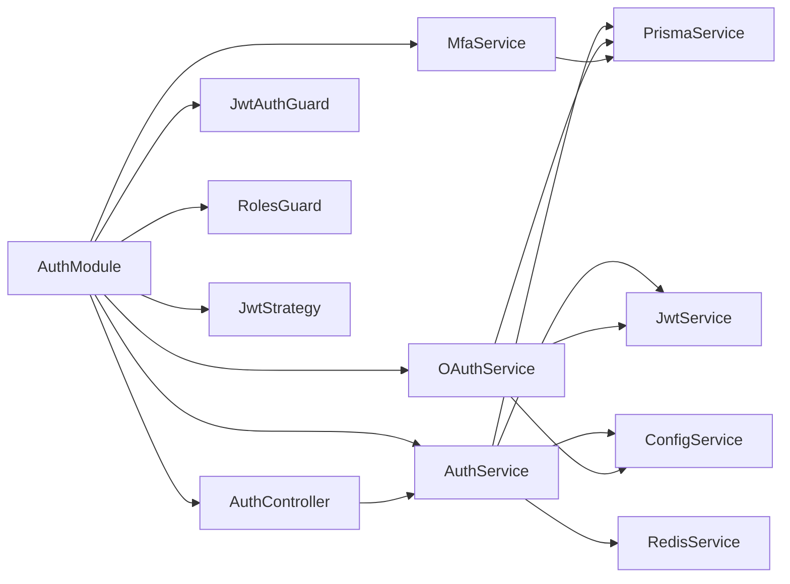

**Diagram sources**
- [auth.module.ts:17-51](file://apps/api/src/modules/auth/auth.module.ts#L17-L51)
- [auth.controller.ts:33-36](file://apps/api/src/modules/auth/auth.controller.ts#L33-L36)
- [auth.service.ts:46-52](file://apps/api/src/modules/auth/auth.service.ts#L46-L52)
- [oauth.service.ts:61-71](file://apps/api/src/modules/auth/oauth/oauth.service.ts#L61-L71)
- [mfa.service.ts:24-24](file://apps/api/src/modules/auth/mfa/mfa.service.ts#L24-L24)

**Section sources**
- [auth.module.ts:17-51](file://apps/api/src/modules/auth/auth.module.ts#L17-L51)
- [auth.controller.ts:33-36](file://apps/api/src/modules/auth/auth.controller.ts#L33-L36)
- [auth.service.ts:46-52](file://apps/api/src/modules/auth/auth.service.ts#L46-L52)
- [oauth.service.ts:61-71](file://apps/api/src/modules/auth/oauth/oauth.service.ts#L61-L71)
- [mfa.service.ts:24-24](file://apps/api/src/modules/auth/mfa/mfa.service.ts#L24-L24)

## Performance Considerations
- Use Redis for refresh token storage to minimize database load and enable fast TTL-based invalidation.
- Apply rate limiting on sensitive endpoints (login, password reset, verification) to mitigate brute force attacks.
- Keep access token TTL minimal to reduce exposure windows; rely on refresh tokens for extended sessions.
- Offload email operations (verification, password reset) to non-blocking tasks to improve responsiveness.

[No sources needed since this section provides general guidance]

## Troubleshooting Guide
Common issues and resolutions:
- Authentication failures:
  - Check JWT secret configuration and environment variables.
  - Review JwtAuthGuard logs for token errors (expired/invalid).
- Authorization failures:
  - Verify required roles are set on the route and the user’s role matches.
- CSRF validation failures:
  - Ensure the csrf-token cookie is set and X-CSRF-Token header matches.
  - Confirm the route is not inadvertently marked with SkipCsrf.
- OAuth login issues:
  - Validate provider client IDs/secrets and token audiences.
- MFA setup/verification problems:
  - Confirm TOTP code validity and backup code usage.
- Password reset failures:
  - Ensure token TTL and minimum password length requirements are met.

**Section sources**
- [jwt-auth.guard.ts:49-60](file://apps/api/src/modules/auth/guards/jwt-auth.guard.ts#L49-L60)
- [csrf.guard.ts:99-145](file://apps/api/src/common/guards/csrf.guard.ts#L99-L145)
- [oauth.service.ts:76-108](file://apps/api/src/modules/auth/oauth/oauth.service.ts#L76-L108)
- [mfa.service.ts:67-140](file://apps/api/src/modules/auth/mfa/mfa.service.ts#L67-L140)
- [auth.service.ts:423-466](file://apps/api/src/modules/auth/auth.service.ts#L423-L466)

## Conclusion
Quiz-to-Build implements a robust authentication and authorization framework centered on JWT, with complementary OAuth and MFA capabilities. RBAC is enforced via dedicated guards and decorators. Security is strengthened through CSRF protection, strict production configuration validation, and careful token lifecycle management. Extending the system to support ABAC and additional OAuth providers is straightforward given the modular design.

[No sources needed since this section summarizes without analyzing specific files]

## Appendices

### Security Configuration Examples
- Production hardening checklist:
  - Set strong JWT secrets (minimum 32 characters) and refresh secrets.
  - Configure CORS_ORIGIN to an explicit allowlist (do not use wildcard).
  - Enforce CSRF_SECRET in production and avoid CSRF_DISABLED=true.
  - Use Redis for refresh token storage and configure REDIS_HOST/PORT/PASSWORD.
  - Validate BCRYPT_ROUNDS and token expiry settings.

**Section sources**
- [configuration.ts:5-43](file://apps/api/src/config/configuration.ts#L5-L43)
- [configuration.ts:45-114](file://apps/api/src/config/configuration.ts#L45-L114)