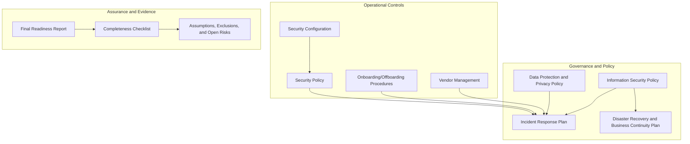
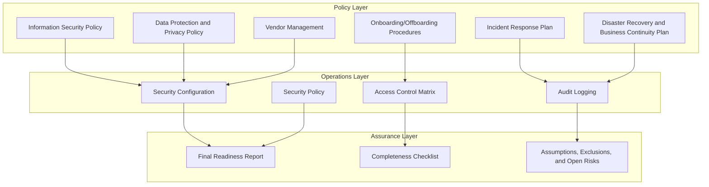
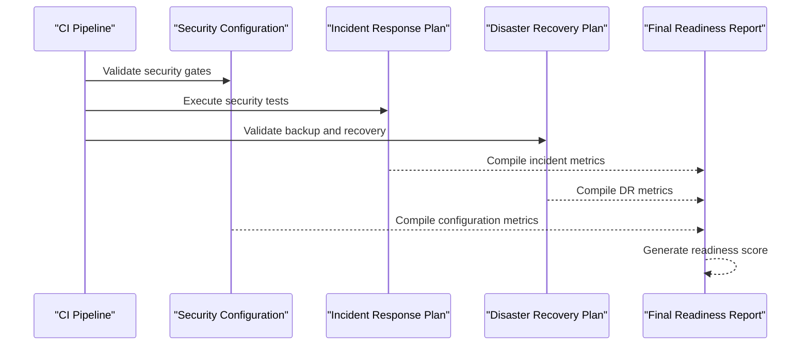
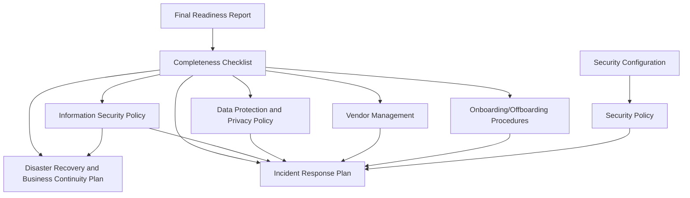

# Compliance Framework

<cite>
**Referenced Files in This Document**
- [final-readiness-report.md](file://docs/compliance/final-readiness-report.md)
- [completeness-checklist.md](file://docs/compliance/completeness-checklist.md)
- [assumptions-exclusions-risks.md](file://docs/compliance/assumptions-exclusions-risks.md)
- [security-policy.md](file://security/policies/security-policy.md)
- [security-config.md](file://security/config/security-config.md)
- [information-security-policy.md](file://docs/cto/08-information-security-policy.md)
- [data-protection-privacy-policy.md](file://docs/cto/10-data-protection-privacy-policy.md)
- [incident-response-plan.md](file://docs/cto/09-incident-response-plan.md)
- [disaster-recovery-business-continuity.md](file://docs/cto/11-disaster-recovery-business-continuity.md)
- [vendor-management.md](file://docs/cto/13-vendor-management.md)
- [onboarding-offboarding-procedures.md](file://docs/cto/14-onboarding-offboarding-procedures.md)
- [ip-assignment-nda.md](file://docs/cto/15-ip-assignment-nda.md)
</cite>

## Table of Contents
1. [Introduction](#introduction)
2. [Project Structure](#project-structure)
3. [Core Components](#core-components)
4. [Architecture Overview](#architecture-overview)
5. [Detailed Component Analysis](#detailed-component-analysis)
6. [Dependency Analysis](#dependency-analysis)
7. [Performance Considerations](#performance-considerations)
8. [Troubleshooting Guide](#troubleshooting-guide)
9. [Conclusion](#conclusion)
10. [Appendices](#appendices)

## Introduction
This document presents a comprehensive compliance framework for Quiz-to-Build, grounded in the repository's established policies, procedures, and assessment artifacts. It consolidates the platform's current alignment with key regulatory regimes (SOX, GDPR, HIPAA, PCI-DSS) and industry standards (ISO 27001, NIST CSF, OWASP ASVS, SOC 2), while detailing monitoring, assessment, certification, and enforcement mechanisms. The framework also addresses supplier compliance, subcontractor management, and third-party oversight, supported by concrete artifacts from the repository.

## Project Structure
The compliance framework is organized around three pillars:
- **Governance and Policy**: Information Security Policy, Data Protection and Privacy Policy, Incident Response Plan, Disaster Recovery and Business Continuity Plan
- **Operational Controls**: Security Configuration, Security Policy, Vendor Management, Onboarding/Offboarding Procedures
- **Assurance and Evidence**: Final Readiness Report, Completeness Checklist, Assumptions, Exclusions, and Open Risks

**Diagram sources**
- [information-security-policy.md:1-800](file://docs/cto/08-information-security-policy.md#L1-L800)
- [data-protection-privacy-policy.md:1-697](file://docs/cto/10-data-protection-privacy-policy.md#L1-L697)
- [incident-response-plan.md:1-917](file://docs/cto/09-incident-response-plan.md#L1-L917)
- [disaster-recovery-business-continuity.md:1-905](file://docs/cto/11-disaster-recovery-business-continuity.md#L1-L905)
- [security-config.md:1-93](file://security/config/security-config.md#L1-L93)
- [security-policy.md:1-54](file://security/policies/security-policy.md#L1-L54)
- [vendor-management.md:1-717](file://docs/cto/13-vendor-management.md#L1-L717)
- [onboarding-offboarding-procedures.md:1-1081](file://docs/cto/14-onboarding-offboarding-procedures.md#L1-L1081)
- [final-readiness-report.md:1-241](file://docs/compliance/final-readiness-report.md#L1-L241)
- [completeness-checklist.md:1-269](file://docs/compliance/completeness-checklist.md#L1-L269)
- [assumptions-exclusions-risks.md:1-215](file://docs/compliance/assumptions-exclusions-risks.md#L1-L215)

**Section sources**
- [final-readiness-report.md:1-241](file://docs/compliance/final-readiness-report.md#L1-L241)
- [completeness-checklist.md:1-269](file://docs/compliance/completeness-checklist.md#L1-L269)
- [assumptions-exclusions-risks.md:1-215](file://docs/compliance/assumptions-exclusions-risks.md#L1-L215)

## Core Components
This section outlines the core compliance components and their alignment with applicable frameworks and regulations.

- **Information Security Policy**: Establishes governance, risk management, and control objectives aligned with ISO 27001 and SOC 2 Type II. Defines access control principles, authentication/authorization requirements, encryption standards, and security awareness training.
- **Data Protection and Privacy Policy**: Aligns with GDPR and CCPA, covering data categories, processing purposes, legal bases, data subject rights, retention, and security measures.
- **Incident Response Plan**: Defines roles, severity levels, response lifecycle, communication procedures, and regulatory notification timelines for GDPR and CCPA.
- **Disaster Recovery and Business Continuity Plan**: Specifies recovery objectives (RTO/RPO), backup strategies, failover procedures, and communication plans.
- **Security Configuration and Security Policy**: Document operational controls including rate limiting, JWT configuration, password policy, CORS, security headers, and audit logging.
- **Vendor Management**: Provides vendor classification, assessment workflow, contract requirements, SLAs, and ongoing monitoring.
- **Onboarding/Offboarding Procedures**: Establishes least privilege access provisioning, timely revocation, audit trails, and emergency access procedures.
- **Assurance Artifacts**: Final Readiness Report demonstrates maturity across dimensions and standards mapping; Completeness Checklist validates platform readiness; Assumptions, Exclusions, and Open Risks documents risks and exclusions.

**Section sources**
- [information-security-policy.md:1-800](file://docs/cto/08-information-security-policy.md#L1-L800)
- [data-protection-privacy-policy.md:1-697](file://docs/cto/10-data-protection-privacy-policy.md#L1-L697)
- [incident-response-plan.md:1-917](file://docs/cto/09-incident-response-plan.md#L1-L917)
- [disaster-recovery-business-continuity.md:1-905](file://docs/cto/11-disaster-recovery-business-continuity.md#L1-L905)
- [security-config.md:1-93](file://security/config/security-config.md#L1-L93)
- [security-policy.md:1-54](file://security/policies/security-policy.md#L1-L54)
- [vendor-management.md:1-717](file://docs/cto/13-vendor-management.md#L1-L717)
- [onboarding-offboarding-procedures.md:1-1081](file://docs/cto/14-onboarding-offboarding-procedures.md#L1-L1081)
- [final-readiness-report.md:1-241](file://docs/compliance/final-readiness-report.md#L1-L241)
- [completeness-checklist.md:1-269](file://docs/compliance/completeness-checklist.md#L1-L269)
- [assumptions-exclusions-risks.md:1-215](file://docs/compliance/assumptions-exclusions-risks.md#L1-L215)

## Architecture Overview
The compliance architecture integrates policy, operations, and assurance across the platform:

**Diagram sources**
- [information-security-policy.md:1-800](file://docs/cto/08-information-security-policy.md#L1-L800)
- [data-protection-privacy-policy.md:1-697](file://docs/cto/10-data-protection-privacy-policy.md#L1-L697)
- [incident-response-plan.md:1-917](file://docs/cto/09-incident-response-plan.md#L1-L917)
- [disaster-recovery-business-continuity.md:1-905](file://docs/cto/11-disaster-recovery-business-continuity.md#L1-L905)
- [vendor-management.md:1-717](file://docs/cto/13-vendor-management.md#L1-L717)
- [onboarding-offboarding-procedures.md:1-1081](file://docs/cto/14-onboarding-offboarding-procedures.md#L1-L1081)
- [security-config.md:1-93](file://security/config/security-config.md#L1-L93)
- [security-policy.md:1-54](file://security/policies/security-policy.md#L1-L54)
- [final-readiness-report.md:1-241](file://docs/compliance/final-readiness-report.md#L1-L241)
- [completeness-checklist.md:1-269](file://docs/compliance/completeness-checklist.md#L1-L269)
- [assumptions-exclusions-risks.md:1-215](file://docs/compliance/assumptions-exclusions-risks.md#L1-L215)

## Detailed Component Analysis

### Regulatory Alignment and Compliance Mapping
- **SOX**: The platform implements segregation of duties, access reviews, privileged access controls, and audit logging to support financial reporting controls. The Disaster Recovery and Business Continuity Plan supports availability and integrity of financial systems.
- **GDPR**: Data Protection and Privacy Policy aligns with GDPR requirements including legal bases, data subject rights, retention schedules, security measures, and breach notification timelines.
- **HIPAA**: While not explicitly documented as required for this platform, the repository includes HIPAA exclusion documentation indicating no current HIPAA BAA execution. The Information Security Policy and Security Configuration provide foundational controls (encryption, access control, audit logging) that can be adapted for healthcare scenarios.
- **PCI-DSS**: The repository includes a PCI-DSS exclusion noting that the platform does not handle card data directly, relying on Stripe for payment processing. The Security Policy references ISO/IEC 27001, OWASP Top 10, and NIST SSDF practices that support PCI-DSS alignment for payment environments.

**Section sources**
- [information-security-policy.md:1-800](file://docs/cto/08-information-security-policy.md#L1-L800)
- [data-protection-privacy-policy.md:1-697](file://docs/cto/10-data-protection-privacy-policy.md#L1-L697)
- [security-policy.md:1-54](file://security/policies/security-policy.md#L1-L54)
- [assumptions-exclusions-risks.md:86-95](file://docs/compliance/assumptions-exclusions-risks.md#L86-L95)

### Compliance Monitoring, Assessment, and Certification
- **Monitoring**: Security Configuration defines rate limiting, JWT configuration, password policy, CORS, security headers, and audit logging with retention. The Incident Response Plan includes communication procedures and regulatory notification timelines.
- **Assessment**: The Final Readiness Report provides dimension scores, standards mapping (ISO 27001, NIST CSF, OWASP ASVS, SOC 2 Type II, CIS), and heatmaps. The Completeness Checklist validates platform components against requirements.
- **Certification**: The Final Readiness Report certifies the platform for production, noting compliance mappings and evidence integrity.

**Diagram sources**
- [security-config.md:1-93](file://security/config/security-config.md#L1-L93)
- [incident-response-plan.md:1-917](file://docs/cto/09-incident-response-plan.md#L1-L917)
- [disaster-recovery-business-continuity.md:1-905](file://docs/cto/11-disaster-recovery-business-continuity.md#L1-L905)
- [final-readiness-report.md:1-241](file://docs/compliance/final-readiness-report.md#L1-L241)

**Section sources**
- [security-config.md:1-93](file://security/config/security-config.md#L1-L93)
- [incident-response-plan.md:1-917](file://docs/cto/09-incident-response-plan.md#L1-L917)
- [disaster-recovery-business-continuity.md:1-905](file://docs/cto/11-disaster-recovery-business-continuity.md#L1-L905)
- [final-readiness-report.md:1-241](file://docs/compliance/final-readiness-report.md#L1-L241)

### Internal Policies and Enforcement
- **Information Security Policy**: Defines governance, risk assessment, access control principles, authentication/authorization requirements, encryption standards, and training requirements.
- **Onboarding/Offboarding Procedures**: Establishes least privilege, timely provisioning, prompt revocation, and audit trails. Includes emergency access procedures with logging and time limits.
- **Security Policy**: Documents supported versions, vulnerability reporting process, authentication/authorization, data protection, infrastructure, and dependency management.

**Section sources**
- [information-security-policy.md:1-800](file://docs/cto/08-information-security-policy.md#L1-L800)
- [onboarding-offboarding-procedures.md:1-1081](file://docs/cto/14-onboarding-offboarding-procedures.md#L1-L1081)
- [security-policy.md:1-54](file://security/policies/security-policy.md#L1-L54)

### Compliance Training Programs
- **Security Awareness and Training**: The Information Security Policy specifies annual training for all employees, developers, administrators, and executives, covering phishing, password security, MFA, data handling, and secure development practices.

**Section sources**
- [information-security-policy.md:318-360](file://docs/cto/08-information-security-policy.md#L318-L360)

### Audit Procedures, Reporting, and Remediation Tracking
- **Audit Procedures**: The Information Security Policy requires quarterly control testing, annual comprehensive audits, and continuous automated compliance monitoring. The Onboarding/Offboarding Procedures define audit trail requirements and compliance reporting.
- **Reporting**: Monthly access summaries, privileged access reports, access review status, and orphan account reports are defined for compliance reporting.
- **Remediation Tracking**: The Final Readiness Report includes gap analysis and remediation tracking. The Assumptions, Exclusions, and Open Risks document identifies risks and mitigation owners.

**Section sources**
- [information-security-policy.md:356-420](file://docs/cto/08-information-security-policy.md#L356-L420)
- [onboarding-offboarding-procedures.md:501-531](file://docs/cto/14-onboarding-offboarding-procedures.md#L501-L531)
- [final-readiness-report.md:137-146](file://docs/compliance/final-readiness-report.md#L137-L146)
- [assumptions-exclusions-risks.md:107-152](file://docs/compliance/assumptions-exclusions-risks.md#L107-L152)

### Compliance Automation Tools and Dashboards
- **Automation Tools**: The Security Policy references automated Dependabot updates, npm audit in CI, Snyk vulnerability scanning, and SBOM generation for supply chain security.
- **Dashboards**: The Final Readiness Report includes readiness score breakdowns, heatmaps, and evidence integrity verification. The Completeness Checklist provides a structured view of platform completeness.

**Section sources**
- [security-policy.md:43-48](file://security/policies/security-policy.md#L43-L48)
- [final-readiness-report.md:18-61](file://docs/compliance/final-readiness-report.md#L18-L61)
- [completeness-checklist.md:244-269](file://docs/compliance/completeness-checklist.md#L244-L269)

### Supplier Compliance and Third-Party Management
- **Vendor Classification**: Critical, High, Medium, and Low tiers with risk-based assessment requirements and review frequencies.
- **Assessment Workflow**: Initial screening, risk classification, security assessment, contract negotiation, legal review, onboarding, and ongoing monitoring.
- **Contract Requirements**: Data Processing Agreements, security requirements, breach notification, audit rights, subprocessor restrictions, termination assistance, insurance requirements, and SLAs.
- **Ongoing Monitoring**: Security news monitoring, performance reviews, SLA compliance checks, security reassessments, and incident reviews.

**Section sources**
- [vendor-management.md:25-717](file://docs/cto/13-vendor-management.md#L25-L717)

### Compliance Checklists, Assessment Frameworks, and Continuous Monitoring
- **Checklists**: The Completeness Checklist validates backend API, frontend application, CLI tool, database, DevOps, security documentation, business documentation, question bank, and integration capabilities.
- **Assessment Frameworks**: The Final Readiness Report provides dimension scores, standards mapping, and heatmaps. The Assumptions, Exclusions, and Open Risks document identifies assumptions, exclusions, and risks.
- **Continuous Monitoring**: The Information Security Policy defines continuous automated vulnerability scanning and risk register maintenance.

**Section sources**
- [completeness-checklist.md:1-269](file://docs/compliance/completeness-checklist.md#L1-L269)
- [final-readiness-report.md:1-241](file://docs/compliance/final-readiness-report.md#L1-L241)
- [assumptions-exclusions-risks.md:1-215](file://docs/compliance/assumptions-exclusions-risks.md#L1-L215)
- [information-security-policy.md:64-69](file://docs/cto/08-information-security-policy.md#L64-L69)

## Dependency Analysis
The compliance framework exhibits strong internal cohesion across policy, operations, and assurance domains, with clear dependencies among components.

**Diagram sources**
- [final-readiness-report.md:1-241](file://docs/compliance/final-readiness-report.md#L1-L241)
- [completeness-checklist.md:1-269](file://docs/compliance/completeness-checklist.md#L1-L269)
- [information-security-policy.md:1-800](file://docs/cto/08-information-security-policy.md#L1-L800)
- [data-protection-privacy-policy.md:1-697](file://docs/cto/10-data-protection-privacy-policy.md#L1-L697)
- [incident-response-plan.md:1-917](file://docs/cto/09-incident-response-plan.md#L1-L917)
- [disaster-recovery-business-continuity.md:1-905](file://docs/cto/11-disaster-recovery-business-continuity.md#L1-L905)
- [vendor-management.md:1-717](file://docs/cto/13-vendor-management.md#L1-L717)
- [onboarding-offboarding-procedures.md:1-1081](file://docs/cto/14-onboarding-offboarding-procedures.md#L1-L1081)
- [security-config.md:1-93](file://security/config/security-config.md#L1-L93)
- [security-policy.md:1-54](file://security/policies/security-policy.md#L1-L54)

**Section sources**
- [final-readiness-report.md:1-241](file://docs/compliance/final-readiness-report.md#L1-L241)
- [completeness-checklist.md:1-269](file://docs/compliance/completeness-checklist.md#L1-L269)

## Performance Considerations
- **Security Controls**: The Security Configuration defines rate limiting and JWT expiration to balance security and performance. The Security Policy emphasizes automated dependency management to reduce vulnerabilities without impacting performance.
- **Backup and Recovery**: The Disaster Recovery and Business Continuity Plan defines RTO/RPO targets and backup strategies to minimize downtime and data loss during recovery operations.

**Section sources**
- [security-config.md:3-47](file://security/config/security-config.md#L3-L47)
- [security-policy.md:43-48](file://security/policies/security-policy.md#L43-L48)
- [disaster-recovery-business-continuity.md:27-34](file://docs/cto/11-disaster-recovery-business-continuity.md#L27-L34)

## Troubleshooting Guide
Common compliance issues and resolutions:

- **Access Control Violations**: Use the Onboarding/Offboarding Procedures to verify least privilege provisioning and timely revocation. Review access logs and conduct access reviews as defined in the Information Security Policy.
- **Security Configuration Drift**: Validate against Security Configuration and Security Policy. Use automated dependency management and SCA tools to detect and remediate configuration issues.
- **Incident Response Delays**: Follow the Incident Response Plan's severity levels and response times. Ensure communication procedures are executed per regulatory requirements.
- **Vendor Risk Escalation**: Utilize the Vendor Management process for re-assessment and remediation. Monitor vendor performance and security posture per the defined metrics.

**Section sources**
- [onboarding-offboarding-procedures.md:395-462](file://docs/cto/14-onboarding-offboarding-procedures.md#L395-L462)
- [information-security-policy.md:356-420](file://docs/cto/08-information-security-policy.md#L356-L420)
- [security-config.md:1-93](file://security/config/security-config.md#L1-L93)
- [security-policy.md:1-54](file://security/policies/security-policy.md#L1-L54)
- [incident-response-plan.md:1-917](file://docs/cto/09-incident-response-plan.md#L1-L917)
- [vendor-management.md:223-331](file://docs/cto/13-vendor-management.md#L223-L331)

## Conclusion
Quiz-to-Build demonstrates robust compliance maturity through integrated policy, operational controls, and assurance mechanisms. The platform aligns with key frameworks and regulations, with documented monitoring, assessment, and remediation processes. The repository provides concrete artifacts that support continuous compliance and serve as the foundation for further enhancements and formal certifications.

## Appendices

### Compliance Checklist Templates
- **Platform Completeness Checklist**: Validates backend API, frontend application, CLI tool, database, DevOps, security documentation, business documentation, question bank, and integrations.
- **Vendor Assessment Checklist**: Guides risk classification, security questionnaire completion, required documentation, and ongoing monitoring activities.

**Section sources**
- [completeness-checklist.md:1-269](file://docs/compliance/completeness-checklist.md#L1-L269)
- [vendor-management.md:76-143](file://docs/cto/13-vendor-management.md#L76-L143)

### Assessment Frameworks
- **Final Readiness Report**: Provides dimension scores, standards mapping, heatmaps, and evidence integrity verification.
- **Assumptions, Exclusions, and Open Risks**: Documents assumptions, exclusions, and risk matrix with owners and mitigation strategies.

**Section sources**
- [final-readiness-report.md:1-241](file://docs/compliance/final-readiness-report.md#L1-L241)
- [assumptions-exclusions-risks.md:1-215](file://docs/compliance/assumptions-exclusions-risks.md#L1-L215)

### Continuous Compliance Monitoring Strategies
- **Automated Security Gates**: SAST, SCA, secret detection, container scanning, SBOM generation, container signing, provenance attestation, and readiness score gates.
- **Ongoing Vendor Monitoring**: Security news monitoring, performance reviews, SLA compliance checks, and incident reviews.
- **Access Reviews**: Quarterly user access reviews, monthly privileged access reviews, and service account reviews.

**Section sources**
- [security-policy.md:43-48](file://security/policies/security-policy.md#L43-L48)
- [vendor-management.md:223-331](file://docs/cto/13-vendor-management.md#L223-L331)
- [onboarding-offboarding-procedures.md:395-462](file://docs/cto/14-onboarding-offboarding-procedures.md#L395-L462)