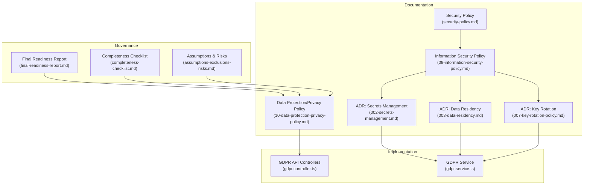
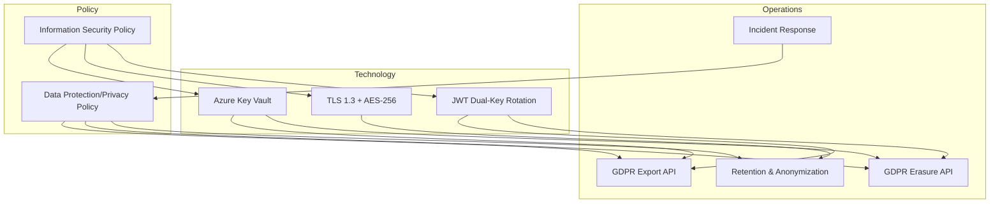
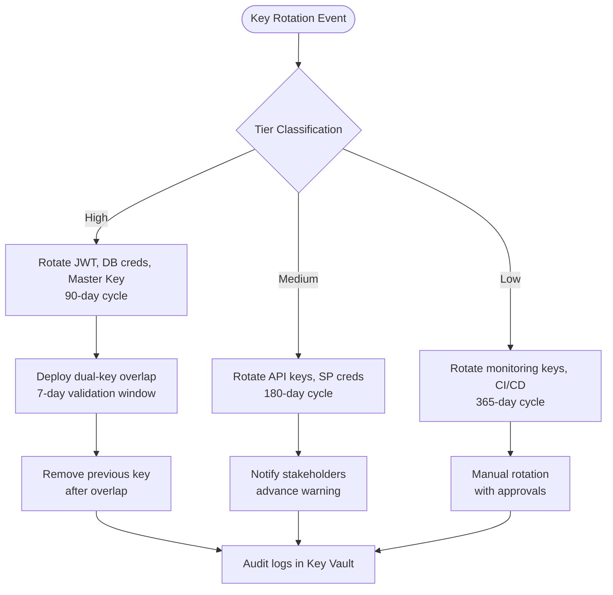
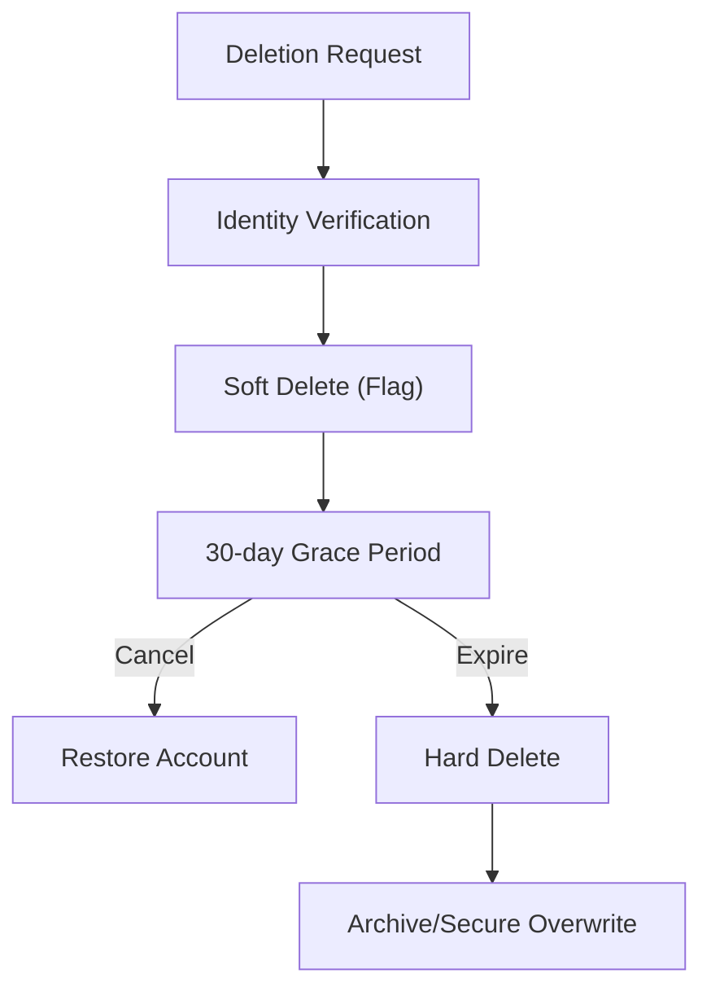
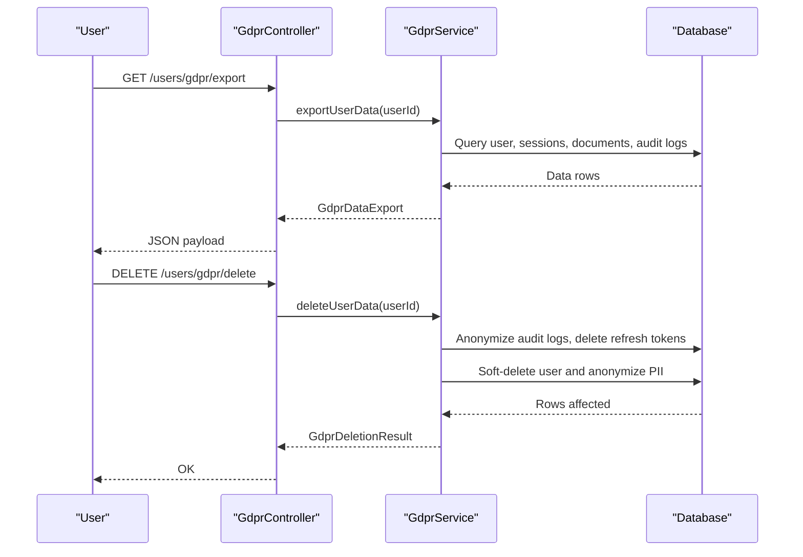
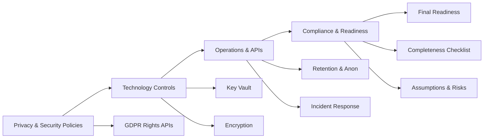

# Data Protection & Privacy

<cite>
**Referenced Files in This Document**
- [10-data-protection-privacy-policy.md](file://docs/cto/10-data-protection-privacy-policy.md)
- [08-information-security-policy.md](file://docs/cto/08-information-security-policy.md)
- [002-secrets-management.md](file://docs/adr/002-secrets-management.md)
- [003-data-residency.md](file://docs/adr/003-data-residency.md)
- [007-key-rotation-policy.md](file://docs/adr/007-key-rotation-policy.md)
- [security-policy.md](file://security/policies/security-policy.md)
- [gdpr.controller.ts](file://apps/api/src/modules/users/gdpr.controller.ts)
- [gdpr.service.ts](file://apps/api/src/modules/users/gdpr.service.ts)
- [final-readiness-report.md](file://docs/compliance/final-readiness-report.md)
- [completeness-checklist.md](file://docs/compliance/completeness-checklist.md)
- [assumptions-exclusions-risks.md](file://docs/compliance/assumptions-exclusions-risks.md)
</cite>

## Table of Contents
1. [Introduction](#introduction)
2. [Project Structure](#project-structure)
3. [Core Components](#core-components)
4. [Architecture Overview](#architecture-overview)
5. [Detailed Component Analysis](#detailed-component-analysis)
6. [Dependency Analysis](#dependency-analysis)
7. [Performance Considerations](#performance-considerations)
8. [Troubleshooting Guide](#troubleshooting-guide)
9. [Conclusion](#conclusion)
10. [Appendices](#appendices)

## Introduction
This document consolidates the data protection and privacy framework for Quiz-to-Build (Quiz2Biz). It defines data classification and sensitivity levels, encryption and key management controls, data handling procedures, retention and anonymization practices, GDPR and CCPA alignment, data subject rights, consent management, breach notification, privacy impact assessments, and data protection officer responsibilities. It also covers processing agreements, third-party data handling, international transfers, and privacy-by-design implementation guidelines.

## Project Structure
The data protection and privacy documentation spans several authoritative sources:
- Public-facing privacy policy covering data categories, processing purposes, retention, and rights
- Information Security Policy establishing encryption, access control, and operational security
- Architecture Decision Records detailing secrets management, data residency, and key rotation
- API module implementing GDPR rights (data export and erasure)
- Compliance and readiness documentation validating controls and governance

**Diagram sources**
- [10-data-protection-privacy-policy.md:1-697](file://docs/cto/10-data-protection-privacy-policy.md#L1-L697)
- [08-information-security-policy.md:1-853](file://docs/cto/08-information-security-policy.md#L1-L853)
- [002-secrets-management.md:1-153](file://docs/adr/002-secrets-management.md#L1-L153)
- [003-data-residency.md:1-148](file://docs/adr/003-data-residency.md#L1-L148)
- [007-key-rotation-policy.md:1-206](file://docs/adr/007-key-rotation-policy.md#L1-L206)
- [security-policy.md:1-54](file://security/policies/security-policy.md#L1-L54)
- [gdpr.controller.ts:1-32](file://apps/api/src/modules/users/gdpr.controller.ts#L1-L32)
- [gdpr.service.ts:1-174](file://apps/api/src/modules/users/gdpr.service.ts#L1-L174)
- [final-readiness-report.md:1-241](file://docs/compliance/final-readiness-report.md#L1-L241)
- [completeness-checklist.md:1-269](file://docs/compliance/completeness-checklist.md#L1-L269)
- [assumptions-exclusions-risks.md:1-215](file://docs/compliance/assumptions-exclusions-risks.md#L1-L215)

**Section sources**
- [10-data-protection-privacy-policy.md:1-697](file://docs/cto/10-data-protection-privacy-policy.md#L1-L697)
- [08-information-security-policy.md:1-853](file://docs/cto/08-information-security-policy.md#L1-L853)
- [002-secrets-management.md:1-153](file://docs/adr/002-secrets-management.md#L1-L153)
- [003-data-residency.md:1-148](file://docs/adr/003-data-residency.md#L1-L148)
- [007-key-rotation-policy.md:1-206](file://docs/adr/007-key-rotation-policy.md#L1-L206)
- [security-policy.md:1-54](file://security/policies/security-policy.md#L1-L54)
- [gdpr.controller.ts:1-32](file://apps/api/src/modules/users/gdpr.controller.ts#L1-L32)
- [gdpr.service.ts:1-174](file://apps/api/src/modules/users/gdpr.service.ts#L1-L174)
- [final-readiness-report.md:1-241](file://docs/compliance/final-readiness-report.md#L1-L241)
- [completeness-checklist.md:1-269](file://docs/compliance/completeness-checklist.md#L1-L269)
- [assumptions-exclusions-risks.md:1-215](file://docs/compliance/assumptions-exclusions-risks.md#L1-L215)

## Core Components
- Data classification and sensitivity levels
  - Restricted: highly sensitive (e.g., passwords, payment data)
  - Confidential: business-sensitive (e.g., business plans, user PII)
  - Internal: internal use only (e.g., policies)
  - Public: publicly available (e.g., marketing docs)
- Encryption and key management
  - TLS 1.3 for transport, AES-256 for at-rest and backups
  - Azure Key Vault for secrets and encryption keys
  - Dual-key JWT rotation with overlap windows
- Data handling procedures
  - Secure coding requirements (input validation, parameterized queries, secure logging)
  - Role-based access control (RBAC) and least privilege
- Data retention and anonymization
  - Defined retention periods per data category
  - Anonymization of usage data after 90 days
- GDPR and CCPA compliance
  - Lawful bases, data subject rights, consent mechanisms, breach notification timelines
- Data subject rights implementation
  - API endpoints for data export and erasure
- International data transfers
  - SCCs, supplementary measures, DPAs, and adequacy mechanisms

**Section sources**
- [08-information-security-policy.md:145-194](file://docs/cto/08-information-security-policy.md#L145-L194)
- [002-secrets-management.md:68-118](file://docs/adr/002-secrets-management.md#L68-L118)
- [007-key-rotation-policy.md:35-56](file://docs/adr/007-key-rotation-policy.md#L35-L56)
- [10-data-protection-privacy-policy.md:171-240](file://docs/cto/10-data-protection-privacy-policy.md#L171-L240)
- [gdpr.controller.ts:1-32](file://apps/api/src/modules/users/gdpr.controller.ts#L1-L32)
- [gdpr.service.ts:46-110](file://apps/api/src/modules/users/gdpr.service.ts#L46-L110)

## Architecture Overview
The data protection architecture integrates policy, technology, and operations:
- Policy layer: Data Protection/Privacy Policy and Information Security Policy define what to protect and how
- Technology layer: Secrets management (Key Vault), encryption (TLS 1.3, AES-256), and key rotation (dual-key JWT)
- Operations layer: GDPR API endpoints, retention schedules, anonymization, and incident response

**Diagram sources**
- [10-data-protection-privacy-policy.md:171-240](file://docs/cto/10-data-protection-privacy-policy.md#L171-L240)
- [08-information-security-policy.md:145-194](file://docs/cto/08-information-security-policy.md#L145-L194)
- [002-secrets-management.md:112-118](file://docs/adr/002-secrets-management.md#L112-L118)
- [007-key-rotation-policy.md:59-92](file://docs/adr/007-key-rotation-policy.md#L59-L92)
- [gdpr.controller.ts:1-32](file://apps/api/src/modules/users/gdpr.controller.ts#L1-L32)
- [gdpr.service.ts:112-172](file://apps/api/src/modules/users/gdpr.service.ts#L112-L172)

## Detailed Component Analysis

### Data Classification and Sensitivity
- Classification scheme:
  - Restricted: passwords, payment data
  - Confidential: business plans, user PII
  - Internal: policies, procedures
  - Public: marketing, public docs
- Controls by classification:
  - Restricted: encryption, strict access, audit
  - Confidential: encryption, need-to-know
  - Internal: access control
  - Public: integrity controls

**Section sources**
- [08-information-security-policy.md:147-155](file://docs/cto/08-information-security-policy.md#L147-L155)

### Encryption and Key Management
- Transport and at-rest encryption:
  - TLS 1.3 for transport
  - AES-256 for at-rest and backups
- Key management:
  - Azure Key Vault for secrets and encryption keys
  - Rotation frequencies by sensitivity tier
  - Dual-key JWT rotation with overlap to prevent downtime

**Diagram sources**
- [007-key-rotation-policy.md:35-56](file://docs/adr/007-key-rotation-policy.md#L35-L56)
- [007-key-rotation-policy.md:114-147](file://docs/adr/007-key-rotation-policy.md#L114-L147)
- [002-secrets-management.md:112-118](file://docs/adr/002-secrets-management.md#L112-L118)

**Section sources**
- [08-information-security-policy.md:158-171](file://docs/cto/08-information-security-policy.md#L158-L171)
- [002-secrets-management.md:68-118](file://docs/adr/002-secrets-management.md#L68-L118)
- [007-key-rotation-policy.md:35-56](file://docs/adr/007-key-rotation-policy.md#L35-L56)

### Data Handling Procedures
- Secure coding requirements:
  - Input validation and output encoding
  - Parameterized queries and secure authentication
  - Secure session management and error handling
  - Logging without sensitive data
- Access control:
  - RBAC model with roles and least privilege
  - Access request and periodic access reviews
- Network and application security:
  - SDLC with SAST/DAST/dependency scanning
  - OWASP Top 10 mitigations
  - WAF and firewall rules

**Section sources**
- [08-information-security-policy.md:174-184](file://docs/cto/08-information-security-policy.md#L174-L184)
- [08-information-security-policy.md:571-620](file://docs/cto/08-information-security-policy.md#L571-L620)
- [08-information-security-policy.md:673-726](file://docs/cto/08-information-security-policy.md#L673-L726)
- [security-policy.md:18-47](file://security/policies/security-policy.md#L18-L47)

### Data Retention and Anonymization
- Retention schedule by data category:
  - Account data: account lifetime
  - Questionnaire responses: account lifetime
  - Generated documents: user-controlled
  - Usage logs: 1 year active, archived up to 1 additional year
  - Security logs: 1 year active, archived up to 6 additional years
  - Support tickets: 2 years active, archived up to 3 additional years
  - Marketing consent: until withdrawn
- Anonymization:
  - Usage data anonymized for analytics after 90 days
  - Aggregated statistics retained indefinitely
- Deletion process:
  - Verification, soft delete flag, 30-day grace period, hard delete upon expiry

**Diagram sources**
- [10-data-protection-privacy-policy.md:185-219](file://docs/cto/10-data-protection-privacy-policy.md#L185-L219)

**Section sources**
- [10-data-protection-privacy-policy.md:171-219](file://docs/cto/10-data-protection-privacy-policy.md#L171-L219)

### GDPR Compliance and Data Subject Rights
- Lawful bases:
  - Contract for account management, service delivery, document generation
  - Legitimate interest for service improvement and security
  - Consent for marketing
  - Legal obligation for compliance
- Data subject rights:
  - Access, rectification, erasure, restriction, portability, objection, withdrawal of consent
  - CCPA rights: know, delete, opt-out (not applicable), non-discrimination
- Consent management:
  - Granular consent for analytics and marketing
  - Withdrawal via self-service or request channels
- Breach notification:
  - Affected users notified within 72 hours (GDPR)
  - Regulatory authorities notified as required

**Section sources**
- [10-data-protection-privacy-policy.md:74-98](file://docs/cto/10-data-protection-privacy-policy.md#L74-L98)
- [10-data-protection-privacy-policy.md:127-168](file://docs/cto/10-data-protection-privacy-policy.md#L127-L168)
- [10-data-protection-privacy-policy.md:235-239](file://docs/cto/10-data-protection-privacy-policy.md#L235-L239)

### Data Processing Agreements and Third-Party Handling
- Third-party processors:
  - AWS/Azure, Auth0/Cognito, Stripe, SendGrid, Analytics
  - DPAs in place, encryption, and transfer safeguards
- International transfers:
  - SCCs plus supplementary measures
  - US processors certified under Data Privacy Framework where applicable
- Vendor risk assessment:
  - Security questionnaires, certifications, DPAs, annual reviews

**Section sources**
- [10-data-protection-privacy-policy.md:101-124](file://docs/cto/10-data-protection-privacy-policy.md#L101-L124)
- [10-data-protection-privacy-policy.md:280-295](file://docs/cto/10-data-protection-privacy-policy.md#L280-L295)
- [08-information-security-policy.md:338-353](file://docs/cto/08-information-security-policy.md#L338-L353)

### Privacy by Design Implementation
- Encryption by default (TLS 1.3, AES-256)
- Data minimization in processing purposes and retention
- Privacy impact assessments (PIAs) for high-risk processing
- Data protection officer (DPO) responsibilities and contact
- Automated compliance monitoring and audit trails

**Section sources**
- [08-information-security-policy.md:59-69](file://docs/cto/08-information-security-policy.md#L59-L69)
- [10-data-protection-privacy-policy.md:314-331](file://docs/cto/10-data-protection-privacy-policy.md#L314-L331)

### GDPR API Implementation
The API implements data export and erasure as per GDPR rights.

**Diagram sources**
- [gdpr.controller.ts:15-31](file://apps/api/src/modules/users/gdpr.controller.ts#L15-L31)
- [gdpr.service.ts:50-110](file://apps/api/src/modules/users/gdpr.service.ts#L50-L110)
- [gdpr.service.ts:117-172](file://apps/api/src/modules/users/gdpr.service.ts#L117-L172)

**Section sources**
- [gdpr.controller.ts:1-32](file://apps/api/src/modules/users/gdpr.controller.ts#L1-L32)
- [gdpr.service.ts:1-174](file://apps/api/src/modules/users/gdpr.service.ts#L1-L174)

## Dependency Analysis
The data protection framework depends on integrated policy, technology, and governance components.

**Diagram sources**
- [10-data-protection-privacy-policy.md:1-697](file://docs/cto/10-data-protection-privacy-policy.md#L1-L697)
- [08-information-security-policy.md:1-853](file://docs/cto/08-information-security-policy.md#L1-L853)
- [002-secrets-management.md:1-153](file://docs/adr/002-secrets-management.md#L1-L153)
- [003-data-residency.md:1-148](file://docs/adr/003-data-residency.md#L1-L148)
- [007-key-rotation-policy.md:1-206](file://docs/adr/007-key-rotation-policy.md#L1-L206)
- [gdpr.controller.ts:1-32](file://apps/api/src/modules/users/gdpr.controller.ts#L1-L32)
- [gdpr.service.ts:1-174](file://apps/api/src/modules/users/gdpr.service.ts#L1-L174)
- [final-readiness-report.md:1-241](file://docs/compliance/final-readiness-report.md#L1-L241)
- [completeness-checklist.md:1-269](file://docs/compliance/completeness-checklist.md#L1-L269)
- [assumptions-exclusions-risks.md:1-215](file://docs/compliance/assumptions-exclusions-risks.md#L1-L215)

**Section sources**
- [final-readiness-report.md:64-112](file://docs/compliance/final-readiness-report.md#L64-L112)
- [completeness-checklist.md:131-153](file://docs/compliance/completeness-checklist.md#L131-L153)

## Performance Considerations
- Encryption performance:
  - AES-256 and TLS 1.3 are optimized for modern hardware; monitor CPU utilization during peak loads
- Key rotation:
  - Dual-key overlap avoids downtime; ensure adequate key material provisioning
- GDPR export scale:
  - Export retrieves bounded sets per entity; optimize queries and consider pagination for very large datasets
- Logging and anonymization:
  - Avoid logging sensitive data; anonymization reduces storage footprint over time

[No sources needed since this section provides general guidance]

## Troubleshooting Guide
- GDPR export returns empty or partial data:
  - Verify user authentication and authorization
  - Check database connectivity and query limits
- Erasure fails or partially succeeds:
  - Confirm user exists and soft-delete flagged
  - Review audit log anonymization and token deletion results
- Key rotation issues:
  - Ensure dual-key configuration and overlap period
  - Validate Key Vault access and rotation policies
- Compliance gaps:
  - Use the final readiness report and completeness checklist to identify missing controls
  - Review assumptions and risks for mitigations

**Section sources**
- [gdpr.service.ts:46-110](file://apps/api/src/modules/users/gdpr.service.ts#L46-L110)
- [gdpr.service.ts:112-172](file://apps/api/src/modules/users/gdpr.service.ts#L112-L172)
- [007-key-rotation-policy.md:114-147](file://docs/adr/007-key-rotation-policy.md#L114-L147)
- [final-readiness-report.md:64-112](file://docs/compliance/final-readiness-report.md#L64-L112)
- [completeness-checklist.md:131-153](file://docs/compliance/completeness-checklist.md#L131-L153)
- [assumptions-exclusions-risks.md:107-152](file://docs/compliance/assumptions-exclusions-risks.md#L107-L152)

## Conclusion
Quiz-to-Build’s data protection and privacy framework integrates robust policy, technology, and governance controls. It aligns with GDPR and CCPA requirements, implements encryption and key management best practices, and provides practical mechanisms for data subject rights, retention, anonymization, and breach response. The documented architecture and implementation enable continued compliance and scalability.

[No sources needed since this section summarizes without analyzing specific files]

## Appendices

### Data Protection Impact Assessment (PIA) Template
- Purpose and scope of processing
- Categories of data and data sources
- Lawful basis and retention schedule
- Risks to rights and freedoms
- Mitigations (technical, administrative, physical)
- Data Protection Officer review and approval
- Document version history and review dates

[No sources needed since this section provides general guidance]

### Privacy by Design Implementation Guidelines
- Conduct PIAs for new features
- Apply encryption by default
- Implement data minimization in design
- Embed consent management and subject rights
- Establish audit trails and monitoring
- Train teams on privacy requirements

[No sources needed since this section provides general guidance]