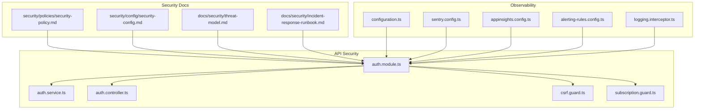
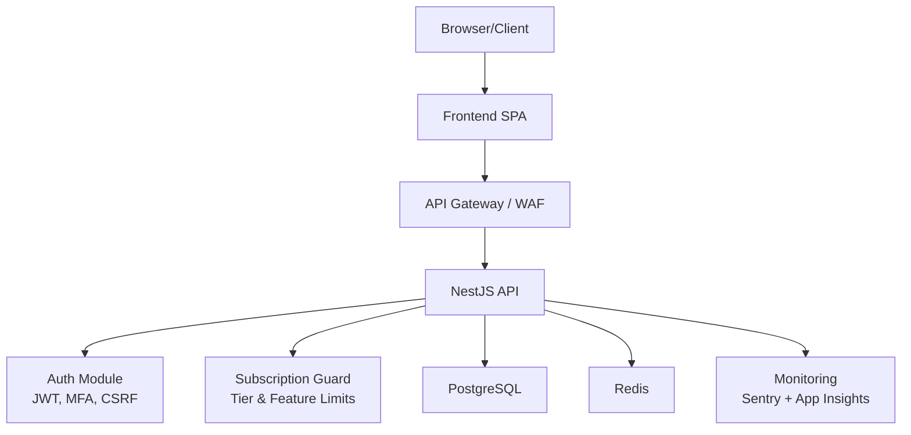
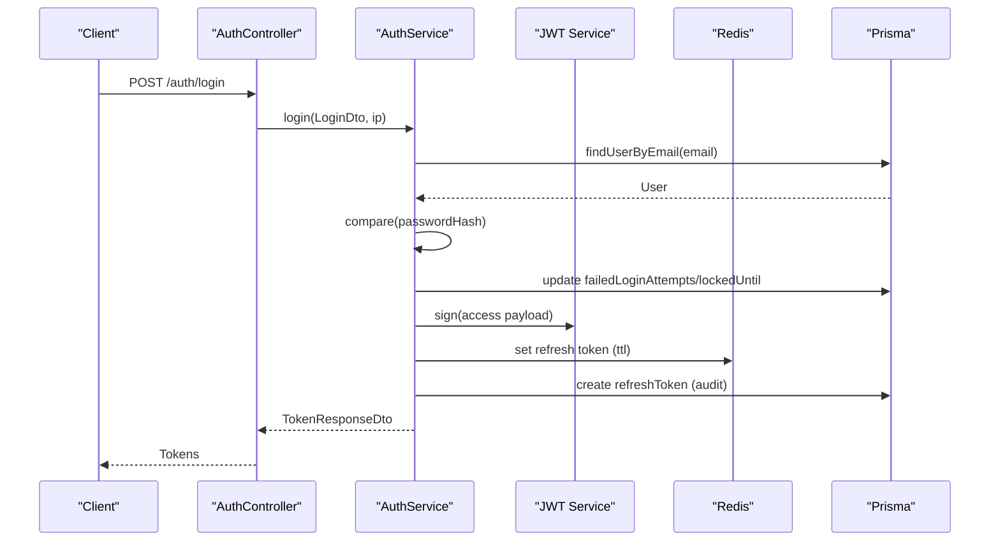
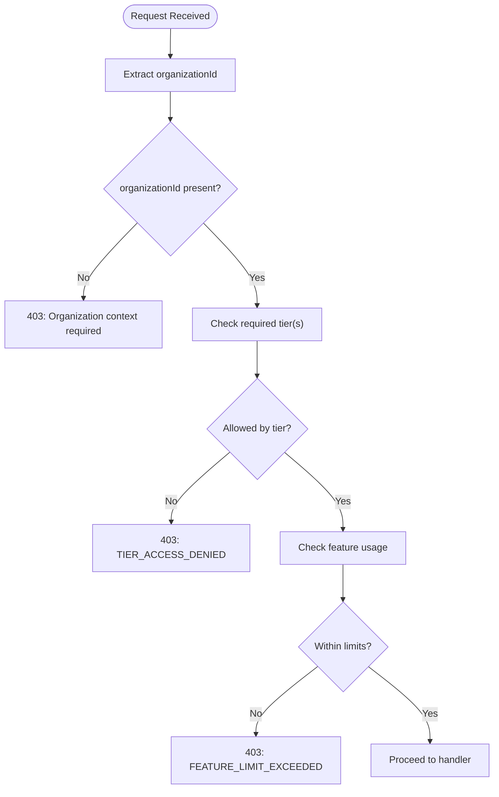
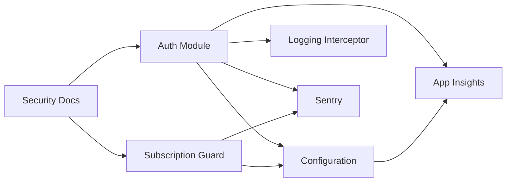

# Security & Compliance

<cite>
**Referenced Files in This Document**
- [security-policy.md](file://security/policies/security-policy.md)
- [security-config.md](file://security/config/security-config.md)
- [threat-model.md](file://docs/security/threat-model.md)
- [incident-response-runbook.md](file://docs/security/incident-response-runbook.md)
- [SECURITY.md](file://SECURITY.md)
- [auth.module.ts](file://apps/api/src/modules/auth/auth.module.ts)
- [auth.service.ts](file://apps/api/src/modules/auth/auth.service.ts)
- [auth.controller.ts](file://apps/api/src/modules/auth/auth.controller.ts)
- [csrf.guard.ts](file://apps/api/src/common/guards/csrf.guard.ts)
- [subscription.guard.ts](file://apps/api/src/common/guards/subscription.guard.ts)
- [configuration.ts](file://apps/api/src/config/configuration.ts)
- [sentry.config.ts](file://apps/api/src/config/sentry.config.ts)
- [appinsights.config.ts](file://apps/api/src/config/appinsights.config.ts)
- [alerting-rules.config.ts](file://apps/api/src/config/alerting-rules.config.ts)
- [logging.interceptor.ts](file://apps/api/src/common/interceptors/logging.interceptor.ts)
</cite>

## Table of Contents
1. [Introduction](#introduction)
2. [Project Structure](#project-structure)
3. [Core Components](#core-components)
4. [Architecture Overview](#architecture-overview)
5. [Detailed Component Analysis](#detailed-component-analysis)
6. [Dependency Analysis](#dependency-analysis)
7. [Performance Considerations](#performance-considerations)
8. [Troubleshooting Guide](#troubleshooting-guide)
9. [Conclusion](#conclusion)
10. [Appendices](#appendices)

## Introduction
This document provides comprehensive security and compliance documentation for Quiz-to-Build. It details the security architecture, threat modeling outcomes, and implemented controls across authentication, authorization, data protection, infrastructure, monitoring, incident response, and compliance frameworks. It also outlines configuration guidelines, testing practices, and risk mitigation strategies derived from the repository’s security artifacts and source code.

## Project Structure
Security and compliance artifacts are organized across:
- Security policy and configuration: security/policies and security/config
- Security documentation: docs/security
- API security modules and guards: apps/api/src/modules/auth and apps/api/src/common/guards
- Configuration and observability: apps/api/src/config
- Interceptors and runtime logging: apps/api/src/common/interceptors

**Diagram sources**
- [security-policy.md:1-54](file://security/policies/security-policy.md#L1-L54)
- [security-config.md:1-93](file://security/config/security-config.md#L1-L93)
- [threat-model.md:1-227](file://docs/security/threat-model.md#L1-L227)
- [incident-response-runbook.md:1-507](file://docs/security/incident-response-runbook.md#L1-L507)
- [auth.module.ts:1-53](file://apps/api/src/modules/auth/auth.module.ts#L1-L53)
- [auth.service.ts:1-507](file://apps/api/src/modules/auth/auth.service.ts#L1-L507)
- [auth.controller.ts:1-171](file://apps/api/src/modules/auth/auth.controller.ts#L1-L171)
- [csrf.guard.ts:1-242](file://apps/api/src/common/guards/csrf.guard.ts#L1-L242)
- [subscription.guard.ts:1-289](file://apps/api/src/common/guards/subscription.guard.ts#L1-L289)
- [configuration.ts:1-115](file://apps/api/src/config/configuration.ts#L1-L115)
- [sentry.config.ts:1-228](file://apps/api/src/config/sentry.config.ts#L1-L228)
- [appinsights.config.ts:1-610](file://apps/api/src/config/appinsights.config.ts#L1-L610)
- [alerting-rules.config.ts:1-772](file://apps/api/src/config/alerting-rules.config.ts#L1-L772)
- [logging.interceptor.ts:1-56](file://apps/api/src/common/interceptors/logging.interceptor.ts#L1-L56)

**Section sources**
- [security-policy.md:1-54](file://security/policies/security-policy.md#L1-L54)
- [security-config.md:1-93](file://security/config/security-config.md#L1-L93)
- [threat-model.md:1-227](file://docs/security/threat-model.md#L1-L227)
- [incident-response-runbook.md:1-507](file://docs/security/incident-response-runbook.md#L1-L507)

## Core Components
- Authentication and Authorization: JWT-based with refresh token rotation, bcrypt password hashing, MFA support, and role-based access control. CSRF protection via double-submit cookie pattern.
- Subscription-based Access Control: Tier-based gating and feature quotas enforced at route level and globally via middleware.
- Observability and Monitoring: Structured logging, Sentry error tracking, Application Insights APM, and configurable alerting rules.
- Security Configuration: Centralized environment validation, rate limiting, JWT configuration, CORS, security headers, and audit logging.

**Section sources**
- [auth.module.ts:1-53](file://apps/api/src/modules/auth/auth.module.ts#L1-L53)
- [auth.service.ts:1-507](file://apps/api/src/modules/auth/auth.service.ts#L1-L507)
- [auth.controller.ts:1-171](file://apps/api/src/modules/auth/auth.controller.ts#L1-L171)
- [csrf.guard.ts:1-242](file://apps/api/src/common/guards/csrf.guard.ts#L1-L242)
- [subscription.guard.ts:1-289](file://apps/api/src/common/guards/subscription.guard.ts#L1-L289)
- [configuration.ts:1-115](file://apps/api/src/config/configuration.ts#L1-L115)
- [sentry.config.ts:1-228](file://apps/api/src/config/sentry.config.ts#L1-L228)
- [appinsights.config.ts:1-610](file://apps/api/src/config/appinsights.config.ts#L1-L610)
- [alerting-rules.config.ts:1-772](file://apps/api/src/config/alerting-rules.config.ts#L1-L772)
- [logging.interceptor.ts:1-56](file://apps/api/src/common/interceptors/logging.interceptor.ts#L1-L56)

## Architecture Overview
The security architecture integrates authentication, authorization, subscription gating, and observability across the API boundary.

**Diagram sources**
- [auth.module.ts:1-53](file://apps/api/src/modules/auth/auth.module.ts#L1-L53)
- [auth.service.ts:1-507](file://apps/api/src/modules/auth/auth.service.ts#L1-L507)
- [auth.controller.ts:1-171](file://apps/api/src/modules/auth/auth.controller.ts#L1-L171)
- [csrf.guard.ts:1-242](file://apps/api/src/common/guards/csrf.guard.ts#L1-L242)
- [subscription.guard.ts:1-289](file://apps/api/src/common/guards/subscription.guard.ts#L1-L289)
- [sentry.config.ts:1-228](file://apps/api/src/config/sentry.config.ts#L1-L228)
- [appinsights.config.ts:1-610](file://apps/api/src/config/appinsights.config.ts#L1-L610)

## Detailed Component Analysis

### Authentication and Authorization
- JWT-based authentication with short-lived access tokens and refresh token rotation stored in Redis with database audit trail.
- Password hashing using bcrypt with configurable rounds.
- CSRF protection via double-submit cookie pattern with constant-time token validation.
- Role-based access control and endpoint-level guards.
- Rate limiting applied to login and general endpoints.

**Diagram sources**
- [auth.controller.ts:47-57](file://apps/api/src/modules/auth/auth.controller.ts#L47-L57)
- [auth.service.ts:104-145](file://apps/api/src/modules/auth/auth.service.ts#L104-L145)
- [auth.module.ts:17-51](file://apps/api/src/modules/auth/auth.module.ts#L17-L51)

**Section sources**
- [auth.module.ts:1-53](file://apps/api/src/modules/auth/auth.module.ts#L1-L53)
- [auth.service.ts:1-507](file://apps/api/src/modules/auth/auth.service.ts#L1-L507)
- [auth.controller.ts:1-171](file://apps/api/src/modules/auth/auth.controller.ts#L1-L171)
- [csrf.guard.ts:1-242](file://apps/api/src/common/guards/csrf.guard.ts#L1-L242)
- [configuration.ts:1-115](file://apps/api/src/config/configuration.ts#L1-L115)

### Subscription-Based Access Control
- Route-level tier gating and feature quota checks.
- Organization-scoped enforcement with middleware attaching subscription metadata.
- Tier-based rate limits and feature matrices.

**Diagram sources**
- [subscription.guard.ts:65-94](file://apps/api/src/common/guards/subscription.guard.ts#L65-L94)

**Section sources**
- [subscription.guard.ts:1-289](file://apps/api/src/common/guards/subscription.guard.ts#L1-L289)

### Security Configuration and Controls
- Environment validation for production secrets and CORS.
- JWT configuration with algorithm, expiration, and refresh rotation.
- Password policy and rate limiting configuration.
- Security headers via Helmet and CORS origin lists.
- Audit logging configuration with retention and excluded paths.

**Section sources**
- [configuration.ts:1-115](file://apps/api/src/config/configuration.ts#L1-L115)
- [security-config.md:1-93](file://security/config/security-config.md#L1-L93)

### Observability and Monitoring
- Structured HTTP logging with correlation IDs.
- Sentry error tracking with beforeSend filtering and transaction sampling.
- Application Insights APM with custom metrics and events.
- Configurable alerting rules for error rates, performance, security, business, and resource metrics.

**Section sources**
- [logging.interceptor.ts:1-56](file://apps/api/src/common/interceptors/logging.interceptor.ts#L1-L56)
- [sentry.config.ts:1-228](file://apps/api/src/config/sentry.config.ts#L1-L228)
- [appinsights.config.ts:1-610](file://apps/api/src/config/appinsights.config.ts#L1-L610)
- [alerting-rules.config.ts:1-772](file://apps/api/src/config/alerting-rules.config.ts#L1-L772)

### Threat Modeling and Risk Mitigations
- STRIDE-based threat model with risk ratings and mitigations for Spoofing, Tampering, Repudiation, Information Disclosure, Denial of Service, and Elevation of Privilege.
- Mitigations include short JWT expiry, refresh token rotation, CSP headers, signed evidence files, append-only decision logs, and tenant isolation.

**Section sources**
- [threat-model.md:1-227](file://docs/security/threat-model.md#L1-L227)

### Incident Response
- Runbook defines severity levels, response phases, roles, and escalation policies.
- Procedures for detection, containment, eradication, recovery, and post-incident review.
- Regulatory requirements for Australian Notifiable Data Breaches.

**Section sources**
- [incident-response-runbook.md:1-507](file://docs/security/incident-response-runbook.md#L1-L507)

## Dependency Analysis
Security and compliance depend on:
- Auth module for JWT, MFA, and CSRF protection.
- Subscription guard for tier and feature gating.
- Configuration module for environment validation and JWT settings.
- Observability modules for error tracking, APM, and alerting.
- Security documentation for policy, configuration, threat model, and incident response.

**Diagram sources**
- [auth.module.ts:1-53](file://apps/api/src/modules/auth/auth.module.ts#L1-L53)
- [subscription.guard.ts:1-289](file://apps/api/src/common/guards/subscription.guard.ts#L1-L289)
- [configuration.ts:1-115](file://apps/api/src/config/configuration.ts#L1-L115)
- [logging.interceptor.ts:1-56](file://apps/api/src/common/interceptors/logging.interceptor.ts#L1-L56)
- [sentry.config.ts:1-228](file://apps/api/src/config/sentry.config.ts#L1-L228)
- [appinsights.config.ts:1-610](file://apps/api/src/config/appinsights.config.ts#L1-L610)
- [security-policy.md:1-54](file://security/policies/security-policy.md#L1-L54)
- [threat-model.md:1-227](file://docs/security/threat-model.md#L1-L227)
- [incident-response-runbook.md:1-507](file://docs/security/incident-response-runbook.md#L1-L507)

**Section sources**
- [auth.module.ts:1-53](file://apps/api/src/modules/auth/auth.module.ts#L1-L53)
- [subscription.guard.ts:1-289](file://apps/api/src/common/guards/subscription.guard.ts#L1-L289)
- [configuration.ts:1-115](file://apps/api/src/config/configuration.ts#L1-L115)
- [logging.interceptor.ts:1-56](file://apps/api/src/common/interceptors/logging.interceptor.ts#L1-L56)
- [sentry.config.ts:1-228](file://apps/api/src/config/sentry.config.ts#L1-L228)
- [appinsights.config.ts:1-610](file://apps/api/src/config/appinsights.config.ts#L1-L610)
- [security-policy.md:1-54](file://security/policies/security-policy.md#L1-L54)
- [threat-model.md:1-227](file://docs/security/threat-model.md#L1-L227)
- [incident-response-runbook.md:1-507](file://docs/security/incident-response-runbook.md#L1-L507)

## Performance Considerations
- Token rotation and Redis-backed refresh tokens reduce long-lived session risks while maintaining performance.
- Rate limiting prevents abuse without impacting legitimate users.
- Application Insights and Sentry sampling balance observability with cost and overhead.
- Subscription-based rate limits scale with tier levels.

[No sources needed since this section provides general guidance]

## Troubleshooting Guide
Common areas to investigate during security incidents or configuration issues:
- Authentication failures and rate-limiting spikes via Sentry and Application Insights.
- CSRF validation errors and missing tokens in logs.
- Subscription tier and feature limit violations surfaced by Subscription Guard.
- Environment validation errors in production startup logs.

**Section sources**
- [sentry.config.ts:1-228](file://apps/api/src/config/sentry.config.ts#L1-L228)
- [appinsights.config.ts:1-610](file://apps/api/src/config/appinsights.config.ts#L1-L610)
- [csrf.guard.ts:1-242](file://apps/api/src/common/guards/csrf.guard.ts#L1-L242)
- [subscription.guard.ts:1-289](file://apps/api/src/common/guards/subscription.guard.ts#L1-L289)
- [configuration.ts:1-115](file://apps/api/src/config/configuration.ts#L1-L115)

## Conclusion
Quiz-to-Build implements a robust security posture grounded in JWT-based authentication, CSRF protection, subscription-driven access control, and comprehensive observability. The STRIDE threat model and incident response runbook provide structured risk management and remediation procedures. Adhering to the documented configuration, policies, and testing practices ensures continued alignment with security and compliance objectives.

[No sources needed since this section summarizes without analyzing specific files]

## Appendices

### Compliance and Regulatory Alignment
- Supported versions and vulnerability reporting aligned with responsible disclosure practices.
- Security measures include authentication, authorization, data protection, infrastructure hardening, and dependency management.
- Compliance references include ISO/IEC 27001, OWASP Top 10, and NIST SSDF practices.

**Section sources**
- [SECURITY.md:1-22](file://SECURITY.md#L1-L22)
- [security-policy.md:1-54](file://security/policies/security-policy.md#L1-L54)

### Security Configuration Guidelines
- Enforce strong JWT secrets and CORS origin lists in production.
- Configure CSRF_SECRET and disable CSRF_DISABLED in production.
- Set bcrypt rounds, JWT expiration, and rate limits per security-config.
- Enable security headers and audit logging with retention policies.

**Section sources**
- [configuration.ts:1-115](file://apps/api/src/config/configuration.ts#L1-L115)
- [security-config.md:1-93](file://security/config/security-config.md#L1-L93)
- [csrf.guard.ts:1-242](file://apps/api/src/common/guards/csrf.guard.ts#L1-L242)

### Security Testing and Assessments
- STRIDE threat modeling completed with mitigations and recommendations.
- Incident response runbook includes detection, containment, eradication, recovery, and review procedures.
- Alerting rules define thresholds and escalation policies for error, performance, security, business, and resource metrics.

**Section sources**
- [threat-model.md:1-227](file://docs/security/threat-model.md#L1-L227)
- [incident-response-runbook.md:1-507](file://docs/security/incident-response-runbook.md#L1-L507)
- [alerting-rules.config.ts:1-772](file://apps/api/src/config/alerting-rules.config.ts#L1-L772)