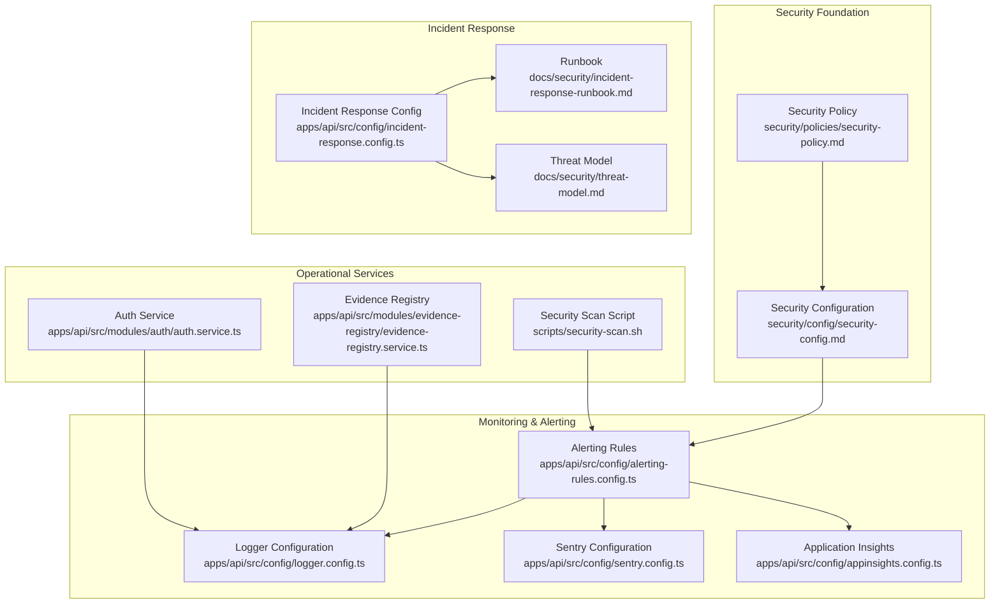
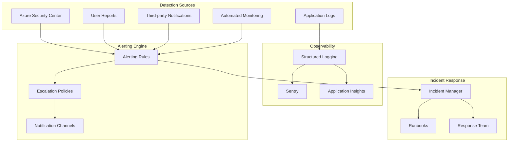
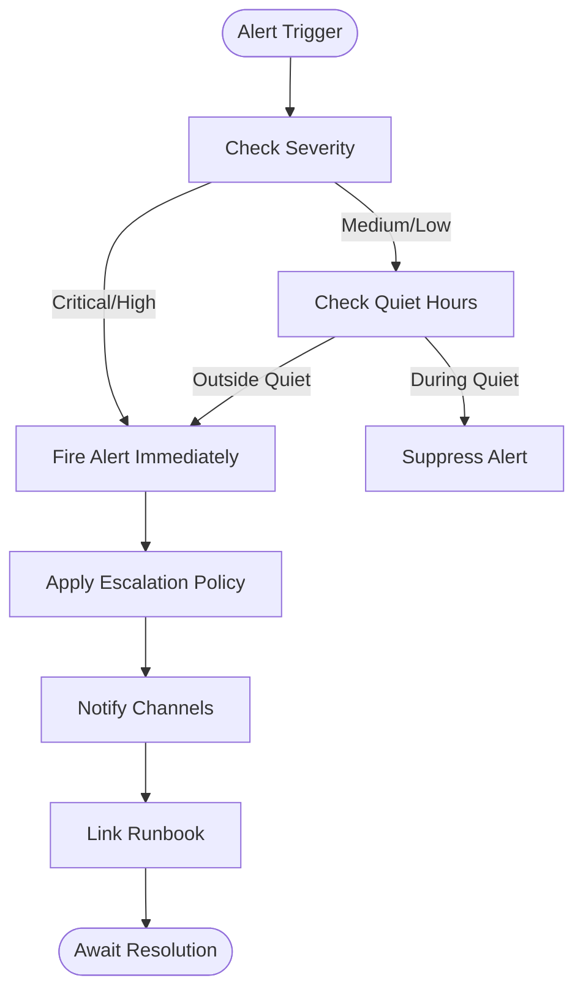
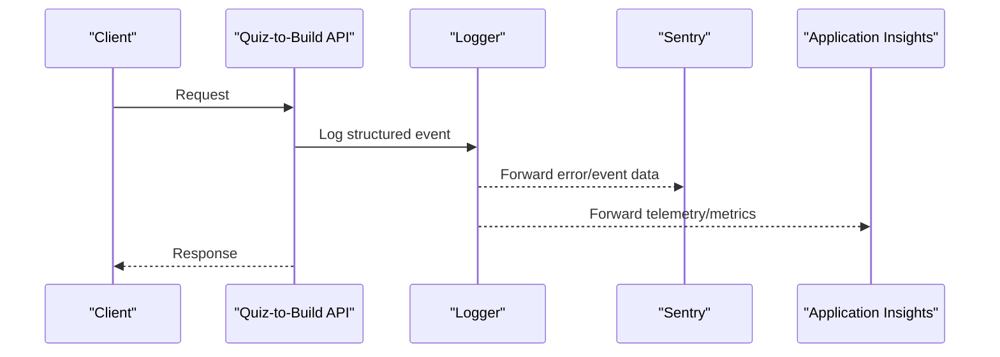
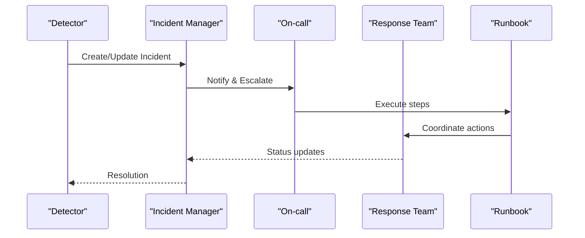
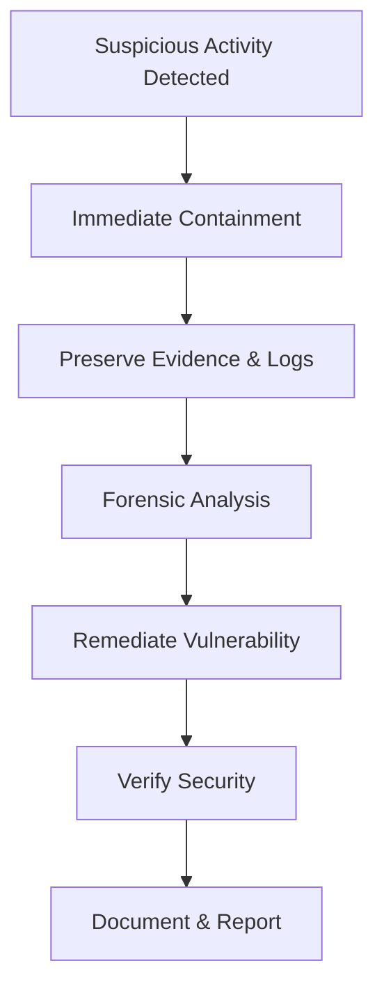
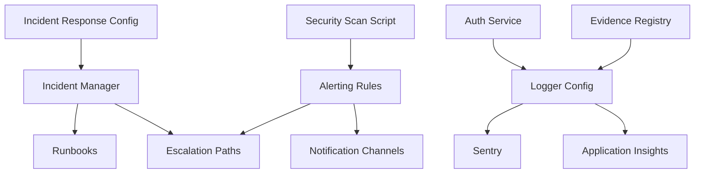

# Security Monitoring & Incident Response

<cite>
**Referenced Files in This Document**
- [security-policy.md](file://security/policies/security-policy.md)
- [security-config.md](file://security/config/security-config.md)
- [incident-response-runbook.md](file://docs/security/incident-response-runbook.md)
- [threat-model.md](file://docs/security/threat-model.md)
- [incident-response.config.ts](file://apps/api/src/config/incident-response.config.ts)
- [alerting-rules.config.ts](file://apps/api/src/config/alerting-rules.config.ts)
- [logger.config.ts](file://apps/api/src/config/logger.config.ts)
- [sentry.config.ts](file://apps/api/src/config/sentry.config.ts)
- [appinsights.config.ts](file://apps/api/src/config/appinsights.config.ts)
- [auth.service.ts](file://apps/api/src/modules/auth/auth.service.ts)
- [evidence-registry.service.ts](file://apps/api/src/modules/evidence-registry/evidence-registry.service.ts)
- [security-scan.sh](file://scripts/security-scan.sh)
</cite>

## Table of Contents
1. [Introduction](#introduction)
2. [Project Structure](#project-structure)
3. [Core Components](#core-components)
4. [Architecture Overview](#architecture-overview)
5. [Detailed Component Analysis](#detailed-component-analysis)
6. [Dependency Analysis](#dependency-analysis)
7. [Performance Considerations](#performance-considerations)
8. [Troubleshooting Guide](#troubleshooting-guide)
9. [Conclusion](#conclusion)

## Introduction
This document provides comprehensive security monitoring and incident response documentation for Quiz-to-Build. It consolidates detection capabilities, log aggregation, SIEM-ready observability, incident response procedures, escalation protocols, communication plans, forensic investigation processes, security metrics, anomaly detection, threat hunting, security orchestration, insider threat detection, user behavior analytics, and post-incident analysis frameworks. The content is derived from the repository's security policies, configuration files, runbooks, and implementation code.

## Project Structure
Security monitoring and incident response capabilities are implemented across three primary areas:
- Security policy and configuration defining guardrails, authentication, authorization, and audit logging
- Application-level monitoring and alerting configuration for error rates, performance, security, business, and resource metrics
- Operational runbooks and incident response automation for detection, containment, eradication, recovery, and postmortems

**Diagram sources**
- [security-policy.md:1-54](file://security/policies/security-policy.md#L1-L54)
- [security-config.md:1-93](file://security/config/security-config.md#L1-L93)
- [alerting-rules.config.ts:1-772](file://apps/api/src/config/alerting-rules.config.ts#L1-L772)
- [logger.config.ts:1-62](file://apps/api/src/config/logger.config.ts#L1-L62)
- [sentry.config.ts:1-228](file://apps/api/src/config/sentry.config.ts#L1-L228)
- [appinsights.config.ts:1-610](file://apps/api/src/config/appinsights.config.ts#L1-L610)
- [incident-response.config.ts:1-1115](file://apps/api/src/config/incident-response.config.ts#L1-L1115)
- [incident-response-runbook.md:1-507](file://docs/security/incident-response-runbook.md#L1-L507)
- [threat-model.md:1-227](file://docs/security/threat-model.md#L1-L227)
- [auth.service.ts:1-507](file://apps/api/src/modules/auth/auth.service.ts#L1-L507)
- [evidence-registry.service.ts:1-953](file://apps/api/src/modules/evidence-registry/evidence-registry.service.ts#L1-L953)
- [security-scan.sh:1-74](file://scripts/security-scan.sh#L1-L74)

**Section sources**
- [security-policy.md:1-54](file://security/policies/security-policy.md#L1-L54)
- [security-config.md:1-93](file://security/config/security-config.md#L1-L93)
- [alerting-rules.config.ts:1-772](file://apps/api/src/config/alerting-rules.config.ts#L1-L772)
- [logger.config.ts:1-62](file://apps/api/src/config/logger.config.ts#L1-L62)
- [sentry.config.ts:1-228](file://apps/api/src/config/sentry.config.ts#L1-L228)
- [appinsights.config.ts:1-610](file://apps/api/src/config/appinsights.config.ts#L1-L610)
- [incident-response.config.ts:1-1115](file://apps/api/src/config/incident-response.config.ts#L1-L1115)
- [incident-response-runbook.md:1-507](file://docs/security/incident-response-runbook.md#L1-L507)
- [threat-model.md:1-227](file://docs/security/threat-model.md#L1-L227)
- [auth.service.ts:1-507](file://apps/api/src/modules/auth/auth.service.ts#L1-L507)
- [evidence-registry.service.ts:1-953](file://apps/api/src/modules/evidence-registry/evidence-registry.service.ts#L1-L953)
- [security-scan.sh:1-74](file://scripts/security-scan.sh#L1-L74)

## Core Components
This section outlines the foundational elements enabling security monitoring and incident response.

- Security Policy and Configuration
  - Authentication: JWT with short-lived access tokens, refresh token rotation, bcrypt hashing, and MFA support
  - Authorization: RBAC, endpoint-level permissions, and rate limiting
  - Data Protection: Encryption at rest, TLS 1.2+, strict log sanitization, and GDPR-aligned PII handling
  - Infrastructure: Azure Container Apps, private VNet, Key Vault, and WAF protection
  - Dependency Management: Dependabot, npm audit, Snyk, and SBOM generation

- Monitoring and Alerting
  - Multi-category alert rules: error rates, performance, security, business, and resource metrics
  - Notification channels: email, Slack, Teams, PagerDuty, SMS, and webhooks
  - Escalation policies: default and critical with configurable delays and auto-escalation
  - Quiet hours logic to suppress low-severity alerts during off-hours

- Observability Integrations
  - Structured logging with correlation IDs and redacted sensitive fields
  - Sentry for error tracking, performance monitoring, and alerting
  - Application Insights for APM, custom metrics, events, and dependency tracking

- Incident Response Automation
  - Severity definitions with response and resolution targets
  - Escalation paths with roles and notification channels
  - Runbooks for production outages, high error rates, security incidents, and database issues
  - Incident manager with auto-escalation timers and status tracking

**Section sources**
- [security-policy.md:18-47](file://security/policies/security-policy.md#L18-L47)
- [security-config.md:3-92](file://security/config/security-config.md#L3-L92)
- [alerting-rules.config.ts:34-478](file://apps/api/src/config/alerting-rules.config.ts#L34-L478)
- [logger.config.ts:9-61](file://apps/api/src/config/logger.config.ts#L9-L61)
- [sentry.config.ts:35-127](file://apps/api/src/config/sentry.config.ts#L35-L127)
- [appinsights.config.ts:35-117](file://apps/api/src/config/appinsights.config.ts#L35-L117)
- [incident-response.config.ts:136-238](file://apps/api/src/config/incident-response.config.ts#L136-L238)

## Architecture Overview
The security monitoring and incident response architecture integrates policy-driven guardrails with application-level observability and automated runbooks.

**Diagram sources**
- [incident-response-runbook.md:80-85](file://docs/security/incident-response-runbook.md#L80-L85)
- [alerting-rules.config.ts:61-478](file://apps/api/src/config/alerting-rules.config.ts#L61-L478)
- [logger.config.ts:9-61](file://apps/api/src/config/logger.config.ts#L9-L61)
- [sentry.config.ts:35-127](file://apps/api/src/config/sentry.config.ts#L35-L127)
- [appinsights.config.ts:35-117](file://apps/api/src/config/appinsights.config.ts#L35-L117)
- [incident-response.config.ts:863-1057](file://apps/api/src/config/incident-response.config.ts#L863-L1057)

## Detailed Component Analysis

### Security Event Detection and Alerting
- Alert categories and thresholds:
  - Error rates: high error rate, HTTP 5xx spikes, unhandled exceptions
  - Performance: response time thresholds, slow database queries, request latency, throughput drops
  - Security: high authentication failures, unauthorized access attempts, suspicious IP activity, JWT anomalies, rate limit exceeded
  - Business: questionnaire completion drops, payment failures, document generation failures, no active users during business hours
  - Resources: CPU/memory usage, disk usage, database connection pool exhaustion, Redis memory pressure
- Notification channels and escalation:
  - Critical alerts always fire; high alerts fire except during quiet hours
  - Default and critical escalation policies define multi-level notifications and auto-escalation timing
- Runbook linkage:
  - Alert rules include runbook references for rapid triage and remediation

**Diagram sources**
- [alerting-rules.config.ts:61-478](file://apps/api/src/config/alerting-rules.config.ts#L61-L478)
- [alerting-rules.config.ts:728-740](file://apps/api/src/config/alerting-rules.config.ts#L728-L740)

**Section sources**
- [alerting-rules.config.ts:85-478](file://apps/api/src/config/alerting-rules.config.ts#L85-L478)

### Log Aggregation and SIEM Readiness
- Structured logging:
  - JSON output in production, pretty-print in development
  - Correlation IDs via X-Request-Id header
  - Redaction of sensitive headers and cookies
- Observability integrations:
  - Sentry for error tracking, performance monitoring, and alerting
  - Application Insights for APM, custom metrics, events, and dependency tracking
- Audit logging:
  - Enabled with retention and specific event types
  - Excludes health endpoints from audit logging

**Diagram sources**
- [logger.config.ts:9-61](file://apps/api/src/config/logger.config.ts#L9-L61)
- [sentry.config.ts:35-127](file://apps/api/src/config/sentry.config.ts#L35-L127)
- [appinsights.config.ts:35-117](file://apps/api/src/config/appinsights.config.ts#L35-L117)

**Section sources**
- [logger.config.ts:9-61](file://apps/api/src/config/logger.config.ts#L9-L61)
- [sentry.config.ts:35-127](file://apps/api/src/config/sentry.config.ts#L35-L127)
- [appinsights.config.ts:35-117](file://apps/api/src/config/appinsights.config.ts#L35-L117)
- [security-config.md:77-92](file://security/config/security-config.md#L77-L92)

### Incident Response Procedures and Orchestration
- Severity levels and impact metrics:
  - SEV1–SEV4 with response and resolution targets, examples, and impact categories
- Escalation paths:
  - Multi-level escalation with roles, channels, and auto-escalation timers
- Runbooks:
  - Production outage, high error rate, security incident, and database issues
  - Automated steps, verification checkpoints, and post-incident actions
- Incident manager:
  - Lifecycle tracking, auto-escalation timers, and applicable runbook selection

**Diagram sources**
- [incident-response.config.ts:863-1057](file://apps/api/src/config/incident-response.config.ts#L863-L1057)
- [incident-response-runbook.md:113-281](file://docs/security/incident-response-runbook.md#L113-L281)

**Section sources**
- [incident-response.config.ts:136-331](file://apps/api/src/config/incident-response.config.ts#L136-L331)
- [incident-response-runbook.md:45-281](file://docs/security/incident-response-runbook.md#L45-L281)

### Forensic Investigation and Evidence Preservation
- Evidence registry:
  - SHA-256 integrity verification, immutable storage, and verification workflows
  - MIME type validation and file size limits
- Authentication and session security:
  - JWT short expiry, refresh token rotation, Redis-backed refresh tokens, and failed login handling
- Forensic readiness:
  - Preserving logs, snapshots, and forensic data before remediation
  - Runbook steps for containment, evidence preservation, and legal/compliance notification

**Diagram sources**
- [incident-response-runbook.md:568-667](file://docs/security/incident-response-runbook.md#L568-L667)
- [evidence-registry.service.ts:165-200](file://apps/api/src/modules/evidence-registry/evidence-registry.service.ts#L165-L200)
- [auth.service.ts:104-183](file://apps/api/src/modules/auth/auth.service.ts#L104-L183)

**Section sources**
- [evidence-registry.service.ts:100-156](file://apps/api/src/modules/evidence-registry/evidence-registry.service.ts#L100-L156)
- [auth.service.ts:104-183](file://apps/api/src/modules/auth/auth.service.ts#L104-L183)
- [incident-response-runbook.md:568-667](file://docs/security/incident-response-runbook.md#L568-L667)

### Insider Threat Detection and User Behavior Analytics
- Authentication security:
  - Failed login attempts tracking, account lockout, and Redis-backed refresh tokens
  - JWT short expiry and rotation to reduce session lifetime risks
- Behavioral indicators:
  - Suspicious IP activity, unauthorized access attempts, and rate limit exceeded alerts
- Mitigations:
  - Account lockout policies, rate limiting, and session management
  - Audit logging for authentication and authorization events

**Section sources**
- [auth.service.ts:113-140](file://apps/api/src/modules/auth/auth.service.ts#L113-L140)
- [alerting-rules.config.ts:266-307](file://apps/api/src/config/alerting-rules.config.ts#L266-L307)
- [security-config.md:77-92](file://security/config/security-config.md#L77-L92)

### Security Metrics Collection and Anomaly Detection
- Metrics:
  - Error rate percentage, HTTP 5xx/4xx errors, response time percentiles, throughput, and database/query performance
  - Business KPIs: questionnaire completion rate, payment failures, document generation failures
  - Resource utilization: CPU, memory, disk, database connection pools, Redis memory
- Anomaly detection:
  - Threshold-based alerts with durations and severity levels
  - Quiet hours suppression for lower severities
- Continuous improvement:
  - Threat model with STRIDE analysis and risk ratings
  - Recommendations for immediate, short-term, and long-term actions

**Section sources**
- [alerting-rules.config.ts:85-478](file://apps/api/src/config/alerting-rules.config.ts#L85-L478)
- [threat-model.md:115-188](file://docs/security/threat-model.md#L115-L188)

### Automated Response Capabilities
- Auto-escalation:
  - Timers trigger next escalation level based on configured delays
- Runbook automation:
  - Step-based runbooks with automatable actions and verification checkpoints
- Observability automation:
  - Structured logging, Sentry, and Application Insights integration for automatic error and performance capture

**Section sources**
- [incident-response.config.ts:1006-1021](file://apps/api/src/config/incident-response.config.ts#L1006-L1021)
- [incident-response-runbook.md:340-382](file://docs/security/incident-response-runbook.md#L340-L382)
- [logger.config.ts:9-61](file://apps/api/src/config/logger.config.ts#L9-L61)
- [sentry.config.ts:35-127](file://apps/api/src/config/sentry.config.ts#L35-L127)
- [appinsights.config.ts:35-117](file://apps/api/src/config/appinsights.config.ts#L35-L117)

### Communication Plans and Post-Incident Analysis
- Communication templates:
  - Initial, update, resolution, and postmortem templates for internal and external stakeholders
- Regulatory compliance:
  - Notifiable Data Breach reporting framework aligned with Australian privacy regulations
- Post-incident review:
  - Timeline documentation, impact assessment, root cause analysis, effectiveness review, action items, and lessons learned

**Section sources**
- [incident-response-runbook.md:337-407](file://docs/security/incident-response-runbook.md#L337-L407)
- [incident-response-runbook.md:284-327](file://docs/security/incident-response-runbook.md#L284-L327)

## Dependency Analysis
The security monitoring and incident response system exhibits clear separation of concerns with strong coupling to observability and alerting.

**Diagram sources**
- [incident-response.config.ts:863-1057](file://apps/api/src/config/incident-response.config.ts#L863-L1057)
- [alerting-rules.config.ts:61-478](file://apps/api/src/config/alerting-rules.config.ts#L61-L478)
- [logger.config.ts:9-61](file://apps/api/src/config/logger.config.ts#L9-L61)
- [sentry.config.ts:35-127](file://apps/api/src/config/sentry.config.ts#L35-L127)
- [appinsights.config.ts:35-117](file://apps/api/src/config/appinsights.config.ts#L35-L117)
- [auth.service.ts:1-507](file://apps/api/src/modules/auth/auth.service.ts#L1-L507)
- [evidence-registry.service.ts:1-953](file://apps/api/src/modules/evidence-registry/evidence-registry.service.ts#L1-L953)
- [security-scan.sh:1-74](file://scripts/security-scan.sh#L1-L74)

**Section sources**
- [incident-response.config.ts:863-1057](file://apps/api/src/config/incident-response.config.ts#L863-L1057)
- [alerting-rules.config.ts:61-478](file://apps/api/src/config/alerting-rules.config.ts#L61-L478)
- [logger.config.ts:9-61](file://apps/api/src/config/logger.config.ts#L9-L61)
- [sentry.config.ts:35-127](file://apps/api/src/config/sentry.config.ts#L35-L127)
- [appinsights.config.ts:35-117](file://apps/api/src/config/appinsights.config.ts#L35-L117)
- [auth.service.ts:1-507](file://apps/api/src/modules/auth/auth.service.ts#L1-L507)
- [evidence-registry.service.ts:1-953](file://apps/api/src/modules/evidence-registry/evidence-registry.service.ts#L1-L953)
- [security-scan.sh:1-74](file://scripts/security-scan.sh#L1-L74)

## Performance Considerations
- Sampling and cost optimization:
  - Application Insights sampling percentage tuned for production to balance cost and observability
- Alert fatigue reduction:
  - Quiet hours suppression for lower severities and inhibition rules to avoid redundant notifications
- Scalability:
  - Rate limiting and WAF protection to mitigate DoS and protect downstream systems

[No sources needed since this section provides general guidance]

## Troubleshooting Guide
- Alert configuration issues:
  - Verify alert categories, thresholds, and durations; confirm escalation policies and notification channels
- Logging and redaction:
  - Ensure sensitive fields are redacted and correlation IDs propagate across services
- Sentry and Application Insights:
  - Confirm DSN/connection strings and environment configuration; validate beforeSend and beforeSendTransaction filters
- Security scans:
  - Use the security scan script to validate Docker images for CVEs, root user execution, and sensitive files

**Section sources**
- [alerting-rules.config.ts:690-740](file://apps/api/src/config/alerting-rules.config.ts#L690-L740)
- [logger.config.ts:27-31](file://apps/api/src/config/logger.config.ts#L27-L31)
- [sentry.config.ts:35-127](file://apps/api/src/config/sentry.config.ts#L35-L127)
- [appinsights.config.ts:35-117](file://apps/api/src/config/appinsights.config.ts#L35-L117)
- [security-scan.sh:27-62](file://scripts/security-scan.sh#L27-L62)

## Conclusion
Quiz-to-Build implements a robust security monitoring and incident response framework combining policy-driven guardrails, comprehensive alerting, SIEM-ready observability, and automated runbooks. The system supports scalable detection, rapid escalation, forensic readiness, and continuous improvement through post-incident analysis. By leveraging structured logging, Sentry, Application Insights, and well-defined runbooks, the platform maintains strong security posture while enabling efficient incident handling.