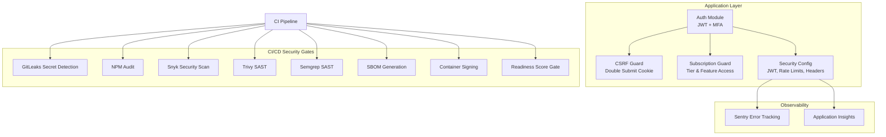
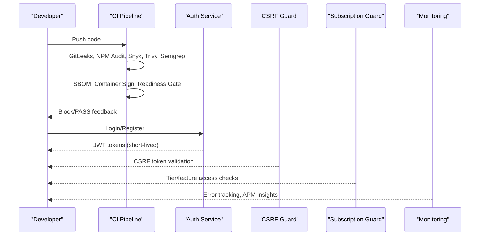
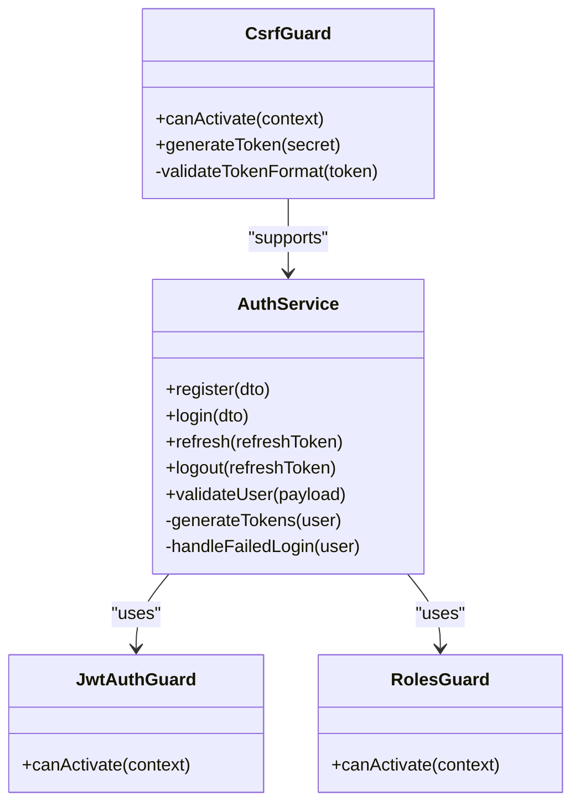
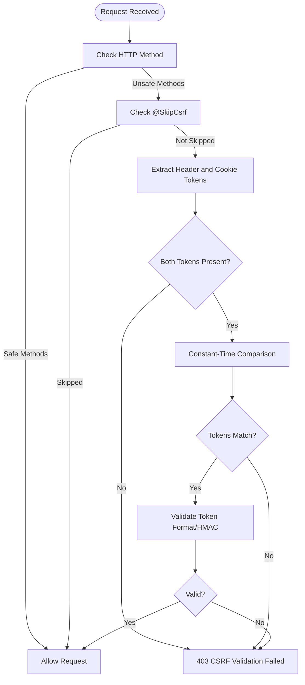
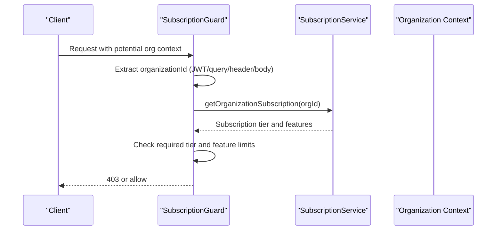
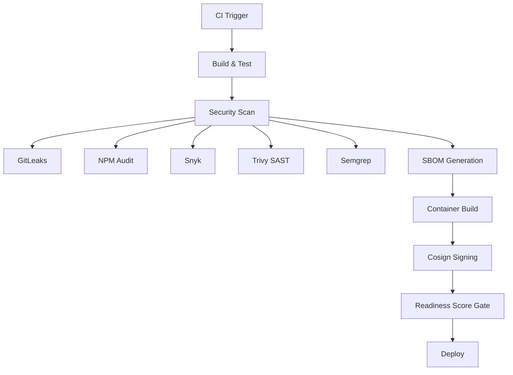
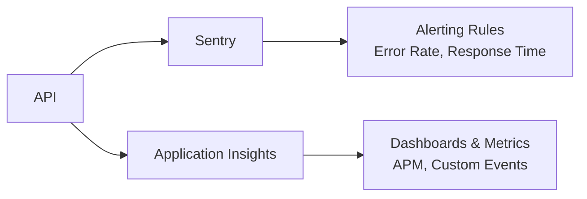
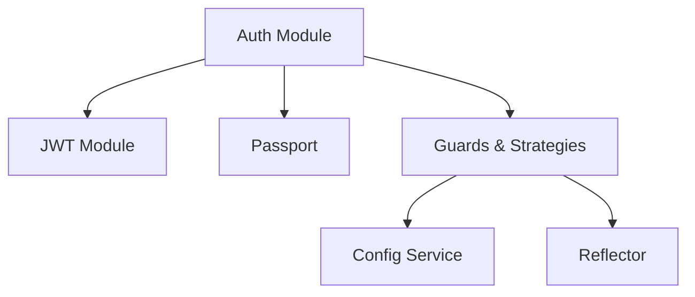

# Security Overview

<cite>
**Referenced Files in This Document**
- [security-policy.md](file://security/policies/security-policy.md)
- [security-config.md](file://security/config/security-config.md)
- [SECURITY.md](file://SECURITY.md)
- [final-readiness-report.md](file://docs/compliance/final-readiness-report.md)
- [completeness-checklist.md](file://docs/compliance/completeness-checklist.md)
- [auth.module.ts](file://apps/api/src/modules/auth/auth.module.ts)
- [auth.service.ts](file://apps/api/src/modules/auth/auth.service.ts)
- [csrf.guard.ts](file://apps/api/src/common/guards/csrf.guard.ts)
- [subscription.guard.ts](file://apps/api/src/common/guards/subscription.guard.ts)
- [security-scan.sh](file://scripts/security-scan.sh)
- [azure-pipelines.yml](file://azure-pipelines.yml)
- [sentry.config.ts](file://apps/api/src/config/sentry.config.ts)
- [appinsights.config.ts](file://apps/api/src/config/appinsights.config.ts)
</cite>

## Table of Contents
1. [Introduction](#introduction)
2. [Project Structure](#project-structure)
3. [Core Components](#core-components)
4. [Architecture Overview](#architecture-overview)
5. [Detailed Component Analysis](#detailed-component-analysis)
6. [Dependency Analysis](#dependency-analysis)
7. [Performance Considerations](#performance-considerations)
8. [Troubleshooting Guide](#troubleshooting-guide)
9. [Conclusion](#conclusion)
10. [Appendices](#appendices)

## Introduction
This document provides a comprehensive security overview for Quiz-to-Build, covering the overall security architecture, policies, governance model, roles and responsibilities, decision-making processes, objectives, risk tolerance, compliance requirements, control implementations, monitoring approach, security culture, training, awareness programs, metrics, reporting, and continuous improvement processes. It synthesizes security artifacts from the repository to present a practical and actionable security posture aligned with the platform’s development and deployment lifecycle.

## Project Structure
Security in Quiz-to-Build is implemented across three primary layers:
- Application-level controls: Authentication, authorization, CSRF protection, subscription-based access enforcement, and secure configuration.
- CI/CD security gates: Automated scanning, secret detection, SBOM generation, container signing, and readiness score validation.
- Observability and monitoring: Error tracking, performance monitoring, and alerting rules.

**Diagram sources**
- [auth.module.ts:1-53](file://apps/api/src/modules/auth/auth.module.ts#L1-L53)
- [csrf.guard.ts:1-242](file://apps/api/src/common/guards/csrf.guard.ts#L1-L242)
- [subscription.guard.ts:1-289](file://apps/api/src/common/guards/subscription.guard.ts#L1-L289)
- [security-config.md:1-93](file://security/config/security-config.md#L1-L93)
- [azure-pipelines.yml:350-540](file://azure-pipelines.yml#L350-L540)
- [sentry.config.ts:1-228](file://apps/api/src/config/sentry.config.ts#L1-L228)
- [appinsights.config.ts:1-610](file://apps/api/src/config/appinsights.config.ts#L1-L610)

**Section sources**
- [security-policy.md:1-54](file://security/policies/security-policy.md#L1-L54)
- [security-config.md:1-93](file://security/config/security-config.md#L1-L93)
- [azure-pipelines.yml:350-540](file://azure-pipelines.yml#L350-L540)

## Core Components
- Authentication and Authorization: JWT-based with short-lived access tokens, refresh token rotation, bcrypt password hashing, and MFA support. Role-based access control (RBAC) and endpoint-level permission checks are enforced.
- CSRF Protection: Double submit cookie pattern with constant-time token validation and strict SameSite configuration.
- Subscription-Based Access Control: Tier-based and feature-based gating with dynamic rate limits and usage tracking.
- Infrastructure Security: Managed identities, private networking, secrets management via Key Vault, and WAF protection.
- Dependency and Supply Chain Security: Automated Dependabot updates, npm audit, Snyk scanning, and SBOM generation.
- Observability: Sentry for error tracking and performance monitoring, Application Insights for APM, with alerting rules and filtering of sensitive data.

**Section sources**
- [auth.module.ts:1-53](file://apps/api/src/modules/auth/auth.module.ts#L1-L53)
- [auth.service.ts:1-507](file://apps/api/src/modules/auth/auth.service.ts#L1-L507)
- [csrf.guard.ts:1-242](file://apps/api/src/common/guards/csrf.guard.ts#L1-L242)
- [subscription.guard.ts:1-289](file://apps/api/src/common/guards/subscription.guard.ts#L1-L289)
- [security-policy.md:18-54](file://security/policies/security-policy.md#L18-L54)
- [security-config.md:3-93](file://security/config/security-config.md#L3-L93)
- [azure-pipelines.yml:350-540](file://azure-pipelines.yml#L350-L540)
- [sentry.config.ts:1-228](file://apps/api/src/config/sentry.config.ts#L1-L228)
- [appinsights.config.ts:1-610](file://apps/api/src/config/appinsights.config.ts#L1-L610)

## Architecture Overview
The security architecture integrates runtime protections with CI/CD gates and observability to form a defense-in-depth strategy. The CI pipeline enforces blocking gates for secrets, dependencies, SAST, SBOM, container signing, and readiness score thresholds. Application-level controls enforce authentication, authorization, and access governance, while monitoring systems provide visibility and alerting.

**Diagram sources**
- [azure-pipelines.yml:350-540](file://azure-pipelines.yml#L350-L540)
- [auth.service.ts:104-145](file://apps/api/src/modules/auth/auth.service.ts#L104-L145)
- [csrf.guard.ts:66-148](file://apps/api/src/common/guards/csrf.guard.ts#L66-L148)
- [subscription.guard.ts:57-94](file://apps/api/src/common/guards/subscription.guard.ts#L57-L94)
- [sentry.config.ts:51-127](file://apps/api/src/config/sentry.config.ts#L51-L127)
- [appinsights.config.ts:65-117](file://apps/api/src/config/appinsights.config.ts#L65-L117)

## Detailed Component Analysis

### Authentication and Authorization
- JWT configuration supports HS256 with 15-minute access token expiration and 7-day refresh tokens with rotation.
- Password hashing uses bcrypt with configurable rounds.
- MFA support is integrated via the auth module.
- RBAC and endpoint-level permission checks are enforced by guards.
- Rate limiting distinguishes general, login, and authenticated API limits.

**Diagram sources**
- [auth.service.ts:37-507](file://apps/api/src/modules/auth/auth.service.ts#L37-L507)
- [auth.module.ts:17-51](file://apps/api/src/modules/auth/auth.module.ts#L17-L51)
- [csrf.guard.ts:47-190](file://apps/api/src/common/guards/csrf.guard.ts#L47-L190)

**Section sources**
- [auth.module.ts:1-53](file://apps/api/src/modules/auth/auth.module.ts#L1-L53)
- [auth.service.ts:104-145](file://apps/api/src/modules/auth/auth.service.ts#L104-L145)
- [security-config.md:19-41](file://security/config/security-config.md#L19-L41)

### CSRF Protection
- Implements the double submit cookie pattern with strict SameSite configuration and constant-time token comparison.
- Tokens include embedded HMAC validation and are generated server-side.
- Environment-specific behavior enforces CSRF_SECRET requirement in production.

**Diagram sources**
- [csrf.guard.ts:66-148](file://apps/api/src/common/guards/csrf.guard.ts#L66-L148)

**Section sources**
- [csrf.guard.ts:1-242](file://apps/api/src/common/guards/csrf.guard.ts#L1-L242)

### Subscription-Based Access Control
- Enforces tier-based access using route decorators and extracts organization context from multiple sources.
- Implements feature-based gating with usage calculations and dynamic rate limits per tier.
- Provides middleware for attaching subscription metadata and exposing usage headers.

**Diagram sources**
- [subscription.guard.ts:65-94](file://apps/api/src/common/guards/subscription.guard.ts#L65-L94)
- [subscription.guard.ts:128-174](file://apps/api/src/common/guards/subscription.guard.ts#L128-L174)

**Section sources**
- [subscription.guard.ts:1-289](file://apps/api/src/common/guards/subscription.guard.ts#L1-L289)

### CI/CD Security Gates and Supply Chain Security
- Secret detection (GitLeaks), dependency scanning (npm audit, Snyk), SAST (Trivy, Semgrep), SBOM generation, container signing (Sigstore Cosign), and provenance attestation are implemented as blocking gates.
- Readiness Score Gate enforces a minimum score and absence of critical red cells.

**Diagram sources**
- [azure-pipelines.yml:350-540](file://azure-pipelines.yml#L350-L540)
- [security-scan.sh:1-74](file://scripts/security-scan.sh#L1-L74)

**Section sources**
- [azure-pipelines.yml:350-540](file://azure-pipelines.yml#L350-L540)
- [security-scan.sh:1-74](file://scripts/security-scan.sh#L1-L74)

### Observability and Monitoring
- Sentry captures exceptions, filters sensitive data, and applies alerting rules with error rate and response time thresholds.
- Application Insights provides APM with custom metrics, events, and dependency tracking, including readiness score and questionnaire metrics.

**Diagram sources**
- [sentry.config.ts:51-127](file://apps/api/src/config/sentry.config.ts#L51-L127)
- [appinsights.config.ts:65-117](file://apps/api/src/config/appinsights.config.ts#L65-L117)

**Section sources**
- [sentry.config.ts:1-228](file://apps/api/src/config/sentry.config.ts#L1-L228)
- [appinsights.config.ts:1-610](file://apps/api/src/config/appinsights.config.ts#L1-L610)

## Dependency Analysis
- Auth module imports JWT and Passport, registers strategies and guards, and exports them for use across the application.
- Guards depend on configuration services and reflect metadata for route-level enforcement.
- CI pipeline stages depend on each other, ensuring security gates precede infrastructure and deployment stages.

**Diagram sources**
- [auth.module.ts:17-51](file://apps/api/src/modules/auth/auth.module.ts#L17-L51)

**Section sources**
- [auth.module.ts:1-53](file://apps/api/src/modules/auth/auth.module.ts#L1-L53)
- [azure-pipelines.yml:39-718](file://azure-pipelines.yml#L39-L718)

## Performance Considerations
- Token rotation and refresh token storage in Redis reduce long-lived session risks while maintaining usability.
- Rate limiting and tier-based quotas prevent abuse and ensure fair resource allocation.
- Monitoring sampling rates balance cost and observability (e.g., 75% sampling in production).

[No sources needed since this section provides general guidance]

## Troubleshooting Guide
- CSRF failures: Verify presence of both cookie and header tokens, ensure SameSite configuration, and confirm token format validation.
- Authentication errors: Confirm JWT expiration, refresh token rotation, and bcrypt rounds configuration.
- Subscription access denials: Validate organization context extraction and tier/feature limits.
- CI gate failures: Review secret detection, dependency audit, SAST findings, SBOM generation, and readiness score thresholds.

**Section sources**
- [csrf.guard.ts:95-148](file://apps/api/src/common/guards/csrf.guard.ts#L95-L148)
- [auth.service.ts:147-183](file://apps/api/src/modules/auth/auth.service.ts#L147-L183)
- [subscription.guard.ts:128-174](file://apps/api/src/common/guards/subscription.guard.ts#L128-L174)
- [azure-pipelines.yml:350-540](file://azure-pipelines.yml#L350-L540)

## Conclusion
Quiz-to-Build implements a robust, layered security approach integrating strong authentication and authorization, CSRF protection, subscription-based access control, comprehensive CI/CD security gates, and production-grade observability. The platform’s security posture is validated by documented policies, configuration baselines, automated scanning, and readiness assessments, supporting enterprise-grade deployment and ongoing compliance.

[No sources needed since this section summarizes without analyzing specific files]

## Appendices

### Security Objectives and Risk Tolerance
- Objectives: Prevent unauthorized access, protect sensitive data, maintain system integrity, ensure supply chain security, and meet compliance requirements.
- Risk Tolerance: Critical and high-risk findings block deployment; readiness score gates enforce minimum coverage thresholds.

**Section sources**
- [security-policy.md:49-54](file://security/policies/security-policy.md#L49-L54)
- [final-readiness-report.md:66-78](file://docs/compliance/final-readiness-report.md#L66-L78)

### Security Policies and Compliance
- Policies define supported versions, vulnerability reporting, and security measures across authentication, authorization, data protection, infrastructure, and dependency management.
- Compliance mapping includes ISO 27001, NIST CSF, OWASP Top 10, and SOC 2 Type II.

**Section sources**
- [security-policy.md:1-54](file://security/policies/security-policy.md#L1-L54)
- [final-readiness-report.md:90-101](file://docs/compliance/final-readiness-report.md#L90-L101)

### Security Governance and Decision-Making
- Architecture Decision Records (ADRs) formalize security decisions (authentication/authorization, secrets management, data residency, multi-tenancy, key rotation).
- Readiness score gates and critical cell checks guide deployment decisions.

**Section sources**
- [final-readiness-report.md:102-112](file://docs/compliance/final-readiness-report.md#L102-L112)
- [completeness-checklist.md:133-143](file://docs/compliance/completeness-checklist.md#L133-L143)

### Security Controls Implementation Overview
- Authentication: JWT + Auth0 with MFA, bcrypt hashing, refresh token rotation.
- Authorization: RBAC, endpoint-level checks, rate limiting.
- Data Protection: TLS 1.3 in transit, AES-256 at rest, GDPR-aligned PII handling.
- Infrastructure: Managed identities, private VNet, Key Vault, WAF.
- Dependencies: Dependabot, npm audit, Snyk, SBOM.

**Section sources**
- [security-policy.md:18-47](file://security/policies/security-policy.md#L18-L47)
- [final-readiness-report.md:79-87](file://docs/compliance/final-readiness-report.md#L79-L87)

### Security Monitoring Approach
- Sentry: Error tracking, performance monitoring, alerting rules, sensitive data filtering.
- Application Insights: APM, custom metrics/events, dependency tracking, readiness and questionnaire metrics.

**Section sources**
- [sentry.config.ts:194-216](file://apps/api/src/config/sentry.config.ts#L194-L216)
- [appinsights.config.ts:130-330](file://apps/api/src/config/appinsights.config.ts#L130-L330)

### Security Culture, Training, and Awareness
- CI/CD gates embed security into development workflows.
- Readiness assessments and heatmaps promote continuous improvement and awareness of security gaps.

**Section sources**
- [azure-pipelines.yml:434-540](file://azure-pipelines.yml#L434-L540)
- [final-readiness-report.md:115-146](file://docs/compliance/final-readiness-report.md#L115-L146)

### Security Metrics, Reporting, and Continuous Improvement
- Metrics: Readiness score, critical red cells, error rates, response times, feature usage, and questionnaire completion.
- Reporting: Automated score reports, CI artifacts, and compliance summaries.
- Improvement: Regression tests, performance gates, and remediation of critical dimensions.

**Section sources**
- [final-readiness-report.md:149-174](file://docs/compliance/final-readiness-report.md#L149-L174)
- [azure-pipelines.yml:546-598](file://azure-pipelines.yml#L546-L598)