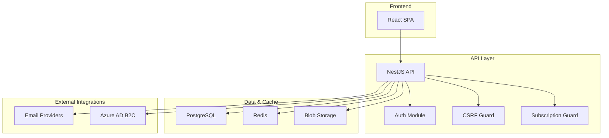
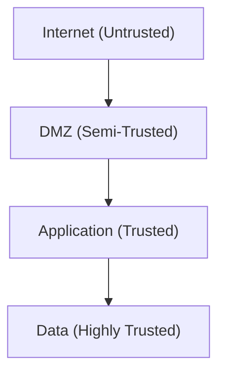
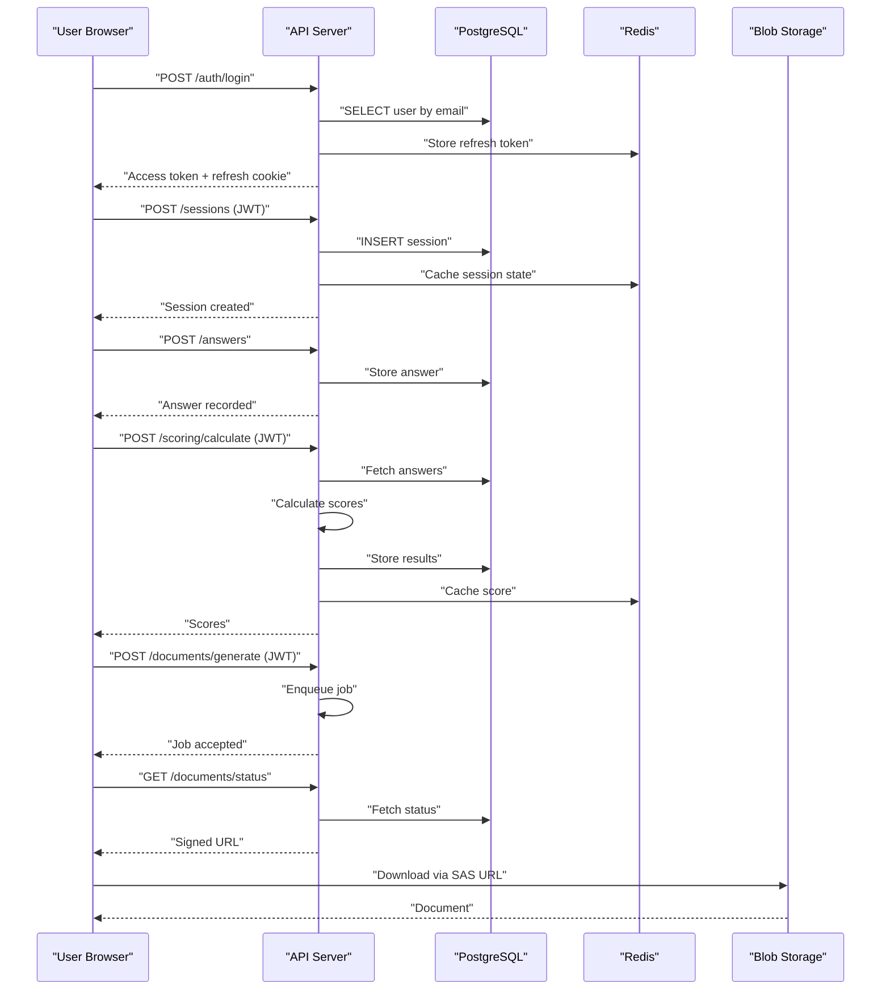
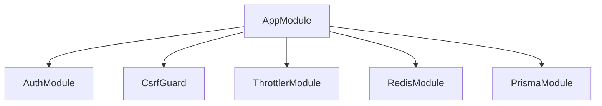

# Threat Modeling & Risk Assessment

<cite>
**Referenced Files in This Document**
- [threat-model.md](file://docs/security/threat-model.md)
- [security-policy.md](file://security/policies/security-policy.md)
- [security-config.md](file://security/config/security-config.md)
- [data-flow-trust-boundaries.md](file://docs/architecture/data-flow-trust-boundaries.md)
- [app.module.ts](file://apps/api/src/app.module.ts)
- [auth.module.ts](file://apps/api/src/modules/auth/auth.module.ts)
- [auth.service.ts](file://apps/api/src/modules/auth/auth.service.ts)
- [csrf.guard.ts](file://apps/api/src/common/guards/csrf.guard.ts)
- [subscription.guard.ts](file://apps/api/src/common/guards/subscription.guard.ts)
- [configuration.ts](file://apps/api/src/config/configuration.ts)
- [notification.service.ts](file://apps/api/src/modules/notifications/notification.service.ts)
</cite>

## Table of Contents
1. [Introduction](#introduction)
2. [Project Structure](#project-structure)
3. [Core Components](#core-components)
4. [Architecture Overview](#architecture-overview)
5. [Detailed Component Analysis](#detailed-component-analysis)
6. [Dependency Analysis](#dependency-analysis)
7. [Performance Considerations](#performance-considerations)
8. [Troubleshooting Guide](#troubleshooting-guide)
9. [Conclusion](#conclusion)
10. [Appendices](#appendices)

## Introduction
This document provides a comprehensive threat modeling and risk assessment for Quiz-to-Build (Quiz2Biz), grounded in the STRIDE methodology and aligned with the system’s documented architecture and security controls. It covers attack surface analysis, threat agents, risk assessment processes, and mitigation strategies across authentication, session management, data flows, and integrations. It also outlines templates, checklists, and traceability approaches to support continuous threat assessment and residual risk management.

## Project Structure
Quiz-to-Build is a cloud-native system deployed on Azure with a React SPA frontend and a NestJS API backend. The backend integrates with PostgreSQL, Redis, and Azure Blob Storage, and authenticates via JWT with Azure AD B2C. Security is enforced through rate limiting, CSRF protection, RBAC, and strict configuration validation.

**Diagram sources**
- [data-flow-trust-boundaries.md:11-43](file://docs/architecture/data-flow-trust-boundaries.md#L11-L43)
- [app.module.ts:53-129](file://apps/api/src/app.module.ts#L53-L129)

**Section sources**
- [data-flow-trust-boundaries.md:11-43](file://docs/architecture/data-flow-trust-boundaries.md#L11-L43)
- [app.module.ts:53-129](file://apps/api/src/app.module.ts#L53-L129)

## Core Components
- Authentication and Authorization: JWT-based with short-lived access tokens, refresh token rotation, and role-based access control. CSRF protection via double-submit cookie pattern.
- Rate Limiting and Subscription Guards: Application-wide throttling and tier-based feature gating with usage tracking.
- Data Protection: TLS 1.3, encryption at rest, parameterized queries, and audit logging.
- External Integrations: Email delivery via configurable providers with audit logging.

**Section sources**
- [auth.module.ts:17-52](file://apps/api/src/modules/auth/auth.module.ts#L17-L52)
- [auth.service.ts:37-247](file://apps/api/src/modules/auth/auth.service.ts#L37-L247)
- [csrf.guard.ts:47-148](file://apps/api/src/common/guards/csrf.guard.ts#L47-L148)
- [subscription.guard.ts:57-174](file://apps/api/src/common/guards/subscription.guard.ts#L57-L174)
- [app.module.ts:68-85](file://apps/api/src/app.module.ts#L68-L85)
- [security-policy.md:18-47](file://security/policies/security-policy.md#L18-L47)

## Architecture Overview
The system enforces trust boundaries across internet ingress, perimeter protections, application trust, and data trust. Data flows traverse these boundaries with explicit controls at each crossing point.

**Diagram sources**
- [data-flow-trust-boundaries.md:9-53](file://docs/architecture/data-flow-trust-boundaries.md#L9-L53)

**Section sources**
- [data-flow-trust-boundaries.md:9-53](file://docs/architecture/data-flow-trust-boundaries.md#L9-L53)

## Detailed Component Analysis

### STRIDE Threat Modeling
The STRIDE analysis identifies threats across Spoofing, Tampering, Repudiation, Information Disclosure, Denial of Service, and Elevation of Privilege, with likelihood and impact ratings and specific mitigations.

```mermaid
flowchart TD
Start(["STRIDE Analysis"]) --> Spoofing["Spoofing"]
Start --> Tampering["Tampering"]
Start --> Repudiation["Repudiation"]
Start --> InfoDisc["Information Disclosure"]
Start --> DoS["Denial of Service"]
Start --> EPriv["Elevation of Privilege"]
Spoofing --> S1["JWT theft"]
Spoofing --> S2["Session hijack"]
Spoofing --> S3["API impersonation"]
Spoofing --> S4["Email link spoofing"]
Tampering --> T1["Answers in transit"]
Tampering --> T2["Evidence file tampering"]
Tampering --> T3["DB record modification"]
Tampering --> T4["Score manipulation"]
Tampering --> T5["Decision log tampering"]
Repudiation --> R1["Answer denial"]
Repudiation --> R2["Admin change denial"]
Repudiation --> R3["Evidence submission denial"]
Repudiation --> R4["Score dispute"]
InfoDisc --> I1["PII in logs"]
InfoDisc --> I2["Evidence URL enumeration"]
InfoDisc --> I3["DB credential exposure"]
InfoDisc --> I4["API response leakage"]
InfoDisc --> I5["Scores visible to competitors"]
DoS --> D1["API rate exhaustion"]
DoS --> D2["Large file upload DoS"]
DoS --> D3["DB connection exhaustion"]
DoS --> D4["Cache flooding"]
DoS --> D5["Scoring calc resource exhaustion"]
EPriv --> E1["User to Admin escalation"]
EPriv --> E2["Cross-tenant access"]
EPriv --> E3["SQLi privilege escalation"]
EPriv --> E4["IDOR to session access"]
EPriv --> E5["Score gate bypass"]
```

**Diagram sources**
- [threat-model.md:55-112](file://docs/security/threat-model.md#L55-L112)

**Section sources**
- [threat-model.md:55-112](file://docs/security/threat-model.md#L55-L112)

### Attack Surface and Agents
- Attack Surface: Public endpoints (authentication, sessions, scoring, document generation), evidence registry, admin endpoints, and external integrations (email providers).
- Threat Agents: Script kiddies (automated scanning), insiders (privileged abuse), nation-state actors (advanced persistent threats), and automated bots (DDoS, brute force).

**Section sources**
- [threat-model.md:10-12](file://docs/security/threat-model.md#L10-L12)

### Risk Assessment Processes
- Likelihood and Impact: Likelihood is evaluated against historical trends and system characteristics; impact considers data loss, financial harm, operational disruption, and reputation.
- Risk Matrix: A matrix maps combinations of likelihood and impact to risk levels (Low/Medium/High/Critical).
- Risk Treatment: Treatments include avoidance, reduction, transfer, and acceptance. Immediate, short-term, and long-term recommendations are documented.

**Section sources**
- [threat-model.md:204-211](file://docs/security/threat-model.md#L204-L211)
- [threat-model.md:169-188](file://docs/security/threat-model.md#L169-L188)

### Security Architecture Risk Assessment
- Trust Boundaries: Defined and mapped across internet ingress, DMZ, application, and data tiers.
- Controls: TLS 1.3, WAF/DDoS protection, JWT validation, RBAC, parameterized queries, encryption at rest, audit logging, and rate limiting.

**Section sources**
- [data-flow-trust-boundaries.md:9-53](file://docs/architecture/data-flow-trust-boundaries.md#L9-L53)
- [data-flow-trust-boundaries.md:413-421](file://docs/architecture/data-flow-trust-boundaries.md#L413-L421)

### Data Flow Threat Analysis
- Authentication Flow: Validates credentials, applies rate limiting, stores refresh tokens in Redis, and returns signed tokens.
- Assessment Session Flow: Uses JWT for authorization, caches session state in Redis, and persists answers to PostgreSQL.
- Scoring Flow: Server-side calculation with audit logging and caching.
- Document Generation Flow: Asynchronous job processing with signed URLs and blob storage controls.
- Admin Operations Flow: Role checks, IP allowlists, and comprehensive audit logging.

**Diagram sources**
- [data-flow-trust-boundaries.md:58-95](file://docs/architecture/data-flow-trust-boundaries.md#L58-L95)
- [data-flow-trust-boundaries.md:107-168](file://docs/architecture/data-flow-trust-boundaries.md#L107-L168)
- [data-flow-trust-boundaries.md:181-219](file://docs/architecture/data-flow-trust-boundaries.md#L181-L219)
- [data-flow-trust-boundaries.md:231-294](file://docs/architecture/data-flow-trust-boundaries.md#L231-L294)
- [data-flow-trust-boundaries.md:306-355](file://docs/architecture/data-flow-trust-boundaries.md#L306-L355)

**Section sources**
- [data-flow-trust-boundaries.md:58-95](file://docs/architecture/data-flow-trust-boundaries.md#L58-L95)
- [data-flow-trust-boundaries.md:107-168](file://docs/architecture/data-flow-trust-boundaries.md#L107-L168)
- [data-flow-trust-boundaries.md:181-219](file://docs/architecture/data-flow-trust-boundaries.md#L181-L219)
- [data-flow-trust-boundaries.md:231-294](file://docs/architecture/data-flow-trust-boundaries.md#L231-L294)
- [data-flow-trust-boundaries.md:306-355](file://docs/architecture/data-flow-trust-boundaries.md#L306-L355)

### Third-Party Risk Evaluation
- Email Providers: Brevo/SendGrid integration with audit logging; misconfiguration could expose delivery failures or PII.
- Identity Provider: Azure AD B2C integration for enterprise SSO; misconfiguration risks impersonation and access control bypass.
- Secrets Management: Azure Key Vault and environment-based configuration validation to prevent credential exposure.

**Section sources**
- [notification.service.ts:159-187](file://apps/api/src/modules/notifications/notification.service.ts#L159-L187)
- [configuration.ts:5-43](file://apps/api/src/config/configuration.ts#L5-L43)

### Risk Treatment Strategies
- Immediate Actions: Enable rate limiting, implement SHA-256 verification for evidence files, complete IDOR reviews, and sanitize logs.
- Short-term: Implement tenant isolation testing, enable Azure Defender for Containers, configure SAST/DAST in CI/CD, and security headers audit.
- Long-term: Third-party penetration testing, SOC 2 Type II preparation, bug bounty program consideration, and security awareness training.

**Section sources**
- [threat-model.md:169-188](file://docs/security/threat-model.md#L169-L188)

### Risk Acceptance Criteria and Residual Risk Management
- Acceptance Criteria: Risks below a defined threshold are accepted with documented rationale; higher risks require immediate remediation.
- Residual Risk Management: Continuous monitoring, periodic reassessment, and updating of controls to address evolving threats.

[No sources needed since this section provides general guidance]

### Security Requirement Traceability
- Authentication: JWT configuration, refresh token rotation, bcrypt rounds, and MFA support.
- Authorization: RBAC, endpoint-level permissions, and admin role checks.
- Data Protection: TLS 1.3, encryption at rest, and parameterized queries.
- Infrastructure: Managed identity, WAF, DDoS protection, and private VNet.

**Section sources**
- [security-config.md:19-41](file://security/config/security-config.md#L19-L41)
- [security-policy.md:20-47](file://security/policies/security-policy.md#L20-L47)

## Dependency Analysis
The API module aggregates core modules and guards, enforcing CSRF and throttling at the application level. Authentication relies on JWT and Redis-backed refresh tokens, while subscription guards enforce tier-based access and feature limits.

**Diagram sources**
- [app.module.ts:53-129](file://apps/api/src/app.module.ts#L53-L129)

**Section sources**
- [app.module.ts:53-129](file://apps/api/src/app.module.ts#L53-L129)

## Performance Considerations
- Rate Limiting: Configurable windows and limits to protect endpoints from abuse.
- Caching: Redis used for session state and token storage to reduce latency and DB load.
- Asynchronous Processing: Document generation uses job queues and background workers to avoid blocking requests.

**Section sources**
- [app.module.ts:68-85](file://apps/api/src/app.module.ts#L68-L85)
- [subscription.guard.ts:220-233](file://apps/api/src/common/guards/subscription.guard.ts#L220-L233)

## Troubleshooting Guide
- CSRF Validation Failures: Ensure both cookie and header tokens are present and match; verify environment configuration and token format.
- Authentication Issues: Confirm JWT secret strength, refresh token rotation, and Redis connectivity.
- Subscription Access Denied: Verify organization context, tier eligibility, and feature usage limits.
- Email Delivery Problems: Check provider API keys and audit logs for errors.

**Section sources**
- [csrf.guard.ts:66-148](file://apps/api/src/common/guards/csrf.guard.ts#L66-L148)
- [auth.service.ts:147-183](file://apps/api/src/modules/auth/auth.service.ts#L147-L183)
- [subscription.guard.ts:127-174](file://apps/api/src/common/guards/subscription.guard.ts#L127-L174)
- [notification.service.ts:192-241](file://apps/api/src/modules/notifications/notification.service.ts#L192-L241)

## Conclusion
Quiz-to-Build implements layered security controls across trust boundaries, with robust authentication, authorization, and data protection mechanisms. The STRIDE-based threat model and data flow analysis provide a structured approach to identifying risks and applying targeted mitigations. Ongoing monitoring, periodic reassessment, and adherence to the documented policies and configurations are essential to maintain a strong security posture.

[No sources needed since this section summarizes without analyzing specific files]

## Appendices

### STRIDE Categories and Definitions
- Spoofing: Pretending to be something or someone else.
- Tampering: Modifying data or code.
- Repudiation: Denying having performed an action.
- Information Disclosure: Exposing information to unauthorized parties.
- Denial of Service: Denying or degrading service to users.
- Elevation of Privilege: Gaining capabilities without proper authorization.

**Section sources**
- [threat-model.md:193-203](file://docs/security/threat-model.md#L193-L203)

### Risk Rating Matrix
| Likelihood / Impact | Low | Medium | High | Critical |
|---------------------|-----|--------|------|----------|
| High                 | MEDIUM | HIGH | HIGH | CRITICAL |
| Medium               | LOW | MEDIUM | HIGH | HIGH |
| Low                  | LOW | LOW | MEDIUM | MEDIUM |

**Section sources**
- [threat-model.md:204-211](file://docs/security/threat-model.md#L204-L211)

### Security Configuration Reference
- Rate Limiting: General and login-specific limits with TTL windows.
- JWT Configuration: Access and refresh token settings with rotation.
- Password Policy: Rounds and character requirements.
- CORS Configuration: Allowlisted origins and credentials.
- Security Headers: Helmet-based hardening.
- Audit Logging: Enabled events, retention, and excluded paths.

**Section sources**
- [security-config.md:3-92](file://security/config/security-config.md#L3-L92)

### Authentication and Authorization Controls
- JWT-based authentication with short-lived access tokens and refresh token rotation.
- Role-based access control (RBAC) and endpoint-level permission checks.
- CSRF protection via double-submit cookie pattern.
- Subscription-based tier access and feature gating.

**Section sources**
- [auth.module.ts:17-52](file://apps/api/src/modules/auth/auth.module.ts#L17-L52)
- [auth.service.ts:211-247](file://apps/api/src/modules/auth/auth.service.ts#L211-L247)
- [csrf.guard.ts:47-148](file://apps/api/src/common/guards/csrf.guard.ts#L47-L148)
- [subscription.guard.ts:57-174](file://apps/api/src/common/guards/subscription.guard.ts#L57-L174)

### Data Protection and Infrastructure Controls
- TLS 1.3 for all communications, encryption at rest, and parameterized queries.
- Azure Container Apps with managed identity, WAF protection, and DDoS protection.
- Network isolation via VNet and private database access.

**Section sources**
- [security-policy.md:37-41](file://security/policies/security-policy.md#L37-L41)
- [data-flow-trust-boundaries.md:413-421](file://docs/architecture/data-flow-trust-boundaries.md#L413-L421)

### Threat Modeling Templates and Checklists
- STRIDE Threat List Template: Include threat ID, description, component, likelihood, impact, risk, and mitigation.
- Risk Assessment Checklist: Validate controls, retest mitigations, and update risk owners.
- Security Requirement Traceability Matrix: Map controls to security requirements and compliance objectives.

[No sources needed since this section provides general guidance]

### Continuous Threat Assessment and Intelligence Integration
- Integrate threat intelligence feeds into monitoring and alerting.
- Conduct periodic threat modeling workshops and red-team exercises.
- Maintain an incident response plan with escalation procedures and post-mortems.

[No sources needed since this section provides general guidance]