# AI Services API

<cite>
**Referenced Files in This Document**
- [app.module.ts](file://apps/api/src/app.module.ts)
- [ai-gateway.module.ts](file://apps/api/src/modules/ai-gateway/ai-gateway.module.ts)
- [ai-gateway.controller.ts](file://apps/api/src/modules/ai-gateway/ai-gateway.controller.ts)
- [ai-gateway.service.ts](file://apps/api/src/modules/ai-gateway/ai-gateway.service.ts)
- [adapter.controller.ts](file://apps/api/src/modules/adapters/adapter.controller.ts)
- [adapter-config.service.ts](file://apps/api/src/modules/adapters/adapter-config.service.ts)
- [github.adapter.ts](file://apps/api/src/modules/adapters/github.adapter.ts)
- [gitlab.adapter.ts](file://apps/api/src/modules/adapters/gitlab.adapter.ts)
- [jira-confluence.adapter.ts](file://apps/api/src/modules/adapters/jira-confluence.adapter.ts)
- [chat-engine.module.ts](file://apps/api/src/modules/chat-engine/chat-engine.module.ts)
- [chat-engine.controller.ts](file://apps/api/src/modules/chat-engine/chat-engine.controller.ts)
- [chat-engine.service.ts](file://apps/api/src/modules/chat-engine/chat-engine.service.ts)
- [fact-extraction.module.ts](file://apps/api/src/modules/fact-extraction/fact-extraction.module.ts)
- [fact-extraction.controller.ts](file://apps/api/src/modules/fact-extraction/fact-extraction.controller.ts)
- [facts.controller.ts](file://apps/api/src/modules/fact-extraction/facts.controller.ts)
- [quality-scoring.module.ts](file://apps/api/src/modules/quality-scoring/quality-scoring.module.ts)
- [quality-scoring.controller.ts](file://apps/api/src/modules/quality-scoring/quality-scoring.controller.ts)
- [quality-scoring.service.ts](file://apps/api/src/modules/quality-scoring/quality-scoring.service.ts)
- [idea-capture.module.ts](file://apps/api/src/modules/idea-capture/idea-capture.module.ts)
- [idea-capture.controller.ts](file://apps/api/src/modules/idea-capture/idea-capture.controller.ts)
- [prompt-generation.service.ts](file://apps/api/src/modules/document-generator/services/prompt-generation.service.ts)
- [document-generator.module.ts](file://apps/api/src/modules/document-generator/document-generator.module.ts)
- [configuration.ts](file://apps/api/src/config/configuration.ts)
- [logger.config.ts](file://apps/api/src/config/logger.config.ts)
- [sentry.config.ts](file://apps/api/src/config/sentry.config.ts)
- [uptime-monitoring.config.ts](file://apps/api/src/config/uptime-monitoring.config.ts)
- [canary-deployment.config.ts](file://apps/api/src/config/canary-deployment.config.ts)
- [graceful-degradation.config.ts](file://apps/api/src/config/graceful-degradation.config.ts)
- [resource-pressure.config.ts](file://apps/api/src/config/resource-pressure.config.ts)
- [feature-flags.config.ts](file://apps/api/src/config/feature-flags.config.ts)
- [alerting-rules.config.ts](file://apps/api/src/config/alerting-rules.config.ts)
- [incident-response.config.ts](file://apps/api/src/config/incident-response.config.ts)
- [chaos-engineering.config.ts](file://apps/api/src/config/chaos-engineering.config.ts)
- [disaster-recovery.config.ts](file://apps/api/src/config/disaster-recovery.config.ts)
- [failure-injection.config.ts](file://apps/api/src/config/failure-injection.config.ts)
- [adaptive-logic.module.ts](file://apps/api/src/modules/adaptive-logic/adaptive-logic.module.ts)
- [adaptive-logic.service.ts](file://apps/api/src/modules/adaptive-logic/adaptive-logic.service.ts)
- [prisma.config.ts](file://prisma/prisma.config.ts)
- [schema.prisma](file://prisma/schema.prisma)
- [seed.ts](file://prisma/seed.ts)
- [ai-providers.seed.ts](file://prisma/seeds/ai-providers.seed.ts)
- [health.controller.ts](file://apps/api/src/health.controller.ts)
- [main.ts](file://apps/api/src/main.ts)
</cite>

## Table of Contents
1. [Introduction](#introduction)
2. [Project Structure](#project-structure)
3. [Core Components](#core-components)
4. [Architecture Overview](#architecture-overview)
5. [Detailed Component Analysis](#detailed-component-analysis)
6. [Dependency Analysis](#dependency-analysis)
7. [Performance Considerations](#performance-considerations)
8. [Troubleshooting Guide](#troubleshooting-guide)
9. [Conclusion](#conclusion)
10. [Appendices](#appendices)

## Introduction
This document provides detailed API documentation for AI-powered services endpoints, focusing on:
- Chat engine conversations
- AI gateway provider integration
- Fact extraction capabilities
- Quality scoring algorithms
- Idea capture processing
- Prompt generation services
- Adapter configurations for OpenAI, Claude, and other AI providers
- Request schemas for structured data extraction, sentiment analysis, and content quality assessment
- Examples of multi-provider routing, cost tracking, and response formatting across different AI services

The documentation synthesizes the repository’s AI modules and related configuration to present a cohesive view of the system’s capabilities and integration points.

## Project Structure
The AI services are primarily implemented under the NestJS application located at apps/api/src. Key modules include:
- ai-gateway: Provider-agnostic routing and orchestration
- chat-engine: Conversation lifecycle and message handling
- fact-extraction: Structured fact extraction from unstructured content
- quality-scoring: Content quality evaluation and scoring
- idea-capture: Idea submission and processing workflows
- document-generator: Prompt generation and document composition
- adapters: Integrations with external systems (GitHub, GitLab, Jira/Confluence)
- adaptive-logic: Adaptive decision-making and routing logic
- config: Observability, monitoring, and deployment configurations
- prisma: Data modeling and seeding for AI providers and related entities

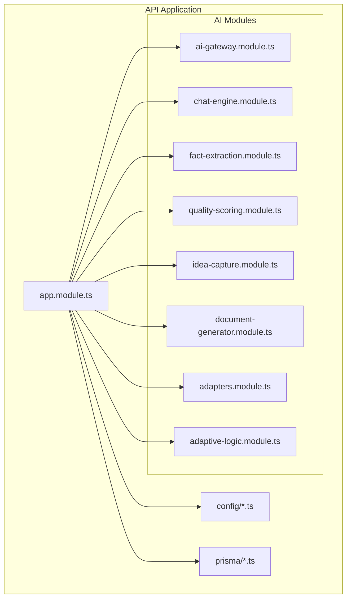

**Diagram sources**
- [app.module.ts](file://apps/api/src/app.module.ts)
- [ai-gateway.module.ts](file://apps/api/src/modules/ai-gateway/ai-gateway.module.ts)
- [chat-engine.module.ts](file://apps/api/src/modules/chat-engine/chat-engine.module.ts)
- [fact-extraction.module.ts](file://apps/api/src/modules/fact-extraction/fact-extraction.module.ts)
- [quality-scoring.module.ts](file://apps/api/src/modules/quality-scoring/quality-scoring.module.ts)
- [idea-capture.module.ts](file://apps/api/src/modules/idea-capture/idea-capture.module.ts)
- [document-generator.module.ts](file://apps/api/src/modules/document-generator/document-generator.module.ts)
- [adapters.module.ts](file://apps/api/src/modules/adapters/adapters.module.ts)
- [adaptive-logic.module.ts](file://apps/api/src/modules/adaptive-logic/adaptive-logic.module.ts)
- [configuration.ts](file://apps/api/src/config/configuration.ts)
- [prisma.config.ts](file://prisma/prisma.config.ts)

**Section sources**
- [app.module.ts](file://apps/api/src/app.module.ts)
- [ai-gateway.module.ts](file://apps/api/src/modules/ai-gateway/ai-gateway.module.ts)
- [chat-engine.module.ts](file://apps/api/src/modules/chat-engine/chat-engine.module.ts)
- [fact-extraction.module.ts](file://apps/api/src/modules/fact-extraction/fact-extraction.module.ts)
- [quality-scoring.module.ts](file://apps/api/src/modules/quality-scoring/quality-scoring.module.ts)
- [idea-capture.module.ts](file://apps/api/src/modules/idea-capture/idea-capture.module.ts)
- [document-generator.module.ts](file://apps/api/src/modules/document-generator/document-generator.module.ts)
- [adapters.module.ts](file://apps/api/src/modules/adapters/adapters.module.ts)
- [adaptive-logic.module.ts](file://apps/api/src/modules/adaptive-logic/adaptive-logic.module.ts)
- [configuration.ts](file://apps/api/src/config/configuration.ts)
- [prisma.config.ts](file://prisma/prisma.config.ts)

## Core Components
This section outlines the primary AI services and their responsibilities:
- AI Gateway: Centralized routing and orchestration across multiple AI providers
- Chat Engine: Conversation management, message persistence, and streaming
- Fact Extraction: Structured extraction of facts from free-form content
- Quality Scoring: Automated quality assessment of content against defined dimensions
- Idea Capture: Submission and processing of ideas with project-type categorization
- Prompt Generation: Dynamic prompt construction for document generation tasks
- Adapters: Provider integrations for GitHub, GitLab, and Jira/Confluence
- Adaptive Logic: Intelligent routing and fallback strategies

Key entry points:
- Controllers expose REST endpoints for each service
- Services encapsulate business logic and provider interactions
- DTOs define request/response schemas
- Schemas formalize extraction structures
- Configurations enable observability and operational controls

**Section sources**
- [ai-gateway.controller.ts](file://apps/api/src/modules/ai-gateway/ai-gateway.controller.ts)
- [ai-gateway.service.ts](file://apps/api/src/modules/ai-gateway/ai-gateway.service.ts)
- [chat-engine.controller.ts](file://apps/api/src/modules/chat-engine/chat-engine.controller.ts)
- [chat-engine.service.ts](file://apps/api/src/modules/chat-engine/chat-engine.service.ts)
- [fact-extraction.controller.ts](file://apps/api/src/modules/fact-extraction/fact-extraction.controller.ts)
- [facts.controller.ts](file://apps/api/src/modules/fact-extraction/facts.controller.ts)
- [quality-scoring.controller.ts](file://apps/api/src/modules/quality-scoring/quality-scoring.controller.ts)
- [quality-scoring.service.ts](file://apps/api/src/modules/quality-scoring/quality-scoring.service.ts)
- [idea-capture.controller.ts](file://apps/api/src/modules/idea-capture/idea-capture.controller.ts)
- [prompt-generation.service.ts](file://apps/api/src/modules/document-generator/services/prompt-generation.service.ts)
- [adapter.controller.ts](file://apps/api/src/modules/adapters/adapter.controller.ts)
- [adapter-config.service.ts](file://apps/api/src/modules/adapters/adapter-config.service.ts)

## Architecture Overview
The AI services architecture centers on the AI Gateway, which routes requests to appropriate providers and aggregates responses. Supporting modules handle specialized tasks such as conversation management, structured extraction, quality scoring, idea capture, and prompt generation. Observability and configuration are managed via dedicated config modules, while Prisma provides data modeling and seeding for AI provider metadata.

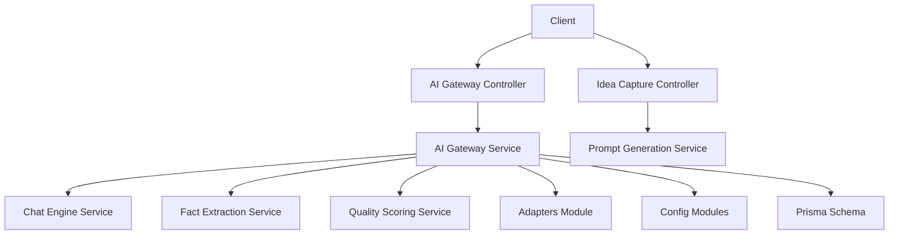

**Diagram sources**
- [ai-gateway.controller.ts](file://apps/api/src/modules/ai-gateway/ai-gateway.controller.ts)
- [ai-gateway.service.ts](file://apps/api/src/modules/ai-gateway/ai-gateway.service.ts)
- [chat-engine.service.ts](file://apps/api/src/modules/chat-engine/chat-engine.service.ts)
- [fact-extraction.controller.ts](file://apps/api/src/modules/fact-extraction/fact-extraction.controller.ts)
- [quality-scoring.service.ts](file://apps/api/src/modules/quality-scoring/quality-scoring.service.ts)
- [idea-capture.controller.ts](file://apps/api/src/modules/idea-capture/idea-capture.controller.ts)
- [prompt-generation.service.ts](file://apps/api/src/modules/document-generator/services/prompt-generation.service.ts)
- [adapter.controller.ts](file://apps/api/src/modules/adapters/adapter.controller.ts)
- [configuration.ts](file://apps/api/src/config/configuration.ts)
- [prisma.config.ts](file://prisma/prisma.config.ts)

## Detailed Component Analysis

### AI Gateway
The AI Gateway provides a unified interface for interacting with multiple AI providers. It routes requests, manages provider selection criteria, and normalizes responses.

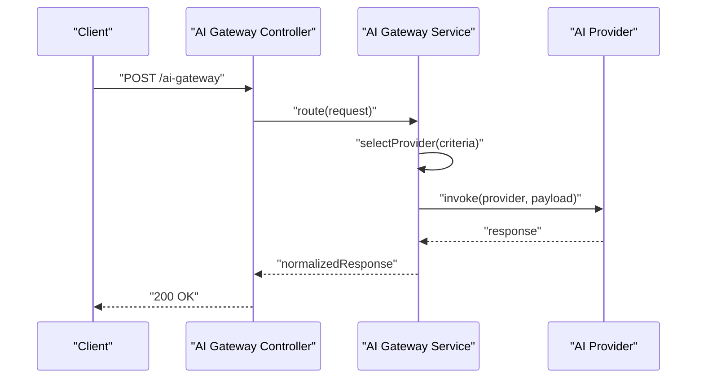

**Diagram sources**
- [ai-gateway.controller.ts](file://apps/api/src/modules/ai-gateway/ai-gateway.controller.ts)
- [ai-gateway.service.ts](file://apps/api/src/modules/ai-gateway/ai-gateway.service.ts)

Key responsibilities:
- Multi-provider routing and fallback
- Cost tracking and provider selection
- Response normalization and error handling
- Integration with adapter configurations

**Section sources**
- [ai-gateway.controller.ts](file://apps/api/src/modules/ai-gateway/ai-gateway.controller.ts)
- [ai-gateway.service.ts](file://apps/api/src/modules/ai-gateway/ai-gateway.service.ts)
- [adapter-config.service.ts](file://apps/api/src/modules/adapters/adapter-config.service.ts)

### Chat Engine
The Chat Engine manages conversation lifecycles, persists messages, and supports streaming responses.

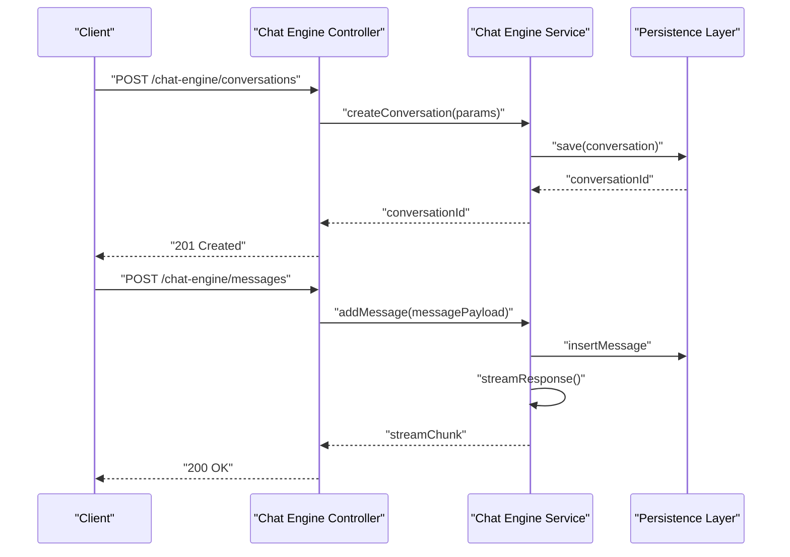

**Diagram sources**
- [chat-engine.controller.ts](file://apps/api/src/modules/chat-engine/chat-engine.controller.ts)
- [chat-engine.service.ts](file://apps/api/src/modules/chat-engine/chat-engine.service.ts)

Capabilities:
- Conversation creation and retrieval
- Message insertion and retrieval
- Streaming response handling
- Persistence integration

**Section sources**
- [chat-engine.controller.ts](file://apps/api/src/modules/chat-engine/chat-engine.controller.ts)
- [chat-engine.service.ts](file://apps/api/src/modules/chat-engine/chat-engine.service.ts)

### Fact Extraction
Fact Extraction transforms unstructured content into structured facts using schema-driven extraction.

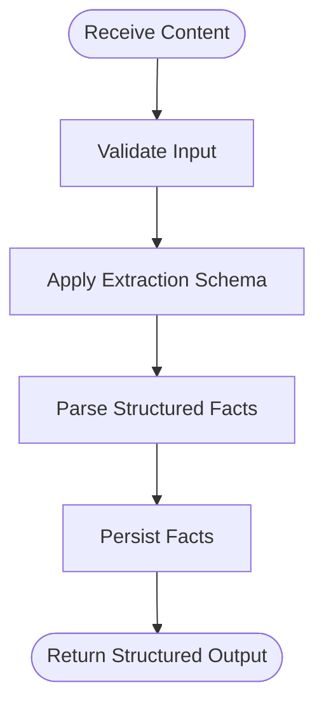

**Diagram sources**
- [fact-extraction.controller.ts](file://apps/api/src/modules/fact-extraction/fact-extraction.controller.ts)
- [facts.controller.ts](file://apps/api/src/modules/fact-extraction/facts.controller.ts)

Use cases:
- Structured data extraction from documents
- Named entity recognition and classification
- Compliance and audit fact capture

**Section sources**
- [fact-extraction.controller.ts](file://apps/api/src/modules/fact-extraction/fact-extraction.controller.ts)
- [facts.controller.ts](file://apps/api/src/modules/fact-extraction/facts.controller.ts)

### Quality Scoring
Quality Scoring evaluates content against predefined dimensions and returns a normalized score.

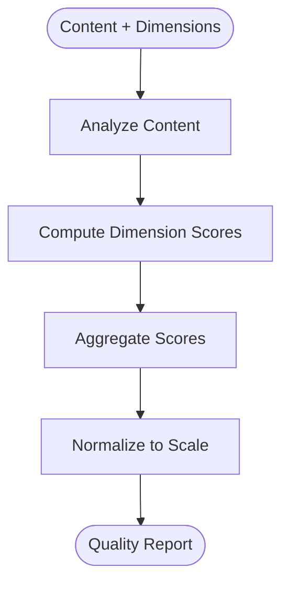

**Diagram sources**
- [quality-scoring.controller.ts](file://apps/api/src/modules/quality-scoring/quality-scoring.controller.ts)
- [quality-scoring.service.ts](file://apps/api/src/modules/quality-scoring/quality-scoring.service.ts)

Capabilities:
- Dimension-based scoring
- Sentiment-aware assessments
- Quality dimension weighting and normalization

**Section sources**
- [quality-scoring.controller.ts](file://apps/api/src/modules/quality-scoring/quality-scoring.controller.ts)
- [quality-scoring.service.ts](file://apps/api/src/modules/quality-scoring/quality-scoring.service.ts)

### Idea Capture
Idea Capture handles idea submissions and processes them according to project types.

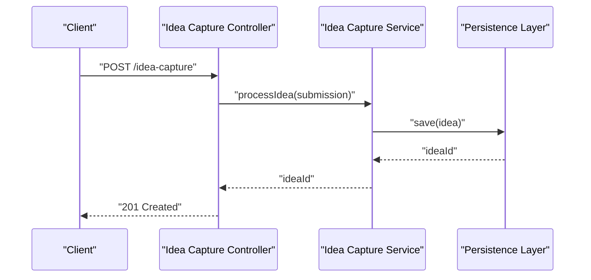

**Diagram sources**
- [idea-capture.controller.ts](file://apps/api/src/modules/idea-capture/idea-capture.controller.ts)

**Section sources**
- [idea-capture.controller.ts](file://apps/api/src/modules/idea-capture/idea-capture.controller.ts)

### Prompt Generation
Prompt Generation composes dynamic prompts for document generation tasks.

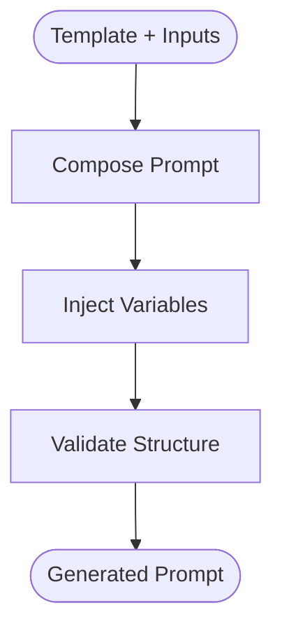

**Diagram sources**
- [prompt-generation.service.ts](file://apps/api/src/modules/document-generator/services/prompt-generation.service.ts)

**Section sources**
- [prompt-generation.service.ts](file://apps/api/src/modules/document-generator/services/prompt-generation.service.ts)

### Adapters
Adapters integrate external systems (GitHub, GitLab, Jira/Confluence) with the AI services.

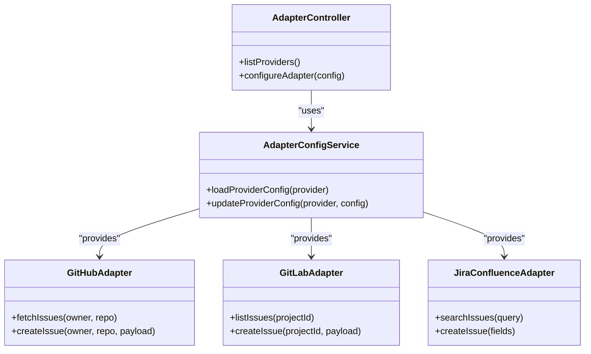

**Diagram sources**
- [adapter.controller.ts](file://apps/api/src/modules/adapters/adapter.controller.ts)
- [adapter-config.service.ts](file://apps/api/src/modules/adapters/adapter-config.service.ts)
- [github.adapter.ts](file://apps/api/src/modules/adapters/github.adapter.ts)
- [gitlab.adapter.ts](file://apps/api/src/modules/adapters/gitlab.adapter.ts)
- [jira-confluence.adapter.ts](file://apps/api/src/modules/adapters/jira-confluence.adapter.ts)

**Section sources**
- [adapter.controller.ts](file://apps/api/src/modules/adapters/adapter.controller.ts)
- [adapter-config.service.ts](file://apps/api/src/modules/adapters/adapter-config.service.ts)
- [github.adapter.ts](file://apps/api/src/modules/adapters/github.adapter.ts)
- [gitlab.adapter.ts](file://apps/api/src/modules/adapters/gitlab.adapter.ts)
- [jira-confluence.adapter.ts](file://apps/api/src/modules/adapters/jira-confluence.adapter.ts)

### Adaptive Logic
Adaptive Logic enables intelligent routing and fallback strategies across providers.

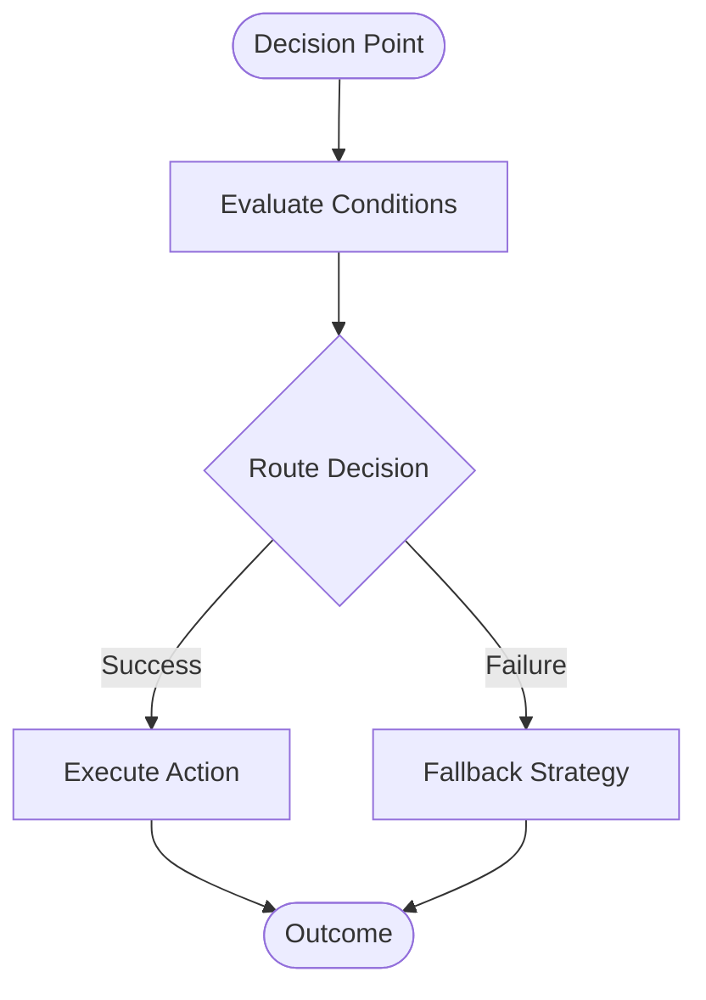

**Diagram sources**
- [adaptive-logic.service.ts](file://apps/api/src/modules/adaptive-logic/adaptive-logic.service.ts)

**Section sources**
- [adaptive-logic.service.ts](file://apps/api/src/modules/adaptive-logic/adaptive-logic.service.ts)

## Dependency Analysis
The AI services rely on configuration modules for observability and operational controls, and on Prisma for data modeling and seeding. The AI Gateway coordinates interactions across services and providers.

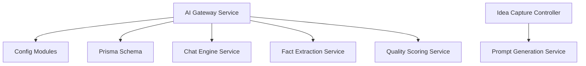

**Diagram sources**
- [ai-gateway.service.ts](file://apps/api/src/modules/ai-gateway/ai-gateway.service.ts)
- [chat-engine.service.ts](file://apps/api/src/modules/chat-engine/chat-engine.service.ts)
- [fact-extraction.controller.ts](file://apps/api/src/modules/fact-extraction/fact-extraction.controller.ts)
- [quality-scoring.service.ts](file://apps/api/src/modules/quality-scoring/quality-scoring.service.ts)
- [idea-capture.controller.ts](file://apps/api/src/modules/idea-capture/idea-capture.controller.ts)
- [prompt-generation.service.ts](file://apps/api/src/modules/document-generator/services/prompt-generation.service.ts)
- [configuration.ts](file://apps/api/src/config/configuration.ts)
- [prisma.config.ts](file://prisma/prisma.config.ts)

**Section sources**
- [ai-gateway.service.ts](file://apps/api/src/modules/ai-gateway/ai-gateway.service.ts)
- [configuration.ts](file://apps/api/src/config/configuration.ts)
- [prisma.config.ts](file://prisma/prisma.config.ts)

## Performance Considerations
- Provider selection and routing: Use cost tracking and latency metrics to select optimal providers dynamically.
- Streaming responses: Implement chunked responses for long-running AI tasks to improve perceived performance.
- Caching: Cache frequently accessed provider configurations and normalized responses where safe.
- Backpressure: Apply rate limiting and circuit breakers to prevent provider overload.
- Memory optimization: Monitor memory usage and apply garbage collection strategies during heavy workloads.

## Troubleshooting Guide
Common issues and resolutions:
- Provider errors: Inspect provider-specific logs and retry with exponential backoff.
- Routing failures: Verify adapter configurations and provider availability.
- Data inconsistencies: Validate schemas and ensure consistent data types across services.
- Observability gaps: Confirm logging, tracing, and monitoring configurations are active.

Operational configurations to review:
- Logging and Sentry configuration
- Uptime monitoring and alerting rules
- Canary deployment and graceful degradation settings
- Resource pressure and failure injection strategies

**Section sources**
- [logger.config.ts](file://apps/api/src/config/logger.config.ts)
- [sentry.config.ts](file://apps/api/src/config/sentry.config.ts)
- [uptime-monitoring.config.ts](file://apps/api/src/config/uptime-monitoring.config.ts)
- [alerting-rules.config.ts](file://apps/api/src/config/alerting-rules.config.ts)
- [canary-deployment.config.ts](file://apps/api/src/config/canary-deployment.config.ts)
- [graceful-degradation.config.ts](file://apps/api/src/config/graceful-degradation.config.ts)
- [resource-pressure.config.ts](file://apps/api/src/config/resource-pressure.config.ts)
- [failure-injection.config.ts](file://apps/api/src/config/failure-injection.config.ts)

## Conclusion
The AI Services API provides a robust foundation for integrating multiple AI providers, managing conversations, extracting structured facts, scoring content quality, capturing ideas, and generating prompts. The AI Gateway centralizes routing and orchestration, while supporting modules address specialized needs. Observability and configuration ensure reliable operation, and Prisma provides a strong data model for AI provider metadata.

## Appendices

### API Endpoints Overview
- AI Gateway: POST /ai-gateway
- Chat Engine: POST /chat-engine/conversations, POST /chat-engine/messages
- Fact Extraction: POST /fact-extraction, GET /facts
- Quality Scoring: POST /quality-scoring
- Idea Capture: POST /idea-capture
- Prompt Generation: POST /document-generator/prompts
- Adapters: GET /adapters/providers, POST /adapters/configure

**Section sources**
- [ai-gateway.controller.ts](file://apps/api/src/modules/ai-gateway/ai-gateway.controller.ts)
- [chat-engine.controller.ts](file://apps/api/src/modules/chat-engine/chat-engine.controller.ts)
- [fact-extraction.controller.ts](file://apps/api/src/modules/fact-extraction/fact-extraction.controller.ts)
- [facts.controller.ts](file://apps/api/src/modules/fact-extraction/facts.controller.ts)
- [quality-scoring.controller.ts](file://apps/api/src/modules/quality-scoring/quality-scoring.controller.ts)
- [idea-capture.controller.ts](file://apps/api/src/modules/idea-capture/idea-capture.controller.ts)
- [prompt-generation.service.ts](file://apps/api/src/modules/document-generator/services/prompt-generation.service.ts)
- [adapter.controller.ts](file://apps/api/src/modules/adapters/adapter.controller.ts)

### Data Models and Schemas
- Providers: Managed via Prisma schema and seeded data for AI provider metadata
- Conversations: Stored with messages and timestamps
- Facts: Structured entities extracted from content
- Quality Reports: Aggregated scores per dimension
- Ideas: Captured with project-type metadata

**Section sources**
- [schema.prisma](file://prisma/schema.prisma)
- [seed.ts](file://prisma/seed.ts)
- [ai-providers.seed.ts](file://prisma/seeds/ai-providers.seed.ts)

### Health and Monitoring
- Health endpoint: GET /health
- Configuration: Logger, Sentry, uptime monitoring, alerting rules, canary deployment, graceful degradation, resource pressure, feature flags, incident response, chaos engineering, disaster recovery, failure injection

**Section sources**
- [health.controller.ts](file://apps/api/src/health.controller.ts)
- [logger.config.ts](file://apps/api/src/config/logger.config.ts)
- [sentry.config.ts](file://apps/api/src/config/sentry.config.ts)
- [uptime-monitoring.config.ts](file://apps/api/src/config/uptime-monitoring.config.ts)
- [alerting-rules.config.ts](file://apps/api/src/config/alerting-rules.config.ts)
- [canary-deployment.config.ts](file://apps/api/src/config/canary-deployment.config.ts)
- [graceful-degradation.config.ts](file://apps/api/src/config/graceful-degradation.config.ts)
- [resource-pressure.config.ts](file://apps/api/src/config/resource-pressure.config.ts)
- [feature-flags.config.ts](file://apps/api/src/config/feature-flags.config.ts)
- [incident-response.config.ts](file://apps/api/src/config/incident-response.config.ts)
- [chaos-engineering.config.ts](file://apps/api/src/config/chaos-engineering.config.ts)
- [disaster-recovery.config.ts](file://apps/api/src/config/disaster-recovery.config.ts)
- [failure-injection.config.ts](file://apps/api/src/config/failure-injection.config.ts)