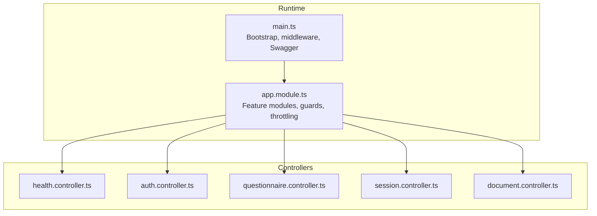
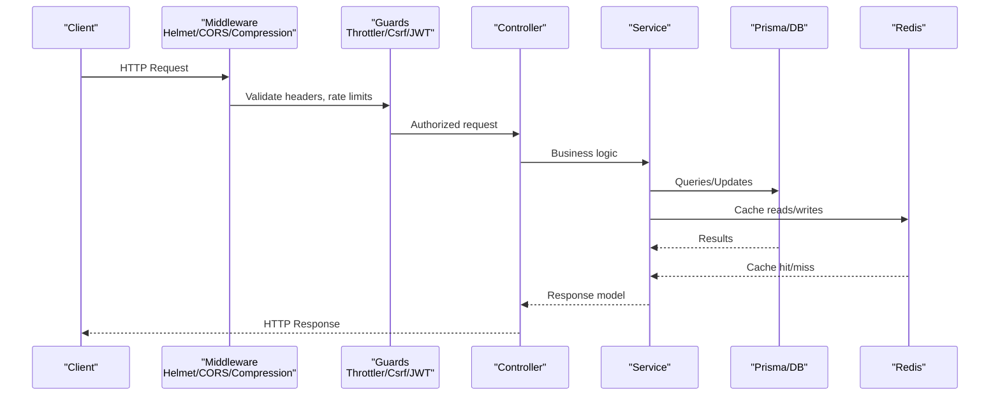
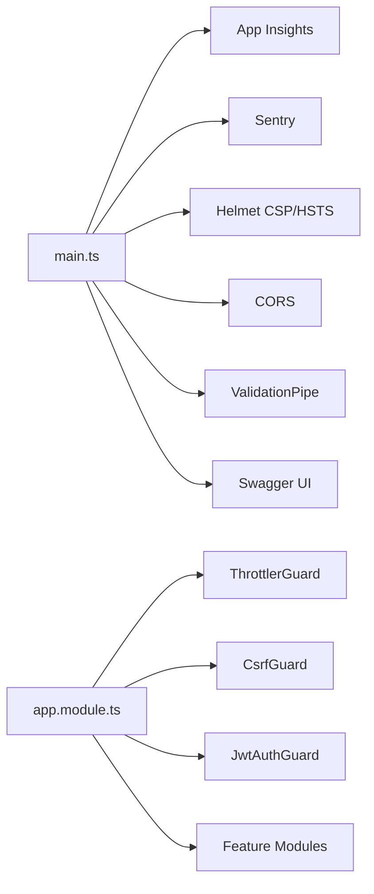

# API Documentation

<cite>
**Referenced Files in This Document**
- [main.ts](file://apps/api/src/main.ts)
- [app.module.ts](file://apps/api/src/app.module.ts)
- [health.controller.ts](file://apps/api/src/health.controller.ts)
- [auth.controller.ts](file://apps/api/src/modules/auth/auth.controller.ts)
- [login.dto.ts](file://apps/api/src/modules/auth/dto/login.dto.ts)
- [register.dto.ts](file://apps/api/src/modules/auth/dto/register.dto.ts)
- [token.dto.ts](file://apps/api/src/modules/auth/dto/token.dto.ts)
- [questionnaire.controller.ts](file://apps/api/src/modules/questionnaire/questionnaire.controller.ts)
- [session.controller.ts](file://apps/api/src/modules/session/session.controller.ts)
- [create-session.dto.ts](file://apps/api/src/modules/session/dto/create-session.dto.ts)
- [document.controller.ts](file://apps/api/src/modules/document-generator/controllers/document.controller.ts)
</cite>

## Table of Contents
1. [Introduction](#introduction)
2. [Project Structure](#project-structure)
3. [Core Components](#core-components)
4. [Architecture Overview](#architecture-overview)
5. [Detailed Component Analysis](#detailed-component-analysis)
6. [Dependency Analysis](#dependency-analysis)
7. [Performance Considerations](#performance-considerations)
8. [Troubleshooting Guide](#troubleshooting-guide)
9. [Conclusion](#conclusion)
10. [Appendices](#appendices)

## Introduction
This document describes the RESTful API for Quiz-to-Build (Quiz2Biz). It covers HTTP methods, URL patterns, request/response schemas, authentication, error handling, pagination, filtering, sorting, rate limiting, security headers, and operational endpoints. It also outlines API versioning, backward compatibility, deprecation policies, performance characteristics, caching strategies, and monitoring endpoints.

## Project Structure
The API is implemented as a NestJS application with modular feature areas. The runtime bootstraps middleware for compression, security headers, CORS, validation, logging, and OpenAPI/Swagger documentation. Controllers are grouped by domain (authentication, questionnaires, sessions, documents, etc.).

**Diagram sources**
- [main.ts:28-329](file://apps/api/src/main.ts#L28-L329)
- [app.module.ts:53-129](file://apps/api/src/app.module.ts#L53-L129)

**Section sources**
- [main.ts:28-329](file://apps/api/src/main.ts#L28-L329)
- [app.module.ts:53-129](file://apps/api/src/app.module.ts#L53-L129)

## Core Components
- Global prefix: api/v1
- Authentication: Bearer JWT via Authorization header
- Validation: Global ValidationPipe with whitelist and transform
- Compression: gzip/brotli with exceptions for Server-Sent Events and streaming AI gateway
- Security headers: Helmet CSP, HSTS in production, Permissions-Policy
- CORS: Configurable origin(s), supports credentials
- Rate limiting: Multiple windows (short, medium, long) via Throttler
- Monitoring: Application Insights request tracking, Sentry error capture, Swagger UI

**Section sources**
- [main.ts:40-41](file://apps/api/src/main.ts#L40-L41)
- [main.ts:196-206](file://apps/api/src/main.ts#L196-L206)
- [main.ts:43-67](file://apps/api/src/main.ts#L43-L67)
- [main.ts:68-123](file://apps/api/src/main.ts#L68-L123)
- [main.ts:125-168](file://apps/api/src/main.ts#L125-L168)
- [main.ts:180-191](file://apps/api/src/main.ts#L180-L191)
- [app.module.ts:68-85](file://apps/api/src/app.module.ts#L68-L85)
- [main.ts:214-298](file://apps/api/src/main.ts#L214-L298)

## Architecture Overview
High-level API flow: client → middleware → guards → controllers → services → persistence/cache.

**Diagram sources**
- [main.ts:68-123](file://apps/api/src/main.ts#L68-L123)
- [main.ts:180-191](file://apps/api/src/main.ts#L180-L191)
- [app.module.ts:68-85](file://apps/api/src/app.module.ts#L68-L85)
- [auth.controller.ts:38-81](file://apps/api/src/modules/auth/auth.controller.ts#L38-L81)
- [session.controller.ts:39-47](file://apps/api/src/modules/session/session.controller.ts#L39-L47)
- [document.controller.ts:45-65](file://apps/api/src/modules/document-generator/controllers/document.controller.ts#L45-L65)

## Detailed Component Analysis

### Authentication Endpoints
- Base path: /api/v1/auth
- Authentication: Bearer JWT required for protected routes except registration/login/verification/reset endpoints
- CSRF protection: CSRF token endpoint and guard for state-changing requests

Endpoints:
- POST /auth/register
  - Description: Register a new user
  - Auth: None
  - Body: RegisterDto
  - Responses:
    - 201 Created: TokenResponseDto
    - 409 Conflict: Email already exists
  - Example request: [register.dto.ts:4-24](file://apps/api/src/modules/auth/dto/register.dto.ts#L4-L24)
  - Example response: [token.dto.ts:21-36](file://apps/api/src/modules/auth/dto/token.dto.ts#L21-L36)

- POST /auth/login
  - Description: Login with email and password
  - Auth: None
  - Body: LoginDto
  - Responses:
    - 200 OK: TokenResponseDto
    - 401 Unauthorized: Invalid credentials
  - Example request: [login.dto.ts:4-19](file://apps/api/src/modules/auth/dto/login.dto.ts#L4-L19)
  - Example response: [token.dto.ts:21-36](file://apps/api/src/modules/auth/dto/token.dto.ts#L21-L36)

- POST /auth/refresh
  - Description: Refresh access token
  - Auth: None
  - Body: RefreshTokenDto
  - Responses:
    - 200 OK: RefreshResponseDto
    - 401 Unauthorized: Invalid or expired refresh token
  - Example response: [token.dto.ts:38-44](file://apps/api/src/modules/auth/dto/token.dto.ts#L38-L44)

- POST /auth/logout
  - Description: Logout and invalidate refresh token
  - Auth: None
  - Body: RefreshTokenDto
  - Responses:
    - 200 OK: Success message
  - Example response: [auth.controller.ts:78-81](file://apps/api/src/modules/auth/auth.controller.ts#L78-L81)

- GET /auth/me
  - Description: Get current user profile
  - Auth: Bearer JWT
  - Responses:
    - 200 OK: AuthenticatedUser
    - 401 Unauthorized
  - Example response: [auth.controller.ts:89-91](file://apps/api/src/modules/auth/auth.controller.ts#L89-L91)

- POST /auth/verify-email
  - Description: Verify email address with token
  - Auth: None
  - Body: VerifyEmailDto
  - Responses:
    - 200 OK: { message, verified }
    - 400 Bad Request: Invalid or expired token
  - Example response: [auth.controller.ts:101-103](file://apps/api/src/modules/auth/auth.controller.ts#L101-L103)

- POST /auth/resend-verification
  - Description: Resend verification email
  - Auth: None
  - Body: ResendVerificationDto
  - Responses:
    - 200 OK: Success message
  - Example response: [auth.controller.ts:111-113](file://apps/api/src/modules/auth/auth.controller.ts#L111-L113)

- POST /auth/forgot-password
  - Description: Request password reset email
  - Auth: None
  - Body: RequestPasswordResetDto
  - Responses:
    - 200 OK: Success message
  - Example response: [auth.controller.ts:123-125](file://apps/api/src/modules/auth/auth.controller.ts#L123-L125)

- POST /auth/reset-password
  - Description: Reset password with token
  - Auth: None
  - Body: ResetPasswordDto
  - Responses:
    - 200 OK: Success message
    - 400 Bad Request: Invalid or expired token
  - Example response: [auth.controller.ts:134-136](file://apps/api/src/modules/auth/auth.controller.ts#L134-L136)

- GET /auth/csrf-token
  - Description: Get CSRF token for state-changing requests
  - Auth: None
  - Responses:
    - 200 OK: { csrfToken, message }
  - Notes: Sets CSRF token in cookie; include token in X-CSRF-Token header for POST/PUT/PATCH/DELETE

Validation rules:
- Registration password minimum length and character requirements
- Email format validation
- Optional IP field populated server-side for login

Rate limiting:
- Login: throttle window for failed attempts
- Resend verification: throttle window
- Forgot password: throttle window
- Reset password: throttle window

Security headers:
- Helmet CSP, HSTS in production, Permissions-Policy applied globally

**Section sources**
- [auth.controller.ts:38-171](file://apps/api/src/modules/auth/auth.controller.ts#L38-L171)
- [login.dto.ts:4-19](file://apps/api/src/modules/auth/dto/login.dto.ts#L4-L19)
- [register.dto.ts:4-24](file://apps/api/src/modules/auth/dto/register.dto.ts#L4-L24)
- [token.dto.ts:21-44](file://apps/api/src/modules/auth/dto/token.dto.ts#L21-L44)
- [main.ts:68-123](file://apps/api/src/main.ts#L68-L123)
- [main.ts:125-168](file://apps/api/src/main.ts#L125-L168)

### Questionnaires Endpoints
- Base path: /api/v1/questionnaires
- Authentication: Bearer JWT required
- Pagination: Uses shared PaginationDto

Endpoints:
- GET /questionnaires
  - Description: List all available questionnaires
  - Auth: Bearer JWT
  - Query params:
    - industry: string (optional)
    - page: number (optional)
    - limit: number (optional)
  - Responses:
    - 200 OK: { items: QuestionnaireListItem[], pagination }
  - Example response: [questionnaire.controller.ts:25-38](file://apps/api/src/modules/questionnaire/questionnaire.controller.ts#L25-L38)

- GET /questionnaires/:id
  - Description: Get questionnaire details with sections and questions
  - Auth: Bearer JWT
  - Path params:
    - id: UUID
  - Responses:
    - 200 OK: QuestionnaireDetail
    - 404 Not Found: Questionnaire not found

**Section sources**
- [questionnaire.controller.ts:18-47](file://apps/api/src/modules/questionnaire/questionnaire.controller.ts#L18-L47)

### Sessions Endpoints
- Base path: /api/v1/sessions
- Authentication: Bearer JWT required
- Pagination: Uses shared PaginationDto

Endpoints:
- POST /sessions
  - Description: Start a new questionnaire session
  - Auth: Bearer JWT
  - Body: CreateSessionDto
  - Responses:
    - 201 Created: SessionResponse
  - Example request: [create-session.dto.ts:5-39](file://apps/api/src/modules/session/dto/create-session.dto.ts#L5-L39)

- GET /sessions
  - Description: List user’s sessions
  - Auth: Bearer JWT
  - Query params:
    - status: enum (optional)
    - page: number (optional)
    - limit: number (optional)
  - Responses:
    - 200 OK: { items: SessionResponse[], pagination }

- GET /sessions/:id
  - Description: Get session details
  - Auth: Bearer JWT
  - Path params:
    - id: UUID
  - Responses:
    - 200 OK: SessionResponse
    - 404 Not Found: Session not found

- GET /sessions/:id/continue
  - Description: Continue session and return next question(s) with progress
  - Auth: Bearer JWT
  - Path params:
    - id: UUID
  - Query params:
    - questionCount: number (default: 1, min: 1, max: 5)
  - Responses:
    - 200 OK: ContinueSessionResponse
    - 403 Forbidden: Access denied
    - 404 Not Found: Session not found

- GET /sessions/:id/questions/next
  - Description: Get next question(s) based on adaptive logic
  - Auth: Bearer JWT
  - Path params:
    - id: UUID
  - Query params:
    - count: number (default: 1, min: 1, max: 5)
  - Responses:
    - 200 OK: NextQuestionResponse

- POST /sessions/:id/responses
  - Description: Submit a response to a question
  - Auth: Bearer JWT
  - Path params:
    - id: UUID
  - Body: SubmitResponseDto
  - Responses:
    - 201 Created: SubmitResponseResult

- PUT /sessions/:id/responses/:questionId
  - Description: Update a response
  - Auth: Bearer JWT
  - Path params:
    - id: UUID
    - questionId: UUID
  - Body: SubmitResponseDto without questionId
  - Responses:
    - 200 OK: SubmitResponseResult

- POST /sessions/:id/complete
  - Description: Mark session as complete
  - Auth: Bearer JWT
  - Path params:
    - id: UUID
  - Responses:
    - 200 OK: SessionResponse

Validation rules:
- UUID parsing for identifiers
- Enum constraints for status and persona
- Count clamping for question retrieval

Pagination and filtering:
- Page/limit via PaginationDto
- Status filter supported

**Section sources**
- [session.controller.ts:39-165](file://apps/api/src/modules/session/session.controller.ts#L39-L165)
- [create-session.dto.ts:5-39](file://apps/api/src/modules/session/dto/create-session.dto.ts#L5-L39)

### Documents Endpoints
- Base path: /api/v1/documents
- Authentication: Bearer JWT required

Endpoints:
- POST /documents/generate
  - Description: Request document generation for a session
  - Auth: Bearer JWT
  - Body: RequestGenerationDto
  - Responses:
    - 201 Created: DocumentResponseDto
    - 400 Bad Request: Session not completed or missing required questions
    - 404 Not Found: Session or document type not found

- GET /documents/types
  - Description: List available document types
  - Auth: Bearer JWT
  - Responses:
    - 200 OK: DocumentTypeResponseDto[]

- GET /documents/session/:sessionId/types
  - Description: List document types available for a session (project-type-scoped)
  - Auth: Bearer JWT
  - Path params:
    - sessionId: UUID
  - Responses:
    - 200 OK: DocumentTypeResponseDto[]
    - 404 Not Found: Session not found

- GET /documents/session/:sessionId
  - Description: List all documents for a session
  - Auth: Bearer JWT
  - Path params:
    - sessionId: UUID
  - Responses:
    - 200 OK: DocumentResponseDto[]
    - 404 Not Found: Session not found

- GET /documents/:id
  - Description: Get document details
  - Auth: Bearer JWT
  - Path params:
    - id: UUID
  - Responses:
    - 200 OK: DocumentResponseDto
    - 404 Not Found: Document not found

- GET /documents/:id/download
  - Description: Get secure download URL for document
  - Auth: Bearer JWT
  - Path params:
    - id: UUID
  - Query params:
    - expiresIn: number (default: 60)
  - Responses:
    - 200 OK: DownloadUrlResponseDto
    - 400 Bad Request: Document not available for download
    - 404 Not Found: Document not found

- GET /documents/session/:sessionId/bulk-download
  - Description: Download all session documents as ZIP
  - Auth: Bearer JWT
  - Path params:
    - sessionId: UUID
  - Responses:
    - 200 OK: ZIP stream
    - 400 Bad Request: No documents available
    - 404 Not Found: Session not found

- POST /documents/bulk-download
  - Description: Download selected documents as ZIP
  - Auth: Bearer JWT
  - Body: { documentIds: string[] }
  - Responses:
    - 200 OK: ZIP stream
    - 400 Bad Request: No documents selected or max exceeded

- GET /documents/:id/versions
  - Description: Get document version history
  - Auth: Bearer JWT
  - Path params:
    - id: UUID
  - Responses:
    - 200 OK: DocumentResponseDto[]
    - 404 Not Found: Document not found

- GET /documents/:id/versions/:version/download
  - Description: Download a specific document version
  - Auth: Bearer JWT
  - Path params:
    - id: UUID
    - version: integer
  - Responses:
    - 200 OK: DownloadUrlResponseDto
    - 404 Not Found: Version not found
    - 400 Bad Request: Version not available for download

Response mapping:
- DocumentController maps internal document records to response DTOs, including nested documentType metadata.

**Section sources**
- [document.controller.ts:45-277](file://apps/api/src/modules/document-generator/controllers/document.controller.ts#L45-L277)

### Health and Monitoring Endpoints
- Base path: /api/v1/health
- Description: Health check endpoint exposed by HealthController
- Typical responses:
  - 200 OK: { status: "healthy" }
  - 5xx: Service unhealthy indicators

Note: The health endpoint is registered at the global prefix and can be used for load balancer probes and monitoring.

**Section sources**
- [health.controller.ts:1-200](file://apps/api/src/health.controller.ts)

## Dependency Analysis
- Bootstrapping order matters: Application Insights initialized before Sentry and other modules to ensure full telemetry coverage.
- Middleware composition: Compression, Helmet, Permissions-Policy, CORS, validation pipes, and interceptors applied globally.
- Guards:
  - ThrottlerGuard: Enforces rate limits across the app
  - CsrfGuard: Protects state-changing requests
  - JwtAuthGuard: Secures protected endpoints
- Modules:
  - Feature modules are conditionally loaded behind a feature flag for legacy components.

**Diagram sources**
- [main.ts:28-329](file://apps/api/src/main.ts#L28-L329)
- [app.module.ts:117-127](file://apps/api/src/app.module.ts#L117-L127)

**Section sources**
- [main.ts:28-329](file://apps/api/src/main.ts#L28-L329)
- [app.module.ts:117-127](file://apps/api/src/app.module.ts#L117-L127)

## Performance Considerations
- Compression: Enabled for most responses; disabled for SSE and streaming AI gateway to preserve streaming semantics.
- Validation: Global ValidationPipe enforces strict input validation and transforms primitives, reducing downstream errors.
- Rate limiting: Multiple TTL/limits configured to protect resources under load.
- Caching: Redis module available for feature modules; consider caching frequently accessed data (e.g., document metadata, questionnaire lists).
- Streaming: Bulk downloads return StreamableFile; ensure clients handle chunked responses efficiently.
- Pagination: Always use page/limit to avoid large payloads.

[No sources needed since this section provides general guidance]

## Troubleshooting Guide
Common issues and resolutions:
- 401 Unauthorized:
  - Cause: Missing or invalid Bearer token
  - Action: Obtain a new access token via /auth/login or /auth/refresh
  - References: [auth.controller.ts:83-91](file://apps/api/src/modules/auth/auth.controller.ts#L83-L91), [session.controller.ts:34-35](file://apps/api/src/modules/session/session.controller.ts#L34-L35)

- 403 Forbidden:
  - Cause: Access denied to session resource
  - Action: Verify ownership and session state
  - References: [session.controller.ts:106-113](file://apps/api/src/modules/session/session.controller.ts#L106-L113)

- 400 Bad Request:
  - Cause: Invalid input or document not ready for download
  - Action: Validate request body and session completion status
  - References: [document.controller.ts:129-141](file://apps/api/src/modules/document-generator/controllers/document.controller.ts#L129-L141)

- 429 Too Many Requests:
  - Cause: Exceeded throttling limits
  - Action: Retry after TTL window or reduce request frequency
  - References: [app.module.ts:68-85](file://apps/api/src/app.module.ts#L68-L85)

- 500 Internal Server Error:
  - Cause: Unexpected runtime errors
  - Action: Check logs and Sentry for stack traces
  - References: [main.ts:319-328](file://apps/api/src/main.ts#L319-L328)

**Section sources**
- [auth.controller.ts:83-91](file://apps/api/src/modules/auth/auth.controller.ts#L83-L91)
- [session.controller.ts:106-113](file://apps/api/src/modules/session/session.controller.ts#L106-L113)
- [document.controller.ts:129-141](file://apps/api/src/modules/document-generator/controllers/document.controller.ts#L129-L141)
- [app.module.ts:68-85](file://apps/api/src/app.module.ts#L68-L85)
- [main.ts:319-328](file://apps/api/src/main.ts#L319-L328)

## Conclusion
The Quiz2Biz API provides a secure, validated, and monitored REST interface with clear authentication, robust rate limiting, and comprehensive documentation via Swagger. It supports adaptive assessments, document generation, and session management with pagination and filtering. Adopt the recommended patterns for rate limiting, caching, and streaming to maintain performance and reliability.

[No sources needed since this section summarizes without analyzing specific files]

## Appendices

### API Versioning and Compatibility
- Versioning: API prefix is api/v1; Swagger version is 1.0.0
- Backward compatibility: No breaking changes documented in the referenced files
- Deprecation: No deprecation notices observed in the referenced files

**Section sources**
- [main.ts:40](file://apps/api/src/main.ts#L40)
- [main.ts:241](file://apps/api/src/main.ts#L241)

### Security Headers and Policies
- Helmet CSP directives configured for development/production differences
- HSTS enabled in production
- Permissions-Policy restricts sensitive browser features
- Cookie-based CSRF protection with dedicated endpoint

**Section sources**
- [main.ts:68-123](file://apps/api/src/main.ts#L68-L123)
- [main.ts:125-168](file://apps/api/src/main.ts#L125-L168)
- [auth.controller.ts:140-169](file://apps/api/src/modules/auth/auth.controller.ts#L140-L169)

### Rate Limiting Reference
- Short window: TTL 1s, limit 3
- Medium window: TTL 10s, limit 20
- Long window: TTL 60s, limit 100

**Section sources**
- [app.module.ts:68-85](file://apps/api/src/app.module.ts#L68-L85)

### Pagination, Filtering, Sorting
- Pagination: Shared PaginationDto supports page and limit
- Filtering: Questionnaires support industry filter
- Sorting: Not explicitly defined in referenced controllers

**Section sources**
- [questionnaire.controller.ts:22-24](file://apps/api/src/modules/questionnaire/questionnaire.controller.ts#L22-L24)
- [session.controller.ts:53-65](file://apps/api/src/modules/session/session.controller.ts#L53-L65)

### Monitoring Endpoints
- Swagger UI: /api/v1/docs (gated by ENABLE_SWAGGER)
- Health: /api/v1/health
- Application Insights: Request tracking middleware active
- Sentry: Error capture initialized

**Section sources**
- [main.ts:214-298](file://apps/api/src/main.ts#L214-L298)
- [health.controller.ts:1-200](file://apps/api/src/health.controller.ts)