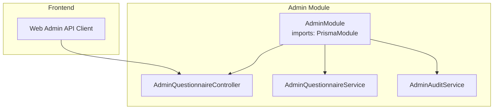
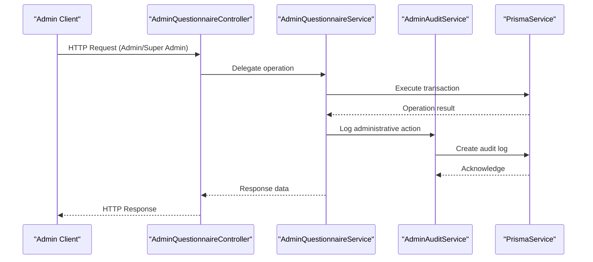
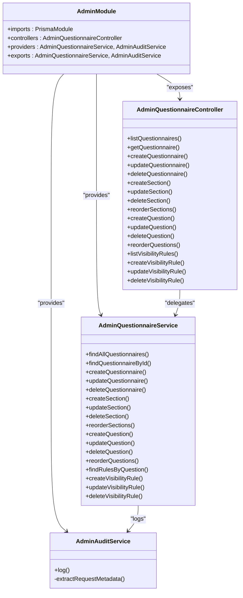
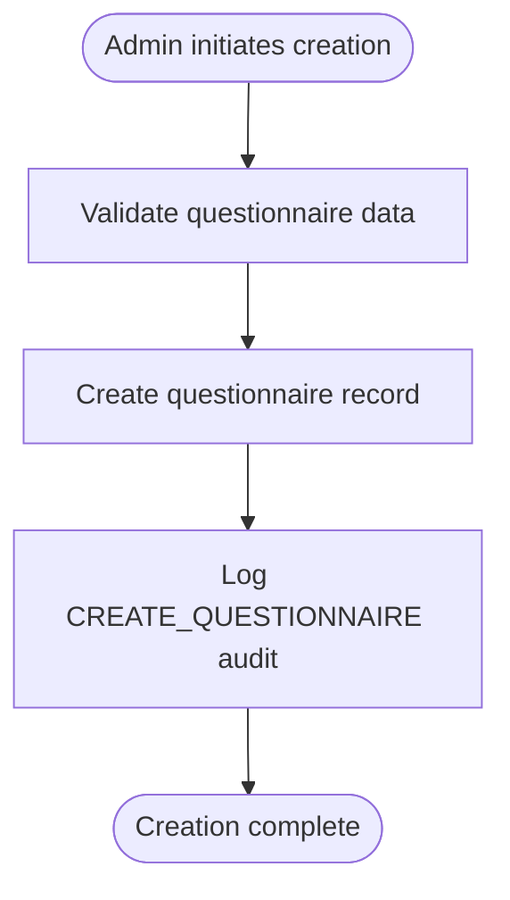
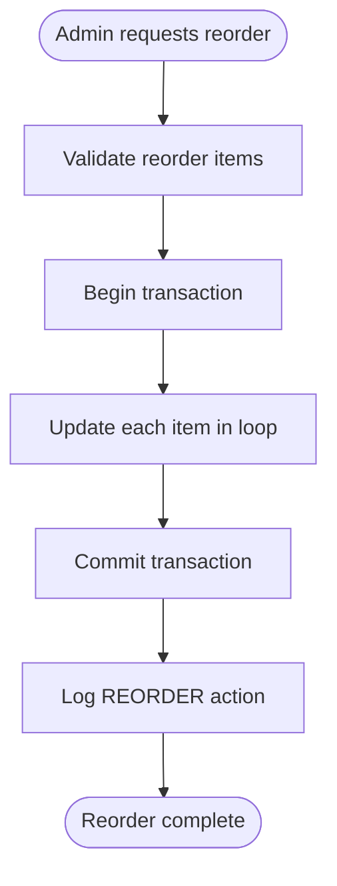

# Admin Management API

<cite>
**Referenced Files in This Document**
- [admin.module.ts](file://apps/api/src/modules/admin/admin.module.ts)
- [admin-questionnaire.controller.ts](file://apps/api/src/modules/admin/controllers/admin-questionnaire.controller.ts)
- [admin-questionnaire.service.ts](file://apps/api/src/modules/admin/services/admin-questionnaire.service.ts)
- [admin-audit.service.ts](file://apps/api/src/modules/admin/services/admin-audit.service.ts)
- [admin.ts](file://apps/web/src/api/admin.ts)
</cite>

## Table of Contents
1. [Introduction](#introduction)
2. [Project Structure](#project-structure)
3. [Core Components](#core-components)
4. [Architecture Overview](#architecture-overview)
5. [Detailed Component Analysis](#detailed-component-analysis)
6. [Dependency Analysis](#dependency-analysis)
7. [Performance Considerations](#performance-considerations)
8. [Troubleshooting Guide](#troubleshooting-guide)
9. [Conclusion](#conclusion)
10. [Appendices](#appendices)

## Introduction
This document provides comprehensive API documentation for administrative management endpoints. It covers questionnaire administration, user management, and audit logging capabilities. Administrative controls include questionnaire reordering, visibility rules, and bulk operations. The documentation also outlines user profile management, role assignments, and account lifecycle operations, along with notification delivery mechanisms and administrative reporting endpoints. Schemas for administrative actions, audit trails, and compliance reporting are included, alongside examples of administrative workflows and permission-based access patterns.

## Project Structure
The administrative functionality is implemented as a NestJS module with a dedicated controller and service layer. The module integrates with Prisma for data persistence and includes an audit service for compliance logging. The frontend exposes an admin API client for administrative tasks.

**Diagram sources**
- [admin.module.ts:1-14](file://apps/api/src/modules/admin/admin.module.ts#L1-L14)
- [admin-questionnaire.controller.ts:35-39](file://apps/api/src/modules/admin/controllers/admin-questionnaire.controller.ts#L35-L39)
- [admin-questionnaire.service.ts:35-40](file://apps/api/src/modules/admin/services/admin-questionnaire.service.ts#L35-L40)
- [admin-audit.service.ts:15-19](file://apps/api/src/modules/admin/services/admin-audit.service.ts#L15-L19)
- [admin.ts:1-50](file://apps/web/src/api/admin.ts#L1-L50)

**Section sources**
- [admin.module.ts:1-14](file://apps/api/src/modules/admin/admin.module.ts#L1-L14)
- [admin-questionnaire.controller.ts:35-39](file://apps/api/src/modules/admin/controllers/admin-questionnaire.controller.ts#L35-L39)
- [admin.ts:1-50](file://apps/web/src/api/admin.ts#L1-L50)

## Core Components
- AdminQuestionnaireController: Exposes REST endpoints for questionnaire, section, question, and visibility rule management under the /admin base path. Implements role-based access control (ADMIN, SUPER_ADMIN).
- AdminQuestionnaireService: Orchestrates business logic for CRUD operations, ordering, and validation. Integrates with AdminAuditService for audit logging.
- AdminAuditService: Provides centralized audit logging with request metadata extraction for compliance reporting.
- Web Admin API Client: Frontend client for administrative operations.

Key responsibilities:
- Questionnaire lifecycle management (list, create, update, soft-delete)
- Section and question management with auto-ordering
- Visibility rule management for dynamic form behavior
- Bulk reordering operations with transactional safety
- Comprehensive audit trail for administrative actions

**Section sources**
- [admin-questionnaire.controller.ts:46-274](file://apps/api/src/modules/admin/controllers/admin-questionnaire.controller.ts#L46-L274)
- [admin-questionnaire.service.ts:46-575](file://apps/api/src/modules/admin/services/admin-questionnaire.service.ts#L46-L575)
- [admin-audit.service.ts:21-56](file://apps/api/src/modules/admin/services/admin-audit.service.ts#L21-L56)

## Architecture Overview
The admin module follows a layered architecture with clear separation of concerns:

**Diagram sources**
- [admin-questionnaire.controller.ts:35-39](file://apps/api/src/modules/admin/controllers/admin-questionnaire.controller.ts#L35-L39)
- [admin-questionnaire.service.ts:35-40](file://apps/api/src/modules/admin/services/admin-questionnaire.service.ts#L35-L40)
- [admin-audit.service.ts:21-44](file://apps/api/src/modules/admin/services/admin-audit.service.ts#L21-L44)

## Detailed Component Analysis

### AdminQuestionnaireController
The controller implements comprehensive administrative endpoints organized into logical groups:

#### Questionnaire Management Endpoints
- GET /admin/questionnaires: List all questionnaires with pagination
- GET /admin/questionnaires/{id}: Retrieve full questionnaire details
- POST /admin/questionnaires: Create new questionnaire
- PATCH /admin/questionnaires/{id}: Update questionnaire metadata
- DELETE /admin/questionnaires/{id}: Soft-delete questionnaire (SUPER_ADMIN only)

#### Section Management Endpoints
- POST /admin/questionnaires/{questionnaireId}/sections: Add section to questionnaire
- PATCH /admin/sections/{id}: Update section
- DELETE /admin/sections/{id}: Delete section (SUPER_ADMIN only)
- PATCH /admin/questionnaires/{questionnaireId}/sections/reorder: Bulk section reordering

#### Question Management Endpoints
- POST /admin/sections/{sectionId}/questions: Add question to section
- PATCH /admin/questions/{id}: Update question
- DELETE /admin/questions/{id}: Delete question (SUPER_ADMIN only)
- PATCH /admin/sections/{sectionId}/questions/reorder: Bulk question reordering

#### Visibility Rule Management Endpoints
- GET /admin/questions/{questionId}/rules: List visibility rules for question
- POST /admin/questions/{questionId}/rules: Add visibility rule
- PATCH /admin/rules/{id}: Update visibility rule
- DELETE /admin/rules/{id}: Delete visibility rule

Access control pattern:
- ADMIN role: Full CRUD for questionnaires, sections, questions, and visibility rules
- SUPER_ADMIN role: Additional deletion privileges and broader administrative capabilities

**Section sources**
- [admin-questionnaire.controller.ts:46-274](file://apps/api/src/modules/admin/controllers/admin-questionnaire.controller.ts#L46-L274)

### AdminQuestionnaireService
The service layer implements robust business logic with transactional integrity and comprehensive validation:

#### Data Access Patterns
- Uses PrismaService for all database operations
- Implements pagination with configurable limits
- Supports hierarchical queries with nested includes
- Provides transactional bulk operations for reordering

#### Validation and Constraints
- Prevents deletion of sections containing questions
- Prevents deletion of questions with existing responses
- Auto-calculates order indices for new sections and questions
- Validates resource existence before operations

#### Audit Integration
- Centralized audit logging for all administrative actions
- Captures before/after states for updates
- Records user context and request metadata

#### Transaction Safety
- Uses Prisma transactions for bulk reordering operations
- Ensures atomicity for complex administrative operations
- Maintains referential integrity across related resources

**Section sources**
- [admin-questionnaire.service.ts:46-575](file://apps/api/src/modules/admin/services/admin-questionnaire.service.ts#L46-L575)

### AdminAuditService
Provides comprehensive audit logging for compliance and governance:

#### Audit Log Schema
- userId: Identifier of the acting user
- action: Type of administrative action performed
- resourceType: Target resource category
- resourceId: Identifier of the affected resource
- changes: JSON payload containing state changes
- request metadata: IP address, user agent, request ID

#### Compliance Features
- Structured audit trail for regulatory compliance
- Request context preservation for forensic analysis
- Error handling with logging for audit failures

**Section sources**
- [admin-audit.service.ts:6-56](file://apps/api/src/modules/admin/services/admin-audit.service.ts#L6-L56)

### Web Admin API Client
The frontend provides a typed client for administrative operations:

#### Client Capabilities
- Type-safe API interactions
- Integrated authentication handling
- Error boundary management
- Consistent response formatting

**Section sources**
- [admin.ts:1-50](file://apps/web/src/api/admin.ts#L1-L50)

## Dependency Analysis
The admin module exhibits clean architectural boundaries with minimal coupling:

**Diagram sources**
- [admin.module.ts:7-12](file://apps/api/src/modules/admin/admin.module.ts#L7-L12)
- [admin-questionnaire.controller.ts:39-40](file://apps/api/src/modules/admin/controllers/admin-questionnaire.controller.ts#L39-L40)
- [admin-questionnaire.service.ts:37-40](file://apps/api/src/modules/admin/services/admin-questionnaire.service.ts#L37-L40)
- [admin-audit.service.ts:17-19](file://apps/api/src/modules/admin/services/admin-audit.service.ts#L17-L19)

**Section sources**
- [admin.module.ts:1-14](file://apps/api/src/modules/admin/admin.module.ts#L1-L14)
- [admin-questionnaire.controller.ts:39-40](file://apps/api/src/modules/admin/controllers/admin-questionnaire.controller.ts#L39-L40)
- [admin-questionnaire.service.ts:37-40](file://apps/api/src/modules/admin/services/admin-questionnaire.service.ts#L37-L40)

## Performance Considerations
- Pagination support prevents large dataset retrieval
- Transactional bulk operations minimize database round trips
- Selective field loading reduces payload sizes
- Audit logging occurs asynchronously to avoid blocking primary operations
- Index usage on frequently queried fields (createdAt, orderIndex)

## Troubleshooting Guide
Common operational issues and resolutions:

### Authentication and Authorization
- Verify JWT token presence and validity
- Confirm user roles include ADMIN or SUPER_ADMIN
- Check role guard configuration in controller decorators

### Resource Management Errors
- Deletion constraints: Remove dependent resources before deletion
- Validation failures: Ensure required fields are properly populated
- Ordering conflicts: Verify unique orderIndex values during bulk operations

### Audit Logging Issues
- Monitor audit service error logs for serialization failures
- Verify Prisma connection availability
- Check JSON payload size limits for change tracking

**Section sources**
- [admin-questionnaire.controller.ts:47-98](file://apps/api/src/modules/admin/controllers/admin-questionnaire.controller.ts#L47-L98)
- [admin-questionnaire.service.ts:265-269](file://apps/api/src/modules/admin/services/admin-questionnaire.service.ts#L265-L269)
- [admin-audit.service.ts:38-43](file://apps/api/src/modules/admin/services/admin-audit.service.ts#L38-L43)

## Conclusion
The Admin Management API provides a comprehensive administrative framework with strong security controls, transactional integrity, and complete auditability. The modular architecture supports scalable growth while maintaining clear separation of concerns. The combination of role-based access control, bulk operations, and detailed compliance logging enables effective governance of questionnaire content and system administration.

## Appendices

### Administrative Workflows

#### Questionnaire Creation Workflow

#### Bulk Reordering Workflow

### Permission Matrix
- ADMIN Role: CRUD operations on questionnaires, sections, questions, visibility rules
- SUPER_ADMIN Role: All ADMIN permissions plus deletion capabilities
- Access Control: Enforced via JWT authentication and role guards

### Audit Trail Schema
- Action types: CREATE, UPDATE, DELETE, REORDER for all resource types
- Resource types: Questionnaire, Section, Question, VisibilityRule
- Change tracking: Before/after state capture for updates
- Metadata: IP address, user agent, request correlation

**Section sources**
- [admin-questionnaire.controller.ts:47-98](file://apps/api/src/modules/admin/controllers/admin-questionnaire.controller.ts#L47-L98)
- [admin-questionnaire.service.ts:107-113](file://apps/api/src/modules/admin/services/admin-questionnaire.service.ts#L107-L113)
- [admin-audit.service.ts:21-35](file://apps/api/src/modules/admin/services/admin-audit.service.ts#L21-L35)