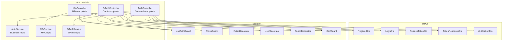
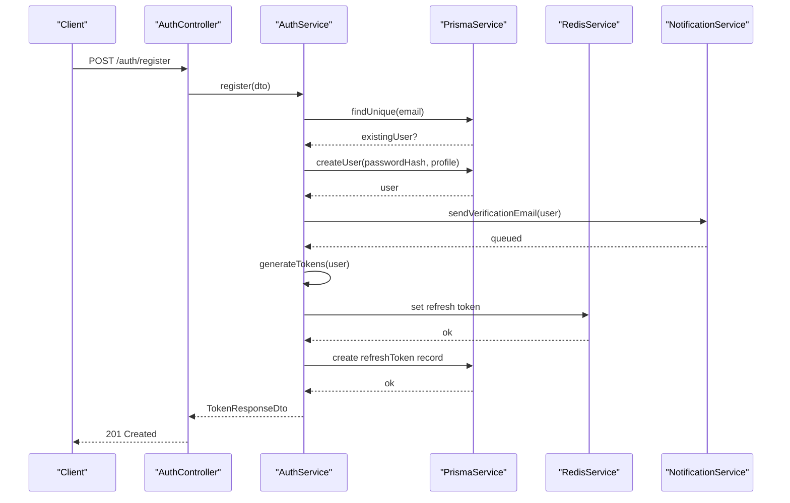
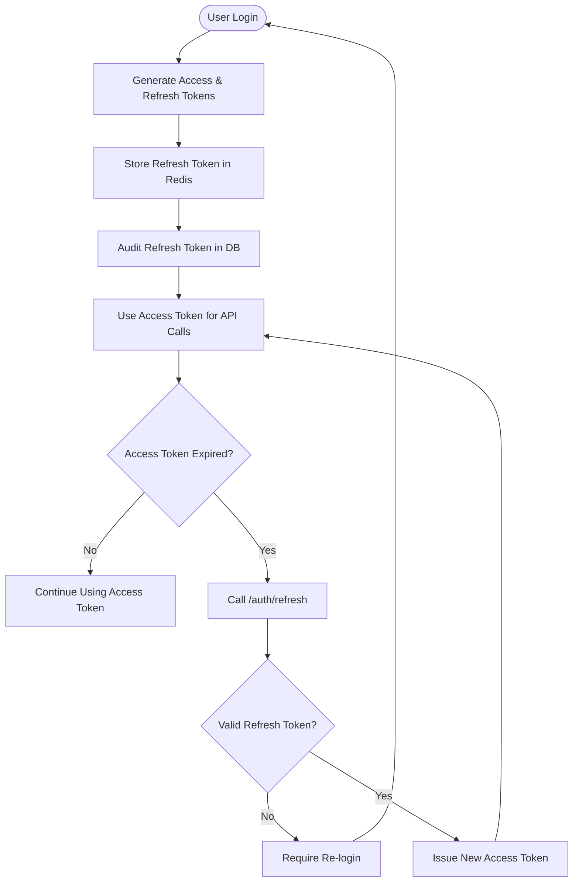
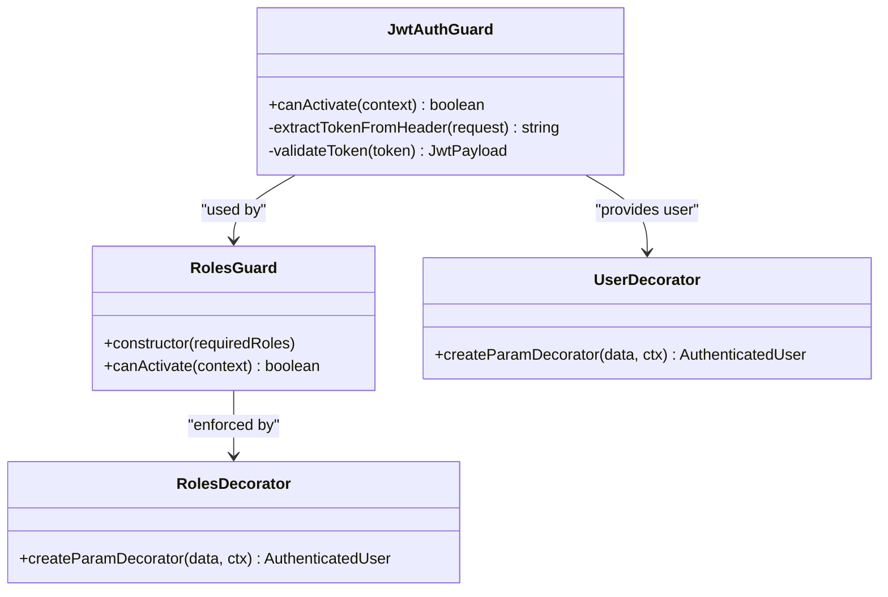
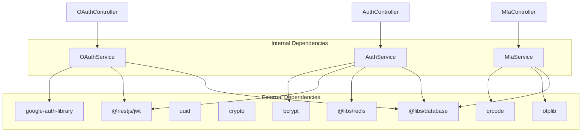

# Authentication API

<cite>
**Referenced Files in This Document**
- [auth.controller.ts](file://apps/api/src/modules/auth/auth.controller.ts)
- [auth.service.ts](file://apps/api/src/modules/auth/auth.service.ts)
- [mfa.controller.ts](file://apps/api/src/modules/auth/mfa/mfa.controller.ts)
- [mfa.service.ts](file://apps/api/src/modules/auth/mfa/mfa.service.ts)
- [oauth.controller.ts](file://apps/api/src/modules/auth/oauth/oauth.controller.ts)
- [oauth.service.ts](file://apps/api/src/modules/auth/oauth/oauth.service.ts)
- [register.dto.ts](file://apps/api/src/modules/auth/dto/register.dto.ts)
- [login.dto.ts](file://apps/api/src/modules/auth/dto/login.dto.ts)
- [refresh-token.dto.ts](file://apps/api/src/modules/auth/dto/refresh-token.dto.ts)
- [token.dto.ts](file://apps/api/src/modules/auth/dto/token.dto.ts)
- [verification.dto.ts](file://apps/api/src/modules/auth/dto/verification.dto.ts)
- [jwt-auth.guard.ts](file://apps/api/src/modules/auth/guards/jwt-auth.guard.ts)
- [roles.guard.ts](file://apps/api/src/modules/auth/guards/roles.guard.ts)
- [roles.decorator.ts](file://apps/api/src/modules/auth/decorators/roles.decorator.ts)
- [user.decorator.ts](file://apps/api/src/modules/auth/decorators/user.decorator.ts)
- [public.decorator.ts](file://apps/api/src/modules/auth/decorators/public.decorator.ts)
- [csrf.guard.ts](file://apps/api/src/common/guards/csrf.guard.ts)
- [auth.ts](file://apps/web/src/api/auth.ts)
- [mfa.ts](file://apps/web/src/api/mfa.ts)
- [client.ts](file://apps/web/src/api/client.ts)
</cite>

## Table of Contents
1. [Introduction](#introduction)
2. [Project Structure](#project-structure)
3. [Core Components](#core-components)
4. [Architecture Overview](#architecture-overview)
5. [Detailed Component Analysis](#detailed-component-analysis)
6. [Dependency Analysis](#dependency-analysis)
7. [Performance Considerations](#performance-considerations)
8. [Troubleshooting Guide](#troubleshooting-guide)
9. [Conclusion](#conclusion)
10. [Appendices](#appendices)

## Introduction
This document provides comprehensive API documentation for Quiz-to-Build's authentication system. It covers all authentication endpoints including registration, login, logout, password reset, and token refresh. It also documents Multi-Factor Authentication (MFA) endpoints for TOTP setup and verification, OAuth integration endpoints for external provider authentication, JWT token management, role-based access control, and permission systems. Security considerations, token expiration, and refresh token handling are included, along with practical examples for frontend integration and SDK usage patterns.

## Project Structure
The authentication system is implemented as a NestJS module with dedicated controllers, services, DTOs, guards, and decorators. The module is organized into three primary areas:
- Core authentication: registration, login, logout, password reset, and token refresh
- Multi-Factor Authentication (MFA): TOTP setup, verification, and management
- OAuth integration: external provider authentication and account linking



**Diagram sources**
- [auth.controller.ts:30-171](file://apps/api/src/modules/auth/auth.controller.ts#L30-L171)
- [auth.service.ts:37-507](file://apps/api/src/modules/auth/auth.service.ts#L37-L507)
- [mfa.controller.ts:23-118](file://apps/api/src/modules/auth/mfa/mfa.controller.ts#L23-L118)
- [mfa.service.ts:22-250](file://apps/api/src/modules/auth/mfa/mfa.service.ts#L22-L250)
- [oauth.controller.ts:51-144](file://apps/api/src/modules/auth/oauth/oauth.controller.ts#L51-L144)
- [oauth.service.ts:56-357](file://apps/api/src/modules/auth/oauth/oauth.service.ts#L56-L357)

**Section sources**
- [auth.controller.ts:1-171](file://apps/api/src/modules/auth/auth.controller.ts#L1-L171)
- [mfa.controller.ts:1-118](file://apps/api/src/modules/auth/mfa/mfa.controller.ts#L1-L118)
- [oauth.controller.ts:1-144](file://apps/api/src/modules/auth/oauth/oauth.controller.ts#L1-L144)

## Core Components
This section outlines the core authentication components and their responsibilities:
- AuthController: Exposes REST endpoints for registration, login, logout, password reset, token refresh, and CSRF token retrieval
- AuthService: Implements business logic for user registration, authentication, token generation, password reset, and email verification
- MfaController: Provides endpoints for MFA status, setup, verification, disabling, and backup code regeneration
- MfaService: Manages TOTP secret generation, QR code creation, backup code generation, and verification logic
- OAuthController: Handles OAuth authentication with Google and Microsoft, account linking, and account management
- OAuthService: Implements OAuth flows, user account linking, and JWT token generation for OAuth users

Key security features:
- JWT-based access tokens with configurable expiration
- Refresh tokens stored in Redis with TTL and database audit trail
- Rate limiting for sensitive endpoints
- CSRF protection for state-changing requests
- Account lockout after failed login attempts
- Password reset and email verification via secure tokens

**Section sources**
- [auth.controller.ts:30-171](file://apps/api/src/modules/auth/auth.controller.ts#L30-L171)
- [auth.service.ts:37-507](file://apps/api/src/modules/auth/auth.service.ts#L37-L507)
- [mfa.controller.ts:23-118](file://apps/api/src/modules/auth/mfa/mfa.controller.ts#L23-L118)
- [mfa.service.ts:22-250](file://apps/api/src/modules/auth/mfa/mfa.service.ts#L22-L250)
- [oauth.controller.ts:51-144](file://apps/api/src/modules/auth/oauth/oauth.controller.ts#L51-L144)
- [oauth.service.ts:56-357](file://apps/api/src/modules/auth/oauth/oauth.service.ts#L56-L357)

## Architecture Overview
The authentication system follows a layered architecture with clear separation of concerns:
- Presentation Layer: Controllers handle HTTP requests and responses
- Application Layer: Services encapsulate business logic
- Infrastructure Layer: Prisma for database operations, Redis for caching and token storage, external providers for OAuth
- Security Layer: Guards, decorators, and middleware for authentication and authorization



**Diagram sources**
- [auth.controller.ts:38-45](file://apps/api/src/modules/auth/auth.controller.ts#L38-L45)
- [auth.service.ts:64-102](file://apps/api/src/modules/auth/auth.service.ts#L64-L102)

**Section sources**
- [auth.controller.ts:30-171](file://apps/api/src/modules/auth/auth.controller.ts#L30-L171)
- [auth.service.ts:37-507](file://apps/api/src/modules/auth/auth.service.ts#L37-L507)

## Detailed Component Analysis

### Core Authentication Endpoints

#### Registration
Registers a new user with email, password, and name. The system enforces strong password requirements and creates a user with CLIENT role. Upon successful registration, a verification email is sent asynchronously, and JWT tokens are generated immediately.

Endpoints:
- POST /auth/register

Request body schema (RegisterDto):
- email: string (required, valid email format)
- password: string (required, minimum 12 characters, requires lowercase, uppercase, and number)
- name: string (required, 2-100 characters)

Response schema (TokenResponseDto):
- accessToken: string
- refreshToken: string
- expiresIn: number (seconds)
- tokenType: string
- user: object containing id, email, role, and optional name

Security considerations:
- Strong password validation prevents weak passwords
- Email uniqueness enforced to prevent duplicates
- Verification email sent asynchronously to avoid blocking registration

**Section sources**
- [auth.controller.ts:38-45](file://apps/api/src/modules/auth/auth.controller.ts#L38-L45)
- [register.dto.ts:4-24](file://apps/api/src/modules/auth/dto/register.dto.ts#L4-L24)
- [auth.service.ts:64-102](file://apps/api/src/modules/auth/auth.service.ts#L64-L102)
- [token.dto.ts](file://apps/api/src/modules/auth/dto/token.dto.ts)

#### Login
Authenticates users with email and password. The system implements account lockout after failed attempts and updates user metadata on successful login.

Endpoints:
- POST /auth/login

Request body schema (LoginDto):
- email: string (required, valid email format)
- password: string (required)

Response schema (TokenResponseDto):
- accessToken: string
- refreshToken: string
- expiresIn: number (seconds)
- tokenType: string
- user: object containing id, email, role, and optional name

Security considerations:
- Account lockout after 5 failed attempts for 15 minutes
- IP address tracking for security monitoring
- Failed attempts increment and lockout enforcement
- Last login timestamp and IP recorded

**Section sources**
- [auth.controller.ts:47-57](file://apps/api/src/modules/auth/auth.controller.ts#L47-L57)
- [login.dto.ts:4-19](file://apps/api/src/modules/auth/dto/login.dto.ts#L4-L19)
- [auth.service.ts:104-145](file://apps/api/src/modules/auth/auth.service.ts#L104-L145)

#### Logout
Invalidates a refresh token, effectively logging out the user across all devices.

Endpoints:
- POST /auth/logout

Request body schema (RefreshTokenDto):
- refreshToken: string (required)

Response:
- message: string indicating successful logout

Security considerations:
- Removes refresh token from Redis cache
- Prevents further token refresh operations
- Immediate session termination

**Section sources**
- [auth.controller.ts:73-81](file://apps/api/src/modules/auth/auth.controller.ts#L73-L81)
- [refresh-token.dto.ts](file://apps/api/src/modules/auth/dto/refresh-token.dto.ts)
- [auth.service.ts:179-183](file://apps/api/src/modules/auth/auth.service.ts#L179-L183)

#### Token Refresh
Generates a new access token using a valid refresh token.

Endpoints:
- POST /auth/refresh

Request body schema (RefreshTokenDto):
- refreshToken: string (required)

Response schema (RefreshResponseDto):
- accessToken: string
- expiresIn: number (seconds)

Security considerations:
- Validates refresh token existence in Redis
- Checks user existence and deletion status
- Generates 15-minute access tokens
- Returns appropriate 401 errors for invalid/expired tokens

**Section sources**
- [auth.controller.ts:59-71](file://apps/api/src/modules/auth/auth.controller.ts#L59-L71)
- [refresh-token.dto.ts](file://apps/api/src/modules/auth/dto/refresh-token.dto.ts)
- [auth.service.ts:147-177](file://apps/api/src/modules/auth/auth.service.ts#L147-L177)

#### Password Reset
Manages password reset workflow with secure token-based verification.

Endpoints:
- POST /auth/forgot-password (request reset)
- POST /auth/reset-password (apply reset)

Forgot password request body schema (RequestPasswordResetDto):
- email: string (required, valid email format)

Reset password request body schema (ResetPasswordDto):
- token: string (required)
- newPassword: string (required, minimum 12 characters)

Response schemas:
- Forgot password: object with message (always succeeds for privacy)
- Reset password: object with message (success)

Security considerations:
- Uses secure random tokens stored in Redis with 1-hour expiry
- Invalidates all user refresh tokens upon password reset
- Prevents email enumeration attacks
- Enforces strong password requirements

**Section sources**
- [auth.controller.ts:117-136](file://apps/api/src/modules/auth/auth.controller.ts#L117-L136)
- [verification.dto.ts](file://apps/api/src/modules/auth/dto/verification.dto.ts)
- [auth.service.ts:390-466](file://apps/api/src/modules/auth/auth.service.ts#L390-L466)

#### Email Verification
Handles email verification during registration and resend verification requests.

Endpoints:
- POST /auth/verify-email
- POST /auth/resend-verification

Verify email request body schema (VerifyEmailDto):
- token: string (required)

Resend verification request body schema (ResendVerificationDto):
- email: string (required, valid email format)

Response schemas:
- Verify email: object with message and verified flag
- Resend verification: object with message

Security considerations:
- Secure tokens with 24-hour expiry
- Prevents account takeover through token replay
- Welcome email sent after successful verification
- Privacy-focused messaging to prevent email enumeration

**Section sources**
- [auth.controller.ts:95-113](file://apps/api/src/modules/auth/auth.controller.ts#L95-L113)
- [verification.dto.ts](file://apps/api/src/modules/auth/dto/verification.dto.ts)
- [auth.service.ts:318-383](file://apps/api/src/modules/auth/auth.service.ts#L318-L383)

#### Profile Endpoint
Retrieves current user profile using JWT authentication.

Endpoints:
- GET /auth/me

Response schema (AuthenticatedUser):
- id: string
- email: string
- role: string
- name: string (optional)

Security considerations:
- Requires valid JWT bearer token
- Protected by JwtAuthGuard
- Returns minimal user information

**Section sources**
- [auth.controller.ts:83-91](file://apps/api/src/modules/auth/auth.controller.ts#L83-L91)
- [auth.service.ts:185-209](file://apps/api/src/modules/auth/auth.service.ts#L185-L209)

#### CSRF Token Endpoint
Generates and sets CSRF tokens for state-changing requests.

Endpoints:
- GET /auth/csrf-token

Response schema:
- csrfToken: string
- message: string (instructions for client)

Security considerations:
- Sets CSRF token in HTTP-only cookie
- Requires clients to include X-CSRF-Token header
- Protects against cross-site request forgery

**Section sources**
- [auth.controller.ts:140-169](file://apps/api/src/modules/auth/auth.controller.ts#L140-L169)
- [csrf.guard.ts](file://apps/api/src/common/guards/csrf.guard.ts)

### Multi-Factor Authentication (MFA) Endpoints

#### MFA Status
Checks whether MFA is enabled for the current user.

Endpoints:
- GET /auth/mfa/status

Response schema (MfaStatusResponseDto):
- enabled: boolean
- backupCodesCount: number

**Section sources**
- [mfa.controller.ts:28-39](file://apps/api/src/modules/auth/mfa/mfa.controller.ts#L28-L39)
- [mfa.service.ts:204-216](file://apps/api/src/modules/auth/mfa/mfa.service.ts#L204-L216)

#### MFA Setup
Initiates MFA setup by generating a secret and QR code for authenticator apps.

Endpoints:
- POST /auth/mfa/setup

Response schema (MfaSetupResponseDto):
- secret: string
- qrCodeDataUrl: string (data URL for QR code)
- manualEntryKey: string (formatted secret for manual entry)

**Section sources**
- [mfa.controller.ts:41-56](file://apps/api/src/modules/auth/mfa/mfa.controller.ts#L41-L56)
- [mfa.service.ts:29-62](file://apps/api/src/modules/auth/mfa/mfa.service.ts#L29-L62)

#### Verify MFA Setup
Verifies the initial TOTP code and enables MFA for the user.

Endpoints:
- POST /auth/mfa/verify-setup

Request body schema (VerifyMfaCodeDto):
- code: string (required, 6-digit TOTP)

Response schema (BackupCodesResponseDto):
- backupCodes: string[] (10 backup codes)

**Section sources**
- [mfa.controller.ts:58-76](file://apps/api/src/modules/auth/mfa/mfa.controller.ts#L58-L76)
- [mfa.service.ts:67-102](file://apps/api/src/modules/auth/mfa/mfa.service.ts#L67-L102)

#### Disable MFA
Disables MFA for the user after verifying the current code.

Endpoints:
- DELETE /auth/mfa/disable

Request body schema (VerifyMfaCodeDto):
- code: string (required, current TOTP or backup code)

Response:
- message: string indicating successful disable

**Section sources**
- [mfa.controller.ts:78-96](file://apps/api/src/modules/auth/mfa/mfa.controller.ts#L78-L96)
- [mfa.service.ts:145-169](file://apps/api/src/modules/auth/mfa/mfa.service.ts#L145-L169)

#### Regenerate Backup Codes
Creates new backup codes while keeping MFA enabled.

Endpoints:
- POST /auth/mfa/backup-codes/regenerate

Request body schema (VerifyMfaCodeDto):
- code: string (required, current TOTP or backup code)

Response schema (BackupCodesResponseDto):
- backupCodes: string[] (10 new backup codes)

**Section sources**
- [mfa.controller.ts:98-116](file://apps/api/src/modules/auth/mfa/mfa.controller.ts#L98-L116)
- [mfa.service.ts:174-199](file://apps/api/src/modules/auth/mfa/mfa.service.ts#L174-L199)

### OAuth Integration Endpoints

#### Google Authentication
Authenticates users via Google OAuth using ID tokens.

Endpoints:
- POST /auth/oauth/google

Request body:
- idToken: string (required, Google ID token)

Response schema (AuthResponse):
- accessToken: string
- refreshToken: string
- user: object with id, email, name, and optional picture
- isNewUser: boolean

Security considerations:
- Validates Google ID token with client secret
- Extracts verified email and profile information
- Creates or links user accounts automatically

**Section sources**
- [oauth.controller.ts:59-65](file://apps/api/src/modules/auth/oauth/oauth.controller.ts#L59-L65)
- [oauth.service.ts:76-108](file://apps/api/src/modules/auth/oauth/oauth.service.ts#L76-L108)

#### Microsoft Authentication
Authenticates users via Microsoft OAuth using access tokens.

Endpoints:
- POST /auth/oauth/microsoft

Request body:
- accessToken: string (required, Microsoft Graph access token)

Response schema (AuthResponse):
- accessToken: string
- refreshToken: string
- user: object with id, email, name, and optional picture
- isNewUser: boolean

Security considerations:
- Fetches user profile from Microsoft Graph API
- Uses verified email from Microsoft
- Supports both existing and new user flows

**Section sources**
- [oauth.controller.ts:71-77](file://apps/api/src/modules/auth/oauth/oauth.controller.ts#L71-L77)
- [oauth.service.ts:113-152](file://apps/api/src/modules/auth/oauth/oauth.service.ts#L113-L152)

#### Linked Accounts Management
Manages OAuth accounts for authenticated users.

Endpoints:
- GET /auth/oauth/accounts
- POST /auth/oauth/link
- DELETE /auth/oauth/unlink/:provider

Response schemas:
- Linked accounts: array of provider, email, and linkedAt
- Link account: object with success and provider
- Unlink account: object with success and provider

Security considerations:
- Prevents unlinking the only authentication method
- Validates OAuth account ownership
- Maintains account security by requiring verification codes

**Section sources**
- [oauth.controller.ts:82-142](file://apps/api/src/modules/auth/oauth/oauth.controller.ts#L82-L142)
- [oauth.service.ts:247-308](file://apps/api/src/modules/auth/oauth/oauth.service.ts#L247-L308)

### JWT Token Management
The system implements robust JWT-based authentication with the following characteristics:
- Access tokens: 15-minute expiration, signed with HS256
- Refresh tokens: UUID-based, stored in Redis with TTL, audited in database
- Token payload includes user ID, email, and role
- Refresh tokens invalidated on password reset
- Support for concurrent sessions with multiple refresh tokens

Token lifecycle:


**Diagram sources**
- [auth.service.ts:211-247](file://apps/api/src/modules/auth/auth.service.ts#L211-L247)
- [auth.service.ts:147-177](file://apps/api/src/modules/auth/auth.service.ts#L147-L177)

**Section sources**
- [auth.service.ts:211-247](file://apps/api/src/modules/auth/auth.service.ts#L211-L247)
- [auth.service.ts:147-177](file://apps/api/src/modules/auth/auth.service.ts#L147-L177)

### Role-Based Access Control
The authentication system supports role-based access control with the following roles:
- CLIENT: Standard user role
- ADMIN: Administrative privileges
- SUPER_ADMIN: Highest level of access

Role enforcement mechanisms:
- JwtAuthGuard validates JWT tokens and extracts user roles
- RolesGuard restricts access based on required roles
- RolesDecorator specifies required roles for endpoints
- UserDecorator provides access to authenticated user data



**Diagram sources**
- [jwt-auth.guard.ts](file://apps/api/src/modules/auth/guards/jwt-auth.guard.ts)
- [roles.guard.ts](file://apps/api/src/modules/auth/guards/roles.guard.ts)
- [roles.decorator.ts](file://apps/api/src/modules/auth/decorators/roles.decorator.ts)
- [user.decorator.ts](file://apps/api/src/modules/auth/decorators/user.decorator.ts)

**Section sources**
- [jwt-auth.guard.ts](file://apps/api/src/modules/auth/guards/jwt-auth.guard.ts)
- [roles.guard.ts](file://apps/api/src/modules/auth/guards/roles.guard.ts)
- [roles.decorator.ts](file://apps/api/src/modules/auth/decorators/roles.decorator.ts)
- [user.decorator.ts](file://apps/api/src/modules/auth/decorators/user.decorator.ts)

### Frontend Integration Examples

#### Basic Authentication Flow
```typescript
// Example: Registration
const register = async (email: string, password: string, name: string) => {
  const response = await fetch('/auth/register', {
    method: 'POST',
    headers: { 'Content-Type': 'application/json' },
    body: JSON.stringify({ email, password, name })
  });
  const tokens = await response.json();
  // Store tokens in secure storage
  localStorage.setItem('accessToken', tokens.accessToken);
  localStorage.setItem('refreshToken', tokens.refreshToken);
};

// Example: Login
const login = async (email: string, password: string) => {
  const response = await fetch('/auth/login', {
    method: 'POST',
    headers: { 'Content-Type': 'application/json' },
    body: JSON.stringify({ email, password })
  });
  const tokens = await response.json();
  // Store tokens securely
  setTokens(tokens);
};

// Example: Protected API Call
const fetchProtectedData = async () => {
  const accessToken = localStorage.getItem('accessToken');
  const response = await fetch('/auth/me', {
    headers: {
      'Authorization': `Bearer ${accessToken}`
    }
  });
  return response.json();
};
```

#### MFA Integration
```typescript
// Example: Enable MFA
const enableMfa = async () => {
  // Step 1: Get MFA setup data
  const setupResponse = await fetch('/auth/mfa/setup', {
    method: 'POST',
    headers: { 'Authorization': `Bearer ${accessToken}` }
  });
  const setupData = await setupResponse.json();
  
  // Step 2: User scans QR code with authenticator app
  // Step 3: Verify setup with generated code
  const verifyResponse = await fetch('/auth/mfa/verify-setup', {
    method: 'POST',
    headers: { 
      'Authorization': `Bearer ${accessToken}`,
      'Content-Type': 'application/json'
    },
    body: JSON.stringify({ code: userEnteredCode })
  });
  
  const backupCodes = await verifyResponse.json();
  // Store backup codes securely
};
```

#### OAuth Integration
```typescript
// Example: Google OAuth
const googleLogin = async (idToken: string) => {
  const response = await fetch('/auth/oauth/google', {
    method: 'POST',
    headers: { 'Content-Type': 'application/json' },
    body: JSON.stringify({ idToken })
  });
  const authResponse = await response.json();
  setTokens(authResponse);
};

// Example: Link OAuth Account
const linkOAuthAccount = async (provider: string, accessToken: string) => {
  const response = await fetch('/auth/oauth/link', {
    method: 'POST',
    headers: {
      'Authorization': `Bearer ${accessToken}`,
      'Content-Type': 'application/json'
    },
    body: JSON.stringify({ provider, accessToken })
  });
  return response.json();
};
```

**Section sources**
- [auth.ts](file://apps/web/src/api/auth.ts)
- [mfa.ts](file://apps/web/src/api/mfa.ts)
- [client.ts](file://apps/web/src/api/client.ts)

## Dependency Analysis
The authentication system has well-defined dependencies between components:



**Diagram sources**
- [auth.service.ts:1-507](file://apps/api/src/modules/auth/auth.service.ts#L1-L507)
- [mfa.service.ts:1-250](file://apps/api/src/modules/auth/mfa/mfa.service.ts#L1-L250)
- [oauth.service.ts:1-357](file://apps/api/src/modules/auth/oauth/oauth.service.ts#L1-L357)

**Section sources**
- [auth.service.ts:1-507](file://apps/api/src/modules/auth/auth.service.ts#L1-L507)
- [mfa.service.ts:1-250](file://apps/api/src/modules/auth/mfa/mfa.service.ts#L1-L250)
- [oauth.service.ts:1-357](file://apps/api/src/modules/auth/oauth/oauth.service.ts#L1-L357)

## Performance Considerations
- Redis caching reduces database load for token validation and verification operations
- Asynchronous email sending prevents blocking user registration/login flows
- Rate limiting protects against brute force attacks while maintaining good UX
- JWT token generation is optimized with parallel signing operations
- Database queries use selective field retrieval to minimize payload sizes

## Troubleshooting Guide
Common authentication issues and solutions:

### Login Failures
- Invalid credentials: Check email/password combination and ensure account is not locked
- Account locked: Wait for lockout period (15 minutes) or contact support
- Network connectivity: Verify Redis and database availability

### Token Issues
- Invalid/expired refresh token: Require user to re-authenticate
- Access token expiration: Implement automatic refresh using refresh token
- Token storage: Ensure secure, HTTP-only storage for production

### MFA Problems
- TOTP code invalid: Verify authenticator app time synchronization
- Lost backup codes: Use remaining backup codes or regenerate
- MFA enabled but verification fails: Check secret validity and code format

### OAuth Integration
- Provider authentication failures: Verify client credentials and scopes
- Account linking conflicts: Ensure OAuth account is not already linked
- Profile fetching errors: Check provider API availability and permissions

**Section sources**
- [auth.service.ts:125-129](file://apps/api/src/modules/auth/auth.service.ts#L125-L129)
- [auth.service.ts:151-153](file://apps/api/src/modules/auth/auth.service.ts#L151-L153)
- [mfa.service.ts:82-87](file://apps/api/src/modules/auth/mfa/mfa.service.ts#L82-L87)
- [oauth.service.ts:104-107](file://apps/api/src/modules/auth/oauth/oauth.service.ts#L104-L107)

## Conclusion
Quiz-to-Build's authentication system provides comprehensive security features including JWT-based authentication, refresh token management, multi-factor authentication, and OAuth integration. The system balances security with usability through rate limiting, account lockout, and user-friendly MFA flows. The modular architecture ensures maintainability and extensibility for future authentication enhancements.

## Appendices

### API Reference Summary

#### Core Authentication
- POST /auth/register: Register new user
- POST /auth/login: User login
- POST /auth/logout: Logout user
- POST /auth/refresh: Refresh access token
- GET /auth/me: Get current user profile
- POST /auth/forgot-password: Request password reset
- POST /auth/reset-password: Reset user password
- POST /auth/verify-email: Verify email address
- POST /auth/resend-verification: Resend verification email
- GET /auth/csrf-token: Get CSRF token

#### Multi-Factor Authentication
- GET /auth/mfa/status: Check MFA status
- POST /auth/mfa/setup: Initiate MFA setup
- POST /auth/mfa/verify-setup: Verify MFA setup
- DELETE /auth/mfa/disable: Disable MFA
- POST /auth/mfa/backup-codes/regenerate: Regenerate backup codes

#### OAuth Integration
- POST /auth/oauth/google: Google authentication
- POST /auth/oauth/microsoft: Microsoft authentication
- GET /auth/oauth/accounts: List linked accounts
- POST /auth/oauth/link: Link OAuth account
- DELETE /auth/oauth/unlink/:provider: Unlink OAuth account

### Security Headers and Requirements
- Authorization: Bearer <access-token> for protected endpoints
- X-CSRF-Token: Required for state-changing requests
- Content-Type: application/json for JSON endpoints
- HTTPS: All authentication endpoints require secure transport

### Error Codes
- 200: Successful operation
- 201: Resource created (registration)
- 400: Bad request (validation errors, invalid tokens)
- 401: Unauthorized (invalid/expired tokens)
- 403: Forbidden (MFA verification failed)
- 409: Conflict (user exists, OAuth conflict)
- 429: Too many requests (rate limiting)