# Business Operations API

<cite>
**Referenced Files in This Document**
- [main.ts](file://apps/api/src/main.ts)
- [app.module.ts](file://apps/api/src/app.module.ts)
- [payment.controller.ts](file://apps/api/src/modules/payment/payment.controller.ts)
- [payment.service.ts](file://apps/api/src/modules/payment/payment.service.ts)
- [subscription.service.ts](file://apps/api/src/modules/payment/subscription.service.ts)
- [billing.service.ts](file://apps/api/src/modules/payment/billing.service.ts)
- [stripe-webhook.controller.ts](file://apps/api/src/modules/document-commerce/stripe-webhook.controller.ts)
- [projects.module.ts](file://apps/api/src/modules/projects/projects.module.ts)
- [projects.controller.ts](file://apps/api/src/modules/projects/projects.controller.ts)
- [projects.service.ts](file://apps/api/src/modules/projects/projects.service.ts)
- [evidence-registry.controller.ts](file://apps/api/src/modules/evidence-registry/evidence-registry.controller.ts)
- [evidence-registry.service.ts](file://apps/api/src/modules/evidence-registry/evidence-registry.service.ts)
- [evidence-integrity.service.ts](file://apps/api/src/modules/evidence-registry/evidence-integrity.service.ts)
- [ci-artifact-ingestion.service.ts](file://apps/api/src/modules/evidence-registry/ci-artifact-ingestion.service.ts)
- [decision-log.controller.ts](file://apps/api/src/modules/decision-log/decision-log.controller.ts)
- [decision-log.service.ts](file://apps/api/src/modules/decision-log/decision-log.service.ts)
- [approval-workflow.service.ts](file://apps/api/src/modules/decision-log/approval-workflow.service.ts)
- [heatmap.controller.ts](file://apps/api/src/modules/heatmap/heatmap.controller.ts)
- [heatmap.service.ts](file://apps/api/src/modules/heatmap/heatmap.service.ts)
- [policy-pack.controller.ts](file://apps/api/src/modules/policy-pack/policy-pack.controller.ts)
- [policy-pack.service.ts](file://apps/api/src/modules/policy-pack/policy-pack.service.ts)
- [standards.controller.ts](file://apps/api/src/modules/standards/standards.controller.ts)
- [standards.service.ts](file://apps/api/src/modules/standards/standards.service.ts)
- [notification.controller.ts](file://apps/api/src/modules/notifications/notification.controller.ts)
- [teams-webhook.controller.ts](file://apps/api/src/modules/notifications/teams-webhook.controller.ts)
- [billing.ts](file://apps/web/src/api/billing.ts)
</cite>

## Table of Contents
1. [Introduction](#introduction)
2. [Project Structure](#project-structure)
3. [Core Components](#core-components)
4. [Architecture Overview](#architecture-overview)
5. [Detailed Component Analysis](#detailed-component-analysis)
6. [Dependency Analysis](#dependency-analysis)
7. [Performance Considerations](#performance-considerations)
8. [Troubleshooting Guide](#troubleshooting-guide)
9. [Conclusion](#conclusion)
10. [Appendices](#appendices)

## Introduction
This document provides comprehensive API documentation for business operations endpoints powering payment processing, subscription management, billing operations, project lifecycle management, evidence registry ingestion, decision log tracking, policy pack generation, standards management, and heatmap analytics. It also covers webhook integrations, audit trails, and compliance reporting. The API is built with NestJS and exposes OpenAPI/Swagger documentation under a configurable global prefix. Authentication relies on bearer tokens, while security headers and rate limiting protect endpoints.

## Project Structure
The API server initializes modules, middleware, and Swagger documentation. Modules are conditionally loaded, including legacy modules gated by an environment variable. Payment-related modules include controllers, services, and Stripe webhook handling. Evidence registry, decision log, policy pack, standards, and heatmap modules provide specialized business capabilities.

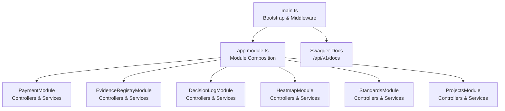

**Diagram sources**
- [main.ts:28-329](file://apps/api/src/main.ts#L28-L329)
- [app.module.ts:53-129](file://apps/api/src/app.module.ts#L53-L129)

**Section sources**
- [main.ts:28-329](file://apps/api/src/main.ts#L28-L329)
- [app.module.ts:53-129](file://apps/api/src/app.module.ts#L53-L129)

## Core Components
- Payment and Billing
  - Checkout sessions, customer portal, subscription lifecycle, invoices, usage stats, and Stripe webhook handling.
- Project Lifecycle Management
  - Multi-project workspace management with CRUD operations and state transitions.
- Evidence Registry
  - Evidence ingestion, integrity verification, and CI artifact ingestion.
- Decision Log
  - Append-only decision records, supersession, approval workflow, and audit export.
- Policy Pack and Standards
  - Policy pack generation and standards management endpoints.
- Heatmap Analytics
  - Heatmap computation and retrieval endpoints.
- Notifications and Webhooks
  - Teams webhook integration and notification delivery.

**Section sources**
- [payment.controller.ts](file://apps/api/src/modules/payment/payment.controller.ts)
- [payment.service.ts](file://apps/api/src/modules/payment/payment.service.ts)
- [subscription.service.ts](file://apps/api/src/modules/payment/subscription.service.ts)
- [billing.service.ts](file://apps/api/src/modules/payment/billing.service.ts)
- [projects.controller.ts](file://apps/api/src/modules/projects/projects.controller.ts)
- [projects.service.ts](file://apps/api/src/modules/projects/projects.service.ts)
- [evidence-registry.controller.ts](file://apps/api/src/modules/evidence-registry/evidence-registry.controller.ts)
- [evidence-registry.service.ts](file://apps/api/src/modules/evidence-registry/evidence-registry.service.ts)
- [evidence-integrity.service.ts](file://apps/api/src/modules/evidence-registry/evidence-integrity.service.ts)
- [ci-artifact-ingestion.service.ts](file://apps/api/src/modules/evidence-registry/ci-artifact-ingestion.service.ts)
- [decision-log.controller.ts](file://apps/api/src/modules/decision-log/decision-log.controller.ts)
- [decision-log.service.ts](file://apps/api/src/modules/decision-log/decision-log.service.ts)
- [approval-workflow.service.ts](file://apps/api/src/modules/decision-log/approval-workflow.service.ts)
- [heatmap.controller.ts](file://apps/api/src/modules/heatmap/heatmap.controller.ts)
- [heatmap.service.ts](file://apps/api/src/modules/heatmap/heatmap.service.ts)
- [policy-pack.controller.ts](file://apps/api/src/modules/policy-pack/policy-pack.controller.ts)
- [policy-pack.service.ts](file://apps/api/src/modules/policy-pack/policy-pack.service.ts)
- [standards.controller.ts](file://apps/api/src/modules/standards/standards.controller.ts)
- [standards.service.ts](file://apps/api/src/modules/standards/standards.service.ts)
- [notification.controller.ts](file://apps/api/src/modules/notifications/notification.controller.ts)
- [teams-webhook.controller.ts](file://apps/api/src/modules/notifications/teams-webhook.controller.ts)

## Architecture Overview
The API follows a modular NestJS architecture. Controllers expose HTTP endpoints, services encapsulate business logic, and database access is handled by Prisma. Middleware includes compression, security headers, CORS, rate limiting, and structured logging. Swagger is conditionally enabled for development.

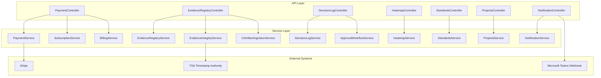

**Diagram sources**
- [payment.controller.ts](file://apps/api/src/modules/payment/payment.controller.ts)
- [payment.service.ts](file://apps/api/src/modules/payment/payment.service.ts)
- [subscription.service.ts](file://apps/api/src/modules/payment/subscription.service.ts)
- [billing.service.ts](file://apps/api/src/modules/payment/billing.service.ts)
- [evidence-registry.controller.ts](file://apps/api/src/modules/evidence-registry/evidence-registry.controller.ts)
- [evidence-registry.service.ts](file://apps/api/src/modules/evidence-registry/evidence-registry.service.ts)
- [evidence-integrity.service.ts](file://apps/api/src/modules/evidence-registry/evidence-integrity.service.ts)
- [ci-artifact-ingestion.service.ts](file://apps/api/src/modules/evidence-registry/ci-artifact-ingestion.service.ts)
- [decision-log.controller.ts](file://apps/api/src/modules/decision-log/decision-log.controller.ts)
- [decision-log.service.ts](file://apps/api/src/modules/decision-log/decision-log.service.ts)
- [approval-workflow.service.ts](file://apps/api/src/modules/decision-log/approval-workflow.service.ts)
- [heatmap.controller.ts](file://apps/api/src/modules/heatmap/heatmap.controller.ts)
- [heatmap.service.ts](file://apps/api/src/modules/heatmap/heatmap.service.ts)
- [standards.controller.ts](file://apps/api/src/modules/standards/standards.controller.ts)
- [standards.service.ts](file://apps/api/src/modules/standards/standards.service.ts)
- [projects.controller.ts](file://apps/api/src/modules/projects/projects.controller.ts)
- [projects.service.ts](file://apps/api/src/modules/projects/projects.service.ts)
- [notification.controller.ts](file://apps/api/src/modules/notifications/notification.controller.ts)

## Detailed Component Analysis

### Payment Processing and Subscription Management
Endpoints manage checkout sessions, customer portal links, subscription cancellation/resumption, and Stripe webhook events. Billing operations include invoice retrieval and usage statistics. The Stripe webhook controller handles signed events.

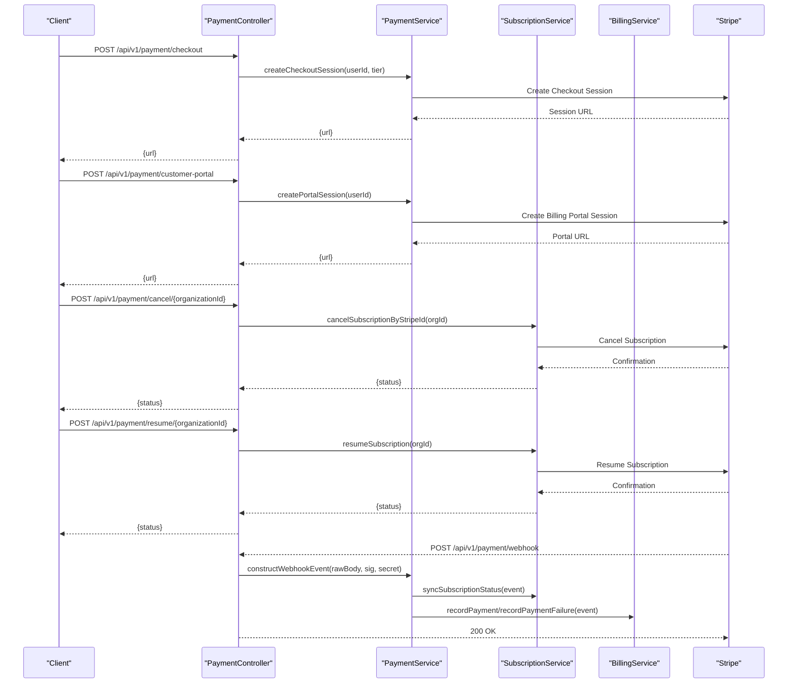

**Diagram sources**
- [payment.controller.ts](file://apps/api/src/modules/payment/payment.controller.ts)
- [payment.service.ts](file://apps/api/src/modules/payment/payment.service.ts)
- [subscription.service.ts](file://apps/api/src/modules/payment/subscription.service.ts)
- [billing.service.ts](file://apps/api/src/modules/payment/billing.service.ts)
- [stripe-webhook.controller.ts](file://apps/api/src/modules/document-commerce/stripe-webhook.controller.ts)

**Section sources**
- [payment.controller.ts](file://apps/api/src/modules/payment/payment.controller.ts)
- [payment.service.ts](file://apps/api/src/modules/payment/payment.service.ts)
- [subscription.service.ts](file://apps/api/src/modules/payment/subscription.service.ts)
- [billing.service.ts](file://apps/api/src/modules/payment/billing.service.ts)
- [stripe-webhook.controller.ts](file://apps/api/src/modules/document-commerce/stripe-webhook.controller.ts)

### Billing Operations
- Retrieve invoices for an organization.
- Fetch usage statistics for billing insights.
- Record successful and failed payments for audit and reconciliation.

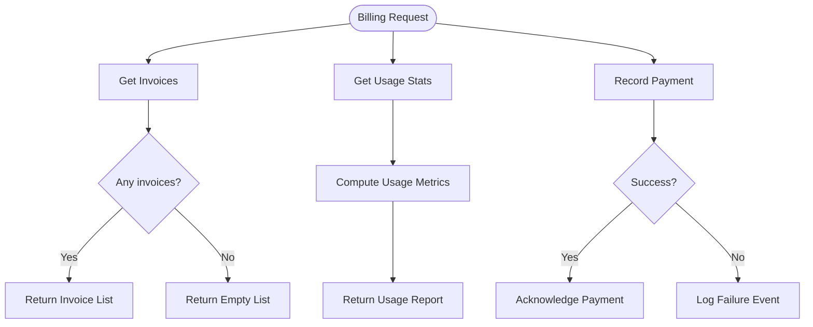

**Diagram sources**
- [billing.service.ts](file://apps/api/src/modules/payment/billing.service.ts)

**Section sources**
- [billing.service.ts](file://apps/api/src/modules/payment/billing.service.ts)

### Project Lifecycle Management
Projects module provides multi-project workspace management with controllers and services. The module imports Prisma for persistence.

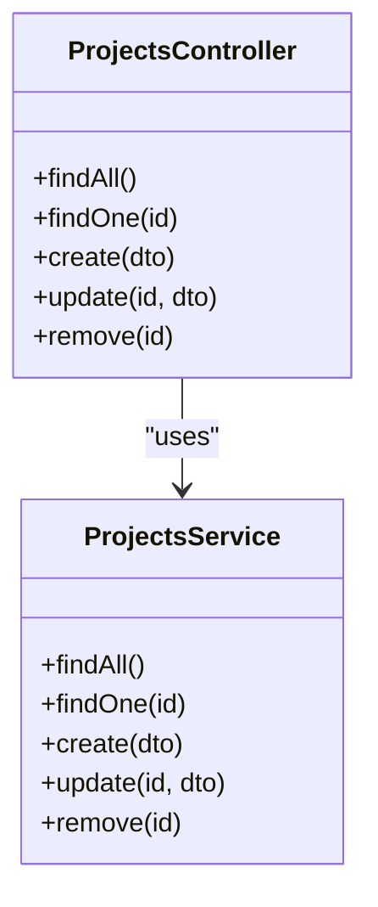

**Diagram sources**
- [projects.controller.ts](file://apps/api/src/modules/projects/projects.controller.ts)
- [projects.service.ts](file://apps/api/src/modules/projects/projects.service.ts)
- [projects.module.ts](file://apps/api/src/modules/projects/projects.module.ts)

**Section sources**
- [projects.controller.ts](file://apps/api/src/modules/projects/projects.controller.ts)
- [projects.service.ts](file://apps/api/src/modules/projects/projects.service.ts)
- [projects.module.ts](file://apps/api/src/modules/projects/projects.module.ts)

### Evidence Registry Ingestion and Integrity
Evidence registry supports ingestion of artifacts and integrity verification against a TSA. Integrity checks include hash validation and timestamp verification.

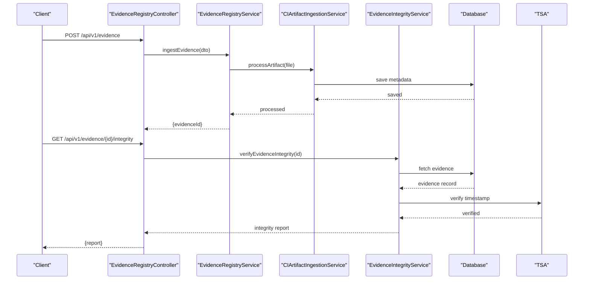

**Diagram sources**
- [evidence-registry.controller.ts](file://apps/api/src/modules/evidence-registry/evidence-registry.controller.ts)
- [evidence-registry.service.ts](file://apps/api/src/modules/evidence-registry/evidence-registry.service.ts)
- [ci-artifact-ingestion.service.ts](file://apps/api/src/modules/evidence-registry/ci-artifact-ingestion.service.ts)
- [evidence-integrity.service.ts](file://apps/api/src/modules/evidence-registry/evidence-integrity.service.ts)

**Section sources**
- [evidence-registry.controller.ts](file://apps/api/src/modules/evidence-registry/evidence-registry.controller.ts)
- [evidence-registry.service.ts](file://apps/api/src/modules/evidence-registry/evidence-registry.service.ts)
- [ci-artifact-ingestion.service.ts](file://apps/api/src/modules/evidence-registry/ci-artifact-ingestion.service.ts)
- [evidence-integrity.service.ts](file://apps/api/src/modules/evidence-registry/evidence-integrity.service.ts)

### Decision Log Tracking and Compliance
Decision log maintains append-only records with status workflow and approval gating. Audit trails can be exported for compliance.

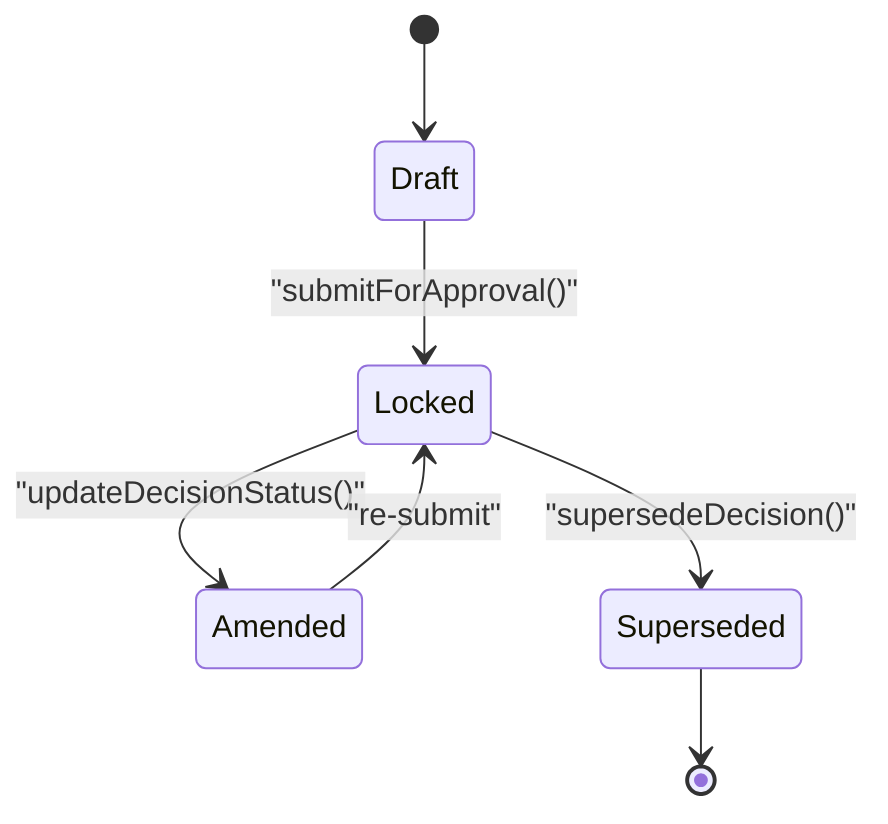

**Diagram sources**
- [decision-log.service.ts](file://apps/api/src/modules/decision-log/decision-log.service.ts)
- [approval-workflow.service.ts](file://apps/api/src/modules/decision-log/approval-workflow.service.ts)

**Section sources**
- [decision-log.controller.ts](file://apps/api/src/modules/decision-log/decision-log.controller.ts)
- [decision-log.service.ts](file://apps/api/src/modules/decision-log/decision-log.service.ts)
- [approval-workflow.service.ts](file://apps/api/src/modules/decision-log/approval-workflow.service.ts)

### Policy Pack Generation and Standards Management
Policy pack and standards modules provide endpoints for generating policy packs and managing standards. These are part of the broader business operations suite.

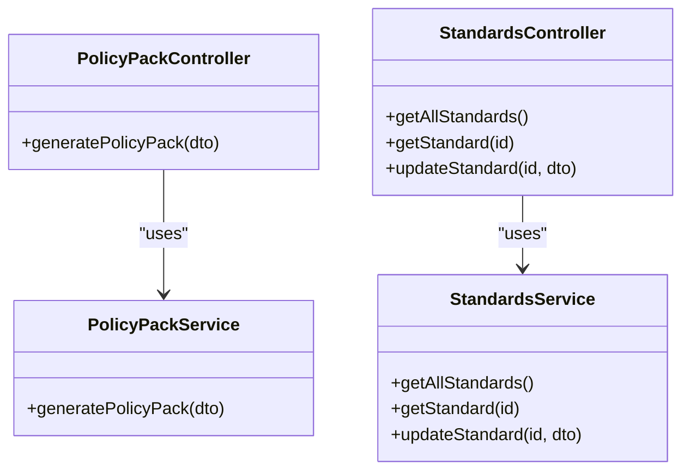

**Diagram sources**
- [policy-pack.controller.ts](file://apps/api/src/modules/policy-pack/policy-pack.controller.ts)
- [policy-pack.service.ts](file://apps/api/src/modules/policy-pack/policy-pack.service.ts)
- [standards.controller.ts](file://apps/api/src/modules/standards/standards.controller.ts)
- [standards.service.ts](file://apps/api/src/modules/standards/standards.service.ts)

**Section sources**
- [policy-pack.controller.ts](file://apps/api/src/modules/policy-pack/policy-pack.controller.ts)
- [policy-pack.service.ts](file://apps/api/src/modules/policy-pack/policy-pack.service.ts)
- [standards.controller.ts](file://apps/api/src/modules/standards/standards.controller.ts)
- [standards.service.ts](file://apps/api/src/modules/standards/standards.service.ts)

### Heatmap Analytics
Heatmap endpoints compute and retrieve analytics across readiness dimensions.

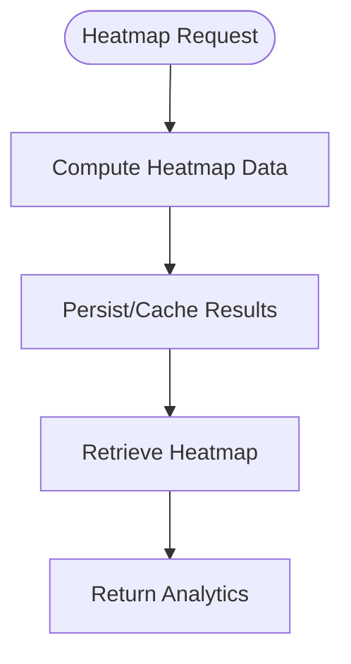

**Diagram sources**
- [heatmap.controller.ts](file://apps/api/src/modules/heatmap/heatmap.controller.ts)
- [heatmap.service.ts](file://apps/api/src/modules/heatmap/heatmap.service.ts)

**Section sources**
- [heatmap.controller.ts](file://apps/api/src/modules/heatmap/heatmap.controller.ts)
- [heatmap.service.ts](file://apps/api/src/modules/heatmap/heatmap.service.ts)

### Notifications and Webhooks
Teams webhook integration enables compliance and operational notifications.

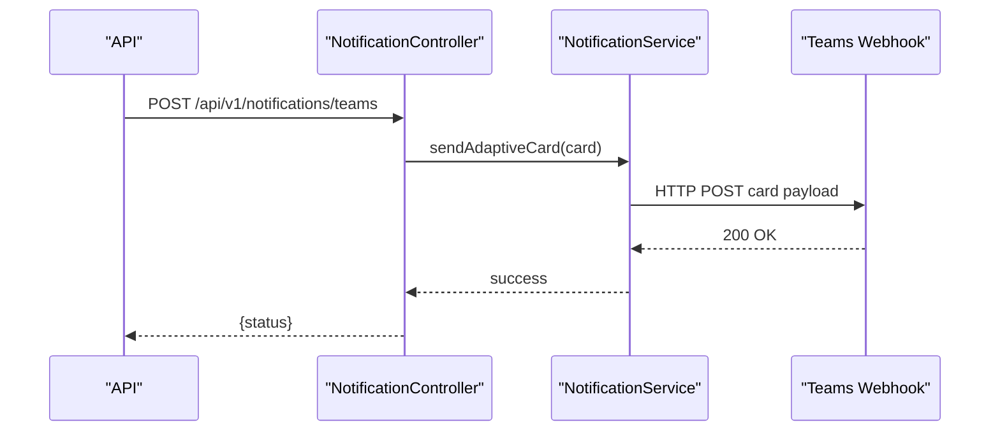

**Diagram sources**
- [notification.controller.ts](file://apps/api/src/modules/notifications/notification.controller.ts)
- [teams-webhook.controller.ts](file://apps/api/src/modules/notifications/teams-webhook.controller.ts)

**Section sources**
- [notification.controller.ts](file://apps/api/src/modules/notifications/notification.controller.ts)
- [teams-webhook.controller.ts](file://apps/api/src/modules/notifications/teams-webhook.controller.ts)

## Dependency Analysis
The API composes multiple modules, enabling a clean separation of concerns. Controllers depend on services, and services rely on external systems (Stripe, TSA) and the database via Prisma.

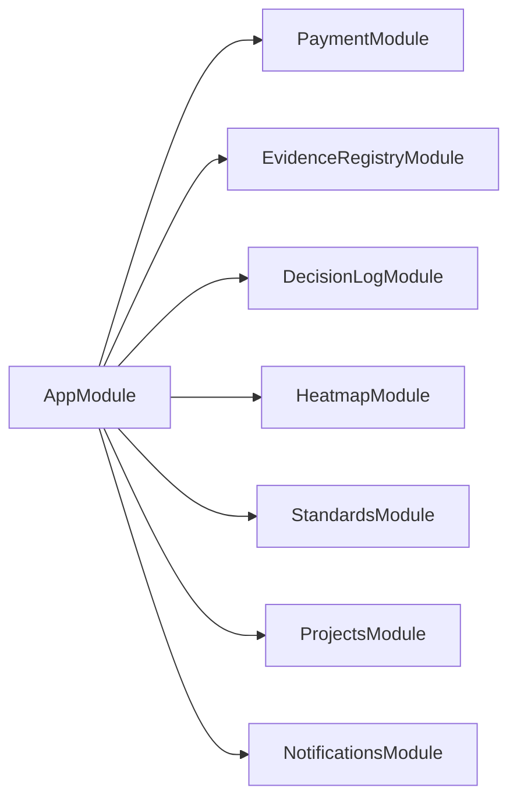

**Diagram sources**
- [app.module.ts:53-129](file://apps/api/src/app.module.ts#L53-L129)

**Section sources**
- [app.module.ts:53-129](file://apps/api/src/app.module.ts#L53-L129)

## Performance Considerations
- Compression is selectively applied to avoid interfering with streaming endpoints.
- Rate limiting guards are configured globally.
- Validation pipe enforces input sanitization and transformation.
- Structured logging and telemetry are integrated for observability.

[No sources needed since this section provides general guidance]

## Troubleshooting Guide
- Bootstrap failures are captured and logged, with Sentry integration for error tracking.
- Stripe webhook signature verification requires rawBody buffering and a configured webhook secret.
- CORS and security headers should be validated if cross-origin requests fail.
- For legacy modules (Evidence Registry, Decision Log, QPG, Policy Pack), ensure the feature flag is set appropriately.

**Section sources**
- [main.ts:319-328](file://apps/api/src/main.ts#L319-L328)
- [main.ts:31-33](file://apps/api/src/main.ts#L31-L33)

## Conclusion
The Business Operations API provides a robust foundation for payment processing, subscription management, billing operations, project lifecycle management, evidence registry ingestion, decision log tracking, policy pack generation, standards management, and heatmap analytics. With modular design, strong security defaults, and optional legacy features, it supports scalable and compliant business workflows.

[No sources needed since this section summarizes without analyzing specific files]

## Appendices

### Endpoints Overview
- Payment
  - POST /api/v1/payment/checkout
  - POST /api/v1/payment/customer-portal
  - POST /api/v1/payment/cancel/{organizationId}
  - POST /api/v1/payment/resume/{organizationId}
  - POST /api/v1/payment/webhook
- Billing
  - GET /api/v1/billing/invoices
  - GET /api/v1/billing/usage
  - POST /api/v1/billing/record-payment
- Projects
  - GET /api/v1/projects
  - GET /api/v1/projects/{id}
  - POST /api/v1/projects
  - PUT /api/v1/projects/{id}
  - DELETE /api/v1/projects/{id}
- Evidence Registry
  - POST /api/v1/evidence
  - GET /api/v1/evidence/{id}/integrity
- Decision Log
  - POST /api/v1/decisions
  - PUT /api/v1/decisions/{id}
  - POST /api/v1/decisions/{id}/supersede
  - GET /api/v1/decisions/export-audit
- Policy Pack
  - POST /api/v1/policy-pack/generate
- Standards
  - GET /api/v1/standards
  - GET /api/v1/standards/{id}
  - PUT /api/v1/standards/{id}
- Heatmap
  - GET /api/v1/heatmap
- Notifications
  - POST /api/v1/notifications/teams

**Section sources**
- [payment.controller.ts](file://apps/api/src/modules/payment/payment.controller.ts)
- [billing.ts](file://apps/web/src/api/billing.ts)
- [projects.controller.ts](file://apps/api/src/modules/projects/projects.controller.ts)
- [evidence-registry.controller.ts](file://apps/api/src/modules/evidence-registry/evidence-registry.controller.ts)
- [decision-log.controller.ts](file://apps/api/src/modules/decision-log/decision-log.controller.ts)
- [policy-pack.controller.ts](file://apps/api/src/modules/policy-pack/policy-pack.controller.ts)
- [standards.controller.ts](file://apps/api/src/modules/standards/standards.controller.ts)
- [heatmap.controller.ts](file://apps/api/src/modules/heatmap/heatmap.controller.ts)
- [notification.controller.ts](file://apps/api/src/modules/notifications/notification.controller.ts)