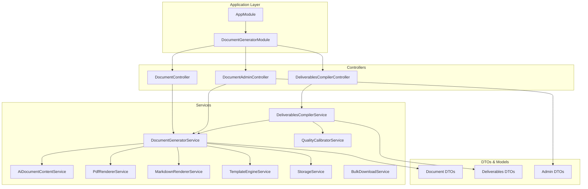
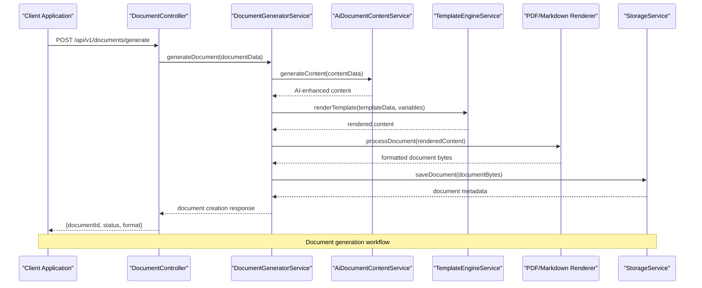
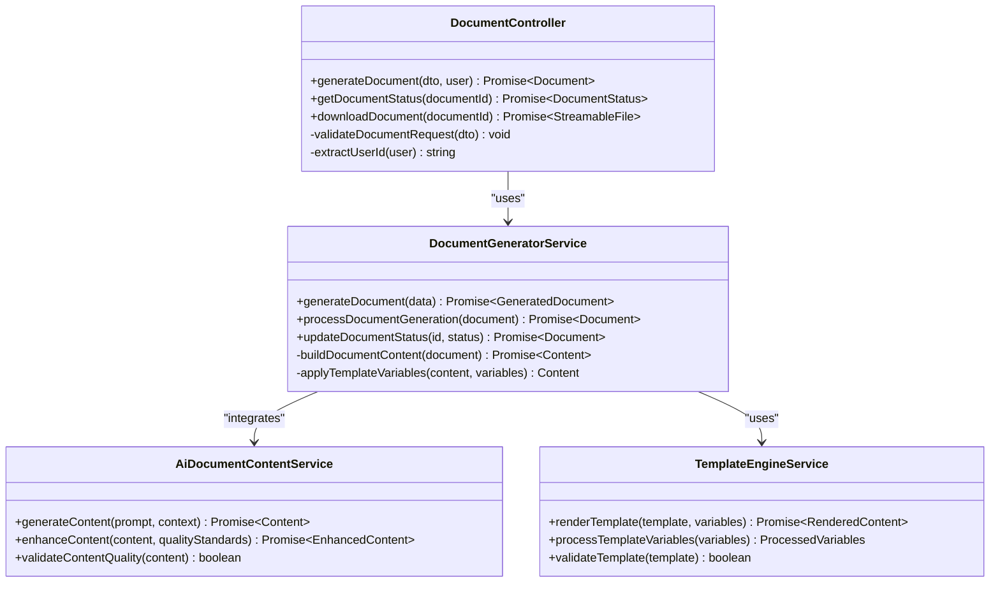
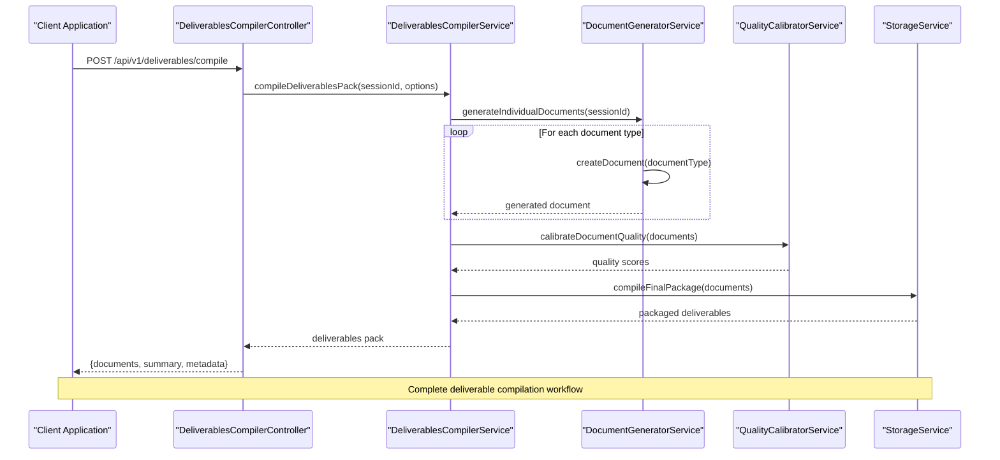
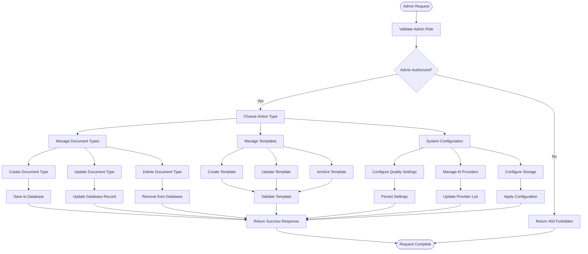
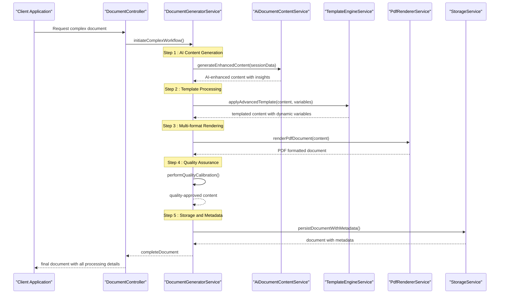

# Document Generation API

<cite>
**Referenced Files in This Document**
- [app.module.ts](file://apps/api/src/app.module.ts)
- [document-generator.module.ts](file://apps/api/src/modules/document-generator/document-generator.module.ts)
- [document.controller.ts](file://apps/api/src/modules/document-generator/controllers/document.controller.ts)
- [document.controller.spec.ts](file://apps/api/src/modules/document-generator/controllers/document.controller.spec.ts)
- [deliverables-compiler.controller.ts](file://apps/api/src/modules/document-generator/controllers/deliverables-compiler.controller.ts)
- [deliverables-compiler.controller.spec.ts](file://apps/api/src/modules/document-generator/controllers/deliverables-compiler.controller.spec.ts)
- [document-admin.controller.ts](file://apps/api/src/modules/document-generator/controllers/document-admin.controller.ts)
- [document-admin.controller.spec.ts](file://apps/api/src/modules/document-generator/controllers/document-admin.controller.spec.ts)
- [document-generator.service.ts](file://apps/api/src/modules/document-generator/services/document-generator.service.ts)
- [document-generator.service.spec.ts](file://apps/api/src/modules/document-generator/services/document-generator.service.spec.ts)
- [deliverables-compiler.service.ts](file://apps/api/src/modules/document-generator/services/deliverables-compiler.service.ts)
- [deliverables-compiler.service.spec.ts](file://apps/api/src/modules/document-generator/services/deliverables-compiler.service.spec.ts)
- [ai-document-content.service.ts](file://apps/api/src/modules/document-generator/services/ai-document-content.service.ts)
- [pdf-renderer.service.ts](file://apps/api/src/modules/document-generator/services/pdf-renderer.service.ts)
- [markdown-renderer.service.ts](file://apps/api/src/modules/document-generator/services/markdown-renderer.service.ts)
- [bulk-download.service.ts](file://apps/api/src/modules/document-generator/services/bulk-download.service.ts)
- [quality-calibrator.service.ts](file://apps/api/src/modules/document-generator/services/quality-calibrator.service.ts)
- [template-engine.service.ts](file://apps/api/src/modules/document-generator/services/template-engine.service.ts)
- [storage.service.ts](file://apps/api/src/modules/document-generator/services/storage.service.ts)
- [document.dto.ts](file://apps/api/src/modules/document-generator/dto/document.dto.ts)
- [deliverables.dto.ts](file://apps/api/src/modules/document-generator/dto/deliverables.dto.ts)
- [admin.dto.ts](file://apps/api/src/modules/document-generator/dto/admin.dto.ts)
- [evidence-document-generator.flow.test.ts](file://apps/api/test/integration/evidence-document-generator.flow.test.ts)
- [DELIVERABLES_TRACKING_STATUS.md](file://DELIVERABLES_TRACKING_STATUS.md)
</cite>

## Table of Contents
1. [Introduction](#introduction)
2. [Project Structure](#project-structure)
3. [Core Components](#core-components)
4. [Architecture Overview](#architecture-overview)
5. [Detailed Component Analysis](#detailed-component-analysis)
6. [API Reference](#api-reference)
7. [Template Management](#template-management)
8. [Bulk Operations](#bulk-operations)
9. [Quality Calibration](#quality-calibration)
10. [Integration Examples](#integration-examples)
11. [Performance Considerations](#performance-considerations)
12. [Troubleshooting Guide](#troubleshooting-guide)
13. [Conclusion](#conclusion)

## Introduction
The Document Generation API provides comprehensive document creation and management capabilities for the Quiz2Biz platform. This system enables AI-powered content generation, template-based document rendering in PDF and Markdown formats, and bulk document operations. The API supports both individual document generation and comprehensive deliverable packaging for assessment sessions.

The system integrates advanced AI content generation with flexible template rendering, quality calibration, and administrative controls for document type management. It serves as a central hub for transforming assessment data into professional deliverables while maintaining high standards of quality and consistency.

## Project Structure
The document generation functionality is organized within the NestJS application architecture, specifically within the DocumentGeneratorModule. The module follows a service-oriented architecture pattern with clear separation of concerns across different document generation aspects.

**Diagram sources**
- [app.module.ts:16](file://apps/api/src/app.module.ts#L16)
- [document-generator.module.ts:19-46](file://apps/api/src/modules/document-generator/document-generator.module.ts#L19-L46)

**Section sources**
- [app.module.ts:16](file://apps/api/src/app.module.ts#L16)
- [document-generator.module.ts:19-46](file://apps/api/src/modules/document-generator/document-generator.module.ts#L19-L46)

## Core Components
The Document Generation API consists of several specialized services working together to provide comprehensive document management capabilities:

### Document Generation Services
- **DocumentGeneratorService**: Core service handling document creation workflows, AI content integration, and template processing
- **AiDocumentContentService**: Specialized service for AI-powered content generation and enhancement
- **TemplateEngineService**: Manages template rendering and variable substitution for document creation
- **QualityCalibratorService**: Ensures document quality standards and consistency across generations

### Rendering and Export Services
- **PdfRendererService**: Handles PDF document generation and formatting
- **MarkdownRendererService**: Manages Markdown document creation and formatting
- **StorageService**: Provides document storage and retrieval capabilities
- **BulkDownloadService**: Enables batch document processing and download operations

### Administrative Services
- **DeliverablesCompilerService**: Compiles comprehensive deliverable packages from multiple document types
- **ProviderComparisonService**: Manages AI provider comparisons and content quality assessment

**Section sources**
- [document-generator.module.ts:22-44](file://apps/api/src/modules/document-generator/document-generator.module.ts#L22-L44)

## Architecture Overview
The document generation system follows a layered architecture pattern with clear separation between presentation, business logic, and data access layers. The architecture emphasizes modularity, scalability, and maintainability.

**Diagram sources**
- [document.controller.ts](file://apps/api/src/modules/document-generator/controllers/document.controller.ts)
- [document-generator.service.ts](file://apps/api/src/modules/document-generator/services/document-generator.service.ts)
- [ai-document-content.service.ts](file://apps/api/src/modules/document-generator/services/ai-document-content.service.ts)
- [template-engine.service.ts](file://apps/api/src/modules/document-generator/services/template-engine.service.ts)
- [pdf-renderer.service.ts](file://apps/api/src/modules/document-generator/services/pdf-renderer.service.ts)
- [storage.service.ts](file://apps/api/src/modules/document-generator/services/storage.service.ts)

## Detailed Component Analysis

### Document Generation Controller
The DocumentController handles individual document creation requests, managing the complete document generation lifecycle from initiation to completion.

**Diagram sources**
- [document.controller.ts](file://apps/api/src/modules/document-generator/controllers/document.controller.ts)
- [document-generator.service.ts](file://apps/api/src/modules/document-generator/services/document-generator.service.ts)
- [ai-document-content.service.ts](file://apps/api/src/modules/document-generator/services/ai-document-content.service.ts)
- [template-engine.service.ts](file://apps/api/src/modules/document-generator/services/template-engine.service.ts)

**Section sources**
- [document.controller.ts](file://apps/api/src/modules/document-generator/controllers/document.controller.ts)
- [document.controller.spec.ts:55-88](file://apps/api/src/modules/document-generator/controllers/document.controller.spec.ts#L55-L88)

### Deliverables Compilation Controller
The DeliverablesCompilerController manages comprehensive document package compilation, enabling users to generate complete deliverable sets for assessment sessions.

**Diagram sources**
- [deliverables-compiler.controller.ts](file://apps/api/src/modules/document-generator/controllers/deliverables-compiler.controller.ts)
- [deliverables-compiler.service.ts](file://apps/api/src/modules/document-generator/services/deliverables-compiler.service.ts)
- [document-generator.service.ts](file://apps/api/src/modules/document-generator/services/document-generator.service.ts)
- [quality-calibrator.service.ts](file://apps/api/src/modules/document-generator/services/quality-calibrator.service.ts)
- [storage.service.ts](file://apps/api/src/modules/document-generator/services/storage.service.ts)

**Section sources**
- [deliverables-compiler.controller.ts](file://apps/api/src/modules/document-generator/controllers/deliverables-compiler.controller.ts)
- [deliverables-compiler.controller.spec.ts:44-79](file://apps/api/src/modules/document-generator/controllers/deliverables-compiler.controller.spec.ts#L44-L79)

### Administrative Document Management
The DocumentAdminController provides administrative capabilities for managing document types, templates, and system-wide document configurations.

**Diagram sources**
- [document-admin.controller.ts](file://apps/api/src/modules/document-generator/controllers/document-admin.controller.ts)
- [admin.dto.ts](file://apps/api/src/modules/document-generator/dto/admin.dto.ts)

**Section sources**
- [document-admin.controller.ts](file://apps/api/src/modules/document-generator/controllers/document-admin.controller.ts)
- [document-admin.controller.spec.ts:5-50](file://apps/api/src/modules/document-generator/controllers/document-admin.controller.spec.ts#L5-L50)

## API Reference

### Document Generation Endpoints

#### POST /api/v1/documents/generate
Initiates document generation for a specified document type and session.

**Request Body:**
- `sessionId` (string, required): UUID of the assessment session
- `documentTypeId` (string, required): Identifier for the document template type
- `contentInjection` (object, optional): Dynamic content to inject into the template
- `format` (string, optional): Target format (PDF, Markdown)

**Response:**
- `id` (string): Generated document identifier
- `status` (string): Current document status
- `format` (string): Document format
- `fileName` (string): Generated filename
- `createdAt` (string): Document creation timestamp

#### GET /api/v1/documents/{documentId}
Retrieves document generation status and metadata.

**Path Parameters:**
- `documentId` (string, required): Document identifier

**Response:**
- `status` (string): Generation status
- `progress` (number): Generation progress percentage
- `error` (string): Error message if applicable

#### GET /api/v1/documents/{documentId}/download
Downloads the generated document in the requested format.

**Path Parameters:**
- `documentId` (string, required): Document identifier

**Response:**
- Binary file stream of the generated document

### Deliverables Compilation Endpoints

#### POST /api/v1/deliverables/compile
Compiles a complete deliverable package for an assessment session.

**Request Body:**
- `sessionId` (string, required): Assessment session identifier
- `includeDecisionLog` (boolean, optional): Include decision log documents
- `includeReadinessReport` (boolean, optional): Include readiness assessment
- `includePolicyPack` (boolean, optional): Include policy documentation
- `autoSection` (boolean, optional): Automatically organize content into sections
- `maxWordsPerSection` (number, optional): Maximum words per section

**Response:**
- `documents` (array): Individual document objects
- `summary` (object): Package summary statistics
- `metadata` (object): Package metadata
- `readinessScore` (number): Overall readiness assessment score

#### GET /api/v1/deliverables/{sessionId}/{category}
Retrieves a specific document by category from a deliverable package.

**Path Parameters:**
- `sessionId` (string, required): Assessment session identifier
- `category` (string, required): Document category (ARCHITECTURE, GOVERNANCE, READINESS)

**Response:**
- Document content for the specified category

### Administrative Endpoints

#### POST /api/v1/admin/document-types
Creates a new document type definition.

**Request Body:**
- `name` (string, required): Document type name
- `description` (string, optional): Document type description
- `templateId` (string, required): Associated template identifier
- `format` (string, required): Supported output format
- `isActive` (boolean, optional): Whether the type is active

**Response:**
- Created document type object

#### PUT /api/v1/admin/document-types/{typeId}
Updates an existing document type configuration.

**Path Parameters:**
- `typeId` (string, required): Document type identifier

**Response:**
- Updated document type object

#### DELETE /api/v1/admin/document-types/{typeId}
Deletes a document type and associated templates.

**Path Parameters:**
- `typeId` (string, required): Document type identifier

**Response:**
- Deletion confirmation

**Section sources**
- [document.controller.ts](file://apps/api/src/modules/document-generator/controllers/document.controller.ts)
- [deliverables-compiler.controller.ts](file://apps/api/src/modules/document-generator/controllers/deliverables-compiler.controller.ts)
- [document-admin.controller.ts](file://apps/api/src/modules/document-generator/controllers/document-admin.controller.ts)

## Template Management
The template engine provides flexible document templating with support for dynamic content injection and variable substitution.

### Template Variables
Templates support the following variable types:
- **Session Variables**: Assessment session metadata and results
- **User Variables**: User profile and role information
- **Dynamic Variables**: Content injected during generation
- **Context Variables**: Environmental and system context data

### Template Formats
Supported template formats include:
- **Markdown Templates**: Flexible markup-based templates
- **HTML Templates**: Structured HTML templates with embedded styling
- **Custom Templates**: Extensible template system for specialized formats

### Template Validation
Templates undergo validation for:
- **Syntax Validation**: Template structure and variable references
- **Content Validation**: Required variables and formatting consistency
- **Format Compatibility**: Output format compatibility checks

**Section sources**
- [template-engine.service.ts](file://apps/api/src/modules/document-generator/services/template-engine.service.ts)
- [document-generator.service.ts](file://apps/api/src/modules/document-generator/services/document-generator.service.ts)

## Bulk Operations
The bulk download service enables efficient processing of multiple documents simultaneously.

### Batch Processing Capabilities
- **Parallel Generation**: Multiple documents processed concurrently
- **Batch Download**: Combined download of multiple document formats
- **Progress Tracking**: Real-time monitoring of batch operation status
- **Error Handling**: Graceful handling of individual failures within batches

### Bulk Download Options
- **Format Selection**: Choose target formats for all documents
- **Filtering**: Select specific document categories or types
- **Compression**: ZIP archive generation for multiple downloads
- **Metadata Export**: Include document metadata alongside content

**Section sources**
- [bulk-download.service.ts](file://apps/api/src/modules/document-generator/services/bulk-download.service.ts)
- [deliverables-compiler.controller.spec.ts:44-79](file://apps/api/src/modules/document-generator/controllers/deliverables-compiler.controller.spec.ts#L44-L79)

## Quality Calibration
The quality calibrator ensures consistent document quality standards across all generated content.

### Quality Metrics
Quality assessment includes:
- **Content Completeness**: Verification of required information inclusion
- **Formatting Consistency**: Template adherence and visual consistency
- **Semantic Accuracy**: Content relevance and factual correctness
- **Readability Scores**: Text complexity and comprehension metrics

### Calibration Process
1. **Initial Assessment**: Automated quality scoring of generated content
2. **Threshold Evaluation**: Comparison against established quality thresholds
3. **AI Enhancement**: Optional AI-driven content improvement
4. **Final Validation**: Quality approval and document release

### Quality Standards
- **Minimum Completeness**: Required information coverage threshold
- **Maximum Complexity**: Readability level constraints
- **Consistency Weight**: Formatting and structure consistency requirements
- **Accuracy Verification**: Fact-checking and validation procedures

**Section sources**
- [quality-calibrator.service.ts](file://apps/api/src/modules/document-generator/services/quality-calibrator.service.ts)
- [document-generator.service.ts](file://apps/api/src/modules/document-generator/services/document-generator.service.ts)

## Integration Examples

### Complex Document Workflow Example
This example demonstrates a comprehensive document generation workflow involving multiple steps and integrations:

**Diagram sources**
- [document-generator.service.ts](file://apps/api/src/modules/document-generator/services/document-generator.service.ts)
- [ai-document-content.service.ts](file://apps/api/src/modules/document-generator/services/ai-document-content.service.ts)
- [template-engine.service.ts](file://apps/api/src/modules/document-generator/services/template-engine.service.ts)
- [pdf-renderer.service.ts](file://apps/api/src/modules/document-generator/services/pdf-renderer.service.ts)
- [storage.service.ts](file://apps/api/src/modules/document-generator/services/storage.service.ts)

### Custom Template Integration
The system supports custom template integration through the TemplateEngineService, allowing organizations to implement domain-specific document formats and branding requirements.

**Template Integration Process:**
1. **Template Definition**: Define template structure and variable requirements
2. **Variable Mapping**: Map template variables to data sources
3. **Validation**: Validate template compatibility and variable references
4. **Registration**: Register template with the template engine
5. **Usage**: Integrate template into document generation workflows

### Batch Processing Implementation
The bulk download service enables efficient processing of multiple documents through parallel execution and intelligent resource management.

**Batch Processing Benefits:**
- **Reduced Latency**: Parallel processing minimizes total generation time
- **Resource Optimization**: Intelligent resource allocation prevents system overload
- **Error Resilience**: Individual failures don't impact overall batch completion
- **Scalability**: Horizontal scaling enables processing of large document volumes

**Section sources**
- [evidence-document-generator.flow.test.ts](file://apps/api/test/integration/evidence-document-generator.flow.test.ts#L3)
- [DELIVERABLES_TRACKING_STATUS.md:69-75](file://DELIVERABLES_TRACKING_STATUS.md#L69-L75)

## Performance Considerations
The document generation system is designed with performance optimization in mind, incorporating several strategies for efficient document processing:

### Scalability Features
- **Asynchronous Processing**: Non-blocking document generation allows concurrent operations
- **Caching Strategies**: Intelligent caching of frequently accessed templates and content
- **Connection Pooling**: Optimized database connections for template and metadata queries
- **Memory Management**: Efficient memory usage through streaming and garbage collection

### Resource Optimization
- **Template Precompilation**: Templates are preprocessed to reduce runtime overhead
- **Content Streaming**: Large documents are streamed to minimize memory footprint
- **Background Processing**: Heavy computation tasks are offloaded to background workers
- **Load Balancing**: Distribution of document generation requests across available resources

### Monitoring and Metrics
- **Generation Time Tracking**: Comprehensive timing metrics for performance analysis
- **Resource Utilization**: Real-time monitoring of CPU, memory, and storage usage
- **Error Rate Analytics**: Performance impact analysis of generation failures
- **Throughput Measurement**: Document generation rate and capacity planning metrics

## Troubleshooting Guide

### Common Issues and Solutions

#### Document Generation Failures
**Symptoms**: Generation requests fail with timeout or error responses
**Causes**: 
- Template validation errors
- AI provider unavailability
- Storage service failures
- Memory constraints

**Solutions**:
- Verify template syntax and variable references
- Check AI provider health and rate limits
- Monitor storage service availability
- Review system memory usage patterns

#### Quality Calibration Issues
**Symptoms**: Documents fail quality checks despite successful generation
**Causes**:
- Content quality below threshold
- Template formatting inconsistencies
- Variable substitution errors
- Semantic accuracy violations

**Solutions**:
- Review quality standards and adjust thresholds
- Validate template variable mappings
- Test content injection scenarios
- Implement quality feedback loops

#### Bulk Operation Failures
**Symptoms**: Batch operations partially succeed or fail unexpectedly
**Causes**:
- Individual document processing errors
- Resource exhaustion during batch execution
- Network connectivity issues
- Storage quota limitations

**Solutions**:
- Implement retry mechanisms for failed documents
- Monitor resource usage during batch processing
- Validate network connectivity and storage availability
- Check storage quotas and implement cleanup procedures

### Debugging Tools and Techniques
- **Logging Configuration**: Comprehensive logging at multiple levels for troubleshooting
- **Performance Profiling**: Built-in profiling tools for identifying bottlenecks
- **Error Tracking**: Centralized error tracking and reporting systems
- **Health Checks**: Regular system health monitoring and alerting

**Section sources**
- [document-generator.service.spec.ts](file://apps/api/src/modules/document-generator/services/document-generator.service.spec.ts)
- [document-generator.service.ts](file://apps/api/src/modules/document-generator/services/document-generator.service.ts)

## Conclusion
The Document Generation API provides a comprehensive solution for automated document creation and management within the Quiz2Biz platform. The system successfully combines AI-powered content generation with flexible template rendering, ensuring high-quality, consistent document output across multiple formats and use cases.

Key strengths of the system include its modular architecture supporting easy maintenance and extension, robust quality assurance mechanisms ensuring document reliability, and scalable design accommodating growing document generation demands. The administrative capabilities enable effective management of document types and system configurations.

The API's integration with assessment workflows and deliverable packaging capabilities positions it as a critical component in the Quiz2Biz ecosystem, enabling organizations to efficiently transform assessment data into professional, actionable deliverables while maintaining quality standards and operational efficiency.

Future enhancements could focus on expanding AI provider integrations, implementing advanced document analytics, and enhancing customization capabilities for enterprise clients requiring specialized document formats and branding requirements.