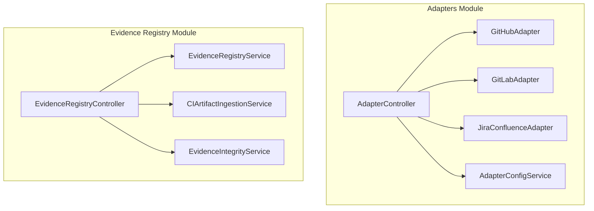
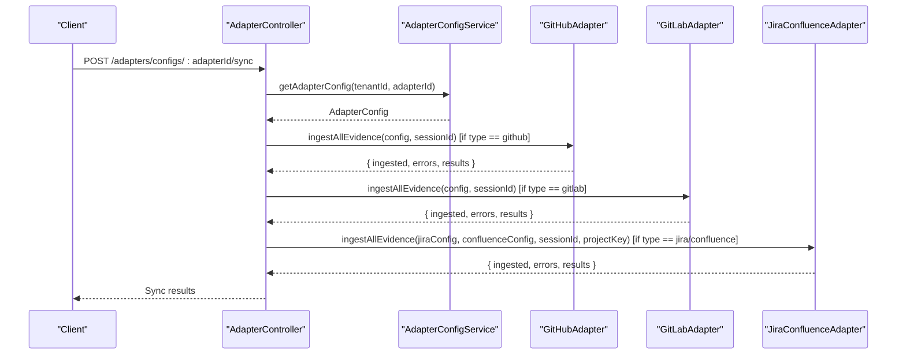
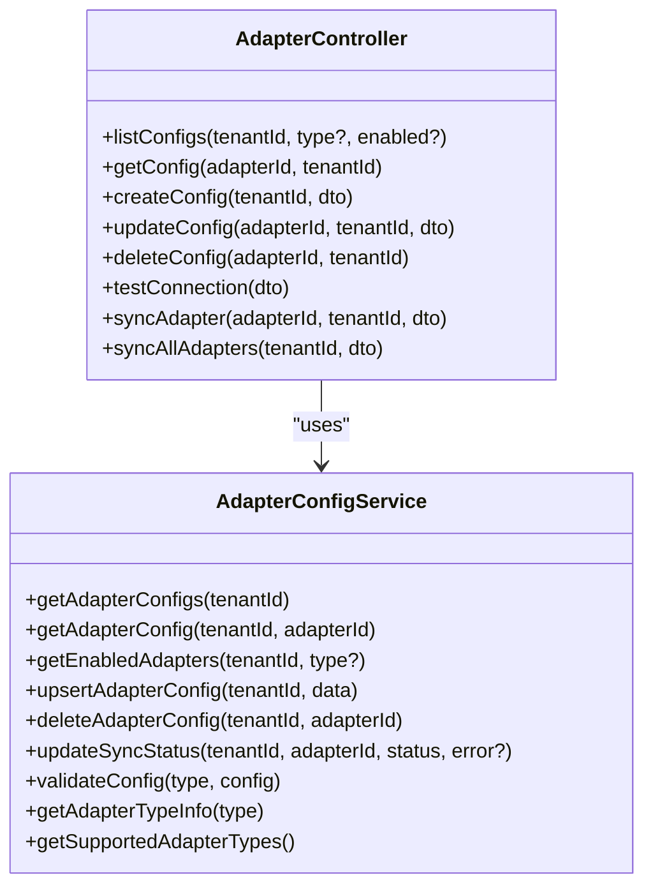
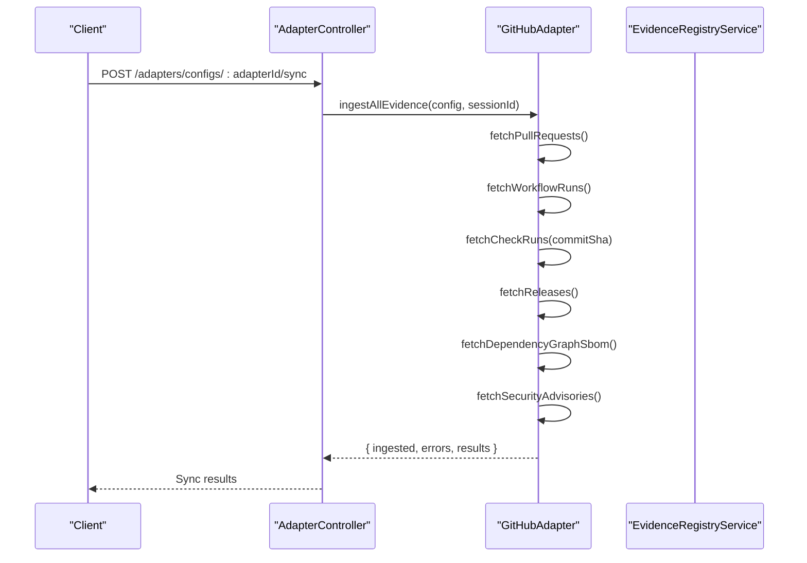
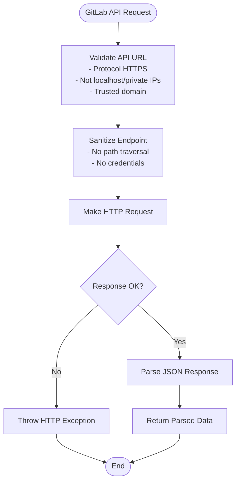
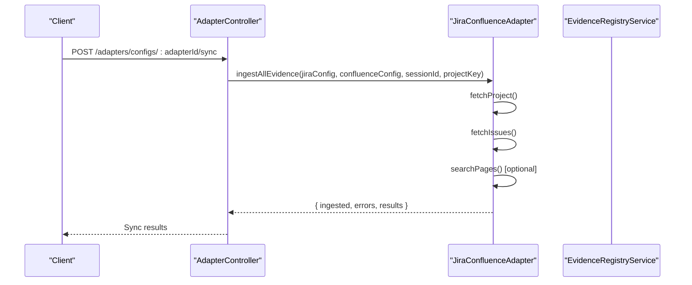
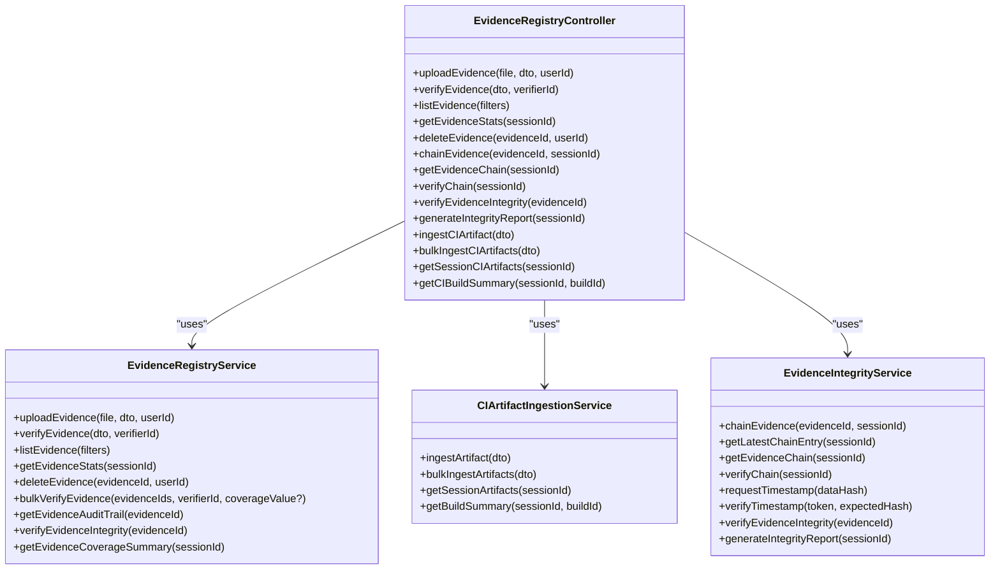
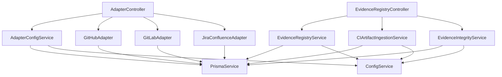

# Integration & Adapter API

<cite>
**Referenced Files in This Document**
- [adapters.module.ts](file://apps/api/src/modules/adapters/adapters.module.ts)
- [adapter.controller.ts](file://apps/api/src/modules/adapters/adapter.controller.ts)
- [github.adapter.ts](file://apps/api/src/modules/adapters/github.adapter.ts)
- [gitlab.adapter.ts](file://apps/api/src/modules/adapters/gitlab.adapter.ts)
- [jira-confluence.adapter.ts](file://apps/api/src/modules/adapters/jira-confluence.adapter.ts)
- [adapter-config.service.ts](file://apps/api/src/modules/adapters/adapter-config.service.ts)
- [evidence-registry.controller.ts](file://apps/api/src/modules/evidence-registry/evidence-registry.controller.ts)
- [ci-artifact-ingestion.service.ts](file://apps/api/src/modules/evidence-registry/ci-artifact-ingestion.service.ts)
- [evidence-integrity.service.ts](file://apps/api/src/modules/evidence-registry/evidence-integrity.service.ts)
- [evidence-registry.service.ts](file://apps/api/src/modules/evidence-registry/evidence-registry.service.ts)
</cite>

## Table of Contents
1. [Introduction](#introduction)
2. [Project Structure](#project-structure)
3. [Core Components](#core-components)
4. [Architecture Overview](#architecture-overview)
5. [Detailed Component Analysis](#detailed-component-analysis)
6. [Dependency Analysis](#dependency-analysis)
7. [Performance Considerations](#performance-considerations)
8. [Troubleshooting Guide](#troubleshooting-guide)
9. [Conclusion](#conclusion)
10. [Appendices](#appendices)

## Introduction
This document provides comprehensive API documentation for integration and adapter endpoints that power CI/CD artifact ingestion and evidence registry integration. It covers GitHub, GitLab, and Jira-Confluence adapter endpoints, including evidence integrity validation, artifact parsing, and metadata extraction. It also documents webhook handling, event-driven updates, and batch processing capabilities. Adapter configuration schemas, authentication methods, and error handling patterns are included, along with examples of third-party integrations, custom adapter development, and troubleshooting common integration issues.

## Project Structure
The integration and adapter functionality is organized under the Adapters module and Evidence Registry module. The Adapters module exposes REST endpoints for managing adapter configurations and triggering synchronization with external systems. The Evidence Registry module handles evidence lifecycle management, integrity verification, and CI artifact ingestion.

**Diagram sources**
- [adapters.module.ts:10-16](file://apps/api/src/modules/adapters/adapters.module.ts#L10-L16)
- [adapter.controller.ts:93-99](file://apps/api/src/modules/adapters/adapter.controller.ts#L93-L99)
- [github.adapter.ts:118-122](file://apps/api/src/modules/adapters/github.adapter.ts#L118-L122)
- [gitlab.adapter.ts:183-190](file://apps/api/src/modules/adapters/gitlab.adapter.ts#L183-L190)
- [jira-confluence.adapter.ts:132-138](file://apps/api/src/modules/adapters/jira-confluence.adapter.ts#L132-L138)
- [adapter-config.service.ts:78-85](file://apps/api/src/modules/adapters/adapter-config.service.ts#L78-L85)
- [evidence-registry.controller.ts:61-66](file://apps/api/src/modules/evidence-registry/evidence-registry.controller.ts#L61-L66)
- [evidence-registry.service.ts:95-133](file://apps/api/src/modules/evidence-registry/evidence-registry.service.ts#L95-L133)
- [ci-artifact-ingestion.service.ts:36-91](file://apps/api/src/modules/evidence-registry/ci-artifact-ingestion.service.ts#L36-L91)
- [evidence-integrity.service.ts:35-53](file://apps/api/src/modules/evidence-registry/evidence-integrity.service.ts#L35-L53)

**Section sources**
- [adapters.module.ts:1-17](file://apps/api/src/modules/adapters/adapters.module.ts#L1-L17)
- [adapter.controller.ts:92-99](file://apps/api/src/modules/adapters/adapter.controller.ts#L92-L99)
- [evidence-registry.controller.ts:61-66](file://apps/api/src/modules/evidence-registry/evidence-registry.controller.ts#L61-L66)

## Core Components
- AdapterController: Exposes REST endpoints for adapter configuration management, connection testing, synchronization, and webhook handling.
- GitHubAdapter: Integrates with GitHub APIs to fetch pull requests, workflow runs, releases, SBOMs, and security advisories; generates evidence records with integrity hashes.
- GitLabAdapter: Integrates with GitLab APIs to fetch pipelines, jobs, test reports, merge requests, releases, vulnerabilities, and coverage; generates evidence records.
- JiraConfluenceAdapter: Integrates with Atlassian APIs to fetch Jira issues, sprints, projects, and Confluence pages; supports bidirectional documentation sync.
- AdapterConfigService: Manages adapter configurations, validates required fields, and persists configurations to tenant settings.
- EvidenceRegistryController: Provides endpoints for evidence upload, verification, listing, and integrity verification; integrates CI artifact ingestion and integrity services.
- CIArtifactIngestionService: Parses CI artifacts (test reports, coverage, SBOMs, security scans) and creates evidence records with metadata.
- EvidenceIntegrityService: Implements cryptographic evidence chaining and RFC 3161 timestamp integration for integrity verification.

**Section sources**
- [adapter.controller.ts:93-99](file://apps/api/src/modules/adapters/adapter.controller.ts#L93-L99)
- [github.adapter.ts:118-122](file://apps/api/src/modules/adapters/github.adapter.ts#L118-L122)
- [gitlab.adapter.ts:183-190](file://apps/api/src/modules/adapters/gitlab.adapter.ts#L183-L190)
- [jira-confluence.adapter.ts:132-138](file://apps/api/src/modules/adapters/jira-confluence.adapter.ts#L132-L138)
- [adapter-config.service.ts:78-85](file://apps/api/src/modules/adapters/adapter-config.service.ts#L78-L85)
- [evidence-registry.controller.ts:61-66](file://apps/api/src/modules/evidence-registry/evidence-registry.controller.ts#L61-L66)
- [ci-artifact-ingestion.service.ts:36-91](file://apps/api/src/modules/evidence-registry/ci-artifact-ingestion.service.ts#L36-L91)
- [evidence-integrity.service.ts:35-53](file://apps/api/src/modules/evidence-registry/evidence-integrity.service.ts#L35-L53)

## Architecture Overview
The system follows a modular architecture with clear separation of concerns:
- Authentication: All adapter endpoints require JWT authentication except webhook endpoints which use provider-specific signatures.
- Configuration Management: AdapterConfigService centralizes configuration validation and persistence.
- Provider Adapters: Each adapter encapsulates provider-specific API interactions and evidence generation.
- Evidence Registry: EvidenceRegistryController coordinates evidence lifecycle and integrity verification.
- CI Artifact Ingestion: CIArtifactIngestionService parses and normalizes CI artifacts into standardized evidence records.

**Diagram sources**
- [adapter.controller.ts:294-394](file://apps/api/src/modules/adapters/adapter.controller.ts#L294-L394)
- [adapter-config.service.ts:106-109](file://apps/api/src/modules/adapters/adapter-config.service.ts#L106-L109)
- [github.adapter.ts:461-564](file://apps/api/src/modules/adapters/github.adapter.ts#L461-L564)
- [gitlab.adapter.ts:712-784](file://apps/api/src/modules/adapters/gitlab.adapter.ts#L712-L784)
- [jira-confluence.adapter.ts:833-898](file://apps/api/src/modules/adapters/jira-confluence.adapter.ts#L833-L898)

**Section sources**
- [adapter.controller.ts:294-394](file://apps/api/src/modules/adapters/adapter.controller.ts#L294-L394)
- [adapter-config.service.ts:106-109](file://apps/api/src/modules/adapters/adapter-config.service.ts#L106-L109)

## Detailed Component Analysis

### Adapter Configuration Management
- Endpoint: GET/POST/PUT/DELETE /adapters/configs
- Purpose: Manage adapter configurations per tenant, including enabling/disabling adapters and validating required fields.
- Validation: AdapterConfigService enforces required fields per adapter type and returns structured validation errors.
- Persistence: Configurations are persisted to tenant settings and cached for performance.

**Diagram sources**
- [adapter-config.service.ts:78-183](file://apps/api/src/modules/adapters/adapter-config.service.ts#L78-L183)
- [adapter.controller.ts:122-227](file://apps/api/src/modules/adapters/adapter.controller.ts#L122-L227)

**Section sources**
- [adapter.controller.ts:122-227](file://apps/api/src/modules/adapters/adapter.controller.ts#L122-L227)
- [adapter-config.service.ts:185-240](file://apps/api/src/modules/adapters/adapter-config.service.ts#L185-L240)

### GitHub Adapter Integration
- Endpoints: /adapters/configs/:adapterId/sync (GitHub), GET /adapters/types/:type (GitHub info)
- Evidence Types: Pull Requests, Workflow Runs, Check Runs, Releases, SBOMs, Security Advisories
- Authentication: Bearer token via Authorization header
- Webhook Handling: HMAC-SHA256 signature verification for GitHub events
- Evidence Generation: Each fetched resource is transformed into a standardized evidence record with hash and metadata

**Diagram sources**
- [adapter.controller.ts:294-394](file://apps/api/src/modules/adapters/adapter.controller.ts#L294-L394)
- [github.adapter.ts:461-564](file://apps/api/src/modules/adapters/github.adapter.ts#L461-L564)

**Section sources**
- [github.adapter.ts:173-456](file://apps/api/src/modules/adapters/github.adapter.ts#L173-L456)
- [adapter.controller.ts:442-490](file://apps/api/src/modules/adapters/adapter.controller.ts#L442-L490)

### GitLab Adapter Integration
- Endpoints: /adapters/configs/:adapterId/sync (GitLab), GET /adapters/types/:type (GitLab info)
- Evidence Types: Pipelines, Jobs, Merge Requests, Releases, Vulnerabilities, Coverage History
- Authentication: PRIVATE-TOKEN header
- Security: Strict API URL validation to prevent SSRF, including hostname, protocol, and private IP checks
- Webhook Handling: Secret token verification for GitLab events

**Diagram sources**
- [gitlab.adapter.ts:222-346](file://apps/api/src/modules/adapters/gitlab.adapter.ts#L222-L346)

**Section sources**
- [gitlab.adapter.ts:359-707](file://apps/api/src/modules/adapters/gitlab.adapter.ts#L359-L707)
- [adapter.controller.ts:492-535](file://apps/api/src/modules/adapters/adapter.controller.ts#L492-L535)

### Jira-Confluence Adapter Integration
- Endpoints: /adapters/configs/:adapterId/sync (Jira/Confluence), GET /adapters/types/:type (Jira/Confluence info)
- Evidence Types: Jira Issues, Sprints, Projects, Confluence Pages
- Authentication: Basic auth using email:apiToken
- Security: Domain validation to ensure trusted Atlassian cloud domain
- Bidirectional Sync: Confluence documentation sync with labels and hierarchy support

**Diagram sources**
- [adapter.controller.ts:347-373](file://apps/api/src/modules/adapters/adapter.controller.ts#L347-L373)
- [jira-confluence.adapter.ts:833-898](file://apps/api/src/modules/adapters/jira-confluence.adapter.ts#L833-L898)

**Section sources**
- [jira-confluence.adapter.ts:307-536](file://apps/api/src/modules/adapters/jira-confluence.adapter.ts#L307-L536)
- [adapter.controller.ts:347-373](file://apps/api/src/modules/adapters/adapter.controller.ts#L347-L373)

### Evidence Registry Integration
- Endpoints: Evidence upload, verification, listing, integrity verification, CI artifact ingestion
- Integrity: SHA-256 hashing, blockchain-style hash chaining, RFC 3161 timestamp integration
- CI Artifacts: Automatic parsing of JUnit, Jest, lcov, Cobertura, CycloneDX, SPDX, Trivy, OWASP reports
- Coverage: Decimal-to-level mapping with strict coverage progression rules

**Diagram sources**
- [evidence-registry.controller.ts:61-66](file://apps/api/src/modules/evidence-registry/evidence-registry.controller.ts#L61-L66)
- [evidence-registry.service.ts:95-133](file://apps/api/src/modules/evidence-registry/evidence-registry.service.ts#L95-L133)
- [ci-artifact-ingestion.service.ts:36-91](file://apps/api/src/modules/evidence-registry/ci-artifact-ingestion.service.ts#L36-L91)
- [evidence-integrity.service.ts:35-53](file://apps/api/src/modules/evidence-registry/evidence-integrity.service.ts#L35-L53)

**Section sources**
- [evidence-registry.controller.ts:68-461](file://apps/api/src/modules/evidence-registry/evidence-registry.controller.ts#L68-L461)
- [evidence-registry.service.ts:165-355](file://apps/api/src/modules/evidence-registry/evidence-registry.service.ts#L165-L355)
- [ci-artifact-ingestion.service.ts:98-200](file://apps/api/src/modules/evidence-registry/ci-artifact-ingestion.service.ts#L98-L200)
- [evidence-integrity.service.ts:63-133](file://apps/api/src/modules/evidence-registry/evidence-integrity.service.ts#L63-L133)

## Dependency Analysis
The system exhibits low coupling between modules and high cohesion within each module. AdapterController depends on AdapterConfigService and provider-specific adapters. EvidenceRegistryController depends on EvidenceRegistryService, CIArtifactIngestionService, and EvidenceIntegrityService. Configuration and persistence are centralized through PrismaService and ConfigService.

**Diagram sources**
- [adapter.controller.ts:93-99](file://apps/api/src/modules/adapters/adapter.controller.ts#L93-L99)
- [adapter-config.service.ts:78-85](file://apps/api/src/modules/adapters/adapter-config.service.ts#L78-L85)
- [evidence-registry.controller.ts:61-66](file://apps/api/src/modules/evidence-registry/evidence-registry.controller.ts#L61-L66)
- [evidence-registry.service.ts:128-133](file://apps/api/src/modules/evidence-registry/evidence-registry.service.ts#L128-L133)
- [ci-artifact-ingestion.service.ts:88-91](file://apps/api/src/modules/evidence-registry/ci-artifact-ingestion.service.ts#L88-L91)
- [evidence-integrity.service.ts:45-53](file://apps/api/src/modules/evidence-registry/evidence-integrity.service.ts#L45-L53)

**Section sources**
- [adapter.controller.ts:93-99](file://apps/api/src/modules/adapters/adapter.controller.ts#L93-L99)
- [adapter-config.service.ts:78-85](file://apps/api/src/modules/adapters/adapter-config.service.ts#L78-L85)
- [evidence-registry.controller.ts:61-66](file://apps/api/src/modules/evidence-registry/evidence-registry.controller.ts#L61-L66)

## Performance Considerations
- Caching: AdapterConfigService caches configurations per tenant to minimize database queries.
- Batch Processing: EvidenceRegistryController supports bulk verification operations to reduce N+1 query patterns.
- Pagination: Provider adapters implement pagination for large datasets (e.g., perPage parameters).
- Asynchronous Operations: Webhook handlers return immediately after validation, deferring heavy processing to background tasks.
- Resource Limits: File upload validation enforces maximum file sizes and allowed MIME types to prevent abuse.

[No sources needed since this section provides general guidance]

## Troubleshooting Guide
Common issues and resolutions:
- Authentication Failures: Verify JWT tokens for authenticated endpoints and provider-specific signatures for webhooks.
- Configuration Validation Errors: Ensure required fields are present and properly formatted for each adapter type.
- Provider API Errors: Check rate limits, token permissions, and endpoint availability for GitHub, GitLab, and Atlassian APIs.
- Integrity Verification Failures: Confirm evidence hashes match stored values and chain integrity is intact.
- CI Artifact Parsing Errors: Validate artifact content format and supported artifact types.

**Section sources**
- [adapter.controller.ts:282-289](file://apps/api/src/modules/adapters/adapter.controller.ts#L282-L289)
- [adapter-config.service.ts:218-240](file://apps/api/src/modules/adapters/adapter-config.service.ts#L218-L240)
- [evidence-integrity.service.ts:200-274](file://apps/api/src/modules/evidence-registry/evidence-integrity.service.ts#L200-L274)

## Conclusion
The Integration & Adapter API provides a robust framework for connecting external CI/CD and project management systems to the evidence registry. It offers secure configuration management, provider-specific integrations, comprehensive evidence integrity verification, and automated CI artifact ingestion. The modular design facilitates extensibility for additional adapters and ensures maintainable, testable code.

[No sources needed since this section summarizes without analyzing specific files]

## Appendices

### API Endpoints Summary
- Adapters
  - GET /adapters/types
  - GET /adapters/types/:type
  - GET /adapters/configs?tenantId=&type=&enabled=
  - GET /adapters/configs/:adapterId?tenantId=
  - POST /adapters/configs?tenantId=
  - PUT /adapters/configs/:adapterId?tenantId=
  - DELETE /adapters/configs/:adapterId?tenantId=
  - POST /adapters/test-connection
  - POST /adapters/configs/:adapterId/sync
  - POST /adapters/sync-all
  - POST /adapters/webhooks/github
  - POST /adapters/webhooks/gitlab

- Evidence Registry
  - POST /evidence/upload
  - POST /evidence/verify
  - GET /evidence/:evidenceId
  - GET /evidence
  - GET /evidence/stats/:sessionId
  - DELETE /evidence/:evidenceId
  - POST /evidence/:evidenceId/chain
  - GET /evidence/chain/:sessionId
  - GET /evidence/chain/:sessionId/verify
  - GET /evidence/:evidenceId/integrity
  - GET /evidence/integrity-report/:sessionId
  - POST /evidence/ci/ingest
  - POST /evidence/ci/bulk-ingest
  - GET /evidence/ci/session/:sessionId
  - GET /evidence/ci/build/:sessionId/:buildId

**Section sources**
- [adapter.controller.ts:103-290](file://apps/api/src/modules/adapters/adapter.controller.ts#L103-L290)
- [adapter.controller.ts:442-535](file://apps/api/src/modules/adapters/adapter.controller.ts#L442-L535)
- [evidence-registry.controller.ts:68-461](file://apps/api/src/modules/evidence-registry/evidence-registry.controller.ts#L68-L461)

### Adapter Configuration Schemas
- GitHub
  - Required: token, owner, repo
  - Optional: apiUrl, webhookSecret, syncOptions
- GitLab
  - Required: token, projectId
  - Optional: apiUrl, webhookToken, syncOptions
- Jira
  - Required: domain, email, apiToken, projectKey
  - Optional: boardId, syncOptions
- Confluence
  - Required: domain, email, apiToken, spaceKey
  - Optional: parentPageId, syncOptions

**Section sources**
- [adapter-config.service.ts:21-75](file://apps/api/src/modules/adapters/adapter-config.service.ts#L21-L75)

### Authentication Methods
- JWT Bearer Tokens: Required for most adapter endpoints
- Provider Webhooks:
  - GitHub: HMAC-SHA256 signature verification
  - GitLab: Secret token verification
- Provider APIs:
  - GitHub: Bearer token Authorization header
  - GitLab: PRIVATE-TOKEN header
  - Jira/Confluence: Basic auth email:apiToken

**Section sources**
- [adapter.controller.ts:442-535](file://apps/api/src/modules/adapters/adapter.controller.ts#L442-L535)
- [github.adapter.ts:124-130](file://apps/api/src/modules/adapters/github.adapter.ts#L124-L130)
- [gitlab.adapter.ts:192-197](file://apps/api/src/modules/adapters/gitlab.adapter.ts#L192-L197)
- [jira-confluence.adapter.ts:152-159](file://apps/api/src/modules/adapters/jira-confluence.adapter.ts#L152-L159)

### Evidence Integrity Validation
- SHA-256 hashing for file integrity
- Blockchain-style hash chaining with sequence numbers
- RFC 3161 timestamp integration
- Comprehensive verification reports

**Section sources**
- [evidence-integrity.service.ts:59-133](file://apps/api/src/modules/evidence-registry/evidence-integrity.service.ts#L59-L133)
- [evidence-integrity.service.ts:198-274](file://apps/api/src/modules/evidence-registry/evidence-integrity.service.ts#L198-L274)
- [evidence-integrity.service.ts:362-387](file://apps/api/src/modules/evidence-registry/evidence-integrity.service.ts#L362-L387)

### CI Artifact Parsing and Metadata Extraction
- Supported Types: JUnit XML, Jest JSON, lcov, Cobertura, CycloneDX, SPDX, Trivy, OWASP
- Automatic Metrics Extraction: Test counts, coverage percentages, vulnerability summaries
- Metadata Embedding: CI provider, build IDs, branch, commit SHA

**Section sources**
- [ci-artifact-ingestion.service.ts:41-86](file://apps/api/src/modules/evidence-registry/ci-artifact-ingestion.service.ts#L41-L86)
- [ci-artifact-ingestion.service.ts:204-228](file://apps/api/src/modules/evidence-registry/ci-artifact-ingestion.service.ts#L204-L228)
- [ci-artifact-ingestion.service.ts:120-147](file://apps/api/src/modules/evidence-registry/ci-artifact-ingestion.service.ts#L120-L147)

### Third-Party Integrations Examples
- GitHub Actions: Trigger synchronization on push/PR events; ingest workflow artifacts as SBOMs and test reports
- GitLab CI: Sync pipelines and merge requests; parse coverage and vulnerability reports
- Jira/Confluence: Import issues and documentation; maintain bidirectional sync with labels and hierarchy

**Section sources**
- [adapter.controller.ts:294-394](file://apps/api/src/modules/adapters/adapter.controller.ts#L294-L394)
- [github.adapter.ts:295-330](file://apps/api/src/modules/adapters/github.adapter.ts#L295-L330)
- [gitlab.adapter.ts:712-784](file://apps/api/src/modules/adapters/gitlab.adapter.ts#L712-L784)
- [jira-confluence.adapter.ts:833-898](file://apps/api/src/modules/adapters/jira-confluence.adapter.ts#L833-L898)

### Custom Adapter Development
Steps to add a new adapter:
1. Create adapter class implementing evidence ingestion methods
2. Define configuration schema in AdapterConfigService
3. Add adapter to AdaptersModule providers and exports
4. Implement controller endpoints for sync and testing
5. Integrate with EvidenceRegistryService for persistence
6. Add webhook handler if provider supports webhooks

**Section sources**
- [adapters.module.ts:10-16](file://apps/api/src/modules/adapters/adapters.module.ts#L10-L16)
- [adapter-config.service.ts:185-288](file://apps/api/src/modules/adapters/adapter-config.service.ts#L185-L288)
- [adapter.controller.ts:93-99](file://apps/api/src/modules/adapters/adapter.controller.ts#L93-L99)