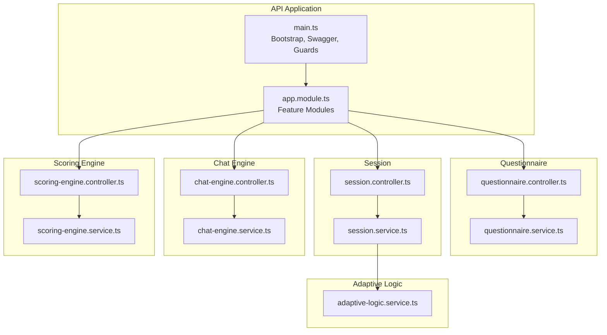
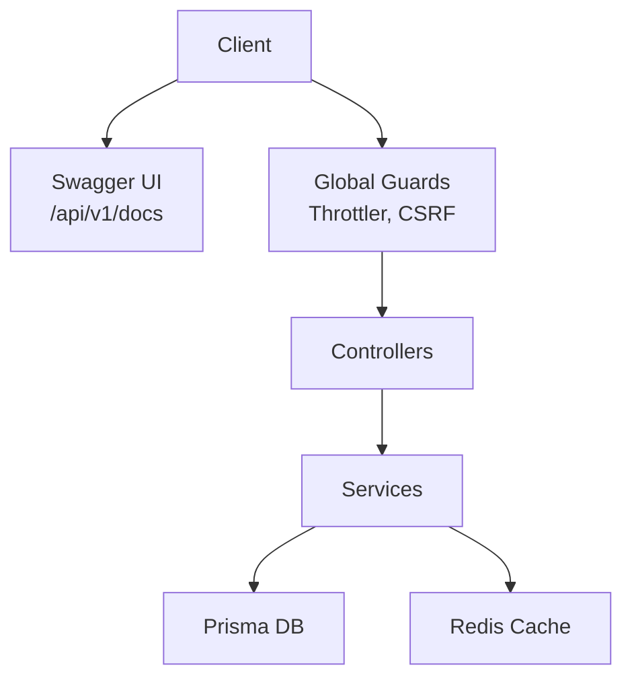
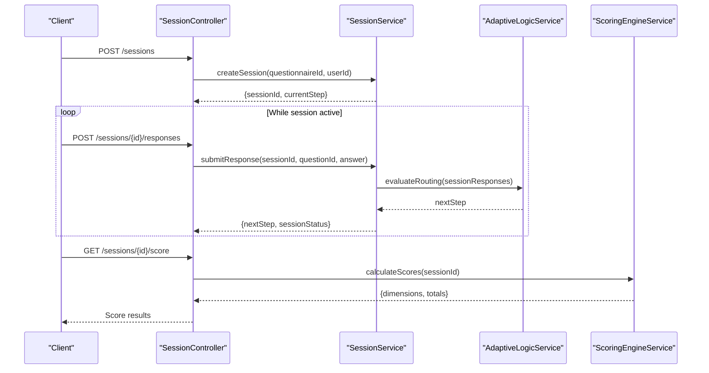
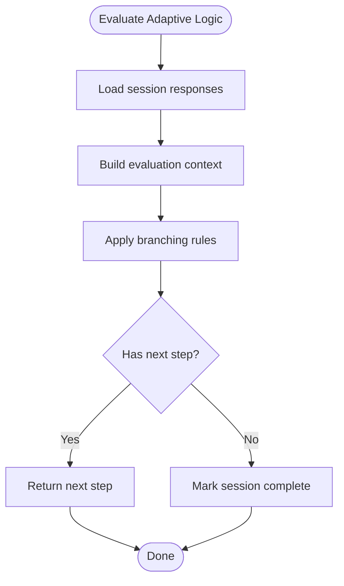
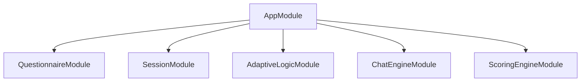

# Questionnaire & Session API

<cite>
**Referenced Files in This Document**
- [main.ts](file://apps/api/src/main.ts)
- [app.module.ts](file://apps/api/src/app.module.ts)
- [questionnaire.controller.ts](file://apps/api/src/modules/questionnaire/controllers/questionnaire.controller.ts)
- [questionnaire.service.ts](file://apps/api/src/modules/questionnaire/services/questionnaire.service.ts)
- [session.controller.ts](file://apps/api/src/modules/session/controllers/session.controller.ts)
- [session.service.ts](file://apps/api/src/modules/session/services/session.service.ts)
- [adaptive-logic.service.ts](file://apps/api/src/modules/adaptive-logic/adaptive-logic.service.ts)
- [chat-engine.controller.ts](file://apps/api/src/modules/chat-engine/chat-engine.controller.ts)
- [chat-engine.service.ts](file://apps/api/src/modules/chat-engine/chat-engine.service.ts)
- [scoring-engine.controller.ts](file://apps/api/src/modules/scoring-engine/scoring-engine.controller.ts)
- [scoring-engine.service.ts](file://apps/api/src/modules/scoring-engine/scoring-engine.service.ts)
- [conversation.ts](file://apps/web/src/api/conversation.ts)
- [questionnaire.ts](file://apps/web/src/api/questionnaire.ts)
- [session-flow.e2e.test.ts](file://e2e/questionnaire/session-flow.e2e.test.ts)
- [adaptive.e2e.test.ts](file://e2e/questionnaire/adaptive.e2e.test.ts)
- [questionnaire-scoring-session.flow.test.ts](file://apps/api/test/integration/questionnaire-scoring-session.flow.test.ts)
</cite>

## Table of Contents
1. [Introduction](#introduction)
2. [Project Structure](#project-structure)
3. [Core Components](#core-components)
4. [Architecture Overview](#architecture-overview)
5. [Detailed Component Analysis](#detailed-component-analysis)
6. [Dependency Analysis](#dependency-analysis)
7. [Performance Considerations](#performance-considerations)
8. [Troubleshooting Guide](#troubleshooting-guide)
9. [Conclusion](#conclusion)
10. [Appendices](#appendices)

## Introduction
This document provides comprehensive API documentation for questionnaire and session management within the Quiz2Biz platform. It covers:
- Questionnaire CRUD operations and data structures
- Adaptive logic evaluation for dynamic routing
- Session lifecycle management (creation, continuation, expiration)
- Conversation endpoints for real-time chat during sessions
- Scoring engine endpoints for automated readiness assessment
- Response submission patterns and validation
- Examples of complex questionnaire flows and session state management

The API is built with NestJS, Swagger/OpenAPI is integrated for interactive documentation, and the system supports JWT authentication, rate limiting, and structured logging.

## Project Structure
The API application is organized around feature modules. The most relevant modules for this document are:
- Questionnaire: manages questionnaire templates and metadata
- Session: manages assessment sessions and progress
- Adaptive Logic: evaluates branching/routing rules
- Chat Engine: enables real-time conversation within sessions
- Scoring Engine: computes readiness scores and dimensions

**Diagram sources**
- [main.ts:28-317](file://apps/api/src/main.ts#L28-L317)
- [app.module.ts:53-129](file://apps/api/src/app.module.ts#L53-L129)
- [questionnaire.controller.ts](file://apps/api/src/modules/questionnaire/controllers/questionnaire.controller.ts)
- [questionnaire.service.ts](file://apps/api/src/modules/questionnaire/services/questionnaire.service.ts)
- [session.controller.ts](file://apps/api/src/modules/session/controllers/session.controller.ts)
- [session.service.ts](file://apps/api/src/modules/session/services/session.service.ts)
- [adaptive-logic.service.ts](file://apps/api/src/modules/adaptive-logic/adaptive-logic.service.ts)
- [chat-engine.controller.ts](file://apps/api/src/modules/chat-engine/chat-engine.controller.ts)
- [chat-engine.service.ts](file://apps/api/src/modules/chat-engine/chat-engine.service.ts)
- [scoring-engine.controller.ts](file://apps/api/src/modules/scoring-engine/scoring-engine.controller.ts)
- [scoring-engine.service.ts](file://apps/api/src/modules/scoring-engine/scoring-engine.service.ts)

**Section sources**
- [main.ts:28-317](file://apps/api/src/main.ts#L28-L317)
- [app.module.ts:53-129](file://apps/api/src/app.module.ts#L53-L129)

## Core Components
This section outlines the primary components involved in questionnaire and session management, along with their responsibilities and integration points.

- Questionnaire Module
  - Controllers: expose endpoints for questionnaire CRUD and retrieval
  - Services: implement business logic for questionnaire templates, validation, and persistence
- Session Module
  - Controllers: manage session creation, continuation, and state transitions
  - Services: orchestrate session lifecycle, adaptive routing, and response aggregation
- Adaptive Logic Module
  - Services: evaluate branching conditions and compute next steps based on responses
- Chat Engine Module
  - Controllers/Services: provide real-time conversation endpoints within sessions
- Scoring Engine Module
  - Controllers/Services: calculate readiness scores across dimensions and return results

Key integration points:
- Sessions depend on adaptive logic for dynamic navigation
- Sessions trigger scoring engine calculations upon completion or partial submissions
- Conversations are scoped to sessions for contextual chat

**Section sources**
- [questionnaire.controller.ts](file://apps/api/src/modules/questionnaire/controllers/questionnaire.controller.ts)
- [questionnaire.service.ts](file://apps/api/src/modules/questionnaire/services/questionnaire.service.ts)
- [session.controller.ts](file://apps/api/src/modules/session/controllers/session.controller.ts)
- [session.service.ts](file://apps/api/src/modules/session/services/session.service.ts)
- [adaptive-logic.service.ts](file://apps/api/src/modules/adaptive-logic/adaptive-logic.service.ts)
- [chat-engine.controller.ts](file://apps/api/src/modules/chat-engine/chat-engine.controller.ts)
- [chat-engine.service.ts](file://apps/api/src/modules/chat-engine/chat-engine.service.ts)
- [scoring-engine.controller.ts](file://apps/api/src/modules/scoring-engine/scoring-engine.controller.ts)
- [scoring-engine.service.ts](file://apps/api/src/modules/scoring-engine/scoring-engine.service.ts)

## Architecture Overview
The system follows a layered architecture with feature modules. The API bootstraps middleware, Swagger documentation, and global guards. Controllers coordinate with services, which interact with domain logic and external systems (database, cache, AI gateway).

**Diagram sources**
- [main.ts:194-298](file://apps/api/src/main.ts#L194-L298)
- [app.module.ts:118-127](file://apps/api/src/app.module.ts#L118-L127)

**Section sources**
- [main.ts:194-298](file://apps/api/src/main.ts#L194-L298)
- [app.module.ts:118-127](file://apps/api/src/app.module.ts#L118-L127)

## Detailed Component Analysis

### Questionnaire CRUD Endpoints
The questionnaire module exposes endpoints to manage questionnaire templates and metadata. Typical operations include:
- Create a questionnaire template
- Retrieve a questionnaire by ID
- Update questionnaire metadata
- Delete a questionnaire template
- List questionnaires with filtering and pagination

Request/Response schemas:
- Create/Update payloads include metadata such as title, description, category, and version
- Responses include identifiers, timestamps, and full metadata
- Validation ensures required fields and schema compliance

Operational notes:
- Endpoints are protected by authentication and rate limiting
- Responses are transformed and logged globally

**Section sources**
- [questionnaire.controller.ts](file://apps/api/src/modules/questionnaire/controllers/questionnaire.controller.ts)
- [questionnaire.service.ts](file://apps/api/src/modules/questionnaire/services/questionnaire.service.ts)
- [main.ts:196-206](file://apps/api/src/main.ts#L196-L206)

### Session Lifecycle Management
The session module manages assessment sessions from creation to completion:
- Create a new session bound to a questionnaire
- Continue an existing session (retrieve current step, submit responses)
- Evaluate adaptive logic to determine next steps
- Calculate scores upon completion or partial submission
- Handle session expiration and continuation rules

**Diagram sources**
- [session.controller.ts](file://apps/api/src/modules/session/controllers/session.controller.ts)
- [session.service.ts](file://apps/api/src/modules/session/services/session.service.ts)
- [adaptive-logic.service.ts](file://apps/api/src/modules/adaptive-logic/adaptive-logic.service.ts)
- [scoring-engine.service.ts](file://apps/api/src/modules/scoring-engine/scoring-engine.service.ts)

**Section sources**
- [session.controller.ts](file://apps/api/src/modules/session/controllers/session.controller.ts)
- [session.service.ts](file://apps/api/src/modules/session/services/session.service.ts)
- [adaptive-logic.service.ts](file://apps/api/src/modules/adaptive-logic/adaptive-logic.service.ts)
- [scoring-engine.service.ts](file://apps/api/src/modules/scoring-engine/scoring-engine.service.ts)

### Adaptive Logic Evaluation
Adaptive logic determines the next step in a questionnaire based on previous responses. It evaluates branching conditions and returns the subsequent question or completion state.

Processing logic:
- Collect submitted responses for the current session
- Apply evaluation rules (e.g., skip patterns, conditional branches)
- Compute next step identifier
- Return routing decision to the session service

**Diagram sources**
- [adaptive-logic.service.ts](file://apps/api/src/modules/adaptive-logic/adaptive-logic.service.ts)

**Section sources**
- [adaptive-logic.service.ts](file://apps/api/src/modules/adaptive-logic/adaptive-logic.service.ts)

### Conversation Endpoints (Real-Time Chat)
The chat engine module provides real-time conversation capabilities within a session. Clients can send messages and receive responses in real time.

Endpoints:
- Send message within a session
- Stream responses (where applicable)
- Retrieve conversation history for a session

Integration:
- Chat is scoped to a session ID
- Real-time features leverage WebSocket connections
- Messages are associated with session context for relevance

**Section sources**
- [chat-engine.controller.ts](file://apps/api/src/modules/chat-engine/chat-engine.controller.ts)
- [chat-engine.service.ts](file://apps/api/src/modules/chat-engine/chat-engine.service.ts)

### Scoring Engine Endpoints
The scoring engine calculates readiness scores across multiple dimensions based on questionnaire responses.

Endpoints:
- Calculate scores for a session
- Retrieve dimension-specific scores
- Export score summaries

Processing logic:
- Aggregate validated responses
- Apply scoring algorithms per dimension
- Normalize and compute totals
- Return structured score results

**Section sources**
- [scoring-engine.controller.ts](file://apps/api/src/modules/scoring-engine/scoring-engine.controller.ts)
- [scoring-engine.service.ts](file://apps/api/src/modules/scoring-engine/scoring-engine.service.ts)

### Session Expiration and Continuation
Session expiration and continuation are managed by the session service:
- Expiration policies define TTL and renewal rules
- Continuation endpoints allow resuming sessions after interruption
- Adaptive logic ensures continuity aligns with questionnaire flow

Operational considerations:
- Expiration triggers cleanup of transient data
- Continuation validates session state and eligibility
- Expiration handling prevents stale sessions from being reused

**Section sources**
- [session.service.ts](file://apps/api/src/modules/session/services/session.service.ts)

### Response Submission Patterns
Response submission follows a consistent pattern:
- Submit answers for the current step
- Validate responses against question constraints
- Persist responses and update session progress
- Trigger adaptive logic evaluation
- Optionally trigger scoring updates

Validation and transformation:
- Global validation pipe enforces DTO constraints
- Interceptors normalize and log requests/responses

**Section sources**
- [session.controller.ts](file://apps/api/src/modules/session/controllers/session.controller.ts)
- [session.service.ts](file://apps/api/src/modules/session/services/session.service.ts)
- [main.ts:196-206](file://apps/api/src/main.ts#L196-L206)

### Examples of Complex Questionnaire Flows and Session State Management
End-to-end scenarios are covered by integration and E2E tests:
- Session lifecycle flow: end-to-end progression through a questionnaire with adaptive routing
- Adaptive logic flow: branching based on responses and conditional visibility
- Questionnaire-scoring-session flow: scoring computation triggered by session completion

These tests demonstrate:
- Multi-step navigation with dynamic routing
- Real-time chat integration during sessions
- Automated scoring across dimensions
- Error handling and state recovery

**Section sources**
- [session-flow.e2e.test.ts](file://e2e/questionnaire/session-flow.e2e.test.ts)
- [adaptive.e2e.test.ts](file://e2e/questionnaire/adaptive.e2e.test.ts)
- [questionnaire-scoring-session.flow.test.ts](file://apps/api/test/integration/questionnaire-scoring-session.flow.test.ts)

## Dependency Analysis
The API module composes feature modules and applies global middleware and guards. The questionnaire, session, adaptive logic, chat engine, and scoring engine modules are central to the questionnaire and session domain.

**Diagram sources**
- [app.module.ts:93-112](file://apps/api/src/app.module.ts#L93-L112)

**Section sources**
- [app.module.ts:93-112](file://apps/api/src/app.module.ts#L93-L112)

## Performance Considerations
- Compression: HTTP compression is enabled with filters to avoid SSE/streaming endpoints
- Rate limiting: Throttler guards enforce request limits
- Logging: Structured logging via Pino improves observability
- Caching: Redis module is available for session and adaptive logic caching
- Validation: Global validation pipe reduces downstream errors

Recommendations:
- Use pagination for listing endpoints
- Cache frequently accessed questionnaire metadata
- Monitor adaptive logic evaluation latency
- Optimize scoring computations with batch processing where appropriate

**Section sources**
- [main.ts:43-67](file://apps/api/src/main.ts#L43-L67)
- [main.ts:68-123](file://apps/api/src/main.ts#L68-L123)
- [main.ts:196-206](file://apps/api/src/main.ts#L196-L206)
- [app.module.ts:68-85](file://apps/api/src/app.module.ts#L68-L85)

## Troubleshooting Guide
Common issues and resolutions:
- Authentication failures: Verify JWT token presence and validity
- Validation errors: Review DTO constraints and request payloads
- Rate limit exceeded: Implement client-side retry with exponential backoff
- Session not found: Confirm session ID and ownership
- Adaptive logic anomalies: Inspect branching rules and response contexts
- Scoring discrepancies: Validate input responses and scoring configurations

Diagnostic aids:
- Swagger UI for endpoint exploration and testing
- Structured logs for request tracing
- Sentry integration for error capture and reporting

**Section sources**
- [main.ts:214-298](file://apps/api/src/main.ts#L214-L298)
- [main.ts:319-328](file://apps/api/src/main.ts#L319-L328)

## Conclusion
The Quiz2Biz API provides a robust foundation for adaptive questionnaire assessments, dynamic session management, real-time conversations, and automated scoring. The documented endpoints, schemas, and flows enable consistent integration and reliable operation across clients and services.

## Appendices

### API Documentation Access
Interactive API documentation is available when Swagger is enabled. Configure the environment variable to enable documentation and access the UI at the configured global prefix path.

**Section sources**
- [main.ts:214-298](file://apps/api/src/main.ts#L214-L298)