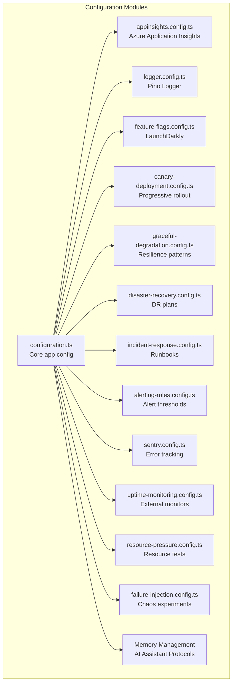
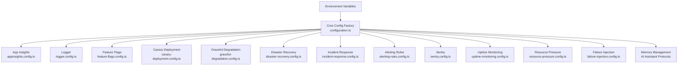

# Configuration Management

<cite>
**Referenced Files in This Document**
- [configuration.ts](file://apps/api/src/config/configuration.ts)
- [appinsights.config.ts](file://apps/api/src/config/appinsights.config.ts)
- [logger.config.ts](file://apps/api/src/config/logger.config.ts)
- [feature-flags.config.ts](file://apps/api/src/config/feature-flags.config.ts)
- [canary-deployment.config.ts](file://apps/api/src/config/canary-deployment.config.ts)
- [graceful-degradation.config.ts](file://apps/api/src/config/graceful-degradation.config.ts)
- [disaster-recovery.config.ts](file://apps/api/src/config/disaster-recovery.config.ts)
- [incident-response.config.ts](file://apps/api/src/config/incident-response.config.ts)
- [alerting-rules.config.ts](file://apps/api/src/config/alerting-rules.config.ts)
- [sentry.config.ts](file://apps/api/src/config/sentry.config.ts)
- [uptime-monitoring.config.ts](file://apps/api/src/config/uptime-monitoring.config.ts)
- [resource-pressure.config.ts](file://apps/api/src/config/resource-pressure.config.ts)
- [failure-injection.config.ts](file://apps/api/src/config/failure-injection.config.ts)
- [qoder-memory-bootstrap.txt](file://scripts/qoder-memory-bootstrap.txt)
- [01-honesty-protocol.txt](file://scripts/memories/01-honesty-protocol.txt)
- [02-dev-standards.txt](file://scripts/memories/02-dev-standards.txt)
- [03-communication-prefs.txt](file://scripts/memories/03-communication-prefs.txt)
- [04-user-identity.txt](file://scripts/memories/04-user-identity.txt)
- [05-ui-ux-prefs.txt](file://scripts/memories/05-ui-ux-prefs.txt)
- [06-prettier-config.txt](file://scripts/memories/06-prettier-config.txt)
- [07-common-pitfalls.txt](file://scripts/memories/07-common-pitfalls.txt)
- [08-prisma-skills.txt](file://scripts/memories/08-prisma-skills.txt)
- [09-iso-standards.txt](file://scripts/memories/09-iso-standards.txt)
- [10-measurable-targets.txt](file://scripts/memories/10-measurable-targets.txt)
</cite>

## Update Summary
**Changes Made**
- Added comprehensive AI assistant memory management system documentation
- Integrated structured memory files covering honesty protocols, development standards, communication preferences, and technical configurations
- Enhanced configuration management with AI-specific memory protocols
- Updated security and compliance configurations with ISO standards integration

## Table of Contents
1. [Introduction](#introduction)
2. [Project Structure](#project-structure)
3. [Core Components](#core-components)
4. [Architecture Overview](#architecture-overview)
5. [Detailed Component Analysis](#detailed-component-analysis)
6. [AI Assistant Memory Management](#ai-assistant-memory-management)
7. [Dependency Analysis](#dependency-analysis)
8. [Performance Considerations](#performance-considerations)
9. [Troubleshooting Guide](#troubleshooting-guide)
10. [Conclusion](#conclusion)

## Introduction
This document provides comprehensive configuration management guidance for Quiz-to-Build, covering environment variables, configuration files, runtime settings, monitoring integrations, feature flags, canary deployments, graceful degradation, security configurations, alerting rules, incident response, disaster recovery, resource pressure handling, failure injection testing, and deployment-specific configurations. It consolidates the configuration patterns established across the codebase to support reliable operations, scalability, and resilience.

**Updated** Added structured AI assistant memory management system with 10 specialized memory files covering honesty protocols, development standards, communication preferences, and technical configurations.

## Project Structure
Configuration management in Quiz-to-Build is organized around modular configuration files located in the API application's config directory. These files define environment-driven settings, monitoring integrations, feature flag management, deployment strategies, resilience patterns, and operational runbooks. The structure supports separation of concerns and enables environment-specific customization.

**Diagram sources**
- [configuration.ts:87-115](file://apps/api/src/config/configuration.ts#L87-L115)
- [appinsights.config.ts:35-52](file://apps/api/src/config/appinsights.config.ts#L35-L52)
- [logger.config.ts:9-62](file://apps/api/src/config/logger.config.ts#L9-L62)
- [feature-flags.config.ts:198-220](file://apps/api/src/config/feature-flags.config.ts#L198-L220)
- [canary-deployment.config.ts:144-153](file://apps/api/src/config/canary-deployment.config.ts#L144-L153)
- [graceful-degradation.config.ts:66-211](file://apps/api/src/config/graceful-degradation.config.ts#L66-L211)
- [disaster-recovery.config.ts:40-47](file://apps/api/src/config/disaster-recovery.config.ts#L40-L47)
- [incident-response.config.ts:136-238](file://apps/api/src/config/incident-response.config.ts#L136-L238)
- [alerting-rules.config.ts:61-81](file://apps/api/src/config/alerting-rules.config.ts#L61-L81)
- [sentry.config.ts:35-45](file://apps/api/src/config/sentry.config.ts#L35-L45)
- [uptime-monitoring.config.ts:12-31](file://apps/api/src/config/uptime-monitoring.config.ts#L12-L31)
- [resource-pressure.config.ts:78-254](file://apps/api/src/config/resource-pressure.config.ts#L78-L254)
- [failure-injection.config.ts:89-222](file://apps/api/src/config/failure-injection.config.ts#L89-L222)

**Section sources**
- [configuration.ts:87-115](file://apps/api/src/config/configuration.ts#L87-L115)

## Core Components
This section outlines the primary configuration components and their responsibilities:

- Core application configuration: Centralizes environment-driven settings including database, Redis, JWT, rate limiting, CORS, logging, email, Claude AI, and frontend URLs.
- Monitoring integrations: Application Insights and Sentry for telemetry, plus external uptime monitoring via UptimeRobot.
- Feature flags: LaunchDarkly-backed configuration with default feature flags and A/B tests.
- Canary deployment: Progressive rollout strategy with health checks, rollback triggers, and notifications.
- Graceful degradation: Circuit breakers, fallbacks, retries, bulkheads, and rate limiting.
- Disaster recovery: Targets, backup configurations, point-in-time recovery, failover, and DR runbooks.
- Incident response: Severity levels, escalation paths, runbooks, and communication channels.
- Alerting rules: Thresholds, channels, and escalation policies for error, performance, security, business, and resource metrics.
- Resource pressure and failure injection: Structured scenarios for CPU, memory, disk, network, and infrastructure failures.
- AI assistant memory management: Structured protocols for AI behavior, communication, and development standards.

**Updated** Enhanced with AI assistant memory management system containing 10 specialized memory files covering honesty protocols, development standards, communication preferences, and technical configurations.

**Section sources**
- [configuration.ts:5-43](file://apps/api/src/config/configuration.ts#L5-L43)
- [appinsights.config.ts:35-52](file://apps/api/src/config/appinsights.config.ts#L35-L52)
- [logger.config.ts:9-62](file://apps/api/src/config/logger.config.ts#L9-L62)
- [feature-flags.config.ts:198-220](file://apps/api/src/config/feature-flags.config.ts#L198-L220)
- [canary-deployment.config.ts:144-153](file://apps/api/src/config/canary-deployment.config.ts#L144-L153)
- [graceful-degradation.config.ts:66-211](file://apps/api/src/config/graceful-degradation.config.ts#L66-L211)
- [disaster-recovery.config.ts:40-47](file://apps/api/src/config/disaster-recovery.config.ts#L40-L47)
- [incident-response.config.ts:136-238](file://apps/api/src/config/incident-response.config.ts#L136-L238)
- [alerting-rules.config.ts:61-81](file://apps/api/src/config/alerting-rules.config.ts#L61-L81)
- [sentry.config.ts:35-45](file://apps/api/src/config/sentry.config.ts#L35-L45)
- [uptime-monitoring.config.ts:12-31](file://apps/api/src/config/uptime-monitoring.config.ts#L12-L31)
- [resource-pressure.config.ts:78-254](file://apps/api/src/config/resource-pressure.config.ts#L78-L254)
- [failure-injection.config.ts:89-222](file://apps/api/src/config/failure-injection.config.ts#L89-L222)

## Architecture Overview
The configuration architecture integrates environment variables, centralized configuration factories, and modular configuration modules. The core configuration factory validates production requirements and builds composite settings. Monitoring, resilience, and operations modules are independently configurable and can be toggled per environment. AI assistant memory management provides structured protocols for AI behavior and communication.

**Diagram sources**
- [configuration.ts:87-115](file://apps/api/src/config/configuration.ts#L87-L115)
- [appinsights.config.ts:65-117](file://apps/api/src/config/appinsights.config.ts#L65-L117)
- [logger.config.ts:9-62](file://apps/api/src/config/logger.config.ts#L9-L62)
- [feature-flags.config.ts:198-220](file://apps/api/src/config/feature-flags.config.ts#L198-L220)
- [canary-deployment.config.ts:144-153](file://apps/api/src/config/canary-deployment.config.ts#L144-L153)
- [graceful-degradation.config.ts:66-211](file://apps/api/src/config/graceful-degradation.config.ts#L66-L211)
- [disaster-recovery.config.ts:40-47](file://apps/api/src/config/disaster-recovery.config.ts#L40-L47)
- [incident-response.config.ts:136-238](file://apps/api/src/config/incident-response.config.ts#L136-L238)
- [alerting-rules.config.ts:61-81](file://apps/api/src/config/alerting-rules.config.ts#L61-L81)
- [sentry.config.ts:35-45](file://apps/api/src/config/sentry.config.ts#L35-L45)
- [uptime-monitoring.config.ts:12-31](file://apps/api/src/config/uptime-monitoring.config.ts#L12-L31)
- [resource-pressure.config.ts:78-254](file://apps/api/src/config/resource-pressure.config.ts#L78-L254)
- [failure-injection.config.ts:89-222](file://apps/api/src/config/failure-injection.config.ts#L89-L222)

## Detailed Component Analysis

### Environment Variables and Core Configuration
The core configuration factory centralizes environment-driven settings and enforces production hardening:
- Production validation ensures required secrets and strong JWT values.
- Redis, JWT, throttling, CORS, logging, email, Claude AI, and frontend URL settings are built from environment variables.
- Default values are provided for development, with strict enforcement in production.

Recommended environment variables:
- JWT_SECRET, JWT_REFRESH_SECRET, DATABASE_URL, REDIS_HOST, REDIS_PORT, REDIS_PASSWORD, CORS_ORIGIN, PORT, API_PREFIX, LOG_LEVEL, EMAIL_FROM, EMAIL_FROM_NAME, BREVO_API_KEY, SENDGRID_API_KEY, ANTHROPIC_API_KEY, CLAUDE_MODEL, CLAUDE_MAX_TOKENS, FRONTEND_URL, VERIFICATION_TOKEN_EXPIRY, PASSWORD_RESET_TOKEN_EXPIRY, BCRYPT_ROUNDS, THROTTLE_TTL, THROTTLE_LIMIT, THROTTLE_LOGIN_LIMIT.

**Section sources**
- [configuration.ts:5-43](file://apps/api/src/config/configuration.ts#L5-L43)
- [configuration.ts:45-115](file://apps/api/src/config/configuration.ts#L45-L115)

### Application Insights Configuration
Application Insights integration provides APM with:
- Connection string or instrumentation key configuration.
- Cloud role tagging and sampling percentages.
- Auto-collection of requests, performance, exceptions, dependencies, and console logs.
- Custom metrics, events, exceptions, dependencies, performance counters, and availability tracking.
- Telemetry client lifecycle management with graceful shutdown.

Operational guidance:
- Set APPLICATIONINSIGHTS_CONNECTION_STRING or APPINSIGHTS_INSTRUMENTATIONKEY.
- Configure AZURE_CLOUD_ROLE and HOSTNAME for environment identification.
- Use getClient() to access the telemetry client and track custom metrics/events.

**Section sources**
- [appinsights.config.ts:35-117](file://apps/api/src/config/appinsights.config.ts#L35-L117)
- [appinsights.config.ts:143-176](file://apps/api/src/config/appinsights.config.ts#L143-L176)
- [appinsights.config.ts:317-330](file://apps/api/src/config/appinsights.config.ts#L317-L330)
- [appinsights.config.ts:538-554](file://apps/api/src/config/appinsights.config.ts#L538-L554)

### Logging Configuration
Pino logger configuration supports:
- JSON output in production and pretty printing in development.
- Correlation IDs via X-Request-Id header.
- Sensitive field redaction for authorization, cookies, and set-cookie headers.
- Structured request/response serializers.
- Environment-driven log levels.

**Section sources**
- [logger.config.ts:9-62](file://apps/api/src/config/logger.config.ts#L9-L62)

### Feature Flags and A/B Testing
LaunchDarkly-backed feature flag management includes:
- Default feature flags with targeting rules, fallthrough variations, and environment settings.
- A/B test configurations with hypotheses, metrics, allocations, and durations.
- Evaluation contexts supporting user attributes and custom properties.
- Local evaluation for development and SDK integration for production.

Recommended environment variables:
- LAUNCHDARKLY_SDK_KEY, LAUNCHDARKLY_CLIENT_SIDE_ID, LAUNCHDARKLY_PROJECT_KEY, LAUNCHDARKLY_OFFLINE.

**Section sources**
- [feature-flags.config.ts:198-220](file://apps/api/src/config/feature-flags.config.ts#L198-L220)
- [feature-flags.config.ts:229-596](file://apps/api/src/config/feature-flags.config.ts#L229-L596)
- [feature-flags.config.ts:605-690](file://apps/api/src/config/feature-flags.config.ts#L605-L690)

### Canary Deployment Strategy
Progressive rollout with:
- Staged traffic weights (5% → 25% → 50% → 100%).
- Health checks for readiness, liveness, and custom endpoints.
- Rollback triggers for error rates, latency, pod restarts, and resource usage.
- Notification channels for Teams, Slack, email, and PagerDuty.
- Metrics collection and automated promotion with manual approval gates.

Operational guidance:
- Configure TEAMS_WEBHOOK_URL, SLACK_WEBHOOK_URL, ALERT_EMAIL, PAGERDUTY_INTEGRATION_URL.
- Review and adjust thresholds per environment.

**Section sources**
- [canary-deployment.config.ts:144-232](file://apps/api/src/config/canary-deployment.config.ts#L144-L232)
- [canary-deployment.config.ts:237-265](file://apps/api/src/config/canary-deployment.config.ts#L237-L265)
- [canary-deployment.config.ts:267-335](file://apps/api/src/config/canary-deployment.config.ts#L267-L335)
- [canary-deployment.config.ts:356-424](file://apps/api/src/config/canary-deployment.config.ts#L356-L424)

### Graceful Degradation Patterns
Resilience mechanisms include:
- Circuit breakers with thresholds, timeouts, fallbacks, and monitoring.
- Fallback handlers supporting cache, queue, default values, alternative endpoints, and local cache.
- Retry with exponential backoff and jitter for databases, external APIs, emails, and file uploads.
- Bulkhead isolation with permits, queue depth, and wait timeouts.
- Rate limiting for per-user, global, login, email sending, and file upload scenarios.

**Section sources**
- [graceful-degradation.config.ts:66-211](file://apps/api/src/config/graceful-degradation.config.ts#L66-L211)
- [graceful-degradation.config.ts:240-326](file://apps/api/src/config/graceful-degradation.config.ts#L240-L326)
- [graceful-degradation.config.ts:351-439](file://apps/api/src/config/graceful-degradation.config.ts#L351-L439)
- [graceful-degradation.config.ts:555-593](file://apps/api/src/config/graceful-degradation.config.ts#L555-L593)
- [graceful-degradation.config.ts:692-734](file://apps/api/src/config/graceful-degradation.config.ts#L692-L734)

### Disaster Recovery Planning
Targets and procedures:
- RTO/RPO targets, backup schedules, retention policies, storage redundancy, encryption, and validation.
- Point-in-time recovery (PITR) configuration aligned with RPO.
- Failover modes (active-passive, active-active, pilot-light, warm-standby) with DNS and database settings.
- DR runbooks for region failover, database PITR, and full system restore.
- DR testing cadence and success criteria.

**Section sources**
- [disaster-recovery.config.ts:40-47](file://apps/api/src/config/disaster-recovery.config.ts#L40-L47)
- [disaster-recovery.config.ts:113-309](file://apps/api/src/config/disaster-recovery.config.ts#L113-L309)
- [disaster-recovery.config.ts:323-331](file://apps/api/src/config/disaster-recovery.config.ts#L323-L331)
- [disaster-recovery.config.ts:386-424](file://apps/api/src/config/disaster-recovery.config.ts#L386-L424)
- [disaster-recovery.config.ts:455-690](file://apps/api/src/config/disaster-recovery.config.ts#L455-L690)
- [disaster-recovery.config.ts:724-777](file://apps/api/src/config/disaster-recovery.config.ts#L724-L777)

### Incident Response Procedures
Severity definitions, escalation paths, and runbooks:
- Four severity levels with response targets and escalation delays.
- Escalation paths with notification channels and auto-escalation rules.
- Runbooks for production outages, high error rates, security incidents, and database issues.
- Oncall scheduling and communication configuration.

**Section sources**
- [incident-response.config.ts:136-238](file://apps/api/src/config/incident-response.config.ts#L136-L238)
- [incident-response.config.ts:247-331](file://apps/api/src/config/incident-response.config.ts#L247-L331)
- [incident-response.config.ts:340-753](file://apps/api/src/config/incident-response.config.ts#L340-L753)
- [incident-response.config.ts:762-786](file://apps/api/src/config/incident-response.config.ts#L762-L786)
- [incident-response.config.ts:795-800](file://apps/api/src/config/incident-response.config.ts#L795-L800)

### Alerting Rules and Notifications
Comprehensive alerting thresholds and policies:
- Error, performance, security, business, and resource alert categories with severity and channels.
- Global alert configuration including evaluation intervals, resolve timeouts, and inhibition rules.
- Notification channels: email, Slack, Teams, PagerDuty, SMS, and webhooks.
- Escalation policies for default and critical severities.

**Section sources**
- [alerting-rules.config.ts:61-81](file://apps/api/src/config/alerting-rules.config.ts#L61-L81)
- [alerting-rules.config.ts:656-665](file://apps/api/src/config/alerting-rules.config.ts#L656-L665)
- [alerting-rules.config.ts:690-692](file://apps/api/src/config/alerting-rules.config.ts#L690-L692)
- [alerting-rules.config.ts:536-577](file://apps/api/src/config/alerting-rules.config.ts#L536-L577)
- [alerting-rules.config.ts:597-647](file://apps/api/src/config/alerting-rules.config.ts#L597-L647)

### Sentry Error Tracking
Sentry integration for error tracking and performance monitoring:
- DSN, environment, release, and sampling configuration.
- Optional profiling integration with dynamic loading.
- Before-send filtering for sensitive headers and breadcrumbs.
- User context, breadcrumbs, transactions, and alerting rules.

**Section sources**
- [sentry.config.ts:35-45](file://apps/api/src/config/sentry.config.ts#L35-L45)
- [sentry.config.ts:51-127](file://apps/api/src/config/sentry.config.ts#L51-L127)
- [sentry.config.ts:132-161](file://apps/api/src/config/sentry.config.ts#L132-L161)
- [sentry.config.ts:184-189](file://apps/api/src/config/sentry.config.ts#L184-L189)
- [sentry.config.ts:194-216](file://apps/api/src/config/sentry.config.ts#L194-L216)

### Uptime Monitoring
External uptime monitoring configuration:
- SLA targets and response time goals.
- Health check endpoints for API and web applications.
- UptimeRobot configuration with monitors and status page.
- Alert channels, thresholds, and escalation levels.
- Severity levels and auto-incident rules.

**Section sources**
- [uptime-monitoring.config.ts:12-31](file://apps/api/src/config/uptime-monitoring.config.ts#L12-L31)
- [uptime-monitoring.config.ts:36-94](file://apps/api/src/config/uptime-monitoring.config.ts#L36-L94)
- [uptime-monitoring.config.ts:100-149](file://apps/api/src/config/uptime-monitoring.config.ts#L100-L149)
- [uptime-monitoring.config.ts:155-210](file://apps/api/src/config/uptime-monitoring.config.ts#L155-L210)
- [uptime-monitoring.config.ts:216-268](file://apps/api/src/config/uptime-monitoring.config.ts#L216-L268)

### Resource Pressure Testing
Structured resource pressure scenarios:
- CPU pressure tests (80%, 90%, spikes), memory pressure tests (80%, 90%, leak simulation), disk pressure tests (85%, 95%, I/O saturation), network pressure tests (bandwidth saturation, connection exhaustion, FD exhaustion).
- Expected behaviors, validation checks, and alert configurations for each scenario.

**Section sources**
- [resource-pressure.config.ts:78-254](file://apps/api/src/config/resource-pressure.config.ts#L78-L254)
- [resource-pressure.config.ts:260-445](file://apps/api/src/config/resource-pressure.config.ts#L260-L445)
- [resource-pressure.config.ts:451-621](file://apps/api/src/config/resource-pressure.config.ts#L451-L621)
- [resource-pressure.config.ts:627-790](file://apps/api/src/config/resource-pressure.config.ts#L627-L790)

### Failure Injection Testing
Comprehensive failure injection scenarios:
- Database failures (connection timeouts, pool exhaustion, query timeouts, connection resets).
- External API failures (Stripe, SendGrid, Azure Storage, OAuth providers).
- Network failures (latency, partitions, packet loss, DNS failures).
- Pod/container failures (single/multiple kills, OOM, startup failures).
- Compute resource pressure (CPU, memory) with rollback triggers.

**Section sources**
- [failure-injection.config.ts:89-222](file://apps/api/src/config/failure-injection.config.ts#L89-L222)
- [failure-injection.config.ts:228-368](file://apps/api/src/config/failure-injection.config.ts#L228-L368)
- [failure-injection.config.ts:374-537](file://apps/api/src/config/failure-injection.config.ts#L374-L537)
- [failure-injection.config.ts:543-671](file://apps/api/src/config/failure-injection.config.ts#L543-L671)
- [failure-injection.config.ts:677-800](file://apps/api/src/config/failure-injection.config.ts#L677-L800)

## AI Assistant Memory Management

**New Section** Added comprehensive AI assistant memory management system documentation

The AI assistant memory management system provides structured protocols for AI behavior, communication, and development standards through 10 specialized memory files. This system ensures consistent AI behavior across all assistant interactions while maintaining strict adherence to honesty protocols and development standards.

### Memory System Architecture
The memory management system consists of 10 specialized memory files, each containing specific protocols and configurations:

#### Memory File Categories

1. **Honesty Protocol** (01-honesty-protocol.txt)
   - Mandatory honesty rules with no exceptions
   - Verification requirements before declarations
   - Immediate mistake admission procedures
   - Evidence-based completion claims

2. **Development Standards** (02-dev-standards.txt)
   - Performance requirements (Lighthouse 90+, INP ≤200ms)
   - Error handling and validation protocols
   - Responsive design breakpoints
   - Security best practices
   - Accessibility compliance (WCAG)

3. **Communication Preferences** (03-communication-prefs.txt)
   - Status update frequency (every 5 minutes)
   - Command response style (imperative verb-first)
   - Task management protocols
   - Debugging procedures

4. **User Identity** (04-user-identity.txt)
   - GitHub username identification
   - Azure subscription details
   - User profile information

5. **UI/UX Preferences** (05-ui-ux-prefs.txt)
   - Nielsen's 10 heuristics enforcement
   - Dark mode preference
   - Micro-animation requirements
   - Accessible-first design approach

6. **Prettier Configuration** (06-prettier-config.txt)
   - Code formatting standards
   - Quote preferences and spacing
   - Line width and tab settings

7. **Common Pitfalls** (07-common-pitfalls.txt)
   - Windows PowerShell considerations
   - JSON editing best practices
   - Prisma development guidelines
   - Testing framework configurations

8. **Prisma Skills** (08-prisma-skills.txt)
   - Schema evolution procedures
   - Migration management
   - JSON field handling
   - Client regeneration protocols

9. **ISO Standards** (09-iso-standards.txt)
   - ISO/IEC 5055 and 25010 compliance
   - Security by design principles
   - Code quality metrics
   - Review checklist protocols

10. **Measurable Targets** (10-measurable-targets.txt)
    - ISO/IEC 5055 performance targets
    - Cyclomatic complexity limits
    - DORA metrics compliance
    - Security gate requirements

### Memory Bootstrap Process
The system uses a bootstrap process defined in `qoder-memory-bootstrap.txt` which loads all 10 memory files as separate memories for the AI assistant. This ensures comprehensive coverage of all protocols and standards.

### Integration with Configuration Management
The AI memory management system integrates seamlessly with the existing configuration management framework:

- **Environment Integration**: Memory protocols can be loaded from environment variables or configuration files
- **Validation**: Memory content is validated against predefined standards and protocols
- **Version Control**: Memory files are tracked in version control for auditability
- **Security**: Sensitive information in memory files is protected through appropriate access controls

### Operational Procedures
- Memory files are loaded during AI assistant initialization
- Protocols are validated and stored in memory structures
- Communication preferences are applied to all assistant responses
- Development standards are enforced during code generation and review processes
- Honesty protocols ensure transparent and verifiable AI behavior

**Section sources**
- [qoder-memory-bootstrap.txt:1-75](file://scripts/qoder-memory-bootstrap.txt#L1-L75)
- [01-honesty-protocol.txt:1-11](file://scripts/memories/01-honesty-protocol.txt#L1-L11)
- [02-dev-standards.txt:1-11](file://scripts/memories/02-dev-standards.txt#L1-L11)
- [03-communication-prefs.txt:1-9](file://scripts/memories/03-communication-prefs.txt#L1-L9)
- [04-user-identity.txt:1-5](file://scripts/memories/04-user-identity.txt#L1-L5)
- [05-ui-ux-prefs.txt:1-6](file://scripts/memories/05-ui-ux-prefs.txt#L1-L6)
- [06-prettier-config.txt:1-4](file://scripts/memories/06-prettier-config.txt#L1-L4)
- [07-common-pitfalls.txt:1-10](file://scripts/memories/07-common-pitfalls.txt#L1-L10)
- [08-prisma-skills.txt:1-7](file://scripts/memories/08-prisma-skills.txt#L1-L7)
- [09-iso-standards.txt:1-10](file://scripts/memories/09-iso-standards.txt#L1-L10)
- [10-measurable-targets.txt:1-10](file://scripts/memories/10-measurable-targets.txt#L1-L10)

## Dependency Analysis
Configuration modules depend on environment variables and each other to form a cohesive operational framework. The core configuration factory depends on environment variables for database, Redis, JWT, and other services. Monitoring modules depend on their respective SDKs and environment keys. Feature flags integrate with LaunchDarkly. Canary deployment relies on Azure Container Apps and notification channels. Graceful degradation patterns are applied across services. Disaster recovery and incident response procedures are documented and tested via resource pressure and failure injection scenarios.

**Updated** Added AI assistant memory management dependencies and integration points.

```mermaid
graph TB
EV["Environment Variables"]
CC["Core Config<br/>configuration.ts"]
AI["App Insights<br/>appinsights.config.ts"]
LG["Logger<br/>logger.config.ts"]
FF["Feature Flags<br/>feature-flags.config.ts"]
CD["Canary<br/>canary-deployment.config.ts"]
GD["Graceful Degradation<br/>graceful-degradation.config.ts"]
DR["Disaster Recovery<br/>disaster-recovery.config.ts"]
IR["Incident Response<br/>incident-response.config.ts"]
AR["Alerting Rules<br/>alerting-rules.config.ts"]
SN["Sentry<br/>sentry.config.ts"]
UM["Uptime Monitoring<br/>uptime-monitoring.config.ts"]
RP["Resource Pressure<br/>resource-pressure.config.ts"]
FI["Failure Injection<br/>failure-injection.config.ts"]
MM["Memory Management<br/>AI Assistant Protocols"]
MB["Memory Bootstrap<br/>qoder-memory-bootstrap.txt"]
M1["Honesty Protocol<br/>01-honesty-protocol.txt"]
M2["Dev Standards<br/>02-dev-standards.txt"]
M3["Comm Prefs<br/>03-communication-prefs.txt"]
M4["User Identity<br/>04-user-identity.txt"]
M5["UI/UX Prefs<br/>05-ui-ux-prefs.txt"]
M6["Prettier Config<br/>06-prettier-config.txt"]
M7["Common Pitfalls<br/>07-common-pitfalls.txt"]
M8["Prisma Skills<br/>08-prisma-skills.txt"]
M9["ISO Standards<br/>09-iso-standards.txt"]
M10["Measurable Targets<br/>10-measurable-targets.txt"]
EV --> CC
CC --> AI
CC --> LG
CC --> FF
CC --> CD
CC --> GD
CC --> DR
CC --> IR
CC --> AR
CC --> SN
CC --> UM
CC --> RP
CC --> FI
CC --> MM
MM --> MB
MB --> M1
MB --> M2
MB --> M3
MB --> M4
MB --> M5
MB --> M6
MB --> M7
MB --> M8
MB --> M9
MB --> M10
```

**Diagram sources**
- [configuration.ts:87-115](file://apps/api/src/config/configuration.ts#L87-L115)
- [appinsights.config.ts:35-52](file://apps/api/src/config/appinsights.config.ts#L35-L52)
- [logger.config.ts:9-62](file://apps/api/src/config/logger.config.ts#L9-L62)
- [feature-flags.config.ts:198-220](file://apps/api/src/config/feature-flags.config.ts#L198-L220)
- [canary-deployment.config.ts:144-153](file://apps/api/src/config/canary-deployment.config.ts#L144-L153)
- [graceful-degradation.config.ts:66-211](file://apps/api/src/config/graceful-degradation.config.ts#L66-L211)
- [disaster-recovery.config.ts:40-47](file://apps/api/src/config/disaster-recovery.config.ts#L40-L47)
- [incident-response.config.ts:136-238](file://apps/api/src/config/incident-response.config.ts#L136-L238)
- [alerting-rules.config.ts:61-81](file://apps/api/src/config/alerting-rules.config.ts#L61-L81)
- [sentry.config.ts:35-45](file://apps/api/src/config/sentry.config.ts#L35-L45)
- [uptime-monitoring.config.ts:12-31](file://apps/api/src/config/uptime-monitoring.config.ts#L12-L31)
- [resource-pressure.config.ts:78-254](file://apps/api/src/config/resource-pressure.config.ts#L78-L254)
- [failure-injection.config.ts:89-222](file://apps/api/src/config/failure-injection.config.ts#L89-L222)
- [qoder-memory-bootstrap.txt:1-75](file://scripts/qoder-memory-bootstrap.txt#L1-L75)

**Section sources**
- [configuration.ts:87-115](file://apps/api/src/config/configuration.ts#L87-L115)

## Performance Considerations
- Use Application Insights and Sentry sampling to balance observability and cost.
- Configure graceful degradation thresholds to maintain acceptable latency under load.
- Tune Redis and database connection pools to prevent exhaustion.
- Implement exponential backoff and jitter for retries to avoid thundering herd effects.
- Monitor resource pressure scenarios regularly and adjust autoscaling policies.
- **Updated** AI memory management adds minimal overhead while ensuring consistent performance across assistant interactions.

## Troubleshooting Guide
Common configuration issues and resolutions:
- Missing production environment variables: Ensure JWT_SECRET, JWT_REFRESH_SECRET, and DATABASE_URL are set with strong values.
- Application Insights not initializing: Verify APPLICATIONINSIGHTS_CONNECTION_STRING or APPINSIGHTS_INSTRUMENTATIONKEY and cloud role settings.
- Logger redaction issues: Confirm sensitive fields are included in redaction paths.
- Feature flags not updating: Check LAUNCHDARKLY_SDK_KEY and environment key alignment.
- Canary deployment stuck: Review health check thresholds and rollback triggers; verify notification channels.
- Graceful degradation not engaging: Validate circuit breaker thresholds and fallback configurations.
- Disaster recovery procedures: Confirm backup schedules, PITR settings, and failover configurations.
- Incident response: Verify escalation paths and communication channels.
- Alerting rules: Ensure thresholds align with environment baselines and channels are configured.
- Sentry integration: Confirm DSN and ignore errors for non-actionable events.
- Uptime monitoring: Validate UptimeRobot API key and monitor endpoints.
- Resource pressure and failure injection: Execute scenarios in staging and adjust thresholds accordingly.
- **Updated** AI memory management troubleshooting: Verify memory file integrity, check bootstrap process, ensure protocol compliance, and validate communication preferences.

**Section sources**
- [configuration.ts:5-43](file://apps/api/src/config/configuration.ts#L5-L43)
- [appinsights.config.ts:65-117](file://apps/api/src/config/appinsights.config.ts#L65-L117)
- [logger.config.ts:27-31](file://apps/api/src/config/logger.config.ts#L27-L31)
- [feature-flags.config.ts:198-220](file://apps/api/src/config/feature-flags.config.ts#L198-L220)
- [canary-deployment.config.ts:267-335](file://apps/api/src/config/canary-deployment.config.ts#L267-L335)
- [graceful-degradation.config.ts:66-211](file://apps/api/src/config/graceful-degradation.config.ts#L66-L211)
- [disaster-recovery.config.ts:113-309](file://apps/api/src/config/disaster-recovery.config.ts#L113-L309)
- [incident-response.config.ts:247-331](file://apps/api/src/config/incident-response.config.ts#L247-L331)
- [alerting-rules.config.ts:61-81](file://apps/api/src/config/alerting-rules.config.ts#L61-L81)
- [sentry.config.ts:51-127](file://apps/api/src/config/sentry.config.ts#L51-L127)
- [uptime-monitoring.config.ts:100-149](file://apps/api/src/config/uptime-monitoring.config.ts#L100-L149)
- [resource-pressure.config.ts:78-254](file://apps/api/src/config/resource-pressure.config.ts#L78-L254)
- [failure-injection.config.ts:89-222](file://apps/api/src/config/failure-injection.config.ts#L89-L222)

## Conclusion
Quiz-to-Build's configuration management establishes a robust foundation for operations, resilience, and scalability. By leveraging environment-driven settings, comprehensive monitoring, feature flags, canary deployments, graceful degradation, disaster recovery, and incident response procedures, the system maintains reliability across environments. Regular execution of resource pressure and failure injection tests ensures preparedness for real-world incidents, while alerting rules and operational runbooks streamline incident resolution.

**Updated** The addition of the AI assistant memory management system enhances the configuration framework with structured protocols for AI behavior, communication, and development standards. This system ensures consistent AI performance while maintaining strict adherence to honesty protocols and ISO compliance standards, providing a comprehensive foundation for AI-assisted development workflows.